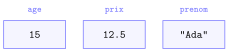
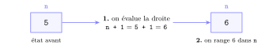
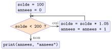
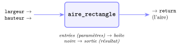

# Cours

<p class="sous-titre">Les bases de la programmation Python</p>

<span id="chap-01" class="ancre"></span>

|  |  |
|:---|:---|
| **Programme (BO)** | *« Mettre en évidence un corpus de constructions élémentaires. »* Ces constructions sont : *« séquences, affectation, conditionnelles, boucles bornées, boucles non bornées, appels de fonction »*. On y ajoute la *spécification* d’une fonction (prototype, préconditions, postconditions) et l’usage de *jeux de tests*. |
| **Prérequis** | aucun. Il suffit de savoir ouvrir une console ou un éditeur Python en ligne. |
| **Objectifs** | *lire*, *écrire* et *exécuter* un programme simple ; maîtriser les six constructions élémentaires ; *spécifier* et *tester* une fonction. C’est le socle de toute l’année (et de toute la suite). |

## Programmer, c’est quoi ?

Un **programme** est une suite d’instructions, écrites dans un **langage de programmation**, qu’un ordinateur exécute pour accomplir une tâche. L’idée est plus ancienne que les ordinateurs eux-mêmes : dès 1843, la mathématicienne **Ada Lovelace** rédige ce que l’on considère comme le premier programme de l’histoire, destiné à une machine qui ne sera jamais construite. Le mot **algorithme**, lui, vient du nom du savant persan **al-Khwârizmî** (IX<sup>e</sup> siècle).

!!! remarque "Remarque — Un peu d’histoire"

    **Ada Lovelace** (1815–1852), fille du poète Byron, se passionne pour la *machine analytique* imaginée par l’Anglais **Charles Babbage** : une calculatrice mécanique programmable par cartes perforées. En 1843, elle traduit un article sur cette machine et l’enrichit de notes trois fois plus longues que le texte. La dernière, la **note G**, détaille pas à pas comment la machine calculerait les *nombres de Bernoulli*, avec des opérations répétées : c’est le premier programme publié. Mille ans plus tôt, vers 820, **al-Khwârizmî**, savant de la « Maison de la sagesse » de Bagdad, écrit un traité de calcul dont le titre a donné le mot *algèbre* (*al-jabr*), et un autre sur les chiffres indiens dont la traduction latine, *Algoritmi de numero Indorum*, a donné le mot *algorithme*.

    \*(image manquante : 01_hist_ada_lovelace)\*  
    Ada Lovelace (portrait par A. E. Chalon, v. 1840)

    \*(image manquante : 01_hist_note_g_bernoulli)\*  
    Le tableau de la note G (1843)

    \*(image manquante : 01_hist_al_khwarizmi)\*  
    L’*Algèbre* d’al-Khwârizmî (copie de 1342, Oxford)

!!! definition "Définition 1 — Algorithme et programme"

    Un **algorithme** est une méthode : une suite finie et non ambiguë d’étapes qui, à partir de données, produit un résultat. Un **programme** est la *traduction* d’un algorithme dans un langage que la machine peut exécuter.

Nous utiliserons le langage **Python**, créé en 1991 par le Néerlandais **Guido van Rossum**. Il est aujourd’hui l’un des langages les plus enseignés et les plus utilisés au monde, pour sa lisibilité.

!!! remarque "Remarque — Pourquoi « Python » ?"

    Rien à voir avec le serpent ! Guido van Rossum était fan de la troupe comique britannique *Monty Python*. C’est pourquoi la documentation officielle fourmille encore de références à leurs sketchs (et de `spam`, `eggs` et autres `ham` en guise d’exemples).

### La première construction : la séquence

Quand on écrit plusieurs instructions les unes sous les autres, Python les exécute **dans l’ordre**, de haut en bas, une à la fois. C’est la construction la plus simple : la **séquence**.

!!! exemple "Exemple — Testez ce programme dans une console ou un éditeur en ligne"

    ```python
    print("Bonjour")
    print("et")
    print("au revoir")
    ```

    ??? corrige "Correction"

        Les trois lignes s’affichent dans l’ordre où elles sont écrites :

        ```text
        Bonjour
        et
        au revoir
        ```

!!! regle "Règle 1 — L’ordre compte"

    Dans une séquence, l’ordre des instructions détermine le résultat. Échanger deux lignes peut tout changer : la machine ne « devine » pas votre intention, elle applique vos instructions à la lettre.

!!! remarque "Remarque"

    `print(...)` est un **appel de fonction** : on demande à une fonction déjà écrite (`print`) d’*afficher* ce qu’on lui donne entre parenthèses. Nous reviendrons longuement sur les fonctions.

## Variables et affectation

### À quoi sert une variable ?

Un programme manipule des **données** : un âge, un prix, un nom, une note… Pour les conserver et les réutiliser, on leur donne un **nom**. Ce nom, associé à une valeur, s’appelle une **variable**.

```python
age = 15
prix = 12.5
prenom = "Ada"
```

!!! definition "Définition 2 — Variable"

    Une **variable** est un nom qui désigne un emplacement de la mémoire où est rangée une valeur. On peut *lire* cette valeur (l’utiliser) et l’*écrire* (la modifier).

L’image classique est celle du **casier étiqueté** : le nom de la variable est l’étiquette collée sur le casier, la valeur est ce qui se trouve à l’intérieur. On ne s’intéresse jamais à *l’adresse exacte* du casier dans la mémoire ; l’étiquette suffit.

{ .tikz loading=lazy }

Trois casiers en mémoire : l’étiquette (le nom) désigne le contenu (la valeur).

### L’affectation : une histoire en deux temps

L’instruction `age = 15` s’appelle une **affectation**. Le symbole `=` ne veut **pas** dire « égal » au sens mathématique : il veut dire « **prend pour valeur** », ou « reçoit ». On lit `age = 15` comme « *age reçoit 15* ».

!!! regle "Règle 2 — Le mécanisme de l’affectation"

    Une affectation `nom = expression` se déroule toujours en **deux temps** :

    1.  Python **évalue d’abord la partie droite** (il calcule la valeur de l’expression) ;

    2.  puis il **range cette valeur** dans la variable nommée à gauche.

    On lit et on calcule à *droite*, on range à *gauche*.

Ce mécanisme éclaire une ligne qui, sinon, semble absurde en mathématiques :

```python
n = 5
n = n + 1
```

{ .tikz loading=lazy }

La valeur de `n` passe donc de `5` à `6`. Cette écriture, très fréquente, s’appelle un **incrément**.

!!! exemple "Exemple — Le grand classique : échanger le contenu de deux variables. Prévoyez l’affichage"

    ```python
    a = 1
    b = 2
    a = b
    b = a
    print(a, b)
    ```

    ??? corrige "Correction"

        Beaucoup attendent `2 1`… mais le programme affiche `2 2` ! À la ligne `a = b`, `a` vaut désormais `2` ; la valeur `1` est **perdue**. La ligne suivante range donc `2` (la valeur actuelle de `a`) dans `b`.

!!! regle "Règle 3 — Échanger deux variables"

    Pour ne pas perdre une valeur, on utilise une **variable temporaire** :

```python
a = 1
b = 2
temp = a      # on met a l'abri la valeur de a
a = b
b = temp
print(a, b)   # affiche : 2 1
```

!!! remarque "Remarque"

    La variable temporaire est **indispensable** : sans elle, la première affectation `a = b` écraserait la valeur de `a`, alors définitivement perdue. C’est l’image des deux verres, l’un d’eau, l’autre de jus : pour intervertir leurs contenus, il faut un **troisième verre vide**.

### Les types de données de base

Chaque valeur a un **type**, qui décrit sa nature et les opérations permises. En classe de première, quatre types de base suffisent :

| **Type** | **Nature**                      | **Exemples**          |
|:---------|:--------------------------------|:----------------------|
| `int`    | entier                          | `15`, `-3`, `0`       |
| `float`  | nombre à virgule (« flottant ») | `12.5`, `-0.1`, `3.0` |
| `str`    | chaîne de caractères (texte)    | `"Ada"`, `’bonjour’`  |
| `bool`   | booléen (vrai/faux)             | `True`, `False`       |

La fonction `type(...)` renvoie le type d’une valeur :

```python
type(15)       # <class 'int'>
type(12.5)     # <class 'float'>
type("Ada")    # <class 'str'>
type(3 == 3)   # <class 'bool'>
```

Sur les nombres, Python dispose des opérations usuelles, et de deux opérations propres à la division **entière** :

| `+` | `-` | `*` | `/` | `//` | `%` | `**` |
|:--:|:--:|:--:|:--:|:--:|:--:|:--:|
| addition | soustraction | multiplication | division | quotient entier | reste | puissance |
| `7 + 2` $\to$ `9` | `7 - 2` $\to$ `5` | `7 * 2` $\to$ `14` | `7 / 2` $\to$ `3.5` | `7 // 2` $\to$ `3` | `7 % 2` $\to$ `1` | `7 ** 2` $\to$ `49` |

!!! remarque "Remarque"

    Python est à **typage dynamique** : on ne déclare pas le type d’une variable, il est déduit de la valeur rangée, et il peut changer au fil du programme. Pratique, mais il faut rester vigilant : additionner un `int` et un `str` provoque une erreur.

!!! remarque "Remarque — Deux pièges célèbres à connaître"

    - **Les entiers de Python sont de taille arbitraire.** Contrairement à beaucoup de langages, Python calcule `2 ** 1000` sans broncher : la seule limite est la mémoire de la machine.

    - **Les flottants sont approximatifs.** Testez `0.1 + 0.2` : Python répond `0.30000000000000004` ! Un nombre à virgule est stocké en binaire de manière approchée. **On n’écrit donc jamais** `if x == 0.3` **sur des flottants** ; on teste plutôt si l’écart est très petit.

### Lire une entrée au clavier et convertir

La fonction `input(...)` affiche un message, attend que l’utilisateur tape quelque chose au clavier puis valide, et **renvoie ce qui a été tapé**, **toujours sous forme de chaîne** (`str`), même si l’on a tapé des chiffres. Pour calculer avec, il faut donc **convertir** la valeur dans le bon type :

| **Conversion** | **Rôle**         | **Exemple**                  |
|:---------------|:-----------------|:-----------------------------|
| `int(...)`     | vers un entier   | `int("17")` $\to$ `17`       |
| `float(...)`   | vers un flottant | `float("12.5")` $\to$ `12.5` |
| `str(...)`     | vers une chaîne  | `str(17)` $\to$ `"17"`       |

```python
age = int(input("Votre age ? "))   # on tape 16 : age vaut 16
print("Dans un an, vous aurez", age + 1, "ans")
```

!!! remarque "Remarque"

    Sans `int`, `age` vaudrait la chaîne `"16"`, et `age + 1` provoquerait une erreur : on ne peut pas additionner un `str` et un `int`. De même, `int("deux")` provoque une erreur : la chaîne doit représenter un nombre.

### Premier contact avec les chaînes de caractères

Une chaîne est une **suite de caractères**, numérotés à partir de `0`. Voici les opérations dont on se sert dès ce chapitre ; le chapitre *Les types construits* les reprendra en détail.

```text
>>> mot = "radar"
>>> len(mot)            # nombre de caracteres
5
>>> mot[0]              # caractere en position 0 : le premier
'r'
>>> mot[-1]             # le dernier caractere
'r'
>>> "d" in mot          # ce caractere est-il dans la chaine ?
True
>>> "Ada" + " Lovelace" # concatenation : on met bout a bout
'Ada Lovelace'
>>> "*" * 3             # repetition
'***'
```

Si `mot` a `n` caractères, les positions vont de `0` à `n - 1` : `mot[n]` provoque une erreur. On verra avec la boucle `for` comment parcourir une chaîne caractère par caractère.

### Bien nommer ses variables

Un programme se lit bien plus souvent qu’il ne s’écrit. Le choix des noms est donc essentiel.

!!! regle "Règle 4 — Règles et conventions de nommage"

    - un nom commence par une lettre ou `_`, puis lettres, chiffres, `_` ; **pas d’espace**, pas d’accent conseillé ;

    - Python distingue les majuscules : `note` et `Note` sont deux variables différentes ;

    - par convention, on écrit en `minuscules_avec_underscores` (style *snake_case*) ;

    - on choisit des noms **parlants** : `prix_total` plutôt que `x` ou `truc` ;

    - on ne peut pas utiliser un **mot réservé** du langage (`if`, `for`, `while`, `def`, `return`…).

!!! encadre "Écrire une fonction : le gabarit"

    Dès les premiers exercices, on vous demande d’« écrire une fonction ». Pour l’instant, utilisez-la comme une **boîte noire** : on lui donne des valeurs (les **paramètres**), elle **renvoie** un résultat. Il suffit de recopier ce gabarit ; la section *Les fonctions* l’approfondira.

    ```python
    def nom_de_la_fonction(parametre1, parametre2):
        resultat = ...      # le calcul, avec les parametres
        return resultat     # la valeur renvoyee
    ```

    - la ligne `def` se termine par un **deux-points** `:` ; les lignes suivantes sont **décalées** de 4 espaces ;

    - `return` indique la valeur que la fonction renvoie ;

    - certaines fonctions des exercices **affichent** (avec `print`) au lieu de renvoyer : on les appelle de la même façon.

!!! exemple "Exemple — Le prix d’un achat"

    Écrire une fonction `prix_total(prix, quantite)` qui renvoie le prix à payer pour `quantite` articles à `prix` euros pièce.

    ??? corrige "Correction"

        On suit le gabarit :

        ```python
        def prix_total(prix, quantite):
            total = prix * quantite
            return total
        ```

        On exécute d’abord le fichier : la définition seule n’affiche **rien**. Puis on **appelle** la fonction dans la console, avec des valeurs dont on connaît le résultat, pour la **tester** :

        ```text
        >>> prix_total(2.5, 4)
        10.0
        >>> prix_total(3, 0)
        0
        ```

<span id="cours-01-1" class="ancre"></span>

<span class="afaire">▶ Exercices d'application :</span> exercices **[1](exercices.md#ex-01-1) à [5](exercices.md#ex-01-5)** (variables, affectation, `//` et `%` ; les fonctions s’écrivent avec le gabarit ci-dessus)

## Les conditionnelles : `if`, `elif`, `else`

Jusqu’ici, tout s’exécutait ligne après ligne. Or un programme doit souvent **choisir** entre plusieurs comportements selon les données. C’est le rôle de la construction **conditionnelle**.

### Booléens et conditions

Une **condition** est une expression dont la valeur est un booléen : `True` ou `False`. On la construit avec des **opérateurs de comparaison** :

| `==` |   `!=`    |    `<`    |     `<=`     |    `>`    |     `>=`     |
|:----:|:---------:|:---------:|:------------:|:---------:|:------------:|
| égal | différent | inférieur | inf. ou égal | supérieur | sup. ou égal |

!!! regle "Règle 5 — = n’est pas =="

    `=` **affecte** une valeur (« reçoit ») ; `==` **teste l’égalité** (« est-il égal à ? ») et renvoie un booléen. Les confondre est l’une des erreurs les plus fréquentes du débutant.

On combine plusieurs conditions avec les **opérateurs booléens** `and`, `or`, `not` :

```python
age = 16
age >= 13 and age <= 17    # True : un adolescent
not (age == 18)            # True
```

!!! remarque "Remarque — Évaluation « paresseuse » (au programme)"

    Les opérateurs `and` et `or` sont **séquentiels** : Python évalue les conditions *de gauche à droite* et s’arrête dès que le résultat est connu. Dans `a and b`, si `a` est déjà `False`, `b` n’est même pas évalué (le résultat est forcément `False`). On exploite cela pour se protéger, par exemple dans `n != 0 and total / n > 1`.

### La syntaxe : le rôle capital de l’indentation

```python
temperature = 12
if temperature < 0:
    print("Il gele !")
    print("Couvre-toi.")
else:
    print("Pas de gel.")
print("Bonne journee.")     # toujours execute
```

Deux points de syntaxe sont **obligatoires** en Python : le **deux-points** `:` en fin de ligne `if`/`else`, et l’**indentation** (le décalage vers la droite) des lignes qui dépendent du test.

!!! regle "Règle 6 — L’indentation est la structure"

    Là où d’autres langages utilisent des accolades, Python utilise le **décalage** pour délimiter un bloc d’instructions. Toutes les lignes indentées d’un même cran après le `:` forment le bloc exécuté si la condition est vraie. Une indentation fautive change le sens du programme, ou provoque une `IndentationError`. Une seule règle d’or : **on ne mélange jamais espaces et tabulations** (le standard : 4 espaces).

!!! remarque "Remarque — Une histoire de goût… devenu règle"

    Dans la plupart des langages, l’indentation n’est qu’une politesse pour le lecteur humain. Python a fait un choix radical : la rendre *obligatoire* et *signifiante*. Résultat, un code Python mal rangé ne s’exécute pas — ce qui force chacun à écrire proprement. Certains détestent, beaucoup adorent.

### Les cas multiples : `elif`

Pour enchaîner plusieurs tests, on intercale des `elif` (contraction de *else if*). Python teste les conditions dans l’ordre et exécute le **premier** bloc dont la condition est vraie ; les autres sont ignorés.

!!! exemple "Exemple — Attribuer une mention à une note sur 20"

    Écrire une instruction qui range dans `mention` la mention correspondant à `note` : « Très bien » à partir de 16, « Bien » à partir de 14, « Assez bien » à partir de 12, « Admis » (sans mention) à partir de 10, « Refusé » en dessous.

    ??? corrige "Correction"

        On enchaîne les tests avec `elif` :

        ```python
        if note >= 16:
            mention = "Tres bien"
        elif note >= 14:
            mention = "Bien"
        elif note >= 12:
            mention = "Assez bien"
        elif note >= 10:
            mention = "Admis"
        else:
            mention = "Refuse"
        ```

!!! remarque "Remarque"

    L’ordre est crucial : une note de `17` vérifie *aussi* `note >= 14`, mais comme `note >= 16` est testée d’abord et acceptée, on obtient bien « Très bien ». On va donc *du cas le plus exigeant au moins exigeant*.

### Un test très utile : la divisibilité

L’opérateur `%` (le *modulo*) donne le **reste** d’une division entière. Un nombre `a` est divisible par `b` exactement lorsque `a % b` vaut `0`.

```python
if n % 2 == 0:
    print("n est pair")
else:
    print("n est impair")
```

<span id="cours-01-6" class="ancre"></span>

<span class="afaire">▶ Exercices d'application :</span> exercices **[6](exercices.md#ex-01-6) à [13](exercices.md#ex-01-13)** (les conditionnelles)

## Les boucles bornées : `for`

Répéter une action est le cœur de la puissance d’un ordinateur. Quand on connaît **à l’avance** le nombre de répétitions, on utilise une **boucle bornée**, la boucle `for`.

### Répéter un nombre connu de fois

```python
for i in range(5):
    print("Au travail !")
```

Ce programme affiche cinq fois la même ligne. `range(5)` produit la suite des entiers `0, 1, 2, 3, 4` (cinq valeurs, **à partir de 0**, **sans** atteindre 5), et la variable `i` prend successivement chacune de ces valeurs.

!!! remarque "Remarque — Bientôt avec la tortue"

    Le complément *Dessiner avec la tortue*, qui suit ce chapitre, fera *voir* cette boucle : un carré, c’est `for cote in range(4):` suivi de « avancer, tourner ». Il permettra de s’entraîner aux boucles en dessinant.

!!! definition "Définition 3 — range"

    - `range(n)` : les entiers de `0` à `n-1` ;

    - `range(a, b)` : les entiers de `a` à `b-1` (la borne `b` est **exclue**) ;

    - `range(a, b, pas)` : de `a` à `b-1` en avançant de `pas` (le pas peut être négatif).

!!! exemple "Exemple — Prévoyez ce que produit chaque boucle, puis vérifiez"

    ```python
    for i in range(1, 6):
        print(i)

    for i in range(0, 10, 2):
        print(i)

    for i in range(10, 0, -1):
        print(i)
    ```

    ??? corrige "Correction"

        Chaque `print` affiche un nombre par ligne :

        - la 1re boucle affiche `1 2 3 4 5` (la borne `6` est exclue) ;

        - la 2e affiche `0 2 4 6 8` (on avance de 2, `10` est exclu) ;

        - la 3e affiche `10 9 8 7 6 5 4 3 2 1` : un compte à rebours (pas de `-1`, `0` est exclu).

!!! exemple "Exemple — Parcourir une chaîne"

    La boucle `for` peut aussi parcourir directement une chaîne : la variable prend successivement chaque caractère.

    ```python
    for lettre in "Ada":
        print(lettre)
    ```

    ??? corrige "Correction"

        Le programme affiche `A`, puis `d`, puis `a`, un par ligne. Avec un test `if lettre in "aeiouy":` dans la boucle, on peut par exemple repérer les voyelles d’un mot.

!!! remarque "Remarque — Pourquoi commencer à 0 ?"

    Ce choix déroute au début, mais il est partout en informatique : les cases d’un tableau seront elles aussi numérotées à partir de 0. Le grand informaticien *Edsger Dijkstra* a même écrit une note célèbre pour défendre les intervalles « borne de gauche incluse, borne de droite exclue » : ils rendent les calculs de longueurs plus simples ($b - a$ valeurs).

### Le motif de l’accumulateur

La boucle `for` sert rarement à répéter à l’identique : le plus souvent, la variable de boucle *intervient* dans le calcul. Le motif le plus important est l’**accumulateur** : une variable que l’on met à jour à chaque tour.

!!! exemple "Exemple — Calculer la somme des entiers de 1 à 100"

    ??? corrige "Correction"

        On utilise un accumulateur `total` :

        ```python
        total = 0                 # on initialise l'accumulateur
        for i in range(1, 101):   # i prend les valeurs 1, 2, ..., 100
            total = total + i     # on ajoute i au total courant
        print(total)              # affiche 5050
        ```

        | tour  | `i` | `total` après le tour |
        |:-----:|:---:|:---------------------:|
        | avant |  —  |           0           |
        |   1   |  1  |           1           |
        |   2   |  2  |           3           |
        |   3   |  3  |           6           |
        |   …   |  …  |           …           |
        |  100  | 100 |         5050          |

        La **trace** d’exécution : suivre l’évolution des variables tour après tour est un réflexe essentiel.

!!! remarque "Remarque"

    D’après la légende, le mathématicien *Carl Friedrich Gauss*, encore écolier, aurait trouvé ce résultat en une poignée de secondes en remarquant que $1+100 = 2+99 = \dots = 101$, et qu’il y a 50 telles paires : $50 \times 101 = 5050$. L’ordinateur, lui, additionne bêtement… mais très vite.

### Boucler à l’intérieur d’une boucle

Le corps d’une boucle peut contenir… une autre boucle. On parle de **boucles imbriquées**. La boucle intérieure effectue un tour complet pour *chaque* valeur de la boucle extérieure.

!!! exemple "Exemple — Prévoyez le nombre d’étoiles affichées"

    ```python
    for ligne in range(3):
        for colonne in range(4):
            print("*", end="")   # end="" : reste sur la meme ligne
        print()                  # passe a la ligne suivante
    ```

    ??? corrige "Correction"

        La boucle intérieure fait 4 tours pour *chacun* des 3 tours de la boucle extérieure. On obtient un rectangle de $3 \times 4 = 12$ étoiles :

        ```text
        ****
        ****
        ****
        ```

<span id="cours-01-14" class="ancre"></span>

<span class="afaire">▶ Exercices d'application :</span> exercices **[14](exercices.md#ex-01-14) à [24](exercices.md#ex-01-24)** (les boucles `for`)

## Les boucles non bornées : `while`

Parfois, on ne sait **pas à l’avance** combien de fois répéter : on veut continuer *tant qu’*une condition reste vraie. C’est la **boucle non bornée**, la boucle `while`.

```python
solde = 100
annees = 0
while solde < 200:            # tant que le solde n'a pas double
    solde = solde * 1.05      # +5 % par an
    annees = annees + 1
print(annees, "annees")
```

!!! definition "Définition 4 — Boucle while"

    `while condition:` répète le bloc indenté **tant que** la condition est vraie. La condition est testée *avant chaque tour* : si elle est fausse dès le départ, le bloc n’est jamais exécuté.

{ .tikz loading=lazy }

### Le danger : la boucle infinie

!!! regle "Règle 7 — Faire évoluer la condition"

    Le bloc d’un `while` **doit** modifier, tôt ou tard, une variable de la condition, faute de quoi la condition reste vraie pour toujours : c’est la **boucle infinie**. Le programme se fige et ne s’arrête plus.

```python
i = 0
while i < 5:
    print(i)
    # OUPS : on a oublie d'augmenter i
```

Ici `i` vaut toujours `0`, donc `i < 5` reste éternellement vrai : le programme affiche `0` sans fin. (Pour l’interrompre : `Ctrl + C`.) L’oubli de l’incrément est *le* grand classique de la boucle `while`.

### Prouver qu’une boucle s’arrête : le variant

Le programme demande explicitement de savoir justifier la **terminaison** d’une boucle non bornée. L’outil s’appelle le **variant de boucle**.

!!! definition "Définition 5 — Variant de boucle"

    Un **variant** est une quantité entière **positive** qui **décroît strictement** à chaque tour de boucle. S’il en existe un, la boucle ne peut pas tourner indéfiniment : une suite d’entiers positifs strictement décroissante ne peut pas se prolonger indéfiniment, donc la boucle finit par s’arrêter.

!!! exemple "Exemple — Un compte à rebours"

    ```python
    n = 10
    while n > 0:
        print(n)
        n = n - 1
    ```

    La quantité `n` est un variant : elle est positive tant qu’on entre dans la boucle, et elle diminue de `1` à chaque tour. Elle atteindra donc `0`, ce qui rend la condition `n > 0` fausse : la boucle se termine.

!!! regle "Règle 8 — for ou while ?"

    - on connaît le nombre de tours (parcourir 1 à 100, répéter 10 fois…) $\rightarrow$ `for` ;

    - on répète selon une condition dont on ignore quand elle deviendra fausse (jusqu’à ce que l’utilisateur tape « stop », jusqu’à ce que le solde double…) $\rightarrow$ `while`.

<span id="cours-01-25" class="ancre"></span>

<span class="afaire">▶ Exercices d'application :</span> exercices **[25](exercices.md#ex-01-25) à [30](exercices.md#ex-01-30)** (les boucles `while`)

## Les fonctions

Depuis le début du chapitre, vous écrivez des fonctions en suivant un **gabarit** ; voyons maintenant ce qu’il contient vraiment. Dès qu’un programme grandit, on a besoin de le **découper** en morceaux réutilisables, chacun chargé d’une tâche précise. Ces morceaux sont les **fonctions**. Le programme le dit clairement : la *modularisation* « permet la réutilisation de programmes et la mise à disposition de bibliothèques ».

### Définir et appeler une fonction

!!! definition "Définition 6 — Fonction"

    Une **fonction** est un bloc d’instructions nommé, que l’on **définit une fois** (mot-clé `def`) et que l’on **appelle** ensuite autant de fois qu’on veut. Elle peut recevoir des **paramètres** (ses entrées) et **renvoyer** un résultat (mot-clé `return`).

```python
def aire_rectangle(largeur, hauteur):
    return largeur * hauteur

# appels de la fonction :
print(aire_rectangle(3, 4))       # affiche 12
surface = aire_rectangle(10, 2)   # surface recoit 20
```

On voit une fonction comme une **boîte noire** : on lui fournit des valeurs en entrée (les **arguments**), elle rend une valeur en sortie. Peu importe *comment* elle travaille à l’intérieur : pour l’utiliser, il suffit de connaître ses entrées et sa sortie.

{ .tikz loading=lazy }

!!! regle "Règle 9 — return n’est pas print"

    `print` **affiche** une valeur à l’écran (pour un humain) ; `return` **renvoie** une valeur au programme (pour la réutiliser dans un calcul). Une fonction qui `print` mais ne `return` rien renvoie en réalité la valeur spéciale `None`, et son résultat ne peut pas être réutilisé. Confondre les deux est une erreur très fréquente.

!!! remarque "Remarque"

    Dès que Python rencontre un `return`, il **sort immédiatement** de la fonction : les lignes situées après ne sont pas exécutées.

### Portée : variables locales et globales

!!! regle "Règle 10 — Variables locales"

    Les paramètres et les variables créées **à l’intérieur** d’une fonction sont **locaux** : ils naissent à l’appel, meurent au `return`, et sont invisibles depuis l’extérieur. Deux fonctions peuvent donc utiliser une variable `i` sans jamais se gêner.

```python
def double(x):
    resultat = 2 * x    # resultat est LOCAL a la fonction
    return resultat

print(double(5))        # 10
print(resultat)         # NameError : resultat n'existe pas ici
```

Ce cloisonnement est une force : chaque fonction est un petit monde étanche, ce qui rend le programme bien plus facile à comprendre et à corriger.

### Spécifier une fonction (au programme)

Écrire une fonction juste ne suffit pas : il faut dire **clairement** ce qu’elle fait, ce qu’elle attend et ce qu’elle garantit. C’est la **spécification**, exigée par le programme.

!!! definition "Définition 7 — Prototype, précondition, postcondition"

    - le **prototype** annonce le nom de la fonction et ses paramètres : `racine(x)` ;

    - une **précondition** est une hypothèse sur les arguments, à la charge de l’appelant (*ex. :* `x >= 0`) ;

    - une **postcondition** décrit une garantie sur le résultat (*ex. :* « renvoie un nombre positif »).

En pratique, on documente une fonction avec une **docstring** (un texte entre triples guillemets, juste après le `def`) et on peut vérifier une précondition avec une **assertion**. On en donne ici une première idée ; le chapitre *Spécifier et mettre au point ses programmes* y reviendra en détail.

```python
def racine(x):
    """Renvoie la racine carree de x.
    Precondition : x >= 0.
    Postcondition : le resultat au carre redonne x."""
    assert x >= 0, "x doit etre positif"
    return x ** 0.5
```

!!! remarque "Remarque"

    Une `assert` qui échoue **arrête** le programme avec un message clair. C’est un garde-fou précieux : mieux vaut un arrêt net et explicite qu’un résultat faux qui passe inaperçu.

### Tester une fonction (au programme)

Comment être sûr qu’une fonction est correcte ? On la soumet à un **jeu de tests** : des cas dont on connaît le résultat attendu. En Python, on écrit ces tests avec des `assert` : si tout se passe bien, le programme ne dit rien ; au premier test faux, il s’arrête.

```python
def maximum(a, b):
    if a > b:
        return a
    return b

assert maximum(3, 5) == 5
assert maximum(5, 3) == 5
assert maximum(4, 4) == 4    # le cas d'egalite : a ne pas oublier
```

!!! regle "Règle 11 — Un jeu de tests ne prouve rien… mais protège beaucoup"

    Le programme insiste sur un point subtil : *« le succès d’un jeu de tests ne garantit pas la correction d’un programme »*. Passer les tests montre seulement que la fonction est juste **sur les cas testés**. On soigne donc les tests : cas normaux, cas limites (0, valeurs égales, chaîne vide…), cas particuliers.

!!! encadre "Trois réflexes à prendre dès aujourd’hui"

    Pour **chaque** fonction que vous écrirez cette année, prenez l’habitude de :

    1.  écrire une **docstring** (rôle + précondition + postcondition) ;

    2.  poser un **garde-fou** `assert` sur la précondition ;

    3.  écrire un petit **jeu de tests** en `assert`, sans oublier les cas limites.

    Ces gestes seront approfondis dans le chapitre *Spécifier et mettre au point ses programmes* (invariants de boucle, débogage, oracle) — mais on les met en pratique **dès maintenant**.

### Réutiliser le travail des autres : les bibliothèques

On ne réécrit pas tout soi-même : une **bibliothèque** (*module*) regroupe des fonctions déjà écrites et testées. On y accède avec `import`.

```python
import math
print(math.sqrt(16))    # 4.0
print(math.pi)          # 3.141592653589793

import random
print(random.randint(1, 6))   # un de : entier au hasard entre 1 et 6
```

!!! remarque "Remarque"

    Nul besoin de connaître une bibliothèque par cœur : l’essentiel est de savoir **lire sa documentation** pour trouver la fonction utile et comprendre ce qu’elle attend.

!!! remarque "Remarque — En Terminale"

    Deux chapitres prolongent les fonctions : *La récursivité* (une fonction peut s’appeler elle-même) et *Programmation objet et paradigmes* (créer ses propres types de données, avec leurs fonctions).

<span id="cours-01-31" class="ancre"></span>

<span class="afaire">▶ Exercices d'application :</span> exercices **[31](exercices.md#ex-01-31) à [34](exercices.md#ex-01-34)** (les fonctions : spécifier, tester)

## Trouver et corriger ses erreurs

Personne n’écrit un programme juste du premier coup. Savoir lire un message d’erreur fait partie du métier.

| **Type d’erreur** | **Quand ?** |
|:---|:---|
| `SyntaxError` | le code est mal formé (`:` ou `)` oublié…) |
| `IndentationError` | indentation incohérente |
| `NameError` | on utilise un nom qui n’existe pas (ou une faute de frappe) |
| `TypeError` | opération entre types incompatibles (`"a" + 1`) |
| `ZeroDivisionError` | division par zéro |

!!! remarque "Remarque — Le premier « bug » était un vrai insecte"

    En 1947, l’équipe du calculateur Mark II, dont fait partie l’informaticienne *Grace Hopper*, trouve un papillon de nuit coincé dans un relais. Elle le colle dans son cahier de bord avec la mention « premier cas réel de *bug* trouvé », et Grace Hopper rendra l’anecdote célèbre. Le mot est resté ; « déboguer » (*debug*), c’est chasser ces bestioles du code.

!!! remarque "Remarque — Liens avec d’autres chapitres"

    Ce chapitre est le socle de toute l’année. Le résultat surprenant de `0.1 + 0.2` s’expliquera au chapitre *Le binaire et l’écriture des nombres*, où les opérateurs `//` et `%` serviront à convertir un entier en binaire par divisions successives. Les chaînes et les `range`, numérotés à partir de 0, annoncent les tableaux du chapitre *Les types construits*, et le motif de l’**accumulateur** deviendra, au chapitre *Algorithmique : le parcours séquentiel*, le patron de tous les parcours (les boucles imbriquées y annonceront le coût **quadratique**). Docstrings, `assert` et jeux de tests seront approfondis dans *Spécifier et mettre au point ses programmes*, et le **variant** resservira pour prouver que la **recherche dichotomique** se termine. En Terminale, le chapitre **Calculabilité** montre qu’aucun programme ne peut décider, pour *toute* boucle, si elle s’arrête : d’où l’importance de savoir exhiber soi-même un variant.

## Bilan — la carte mémoire

Les **six constructions élémentaires** du programme, réunies :

| **Construction** | **À retenir** |
|:---|:---|
| Séquence | les instructions s’exécutent dans l’ordre, de haut en bas |
| Affectation `=` | « reçoit » : on évalue à droite, on range à gauche |
| Conditionnelle `if`/`elif`/`else` | choisir selon une condition (booléen) ; `:` + indentation |
| Boucle bornée `for` | répéter un nombre **connu** de fois (`range`) |
| Boucle non bornée `while` | répéter **tant qu’**une condition est vraie ; gare à l’infini |
| Appel de fonction | `def` pour définir, `return` pour renvoyer ; entrées $\to$ sortie |

| **Réflexe** | **À retenir** |
|:---|:---|
| Types de base | `int`, `float`, `str`, `bool` ; gare aux flottants |
| `=` contre `==` | affecter contre tester l’égalité |
| `print` contre `return` | afficher contre renvoyer pour réutiliser |
| Terminaison | un **variant** (entier $\geqslant 0$ qui décroît) garantit l’arrêt |
| Spécifier / tester | docstring, préconditions (`assert`), jeu de tests |

## Erreurs fréquentes

- **Confondre `=` et `==`.** `=` *affecte* une valeur, `==` *teste* l’égalité. *Le réflexe :* dans un `if`, c’est `==`.

- **Confondre `print` et `return`.** `print` *affiche* ; `return` *renvoie* une valeur réutilisable. Une fonction sans `return` renvoie `None`.

- **Oublier le `:` ou mal indenter.** En Python, le bloc est défini par l’**indentation** ; le `:` termine la ligne d’un `if`, `for`, `while`, `def`.

- **Une boucle `while` qui ne progresse pas.** Si la variable de condition n’évolue pas, la boucle est **infinie**. *Le réflexe :* un **variant** qui se rapproche de l’arrêt.

- **Oublier que `input` renvoie une chaîne.** Pour calculer, convertir : `int(input(…))`.

- **Confondre `/` et `//`.** `/` donne un **flottant**, `//` le **quotient entier** ; `%` donne le reste.

## Savoir-faire à maîtriser

*À la fin du chapitre, je sais…*

- créer (affecter) une variable et reconnaître son **type** (`int`, `float`, `str`, `bool`) ;

- écrire une **condition** (`if` / `elif` / `else`) et une expression booléenne ;

- écrire une boucle **bornée** (`for`) et **non bornée** (`while`) ;

- définir et appeler une **fonction** avec paramètres et `return` ;

- convertir (`int` / `float` / `str`) et lire une entrée (`input`) ;

- **spécifier** (docstring) et **tester** (`assert`) une fonction ;

- justifier qu’une boucle `while` se termine (variant).
