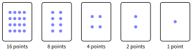
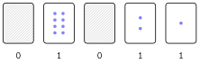

# Activités préparatoires

Le binaire et l'écriture des nombres

## Activité 1 Les cartes à points

*compter avec des cartes qu’on montre ou qu’on cache*

Durée : 25 min · Par binômes, sans machine

!!! consignes "Consignes"

    - Les réponses s’écrivent sur le cahier. Matériel : 5 cartes portant 1, 2, 4, 8 et 16 points (au dos : rien), posées **dans cet ordre, de droite à gauche**.

    - Règle du jeu : une carte est soit **montrée** (on compte ses points), soit **cachée** (elle ne compte pas). Le nombre représenté est le **total des points visibles**.

    - L’un **annonce** un nombre, l’autre **retourne** les cartes pour le représenter ; on échange les rôles à chaque question.

{ .tikz loading=lazy }

### Exercice 1 — Observer les cartes  { #ex-02-le-binaire-et-l-ecriture-des-nombres-act-1-1 }

1.  Comment passe-t-on du nombre de points d’une carte à celui de la carte placée à sa gauche ?

2.  Si l’on ajoutait une sixième carte à gauche, combien de points porterait-elle ?

??? corrige "Corrigé"

    **1.** Chaque carte porte **le double** de la carte à sa droite.  
    **2.** $2 \times 16 = 32$ points.

### Exercice 2 — Représenter des nombres  { #ex-02-le-binaire-et-l-ecriture-des-nombres-act-1-2 }

Ci-dessous, la configuration **cachée, montrée, cachée, montrée, montrée** représente $8 + 2 + 1 = 11$. On la note `01011` : `1` pour une carte montrée, `0` pour une carte cachée.

{ .tikz loading=lazy }

1.  Représenter avec les cartes, puis noter sur le cahier avec des `0` et des `1`, les nombres 5, 9, 21 et 30.

2.  Dans l’autre sens, quels nombres représentent `10010`, `00111` et `11111` ?

3.  Quel est le **plus petit** nombre qu’on peut représenter ? le **plus grand** ?

4.  Peut-on représenter **tous** les nombres entre ces deux-là ? Un même nombre peut-il s’obtenir de deux façons différentes ? Essayer avec 6, 13, 27.

5.  Combien de configurations différentes (montrée/cachée) existe-t-il pour 5 cartes ? Comparer avec la question 5.

??? corrige "Corrigé"

    **3.** $5 = 4 + 1 = \texttt{00101}$ ; $9 = 8 + 1 = \texttt{01001}$ ; $21 = 16 + 4 + 1 = \texttt{10101}$ ; $30 = 16 + 8 + 4 + 2 = \texttt{11110}$.  
    **4.** $\texttt{10010} = 16 + 2 = 18$ ; $\texttt{00111} = 4 + 2 + 1 = 7$ ; $\texttt{11111} = 16 + 8 + 4 + 2 + 1 = 31$.  
    **5.** Le plus petit : 0 (toutes les cartes cachées) ; le plus grand : 31 (toutes montrées).  
    **6.** Oui, tous les nombres de 0 à 31 s’obtiennent, et d’**une seule** façon : $6 = \texttt{00110}$, $13 = \texttt{01101}$, $27 = \texttt{11011}$. Méthode qui émerge souvent : on part de la plus grosse carte, on la montre si elle « ne dépasse pas », et on continue avec ce qui reste.  
    **7.** Chaque carte a 2 états : $2 \times 2 \times 2 \times 2 \times 2 = 32$ configurations. C’est exactement le nombre d’entiers de 0 à 31 : chaque configuration correspond à un nombre et un seul.

### Exercice 3 — Compter, ajouter une carte  { #ex-02-le-binaire-et-l-ecriture-des-nombres-act-1-3 }

1.  Compter de 0 à 8 en retournant les cartes, et noter chaque configuration sur le cahier, en continuant la suite : 0 = `00000`, 1 = `00001`, 2 = … jusqu’à 8. Que fait la carte « 1 point » à chaque étape ? Que se passe-t-il quand on passe de 7 à 8 ?

2.  On ajoute la sixième carte (question 2). Quel est maintenant le plus grand nombre représentable ? Et avec 8 cartes ?

3.  Remarquer : le plus grand nombre avec 5 cartes, plus 1, donne… quoi ?

??? corrige "Corrigé"

    **8.** 2 = `00010`, 3 = `00011`, 4 = `00100`, 5 = `00101`, 6 = `00110`, 7 = `00111`, 8 = `01000`. La carte « 1 point » se retourne **à chaque étape**. De 7 à 8, les trois cartes de droite se cachent toutes et la carte « 8 » apparaît : c’est une **retenue**, comme 999 + 1 = 1000 en décimal.  
    **9.** Avec 6 cartes : $31 + 32 = 63$. Avec 8 cartes : $1 + 2 + \cdots + 128 = 255$.  
    **10.** $31 + 1 = 32$ : la carte suivante. Avec $n$ cartes, le plus grand nombre est $2^n - 1$.

### Exercice 4 — Des cartes aux interrupteurs  { #ex-02-le-binaire-et-l-ecriture-des-nombres-act-1-4 }

Dans un ordinateur, il n’y a pas de cartes, mais des milliards de minuscules **interrupteurs** (les transistors) : le courant passe, ou ne passe pas.

1.  Une rangée de 5 lampes affiche : éteinte, allumée, allumée, éteinte, allumée. En la lisant comme les cartes, quel nombre transmet-elle ?

2.  Pourquoi est-il plus sûr de n’utiliser que **deux** états (allumé / éteint) plutôt que dix niveaux de luminosité différents ?

3.  **Mettre des mots.** Recopier et compléter sur le cahier : « Chaque carte ne peut valoir que …… états. Les points des cartes sont les puissances de …… : 1, 2, 4, 8, 16… Avec $n$ cartes, on représente …… nombres différents, de 0 à ……. Écrire un nombre avec des `0` et des `1`, c’est l’écrire en ……. »

??? corrige "Corrigé"

    **11.** $\texttt{01101} = 8 + 4 + 1 = 13$.  
    **12.** Avec deux états, il suffit de savoir s’il y a du courant ou non : même si la tension varie un peu (bruit, usure, température), on ne se trompe pas. Dix niveaux proches seraient facilement confondus.  
    **13.** « Chaque carte ne peut valoir que **deux** états. Les points des cartes sont les puissances de **2**. Avec $n$ cartes, on représente $\mathbf{2^n}$ nombres différents, de 0 à $\mathbf{2^n - 1}$. Écrire un nombre avec des `0` et des `1`, c’est l’écrire en **binaire** (base 2). »
