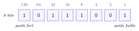
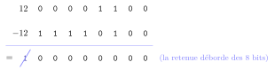
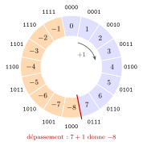
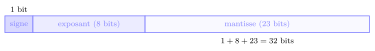

# Cours

<p class="sous-titre">Le binaire et l'écriture des nombres</p>

<span id="chap-02" class="ancre"></span>

|  |  |
|:---|:---|
| **Programme (BO)** | *« Écriture d’un entier positif dans une base $b \geqslant 2$ ; passer de la représentation d’une base dans une autre (bases 2, 10 et 16 privilégiées). Représentation binaire d’un entier relatif (complément à 2). Représentation approximative des réels : notion de nombre flottant. Représentation d’un texte en machine : encodages ASCII, ISO-8859-1, Unicode. »* |
| **Prérequis** | les bases de Python (opérateurs `//` et `%`, boucles). |
| **Objectifs** | comprendre *comment* une machine stocke un nombre ; *convertir* entre bases 2, 10 et 16 ; coder un entier *relatif* (complément à 2) ; comprendre *pourquoi* les nombres à virgule sont *approchés* ; comprendre comment un *texte* est codé (ASCII, Unicode) et *pourquoi* un même fichier peut s’afficher en charabia. |

## Pourquoi le binaire ? De quoi parle-t-on dans la machine

### Deux états, et rien d’autre

Au cœur d’un ordinateur, il n’y a ni chiffres, ni lettres, ni images : il y a des milliards de minuscules interrupteurs électroniques, les **transistors**. Chacun ne sait faire qu’une chose : **laisser passer le courant, ou non**. Deux états, deux seulement.

Pourquoi deux et pas dix ? Parce que distinguer *deux* niveaux (« il y a du courant » / « il n’y en a pas ») est **fiable** : même si la tension varie un peu à cause du bruit électrique, on sait encore de quel côté on est. Distinguer dix niveaux de tension différents serait bien plus fragile. Le choix de deux états est donc un choix de **robustesse**.

!!! definition "Définition 1 — Bit et octet"

    Un **bit** (de l’anglais *binary digit*, « chiffre binaire ») est la plus petite information : un `0` ou un `1`. On regroupe les bits par paquets de huit : un paquet de 8 bits s’appelle un **octet** (*byte* en anglais).

{ .tikz loading=lazy }

Un octet : 8 cases valant chacune `0` ou `1`. Ici, on lira bientôt le nombre `185`.

### Tout est nombre, donc tout est bits

Une fois qu’on sait coder des *nombres* avec des `0` et des `1`, on sait tout coder : un texte (chaque caractère reçoit un numéro), une image (chaque pixel, trois nombres de couleur), un son (des milliers de mesures par seconde)… C’est l’idée fondatrice de l’informatique : **une même machine, manipulant des bits, peut tout représenter**. Ce chapitre s’attaque à la brique de base : **les nombres**.

!!! remarque "Remarque — Un peu d’histoire"

    Le système binaire est décrit dès **1703** par le mathématicien et philosophe allemand *Gottfried Wilhelm Leibniz*, dans un mémoire présenté à l’Académie royale des sciences de Paris, l’*Explication de l’arithmétique binaire* : on y voit, ci-contre, la table des premiers entiers écrits avec des `0` et des `1`, et les additions, soustractions et multiplications posées en binaire. Leibniz admire la simplicité de ces calculs, sans imaginer encore de machine pour les faire. C’est *Claude Shannon* qui, en **1937**, montre que l’algèbre des deux valeurs « vrai/faux » de *George Boole* permet de **concevoir des circuits électriques** : le pont était jeté entre la logique et la machine.

    \*(image manquante : 02_hist_leibniz_francke)\*  
    Leibniz vers 1695 (portrait par C. B. Francke)

    \*(image manquante : 02_hist_leibniz_binaire_1703)\*  
    L’arithmétique binaire de Leibniz (1703)

!!! remarque "Remarque"

    La blague classique des informaticiens : « *Il existe 10 sortes de gens : ceux qui comprennent le binaire, et les autres.* » (Ici `10` se lit « deux »…)

## Les systèmes de numération : la notion de base

### Le décimal, qu’on croit connaître

Nous comptons en **base 10** : dix chiffres (`0` à `9`), et dès qu’un rang est « plein », on passe au rang suivant. La position d’un chiffre lui donne un **poids**, qui est une puissance de 10 : $$185 = 1 \times 10^2 + 8 \times 10^1 + 5 \times 10^0.$$ Le chiffre le plus à droite est au rang `0`. **Décomposer un nombre en puissances de sa base**, voilà toute l’affaire.

### Une base quelconque

!!! definition "Définition 2 — Écriture en base $b$"

    En base $b$, on dispose de $b$ chiffres (de `0` à $b-1$) et chaque rang pèse une puissance de $b$. Un nombre écrit $c_{n-1}\,c_{n-2}\,\cdots\,c_1\,c_0$ en base $b$ vaut $$c_{n-1}\,b^{\,n-1} + c_{n-2}\,b^{\,n-2} + \cdots + c_1\,b^{\,1} + c_0\,b^{\,0}.$$

La **base 2** (binaire) n’utilise que deux chiffres, `0` et `1`, et chaque rang pèse une puissance de 2. Pour lever toute ambiguïté, on note la base en indice : $185_{10}$, $\texttt{10111001}_2$.

!!! propriete "Propriété 1 — Combien de valeurs sur $n$ bits ?"

    Avec **1** bit on code $2$ valeurs (`0`, `1`) ; avec **2** bits, $4$ (`00`, `01`, `10`, `11`) ; avec **3** bits, $8$… Chaque bit ajouté **double** le nombre de possibilités : sur $n$ bits, on code $2^n$ valeurs, soit les entiers de $0$ à $2^n - 1$.

Un **octet** (8 bits) code donc $2^8 = 256$ valeurs : les entiers de `0` à `255`. C’est pourquoi ce nombre revient partout en informatique.

<span id="cours-02-1" class="ancre"></span>

<span class="afaire">▶ Exercices d'application :</span> exercice **[1](exercices.md#ex-02-1)** (compter les possibilités)

## Coder un entier positif en binaire

### Du binaire vers le décimal (le plus facile)

On applique directement la définition : on additionne les poids des rangs qui portent un `1`.

!!! exemple "Exemple — Lire un octet"

    $$\texttt{10111001}_2 = 1{\cdot}128 + 0{\cdot}64 + 1{\cdot}32 + 1{\cdot}16 + 1{\cdot}8 + 0{\cdot}4 + 0{\cdot}2 + 1{\cdot}1 = 185_{10}.$$

### Du décimal vers le binaire : les divisions successives

!!! regle "Règle 1 — Méthode des divisions par 2"

    On divise le nombre par 2 en notant le **reste** (`0` ou `1`) ; on recommence avec le quotient, jusqu’à obtenir un quotient nul. Le résultat se lit en prenant les restes **de bas en haut**.

!!! exemple "Exemple — Convertir $185$ en binaire"

    $$\begin{array}{rcl@{\qquad}l}
    185 &=& 2 \times 92 + \mathbf{1} & \text{(premier reste, lu en dernier : bit de poids faible)}\\
     92 &=& 2 \times 46 + \mathbf{0} & \\
     46 &=& 2 \times 23 + \mathbf{0} & \\
     23 &=& 2 \times 11 + \mathbf{1} & \\
     11 &=& 2 \times\phantom{0}5 + \mathbf{1} & \\
      5 &=& 2 \times\phantom{0}2 + \mathbf{1} & \\
      2 &=& 2 \times\phantom{0}1 + \mathbf{0} & \\
      1 &=& 2 \times\phantom{0}0 + \mathbf{1} & \text{(dernier reste, lu en premier : bit de poids fort)}
    \end{array}$$ En lisant les restes de bas en haut : $185_{10} = \texttt{10111001}_2$. *(On retrouve bien l’octet du début du cours.)*

!!! remarque "Remarque — sur machine"

    Python parle binaire couramment. Un littéral binaire s’écrit avec le préfixe `0b`. À tester :

    ```text
    >>> 0b10111001      # ecrire un nombre en binaire
    185
    >>> bin(185)        # decimal -> binaire (chaine)
    '0b10111001'
    >>> int("10111001", 2)   # binaire -> decimal
    185
    ```

    La méthode des divisions par 2 est *exactement* l’algorithme que vous savez déjà écrire avec une boucle `while` (restes `n % 2`, réduction `n // 2`).

### Additionner en binaire

On pose l’addition comme en base 10, rang par rang **de droite à gauche**, en propageant les retenues. Il suffit de connaître quatre cas : $0 + 0 = 0$ ; $0 + 1 = 1$ ; $1 + 1 = \texttt{10}_2$ (on pose `0`, on retient `1`) ; $1 + 1 + 1 = \texttt{11}_2$ (on pose `1`, on retient `1`).

!!! exemple "Exemple — Poser $13 + 11$ en binaire"

    $$\begin{array}{r@{\quad}c@{\,}c@{\,}c@{\,}c@{\,}c}
    \text{\scriptsize retenues} & {\scriptstyle 1} & {\scriptstyle 1} & {\scriptstyle 1} & {\scriptstyle 1} & \\
     & & \texttt{1} & \texttt{1} & \texttt{0} & \texttt{1} \\
    + & & \texttt{1} & \texttt{0} & \texttt{1} & \texttt{1} \\
    \hline
     & \texttt{1} & \texttt{1} & \texttt{0} & \texttt{0} & \texttt{0}
    \end{array}
    \qquad\qquad \texttt{11000}_2 = 16 + 8 = 24 = 13 + 11.$$ Une retenue qui sort à gauche ajoute un rang : la somme de deux nombres de 4 bits peut demander 5 bits. Cette addition, que le processeur effectue sans cesse, resservira plus loin pour coder les entiers négatifs (complément à deux).

<span id="cours-02-2" class="ancre"></span>

<span class="afaire">▶ Exercices d'application :</span> exercices **[2](exercices.md#ex-02-2) à [4](exercices.md#ex-02-4), [8](exercices.md#ex-02-8) et [9](exercices.md#ex-02-9)** (convertir binaire/décimal ; les programmer)

## L’hexadécimal : le binaire en plus court

Écrire de longues suites de `0` et de `1` est pénible et source d’erreurs. On utilise donc très souvent la **base 16** (hexadécimal). Son intérêt : **un chiffre hexadécimal représente exactement 4 bits**, donc un octet tient en *deux* chiffres.

Il faut 16 chiffres : après `0`…`9`, on emprunte des lettres.

| déc |  bin   | hex | déc |  bin   | hex | déc |  bin   | hex | déc |  bin   | hex |
|:---:|:------:|:---:|:---:|:------:|:---:|:---:|:------:|:---:|:---:|:------:|:---:|
|  0  | `0000` | `0` |  4  | `0100` | `4` |  8  | `1000` | `8` | 12  | `1100` | `C` |
|  1  | `0001` | `1` |  5  | `0101` | `5` |  9  | `1001` | `9` | 13  | `1101` | `D` |
|  2  | `0010` | `2` |  6  | `0110` | `6` | 10  | `1010` | `A` | 14  | `1110` | `E` |
|  3  | `0011` | `3` |  7  | `0111` | `7` | 11  | `1011` | `B` | 15  | `1111` | `F` |

!!! regle "Règle 2 — Binaire $leftrightarrow$ hexadécimal : regrouper par 4"

    On **regroupe les bits par paquets de 4**, en partant de la droite (on complète par des `0` à gauche si besoin), et on remplace chaque paquet par son chiffre hexadécimal. Et réciproquement.

!!! exemple "Exemple"

    $$\texttt{11011001}_2 = \underbrace{\texttt{1101}}_{\texttt{D}}\ \underbrace{\texttt{1001}}_{\texttt{9}} = \texttt{D9}_{16}, \qquad \texttt{7F}_{16} = \underbrace{\texttt{0111}}_{\texttt{7}}\ \underbrace{\texttt{1111}}_{\texttt{F}} = \texttt{01111111}_2.$$

Pour passer du **décimal** à l’hexadécimal, on divise par 16 (au lieu de 2) ; pour revenir, on multiplie par les puissances de 16 : $$\texttt{3E8}_{16} = 3{\cdot}16^2 + 14{\cdot}16^1 + 8{\cdot}16^0 = 768 + 224 + 8 = 1000_{10} \quad (\texttt{E} \text{ vaut } 14).$$

!!! remarque "Remarque — sur machine"

    ```text
    >>> hex(217)        # decimal -> hexadecimal
    '0xd9'
    >>> 0x7F            # ecrire un nombre en hexadecimal
    127
    >>> int("3E8", 16)
    1000
    ```

    On croise l’hexadécimal partout : les **couleurs** du Web (`#FF8000` = rouge `FF`, vert `80`, bleu `00`) et les **adresses mémoire** en sont deux exemples quotidiens.

<span id="cours-02-5" class="ancre"></span>

<span class="afaire">▶ Exercices d'application :</span> exercices **[5](exercices.md#ex-02-5) à [7](exercices.md#ex-02-7)** (l’hexadécimal) et **[10](exercices.md#ex-02-10)** (changer de base)

## Les entiers relatifs : le complément à deux

Jusqu’ici, tous nos nombres étaient positifs. Comment coder $-12$ avec des bits, sans inventer de signe « moins » ?

### La fausse bonne idée : un bit de signe

On pourrait réserver le bit de poids fort au signe (`0` pour $+$, `1` pour $-$). Mais cette idée a un défaut rédhibitoire : elle crée **deux zéros**, un « $+0$ » (`00000000`) et un « $-0$ » (`10000000`), ce qui complique tous les calculs. On lui préfère une méthode plus astucieuse.

### Le complément à deux

!!! regle "Règle 3 — Coder un entier négatif sur $n$ bits"

    Pour coder $-x$ (avec $x > 0$) sur $n$ bits :

    1.  écrire $x$ en binaire sur $n$ bits ;

    2.  **inverser** tous les bits (`0`$\leftrightarrow$`1`) ;

    3.  **ajouter 1** au résultat.

!!! exemple "Exemple — Coder $-12$ sur 8 bits"

    $$12 = \texttt{00001100}
    \ \xrightarrow{\text{on inverse}}\ \texttt{11110011}
    \ \xrightarrow{+1}\ \texttt{11110100}.$$ Donc $-12$ s’écrit `11110100` sur 8 bits.

Pourquoi ça marche ? Parce qu’avec cette convention, l’addition binaire ordinaire donne le bon résultat, **sans traitement spécial** : $12 + (-12)$ doit valoir $0$.

{ .tikz loading=lazy }

La retenue finale « déborde » au-delà des 8 bits : il reste `00000000`, soit $0$. Tout fonctionne.

!!! regle "Règle 4 — Lire le signe, et les bornes"

    Avec le complément à deux sur $n$ bits :

    - le **bit de poids fort** donne le signe : `0` $\Rightarrow$ positif, `1` $\Rightarrow$ négatif ;

    - on code les entiers de $-2^{n-1}$ à $+2^{n-1} - 1$.

    Sur 8 bits : de $-128$ à $+127$. Sur 16 bits : de $-32768$ à $+32767$.

**Le cadran du complément à deux sur 4 bits.** On range les 16 mots de 4 bits en cercle, comme les heures d’une horloge. Ajouter 1, c’est avancer d’un cran dans le sens des aiguilles d’une montre : de `1111` ($-1$) on passe à `0000` ($0$), la retenue « déborde » comme plus haut. Les mots qui commencent par `0` (à droite) sont les positifs $0$ à $7$ ; ceux qui commencent par `1` (à gauche) sont les négatifs $-8$ à $-1$. Seul piège : en bas, de `0111` ($+7$) à `1000` ($-8$), on passe brutalement du plus grand au plus petit : c’est le **dépassement de capacité**.

{ .tikz loading=lazy }

!!! remarque "Remarque — sur machine"

    Les entiers de Python sont **de taille arbitraire** : ils grandissent tant qu’il reste de la mémoire (essayez `2 ** 200` !). Le complément à deux sur un nombre fixe de bits reste néanmoins la réalité du *matériel* et de nombreux langages, où un entier trop grand « déborde ».

<span id="cours-02-11" class="ancre"></span>

<span class="afaire">▶ Exercices d'application :</span> exercices **[11](exercices.md#ex-02-11) à [13](exercices.md#ex-02-13)** (entiers relatifs : complément à deux)

## Les nombres à virgule : les flottants

### Écrire une fraction en binaire

Après la virgule, les rangs pèsent des puissances **négatives** de 2 : $2^{-1} = 0{,}5$, puis $2^{-2} = 0{,}25$, etc. Pour convertir une partie fractionnaire, on **multiplie par 2** de façon répétée et on relève la partie entière (`0` ou `1`) à chaque étape.

!!! exemple "Exemple — Convertir $0{,}1875$"

    $$\begin{array}{rcl@{\qquad}l}
    0{,}1875 \times 2 &=& \mathbf{0}{,}375 & \\
    0{,}375 \times 2 &=& \mathbf{0}{,}75 & \\
    0{,}75 \times 2 &=& \mathbf{1}{,}5 & \text{(on garde } 0{,}5)\\
    0{,}5 \times 2 &=& \mathbf{1}{,}0 & \text{(reste } 0 : \text{ on s'arrête)}
    \end{array}$$ On lit les parties entières **de haut en bas** : $0{,}1875_{10} = \texttt{0,0011}_2$. Donc $5{,}1875_{10} = \texttt{101,0011}_2$.

### Le piège fondamental : $0{,}1$ n’est pas exact

Reprenons la méthode sur $0{,}1$ : $$0{,}1 \times 2 = \mathbf{0}{,}2 \to \mathbf{0}{,}4 \to \mathbf{0}{,}8 \to \mathbf{1}{,}6 \to \mathbf{1}{,}2 \to \mathbf{0}{,}4 \to \cdots$$ Le motif se **répète sans fin** : $0{,}1_{10} = \texttt{0,0001100110011}\ldots_2$. Autrement dit, $0{,}1$ **n’a pas d’écriture binaire finie**, exactement comme $\frac{1}{3} = 0{,}333\ldots$ n’a pas d’écriture décimale finie.

!!! regle "Règle 5 — Les flottants sont approchés"

    Une machine ne dispose que d’un nombre **fini** de bits (souvent 64) pour stocker un nombre à virgule, appelé **flottant** (*float*). Elle doit donc **tronquer** les écritures infinies : la valeur stockée est le plus souvent une **approximation**. On ne teste **jamais** l’égalité de deux flottants.

!!! remarque "Remarque — sur machine"

    La démonstration tient en une ligne :

    ```text
    >>> 0.1 + 0.2
    0.30000000000000004
    >>> 0.1 + 0.2 == 0.3
    False
    ```

    Ce n’est **pas un bug** de Python : c’est la conséquence directe du fait que $0{,}1$ et $0{,}2$ ne sont pas représentables exactement en binaire. Pour comparer deux flottants, on teste si leur écart est *minuscule* : `abs(a - b) < 1e-9`.

### Pour aller plus loin : la norme IEEE 754

*(Culture générale : le codage précis des flottants n’est pas exigible au programme de première.)*

Comme en base 10 on écrit $6{,}02 \times 10^{23}$, on met un flottant binaire sous la forme $1{,}\!\ldots \times 2^{e}$ (un seul `1` avant la virgule). La norme **IEEE 754** (1985) range alors, sur 32 bits (« simple précision ») :

{ .tikz loading=lazy }

- **1 bit de signe** (`0` positif, `1` négatif) ;

- **8 bits d’exposant**, stocké *décalé* de $+127$ (pour éviter un signe séparé) ;

- **23 bits de mantisse** (les décimales après le `1,`).

C’est la limitation de la mantisse à 23 (ou 52) bits qui *force* l’arrondi vu plus haut.

<span id="cours-02-14" class="ancre"></span>

<span class="afaire">▶ Exercices d'application :</span> exercices **[14](exercices.md#ex-02-14) à [16](exercices.md#ex-02-16)** (les nombres à virgule)

## Combien de bits pour un nombre ?

Le programme demande de savoir **estimer la taille** d’un nombre en mémoire.

!!! propriete "Propriété 2 — Nombre de bits"

    Un entier $N$ s’écrit sur $k$ bits dès que $2^{k} > N$, c’est-à-dire dès que $k$ dépasse $\log_2 N$. Repères utiles : $2^{10} = 1024 \approx 10^3$, donc $10$ bits couvrent $\approx$ mille valeurs, $20$ bits $\approx$ un million, $30$ bits $\approx$ un milliard.

Ordre de grandeur à retenir : additionner deux nombres de $k$ bits peut demander $k+1$ bits (à cause de la retenue) ; multiplier deux nombres de $k$ bits peut en demander jusqu’à $2k$.

!!! remarque "Remarque"

    C’est ce comptage qui explique les tailles « rondes » de l’informatique : un octet $\to$ 256 valeurs ; 32 bits $\to \approx 4$ milliards (la limite des « anciennes » adresses mémoire) ; 64 bits $\to$ un nombre astronomique, largement suffisant aujourd’hui.

## Coder le texte : de l’ASCII à Unicode

Nous savons coder des nombres. Or, comme annoncé au début du chapitre, **une machine ne sait *que* manipuler des nombres**. Coder un texte revient donc à une idée simple : **donner un numéro à chaque caractère**. C’est ce numéro, écrit en binaire, qui est réellement stocké.

### L’ASCII : la première table

!!! definition "Définition 3 — Code ASCII"

    L’**ASCII** (*American Standard Code for Information Interchange*, 1963) est une table qui associe à chaque caractère un numéro de `0` à `127`. Chaque caractère tient donc sur **7 bits** ($2^7 = 128$ valeurs).

|  car.  | code | car. | code | car. | code | car. | code |
|:------:|:----:|:----:|:----:|:----:|:----:|:----:|:----:|
| espace |  32  | `0`  |  48  | `A`  |  65  | `a`  |  97  |
|  `!`   |  33  | `1`  |  49  | `B`  |  66  | `b`  |  98  |
|  `?`   |  63  | `9`  |  57  | `Z`  |  90  | `z`  | 122  |

Extrait de la table ASCII (codes en décimal).

Deux régularités bien pratiques : les chiffres, les majuscules et les minuscules se suivent *dans l’ordre* ; et une minuscule vaut toujours sa majuscule $+\,32$ (`A`${=}65$, `a`${=}97$).

!!! remarque "Remarque — sur machine"

    En Python, `ord` donne le code d’un caractère, et `chr` fait l’inverse.

    ```text
    >>> ord("A")        # caractere -> code
    65
    >>> chr(97)         # code -> caractere
    'a'
    >>> ord("A") == ord("a") - 32
    True
    ```

    Le `A` majuscule vaut donc $65 = \texttt{1000001}_2$ : voilà ce que contient réellement l’octet qui stocke la lettre `A`.

### Trop petit : de l’ASCII à Unicode

L’ASCII a été conçu pour l’anglais : il ignore les **accents** (`é`, `à`, `ç`), sans parler du grec, du russe, du chinois ou des *émojis*. On a d’abord bricolé des tables sur **8 bits** ($256$ valeurs), comme l’**ISO-8859-1** (dite « Latin-1 »), qui ajoute les caractères d’Europe de l’Ouest. Mais 256 places ne suffisent pas au monde entier, et chaque région avait *sa* table incompatible : le même octet ne désignait pas la même lettre d’un pays à l’autre.

!!! definition "Définition 4 — Unicode et UTF-8"

    **Unicode** est un *catalogue universel* qui attribue un numéro unique, appelé **point de code** (noté `U+`…), à *tous* les caractères de *toutes* les écritures (plus de 150 000 aujourd’hui). **UTF-8** est la façon la plus répandue d’*écrire ces points de code en octets* : il utilise **1 octet** pour les caractères ASCII, et **2 à 4 octets** pour les autres.

UTF-8 a une qualité décisive : pour un caractère ASCII, il produit *exactement* l’octet ASCII. Un vieux fichier anglais reste donc valide, et c’est pourquoi UTF-8 s’est imposé partout (le Web est aujourd’hui à plus de 98 % en UTF-8).

!!! remarque "Remarque — sur machine"

    On **encode** un texte (caractères $\to$ octets) et on **décode** (octets $\to$ caractères).

    ```text
    >>> "e".encode("utf-8")     # ASCII : 1 octet
    b'e'
    >>> "é".encode("utf-8")     # hors ASCII : 2 octets
    b'\xc3\xa9'
    >>> len("café")                    # 4 caracteres
    4
    >>> len("café".encode("utf-8"))    # mais 5 octets (le e accent en prend 2)
    5
    ```

    On mesure ici la différence entre **nombre de caractères** et **taille en octets** : elles ne coïncident que si tout le texte est en ASCII.

### Le charabia (*mojibake*) : quand on se trompe d’encodage

Un fichier texte n’est qu’une suite d’octets : **rien** n’y indique de façon absolue quel encodage a servi à l’écrire. Si on *écrit* un fichier en UTF-8 mais qu’un logiciel le *relit* comme du Latin-1, chaque octet est mal interprété et le texte s’affiche en charabia.

!!! exemple "Exemple — D’où vient le fameux « é »"

    Le caractère `é` s’écrit sur *deux* octets en UTF-8 (`C3 A9`). Relu comme du Latin-1 (un octet $=$ un caractère), `C3` devient `Ã` et `A9` devient `©`. En Python, `"café".encode("utf-8").decode("latin-1")` renvoie donc `’café’` : c’est *exactement* le « café » qu’on voit parfois sur une page Web mal configurée. *Convertir* un fichier d’un encodage à l’autre, c’est le relire correctement puis le réécrire : `octets.decode("utf-8").encode("latin-1")`.

!!! remarque "Remarque"

    Un caractère peut prendre jusqu’à **4 octets** en UTF-8 : c’est le cas des émojis. Ainsi le visage souriant (point de code `U+1F600`) est un *seul* caractère — `ord` vaut `128512` — mais occupe **4 octets** en mémoire.

<span id="cours-02-17" class="ancre"></span>

<span class="afaire">▶ Exercices d'application :</span> exercices **[17](exercices.md#ex-02-17) à [21](exercices.md#ex-02-21)** (coder le texte : ASCII, Unicode)

!!! remarque "Remarque — Liens avec d’autres chapitres"

    Les conversions reposent sur les opérateurs `//` et `%` et la boucle `while` du chapitre *Les bases de la programmation Python*, où l’on avait constaté sans l’expliquer que `0.1 + 0.2` ne vaut pas `0.3`. Les deux états du bit sont ceux du **transistor**, brique de base que l’on retrouvera au chapitre *Architecture des ordinateurs et systèmes d’exploitation*, et le **débordement** d’un entier stocké sur trop peu de bits est à l’origine de l’explosion d’Ariane 5, que racontera le chapitre *Spécifier et mettre au point ses programmes*. Une adresse IPv4 du chapitre *Le Web : réseaux et interactions homme-machine* ne sera rien d’autre que quatre **octets** (d’où les nombres de 0 à 255), et l’encodage **UTF-8** réapparaîtra dès qu’on ouvrira un fichier CSV (*Les données en tables*) ou qu’on écrira `<meta charset="utf-8">` dans une page HTML. En Terminale, le chapitre *Réseaux et routage* découpera ces 32 bits en partie réseau et partie hôte (le masque `/n`), et la *Cryptographie* chiffrera un message en calculant sur les rangs de ses lettres (chiffre de César).

## Bilan — la carte mémoire

| **Notion** | **À retenir** |
|:---|:---|
| Bit / octet | 1 bit = `0` ou `1` ; 1 octet = 8 bits = $2^8 = 256$ valeurs |
| Base $b$ | chaque rang pèse une puissance de $b$ ; $n$ bits codent $2^n$ valeurs |
| Bin. $\to$ déc. | additionner les poids ($128, 64, 32, \ldots$) des rangs à `1` |
| Déc. $\to$ bin. | divisions successives par 2, restes lus **de bas en haut** |
| Hexadécimal | 1 chiffre hexa $=$ 4 bits ; on regroupe les bits par 4 |
| Entier relatif | **complément à 2** : inverser les bits, puis $+1$ ; bornes $-2^{n-1}\ldots 2^{n-1}-1$ |
| Flottant | écriture souvent **approchée** ; ne jamais tester `==` sur des *float* |
| Texte (ASCII) | chaque caractère a un **numéro** ; ASCII $=$ 7 bits (128 car.) ; `ord`/`chr` |
| Unicode / UTF-8 | Unicode $=$ catalogue universel (`U+`) ; UTF-8 $=$ 1 à 4 octets, compatible ASCII |
| Charabia (*mojibake*) | lire un fichier avec le **mauvais encodage** $\Rightarrow$ « café » ; `encode`/`decode` |
| Pourquoi le binaire | deux états $=$ fiabilité ; tout (texte, image, son) se ramène à des bits |

## Erreurs fréquentes

- **Se tromper dans le poids des bits.** Chaque bit vaut une **puissance de 2** ; le bit de **droite** vaut $2^0 = 1$. *Le réflexe :* écrire les poids $\dots 8\ 4\ 2\ 1$ au-dessus.

- **Confondre binaire et hexadécimal.** La base 16 utilise `0`–`9` puis `A`–`F` ; **un** chiffre hexa $=$ **quatre** bits.

- **Tester l’égalité de deux flottants.** L’écriture est souvent **approchée** ($0{,}1 + 0{,}2 \neq 0{,}3$). *Le réflexe :* ne jamais faire `==` sur des *float*.

- **Oublier le nombre de bits.** Sur `n` bits, on code $2^n$ valeurs (de $0$ à $2^n - 1$) : au-delà, **débordement**.

- **Divisions successives mal menées.** On lit les restes **de bas en haut** pour obtenir l’écriture binaire.

- **Confondre caractère et octet.** En UTF-8 un caractère accentué ou un émoji occupe **plusieurs octets** : `len(texte)` (caractères) $\neq$ taille en octets.

- **Croire qu’un fichier « connaît » son encodage.** Un fichier n’est qu’une suite d’octets ; lu avec le **mauvais encodage**, il donne du charabia (« café »).

## Savoir-faire à maîtriser

*À la fin du chapitre, je sais…*

- convertir **binaire $\rightarrow$ décimal** (somme des poids) ;

- convertir **décimal $\rightarrow$ binaire** (divisions successives par 2) ;

- convertir avec l’**hexadécimal** (paquets de 4 bits) ;

- donner le nombre de valeurs codables sur `n` bits ($2^n$) ;

- **additionner** deux nombres en binaire ;

- coder un **entier relatif** (complément à deux) ;

- expliquer pourquoi un **flottant** est souvent **approché** ;

- expliquer comment un **texte** est codé (**ASCII**, `ord`/`chr`) ;

- distinguer **ASCII**, **Latin-1** et **Unicode/UTF-8**, et expliquer le **charabia**.
