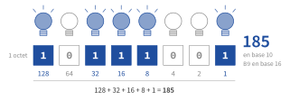

# Le binaire et l'écriture des nombres

{ .ouverture }

-   [:material-lightbulb-on-outline: Activités préparatoires](activites.md)
-   [:material-book-open-variant: Cours](cours.md)
-   [:material-pencil-outline: Exercices](exercices.md)
-   [:material-laptop: TP et projets](tp.md)
-   [:material-star-shooting-outline: Défis Advent of Code](defis.md)

