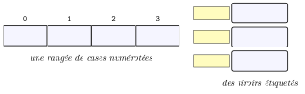
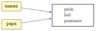
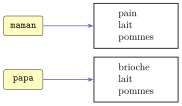

# Activités préparatoires

<p class="sous-titre">Les types construits</p>

## <span class="etiquette">Activité 1</span> Des données en vrac

*ranger, retrouver, modifier : trois façons de regrouper*

<p class="infos-activite">Durée : 25 min · Par binômes, sans machine</p>

!!! consignes "Consignes"

    - Matériel : le cahier (toutes les réponses et tous les dessins s’y font), un crayon, quelques papillons adhésifs (*post-it*).

    - Jusqu’ici, une variable rangeait **une seule** valeur. Voici trois « tas » de données qui vont ensemble : il s’agit de décider **comment les ranger** pour bien s’en servir ensuite.

<table>
<thead>
<tr>
<th style="text-align: left;"><strong>Tas 1 : une carte d’identité</strong></th>
<th style="text-align: left;"><strong>Tas 2 : une liste de courses</strong></th>
<th style="text-align: left;"><strong>Tas 3 : les casiers de la classe</strong></th>
</tr>
</thead>
<tbody>
<tr>
<td style="text-align: left;">« Durand », « Léa », 2009, « Monaco »<br />
(nom, prénom, année de naissance, ville de naissance)</td>
<td style="text-align: left;">pain, lait, pommes, beurre<br />
(écrits au fil de la semaine)</td>
<td style="text-align: left;">Léa : casier 112<br />
Hugo : casier 87<br />
Inès : casier 245</td>
</tr>
</tbody>
</table>

### <span class="exo-num">Exercice 1</span> — Retrouver une information <span class="ia ia-rouge" title="Sans IA : le but est l'automatisme lui-même"></span> { #ex-03-les-types-construits-act-1-1 }

Recopier sur le cahier le tableau ci-dessous : il sert pour les questions 1 à 3.

1.  Pour retrouver une information dans chaque tas, que dit-on le plus naturellement : « la troisième » (une **position**) ou « celle de Hugo » (une **étiquette**) ? Compléter la 1<sup>re</sup> ligne du tableau.

2.  Ce tas va-t-il **changer** après sa création ? Si oui, donner un exemple de changement ; si non, expliquer pourquoi il *ne doit pas* changer. Compléter la 2<sup>e</sup> ligne.

3.  L’**ordre** des éléments compte-t-il ? (Que se passe-t-il si on échange deux éléments ?) Compléter la 3<sup>e</sup> ligne.

|  | **Tas 1 (identité)** | **Tas 2 (courses)** | **Tas 3 (casiers)** |
|:---|:---|:---|:---|
| on retrouve par… |  |  |  |
| va changer ? |  |  |  |
| l’ordre compte ? |  |  |  |

??? corrige "Corrigé"

    **1–3.** Réponses attendues (les justifications comptent plus que les mots) :

    |  | **Tas 1 (identité)** | **Tas 2 (courses)** | **Tas 3 (casiers)** |
    |:---|:---|:---|:---|
    | on retrouve par… | la position (le 1<sup>er</sup> = nom, le 3<sup>e</sup> = année…) | la position (ou on parcourt toute la liste) | l’étiquette (le prénom) |
    | va changer ? | **non** : l’année de naissance ne change pas, et ne *doit* pas changer | **oui** : on ajoute, on raye | **oui** : un élève arrive, change de casier |
    | l’ordre compte ? | oui : échanger nom et prénom change le sens | peu (mais on peut vouloir l’ordre du magasin) | non : on cherche par prénom |

### <span class="exo-num">Exercice 2</span> — Des rangées et des tiroirs <span class="ia ia-rouge" title="Sans IA : le but est l'automatisme lui-même"></span> { #ex-03-les-types-construits-act-1-2 }

On propose deux façons de ranger : une **rangée de cases numérotées** à partir de 0, ou des **tiroirs étiquetés**.

{ .tikz loading=lazy }

1.  Reproduire les deux dessins sur le cahier, puis ranger le tas 2 dans la rangée de cases et le tas 3 dans les tiroirs. Que lit-on dans la case numéro 2 ?

2.  On ajoute « œufs » à la liste de courses, puis on raye « lait ». Que devient la rangée ? Les numéros des cases changent-ils ?

3.  Hugo change de casier : il prend le 90. Qu’efface-t-on sur le dessin ? Peut-on avoir deux tiroirs étiquetés « Hugo » ? Que faudrait-il faire si deux élèves s’appelaient Léa ?

4.  La carte d’identité se range aussi dans une rangée de 4 cases. Mais personne ne doit pouvoir écrire « 2010 » à la place de « 2009 » par erreur. Comment le représenter sur le dessin ?

??? corrige "Corrigé"

    **4.** Cases 0 à 3 : pain, lait, pommes, beurre. La case numéro 2 contient **pommes** (et non lait : on numérote à partir de 0, première rencontre avec cette convention).  
    **5.** On ajoute une case à la fin (« œufs », case 4) ; rayer « lait » fait **glisser** pommes, beurre et œufs d’un cran vers la gauche : leurs numéros changent (pommes passe de 2 à 1). La rangée **s’allonge ou raccourcit** : elle est modifiable.  
    **6.** On efface 87 dans le tiroir « Hugo » et on écrit 90 ; l’étiquette ne bouge pas. Deux tiroirs « Hugo » : non, on ne saurait plus lequel ouvrir — une étiquette doit être **unique**. Deux Léa : il faut une étiquette qui les distingue (« Léa D. » et « Léa M. », ou un numéro d’élève).  
    **7.** Un cadenas, une rangée « plastifiée » ou « sous verre » : on peut lire les cases, pas y écrire. Toute idée de « figé » convient.

### <span class="exo-num">Exercice 3</span> — Une étiquette, ou deux ? <span class="ia ia-rouge" title="Sans IA : le but est l'automatisme lui-même"></span> { #ex-03-les-types-construits-act-1-3 }

En Python, une variable est plutôt une **étiquette** (un post-it) collée sur une feuille, avec une **flèche** vers cette feuille. Le soir, Maman écrit la liste de courses et y colle l’étiquette `maman`. Papa dit « c’est aussi ma liste » et colle l’étiquette `papa` **sur la même feuille**.

{ .tikz loading=lazy }

1.  Papa barre « pain » et écrit « brioche » à la place. Que lit Maman sur *sa* liste ?

2.  **Prédire, puis vérifier.** Voici la même histoire en Python. Écrire sur le cahier ce qu’affiche la dernière ligne *avant* de l’exécuter (le professeur l’exécute ensuite au tableau), puis noter à côté le résultat obtenu.

    ```python
    maman = ["pain", "lait", "pommes"]
    papa = maman
    papa[0] = "brioche"
    print(maman)
    ```

3.  Que faudrait-il faire, avec les feuilles de papier, pour que Papa puisse modifier sa liste **sans** toucher à celle de Maman ? Dessiner la nouvelle situation sur le cahier (étiquettes, flèches, feuilles).

??? corrige "Corrigé"

    **8.** Maman lit **brioche, lait, pommes** : il n’y a qu’**une** feuille, avec deux étiquettes dessus.  
    **9.** Python affiche :  
    `[’brioche’, ’lait’, ’pommes’]`. Beaucoup d’élèves prédisent `[’pain’, ’lait’, ’pommes’]`, car ils pensent que `papa = maman` « copie » la liste : c’est exactement la confusion que l’activité doit faire apparaître.  
    **10.** Il faut **photocopier** (ou recopier) la feuille et coller l’étiquette `papa` sur la copie : deux feuilles, une flèche chacune. En Python, on fabriquera cette copie avec une compréhension (vue dans le cours) : `papa = [x for x in maman]` ; Maman garde alors `[’pain’, ’lait’, ’pommes’]`.

    { .tikz loading=lazy }

### <span class="exo-num">Exercice 4</span> — Mettre des mots <span class="ia ia-rouge" title="Sans IA : le but est l'automatisme lui-même"></span> { #ex-03-les-types-construits-act-1-4 }

1.  Recopier et compléter : « Pour choisir comment regrouper des données, on se pose deux questions : est-ce qu’on retrouve un élément par sa …… ou par une …… ? Est-ce que la collection va …… après sa création ? »

2.  Recopier et compléter : « Une variable n’est pas une boîte qui contient la valeur : c’est une …… qui …… vers un objet. Deux variables peuvent désigner …… objet. »

??? corrige "Corrigé"

    **11.** « …par sa **position** (un indice) ou par une **étiquette** (une clé) ? Est-ce que la collection va **changer** (être modifiée) après sa création ? »  
    **12.** « …c’est une **étiquette** (un nom) qui **pointe** vers un objet. Deux variables peuvent désigner **le même** objet. »
