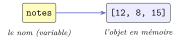
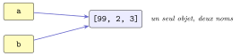
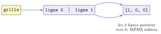
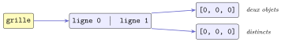

# Cours

<p class="sous-titre">Les types construits</p>

<span id="chap-03" class="ancre"></span>

|  |  |
|:---|:---|
| **Programme (BO)** | *« Types construits »* : *p-uplets*, *tableaux indexés* (listes) et *tableaux de tableaux*, *dictionnaires* (tableaux associatifs). Capacités attendues : écrire une fonction renvoyant un p-uplet ; lire et *modifier* les éléments d’un tableau par leur index ; construire un tableau *par compréhension* ; *itérer* sur les éléments d’un tableau ; représenter des matrices par des tableaux de tableaux ; itérer sur les éléments d’un dictionnaire. |
| **Prérequis** | les bases de Python : variables, types simples (`int`, `float`, `bool`, `str`), boucles `for`/`while`, fonctions. |
| **Objectifs** | savoir **regrouper** des données dans le bon type construit, y **accéder**, les **parcourir** et, quand c’est possible, les **modifier** — en comprenant *ce qui se passe en mémoire*. Ce chapitre est le socle des chapitres suivants (algorithmique, tris, données en tables…). |

!!! remarque "Remarque — Deux fils conducteurs, à garder en tête tout le chapitre"

    **(1) Le fil rouge.** Une variable n’est pas une boîte qui *contient* une valeur : c’est une **étiquette** (un nom) qui **pointe vers un objet** rangé en mémoire. Ce seul dessin — des noms, des flèches, des objets — expliquera *tout* le chapitre : la copie, le partage accidentel de données, le piège des matrices, et jusqu’aux clés de dictionnaire. On le rappellera par un encadré **« Fil rouge »**.

    **(2) Le programme est restreint**, mais ces types sont **partout** : on va donc souvent plus loin. Chaque dépassement est signalé par le badge <span class="horsprog">au-delà du programme</span> — utile, fréquent, mais non exigible au **baccalauréat**.

## Le point de départ : une variable est une flèche

Jusqu’ici, une variable rangeait **une** valeur simple : un nombre, un booléen, une chaîne. C’est insuffisant pour stocker les 500 notes d’une classe ou un annuaire. On a besoin de variables dont la valeur **regroupe plusieurs valeurs**.

!!! definition "Définition 1 — Type construit"

    Un **type construit** (ou *composé*) est un type dont chaque valeur **regroupe plusieurs valeurs** en un seul objet. Par opposition, `int`, `float`, `bool` et `str` sont considérés ici comme des types **simples**.

Avant tout, installons le modèle mental qui va tout éclairer.

!!! regle "Règle 1 — Le modèle mémoire : nom $longrightarrow$ objet"

    En Python, l’instruction `notes = [12, 8, 15]` fait *deux* choses : elle crée l’objet `[12, 8, 15]` quelque part en mémoire, puis fait **pointer** le nom `notes` vers cet objet. La variable **ne contient pas** l’objet : elle le **désigne**.

{ .tikz loading=lazy }

De cette image découle une distinction **fondamentale** : peut-on modifier l’objet vers lequel on pointe ?

!!! definition "Définition 2 — Mutable / immuable"

    Un objet est **mutable** (modifiable) si l’on peut changer son contenu *sans en créer un nouveau* : c’est le cas des tableaux (`list`) et des dictionnaires (`dict`). Il est **immuable** sinon : c’est le cas des nombres, des chaînes (`str`) et des **p-uplets** (`tuple`).

!!! remarque "Remarque — La chaîne : une collection que vous connaissez déjà"

    Le type `str` annonce déjà les séquences : ses caractères sont **ordonnés**, indexés à partir de $0$, et on en extrait des tranches. On peut aussi la passer tout en **minuscules** ou en **majuscules** avec `.lower()` et `.upper()`. Ces réflexes vont resservir tels quels.

    ```text
    >>> ch = "Bonjour"
    >>> ch[0]        # premier caractere (indice 0)
    'B'
    >>> ch[3:7]      # tranche : indices 3 a 6
    'jour'
    >>> len(ch)      # longueur
    7
    >>> ch.lower()   # tout en minuscules
    'bonjour'
    >>> ch.upper()   # tout en majuscules
    'BONJOUR'
    ```

## Deux questions, trois types

Plutôt que d’apprendre trois types par cœur, apprenons à **choisir**. Devant une collection de données, on se pose **deux questions** :

|  |  |
|---:|:---|
| **Q1.** | Comment vais-je **retrouver** un élément : par sa *position* (un indice $0,1,2\ldots$) ou par une *étiquette* que je choisis (une *clé*) ? |
| **Q2.** | Cette collection va-t-elle **changer** après sa création (*mutable*), ou est-elle **figée** (*immuable*) ? |

Les réponses désignent le type à utiliser — c’est la **carte de décision** du chapitre :

|  | **accès** | **modifiable ?** | **à utiliser pour…** |
|:---|:--:|:--:|:--:|
| `tuple` (p-uplet) | par indice | **non** (immuable) | des données figées, plusieurs valeurs renvoyées |
| `list` (tableau) | par indice | **oui** (mutable) | une collection ordonnée qui évolue |
| `dict` (dictionnaire) | par **clé** | **oui** (mutable) | associer une valeur à une étiquette |

On étudie maintenant les trois, dans cet ordre : le plus simple (figé) d’abord, puis le mutable, puis l’accès par clé.

## Le p-uplet (`tuple`) : une collection figée

!!! definition "Définition 3 — p-uplet"

    Un **p-uplet** (type `tuple`) est une suite **ordonnée** de $p$ éléments, de types éventuellement différents, que l’on **ne peut pas modifier** après création (immuable).

### Création : c’est la virgule qui compte

On sépare les éléments par des **virgules** ; les parenthèses sont facultatives mais recommandées.

```text
>>> point = (3, 4)             # un couple
>>> t = 1, 2, 3, "bonjour"     # parentheses sous-entendues
>>> t
(1, 2, 3, 'bonjour')
>>> vide = ()                  # p-uplet vide
>>> singleton = (3,)           # UN element : la virgule est OBLIGATOIRE
>>> type((3)), type((3,))      # sans virgule, (3) est juste l'entier 3
(<class 'int'>, <class 'tuple'>)
```

### Accès : indice, tranche, `len`, `in`

Comme pour les chaînes : indices à partir de $0$, indices négatifs depuis la fin, tranches.

```text
>>> t = (10, 20, 30, 40, 50)
>>> t[0], t[-1]        # premier, dernier
(10, 50)
>>> t[1:4]             # indices 1, 2, 3 (4 exclu)
(20, 30, 40)
>>> len(t)
5
>>> 20 in t            # test d'appartenance
True
```

### Immuable : toute modification est refusée

```text
>>> t = (1, 2, 3)
>>> t[0] = 99
Traceback (most recent call last):
  ...
TypeError: 'tuple' object does not support item assignment
```

!!! remarque "Remarque — À quoi sert un type qu’on ne peut pas modifier ?"

    À **garantir** qu’une donnée ne bougera pas par erreur : coordonnées d’un point, date, couleur RVB. Et — on le verra au §VI — seul un objet immuable peut servir de **clé** de dictionnaire.

### Affectation multiple : déballer un p-uplet

Le p-uplet permet d’**affecter plusieurs variables en une seule fois** : on « déballe » ses composantes dans autant de variables.

```text
>>> a, b, c = 1, 2, 3     # a vaut 1, b vaut 2, c vaut 3
```

C’est exactement ainsi qu’on récupère les différentes valeurs renvoyées par une fonction (paragraphe suivant).

### Une fonction qui renvoie un p-uplet (capacité attendue)

L’usage numéro un : renvoyer **plusieurs résultats** d’un coup, récupérés par affectation multiple.

```python
def division(a, b):
    """Renvoie (quotient, reste) de la division entiere de a par b."""
    return a // b, a % b

q, r = division(25, 7)      # q vaut 3, r vaut 4
```

!!! exemple "Exemple — Renvoyer le minimum et le maximum"

    ```python
    def mini_maxi(t):
        """Renvoie (plus petit, plus grand) du tableau non vide t."""
        mini = maxi = t[0]
        for x in t:
            if x < mini:
                mini = x
            if x > maxi:
                maxi = x
        return mini, maxi

    petit, grand = mini_maxi([7, 2, 9, 4])   # petit = 2, grand = 9
    ```

<span id="cours-03-1" class="ancre"></span>

<span class="afaire">▶ Exercices d'application :</span> exercices **[1](exercices.md#ex-03-1) à [5](exercices.md#ex-03-5)** (les p-uplets)

## Le tableau (`list`) : ordonné et modifiable

Un **tableau** ressemble à un p-uplet… mais il est **mutable**. C’est là que le fil rouge devient indispensable.

### Création

!!! definition "Définition 4 — Tableau"

    Un **tableau** (type `list`) est une suite **ordonnée** et **modifiable** d’éléments, entre **crochets**.

```text
>>> notes = [12, 8, 15, 9]
>>> vide = []                   # (ou list())
>>> singleton = [3]             # un element : PAS de virgule (contrairement au tuple)
>>> list(range(3, 11, 2))       # a partir d'un range
[3, 5, 7, 9]
>>> [0] * 5                     # repetition : cinq zeros
[0, 0, 0, 0, 0]
```

### Lire et modifier par indice (capacité attendue)

```text
>>> notes = [12, 8, 15, 9]
>>> notes[1]           # lecture
8
>>> notes[1] = 20      # ECRITURE : on remplace l'element d'indice 1
>>> notes
[12, 20, 15, 9]
>>> notes[0:2]         # tranche
[12, 20]
```

### Parcourir un tableau (capacité attendue)

**(1) Par élément**, quand seules les valeurs comptent :

```python
somme = 0
for note in notes:      # note prend chaque valeur
    somme = somme + note
```

**(2) Par indice**, quand on a besoin de la position ou qu’on veut *modifier* :

```python
for i in range(len(notes)):
    notes[i] = notes[i] + 1     # +1 point a chaque note
```

**(3)** <span class="horsprog">au-delà du programme</span>`enumerate` donne indice *et* valeur :

```python
for i, note in enumerate(notes):
    print("indice", i, ":", note)
```

!!! remarque "Remarque — Pourquoi la méthode 1 ne modifie pas le tableau"

    Dans `for note in notes`, la variable `note` est un *nouveau* nom qui pointe tour à tour vers chaque élément. Lui réaffecter `note = note + 1` le fait pointer ailleurs, **sans toucher** au tableau. Pour modifier, il faut l’indice (méthode 2).

### Construction par compréhension (capacité attendue)

Écriture concise, à **maîtriser absolument** : elle fabrique un tableau à partir d’un itérable.

!!! regle "Règle 2 — Syntaxe de la compréhension"

    Deux formes (une par ligne), chaque couleur repérant une partie :

    |  |  |
    |---:|:---|
    | forme simple : | `[ expression(x) `**`for`**` x `**`in`**` itérable ]` |
    | avec filtre : | `[ expression(x) `**`for`**` x `**`in`**` itérable `**`if`**` condition(x) ]` |

    expression = ce que l’on range variable = parcourt l’itérable itérable = ce que l’on parcourt condition = filtre (facultatif)

```text
>>> [2 * n for n in range(5)]             # les 5 premiers pairs
[0, 2, 4, 6, 8]
>>> [x * x for x in [1, 2, 3, 4]]         # les carres
[1, 4, 9, 16]
>>> [n for n in range(20) if n % 3 == 0]  # avec filtre
[0, 3, 6, 9, 12, 15, 18]
```

!!! remarque "Remarque — Un premier pas vers la programmation fonctionnelle"

    Une compréhension est une **expression** qui *construit un nouveau tableau* sans modifier quoi que ce soit d’autre : c’est un élément de **programmation fonctionnelle**, un paradigme (une manière de programmer) que l’on étudiera en **Terminale**.

!!! exemple "Exemple — La compréhension condense une boucle à accumulateur"

    Les deux codes produisent `[1, 4, 9, 16, 25]` :

    ```python
    carres = []                      # version longue
    for k in range(1, 6):
        carres.append(k * k)

    carres = [k * k for k in range(1, 6)]   # version par comprehension
    ```

### Méthodes des tableaux <span class="horsprog">au-delà du programme</span>

Un tableau étant mutable, il possède des **méthodes** (appel avec un point). Non exigibles, mais omniprésentes, y compris dans les sujets de bac.

!!! regle "Règle 3 — Méthodes usuelles (au-delà du programme)"

    Un tableau `t` dispose notamment des méthodes suivantes :

    | **Appel**      | **Effet**                                   |
    |:---------------|:--------------------------------------------|
    | t.append(x)    | ajoute `x` à la **fin**                     |
    | t.insert(i, x) | insère `x` à l’indice `i` (décale la suite) |
    | t.pop()        | retire et **renvoie** le dernier élément    |
    | t.pop(i)       | retire et renvoie l’élément d’indice `i`    |
    | t.remove(x)    | retire la **première** occurrence de `x`    |
    | t.count(x)     | compte les occurrences de `x`               |
    | t.index(x)     | indice de la première occurrence de `x`     |
    | t.sort()       | **trie** sur place                          |
    | t.reverse()    | inverse l’ordre sur place                   |

```text
>>> t = [3, 1, 2]
>>> t.append(5)       # -> [3, 1, 2, 5]
>>> t.insert(1, 9)    # -> [3, 9, 1, 2, 5]
>>> t.pop()           # renvoie 5 ; t -> [3, 9, 1, 2]
5
>>> t.sort()          # -> [1, 2, 3, 9]
```

!!! regle "Règle 4 — Modifier sur place vs renvoyer une copie"

    Ces méthodes modifient le tableau et renvoient `None` : n’écrivez **jamais** `t = t.sort()` (vous perdriez tout). Pour trier *sans* modifier l’original, la **fonction** `sorted` renvoie un nouveau tableau.

    ```text
    >>> t = [3, 1, 2]
    >>> sorted(t)         # NOUVEAU tableau trie
    [1, 2, 3]
    >>> t                 # original intact
    [3, 1, 2]
    ```

### Le fil rouge à l’œuvre : références, alias et copie

Voici le point le plus important — et le plus piégeux — du chapitre. Reprenons le dessin du §I.

!!! regle "Règle 5 — Affecter un tableau ne le copie pas !"

    `b = a` ne crée **aucun** nouvel objet : il fait simplement pointer `b` vers **le même** tableau que `a`. On dit que `a` et `b` sont des **alias**. Modifier via l’un se voit via l’autre.

```text
>>> a = [1, 2, 3]
>>> b = a           # b pointe vers le MEME objet
>>> b[0] = 99
>>> a               # a a change aussi !
[99, 2, 3]
```

{ .tikz loading=lazy }

Pour une **vraie copie** (objet indépendant), on *reconstruit* un tableau :

```text
>>> a = [1, 2, 3]
>>> b = list(a)     # (ou a[:] , ou a.copy()) : NOUVEL objet
>>> b[0] = 99
>>> a               # intact
[1, 2, 3]
```

!!! remarque "Remarque — Copie profonde au-delà du programme"

    Une copie simple ne duplique que le premier niveau : pour un tableau *de tableaux*, les sous-tableaux restent partagés. Pour tout dédoubler, `deepcopy` du module `copy` :

    ```python
    from copy import deepcopy
    grille2 = deepcopy(grille)   # copie totalement independante
    ```

!!! exemple "Exemple — Copier un tableau de tableaux avec deux compréhensions emboîtées"

    Sans `deepcopy`, construire une copie indépendante de `grille = [[1, 2], [3, 4]]` à l’aide de **deux** compréhensions emboîtées, puis vérifier que modifier la copie ne touche pas l’original.

    ??? corrige "Correction"

        La compréhension *intérieure* recrée chaque ligne, la compréhension *extérieure* crée un nouveau tableau de ces lignes : aucun tableau n’est partagé.

        ```text
        >>> grille = [[1, 2], [3, 4]]
        >>> copie = [[x for x in ligne] for ligne in grille]
        >>> copie[0][0] = 99
        >>> copie
        [[99, 2], [3, 4]]
        >>> grille          # original intact
        [[1, 2], [3, 4]]
        ```

        À comparer avec une copie simple `list(grille)` : la même modification aurait changé `grille` en `[[99, 2], [3, 4]]`, car les lignes seraient restées partagées.

<span id="cours-03-6" class="ancre"></span>

<span class="afaire">▶ Exercices d'application :</span> exercices **[6](exercices.md#ex-03-6) à [16](exercices.md#ex-03-16)** (les tableaux ; les compréhensions)

## Tableaux de tableaux : les matrices (capacité attendue)

Un tableau dont les éléments sont des tableaux **de même longueur** représente une **matrice** : un quadrillage de $n$ lignes et $p$ colonnes.

```python
M = [[1, 2, 3],
     [4, 5, 6]]        # 2 lignes, 3 colonnes
```

!!! regle "Règle 6 — Accès à une case : M[i][j]"

    `M[i]` est la ligne d’indice `i` (un tableau) ; `M[i][j]` est la case ligne `i`, colonne `j`. Le nombre de lignes est `len(M)`, de colonnes `len(M[0])`.

    ```text
    >>> M[0]        # premiere ligne
    [1, 2, 3]
    >>> M[1][2]     # ligne 1, colonne 2
    6
    ```

On parcourt une matrice avec **deux boucles imbriquées** :

```python
total = 0
for i in range(len(M)):
    for j in range(len(M[0])):
        total = total + M[i][j]     # somme de toutes les cases
```

### Le fil rouge tranche le débat : `[[0]*p]*n` est un piège

Comment créer une grille de zéros ? On serait tenté d’écrire `[[0] * p] * n`, par exemple `[[0] * 3] * 2`. **Erreur.** Le modèle mémoire l’explique d’un coup : l’opérateur `*` ne *copie pas* la ligne, il **répète la même référence**. Les deux lignes sont alors **un seul et même tableau** — exactement l’alias du §IV.

```text
>>> grille = [[0] * 3] * 2    # PIEGE
>>> grille[0][0] = 1
>>> grille
[[1, 0, 0], [1, 0, 0]]        # la 2e ligne a change aussi !
```

{ .tikz loading=lazy }

La **bonne** façon : une **compréhension imbriquée**, qui crée à chaque tour une ligne *distincte*.

```python
n, p = 2, 3
grille = [[0 for j in range(p)] for i in range(n)]   # 2 lignes INDEPENDANTES
```

{ .tikz loading=lazy }

!!! exemple "Exemple — Une image est une matrice"

    Une image en niveaux de gris est une matrice d’entiers de $0$ (noir) à $255$ (blanc). La traiter, c’est parcourir cette matrice :

    ```python
    # Negatif : chaque pixel p devient 255 - p
    for i in range(len(image)):
        for j in range(len(image[0])):
            image[i][j] = 255 - image[i][j]
    ```

    En couleurs, chaque pixel est lui-même un p-uplet `(rouge, vert, bleu)`.

<span id="cours-03-17" class="ancre"></span>

<span class="afaire">▶ Exercices d'application :</span> exercices **[17](exercices.md#ex-03-17) à [21](exercices.md#ex-03-21)** (les matrices)

## Le dictionnaire (`dict`) : l’accès par clé

Dans un tableau, l’étiquette d’accès est **imposée** : un indice $0, 1, 2, \ldots$. Dans un dictionnaire, on la **choisit** : c’est la **clé**.

!!! definition "Définition 5 — Dictionnaire"

    Un **dictionnaire** (type `dict`) est un ensemble de couples **clé $\to$ valeur**. Les clés sont **uniques** et **immuables** (souvent `str`, `int` ou `tuple`). On l’écrit entre **accolades**, chaque couple sous la forme `clé: valeur`.

```text
>>> age = {"Alice": 17, "Bob": 16, "Chloe": 17}
>>> age["Alice"]       # acces par la cle, non par un indice
17
>>> vide = {}          # dictionnaire vide
```

!!! remarque "Remarque — Tableau associatif = enregistrement"

    Le nom savant est **tableau associatif**. C’est l’outil idéal pour une *fiche* : `{"nom": "Ada", "annee": 1815, "domaine": "informatique"}`.

### Ajouter, modifier, supprimer

Différence majeure avec le tableau : on crée une **nouvelle clé** par simple affectation (impossible avec un indice de tableau, qui doit déjà exister).

```text
>>> age = {"Alice": 17, "Bob": 16}
>>> age["David"] = 15     # nouvelle cle : creee
>>> age["Bob"] = 17       # cle existante : valeur remplacee
>>> del age["Alice"]      # suppression du couple
>>> len(age)              # nombre de couples
2
```

!!! regle "Règle 7 — Le test in porte sur les clés"

    ```text
    >>> "Bob" in age    # une cle ?
    True
    >>> 17 in age       # NON : in ne regarde pas les valeurs
    False
    ```

    Tester `cle in d` avant `d[cle]` évite l’erreur `KeyError` sur une clé absente.

### Itérer sur un dictionnaire (capacité attendue)

Une boucle `for` sur un dictionnaire parcourt ses **clés**. Trois méthodes précisent le parcours.

!!! regle "Règle 8 — keys, values, items"

    `d.keys()` : les clés. `d.values()` : les valeurs. `d.items()` : les couples `(clé, valeur)`.

```python
age = {"Alice": 17, "Bob": 16, "Chloe": 17}

for prenom in age:                 # parcourt les cles (defaut)
    print(prenom, "a", age[prenom], "ans")

for prenom, a in age.items():      # couples : tres pratique
    print(prenom, "a", a, "ans")

moyenne = sum(age.values()) / len(age)    # moyenne des ages
```

!!! exemple "Exemple — Compter des occurrences : le cas d’école du dictionnaire"

    Clé = la lettre, valeur = son compteur.

    ```python
    def compter(mot):
        compteur = {}
        for lettre in mot:
            if lettre in compteur:
                compteur[lettre] = compteur[lettre] + 1
            else:
                compteur[lettre] = 1
        return compteur

    compter("abracadabra")   # {'a': 5, 'b': 2, 'r': 2, 'c': 1, 'd': 1}
    ```

### Construction par compréhension <span class="horsprog">au-delà du programme</span>

```text
>>> {n: n * n for n in range(1, 5)}
{1: 1, 2: 4, 3: 9, 4: 16}
```

!!! exemple "Exemple — Chiffre de César via un dictionnaire de correspondance"

    Décalage de $3$ rangs ; `ord`/`chr` convertissent lettre $\leftrightarrow$ code (`’A’` $\leftrightarrow 65$).

    ```python
    decalage = {chr(65 + i): chr(65 + (i + 3) % 26) for i in range(26)}
    # decalage['A'] = 'D' , decalage['X'] = 'A' , ...
    code = ""
    for c in "BONJOUR":
        code = code + decalage[c]      # code vaut "ERQMRXU"
    ```

### Le fil rouge, une dernière fois : pourquoi la clé est-elle immuable ?

!!! regle "Règle 9 — Une clé de dictionnaire doit être immuable"

    Un tableau ne peut pas être une clé ; un p-uplet, si. Le modèle mémoire l’explique : le dictionnaire range chaque valeur *à une place calculée à partir de la clé*. Si la clé pouvait **changer** après coup (comme un tableau mutable), cette place ne correspondrait plus à rien et la valeur serait **introuvable**. D’où l’exigence d’une clé **figée**.

!!! exemple "Exemple — Clés composées avec des p-uplets"

    Comme un p-uplet est immuable, il fait une clé parfaite pour une grille creuse ou un planning. Hôtel, clé `(chambre, jour)` $\to$ client :

    ```python
    reservations = {}
    reservations[(12, "lundi")] = "Alice"
    reservations[(12, "mardi")] = "Bob"
    # "Chambre 12 le mardi ?"  ->  reservations[(12, "mardi")]  vaut "Bob"
    ```

!!! remarque "Remarque — En Terminale"

    Le chapitre *Structures linéaires : piles, files, listes chaînées* présente d’autres façons de ranger des données en séquence, et *Programmation objet et paradigmes* permet de créer ses propres types (les classes). Les dictionnaires y resservent partout, par exemple pour représenter un graphe (chapitre *Les graphes*).

<span id="cours-03-22" class="ancre"></span>

<span class="afaire">▶ Exercices d'application :</span> exercices **[22](exercices.md#ex-03-22) à [30](exercices.md#ex-03-30)** (les dictionnaires ; le fil rouge alias/copie)

## Un peu d’histoire, et pour aller plus loin

!!! remarque "Remarque — Aux origines du tableau associatif"

    Accéder à une donnée par une **clé** plutôt que par une position repose sur le **hachage** (*hashing*), inventé en **1953** chez IBM par **Hans Peter Luhn** : une fonction transforme la clé en une adresse mémoire, rendant l’accès quasi instantané — et exigeant, on l’a vu, une clé *figée* (« hachable »). Les **tableaux**, eux, sont aussi anciens que les premiers ordinateurs : ranger des valeurs dans des cases mémoire *contiguës* et numérotées est au cœur de l’architecture de **von Neumann** (1945).

!!! remarque "Remarque — Ces types sont partout au-delà du programme"

    Le format **JSON**, qui fait circuler la quasi-totalité des données du Web, n’est que des tableaux et des dictionnaires emboîtés. En calcul scientifique, la bibliothèque **NumPy** fournit de vrais tableaux à $n$ dimensions, bien plus rapides que les `list` sur de gros volumes.

!!! remarque "Remarque — Liens avec d’autres chapitres"

    Les tableaux sont la matière première de l’année (**parcours**, **tris**, **dichotomie**) ; une **table de données** sera une liste de dictionnaires. En Terminale, *Diviser pour régner* fera tourner une image stockée dans une matrice.

## Bilan — la carte mémoire

| **Notion** | **À retenir** |
|:---|:---|
| p-uplet `( )` | ordonné, **immuable** ; sert à renvoyer plusieurs valeurs, à faire une clé |
| tableau `[ ]` | ordonné, **mutable** ; lecture *et* modification par indice |
| dictionnaire `{ }` | couples **clé $\to$ valeur** ; `in` teste les clés ; `keys/values/items` |
| Les 2 questions | accès par indice ou par **clé** ? **modifiable** ou figé ? |
| Compréhension | `[expr(x) for x in ... if ...]` : construit un tableau en une ligne |
| Fil rouge (référence) | une variable est une **flèche** vers un objet |
| Alias vs copie | `b = a` $\to$ même objet ; `list(a)` / `a[:]` $\to$ vraie copie |
| Piège des matrices | `[[0]*p]*n` partage une seule ligne ; utiliser une **compréhension** |
| Clé de dictionnaire | doit être **immuable** : p-uplet oui, tableau non |

## Erreurs fréquentes

- **Croire que `b = a` copie la liste.** On crée une **deuxième étiquette** sur la **même** liste : modifier `b` modifie `a`. *Le réflexe :* pour copier, `a[:]` ou `list(a)`.

- **Le piège `[[0]*p]*n`.** Les `n` lignes sont la **même** liste partagée. *Le réflexe :* `[[0]*p for _ in range(n)]`.

- **Vouloir modifier un p-uplet.** Un `tuple` est **immuable** ; une liste est mutable.

- **Clé de dictionnaire mutable.** Une clé doit être **immuable** (un p-uplet oui, une liste non).

- **Confondre indice et clé.** On accède à une liste par **indice** ($0, 1, 2\dots$), à un dictionnaire par **clé**.

- **Modifier une liste pendant qu’on la parcourt** (ajout / suppression) : résultats imprévisibles.

## Savoir-faire à maîtriser

*À la fin du chapitre, je sais…*

- créer et manipuler **p-uplets**, **listes** (tableaux) et **dictionnaires** ;

- accéder par **indice** / par **clé**, et **parcourir** une structure ;

- construire une **matrice** (tableau de tableaux) **sans** le piège du partage ;

- écrire une **compréhension** de liste ;

- comprendre **mutabilité** et **aliasing** (modèle mémoire) et **copier** proprement ;

- **choisir** la bonne structure (indice / clé, mutable / immuable).
