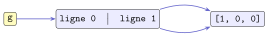

# Exercices

<p class="sous-titre">Les types construits</p>

!!! consignes "Mode d’emploi"

    - Niveau : ★ échauffement, ★★ classique (niveau bac), ★★★ défi ; les *coups de pouce* et les *corrigés* se déplient sous chaque exercice.

    - <span class="run" title="À programmer et tester sur machine">▶</span> *À programmer et tester* en Python. Le symbole `>>>` figure une saisie dans la console. Les exercices de **lecture de trace** sont à faire **sans machine** d’abord, puis à vérifier.

    - **Réflexe fil rouge** : dès qu’on partage ou copie des données *mutables* (tableau, dictionnaire), dessinez les **noms**, les **objets** et les **flèches**.

    - Le badge <span class="horsprog">au-delà du programme</span> signale un point hors programme (utile, non exigible).

    - Usage de l’IA, indiqué sur chaque exercice : <span class="ia ia-rouge" title="Sans IA : le but est l'automatisme lui-même"></span> aucune ; <span class="ia ia-orange" title="IA en appui : déboguer, reformuler, vérifier ; la réponse finale est la vôtre"></span> en appui (déboguer, reformuler, vérifier ; la réponse finale est écrite et comprise par vous) ; <span class="ia ia-vert" title="IA intégrée : l'exercice s'appuie sur une réponse d'IA"></span> l’exercice s’appuie sur une réponse d’IA. Voir la [charte d’usage de l’IA](../charte.md).

### P-uplets (`tuple`)

### <span class="stars" title="Niveau 1 sur 3">★</span> <span class="exo-num">Exercice 1</span> — Lecture de trace <span class="ia ia-rouge" title="Sans IA : le but est l'automatisme lui-même"></span> { #ex-03-1 }

Sans machine, donner la valeur de chaque expression. `t = (5, 10, 15, 20, 25)`

1.  `t[0]` **b)** `t[-1]` **c)** `t[1:3]` **d)** `len(t)` **e)** `15 in t` **f)** `t[-2]`

??? corrige "Corrigé"

    !!! remarque "Remarque"

        Plusieurs écritures sont souvent possibles : on donne **une** version simple.

    **a)** `5` **b)** `25` **c)** `(10, 15)` **d)** `5` **e)** `True` **f)** `20`.

### <span class="stars" title="Niveau 1 sur 3">★</span> <span class="exo-num">Exercice 2</span> — Vrai ou faux ? <span class="ia ia-rouge" title="Sans IA : le but est l'automatisme lui-même"></span> { #ex-03-2 }

Justifier en une ligne (ou par un contre-exemple).

1.  `(7)` est un p-uplet à un élément.

2.  On peut écrire `t[0] = 3` pour changer le premier élément d’un p-uplet.

3.  Un p-uplet peut contenir des éléments de types différents.

4.  `()` est un p-uplet vide valide.

??? corrige "Corrigé"

    **1.** Faux : `(7)` vaut l’entier `7` ; le singleton s’écrit `(7,)`. **2.** Faux : un p-uplet est immuable, l’affectation lève une `TypeError`. **3.** Vrai : `(1, "deux", 3.0)` est valide. **4.** Vrai : `()` est le p-uplet vide.

### <span class="stars" title="Niveau 2 sur 3">★★</span> <span class="exo-num">Exercice 3</span> — Une fonction, plusieurs résultats <span class="ia ia-orange" title="IA en appui : déboguer, reformuler, vérifier ; la réponse finale est la vôtre"></span> { #ex-03-3 }

<span class="run" title="À programmer et tester sur machine">▶</span> Écrire une fonction `somme_moyenne(t)` qui renvoie le **p-uplet** (somme, moyenne) des éléments d’un tableau de nombres non vide. On récupérera le résultat par `s, m = somme_moyenne([…])`.

??? pouce "Coup de pouce"

    Deux étapes : un accumulateur pour la somme, puis la moyenne à partir de la somme et de `len(t)`. Comment une fonction renvoie-t-elle deux valeurs à la fois ?

??? corrige "Corrigé"

    ```python
    def somme_moyenne(t):
        s = 0
        for x in t:
            s = s + x
        return s, s / len(t)     # renvoie le p-uplet (somme, moyenne)
    ```

### <span class="stars" title="Niveau 2 sur 3">★★</span> <span class="exo-num">Exercice 4</span> — Conversion de durée <span class="ia ia-orange" title="IA en appui : déboguer, reformuler, vérifier ; la réponse finale est la vôtre"></span> { #ex-03-4 }

<span class="run" title="À programmer et tester sur machine">▶</span> Écrire `convertir(n)` qui, à partir d’un nombre de secondes `n`, renvoie le p-uplet `(heures, minutes, secondes)`.

```text
>>> convertir(3661)
(1, 1, 1)
```

??? pouce "Coup de pouce"

    Combien de secondes dans une heure ? dans une minute ? Penser au quotient entier `//` et au reste `%`.

??? corrige "Corrigé"

    ```python
    def convertir(n):
        heures = n // 3600
        minutes = (n % 3600) // 60
        secondes = n % 60
        return heures, minutes, secondes
    ```

### <span class="stars" title="Niveau 2 sur 3">★★</span> <span class="exo-num">Exercice 5</span> — Permutation circulaire <span class="ia ia-orange" title="IA en appui : déboguer, reformuler, vérifier ; la réponse finale est la vôtre"></span> { #ex-03-5 }

Soit `a, b, c = 1, 2, 3`. Écrire les instructions (avec une **variable temporaire**) qui font « tourner » les valeurs de sorte qu’ensuite `a` vaille `2`, `b` vaille `3` et `c` vaille `1`. Vérifier en console.

??? pouce "Coup de pouce"

    Quelle valeur serait perdue si l’on écrivait d’abord `a = b` ? C’est elle qu’il faut mettre de côté.

??? corrige "Corrigé"

    On sauvegarde `a` dans une variable temporaire, puis on décale les valeurs :

    ```python
    temp = a         # temp vaut 1 (l'ancien a)
    a = b            # a vaut 2
    b = c            # b vaut 3
    c = temp         # c vaut 1
    ```

### Tableaux (`list`) : accès, modification, parcours

### <span class="stars" title="Niveau 1 sur 3">★</span> <span class="exo-num">Exercice 6</span> — Lecture de trace <span class="ia ia-rouge" title="Sans IA : le but est l'automatisme lui-même"></span> { #ex-03-6 }

Sans machine, donner l’état du tableau après chaque ligne.

```python
t = [4, 8, 15, 16, 23]
t[0] = 42
t[-1] = 0
x = t[1:3]
n = len(t)
```

Que valent `t`, `x` et `n` à la fin ?

??? corrige "Corrigé"

    Après exécution : `t = [42, 8, 15, 16, 0]`, `x = [8, 15]` (la tranche `t[1:3]`, prise *avant* la fin), `n = 5`.

### <span class="stars" title="Niveau 1 sur 3">★</span> <span class="exo-num">Exercice 7</span> — Fabriquer des tableaux <span class="ia ia-rouge" title="Sans IA : le but est l'automatisme lui-même"></span> { #ex-03-7 }

<span class="run" title="À programmer et tester sur machine">▶</span> Sans les écrire à la main, produire :

1.  le tableau des entiers de `0` à `9` ;

2.  le tableau `[10, 20, 30, 40, 50]` ;

3.  un tableau de `8` cases valant toutes `0`.

??? corrige "Corrigé"

    ```python
    a = list(range(10))            # [0, 1, ..., 9]
    b = list(range(10, 51, 10))    # [10, 20, 30, 40, 50]
    c = [0] * 8                    # huit zeros
    ```

### <span class="stars" title="Niveau 2 sur 3">★★</span> <span class="exo-num">Exercice 8</span> — Parcours : les grands classiques <span class="ia ia-orange" title="IA en appui : déboguer, reformuler, vérifier ; la réponse finale est la vôtre"></span> { #ex-03-8 }

<span class="run" title="À programmer et tester sur machine">▶</span> Écrire, **sans** utiliser les fonctions `sum`, `max`, `min`, les fonctions suivantes (tableau de nombres non vide) :

1.  `somme(t)` : la somme des éléments ;

2.  `maximum(t)` : le plus grand élément ;

3.  `moyenne(t)` : la moyenne ;

4.  `nb_positifs(t)` : le nombre d’éléments strictement positifs.

??? pouce "Coup de pouce"

    Somme et comptage : un accumulateur initialisé *avant* la boucle. Maximum : avec quelle valeur initialiser le « meilleur jusqu’ici », sachant que le tableau est non vide ?

??? pouce "Coup de pouce 2 (début de solution)"

    `def maximum(t):`  
    `m = t[0]`  
    `for x in t:`  
    puis comparer `x` à `m`.

??? corrige "Corrigé"

    ```python
    def somme(t):
        s = 0
        for x in t:
            s = s + x
        return s

    def maximum(t):
        m = t[0]
        for x in t:
            if x > m:
                m = x
        return m

    def moyenne(t):
        return somme(t) / len(t)

    def nb_positifs(t):
        c = 0
        for x in t:
            if x > 0:
                c = c + 1
        return c
    ```

### <span class="stars" title="Niveau 2 sur 3">★★</span> <span class="exo-num">Exercice 9</span> — Modifier sur place <span class="ia ia-orange" title="IA en appui : déboguer, reformuler, vérifier ; la réponse finale est la vôtre"></span> { #ex-03-9 }

<span class="run" title="À programmer et tester sur machine">▶</span> Écrire des fonctions qui **modifient** le tableau reçu (sans en renvoyer un nouveau) :

1.  `ajouter_un(t)` : ajoute `1` à chaque élément ;

2.  `plafonner(t, m)` : remplace par `m` tout élément supérieur à `m`.

??? pouce "Coup de pouce"

    Pour modifier une case, il faut connaître sa position : parcourir par **indice** (`for i in range(len(t))`) plutôt que par élément.

??? corrige "Corrigé"

    On parcourt par **indice** (indispensable pour modifier).

    ```python
    def ajouter_un(t):
        for i in range(len(t)):
            t[i] = t[i] + 1

    def plafonner(t, m):
        for i in range(len(t)):
            if t[i] > m:
                t[i] = m
    ```

### <span class="stars" title="Niveau 2 sur 3">★★</span> <span class="exo-num">Exercice 10</span> — Chercher et compter <span class="ia ia-orange" title="IA en appui : déboguer, reformuler, vérifier ; la réponse finale est la vôtre"></span> { #ex-03-10 }

<span class="run" title="À programmer et tester sur machine">▶</span> Écrire sans utiliser les méthodes `count`/`index` :

1.  `occurrences(t, x)` : le nombre de fois où `x` apparaît dans `t` ;

2.  `est_present(t, x)` : `True` si `x` est dans `t`, sinon `False` ;

3.  `premier_indice(t, x)` : l’indice de la première occurrence de `x`, ou `-1` s’il est absent.

??? pouce "Coup de pouce"

    Pour `premier_indice`, parcourir par indice et sortir avec `return` dès qu’on trouve `x`. Que renvoyer si la boucle se termine sans avoir rien trouvé ?

??? corrige "Corrigé"

    ```python
    def occurrences(t, x):
        c = 0
        for v in t:
            if v == x:
                c = c + 1
        return c

    def est_present(t, x):
        for v in t:
            if v == x:
                return True
        return False

    def premier_indice(t, x):
        for i in range(len(t)):
            if t[i] == x:
                return i
        return -1
    ```

### <span class="stars" title="Niveau 2 sur 3">★★</span> <span class="exo-num">Exercice 11</span> — Renverser sans `reverse` <span class="ia ia-orange" title="IA en appui : déboguer, reformuler, vérifier ; la réponse finale est la vôtre"></span> { #ex-03-11 }

<span class="run" title="À programmer et tester sur machine">▶</span> Écrire `renverser(t)` qui **renvoie un nouveau** tableau contenant les éléments de `t` en ordre inverse, sans utiliser la méthode `reverse` ni la tranche `[::-1]`.

??? pouce "Coup de pouce"

    Partir d’un tableau vide et le remplir avec `append` : dans quel ordre faut-il parcourir les indices de `t` ?

??? corrige "Corrigé"

    On construit un nouveau tableau en parcourant `t` de la fin vers le début.

    ```python
    def renverser(t):
        r = []
        for i in range(len(t) - 1, -1, -1):
            r.append(t[i])
        return r
    ```

    *Autre méthode :* une fois la compréhension vue, le même parcours des indices à l’envers s’écrit en une ligne : `return [t[i] for i in range(len(t) - 1, -1, -1)]`.

### <span class="stars" title="Niveau 1 sur 3">★</span> <span class="exo-num">Exercice 12</span> — Méthodes des tableaux <span class="horsprog">au-delà du programme</span> <span class="ia ia-orange" title="IA en appui : déboguer, reformuler, vérifier ; la réponse finale est la vôtre"></span> { #ex-03-12 }

<span class="run" title="À programmer et tester sur machine">▶</span> Partant de `t = [3, 1, 4, 1, 5]`, donner une instruction utilisant une **méthode** pour :

1.  ajouter `9` à la fin ;

2.  insérer `0` en tête ;

3.  retirer (et récupérer) le dernier élément ;

4.  retirer la première valeur `1` ;

5.  trier le tableau.

??? corrige "Corrigé"

    Avec `t = [3, 1, 4, 1, 5]` :

    ```python
    t.append(9)      # a) [3, 1, 4, 1, 5, 9]
    t.insert(0, 0)   # b) [0, 3, 1, 4, 1, 5, 9]
    x = t.pop()      # c) x vaut 9 ; le 9 est retire
    t.remove(1)      # d) retire le PREMIER 1
    t.sort()         # e) trie
    ```

### Construction par compréhension

### <span class="stars" title="Niveau 1 sur 3">★</span> <span class="exo-num">Exercice 13</span> — Lecture de trace <span class="ia ia-rouge" title="Sans IA : le but est l'automatisme lui-même"></span> { #ex-03-13 }

Sans machine, donner le tableau produit.

1.  `[n + 1 for n in range(5)]`

2.  `[2 ** k for k in range(5)]`

3.  `[c for c in "python" if c in "aeiouy"]`

4.  `[n for n in range(30) if n % 5 == 0]`

??? corrige "Corrigé"

    **a)** `[1, 2, 3, 4, 5]` **b)** `[1, 2, 4, 8, 16]` **c)** `[’y’, ’o’]` **d)** `[0, 5, 10, 15, 20, 25]`.

### <span class="stars" title="Niveau 2 sur 3">★★</span> <span class="exo-num">Exercice 14</span> — Écrire des compréhensions <span class="ia ia-orange" title="IA en appui : déboguer, reformuler, vérifier ; la réponse finale est la vôtre"></span> { #ex-03-14 }

Donner **en une ligne** (compréhension) le tableau :

1.  des cubes de `0` à `6` ;

2.  des multiples de `3` strictement inférieurs à `40` ;

3.  des longueurs des mots de `["chat", "python", "nsi"]` (on pourra utiliser `len`) ;

4.  des entiers de `1` à `50` qui sont des carrés parfaits.

??? pouce "Coup de pouce"

    Forme générale : `[expression for variable in ... if condition]`. Pour la 4, plutôt que de tester chaque entier, peut-on fabriquer directement les carrés ? Jusqu’où faire varier la variable ?

??? corrige "Corrigé"

    ```python
    [k ** 3 for k in range(7)]                 # 1. cubes de 0 a 6
    [n for n in range(40) if n % 3 == 0]       # 2. multiples de 3 < 40
    [len(mot) for mot in ["chat", "python", "nsi"]]   # 3. longueurs
    [k * k for k in range(1, 8)]               # 4. carres parfaits de 1 a 50
    ```

    *Pour 4, on fabrique directement les carrés plutôt que de tester chaque entier : $7 \times 7 = 49 \leqslant 50$ mais $8 \times 8 = 64 > 50$, donc `k` va de `1` à `7`. Si l’on ne veut pas chercher la borne, on filtre : `[k * k for k in range(1, 51) if k * k <= 50]`.*

### <span class="stars" title="Niveau 2 sur 3">★★</span> <span class="exo-num">Exercice 15</span> — De la boucle à la compréhension <span class="ia ia-orange" title="IA en appui : déboguer, reformuler, vérifier ; la réponse finale est la vôtre"></span> { #ex-03-15 }

Réécrire chacun de ces codes en **une** compréhension.

```python
# (a)                              # (b)
r = []                             r = []
for x in [5, -2, 7, -8, 3]:        for c in "Bonjour":
    if x > 0:                          r.append(c.lower())
        r.append(x)
```

??? pouce "Coup de pouce"

    Repérer dans chaque boucle trois morceaux : ce qui est ajouté (dans `append`), la ligne `for`, et la condition éventuelle. Dans quel ordre les placer entre crochets ?

??? corrige "Corrigé"

    ```python
    r = [x for x in [5, -2, 7, -8, 3] if x > 0]   # (a) -> [5, 7, 3]
    r = [c.lower() for c in "Bonjour"]            # (b) ->
    # ['b', 'o', 'n', 'j', 'o', 'u', 'r']
    ```

### <span class="stars" title="Niveau 2 sur 3">★★</span> <span class="exo-num">Exercice 16</span> — Nettoyer une phrase <span class="ia ia-orange" title="IA en appui : déboguer, reformuler, vérifier ; la réponse finale est la vôtre"></span> { #ex-03-16 }

<span class="run" title="À programmer et tester sur machine">▶</span> À l’aide d’une compréhension, écrire `voyelles(phrase)` qui renvoie le tableau des voyelles de `phrase` (en minuscule), dans l’ordre. Puis en déduire `nb_voyelles(phrase)`.

```text
>>> voyelles("Bonjour NSI")
['o', 'o', 'u', 'i']
```

??? pouce "Coup de pouce"

    Le filtre porte sur la lettre *mise en minuscule* (`.lower()`) : est-elle dans `"aeiouy"` ? Pour `nb_voyelles`, réutiliser `voyelles`.

??? corrige "Corrigé"

    ```python
    def voyelles(phrase):
        return [c.lower() for c in phrase if c.lower() in "aeiouy"]

    def nb_voyelles(phrase):
        return len(voyelles(phrase))
    ```

    *Autre méthode :* la même idée avec une boucle et `append` (c’est exactement ce que la compréhension condense).

    ```python
    def voyelles(phrase):
        resultat = []
        for c in phrase:
            if c.lower() in "aeiouy":
                resultat.append(c.lower())
        return resultat
    ```

### Matrices (tableaux de tableaux)

### <span class="stars" title="Niveau 1 sur 3">★</span> <span class="exo-num">Exercice 17</span> — Se repérer dans une matrice <span class="ia ia-rouge" title="Sans IA : le but est l'automatisme lui-même"></span> { #ex-03-17 }

On pose `M = [[1, 2, 3], [4, 5, 6], [7, 8, 9]]`.

1.  Que valent `M[0]`, `M[2][1]`, `M[1][0]` ?

2.  Que valent `len(M)` et `len(M[0])` ? Que représentent-ils ?

3.  Écrire l’instruction qui met la case centrale à `0`.

??? corrige "Corrigé"

    **a)** `M[0] = [1, 2, 3]`, `M[2][1] = 8`, `M[1][0] = 4`. **b)** `len(M) = 3` (nombre de lignes), `len(M[0]) = 3` (nombre de colonnes). **c)** `M[1][1] = 0`.

### <span class="stars" title="Niveau 2 sur 3">★★</span> <span class="exo-num">Exercice 18</span> — Parcourir une matrice <span class="ia ia-orange" title="IA en appui : déboguer, reformuler, vérifier ; la réponse finale est la vôtre"></span> { #ex-03-18 }

<span class="run" title="À programmer et tester sur machine">▶</span> Pour une matrice `M` de nombres (`n` lignes, `p` colonnes), écrire :

1.  `somme_matrice(M)` : la somme de toutes les cases ;

2.  `maximum_matrice(M)` : la plus grande case ;

3.  `somme_ligne(M, i)` : la somme de la ligne d’indice `i`.

??? pouce "Coup de pouce"

    Deux boucles imbriquées : l’une sur les lignes, l’autre sur les cases de la ligne. Pour le maximum, initialiser avec une case qui existe. Pour `somme_ligne`, une seule boucle suffit.

??? pouce "Coup de pouce 2 (début de solution)"

    `def somme_matrice(M):`  
    `s = 0`  
    `for ligne in M:`  
    `for x in ligne:`

??? corrige "Corrigé"

    ```python
    def somme_matrice(M):
        s = 0
        for i in range(len(M)):
            for j in range(len(M[0])):
                s = s + M[i][j]
        return s

    def maximum_matrice(M):
        m = M[0][0]
        for ligne in M:
            for x in ligne:
                if x > m:
                    m = x
        return m

    def somme_ligne(M, i):
        s = 0
        for x in M[i]:
            s = s + x
        return s
    ```

### <span class="stars" title="Niveau 2 sur 3">★★</span> <span class="exo-num">Exercice 19</span> — Créer une grille — et le piège <span class="ia ia-orange" title="IA en appui : déboguer, reformuler, vérifier ; la réponse finale est la vôtre"></span> { #ex-03-19 }

1.  **Lecture de trace (sans machine).** On exécute :

    ```python
    g = [[0] * 3] * 2
    g[0][0] = 1
    ```

    Donner la valeur de `g`. Est-ce le résultat attendu ? **Expliquer** avec un schéma du fil rouge (noms, objets, flèches).

2.  <span class="run" title="À programmer et tester sur machine">▶</span> Écrire `grille_zeros(n, p)` qui renvoie *correctement* une matrice de `n` lignes et `p` colonnes remplie de `0`, en utilisant une compréhension. Vérifier que modifier une case n’en modifie qu’une.

??? pouce "Coup de pouce"

    Question 1 : `* 2` recopie-t-il la ligne, ou seulement la flèche vers la ligne ? Question 2 : chaque ligne doit être un objet neuf ; quelle construction réévalue `[0] * p` pour chaque ligne ?

??? corrige "Corrigé"

    **1.** `g` vaut `[[1, 0, 0], [1, 0, 0]]` : **pas** le résultat attendu ! Avec `*`, les deux « lignes » sont *le même* objet (deux flèches vers un seul tableau) ; modifier `g[0][0]` modifie donc aussi `g[1]`.

    { .tikz loading=lazy }

    **2.** Avec une compréhension, chaque tour crée une ligne *neuve* :

    ```python
    def grille_zeros(n, p):
        return [[0 for j in range(p)] for i in range(n)]

    g = grille_zeros(2, 3)
    g[0][0] = 1        # g vaut [[1, 0, 0], [0, 0, 0]] : une seule case changee
    ```

### <span class="stars" title="Niveau 3 sur 3">★★★</span> <span class="exo-num">Exercice 20</span> — Transposée <span class="ia ia-orange" title="IA en appui : déboguer, reformuler, vérifier ; la réponse finale est la vôtre"></span> { #ex-03-20 }

<span class="run" title="À programmer et tester sur machine">▶</span> Écrire `transposee(M)` qui renvoie la **transposée** d’une matrice `n`$\times$`p` (les lignes deviennent les colonnes), sans modifier `M`.

```text
>>> transposee([[1, 2, 3], [4, 5, 6]])
[[1, 4], [2, 5], [3, 6]]
```

??? pouce "Coup de pouce"

    Si `M` a `n` lignes et `p` colonnes, combien de lignes et de colonnes a sa transposée ? Comparer la case `(i, j)` de la transposée avec une case de `M`.

??? pouce "Coup de pouce 2 (début de solution)"

    `n = len(M)`  
    `p = len(M[0])`  
    puis construire `p` lignes de `n` cases chacune, par compréhension ou avec deux boucles.

??? corrige "Corrigé"

    La transposée a `p` lignes et `n` colonnes : la case `(j, i)` du résultat est `M[i][j]`.

    ```python
    def transposee(M):
        n = len(M)
        p = len(M[0])
        return [[M[i][j] for i in range(n)] for j in range(p)]
    ```

    *Autre méthode :* avec deux boucles, on construit la transposée ligne par ligne ; sa ligne `j` est la colonne `j` de `M`.

    ```python
    def transposee(M):
        resultat = []
        for j in range(len(M[0])):
            ligne = []                  # la colonne j de M
            for i in range(len(M)):
                ligne.append(M[i][j])
            resultat.append(ligne)
        return resultat
    ```

### <span class="stars" title="Niveau 3 sur 3">★★★</span> <span class="exo-num">Exercice 21</span> — Traitement d’image <span class="ia ia-orange" title="IA en appui : déboguer, reformuler, vérifier ; la réponse finale est la vôtre"></span> { #ex-03-21 }

Une image en niveaux de gris est une matrice d’entiers de `0` à `255`.

1.  <span class="run" title="À programmer et tester sur machine">▶</span> `negatif(image)` : **modifie** l’image en remplaçant chaque pixel `p` par `255 - p`.

2.  <span class="run" title="À programmer et tester sur machine">▶</span> `symetrie_horizontale(image)` : renvoie une **nouvelle** image, miroir gauche-droite (chaque ligne est renversée).

??? pouce "Coup de pouce"

    1 : on modifie sur place, donc on parcourt par indices (ligne `i`, colonne `j`). 2 : chaque ligne se renverse comme dans l’exercice « Renverser sans `reverse` » ; on construit l’image résultat ligne par ligne.

??? pouce "Coup de pouce 2 (début de solution)"

    `def negatif(image):`  
    `for i in range(len(image)):`  
    `for j in range(len(image[i])):`

??? corrige "Corrigé"

    ```python
    def negatif(image):                     # modifie sur place
        for i in range(len(image)):
            for j in range(len(image[0])):
                image[i][j] = 255 - image[i][j]

    def symetrie_horizontale(image):        # renvoie une NOUVELLE image
        nouvelle = []
        for ligne in image:
            p = len(ligne)
            nouvelle.append([ligne[p - 1 - j] for j in range(p)])
        return nouvelle
    ```

### Dictionnaires (`dict`)

### <span class="stars" title="Niveau 1 sur 3">★</span> <span class="exo-num">Exercice 22</span> — Lecture de trace <span class="ia ia-rouge" title="Sans IA : le but est l'automatisme lui-même"></span> { #ex-03-22 }

On part de `d = {"a": 1, "b": 2}`. Donner l’état de `d` (ou la valeur) après chaque ligne, dans l’ordre.

```python
d["c"] = 3
d["a"] = 10
del d["b"]
x = "c" in d
y = 3 in d
z = len(d)
```

??? corrige "Corrigé"

    Dans l’ordre : `d = {"a": 1, "b": 2, "c": 3}`, puis `{"a": 10, "b": 2, "c": 3}`, puis `{"a": 10, "c": 3}`. Ensuite `x = True` (`"c"` est une clé), `y = False` (`in` teste les clés, pas les valeurs), `z = 2`.

### <span class="stars" title="Niveau 2 sur 3">★★</span> <span class="exo-num">Exercice 23</span> — Parcourir un dictionnaire <span class="ia ia-orange" title="IA en appui : déboguer, reformuler, vérifier ; la réponse finale est la vôtre"></span> { #ex-03-23 }

On dispose de `notes = {"Alice": 14, "Bob": 9, "Chloe": 17}`.

1.  <span class="run" title="À programmer et tester sur machine">▶</span> Écrire `moyenne(notes)` qui renvoie la moyenne des valeurs.

2.  <span class="run" title="À programmer et tester sur machine">▶</span> Écrire `admis(notes, seuil)` qui renvoie le tableau des prénoms dont la note est $\geqslant$ `seuil`.

3.  <span class="run" title="À programmer et tester sur machine">▶</span> Écrire `meilleur(notes)` qui renvoie le prénom ayant la meilleure note.

??? pouce "Coup de pouce"

    `for prenom in notes:` parcourt les **clés** ; la note est `notes[prenom]`. Pour `meilleur`, il faut retenir le *prénom* du meilleur jusqu’ici, pas seulement sa note.

??? corrige "Corrigé"

    ```python
    def moyenne(notes):
        return sum(notes.values()) / len(notes)

    def admis(notes, seuil):
        return [prenom for prenom in notes if notes[prenom] >= seuil]

    def meilleur(notes):
        champion = None
        meilleure_note = -1             # toute note est superieure a -1
        for prenom in notes:
            if notes[prenom] > meilleure_note:
                meilleure_note = notes[prenom]
                champion = prenom
        return champion
    ```

    Pour `meilleur`, c’est une recherche de maximum où l’on retient *aussi* le prénom du champion.

### <span class="stars" title="Niveau 1 sur 3">★</span> <span class="exo-num">Exercice 24</span> — Compter des votes : code à trous <span class="ia ia-rouge" title="Sans IA : le but est l'automatisme lui-même"></span> { #ex-03-24 }

Le tableau `votes` contient le prénom choisi par chaque votant. Recopier et compléter les pointillés pour que la fonction renvoie un dictionnaire associant à chaque prénom son nombre de voix.

```python
def compter_votes(votes):
    resultat = ......
    for prenom in ......:
        if prenom ...... resultat:
            resultat[prenom] = ......
        else:
            resultat[prenom] = ......
    return resultat
```

```text
>>> compter_votes(["Ada", "Léo", "Ada"])
{'Ada': 2, 'Léo': 1}
```

??? corrige "Corrigé"

    ```python
    def compter_votes(votes):
        resultat = {}
        for prenom in votes:
            if prenom in resultat:
                resultat[prenom] = resultat[prenom] + 1
            else:
                resultat[prenom] = 1
        return resultat
    ```

    C’est le schéma du compteur par dictionnaire du cours : une clé absente est créée avec la valeur `1`, une clé présente voit sa valeur augmenter de `1`.

### <span class="stars" title="Niveau 2 sur 3">★★</span> <span class="exo-num">Exercice 25</span> — Comptage d’occurrences <span class="ia ia-orange" title="IA en appui : déboguer, reformuler, vérifier ; la réponse finale est la vôtre"></span> { #ex-03-25 }

<span class="run" title="À programmer et tester sur machine">▶</span> Écrire `compter_lettres(mot)` qui renvoie un dictionnaire associant à chaque lettre de `mot` son nombre d’occurrences.

```text
>>> compter_lettres("banane")
{'b': 1, 'a': 2, 'n': 2, 'e': 1}
```

??? pouce "Coup de pouce"

    Même schéma que l’exercice précédent : qu’est-ce qui joue ici le rôle de clé ? Que faire quand on rencontre une lettre pour la première fois ?

??? corrige "Corrigé"

    ```python
    def compter_lettres(mot):
        compteur = {}
        for lettre in mot:
            if lettre in compteur:
                compteur[lettre] = compteur[lettre] + 1
            else:
                compteur[lettre] = 1
        return compteur
    ```

### <span class="stars" title="Niveau 2 sur 3">★★</span> <span class="exo-num">Exercice 26</span> — Inverser un dictionnaire <span class="ia ia-orange" title="IA en appui : déboguer, reformuler, vérifier ; la réponse finale est la vôtre"></span> { #ex-03-26 }

<span class="run" title="À programmer et tester sur machine">▶</span> Écrire `inverser(d)` qui échange clés et valeurs (on suppose les valeurs uniques).

```text
>>> inverser({"a": 1, "b": 2})
{1: 'a', 2: 'b'}
```

**Question :** pourquoi cela ne marcherait-il pas si deux clés partageaient la même valeur ?

??? pouce "Coup de pouce"

    Remplir un dictionnaire neuf en parcourant les clés de `d` : que devient la clé, que devient la valeur ? Pour la question : que se passe-t-il quand on affecte deux fois la même clé ?

??? corrige "Corrigé"

    ```python
    def inverser(d):
        resultat = {}
        for cle, valeur in d.items():
            resultat[valeur] = cle
        return resultat
    ```

    Si deux clés partageaient la même valeur, cette valeur deviendrait une **clé unique** dans le résultat : la seconde écraserait la première, et une information serait perdue.

### <span class="stars" title="Niveau 3 sur 3">★★★</span> <span class="exo-num">Exercice 27</span> — Un mini-annuaire à clés composées <span class="ia ia-orange" title="IA en appui : déboguer, reformuler, vérifier ; la réponse finale est la vôtre"></span> { #ex-03-27 }

On enregistre les notes d’une classe dans un dictionnaire dont la clé est le p-uplet `(élève, matière)`.

```python
releve = {("Ada", "NSI"): 18, ("Ada", "Maths"): 15, ("Léo", "NSI"): 12}
```

1.  Donner l’instruction qui lit la note d’Ada en Maths.

2.  <span class="run" title="À programmer et tester sur machine">▶</span> Écrire `moyenne_eleve(releve, eleve)` qui renvoie la moyenne d’un élève sur toutes ses matières.

3.  **Pourquoi** la clé est-elle un p-uplet et non un tableau ? (une phrase, fil rouge)

??? pouce "Coup de pouce"

    Question 2 : parcourir les clés `(nom, matiere)` du relevé et ne garder que celles de l’élève cherché ; il faut une somme *et* un compteur. Question 3 : relire la règle du cours sur les clés de dictionnaire.

??? pouce "Coup de pouce 2 (début de solution)"

    `total = 0`  
    `n = 0`  
    `for (nom, matiere) in releve:`  
    `if nom == eleve:`

??? corrige "Corrigé"

    **1.** `releve[("Ada", "Maths")]` vaut `15`.

    ```python
    def moyenne_eleve(releve, eleve):
        total = 0
        n = 0
        for (nom, matiere) in releve:      # chaque cle est un couple
            if nom == eleve:
                total = total + releve[(nom, matiere)]
                n = n + 1
        return total / n
    ```

    **3.** La clé doit être **immuable** : un p-uplet ne peut pas changer après coup, un tableau si — ce qui empêcherait de retrouver la valeur.

### Le fil rouge à l’épreuve : références, alias, copie

### <span class="stars" title="Niveau 2 sur 3">★★</span> <span class="exo-num">Exercice 28</span> — Alias ou copie ? (lecture de trace) <span class="ia ia-rouge" title="Sans IA : le but est l'automatisme lui-même"></span> { #ex-03-28 }

Sans machine, prédire l’affichage. Pour chaque cas, dire s’il y a **un** ou **deux** objets en mémoire.

```python
# (a)                     # (b)
a = [1, 2, 3]             a = [1, 2, 3]
b = a                     b = list(a)
b.append(4)               b.append(4)
print(a, b)               print(a, b)
```

??? pouce "Coup de pouce"

    Dessiner, pour chaque cas, les noms et les flèches après la 2<sup>e</sup> ligne : `list(a)` fabrique-t-il un nouvel objet ?

??? corrige "Corrigé"

    **(a)** affiche `[1, 2, 3, 4] [1, 2, 3, 4]` : `b = a` crée un **alias**, **un seul** objet pour deux noms. **(b)** affiche `[1, 2, 3] [1, 2, 3, 4]` : `list(a)` crée un **nouvel** objet, **deux** objets indépendants.

### <span class="stars" title="Niveau 2 sur 3">★★</span> <span class="exo-num">Exercice 29</span> — Effet de bord d’une fonction <span class="ia ia-rouge" title="Sans IA : le but est l'automatisme lui-même"></span> { #ex-03-29 }

Sans machine, prédire l’affichage et l’**expliquer**.

```python
def ajoute_zero(t):
    t.append(0)

notes = [12, 15]
ajoute_zero(notes)
print(notes)
```

**Question :** comment récrire `ajoute_zero` pour qu’elle *ne modifie pas* le tableau reçu mais en **renvoie** un nouveau ?

??? pouce "Coup de pouce"

    Pendant l’appel, le paramètre `t` et la variable `notes` sont-ils deux objets, ou deux étiquettes sur le même objet ? Pour la question, commencer par fabriquer une copie.

??? corrige "Corrigé"

    Affiche `[12, 15, 0]`. Le paramètre `t` et la variable `notes` pointent vers **le même** tableau : la méthode `append` le modifie, donc le changement est visible à l’extérieur (effet de bord). Pour ne pas modifier l’original, on travaille sur une copie :

    ```python
    def avec_zero(t):
        nouveau = list(t)     # copie independante
        nouveau.append(0)
        return nouveau
    ```

### <span class="stars" title="Niveau 3 sur 3">★★★</span> <span class="exo-num">Exercice 30</span> — Le piège en dictionnaire <span class="ia ia-rouge" title="Sans IA : le but est l'automatisme lui-même"></span> { #ex-03-30 }

Sans machine, prédire l’affichage.

```python
modele = {"vie": 100, "sac": []}
joueur1 = modele
joueur2 = dict(modele)
joueur1["vie"] = 50
joueur2["sac"].append("clef")
print(modele["vie"], modele["sac"])
```

<span class="horsprog">au-delà du programme</span>

??? pouce "Coup de pouce"

    `dict(modele)` copie le premier niveau seulement : la valeur associée à `"sac"` est-elle recopiée, ou seulement la flèche vers ce tableau ?

??? pouce "Coup de pouce 2 (début de solution)"

    Dessiner trois noms `modele`, `joueur1`, `joueur2` : `joueur1` pointe vers le même dictionnaire que `modele` ; `joueur2` pointe vers un nouveau dictionnaire. Suivre ensuite chaque flèche lors des deux modifications.

??? corrige "Corrigé"

    Affiche `50 [’clef’]`.

    - `joueur1 = modele` est un alias : `joueur1["vie"] = 50` change bien `modele["vie"]`.

    - `joueur2 = dict(modele)` copie le *premier niveau*, mais la valeur associée à `"sac"` (le tableau) reste **partagée** : `joueur2["sac"].append("clef")` modifie donc aussi `modele["sac"]`. Il faudrait une copie *profonde* (`deepcopy`). <span class="horsprog">au-delà du programme</span>

### Synthèse : petits problèmes

### <span class="stars" title="Niveau 2 sur 3">★★</span> <span class="exo-num">Exercice 31</span> — Carnet de notes <span class="ia ia-orange" title="IA en appui : déboguer, reformuler, vérifier ; la réponse finale est la vôtre"></span> { #ex-03-31 }

Un carnet associe à chaque élève le **tableau** de ses notes :

```python
carnet = {"Alice": [12, 15, 9], "Bob": [8, 14]}
```

1.  <span class="run" title="À programmer et tester sur machine">▶</span> `ajouter_note(carnet, eleve, note)` : ajoute une note à un élève (créer l’élève s’il est absent).

2.  <span class="run" title="À programmer et tester sur machine">▶</span> `moyenne_eleve(carnet, eleve)` : la moyenne d’un élève.

3.  <span class="run" title="À programmer et tester sur machine">▶</span> `moyennes(carnet)` : un dictionnaire prénom $\to$ moyenne.

??? pouce "Coup de pouce"

    Question 1 : tester `eleve in carnet` avant d’ajouter. Question 3 : réutiliser `moyenne_eleve` pour chaque clé du carnet.

??? pouce "Coup de pouce 2 (début de solution)"

    `def ajouter_note(carnet, eleve, note):`  
    `if eleve not in carnet:`  
    `carnet[eleve] = []`

??? corrige "Corrigé"

    ```python
    def ajouter_note(carnet, eleve, note):
        if eleve in carnet:
            carnet[eleve].append(note)
        else:
            carnet[eleve] = [note]

    def moyenne_eleve(carnet, eleve):
        notes = carnet[eleve]
        return sum(notes) / len(notes)

    def moyennes(carnet):
        resultat = {}
        for eleve in carnet:
            resultat[eleve] = moyenne_eleve(carnet, eleve)
        return resultat
    ```

### <span class="stars" title="Niveau 3 sur 3">★★★</span> <span class="exo-num">Exercice 32</span> — Panier d’une boutique <span class="ia ia-orange" title="IA en appui : déboguer, reformuler, vérifier ; la réponse finale est la vôtre"></span> { #ex-03-32 }

Un panier est un dictionnaire `produit `$\to$` quantité`, et `prix` un dictionnaire `produit `$\to$` prix unitaire`.

```python
panier = {"pomme": 3, "pain": 2}
prix   = {"pomme": 0.5, "pain": 1.2, "lait": 0.9}
```

1.  <span class="run" title="À programmer et tester sur machine">▶</span> `total(panier, prix)` : le montant total du panier.

2.  <span class="run" title="À programmer et tester sur machine">▶</span> `ajouter(panier, produit, q)` : ajoute `q` unités (cumule si le produit y est déjà).

3.  <span class="run" title="À programmer et tester sur machine">▶</span> `article_le_plus_cher(panier, prix)` : le nom du produit du panier dont le *sous-total* est le plus élevé.

??? pouce "Coup de pouce"

    Sous-total d’un produit = quantité $\times$ prix unitaire. Question 3 : c’est une recherche de maximum, mais on retient le *nom* du produit en plus de son sous-total.

??? pouce "Coup de pouce 2 (début de solution)"

    `def total(panier, prix):`  
    `s = 0`  
    `for produit in panier:`

??? corrige "Corrigé"

    ```python
    def total(panier, prix):
        s = 0
        for produit, q in panier.items():
            s = s + q * prix[produit]
        return s

    def ajouter(panier, produit, q):
        if produit in panier:
            panier[produit] = panier[produit] + q
        else:
            panier[produit] = q

    def article_le_plus_cher(panier, prix):
        champion = None
        meilleur_sous_total = -1
        for produit, q in panier.items():
            sous_total = q * prix[produit]
            if sous_total > meilleur_sous_total:
                meilleur_sous_total = sous_total
                champion = produit
        return champion
    ```

### <span class="stars" title="Niveau 3 sur 3">★★★</span> <span class="exo-num">Exercice 33</span> — Vers le bac — le jeu du démineur (grille) <span class="ia ia-orange" title="IA en appui : déboguer, reformuler, vérifier ; la réponse finale est la vôtre"></span> { #ex-03-33 }

<span class="run" title="À programmer et tester sur machine">▶</span> On représente un champ de mines par une matrice de `0` et de `1` (`1` = mine). Écrire `compter_voisines(champ, i, j)` qui renvoie le nombre de mines dans les (au plus `8`) cases voisines de la case `(i, j)`. *Attention aux bords : ne pas sortir de la grille.*

```text
>>> champ = [[0, 1, 0], [1, 0, 0], [0, 0, 1]]
>>> compter_voisines(champ, 1, 1)
3
```

??? pouce "Coup de pouce"

    Une voisine de `(i, j)` s’écrit `(i + di, j + dj)` avec `di` et `dj` pris dans `-1, 0, 1`. Quel couple `(di, dj)` faut-il écarter ? Quand une case `(a, b)` est-elle dans la grille ?

??? pouce "Coup de pouce 2 (début de solution)"

    `for di in [-1, 0, 1]:`  
    `for dj in [-1, 0, 1]:`  
    `a, b = i + di, j + dj`

??? corrige "Corrigé"

    On balaie les `9` cases `(a, b)` du carré $3 \times 3$ centré sur `(i, j)` ; on ne compte une case que si elle est **dans la grille** et que ce n’est **pas** la case `(i, j)` elle-même.

    ```python
    def compter_voisines(champ, i, j):
        n = len(champ)
        p = len(champ[0])
        total = 0
        for di in [-1, 0, 1]:
            for dj in [-1, 0, 1]:
                a = i + di
                b = j + dj
                dans_grille = a >= 0 and a < n and b >= 0 and b < p
                if dans_grille and not (di == 0 and dj == 0):
                    total = total + champ[a][b]
        return total
    ```

### <span class="stars" title="Niveau 2 sur 3">★★</span> <span class="exo-num">Exercice 34</span> — Une copie selon un assistant d’IA <span class="ia ia-vert" title="IA intégrée : l'exercice s'appuie sur une réponse d'IA"></span> { #ex-03-34 }

Un élève demande à un assistant d’IA : « Écris une fonction Python qui renvoie un nouveau tableau contenant le double de chaque note, sans modifier le tableau d’origine. » Voici la réponse obtenue.

```python
def doubler(t):
    copie = t                 # copie du tableau d'origine
    for i in range(len(copie)):
        copie[i] = copie[i] * 2
    return copie
```

« On commence par copier le tableau dans `copie`, puis on double chaque case de la copie et on la renvoie : le tableau `t` passé en argument n’est pas touché. »

On exécute ensuite :

```python
notes = [12, 15, 9]
doubles = doubler(notes)
print(doubles, notes)
```

1.  La réponse est-elle correcte ? Prédire l’affichage (avec le dessin noms / flèches / objets), puis <span class="run" title="À programmer et tester sur machine">▶</span> vérifier.

2.  Localiser et corriger l’erreur.

3.  Quelle vérification simple, faite avant de faire confiance à la réponse, aurait suffi à détecter l’erreur ?

??? pouce "Coup de pouce"

    Dessiner les noms `t` et `copie` juste après la première ligne de la fonction : combien d’objets tableau y a-t-il ?

??? corrige "Corrigé"

    **1.** Non. L’affichage est `[24, 30, 18] [24, 30, 18]` : le tableau d’origine `notes` a été modifié, contrairement à ce qui était demandé. **2.** L’erreur est la ligne `copie = t` : elle ne copie rien, elle crée un **alias** (deux noms qui pointent vers le *même* tableau, fil rouge du cours). Modifier `copie[i]`, c’est modifier `t`. Il faut construire un nouvel objet, `copie = list(t)` (ou `t[:]`, ou `t.copy()`) :

    ```python
    def doubler(t):
        copie = list(t)           # NOUVEL objet, independant de t
        for i in range(len(copie)):
            copie[i] = copie[i] * 2
        return copie

    notes = [12, 15, 9]
    doubles = doubler(notes)
    print(doubles, notes)         # [24, 30, 18] [12, 15, 9]
    ```

    **3.** Afficher le tableau d’origine **après** l’appel : c’est exactement ce que la demande promettait (« sans modifier ») et donc la première chose à tester. Un commentaire qui dit « copie » ne prouve pas qu’il y a copie.
