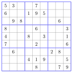
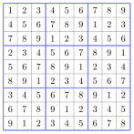
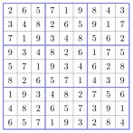

# TP et projets

<p class="sous-titre">Les types construits</p>

## <span class="etiquette">Projet</span> Sudoku : vérifier une grille

!!! fichiers "Fichiers à télécharger"

    [:material-folder-open: dossier en ligne](https://github.com/MathThibaud/nsi-fichiers-eleves/tree/main/premiere/03-projet-sudoku){ .md-button } [:material-zip-box: archive .zip](https://github.com/MathThibaud/nsi-fichiers-eleves/raw/main/zips/premiere-03-projet-sudoku.zip){ .md-button }

*Un projet de l’année : une vraie application des *types construits*.*

|  |  |
|:---|:---|
| **Prérequis** | boucles `for`, `if`, fonctions, tableaux (type `list`), matrices (`grille[i][j]`). |
| **Fichiers** | `sudoku_grilles.py` (les grilles de test, à télécharger) et `sudoku.py` (à compléter — vous y écrivez tout votre code). |
| **Ce que vous allez faire** | représenter et manipuler une **matrice** (la grille $9\times 9$) à l’aide d’un **tableau de tableaux** et de l’accès `grille[i][j]` ; parcourir une ligne, une colonne, un bloc ; écrire des fonctions avec une **spécification** claire et les **tester** avec des `assert`. |
| **IA** | Usage de l’IA, indiqué sur chaque exercice : <span class="ia ia-rouge" title="Sans IA : le but est l'automatisme lui-même"></span> aucune ; <span class="ia ia-orange" title="IA en appui : déboguer, reformuler, vérifier ; la réponse finale est la vôtre"></span> en appui (déboguer, reformuler, vérifier ; la réponse finale est écrite et comprise par vous) ; <span class="ia ia-vert" title="IA intégrée : l'exercice s'appuie sur une réponse d'IA"></span> l’exercice s’appuie sur une réponse d’IA. Voir la [charte d’usage de l’IA](../charte.md). L’exercice 1 (lire dans la grille), geste de base des matrices, se fait sans IA. |

## Le jeu et sa représentation

Une grille de Sudoku fait 9 cases sur 9. Il faut la remplir avec les chiffres de **1 à 9** en respectant trois règles.

!!! encadre "Les règles du Sudoku"

    1.  chaque **ligne** contient les 9 chiffres sans répétition ;

    2.  chaque **colonne** contient les 9 chiffres sans répétition ;

    3.  chacun des neuf **blocs** $3\times 3$ contient les 9 chiffres sans répétition.

Le but n’est **pas** de jouer, mais d’écrire un programme qui sait dire si une grille respecte les règles.

!!! definition "Définition 6 — Représentation en Python"

    La grille est une **matrice** $9\times 9$. On la représente par un **tableau de tableaux** : une **liste de 9 listes**, chaque sous-liste étant une ligne ; une case vide vaut `0`.

{ .tikz .tikz-inline loading=lazy }

```python
grille = [
  [5,3,0, 0,7,0, 0,0,0],
  [6,0,0, 1,9,5, 0,0,0],
  ...
]
```

- `grille[0]` est la **première ligne** : `[5, 3, 0, 0, 7, 0, 0, 0, 0]`.

- `grille[0][1]` est la case **ligne 0, colonne 1**, ici `3`.

- **Attention** : les numéros de ligne et de colonne vont de `0` à `8`, pas de 1 à 9.

Ouvrez `sudoku.py` : tout votre travail s’y fait. Il commence par `from sudoku_grilles import FACILE, COMPLETE_OK, DOUBLON_LIGNE, DOUBLON_COLONNE`. Lancez-le à tout moment : les tests en bas du fichier vous disent ce qui marche.

## Lire dans la grille

### <span class="exo-num">Exercice 1</span> — Lire une ligne, une colonne et un bloc <span class="ia ia-rouge" title="Sans IA : le but est l'automatisme lui-même"></span> { #ex-03-les-types-construits-tp-1-1 }

On écrit trois fonctions ; chacune **renvoie une liste de 9 valeurs**.

**1.** `valeurs_ligne(grille, i)` renvoie la liste des 9 valeurs de la ligne numéro `i`. C’est très court : la ligne `i` est *exactement* `grille[i]`.

*Exemple :* sur `FACILE`, `valeurs_ligne(FACILE, 0)` renvoie `[5, 3, 0, 0, 7, 0, 0, 0, 0]`.

```python
def valeurs_ligne(grille, i):
    # A COMPLETER (une seule ligne : renvoyer la ligne i)
    ...
```

**2.** `valeurs_colonne(grille, j)` renvoie la liste des 9 valeurs de la colonne d’indice `j` : il faut aller chercher `grille[0][j]`, `grille[1][j]`, …, `grille[8][j]`. C’est exactement une **compréhension de liste** (vue dans le cours) : on parcourt `i` de `0` à `8` et on collecte `grille[i][j]`.

*Exemple :* `valeurs_colonne(FACILE, 0)` renvoie `[5, 6, 0, 8, 4, 7, 0, 0, 0]`.

```python
def valeurs_colonne(grille, j):
    # A COMPLETER : renvoyer, PAR COMPREHENSION, la liste
    # des grille[i][j] pour i allant de 0 a 8
    return [...]
```

**3.** `valeurs_bloc(grille, i, j)` renvoie les 9 valeurs du bloc $3\times 3$ qui **contient** la case `(i, j)`. On calcule d’abord le coin en haut à gauche du bloc, puis on parcourt ses 3 lignes et ses 3 colonnes.

!!! remarque "Remarque"

    **Pourquoi `(i // 3) * 3` ?** `//` est la division entière : pour `i = 0, 1, 2` on obtient `0` ; pour `3, 4, 5` on obtient `3` ; pour `6, 7, 8` on obtient `6`. C’est exactement le début de chaque bande de blocs.

*Exemple :* `valeurs_bloc(FACILE, 0, 0)` renvoie `[5, 3, 0, 6, 0, 0, 0, 9, 8]` (le bloc en haut à gauche).

```python
def valeurs_bloc(grille, i, j):
    debut_i = (i // 3) * 3
    debut_j = (j // 3) * 3
    valeurs = []
    # A COMPLETER : parcourir les 3 lignes (de debut_i a debut_i+2)
    # et les 3 colonnes (de debut_j a debut_j+2), et ajouter chaque valeur
    ...
    return valeurs
```

**À tester** avec des `assert` (si tout est correct, *rien* ne s’affiche) :

```python
assert valeurs_ligne(FACILE, 0)    == [5, 3, 0, 0, 7, 0, 0, 0, 0]
assert valeurs_colonne(FACILE, 0)  == [5, 6, 0, 8, 4, 7, 0, 0, 0]
assert valeurs_bloc(FACILE, 0, 0)  == [5, 3, 0, 6, 0, 0, 0, 9, 8]
```

## Peut-on poser un chiffre ?

### <span class="exo-num">Exercice 2</span> — A-t-on le droit d’écrire `v` en `(i, j)` ? <span class="ia ia-orange" title="IA en appui : déboguer, reformuler, vérifier ; la réponse finale est la vôtre"></span> { #ex-03-les-types-construits-tp-1-2 }

Écrire la fonction `placement_valide(grille, i, j, v)`. Elle renvoie `True` si écrire le chiffre `v` dans la case `(i, j)` **ne crée aucun doublon** — ni dans la ligne, ni dans la colonne, ni dans le bloc — et `False` sinon. On suppose que `v` est entre 1 et 9 et que la case est vide. *Astuce : réutiliser les fonctions de lecture ; en Python, `v in liste` teste si `v` est dans la liste.*

*Exemples :* sur `FACILE`, on **peut** écrire 4 en `(0, 2)` (aucun conflit) ; on **ne peut pas** y écrire 5 (il y a déjà un 5 sur la ligne 0) ni 8 (il y a déjà un 8 dans le bloc).

```python
def placement_valide(grille, i, j, v):
    # A COMPLETER : renvoyer False si v est deja dans la ligne i,
    # dans la colonne j, ou dans le bloc de (i, j) ; True sinon
    ...
```

**À tester** :

```python
assert placement_valide(FACILE, 0, 2, 4) == True    # OK
assert placement_valide(FACILE, 0, 2, 5) == False   # 5 deja sur la ligne
assert placement_valide(FACILE, 0, 2, 8) == False   # 8 deja dans le bloc
```

## Vérifier une grille complète

### <span class="exo-num">Exercice 3</span> — Contrôler une grille entière <span class="ia ia-orange" title="IA en appui : déboguer, reformuler, vérifier ; la réponse finale est la vôtre"></span> { #ex-03-les-types-construits-tp-1-3 }

**1.** `grille_complete(grille)` renvoie `True` si **aucune** case ne vaut `0` (la grille est entièrement remplie), et `False` sinon.

```python
def grille_complete(grille):
    # A COMPLETER : False s'il reste une case egale a 0, True sinon
    ...
```

**2.** `grille_valide(grille)` renvoie `True` si une grille **déjà remplie** respecte les trois règles (aucun doublon dans une ligne, une colonne ou un bloc). *Astuce : pour chaque case, retirer un instant sa valeur, tester `placement_valide`, puis la remettre.*

```python
def grille_valide(grille):
    # A COMPLETER : True si aucun doublon dans une ligne, une colonne
    # ou un bloc ; False sinon
    ...
```

*Exemple :* la grille `DOUBLON_LIGNE` contient deux `3` au début de la première ligne : elle est **complète mais fausse**, et sert justement à vérifier que votre `grille_valide` détecte bien l’erreur.

**À tester** :

```python
assert grille_complete(FACILE)        == False
assert grille_complete(COMPLETE_OK)   == True
assert grille_valide(COMPLETE_OK)     == True
assert grille_valide(DOUBLON_LIGNE)   == False
assert grille_valide(DOUBLON_COLONNE) == False
```

## Pour aller plus loin (si vous avez fini)

- Écrire `cases_vides(grille)` qui renvoie le nombre de cases encore à remplir.

- Écrire `coups_possibles(grille, i, j)` : la liste des chiffres qu’on *pourrait* écrire dans une case vide. Une case avec **un seul** coup possible se remplit toute seule !

- Avec ça, on peut déjà résoudre les Sudoku faciles « à la logique », sans deviner.

## Bonus : créer une grille complète

Jusqu’ici on *vérifie* des grilles. On peut aussi en **fabriquer** une, déjà remplie, **sans aucune recherche** : on part d’une grille « patron » donnée par une formule, puis on la brouille par des transformations qui gardent une grille valide.

!!! definition "Définition 7 — La grille patron"

    La formule `(3*(i%3) + i//3 + j) % 9 + 1` remplit une grille $9\times 9$ **déjà correcte**. (On l’admet ; on peut le vérifier avec son `grille_valide`.)

{ .tikz .tikz-inline loading=lazy } $\longrightarrow$ { .tikz .tikz-inline loading=lazy }

*À gauche le patron, à droite une grille obtenue après brouillage. Les deux sont valides.*

Trois transformations gardent une grille valide (à vous de comprendre *pourquoi*) :

- **renommer les chiffres** : choisir une permutation de $1..9$ (par ex. $1\to 3$, $2\to 1$…) et remplacer partout ;

- **échanger deux lignes d’une *même* bande** de 3 (ou échanger deux bandes entières) ;

- idem pour les **colonnes** ; ou **transposer** (échanger lignes et colonnes).

### <span class="exo-num">Exercice 4</span> — Le générateur de grilles <span class="ia ia-orange" title="IA en appui : déboguer, reformuler, vérifier ; la réponse finale est la vôtre"></span> { #ex-03-les-types-construits-tp-1-4 }

Le fichier `sudoku.py` fournit déjà trois fonctions :

- `grille_patron()`, qui renvoie la grille patron ;

- `transposer(grille)`, qui échange lignes et colonnes ;

- `generer_grille_complete()`, qui enchaîne : patron, renommage des chiffres, mélange des lignes, transposition, mélange des lignes (donc des colonnes), transposition.

Compléter `renommer_chiffres` (remplacer chaque chiffre selon une permutation choisie au hasard) et `melanger_lignes` (ré-agencer les lignes, bande par bande).

```python
def renommer_chiffres(grille):
    nouveaux = [i for i in range(1, 10)]
    random.shuffle(nouveaux)          # une permutation au hasard
    # A COMPLETER : construire le dictionnaire {1:nouveaux[0], ...}
    # puis renvoyer la grille avec chaque valeur remplacee
    ...

def melanger_lignes(grille):
    bandes = [0, 1, 2]
    random.shuffle(bandes)
    resultat = []
    for b in bandes:
        lignes = [b*3, b*3 + 1, b*3 + 2]
        random.shuffle(lignes)
        # A COMPLETER : ajouter grille[indice] a resultat pour chaque indice
        ...
    return resultat
```

**À tester** : la grille produite doit toujours être valide.

```python
assert grille_valide(generer_grille_complete()) == True
```

!!! remarque "Remarque"

    **Pourquoi ça marche ?** Échanger deux lignes d’une même bande ne change ni le contenu des colonnes, ni celui des blocs (les 3 lignes restent dans les mêmes blocs). Renommer les chiffres ne crée aucun doublon là où il n’y en avait pas. La grille reste donc valide — on a juste changé son apparence.

## Bilan

- Une matrice se représente par un **tableau de tableaux**, accès `grille[i][j]`.

- Un même chiffre est interdit deux fois sur une ligne, une colonne ou un bloc.

- Un programme, ça se **spécifie** (ce qu’il attend, ce qu’il renvoie) puis ça se **teste** : réussir les tests ne prouve pas qu’il est juste, mais échouer prouve qu’il est faux.

!!! remarque "Remarque — Lien avec la suite"

    **En Terminale**, on fera écrire au programme la solution *lui-même*, en **essayant** des chiffres et en **revenant en arrière** quand il se trompe : c’est le *backtracking* (retour sur trace), une application de la **récursivité**.
