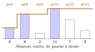
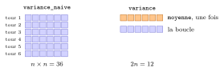

# Cours

<p class="sous-titre">Algorithmique : le parcours séquentiel</p>

<span id="chap-04" class="ancre"></span>

|  |  |
|:---|:---|
| **Programme (BO)** | *« Algorithmes sur les tableaux »* : *parcours séquentiel* d’un tableau ; *recherche* d’un élément ; calcul de la *moyenne*, du *minimum*, du *maximum* ; *notion de coût* d’un algorithme (coût *linéaire*). |
| **Prérequis** | les boucles `for`/`while`, les fonctions, et les **tableaux** (chapitre *Les types construits* : indices, `len`, parcours). |
| **Objectifs** | reconnaître et écrire le **patron** du parcours séquentiel ; le décliner (somme, moyenne, comptage, recherche, min/max) ; **évaluer et comparer** le coût d’un algorithme. |

!!! remarque "Remarque — Le fil conducteur : un patron, et sa facture"

    Presque tous les algorithmes de ce chapitre suivent **le même schéma** : parcourir un tableau du début à la fin en tenant à jour une information. On apprend d’abord ce **patron unique**, puis on se pose *la* question de l’algorithmicien : **combien ça coûte ?** On verra qu’un même calcul, selon l’endroit où on le place, peut être rapide (*linéaire*) ou lent (*quadratique*). Les points qui dépassent le programme sont signalés par le badge <span class="horsprog">au-delà du programme</span>.

## Le parcours séquentiel : un patron unique

!!! definition "Définition 1 — Parcours séquentiel"

    **Parcourir** un tableau, c’est examiner ses éléments **un par un**, du premier au dernier. On dit aussi *parcours linéaire*.

La plupart des traitements suivent le même **squelette**, dit motif de l’**accumulateur** : on prépare un résultat, on le met à jour à chaque élément, on le renvoie.

!!! regle "Règle 1 — Le patron du parcours"

    ```python
    def traitement(t):
        resultat = ...            # 1. initialisation
        for element in t:         # 2. on visite chaque element
            resultat = ...        #    ... et on met a jour le resultat
        return resultat           # 3. on renvoie
    ```

    Écrire un algorithme de parcours, c’est simplement **choisir** l’initialisation et la mise à jour.

!!! remarque "Remarque — Par élément ou par indice ?"

    On parcourt **par élément** (`for x in t`) quand seules les valeurs comptent ; **par indice** (`for i in range(len(t))`) quand on a besoin de la position (ou pour *modifier* le tableau). Les deux réalisent le même parcours.

<span id="cours-04-1" class="ancre"></span>

<span class="afaire">▶ Exercices d'application :</span> exercices **[1](exercices.md#ex-04-1) et [2](exercices.md#ex-04-2)** (le patron du parcours)

## Décliner le patron : somme, moyenne, comptages

!!! exemple "Exemple — La somme, puis la moyenne"

    Même squelette : on accumule dans `s`, initialisé à `0`.

    ```python
    def somme(t):
        s = 0                     # element neutre de l'addition
        for x in t:
            s = s + x
        return s

    def moyenne(t):               # t suppose NON vide
        return somme(t) / len(t)
    ```

!!! exemple "Exemple — Compter : on accumule un compteur"

    ```python
    def nb_positifs(t):
        c = 0
        for x in t:
            if x > 0:             # la mise a jour est conditionnelle
                c = c + 1
        return c
    ```

!!! remarque "Remarque — Le bon élément neutre"

    On initialise l’accumulateur avec l’**élément neutre** de l’opération : `0` pour une somme ou un compteur, `1` pour un produit, `""` pour concaténer du texte, `[]` pour construire un tableau.

<span id="cours-04-3" class="ancre"></span>

<span class="afaire">▶ Exercices d'application :</span> exercices **[3](exercices.md#ex-04-3) et [4](exercices.md#ex-04-4)** (comptage, somme, moyenne)

## Chercher un élément : la recherche séquentielle

Chercher, c’est parcourir jusqu’à trouver. Deux questions distinctes : **l’élément est-il présent ?** et **où est-il ?**

!!! regle "Règle 2 — Recherche séquentielle"

    On parcourt le tableau ; dès qu’on trouve, on peut **s’arrêter** (`return`). Si le parcours se termine sans succès, l’élément est absent.

```python
def est_present(t, x):
    for element in t:
        if element == x:
            return True       # trouve : inutile de continuer
    return False              # parcours fini sans succes : absent

def indice(t, x):
    """Indice de la premiere occurrence de x, ou -1 si absent."""
    for i in range(len(t)):
        if t[i] == x:
            return i
    return -1
```

!!! remarque "Remarque — « Sortir tôt » : un réflexe utile"

    Renvoyer dès qu’on a trouvé évite de parcourir inutilement la fin du tableau. C’est correct *et* souvent plus rapide — on y revient au §V (meilleur/pire cas).

<span id="cours-04-8" class="ancre"></span>

<span class="afaire">▶ Exercices d'application :</span> exercices **[8](exercices.md#ex-04-8) à [10](exercices.md#ex-04-10)** (recherche séquentielle)

## Le plus grand, le plus petit : l’invariant du champion

Pas de raccourci ici : pour connaître le maximum, il faut avoir **tout** regardé. On garde un « champion provisoire », mis à jour dès qu’on rencontre mieux.

```python
def maximum(t):               # t suppose NON vide
    m = t[0]                  # champion initial : le premier element
    for x in t:
        if x > m:
            m = x             # nouveau champion
    return m
```

Déroulons `maximum([4, 9, 2, 11, 7, 3])`. Les barres sont les éléments, dans l’ordre de visite ; le trait **orange** est la valeur de `m` *après* chaque tour. Il ne fait que **monter**, et seulement quand un nouveau champion (barre colorée) apparaît.

{ .tikz loading=lazy }

!!! regle "Règle 3 — Un invariant de boucle"

    À **chaque** tour, la variable `m` contient le maximum des éléments **déjà vus**. Cette propriété, vraie au départ et préservée à chaque tour, s’appelle un **invariant de boucle** : elle *garantit* qu’à la fin, `m` est bien le maximum de *tout* le tableau. C’est ainsi qu’on **prouve** qu’un algorithme est correct.

!!! remarque "Remarque — Pourquoi initialiser avec t[0] et non 0 ?"

    Initialiser à `0` donnerait un résultat faux sur un tableau de nombres tous négatifs (le maximum de `[-3, -7]` est `-3`, pas `0`). On part donc d’un **vrai** élément du tableau. Pour le minimum, on remplace `>` par `<`.

!!! exemple "Exemple — Renvoyer aussi la position"

    Souvent on veut l’*indice* du maximum, pas seulement sa valeur :

    ```python
    def indice_du_max(t):
        i_max = 0
        for i in range(len(t)):
            if t[i] > t[i_max]:
                i_max = i
        return i_max
    ```

### Prouver qu’une propriété est un invariant

Dire qu’une propriété est un invariant, cela ne se devine pas : cela se **démontre**, toujours de la même façon, en **deux étapes**.

!!! regle "Règle 4 — Les deux étapes d’une preuve d’invariant"

    Pour prouver qu’une propriété $P$ est un **invariant** d’une boucle :

    1.  **Initialisation** : $P$ est vraie *avant* le premier tour (juste après les initialisations).

    2.  **Hérédité** (ou *conservation*) : *si* $P$ est vraie avant un tour quelconque, *alors* elle est encore vraie après ce tour.

    Si ces deux points tiennent, $P$ est vraie à **chaque** tour. En ajoutant qu’à la fin la boucle a parcouru *tout* le tableau, on obtient la **correction** de l’algorithme.

!!! exemple "Exemple — Preuve pour le champion du maximum"

    Propriété $P$ : « `m` contient le maximum des éléments **déjà visités** ».

    - **Initialisation** : après `m = t[0]`, le seul élément visité est `t[0]`, et `m` en est bien le maximum. $P$ est vraie.

    - **Hérédité** : supposons $P$ vraie. À la visite de `x`, soit `x <= m` et `m` ne change pas, soit `x > m` et `m` devient `x`. Dans les deux cas, `m` est le maximum des éléments visités *avec* `x` : $P$ reste vraie.

    À la fin, tous les éléments ont été visités : `m` est le maximum de *tout* le tableau. $\square$

!!! exemple "Exemple — Un second invariant : la somme"

    Pour `somme` (§II), propriété $P$ : « `s` contient la somme des éléments déjà visités ».

    - **Initialisation** : avant le premier tour, aucun élément n’est visité et `s = 0` : la somme de rien vaut `0`. $P$ est vraie.

    - **Hérédité** : si `s` est la somme des éléments déjà vus, alors après `s = s + x` elle devient cette somme *plus* `x`, c’est-à-dire la somme des éléments vus *avec* `x`. $P$ reste vraie.

    À la fin, `s` est la somme du tableau entier. $\square$

!!! remarque "Remarque — Bien choisir l’invariant : « déjà visités »"

    La clé est presque toujours la même formulation : « la variable contient le résultat **pour les éléments déjà visités** ». C’est cette petite phrase qui rend l’hérédité facile à écrire.

<span id="cours-04-5" class="ancre"></span>

<span class="afaire">▶ Exercices d'application :</span> exercices **[5](exercices.md#ex-04-5) à [7](exercices.md#ex-04-7)** (maximum, amplitude, moyenne sans la pire note), **[12](exercices.md#ex-04-12)**, **[13](exercices.md#ex-04-13)** et **[15](exercices.md#ex-04-15) à [18](exercices.md#ex-04-18)** (minimum, maximum, champion ; invariants)

## Combien ça coûte ?

Deux algorithmes peuvent tous deux être *corrects*, mais l’un être bien plus **rapide** que l’autre. Pour comparer sans dépendre de la machine, on **compte les opérations** en fonction de la taille `n` du tableau.

!!! definition "Définition 2 — Coût, coût linéaire"

    Le **coût** d’un algorithme est le nombre d’opérations élémentaires qu’il effectue, exprimé en fonction de la taille `n` des données. Un parcours simple fait un nombre d’opérations **proportionnel à `n`** : on dit que son coût est **linéaire**.

Toutes les fonctions vues jusqu’ici (`somme`, `moyenne`, `maximum`, `est_present`…) font **un** parcours : leur coût est **linéaire**. Si l’on double `n`, le temps double.

!!! remarque "Remarque — Meilleur cas, pire cas — l’exemple de la recherche"

    La recherche séquentielle ne coûte pas toujours pareil :

    - **meilleur cas** : l’élément est en tête $\rightarrow$ `1` comparaison ;

    - **pire cas** : l’élément est absent (ou en dernier) $\rightarrow$ `n` comparaisons.

    Le pire cas reste **linéaire** : c’est lui qu’on retient pour caractériser un algorithme.

### Le piège quadratique : moyenne *vs* variance

Voici le cœur du chapitre. On note $x_0, x_1, \ldots, x_{n-1}$ les $n$ valeurs du tableau. Leur **moyenne** est $$m = \frac{1}{n}\sum_{i} x_i = \frac{x_0 + x_1 + \cdots + x_{n-1}}{n}.$$ La **variance** mesure ensuite leur dispersion autour de cette moyenne : $$V = \frac{1}{n}\sum_{i} (x_i - m)^2.$$

**Version naïve** — on traduit la formule mot à mot :

```python
def variance_naive(t):
    n = len(t)
    s = 0
    for x in t:
        s = s + (x - moyenne(t)) ** 2   # DANGER : moyenne(t) recalculee A CHAQUE tour
    return s / n
```

Cette version est **correcte**… mais lente. À chacun des `n` tours de boucle, elle rappelle `moyenne(t)`, qui fait elle-même un parcours de `n` éléments. Total : `n` $\times$ `n` $= n^2$ opérations. On dit que son coût est **quadratique**.

**Version efficace** — on calcule la moyenne **une seule fois**, *avant* la boucle :

```python
def variance(t):
    n = len(t)
    m = moyenne(t)                # calculee UNE fois : n operations
    s = 0
    for x in t:
        s = s + (x - m) ** 2      # ici, chaque tour est immediat
    return s / n
```

Ici, un parcours pour la moyenne, un parcours pour la somme : environ `2n` opérations, donc un coût **linéaire**. Le résultat est **identique**, mais regardons la facture :

| **taille `n`** | `moyenne` ($\approx n$) | `variance_naive` ($\approx n^2$) | `variance` ($\approx 2n$) |
|---:|:--:|:--:|:--:|
| $10$ | $10$ | $100$ | $20$ |
| $100$ | $100$ | $10\,000$ | $200$ |
| $1\,000$ | $1\,000$ | $1\,000\,000$ | $2\,000$ |

Chaque case représente une opération, pour un tableau de $n = 6$ éléments. Dans `variance_naive`, *chaque* tour de boucle (une ligne) refait tout le parcours de `moyenne` : on remplit un **carré** de $6 \times 6 = 36$ cases. Dans `variance`, deux parcours *l’un après l’autre* : $2 \times 6 = 12$ cases seulement.

{ .tikz loading=lazy }

Ces ordres de grandeur se vérifient au chronomètre (TP proposé en fin de chapitre) : quand $n$ double, le temps de `variance_naive` est multiplié par 4, celui de `variance` par 2.

!!! regle "Règle 5 — La leçon"

    *Où* l’on place un calcul change tout. Un calcul qui ne dépend pas de la boucle doit être **sorti** de la boucle. Placer un parcours *à l’intérieur* d’un autre parcours fait passer le coût de **linéaire** ($n$) à **quadratique** ($n^2$) — pour $n = 1000$, on passe de quelques milliers à un **million** d’opérations.

!!! remarque "Remarque — Reconnaître le quadratique au-delà du programme"

    Deux boucles **imbriquées** sur le même tableau (ou un appel de parcours *dans* une boucle) sont le signe d’un coût quadratique. En notation savante, on écrit un coût linéaire $O(n)$ et un coût quadratique $O(n^2)$ (notation « grand O », que vous formaliserez en terminale).

!!! remarque "Remarque — En Terminale"

    Le même patron de parcours s’applique à d’autres structures : les listes chaînées (*Structures linéaires : piles, files, listes chaînées*), puis des structures qui ne sont plus « en ligne » (*Les arbres*, *Les graphes*). La recherche séquentielle se prolonge dans *La recherche textuelle*.

<span id="cours-04-11" class="ancre"></span>

<span class="afaire">▶ Exercices d'application :</span> exercices **[11](exercices.md#ex-04-11)** et **[14](exercices.md#ex-04-14)** (deux tableaux ; min et max en une passe), puis **[19](exercices.md#ex-04-19) à [21](exercices.md#ex-04-21)** (le coût : linéaire ou quadratique)

## Un peu d’histoire

!!! remarque "Remarque — Du mot « algorithme » à l’analyse de leur coût"

    Le mot **algorithme** vient du savant persan **al-Khwârizmî** (IX<sup>e</sup> siècle), dont le nom latinisé donna *algorismus*. Mais *mesurer* le coût d’un algorithme est bien plus récent : la notation « grand O » est due aux mathématiciens **Paul Bachmann** (1894) et **Edmund Landau**, et c’est **Donald Knuth** qui, à partir des années 1960, en fait l’outil central de l’*analyse des algorithmes* dans son œuvre monumentale *The Art of Computer Programming*. Choisir le bon algorithme, et pas seulement un algorithme correct, est depuis au cœur de l’informatique : sur des milliards de données, la différence entre linéaire et quadratique, c’est la différence entre une seconde et… des années.

!!! remarque "Remarque — Liens avec d’autres chapitres"

    Le patron du parcours généralise l’**accumulateur** du chapitre *Les bases de la programmation Python* et resservira partout : boucle interne du **tri par sélection**, étalon de la **dichotomie**, filtres sur les **données en tables**, distances des **$k$ plus proches voisins**. En Terminale, la **programmation dynamique** pousse à l’extrême la leçon de la variance : ne jamais recalculer.

## Bilan — la carte mémoire

| **Notion** | **À retenir** |
|:---|:---|
| Le patron | init $\to$ mise à jour à chaque élément $\to$ renvoi |
| Élément neutre | `0` (somme, compteur), `1` (produit), `""`, `[]` |
| Parcourir | par élément (`for x in t`) ou par indice (`for i in range`…) |
| Recherche séquentielle | s’arrête dès qu’on trouve ; `-1` ou `None` si absent |
| Minimum / maximum | garder un **champion** ; initialiser avec `t[0]`, jamais `0` |
| Invariant de boucle | propriété vraie à chaque tour : *prouve* que le résultat est correct |
| Coût linéaire | un parcours : $\approx n$ opérations (recherche : pire cas = absent) |
| Coût quadratique | un parcours *dans* un parcours : $\approx n^2$ (piège de la variance !) |
| Le réflexe | **sortir de la boucle** ce qui n’en dépend pas |

## Erreurs fréquentes

- **Mal initialiser le maximum.** Partir de `0` échoue si toutes les valeurs sont négatives. *Le réflexe :* initialiser au **premier élément** du tableau.

- **Confondre indice et valeur.** `t[i]` est la *valeur*, `i` est la *position*.

- **Se tromper de bornes.** `range(n)` va de `0` à `n-1` ; le dernier indice est `len(t)-1`.

- **Recalculer dans la boucle ce qui est constant.** Appeler `moyenne(t)` *à l’intérieur* d’un parcours rend le coût **quadratique** (piège de la variance). *Le réflexe :* sortir de la boucle ce qui n’en dépend pas.

- **Ne pas s’arrêter dès qu’on a trouvé.** Dans une recherche, `return` dès la première occurrence.

- **Oublier le cas du tableau vide** (ou d’une valeur absente).

## Savoir-faire à maîtriser

*À la fin du chapitre, je sais…*

- écrire un **parcours séquentiel** (somme, moyenne, comptage) ;

- écrire une **recherche séquentielle** (présence, indice) et m’arrêter dès qu’on trouve ;

- écrire un **min / max** avec l’**invariant du champion** et la bonne initialisation ;

- énoncer et **prouver un invariant** de boucle (initialisation + hérédité) ;

- estimer le **coût** (linéaire / quadratique) et éviter les recalculs inutiles.
