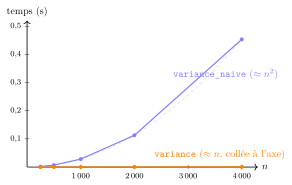

# TP et projets

<p class="sous-titre">Algorithmique : le parcours séquentiel</p>

## <span class="etiquette">TP</span> Un an de météo à la loupe

*parcours, invariant… et le coût mesuré au chronomètre*

!!! fichiers "Fichiers à télécharger"

    [:material-folder-open: dossier en ligne](https://github.com/MathThibaud/nsi-fichiers-eleves/tree/main/premiere/04-tp-meteo-annee){ .md-button } [:material-zip-box: archive .zip](https://github.com/MathThibaud/nsi-fichiers-eleves/raw/main/zips/premiere-04-tp-meteo-annee.zip){ .md-button }

|  |  |
|:---|:---|
| **Durée** | 2 h à 2 h 30 (une à deux séances), en binôme, sur machine. |
| **Prérequis** | tout le chapitre *Algorithmique : le parcours séquentiel* (patron, recherche séquentielle, champion, invariant, coût). |
| **Fichiers** | `tp_parcours_meteo.csv` (365 jours de relevés, à télécharger) et `tp_parcours_depart.py` (à compléter : tout votre code s’y écrit). Les deux fichiers doivent être dans le **même dossier**. |

!!! encadre "But du TP"

    Le fichier `tp_parcours_meteo.csv` contient un an de relevés quotidiens d’une station météo du bord de mer (données **simulées** à partir de moyennes climatiques réalistes) : date, température minimale, température maximale, hauteur de pluie. Vous allez :

    1.  écrire, **uniquement avec des parcours**, le programme qui imprime le **bulletin climatique** de l’année ;

    2.  vérifier **au chronomètre** ce que le cours affirme : une variance « naïve » est **quadratique**, la bonne est **linéaire** — et tracer les deux courbes ;

    3.  (défi) lisser la courbe des températures par une **moyenne glissante**, sans tomber dans le même piège.

    **Produit final** : un programme qui affiche le bulletin, un graphique « linéaire contre quadratique » et un court bilan rédigé.

!!! consignes "Consignes"

    - Niveau : ★ échauffement, ★★ classique (niveau bac), ★★★ défi ; les *coups de pouce* et les *corrigés* se déplient sous chaque exercice. <span class="run" title="À programmer et tester sur machine">▶</span> *À programmer* dans `tp_parcours_depart.py`.

    - **Règle du TP** : pas de `sum`, `max` ni `min` ; chaque résultat s’obtient par un **parcours** écrit par vous.

    - En bas du fichier, le programme principal contient des lignes en commentaire (`#`) : on les **décommente au fur et à mesure**. Des tests `assert` sont fournis ; s’ils passent, un message s’affiche.

    - Le compte rendu (réponses, tableaux complétés, bilan) se fait sur le cahier (ou dans un fichier texte).

    - Usage de l’IA, indiqué sur chaque exercice : <span class="ia ia-rouge" title="Sans IA : le but est l'automatisme lui-même"></span> aucune ; <span class="ia ia-orange" title="IA en appui : déboguer, reformuler, vérifier ; la réponse finale est la vôtre"></span> en appui (déboguer, reformuler, vérifier ; la réponse finale est écrite et comprise par vous) ; <span class="ia ia-vert" title="IA intégrée : l'exercice s'appuie sur une réponse d'IA"></span> l’exercice s’appuie sur une réponse d’IA. Voir la [charte d’usage de l’IA](../charte.md).

## Prise en main

### <span class="stars" title="Niveau 1 sur 3">★</span> <span class="exo-num">Exercice 1</span> — Ouvrir les données <span class="ia ia-orange" title="IA en appui : déboguer, reformuler, vérifier ; la réponse finale est la vôtre"></span> { #ex-04-algorithmique-le-parcours-sequentiel-tp-1-1 }

Ouvrir `tp_parcours_meteo.csv` avec un éditeur de texte (pas un tableur). Ses premières lignes sont :

```text
date,tmin,tmax,pluie
2025-01-01,7.4,10.6,40.1
2025-01-02,8.2,12.8,0.0
```

La fonction `charger_releves`, fournie, lit ce fichier et renvoie **quatre tableaux de même longueur** : `dates`, `tmin`, `tmax`, `pluie`. Le jour numéro `i` est décrit par `dates[i]`, `tmin[i]`, `tmax[i]` et `pluie[i]`.

1.  <span class="run" title="À programmer et tester sur machine">▶</span> Exécuter le fichier de départ. Combien de jours sont chargés ?

2.  Dans la console, afficher `dates[31]`, `tmax[31]` et `pluie[31]`. Quel jour est-ce ?

3.  Quel est l’indice du 31 décembre ? Que renvoie `mois_de("2025-07-14")` ?

4.  Pourquoi doit-on parcourir **par indice** (et non par élément) pour relier une température à sa date ?

??? corrige "Corrigé"

    *Toutes les fonctions du bulletin suivent le même patron : initialiser, mettre à jour à chaque jour, renvoyer. Pour les records, on garde l’indice d’un champion, et l’invariant « le champion est le meilleur des jours déjà vus » garantit le résultat. Un parcours coûte de l’ordre de $n$ opérations : quand on double les données, le temps double (nos mesures : $\times 2$). Si l’on refait un parcours à chaque tour (`moyenne(t)` dans la boucle), le coût devient $n^2$ : le temps est multiplié par 4 à chaque doublement, et un million de valeurs demanderait des heures au lieu de 0,15 s. Règle : sortir de la boucle tout calcul qui n’en dépend pas, et réutiliser ce qu’on a déjà calculé.*

    1.  365 jours.

    2.  `dates[31]` vaut `"2025-02-01"` (le 1<sup>er</sup> février : l’indice 0 est le 1<sup>er</sup> janvier, et janvier compte 31 jours) ; `tmax[31]` vaut `14.8` et `pluie[31]` vaut `0.0`.

    3.  Le 31 décembre est à l’indice `364` (`len(dates) - 1`) ; `mois_de("2025-07-14")` renvoie `7`.

    4.  Les quatre tableaux sont « parallèles » : c’est le **même indice** `i` qui relie une température à sa date. Un parcours par élément (`for x in tmax`) perd cette position.

## Le bulletin climatique

Chaque fonction de cette partie est **un seul parcours**. Avant d’écrire, se demander : *quelle initialisation ? quelle mise à jour ? que renvoie-t-on ?*

### <span class="stars" title="Niveau 1 sur 3">★</span> <span class="exo-num">Exercice 2</span> — Accumuler et compter <span class="ia ia-orange" title="IA en appui : déboguer, reformuler, vérifier ; la réponse finale est la vôtre"></span> { #ex-04-algorithmique-le-parcours-sequentiel-tp-1-2 }

1.  <span class="run" title="À programmer et tester sur machine">▶</span> Écrire `somme(t)` puis `moyenne(t)` (cette dernière en une ligne, en appelant `somme`).

2.  <span class="run" title="À programmer et tester sur machine">▶</span> Écrire `nb_au_moins(t, seuil)` qui compte les éléments de `t` **supérieurs ou égaux** à `seuil`.

    ```text
    >>> nb_au_moins([3, 8, 5, 8], 5)
    3
    ```

3.  Avec ces fonctions, calculer : la moyenne des maximales, le cumul de pluie de l’année, le nombre de **jours de pluie** (au moins 1 mm, convention des météorologues), de **jours de chaleur** (maximale $\geq 30$ °C) et de **nuits tropicales** (minimale $\geq 20$ °C).

??? corrige "Corrigé"

    ```python
    def somme(t):
        s = 0
        for x in t:
            s = s + x
        return s

    def moyenne(t):
        return somme(t) / len(t)

    def nb_au_moins(t, seuil):
        c = 0
        for x in t:
            if x >= seuil:
                c = c + 1
        return c
    ```

    Résultats : moyenne des maximales **20,3 °C** ; cumul de pluie **599 mm** ; **56** jours de pluie (`nb_au_moins(pluie, 1)`) ; **8** jours de chaleur (`nb_au_moins(tmax, 30)`) ; **97** nuits tropicales (`nb_au_moins(tmin, 20)`).

### <span class="stars" title="Niveau 2 sur 3">★★</span> <span class="exo-num">Exercice 3</span> — Des champions datés <span class="ia ia-orange" title="IA en appui : déboguer, reformuler, vérifier ; la réponse finale est la vôtre"></span> { #ex-04-algorithmique-le-parcours-sequentiel-tp-1-3 }

On ne veut plus seulement une valeur record, mais **la date** du record : il faut donc garder l’**indice** du champion.

1.  <span class="run" title="À programmer et tester sur machine">▶</span> Écrire `indice_min(t)`, l’indice du plus petit élément (en cas d’égalité, le premier). En déduire la date et la température de la **nuit la plus froide**.

2.  <span class="run" title="À programmer et tester sur machine">▶</span> L’**amplitude** d’un jour est `tmax[i] - tmin[i]`. Écrire `indice_ecart_max(tmin, tmax)` qui renvoie l’indice du jour de plus grande amplitude. *Le champion n’est plus une case d’un tableau, mais une quantité calculée à partir de deux tableaux.*

    ```text
    >>> indice_ecart_max([10, 12, 9], [15, 20, 13])
    1
    ```

3.  **Sans machine.** Énoncer l’**invariant de boucle** de `indice_ecart_max` (« à chaque tour, `i_best` est… »), puis le **prouver** en deux étapes (initialisation, hérédité).

    ??? pouce "Coup de pouce"

        Reprendre la preuve du champion du maximum dans le cours : remplacer « valeur » par « amplitude du jour » et « `m` » par « le jour `i_best` ».

??? corrige "Corrigé"

    ```python
    def indice_min(t):
        i_min = 0
        for i in range(len(t)):
            if t[i] < t[i_min]:          # < strict : en cas d'egalite on garde le premier
                i_min = i
        return i_min

    def indice_ecart_max(tmin, tmax):
        i_best = 0
        for i in range(len(tmin)):
            if tmax[i] - tmin[i] > tmax[i_best] - tmin[i_best]:
                i_best = i
        return i_best
    ```

    Nuit la plus froide : **2025-01-12**, 4,5 °C. Plus grande amplitude : **2025-05-14**, 8,0 °C (le bord de mer amortit les écarts, d’où des amplitudes modestes).

    **Invariant** (question 3) : « à chaque tour, `i_best` est l’indice d’un jour d’amplitude maximale parmi les jours **déjà visités** ».

    - *Initialisation* : avant le premier tour (ou après le tour `i = 0`), seul le jour 0 est visité et `i_best = 0` : vrai.

    - *Hérédité* : si c’est vrai avant le tour `i`, soit l’amplitude du jour `i` dépasse strictement celle du jour `i_best` et `i_best` devient `i`, soit elle ne la dépasse pas et `i_best` reste un jour d’amplitude maximale. Dans les deux cas, la propriété est vraie pour les jours `0` à `i`.

    En fin de boucle tous les jours sont visités : `i_best` est un jour d’amplitude maximale de l’année. $\square$

### <span class="stars" title="Niveau 2 sur 3">★★</span> <span class="exo-num">Exercice 4</span> — Chercher la première fois <span class="ia ia-orange" title="IA en appui : déboguer, reformuler, vérifier ; la réponse finale est la vôtre"></span> { #ex-04-algorithmique-le-parcours-sequentiel-tp-1-4 }

1.  <span class="run" title="À programmer et tester sur machine">▶</span> Écrire `premier_jour_au_moins(t, seuil)` qui renvoie l’indice du **premier** jour où `t[i] >= seuil`, ou `-1` s’il n’y en a pas. La fonction doit **s’arrêter dès qu’elle a trouvé**.

2.  Quelle est la date du premier jour à 30 °C ? Y a-t-il eu un jour à 35 °C ?

3.  Combien de comparaisons fait votre fonction pour le seuil 30 ? pour le seuil 35 ? Lequel de ces deux appels réalise le **pire cas** ?

??? corrige "Corrigé"

    ```python
    def premier_jour_au_moins(t, seuil):
        for i in range(len(t)):
            if t[i] >= seuil:
                return i                 # on s'arrete des qu'on a trouve
        return -1
    ```

    Premier jour à 30 °C : indice 181, soit le **2025-07-01** ; aucun jour à 35 °C (la fonction renvoie `-1`). Pour le seuil 30 : **182** comparaisons ; pour le seuil 35 : **365** comparaisons, c’est le **pire cas** (valeur absente, tout le tableau est parcouru).

### <span class="stars" title="Niveau 2 sur 3">★★</span> <span class="exo-num">Exercice 5</span> — Mois par mois <span class="ia ia-orange" title="IA en appui : déboguer, reformuler, vérifier ; la réponse finale est la vôtre"></span> { #ex-04-algorithmique-le-parcours-sequentiel-tp-1-5 }

1.  <span class="run" title="À programmer et tester sur machine">▶</span> Écrire `moyenne_mois(dates, t, mois)` qui calcule la moyenne des `t[i]` pour les seuls jours du mois demandé (de 1 à 12). *Deux accumulateurs : une somme et un compteur ; la mise à jour est conditionnelle.*

    ```text
    >>> moyenne_mois(["2025-01-31", "2025-02-01", "2025-02-02"], [5, 8, 10], 2)
    9.0
    ```

2.  <span class="run" title="À programmer et tester sur machine">▶</span> Construire le tableau `moyennes` des 12 moyennes mensuelles des maximales, puis trouver, par un champion, le **mois le plus chaud**.

3.  Pour obtenir les 12 moyennes, combien de fois au total parcourt-on le tableau des 365 jours ? Proposer (sans forcément la coder) une méthode en **un seul** parcours. <span class="horsprog">au-delà du programme</span>

    ??? pouce "Coup de pouce"

        Douze sommes et douze compteurs, rangés dans deux tableaux indexés par le numéro du mois.

??? corrige "Corrigé"

    ```python
    def moyenne_mois(dates, t, mois):
        s = 0
        n = 0
        for i in range(len(t)):
            if mois_de(dates[i]) == mois:
                s = s + t[i]
                n = n + 1
        return s / n

    moyennes = [moyenne_mois(dates, tmax, m) for m in range(1, 13)]
    m_chaud = 0                          # indice du champion (0 = janvier)
    for k in range(12):
        if moyennes[k] > moyennes[m_chaud]:
            m_chaud = k
    ```

    *Autre méthode* pour le tableau des moyennes : `moyennes = []`, puis une boucle `for m in range(1, 13)` qui fait `moyennes.append(moyenne_mois(dates, tmax, m))`. Moyennes mensuelles des maximales (°C), de janvier à décembre : `13.0, 12.6, 14.0, 18.5, 22.5, 25.8, 27.7, 27.2, 24.8, 22.9, 18.7, 15.6`. Mois le plus chaud : **juillet** (`m_chaud + 1 = 7`).

    Question 3 : 12 parcours de 365 jours, soit $4\,380$ tours. En un seul parcours : deux tableaux `sommes = [0]*12` et `effectifs = [0]*12`, et pour chaque jour `k = mois_de(dates[i]) - 1` ; `sommes[k] += t[i]` ; `effectifs[k] += 1`. Coût : 365 tours.

### <span class="stars" title="Niveau 1 sur 3">★</span> <span class="exo-num">Exercice 6</span> — Imprimer le bulletin <span class="ia ia-orange" title="IA en appui : déboguer, reformuler, vérifier ; la réponse finale est la vôtre"></span> { #ex-04-algorithmique-le-parcours-sequentiel-tp-1-6 }

<span class="run" title="À programmer et tester sur machine">▶</span> Compléter la fonction `bulletin`, puis décommenter `tester_partie_B()` et `bulletin(...)`. Recopier sur le cahier le tableau ci-dessous et le compléter avec vos résultats :

| **Indicateur**                      | **Valeur (avec la date si besoin)** |
|:------------------------------------|:------------------------------------|
| Moyenne des maximales               |                                     |
| Cumul de pluie / jours de pluie     |                                     |
| Jours de chaleur / nuits tropicales |                                     |
| Nuit la plus froide                 |                                     |
| Plus grande amplitude               |                                     |
| Premier jour à 30 °C                |                                     |
| Mois le plus chaud                  |                                     |

??? corrige "Corrigé"

     Sortie du programme corrigé (extrait ; le symbole degré est omis) :

    ```text
    === Bulletin climatique 2025 ===
    Moyenne des maximales : 20.3 C
    Cumul de pluie        : 599 mm
    Jours de pluie (>= 1 mm) : 56
    Jours de chaleur (>= 30 C) : 8
    Nuits tropicales (min >= 20 C) : 97
    Nuit la plus froide : 2025-01-12 4.5 C
    Plus grand écart : 2025-05-14 8.0 C
    Premier jour à 30 C : 2025-07-01
    Mois le plus chaud : 7
    ```

## Le piège quadratique, chronomètre en main

Le cours (§ V) affirme que `variance_naive`, qui rappelle `moyenne(t)` *dans* sa boucle, coûte de l’ordre de $n^2$ opérations, et que `variance`, qui calcule la moyenne une seule fois, en coûte de l’ordre de $2n$. Les deux fonctions sont **fournies** dans le fichier : on va **mesurer**.

### <span class="stars" title="Niveau 1 sur 3">★</span> <span class="exo-num">Exercice 7</span> — Même résultat ? <span class="ia ia-orange" title="IA en appui : déboguer, reformuler, vérifier ; la réponse finale est la vôtre"></span> { #ex-04-algorithmique-le-parcours-sequentiel-tp-1-7 }

<span class="run" title="À programmer et tester sur machine">▶</span> Calculer `variance_naive(tmax)` et `variance(tmax)`. Les résultats sont-ils égaux ?

L’**écart-type** est la racine carrée de la variance (`v ** 0.5`) : il donne l’écart « typique » à la moyenne, en degrés. Quelle valeur obtient-on pour `tmax` ?

??? corrige "Corrigé"

     Les deux renvoient `32.785…` (égalité exacte ici ; sur d’autres données, les arrondis des calculs à virgule peuvent différer au-delà de la 12<sup>e</sup> décimale). Écart-type : $\sqrt{32{,}79} \approx$ **5,7 °C**.

### <span class="stars" title="Niveau 2 sur 3">★★</span> <span class="exo-num">Exercice 8</span> — Construire un chronomètre <span class="ia ia-orange" title="IA en appui : déboguer, reformuler, vérifier ; la réponse finale est la vôtre"></span> { #ex-04-algorithmique-le-parcours-sequentiel-tp-1-8 }

Le module `time` fournit `time.perf_counter()`, qui renvoie l’heure d’une horloge très précise, en secondes. La **différence** entre deux lectures donne une durée.

1.  <span class="run" title="À programmer et tester sur machine">▶</span> Écrire `chronometre(f, t)` qui renvoie la durée, en secondes, de l’appel `f(t)`. *En Python, une fonction peut être passée en paramètre : `chronometre(variance, tmax)` chronomètre `variance(tmax)`.*

    ??? pouce "Coup de pouce"

        Lire l’horloge dans une variable `debut`, appeler `f(t)`, relire l’horloge, renvoyer la différence.

2.  <span class="run" title="À programmer et tester sur machine">▶</span> Compléter `mesures(tailles)` : pour chaque taille `n`, elle fabrique un tableau aléatoire de `n` valeurs (fonction `tableau_aleatoire`, fournie), chronomètre les deux variances sur **ce même tableau** et range les durées dans `temps_naif` et `temps_lin`.

3.  <span class="run" title="À programmer et tester sur machine">▶</span> Lancer les mesures pour `tailles = [250, 500, 1000, 2000, 4000]` puis recopier sur le cahier et compléter le tableau suivant (arrondir à 3 chiffres significatifs) :

| **`n`** | `variance_naive` (s) | rapport au `n` précédent | `variance` (s) | rapport au `n` précédent |
|---:|:---|:---|:---|:---|
| $250$ |  | — |  | — |
| $500$ |  |  |  |  |
| $1\,000$ |  |  |  |  |
| $2\,000$ |  |  |  |  |
| $4\,000$ |  |  |  |  |

??? corrige "Corrigé"

    ```python
    def chronometre(f, t):
        debut = time.perf_counter()
        f(t)
        fin = time.perf_counter()
        return fin - debut

    def mesures(tailles):
        temps_naif = []
        temps_lin = []
        for n in tailles:
            t = tableau_aleatoire(n)
            temps_naif.append(chronometre(variance_naive, t))
            temps_lin.append(chronometre(variance, t))
        return temps_naif, temps_lin
    ```

    Mesures obtenues sur un ordinateur portable (vos valeurs seront différentes, mais *les rapports* doivent être proches) :

    |  **`n`** | `variance_naive` (s) |    rapport     | `variance` (s) |    rapport     |
    |---------:|:--------------------:|:--------------:|:--------------:|:--------------:|
    |    $250$ |     $0{,}00180$      |       —        | $0{,}0000360$  |       —        |
    |    $500$ |     $0{,}00720$      | $\times 4{,}0$ | $0{,}0000750$  | $\times 2{,}1$ |
    | $1\,000$ |      $0{,}0283$      | $\times 3{,}9$ |  $0{,}000156$  | $\times 2{,}1$ |
    | $2\,000$ |      $0{,}113$       | $\times 4{,}0$ |  $0{,}000288$  | $\times 1{,}8$ |
    | $4\,000$ |      $0{,}453$       | $\times 4{,}0$ |  $0{,}000598$  | $\times 2{,}1$ |

### <span class="stars" title="Niveau 2 sur 3">★★</span> <span class="exo-num">Exercice 9</span> — Lire les mesures <span class="ia ia-orange" title="IA en appui : déboguer, reformuler, vérifier ; la réponse finale est la vôtre"></span> { #ex-04-algorithmique-le-parcours-sequentiel-tp-1-9 }

1.  Quand `n` **double**, par combien environ est multiplié le temps de `variance_naive` ? celui de `variance` ? Relier chaque rapport au coût annoncé par le cours.

2.  <span class="run" title="À programmer et tester sur machine">▶</span> Décommenter `tracer(...)`. Décrire l’allure des deux courbes. Pourquoi celle de `variance` paraît-elle « collée » à l’axe ?

3.  **Prédire sans exécuter.** En partant de la mesure pour $n = 4\,000$, estimer la durée de `variance_naive` pour $n = 64\,000$ (quatre doublements), puis pour $n = 1\,000\,000$ (ordre de grandeur). Faire de même pour `variance`. *Ne pas lancer `variance_naive` sur un million de valeurs…*

4.  <span class="run" title="À programmer et tester sur machine">▶</span> Vérifier la prédiction pour `variance` sur $1\,000\,000$ valeurs. Quel est l’écart avec l’estimation ?

!!! remarque "Remarque — Pourquoi des temps qui « tremblent » ?"

    Deux mesures identiques ne donnent jamais exactement la même durée : l’ordinateur fait autre chose en même temps. C’est l’**ordre de grandeur** et le **rapport** quand `n` double qui comptent, pas la milliseconde. On peut lisser en répétant chaque mesure plusieurs fois.

??? corrige "Corrigé"

    1.  Quand `n` double, le temps de `variance_naive` est multiplié par **4** ($= 2^2$) : coût **quadratique**. Celui de `variance` est multiplié par **2** : coût **linéaire**.

    2.  La courbe naïve est une **parabole** qui « décolle » ; celle de `variance` est une droite, mais si basse (moins d’une milliseconde contre près d’une demi-seconde) qu’elle se confond avec l’axe à cette échelle.

    3.  $64\,000 = 4\,000 \times 2^4$ : $0{,}45 \times 4^4 \approx 116$ s, environ **2 minutes**. Pour $10^6 = 4\,000 \times 250$ : $0{,}45 \times 250^2 \approx 28\,000$ s, soit **près de 8 heures**. Pour `variance` : $0{,}0006 \times 16 \approx 0{,}01$ s puis $0{,}0006 \times 250 \approx$ **0,15 s**.

    4.  Mesure réelle de `variance` sur $10^6$ valeurs : **0,15 s** — la prédiction linéaire tombe juste.

    { .tikz loading=lazy }

    *Mesures du tableau ; en pointillés, la parabole $c\,n^2$ passant par le dernier point.*

## Défi : la moyenne glissante

La courbe des maximales est « en dents de scie ». Pour voir la tendance, les météorologues utilisent la **moyenne glissante sur $k$ jours** : pour chaque jour `i` (à partir du $k$-ième), la moyenne des $k$ jours qui se terminent au jour `i`, c’est-à-dire de `t[i-k+1]`, …, `t[i]`.

```text
>>> glissante([1, 2, 3, 4, 5], 3)     # (1+2+3)/3, (2+3+4)/3, (3+4+5)/3
[2.0, 3.0, 4.0]
```

### <span class="stars" title="Niveau 2 sur 3">★★</span> <span class="exo-num">Exercice 10</span> — Version directe <span class="ia ia-orange" title="IA en appui : déboguer, reformuler, vérifier ; la réponse finale est la vôtre"></span> { #ex-04-algorithmique-le-parcours-sequentiel-tp-1-10 }

<span class="run" title="À programmer et tester sur machine">▶</span> Écrire `glissante_naive(t, k)` qui, pour chaque jour `i` de `k-1` à `len(t)-1`, recalcule la somme des $k$ valeurs de la fenêtre avec une boucle. Combien d’additions fait-elle pour un tableau de $n$ valeurs ? Que devient ce coût si l’on choisit $k = n/2$ ?

??? corrige "Corrigé"

    ```python
    def glissante_naive(t, k):
        res = []
        for i in range(k - 1, len(t)):
            s = 0
            for j in range(i - k + 1, i + 1):
                s = s + t[j]
            res.append(s / k)
        return res
    ```

    Elle fait $(n - k + 1) \times k$ additions, de l’ordre de $k \times n$. Pour $k = 7$, c’est linéaire (7 fois plus que nécessaire) ; mais pour $k = n/2$, cela fait environ $n^2/4$ : **quadratique**. Mesuré sur $n = 20\,000$, $k = 10\,000$ : **5,3 s** contre **0,002 s** pour la version glissante.

### <span class="stars" title="Niveau 3 sur 3">★★★</span> <span class="exo-num">Exercice 11</span> — Faire glisser la fenêtre <span class="ia ia-orange" title="IA en appui : déboguer, reformuler, vérifier ; la réponse finale est la vôtre"></span> { #ex-04-algorithmique-le-parcours-sequentiel-tp-1-11 }

Passer de la fenêtre du jour `i-1` à celle du jour `i`, c’est **ajouter** `t[i]` et **retirer** `t[i-k]` : inutile de tout recompter.

1.  <span class="run" title="À programmer et tester sur machine">▶</span> Écrire `glissante(t, k)` qui calcule la première somme une fois, puis la met à jour en une opération par jour.

    ??? pouce "Coup de pouce"

        `s = s + t[i] - t[i - k]`, pour `i` allant de `k` à `len(t) - 1` ; la première moyenne est celle de `t[0]` à `t[k-1]`.

    Vérifier qu’elle renvoie le même tableau que `glissante_naive` sur `tmax` avec $k = 7$ (comparer les valeurs à $10^{-9}$ près : les calculs à virgule ne tombent pas toujours juste).

2.  Quel est son coût ? En quoi est-ce **la même leçon** que pour la variance ?

3.  <span class="run" title="À programmer et tester sur machine">▶</span> Tracer sur un même graphique `tmax` et sa moyenne glissante sur 7 jours, puis sur 30 jours (on peut décaler l’axe des abscisses en traçant `range(k-1, 365)` contre la moyenne glissante). Que montre la courbe lissée sur 30 jours ?

??? corrige "Corrigé"

    ```python
    def glissante(t, k):
        s = 0
        for j in range(k):               # premiere fenetre : t[0] a t[k-1]
            s = s + t[j]
        res = [s / k]
        for i in range(k, len(t)):
            s = s + t[i] - t[i - k]      # on ajoute le nouveau jour, on retire le plus ancien
            res.append(s / k)
        return res
    ```

    Vérification : sur `tmax` avec $k = 7$, les deux fonctions renvoient 359 valeurs égales à $10^{-9}$ près. Coût : $k + (n - k) = n$ opérations, **linéaire** quel que soit $k$. C’est la leçon de la variance : **ne pas recalculer** ce que l’on connaît déjà (ici, la somme de la fenêtre précédente). Sur 30 jours, la courbe lissée monte régulièrement de 13 °C (fin janvier) à un maximum de 28,3 °C (fenêtre finissant le 24 juillet) puis redescend : on lit le **cycle des saisons**, débarrassé des variations d’un jour à l’autre.

## Bilan à rédiger

Sur le cahier, en cinq à huit lignes, et en vous appuyant sur **vos** mesures :

- quel patron unique se cache derrière toutes les fonctions du bulletin, et quel invariant garantit les résultats « champions » ;

- ce que signifient concrètement « coût linéaire » et « coût quadratique » quand on double la taille des données ;

- la règle à retenir pour écrire un parcours efficace.
