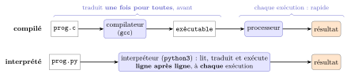

# Cours

<p class="sous-titre">Spécifier et mettre au point ses programmes</p>

<span id="chap-05" class="ancre"></span>

|  |  |
|:---|:---|
| **Programme (BO)** | *Langages et programmation.* **Spécification** : prototyper une fonction, décrire les **préconditions** sur les arguments et les **postconditions** sur les résultats (des assertions peuvent les garantir). **Mise au point** : utiliser des **jeux de tests** (le succès d’un jeu de tests ne garantit pas la correction). **Diversité des langages** : repérer traits communs et particuliers d’un langage. **Bibliothèques** : utiliser une documentation. |
| **Prérequis** | écrire des **fonctions** ; **boucles** `for`/`while` et **conditions** ; **tableaux** (listes) ; la notion d’**invariant de boucle** (vue au chapitre *Algorithmique : le parcours séquentiel*). |
| **Objectifs** | **spécifier** une fonction (rôle, pré/postconditions, docstring) ; la **documenter** sans excès ; adopter une **programmation défensive** (`assert`, valeur sentinelle) ; écrire un **bon jeu de tests** et comprendre ses limites ; **déboguer** par la trace et l’affichage ; formaliser un **invariant de boucle** ; situer Python parmi la **diversité des langages** (compilé ou interprété, typage statique ou dynamique). |

!!! remarque "Remarque — Le fil conducteur : peut-on faire confiance à un programme ?"

    Un programme dit *comment* calculer un résultat — il ne dit pas *ce qu’il* calcule, ni ne *garantit* que le résultat est correct. Or on confie à des programmes le pilotage d’un avion, le dossier médical d’un patient, le calcul d’une paie. Écrire du code qui « a l’air de marcher » ne suffit donc pas : il faut **dire précisément ce que fait chaque fonction** (la spécifier), **se protéger** des mauvais usages, et **tester** pour attraper les erreurs. Ce chapitre rassemble les **bonnes habitudes du programmeur** — à prendre dès maintenant et à rejouer dans tous les chapitres suivants.

## Que fait ce programme ?

Considérons cette fonction.

```python
def maximum(t):
    m = 0
    for i in range(len(t)):
        if t[i] > t[m]:
            m = i
    return m
```

On comprend chaque instruction, mais que *calcule*-t-elle ? Le nom suggère « le maximum ». En l’essayant, on découvre qu’elle renvoie en réalité l’**indice** du maximum. On aurait gagné du temps avec un nom explicite — `indice_maximum` — et une variable `ind_max` plutôt que `m`. Et surtout : que se passe-t-il sur un tableau **vide** ? La fonction renvoie `0`, un indice qui n’existe pas.

```python
>>> t = []
>>> i = maximum(t)
>>> t[i]
IndexError: list index out of range
```

L’erreur ne se déclenche pas dans la fonction, mais **plus loin**, quand on utilise son résultat — c’est le pire des cas, car le coupable est difficile à retrouver.

!!! definition "Définition 1 — Spécifier une fonction"

    **Spécifier** une fonction, c’est décrire son **contrat**, sans dire comment elle s’y prend :

    - son **prototype** : son nom, ses paramètres, ce qu’elle renvoie ;

    - ses **préconditions** : ce qui doit être vrai *sur les arguments* pour qu’on ait le droit de l’appeler ;

    - ses **postconditions** : ce qui est garanti *sur le résultat* si les préconditions sont respectées.

!!! exemple "Exemple — Une spécification de indice_maximum"

    *Prototype :* `indice_maximum(t)` renvoie un entier ou `None`. *Précondition :* `t` est une liste de nombres. *Postcondition :* renvoie l’indice du plus grand élément (le premier en cas d’égalité), ou `None` si `t` est vide.

## Documenter ses programmes

Une précondition écrite en commentaire n’est visible que par qui lit le code. Python permet d’attacher à une fonction une **chaîne de documentation** (*docstring*) : une chaîne entre triples guillemets, placée juste après le `def`.

```python
def indice_maximum(t):
    """Renvoie l'indice du maximum du tableau t,
    ou None si t est vide."""
    ...
```

On la consulte avec `help` sans voir le code :

```python
>>> help(indice_maximum)
indice_maximum(t)
    Renvoie l'indice du maximum du tableau t,
    ou None si t est vide.
```

!!! regle "Règle 1 — Une docstring pour chaque fonction"

    Toute fonction que vous écrivez doit avoir une docstring qui donne au moins son **rôle**, et s’il y a lieu sa **précondition** et sa **postcondition**. C’est la première pièce de la spécification, et elle voyage avec la fonction.

### Du bon usage des commentaires

Il ne faut pas commenter à outrance. Ce commentaire est inutile :

```python
x = x + 1  # incrémenter x
```

Le plus souvent, de **bons noms** de variables remplacent avantageusement un commentaire : deux coordonnées nommées `x` et `y` n’ont pas besoin d’être expliquées. « Un bon code se suffit à lui-même. » On garde un commentaire uniquement pour ce qui ne se déduit *pas* de la lecture :

```python
n = 25  # nombre de nombres premiers plus petits que 100
```

<span id="cours-05-1" class="ancre"></span>

<span class="afaire">▶ Exercices d'application :</span> exercices **[1](exercices.md#ex-05-1)** et **[3](exercices.md#ex-05-3)** (spécifier et documenter)

## Programmation défensive

Pour éviter qu’un mauvais argument produise un résultat incohérent, on peut **tester la précondition à l’entrée** de la fonction. L’outil de choix est l’instruction `assert` : elle vérifie une condition et **interrompt** le programme avec un message si elle est fausse.

```python
def indice_maximum(t):
    """Renvoie l'indice du maximum de t. t est supposé non vide."""
    assert len(t) > 0, "le tableau est vide"
    ...
```

```python
>>> indice_maximum([])
AssertionError: le tableau est vide
```

C’est de la **programmation défensive** : on échoue *tôt*, *clairement*, à l’endroit du vrai problème.

!!! regle "Règle 2 — Deux stratégies défensives"

    Face à un argument interdit, deux attitudes, aussi bonnes l’une que l’autre selon le contexte :

    - **échouer** avec `assert` : celui qui appelle doit garantir la précondition ;

    - **renvoyer une valeur sentinelle** qui ne peut pas être confondue avec un résultat valide — en Python, `None`. Celui qui appelle teste alors le résultat avant de l’utiliser.

```python
r = indice_maximum(t)
if r is not None:
    print("le maximum est", t[r])
```

!!! remarque "Remarque — Deux conventions pour « absent » : None ou -1"

    On rencontre les deux, y compris au bac : `None` (ici) ou `-1` ; **suivez la convention de l’énoncé**. Avec `-1`, attention : `t[-1]` est un indice *valide* (le dernier élément), donc testez `r != -1` avant d’utiliser `t[r]`.

<span id="cours-05-5" class="ancre"></span>

<span class="afaire">▶ Exercices d'application :</span> exercices **[5](exercices.md#ex-05-5) à [7](exercices.md#ex-05-7)** (programmation défensive)

## Tester ses programmes

Même bien spécifiée, une fonction peut contenir une erreur de programmation. Pour les débusquer, on la **teste** : on l’applique à des cas concrets et on vérifie qu’elle produit le résultat attendu. Plutôt que de vérifier à l’œil dans la console, on confie la vérification à Python avec des `assert` placés **dans le fichier**, à la suite de la fonction. On teste ici la version de `indice_maximum` qui respecte la spécification du § I (elle renvoie `None` sur un tableau vide), et non la version défensive du § III, qui échouerait sur `[]` avec son `assert`.

```python
assert indice_maximum([2, 3, 1]) == 1
assert indice_maximum([]) is None
assert indice_maximum([3, 1, 3, 7]) == 3
assert indice_maximum([8, 3, 3, 7]) == 0     # max au début
assert indice_maximum([-3, -1, -3, -7]) == 1 # tous négatifs
```

Si l’un échoue, on corrige, puis on **relance tout** : corriger une erreur en introduit parfois une autre. Écrits une fois, ces tests protègent la fonction pour toutes ses versions futures.

!!! regle "Règle 3 — Le succès des tests ne prouve pas la correction"

    Passer tous ses tests **ne garantit pas** qu’un programme est correct : il peut échouer sur un cas non testé. On ne peut pas tout tester (les entiers, les tableaux sont en nombre infini). L’objectif est un **bon** jeu de tests, qui couvre tous les *comportements* du programme.

!!! propriete "Propriété 1 — Ingrédients d’un bon jeu de tests"

    - chaque **cas** de la spécification a son test (le tableau vide en particulier) ;

    - une fonction **booléenne** : un test qui renvoie `True`, un qui renvoie `False` ;

    - les **valeurs limites** : $0$, un nombre négatif, le premier et le dernier indice ;

    - les **cas particuliers** : maximum au début ou à la fin, égalités, doublons.

!!! remarque "Remarque — Réponses multiples"

    Quand plusieurs résultats sont corrects, on ne peut pas comparer à *une* valeur. Si la spécification ne tranche pas (elle ne dit pas « le premier en cas d’égalité »), l’indice du maximum de `[3, 1, 3]` peut être $0$ ou $2$ : on teste alors l’appartenance à l’ensemble des bonnes réponses.

    ```python
    m = indice_maximum([3, 1, 3])
    assert m == 0 or m == 2
    ```

### Tests aléatoires et oracle <span class="horsprog">au-delà du programme</span>

Pour aller plus loin, on peut **générer des tests au hasard**. Encore faut-il savoir juger le résultat sans connaître la réponse : on confie ce verdict à une fonction **oracle**, en général plus simple à écrire que le programme testé. Exemple : `doublon(t)` renvoie un élément présent au moins deux fois ; l’oracle `verifie_doublon(r, t)` recompte les occurrences de `r`.

```python
for n in range(2, 30):
    for _ in range(20):
        t = tableau_avec_doublon(n)
        assert verifie_doublon(doublon(t), t)
```

<span id="cours-05-8" class="ancre"></span>

<span class="afaire">▶ Exercices d'application :</span> exercices **[8](exercices.md#ex-05-8) à [12](exercices.md#ex-05-12)** (tester ses programmes)

## Corriger les erreurs (déboguer)

Un test qui échoue prouve qu’il *y a* une erreur, mais ne dit pas **où**. Commence une enquête. Prenons une fonction censée tester si un tableau est croissant.

```python
def est_croissant(t):
    i = len(t) - 1
    while i >= 0:
        if t[i] <= t[i + 1]:   # bug 1 : i+1 hors du tableau
            return True        # bug 2 : conclut trop tôt
        else:
            return False
        i -= 1
```

Sur `[1, 2, 3, 4]`, on obtient `IndexError: list index out of range`. **Idée n<sup>o</sup> 1 : dérouler l’exécution.** On voit que `i` vaut $3$ et qu’on compare `t[3]` et `t[4]` : l’indice $4$ n’existe pas. On corrige en comparant `t[i-1]` et `t[i]`.

**Idée n<sup>o</sup> 2 : ajouter des affichages.** La fonction répond alors `True` sur `[1, 3, 2, 4]` (faux !). Un `print` au début de la boucle montre qu’**un seul tour** a lieu : le `return True` conclut dès la première paire en ordre. Il faut ne renvoyer `True` qu’*après* avoir tout parcouru. Après correction et retrait des affichages :

```python
def est_croissant(t):
    """Renvoie True si les elements de t sont ranges par ordre croissant."""
    i = len(t) - 1
    while i > 0:
        if t[i - 1] > t[i]:
            return False
        i -= 1
    return True

assert est_croissant([1, 2, 3, 4]) == True
assert est_croissant([1, 3, 2, 4]) == False
assert est_croissant([]) == True
```

!!! regle "Règle 4 — La boîte à outils du débogage"

    - **dérouler** l’exécution (mentalement, sur papier, ou avec le pas-à-pas de l’éditeur) au voisinage du problème ;

    - ajouter des **affichages** temporaires : quels blocs s’exécutent, combien de fois, quelles valeurs prennent les variables ;

    - une fois corrigé, **retirer les affichages** mais **garder les tests**.

<span id="cours-05-13" class="ancre"></span>

<span class="afaire">▶ Exercices d'application :</span> exercices **[13](exercices.md#ex-05-13) et [14](exercices.md#ex-05-14)** (corriger, déboguer)

## Invariant de boucle

Pour se convaincre qu’une boucle est correcte, on cherche une propriété **vraie avant la boucle et préservée à chaque tour** : un **invariant de boucle**. Vraie au départ et maintenue, elle est donc encore vraie *à la sortie* — c’est ce qui prouve le résultat. Prenons la division euclidienne par soustractions successives.

```python
def division_euclidienne(a, b):   # a >= 0, b > 0
    q = 0
    r = a
    while r >= b:
        # invariant : 0 <= r  et  a == q * b + r
        q += 1
        r -= b
    return q, r
```

On veut $\texttt{a} = q\times\texttt{b} + \texttt{r}$ avec $0 \leqslant \texttt{r} < \texttt{b}$. La condition de boucle donne $\texttt{r} < \texttt{b}$ à la sortie. Restent les deux invariants :

- $0 \leqslant \texttt{r}$ : on part de $\texttt{r}=\texttt{a}\geqslant 0$ et on ne retranche `b` que si $\texttt{r}\geqslant\texttt{b}$ ;

- $\texttt{a} = q\times\texttt{b}+\texttt{r}$ : vrai au départ ($q=0,\ \texttt{r}=\texttt{a}$), et préservé car $(q{+}1)\times\texttt{b} + (\texttt{r}{-}\texttt{b}) = q\times\texttt{b}+\texttt{r}$.

Le grand intérêt pratique : en cas de doute, on transforme l’invariant en `assert` et Python le **vérifie à chaque tour** pendant la mise au point.

```python
while r >= b:
    assert 0 <= r
    assert a == q * b + r
    q += 1
    r -= b
```

<span id="cours-05-15" class="ancre"></span>

<span class="afaire">▶ Exercices d'application :</span> exercices **[15](exercices.md#ex-05-15) à [17](exercices.md#ex-05-17)** (invariant de boucle), puis **[2](exercices.md#ex-05-2)** (docstring de `division_euclidienne`) et **[4](exercices.md#ex-05-4)** (un meilleur nom : docstring, invariant et tests)

## Diversité et unité des langages

Python n’est qu’un langage parmi des centaines réellement utilisés. Pourquoi tant de langages ? Parce qu’un langage est un **outil** : chacun fait des **choix** (vitesse, sûreté, simplicité, proximité avec la machine) qui le rendent bon pour certaines tâches, moins pour d’autres. Retenons d’abord la distinction de fond : un **algorithme** est une méthode, indépendante de toute machine ; un **programme** en est la *traduction* dans un langage précis — comme une même idée se dit en français ou en anglais.

Tous les langages partagent un même **corpus de constructions élémentaires** : séquences d’instructions, affectation, conditionnelles, boucles (bornées et non bornées), appels de fonction. C’est l’**unité** des langages : qui sait programmer dans l’un retrouve vite ses repères dans un autre.

!!! exemple "Exemple — Le même calcul dans trois langages"

    Somme des dix premiers entiers, en Python, puis en C, puis en JavaScript — repérez le *commun* (une boucle, une accumulation) et le *particulier* (types déclarés, accolades, points-virgules).

```python
s = 0
for i in range(1, 11):
    s = s + i
```

```text
// C                              // JavaScript
int s = 0;                        let s = 0;
for (int i = 1; i <= 10; i++)     for (let i = 1; i <= 10; i++)
    s = s + i;                        s = s + i;
```

Les langages diffèrent aussi par leur **style** (leur *paradigme*) : **impératif** (une suite d’ordres qui modifient des variables — c’est ainsi qu’on programme en Python cette année), mais aussi **fonctionnel** (des fonctions qui transforment des valeurs, sans modifier l’existant), **objet** (des objets qui regroupent données et fonctions), **logique** (on énonce des faits et des règles, la machine *déduit* les réponses), **événementiel** (on réagit à un clic, une touche, comme en JavaScript). Un même langage peut en mélanger plusieurs : Python est à la fois impératif, fonctionnel et objet.

### Compiler ou interpréter

Un processeur ne comprend que le **langage machine** (des 0 et des 1 ; le chapitre *Architecture des ordinateurs et systèmes d’exploitation* y reviendra). Il faut donc **traduire** notre programme.

!!! definition "Définition 2 — Compilation et interprétation"

    - Un langage **compilé** est entièrement traduit *une fois pour toutes*, avant l’exécution, par un **compilateur**. On obtient un fichier **exécutable**, que l’on lance ensuite directement.

    - Un langage **interprété** est traduit *au fur et à mesure*, pendant l’exécution, par un **interpréteur**. Il faut l’interpréteur à chaque exécution.

{ .tikz loading=lazy }

!!! exemple "Exemple"

    **C** est compilé : la commande `gcc prog.c` produit un exécutable que l’on lance. **Python** est interprété : `python3 prog.py` lit et exécute le fichier à la volée.

!!! regle "Règle 5 — Ce que chaque choix apporte"

    - **Compilé** : exécution **rapide** (la traduction est déjà faite) et erreurs de langage repérées *avant* de lancer le programme ; mais il faut recompiler à chaque modification, et l’exécutable ne fonctionne que sur le type de machine visé.

    - **Interprété** : **souple** et rapide à mettre au point (on teste immédiatement dans la console), le *même* fichier tourne sur toute machine qui a l’interpréteur ; mais l’exécution est **plus lente**, et certaines erreurs n’apparaissent qu’*au moment* où la ligne fautive est atteinte.

!!! remarque "Remarque — La réalité est plus nuancée"

    <span class="horsprog">au-delà du programme</span> Beaucoup de langages, dont Python et Java, sont d’abord traduits en un langage intermédiaire (le *bytecode*), lui-même exécuté par une **machine virtuelle** : un compromis entre les deux mondes. On dira simplement, en Première, que Python est interprété et C compilé.

### Typage statique ou dynamique

Une valeur a une **nature** : entier, texte, booléen… C’est son **type**. Les langages diffèrent par le *moment* où le type est vérifié.

!!! definition "Définition 3 — Typage statique et dynamique"

    - **Typage statique** : le type de chaque variable est fixé et vérifié *avant* l’exécution. Additionner un nombre et un texte est refusé **sans même lancer** le programme.

    - **Typage dynamique** : le type est connu *pendant* l’exécution, quand la ligne est atteinte ; la même erreur ne se manifeste qu’à ce moment-là.

!!! exemple "Exemple"

    En C (statique), on **écrit** le type : `int n = 5;` déclare un entier. En OCaml (statique), on ne l’écrit presque jamais, mais le langage le **devine** : dans `let n = 5`, OCaml sait que `n` est un entier (c’est l’*inférence de types*). En Python (dynamique), `n = 5` crée simplement un nom qui désigne la valeur `5` ; plus loin, `n` peut désigner une chaîne.

C’est pourquoi, en Python, une erreur de type peut dormir longtemps dans un programme :

```python
def etiquette(age):
    if age >= 18:
        return "majeur"
    return "mineur, " + age + " ans"   # erreur de type !

print(etiquette(20))   # affiche majeur : la ligne 4 n'est jamais atteinte
print(etiquette(15))   # TypeError : on ne concatene pas un texte et un entier
```

Seul un test passant par la ligne 4 révèle l’erreur (correction : `str(age)`) — raison de plus pour écrire un **bon jeu de tests** qui couvre *tous* les cas.

!!! regle "Règle 6 — Le compromis sûreté / souplesse"

    Le typage statique **attrape tôt** beaucoup d’erreurs, au prix d’un peu plus de rigueur à l’écriture. Le typage dynamique est **plus léger**, mais reporte la découverte de ces erreurs à l’exécution. Ni l’un ni l’autre n’est « meilleur » : ce sont des priorités différentes.

### Quel langage pour quoi ?

Chaque grand domaine a ses langages de prédilection, pour des raisons historiques autant que techniques.

| **Domaine**                           | **Langages fréquents**           |
|:--------------------------------------|:---------------------------------|
| Systèmes, embarqué, jeux vidéo        | C, C++, Rust                     |
| Web (côté navigateur)                 | JavaScript                       |
| Science des données, IA, enseignement | Python                           |
| Applications mobiles                  | Kotlin (Android), Swift (iPhone) |
| Interroger des bases de données       | SQL                              |
| Recherche, preuve de programmes       | OCaml, Haskell                   |

Aucun langage n’est « le meilleur » : chacun est un **compromis** adapté à certaines tâches.

!!! remarque "Remarque — Langages qui ne programment pas"

    Attention : **HTML** (qui servira à décrire une page au chapitre *Le Web : réseaux et interactions homme-machine*) est un langage *formalisé*, mais **pas** un langage de programmation : on n’y écrit pas d’algorithme. **SQL** (interroger une base de données, en Terminale) est un langage de **requêtes**, pas un langage de programmation *généraliste* : on y décrit le résultat voulu plutôt qu’un algorithme pour l’obtenir.

### Modularité et bibliothèques

On ne réécrit pas tout à chaque fois. En regroupant des fonctions utiles dans des **modules** réutilisables, on constitue des **bibliothèques** (`math`, `random`, `turtle`…). Pour s’en servir, pas besoin de connaître leur code : il suffit de lire leur **documentation**, qui joue le rôle de la spécification vue plus haut. La boucle est bouclée : *bien spécifier ses propres fonctions, c’est déjà écrire la documentation d’une future bibliothèque.*

!!! remarque "Remarque — En Terminale"

    Deux chapitres prolongent directement celui-ci : *La récursivité* (une fonction qui s’appelle elle-même, avec sa condition d’arrêt — ses tests et ses préconditions se pensent exactement comme ici) et *Programmation objet et paradigmes* (définir ses propres types avec des classes, et comparer vraiment les styles impératif, fonctionnel et objet).

<span id="cours-05-18" class="ancre"></span>

<span class="afaire">▶ Exercices d'application :</span> exercices **[18](exercices.md#ex-05-18) à [24](exercices.md#ex-05-24)** (diversité des langages)

## Un peu d’histoire

!!! remarque "Remarque — Des bugs qui ont fait l’histoire"

    Le **9 septembre 1947**, à Harvard, l’équipe du calculateur électromécanique **Mark II**, dont fait partie **Grace Hopper**, cherche pourquoi la machine se trompe. Coupable : un **papillon de nuit** coincé dans un relais. On le colle dans le cahier de bord avec la mention « *First actual case of bug being found* » — « premier cas *réel* de bogue trouvé », preuve que le mot *bug* (« insecte ») désignait déjà un défaut chez les ingénieurs. Celle qui a rendu l’anecdote célèbre, Grace Hopper (1906–1992), mathématicienne et officière de la marine américaine, est surtout une pionnière des langages : elle écrit en 1952 l’un des premiers **compilateurs** et défend l’idée, jugée farfelue à l’époque, de programmer avec des **mots** plutôt qu’avec des nombres — idée qui mènera au langage <span class="smallcaps">Cobol</span> (1959), et dont Python est l’héritier lointain.

    \*(image manquante : 05_hist_first_bug_1947)\*  
    Le cahier de bord du Mark II (9 septembre 1947), avec le papillon collé

    \*(image manquante : 05_hist_grace_hopper)\*  
    Grace Hopper en 1984

    Un demi-siècle plus tard, un bug coûte beaucoup plus cher qu’un papillon. Le **4 juin 1996**, la fusée **Ariane 5** explose moins de 40 secondes après son premier décollage, en Guyane. En cause, un programme de navigation **réutilisé d’Ariane 4** : il convertissait une vitesse en un entier trop petit pour contenir les valeurs, bien plus grandes, de la nouvelle fusée. Le programme était correct… pour Ariane 4. Sa **précondition** (« la vitesse reste petite ») n’avait été ni vérifiée par un `assert`, ni **testée** dans les conditions de vol d’Ariane 5. Environ 370 millions de dollars partent en fumée — sans aucune victime heureusement.

    Le chercheur néerlandais **Edsger Dijkstra** (1930–2002) avait prévenu dès 1970 : « *tester un programme peut montrer la présence de bugs, jamais leur absence* ». C’est exactement la règle de ce chapitre : les tests sont indispensables, mais seul un **raisonnement** (spécification, invariant de boucle) peut garantir qu’un programme est correct.

!!! remarque "Remarque — Liens avec d’autres chapitres"

    Ces réflexes serviront aussitôt pour les **tris** et la **dichotomie** ; en Terminale, le chapitre *Calculabilité* prouvera qu’aucun programme ne décide l’arrêt de tous les autres.

## Bilan — la carte mémoire

| **Notion** | **À retenir** |
|:---|:---|
| Spécifier | prototype + **précondition** (arguments) + **postcondition** (résultat) |
| Documenter | une **docstring** par fonction ; des noms parlants ; commenter l’inattendu |
| Se défendre | `assert` sur la précondition *ou* valeur sentinelle `None` |
| Tester | un **jeu de tests** en `assert` (vide, limites, booléens, doublons) |
| Se méfier | tests verts $\neq$ programme correct (Dijkstra) |
| Déboguer | dérouler + `print` pour localiser ; garder les tests, retirer les affichages |
| Invariant de boucle | vrai au départ et préservé à chaque tour $\Rightarrow$ vrai à la sortie |
| Unité des langages | mêmes briques : séquence, affectation, condition, boucle, fonction |
| Compilé / interprété | traduit une fois, rapide (C) / traduit à la volée, souple (Python) |
| Typage | **statique** : vérifié avant l’exécution (C) ; **dynamique** : pendant (Python) |
| Bibliothèques | on les utilise en lisant leur **documentation** |

## Erreurs fréquentes

- **Oublier de tester « absent ».** Avec `-1`, `t[-1]` est valide ! *Le réflexe :* suivre la convention de l’énoncé.

- **Confondre précondition et postcondition.** Précondition : avant l’appel, sur les arguments ; postcondition : après, sur le résultat.

- **Oublier le tableau vide** (ou $0$, ou un nombre négatif) dans le jeu de tests.

- **Conclure `return True` dès le premier élément conforme**, sans finir le parcours.

- **Croire un programme correct parce que les tests passent.** Un cas non testé peut échouer (Ariane 5).

- **Laisser des `print` de débogage** dans la version finale — mais *garder* les tests.

- **Dire que C est interprété** ou que Python est compilé ; appeler HTML un « langage de programmation », ou SQL un langage de programmation *généraliste*.
