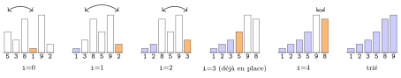
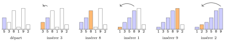

# Cours

<p class="sous-titre">Les algorithmes de tri</p>

<span id="chap-06" class="ancre"></span>

|  |  |
|:---|:---|
| **Programme (BO)** | *« Algorithmes sur les tableaux »* : *tri par insertion*, *tri par sélection* ; *coût* d’un tri (coût *quadratique*). |
| **Prérequis** | les boucles `for`/`while`, les tableaux (indices, `len`), et surtout le chapitre **« Algorithmique : le parcours séquentiel »** : patron du parcours, invariant de boucle, coûts linéaire et quadratique. |
| **Objectifs** | comprendre *pourquoi* on trie ; connaître et savoir écrire **deux** algorithmes de tri (sélection, insertion) ; **tracer** leur exécution ; **évaluer leur coût** et les comparer. |

!!! remarque "Remarque — Une histoire de rangement — et de vitesse"

    Un annuaire de dix millions de noms qui ne serait pas trié serait *inutilisable* : on ne retrouverait jamais personne. Trier, c’est **préparer les données** pour qu’on puisse ensuite y chercher, compter, comparer… à toute vitesse. C’est l’une des opérations les plus exécutées au monde : chaque tri de colonne dans un tableur, chaque classement de résultats d’un moteur de recherche, chaque « trier par date » de vos messages en déclenche un. Dans ce chapitre, on ouvre le capot. On y retrouvera notre question fétiche : **combien ça coûte ?** Les points qui dépassent le programme sont signalés par le badge <span class="horsprog">au-delà du programme</span>.

## Pourquoi trier ?

Trier un tableau, c’est ranger ses éléments **dans l’ordre** (croissant, le plus souvent). Cela paraît anodin, mais un tableau trié devient une donnée bien plus **puissante** :

- **chercher devient fulgurant** : dans une liste triée on pourra faire une *recherche dichotomique* (chapitre suivant, *La recherche dichotomique*), incomparablement plus rapide qu’un parcours ;

- **le plus petit / le plus grand** sont aux deux bouts ; la **médiane** est au milieu ;

- les **doublons** se retrouvent *côte à côte*, donc faciles à détecter ;

- **fusionner** deux listes déjà triées, ou **afficher** un classement, devient immédiat.

!!! regle "Règle 1 — L’idée-force"

    On ne trie pas pour le plaisir de ranger : on trie **une fois** pour ensuite chercher, comparer et calculer **beaucoup plus vite**. Le tri est un *investissement*.

!!! definition "Définition 1 — Le problème du tri"

    **Trier** un tableau `t`, c’est réorganiser ses éléments de sorte que $$\texttt{t[0]} \leq \texttt{t[1]} \leq \texttt{t[2]} \leq \cdots \leq \texttt{t[n-1]}.$$ On travaillera **en place** : on réarrange le tableau donné, sans en créer un nouveau. Les seules opérations autorisées sont **comparer** deux éléments et les **échanger** (ou les déplacer).

!!! remarque "Remarque — Deux opérations à compter"

    Pour mesurer le coût d’un tri, on compte deux choses : le nombre de **comparaisons** (`t[j] < t[i]` ?) et le nombre d’**échanges**. C’est là que se joue la rapidité de l’algorithme.

!!! regle "Règle 2 — Échanger : le piège de la variable perdue"

    Pour échanger le contenu de deux cases `t[i]` et `t[j]`, on **ne peut pas** écrire naïvement :

    ```text
    t[i] = t[j]     # PERDU : l'ancienne valeur de t[i] est ecrasee...
    t[j] = t[i]     # ... donc ici, t[j] recopie la NOUVELLE valeur : rate !
    ```

    Il faut d’abord **mettre de côté** l’une des deux valeurs dans une **variable temporaire** :

    ```text
    temp = t[i]     # on sauvegarde t[i]
    t[i] = t[j]     # t[i] recoit t[j]
    t[j] = temp     # t[j] recoit l'ancienne valeur de t[i]
    ```

    C’est l’image des deux verres, l’un d’eau, l’autre de jus : pour intervertir leurs contenus, il faut un **troisième verre vide**. Cette variable temporaire est indispensable dans *tous* les langages.

## Le tri par sélection

**L’idée** est celle d’un joueur qui range sa main en la posant sur la table : *je cherche la plus petite carte de tout le paquet, je la mets en première position ; puis la plus petite du reste, en deuxième position ; et ainsi de suite.*

!!! regle "Règle 3 — Principe du tri par sélection"

    Pour chaque position `i` de gauche à droite : on **cherche le minimum** de la partie non encore triée (les cases d’indice `i` à la fin), puis on l’**échange** avec la case `i`. À la fin de l’étape, la case `i` contient sa valeur définitive.

```python
def tri_selection(t):
    """Trie le tableau t en place, dans l'ordre croissant."""
    n = len(t)
    for i in range(n):
        # 1. chercher l'indice du minimum dans la portion t[i:]
        i_min = i
        for j in range(i + 1, n):
            if t[j] < t[i_min]:
                i_min = j
        # 2. placer ce minimum en position i (echange via variable temporaire)
        temp = t[i]
        t[i] = t[i_min]
        t[i_min] = temp
```

!!! remarque "Remarque — On reconnaît deux vieilles connaissances"

    La boucle interne est *exactement* la recherche du **minimum** du chapitre *Algorithmique : le parcours séquentiel* (l’invariant du champion : `i_min` est l’indice du plus petit élément déjà vu). Ce minimum est ensuite « sélectionné » et rangé — d’où le nom.

### Dérouler l’algorithme

Traçons le tri de `[5, 3, 8, 1, 9, 2]`. Le tableau est montré **au début de chaque étape** : la zone `grisée` est **définitivement triée**, et on repère en `orange` le **minimum de la zone restante**, qu’on amène à sa place par un échange.

<table>
<thead>
<tr>
<th style="text-align: right;"><strong>étape</strong></th>
<th colspan="6" style="text-align: left;"><strong>tableau</strong></th>
<th style="text-align: left;"><strong>action</strong></th>
</tr>
</thead>
<tbody>
<tr>
<td style="text-align: right;"><code>i</code>=0</td>
<td style="text-align: center;"><code>5</code></td>
<td style="text-align: center;"><code>3</code></td>
<td style="text-align: center;"><code>8</code></td>
<td style="text-align: center;"><code>1</code></td>
<td style="text-align: center;"><code>9</code></td>
<td style="text-align: center;"><code>2</code></td>
<td style="text-align: left;">min <span class="math inline"> = 1</span> (case 3) <span class="math inline">→</span> échange avec la case 0</td>
</tr>
<tr>
<td style="text-align: right;"><code>i</code>=1</td>
<td style="text-align: center;"><code>1</code></td>
<td style="text-align: center;"><code>3</code></td>
<td style="text-align: center;"><code>8</code></td>
<td style="text-align: center;"><code>5</code></td>
<td style="text-align: center;"><code>9</code></td>
<td style="text-align: center;"><code>2</code></td>
<td style="text-align: left;">min <span class="math inline"> = 2</span> (case 5) <span class="math inline">→</span> échange avec la case 1</td>
</tr>
<tr>
<td style="text-align: right;"><code>i</code>=2</td>
<td style="text-align: center;"><code>1</code></td>
<td style="text-align: center;"><code>2</code></td>
<td style="text-align: center;"><code>8</code></td>
<td style="text-align: center;"><code>5</code></td>
<td style="text-align: center;"><code>9</code></td>
<td style="text-align: center;"><code>3</code></td>
<td style="text-align: left;">min <span class="math inline"> = 3</span> (case 5) <span class="math inline">→</span> échange avec la case 2</td>
</tr>
<tr>
<td style="text-align: right;"><code>i</code>=3</td>
<td style="text-align: center;"><code>1</code></td>
<td style="text-align: center;"><code>2</code></td>
<td style="text-align: center;"><code>3</code></td>
<td style="text-align: center;"><code>5</code></td>
<td style="text-align: center;"><code>9</code></td>
<td style="text-align: center;"><code>8</code></td>
<td style="text-align: left;">min <span class="math inline"> = 5</span> : déjà en place</td>
</tr>
<tr>
<td style="text-align: right;"><code>i</code>=4</td>
<td style="text-align: center;"><code>1</code></td>
<td style="text-align: center;"><code>2</code></td>
<td style="text-align: center;"><code>3</code></td>
<td style="text-align: center;"><code>5</code></td>
<td style="text-align: center;"><code>9</code></td>
<td style="text-align: center;"><code>8</code></td>
<td style="text-align: left;">min <span class="math inline"> = 8</span> (case 5) <span class="math inline">→</span> échange avec la case 4</td>
</tr>
<tr>
<td style="text-align: right;">arrivée</td>
<td style="text-align: center;"><code>1</code></td>
<td style="text-align: center;"><code>2</code></td>
<td style="text-align: center;"><code>3</code></td>
<td style="text-align: center;"><code>5</code></td>
<td style="text-align: center;"><code>8</code></td>
<td style="text-align: center;"><code>9</code></td>
<td style="text-align: left;">tableau trié</td>
</tr>
</tbody>
</table>

La même trace en **histogramme** : chaque barre a la hauteur de sa valeur. On voit la zone triée (colorée) grandir d’une barre à chaque étape, en partant de la gauche, et le minimum (orange) venir prendre sa place par un échange (flèche).

{ .tikz loading=lazy }

!!! regle "Règle 4 — L’invariant du tri par sélection"

    Juste avant de traiter la case `i`, la partie `t[0..i-1]` est **triée** *et* contient les `i` plus petits éléments du tableau, **à leur place définitive**. C’est cet invariant qui garantit qu’à la fin le tableau entier est trié.

<span id="cours-06-1" class="ancre"></span>

<span class="afaire">▶ Exercices d'application :</span> exercices **[1](exercices.md#ex-06-1)** (dérouler la sélection) et **[4](exercices.md#ex-06-4) à [7](exercices.md#ex-06-7)** (le tri par sélection)

## Le tri par insertion

**L’idée** est celle du joueur qui ramasse ses cartes *une par une* et garde sa main toujours triée : *je prends la carte suivante, et je la glisse à la bonne place parmi celles que je tiens déjà.* C’est le tri le plus « naturel » pour un humain.

!!! regle "Règle 5 — Principe du tri par insertion"

    On parcourt le tableau de la gauche vers la droite. À chaque étape, la partie de gauche est *déjà triée* ; on prend l’élément suivant et on l’**insère** à sa place dans cette partie triée, en **décalant** vers la droite tous les éléments plus grands que lui.

```python
def tri_insertion(t):
    """Trie le tableau t en place, dans l'ordre croissant."""
    n = len(t)
    for i in range(1, n):
        x = t[i]              # l'element a inserer dans la partie triee
        j = i - 1
        # decaler vers la droite tant que l'on rencontre plus grand que x
        while j >= 0 and t[j] > x:
            t[j + 1] = t[j]
            j = j - 1
        t[j + 1] = x          # on depose x dans le "trou" cree
```

!!! remarque "Remarque — Le rôle du while"

    La condition d’arrêt `t[j] > x` fait reculer `j` *seulement* tant qu’il y a des éléments plus grands à décaler. Dès qu’on trouve un élément *plus petit ou égal* (ou que `j` devient $-1$ : la condition `j >= 0` est alors fausse), on s’arrête : la place de `x` est trouvée. On range `x` juste après, en `t[j+1]`.

### Dérouler l’algorithme

Traçons le tri de `[5, 3, 8, 1, 9, 2]`. Le tableau est montré **après chaque insertion** : la zone `grisée` est **triée mais provisoire** (elle bougera encore), et l’élément `orange` est celui qu’on **vient d’insérer** à sa place.

<table>
<thead>
<tr>
<th style="text-align: right;"><strong>étape</strong></th>
<th colspan="6" style="text-align: left;"><strong>tableau</strong></th>
<th style="text-align: left;"><strong>action</strong></th>
</tr>
</thead>
<tbody>
<tr>
<td style="text-align: right;">départ</td>
<td style="text-align: center;"><code>5</code></td>
<td style="text-align: center;"><code>3</code></td>
<td style="text-align: center;"><code>8</code></td>
<td style="text-align: center;"><code>1</code></td>
<td style="text-align: center;"><code>9</code></td>
<td style="text-align: center;"><code>2</code></td>
<td style="text-align: left;">la case 0 est triée à elle seule</td>
</tr>
<tr>
<td style="text-align: right;">insérer 3</td>
<td style="text-align: center;"><code>3</code></td>
<td style="text-align: center;"><code>5</code></td>
<td style="text-align: center;"><code>8</code></td>
<td style="text-align: center;"><code>1</code></td>
<td style="text-align: center;"><code>9</code></td>
<td style="text-align: center;"><code>2</code></td>
<td style="text-align: left;">3 s’insère avant 5</td>
</tr>
<tr>
<td style="text-align: right;">insérer 8</td>
<td style="text-align: center;"><code>3</code></td>
<td style="text-align: center;"><code>5</code></td>
<td style="text-align: center;"><code>8</code></td>
<td style="text-align: center;"><code>1</code></td>
<td style="text-align: center;"><code>9</code></td>
<td style="text-align: center;"><code>2</code></td>
<td style="text-align: left;">8 est déjà bien placé</td>
</tr>
<tr>
<td style="text-align: right;">insérer 1</td>
<td style="text-align: center;"><code>1</code></td>
<td style="text-align: center;"><code>3</code></td>
<td style="text-align: center;"><code>5</code></td>
<td style="text-align: center;"><code>8</code></td>
<td style="text-align: center;"><code>9</code></td>
<td style="text-align: center;"><code>2</code></td>
<td style="text-align: left;">1 remonte tout au début</td>
</tr>
<tr>
<td style="text-align: right;">insérer 9</td>
<td style="text-align: center;"><code>1</code></td>
<td style="text-align: center;"><code>3</code></td>
<td style="text-align: center;"><code>5</code></td>
<td style="text-align: center;"><code>8</code></td>
<td style="text-align: center;"><code>9</code></td>
<td style="text-align: center;"><code>2</code></td>
<td style="text-align: left;">9 est déjà bien placé</td>
</tr>
<tr>
<td style="text-align: right;">insérer 2</td>
<td style="text-align: center;"><code>1</code></td>
<td style="text-align: center;"><code>2</code></td>
<td style="text-align: center;"><code>3</code></td>
<td style="text-align: center;"><code>5</code></td>
<td style="text-align: center;"><code>8</code></td>
<td style="text-align: center;"><code>9</code></td>
<td style="text-align: left;">2 se glisse en 2<sup>e</sup> position</td>
</tr>
</tbody>
</table>

En **histogramme**, après chaque insertion : la zone triée (colorée) grandit d’une barre, mais ses barres *changent de place* ; la barre orange vient d’être glissée à sa place (la flèche part de sa case d’origine), et les barres plus grandes qu’elle ont été décalées d’un cran vers la droite.

{ .tikz loading=lazy }

!!! regle "Règle 6 — L’invariant du tri par insertion"

    Au début de l’étape `i`, la partie `t[0..i-1]` est **triée** (mais ne contient pas forcément les bons éléments : ils pourront être « poussés » plus loin par les insertions suivantes). À la fin, `i` vaut `n` et le tableau entier est trié.

!!! remarque "Remarque — Sélection ou insertion : deux philosophies"

    Le tri par **sélection** place, à chaque étape, un élément à sa position *définitive* (il ne bougera plus). Le tri par **insertion** garde une partie gauche toujours triée, mais qui *grandit et se réorganise* au fil de l’eau. Même résultat, chemins différents.

<span id="cours-06-2" class="ancre"></span>

<span class="afaire">▶ Exercices d'application :</span> exercices **[2](exercices.md#ex-06-2) et [3](exercices.md#ex-06-3)** (dérouler l’insertion, comparer les deux tris) et **[8](exercices.md#ex-06-8) à [10](exercices.md#ex-06-10)** (le tri par insertion)

## Combien ça coûte ?

Reprenons notre réflexe : on compte les opérations en fonction de la taille `n` du tableau. Or nos deux tris ont la même forme : **une boucle dans une boucle**. Le chapitre *Algorithmique : le parcours séquentiel* nous a appris à reconnaître ce motif…

!!! regle "Règle 7 — Nos deux tris (sélection, insertion) sont quadratiques"

    La sélection comme l’insertion consistent à parcourir le tableau *à l’intérieur* d’un autre parcours. Le nombre de comparaisons est de l’ordre de $n^2$ : leur coût est **quadratique**. Si l’on double le nombre d’éléments, le temps de tri est multiplié par **quatre**.

!!! demonstration "Démonstration — Le compte exact pour la sélection"

    Pour placer la case $0$, on compare le minimum candidat aux $n-1$ éléments suivants. Pour la case $1$, aux $n-2$ suivants. … Pour l’avant-dernière, à $1$ seul. Le nombre total de comparaisons vaut $$(n-1) + (n-2) + \cdots + 2 + 1 = \frac{n(n-1)}{2},$$ une quantité proportionnelle à $n^2$ : c’est bien un coût **quadratique**. Et ce, *quel que soit* le tableau de départ.

### Le meilleur atout de l’insertion

Les deux tris sont quadratiques *dans le pire des cas*. Mais l’insertion a une qualité que la sélection n’a pas :

!!! regle "Règle 8 — Le cas favorable de l’insertion"

    Si le tableau est **déjà trié** (ou presque), la boucle `while` du tri par insertion ne fait *aucun* (ou très peu de) décalage : elle s’arrête tout de suite, ou presque. Le tri se réduit alors à un **seul parcours** : son coût devient **linéaire** ! Le tri par sélection, lui, refait bêtement tout son travail : il est quadratique *même sur un tableau déjà trié*.

| **Tri**   |     **meilleur cas**      | **pire cas**  |     **échanges**     |
|:----------|:-------------------------:|:-------------:|:--------------------:|
| Sélection | $\approx n^2$ (toujours)  | $\approx n^2$ |  peu ($\approx n$)   |
| Insertion | $\approx n$ (déjà trié !) | $\approx n^2$ | beaucoup (décalages) |

!!! remarque "Remarque — Concrètement, ce que « quadratique » veut dire"

    Pour $n = 1\,000$ éléments, un tri quadratique fait de l’ordre de $500\,000$ comparaisons : instantané. Mais pour $n = 1\,000\,000$, il en faudrait de l’ordre de $5 \times 10^{11}$ : **des minutes, voire des heures**. C’est pourquoi les vrais logiciels utilisent des tris plus malins (coût $n\log_2 n$), que vous découvrirez en terminale. <span class="horsprog">au-delà du programme</span>

<span id="cours-06-12" class="ancre"></span>

<span class="afaire">▶ Exercices d'application :</span> exercices **[12](exercices.md#ex-06-12) à [14](exercices.md#ex-06-14)** (le coût d’un tri)

## D’autres tris existent

Sélection et insertion ne sont que deux membres d’une grande famille.

- Le **tri à bulles** fait « remonter » les grandes valeurs vers la fin par échanges de voisins successifs. Simple à comprendre, mais rarement efficace — vous le programmerez en exercice guidé.

- Le **tri fusion** et le **tri rapide** atteignent un coût $n\log_2 n$, bien meilleur : ce sont eux (et leurs cousins) qui trient « pour de vrai » dans les logiciels. <span class="horsprog">au-delà du programme</span>

- En Python, il suffit d’écrire `t.sort()` (tri en place) ou `sorted(t)` (nouveau tableau trié). Derrière ces mots se cache **Timsort**, un algorithme hybride très rapide inventé en 2002 par Tim Peters, aujourd’hui utilisé aussi par Java et Android. <span class="horsprog">au-delà du programme</span>

!!! remarque "Remarque — Culture — danser un algorithme"

    Pour *voir* un tri prendre vie, cherchez les vidéos « **AlgoRythmics** » : une université hongroise y met en scène des **danses folkloriques** qui exécutent, pas à pas, le tri par sélection, par insertion, à bulles ou le tri rapide. C’est étrangement hypnotique — et bien plus parlant qu’un long discours.

!!! remarque "Remarque — Le pire tri du monde, pour rire"

    Le **bogosort** (« tri stupide ») consiste à… mélanger le tableau au hasard, puis vérifier s’il est trié ; sinon, recommencer. Sur un jeu de 52 cartes, il faudrait en moyenne de l’ordre de $8 \times 10^{67}$ tirages (autant que d’ordres possibles pour les 52 cartes), bien plus qu’il n’y a d’atomes dans toute la Terre (environ $10^{50}$). À ne *jamais* utiliser — mais il rappelle avec humour qu’un algorithme *correct* peut être catastrophiquement *lent*.

!!! remarque "Remarque — En Terminale"

    Le chapitre *Diviser pour régner* présente le **tri fusion** : on coupe le tableau en deux, on trie chaque moitié, puis on fusionne. Son coût, en $n\log_2 n$, le rend bien plus rapide que nos tris quadratiques sur de grands tableaux.

<span id="cours-06-11" class="ancre"></span>

<span class="afaire">▶ Exercices d'application :</span> exercice **[11](exercices.md#ex-06-11)** (le tri à bulles)

## Un peu d’histoire

!!! remarque "Remarque — Trier, aux origines de l’informatique"

    Trier des données mécaniquement est *antérieur* aux ordinateurs : dès le recensement américain de **1890**, les machines à cartes perforées de **Herman Hollerith** (dont l’entreprise deviendra IBM) triaient des millions de fiches : on plaçait un paquet de cartes dans la trieuse, qui faisait tomber chacune dans un casier selon la position d’un trou. En **1945**, dans l’un des tout premiers programmes de l’histoire, **John von Neumann** écrit un *tri fusion* pour la machine EDVAC : le tri fut ainsi l’un des premiers problèmes que l’on chercha à faire résoudre par une machine à programme enregistré. Depuis, il reste un terrain d’étude central : c’est sur des problèmes simples à énoncer comme « ranger dans l’ordre » que l’informatique a forgé sa science du **coût** des algorithmes.

    \*(image manquante : 06_hist_trieuse_hollerith)\*  
    Une trieuse de cartes perforées Hollerith

    \*(image manquante : 06_hist_edvac)\*  
    L’EDVAC, en service à partir de 1951

!!! remarque "Remarque — Liens avec d’autres chapitres"

    Le tri par sélection n’est qu’une suite de recherches du minimum (**Algorithmique : le parcours séquentiel**), justifiée par un **invariant de boucle** ; trier rend possible la **recherche dichotomique**, et `sorted` avec une clé servira dans les chapitres **Les données en tables**, **Les algorithmes gloutons** et **Les k plus proches voisins**. En Terminale : le **tri fusion** (**Diviser pour régner**) et le parcours infixe d’un **arbre binaire de recherche**.

## Bilan — la carte mémoire

| **Notion** | **À retenir** |
|:---|:---|
| Trier | ranger dans l’ordre croissant, **en place** (comparaisons + échanges) |
| Pourquoi trier | chercher/comparer vite ensuite (dichotomie, médiane, doublons…) |
| Tri par sélection | chercher le **min** du reste, le placer ; position définitive à chaque étape |
| Tri par insertion | **insérer** chaque élément dans la partie gauche déjà triée (décalages) |
| Invariant | la partie gauche `t[0..i-1]` est triée à chaque tour |
| Échanger | `temp = t[i]` ; `t[i] = t[j]` ; `t[j] = temp` (variable temporaire) |
| Coût des deux tris | **quadratique** ($\approx n^2$) : une boucle dans une boucle |
| Atout de l’insertion | **linéaire** si le tableau est déjà (presque) trié |
| En pratique | `t.sort()` / `sorted(t)` : Python utilise Timsort ($n\log_2 n$) |

## Erreurs fréquentes

- **Échanger deux valeurs sans variable temporaire.** `t[i] = t[j]` puis `t[j] = t[i]` **perd** la première valeur. *Le réflexe :* `temp = t[i]` ; `t[i] = t[j]` ; `t[j] = temp`.

- **Se tromper de bornes.** Le dernier indice est `len(t)-1` ; attention aux `range` du tri.

- **Perdre de vue l’élément « en cours de tri ».** À chaque passe, on place **un** élément (le minimum choisi / l’élément inséré).

- **Tri par insertion : mal décaler.** On décale vers la droite les éléments **plus grands** avant de poser l’élément à sa place.

- **Croire qu’un tri quadratique passe partout.** Sur de grands tableaux, $n^2$ devient énorme. *Le réflexe :* en pratique, `sort()` / `sorted()` (Timsort, $n\log_2 n$).

## Savoir-faire à maîtriser

*À la fin du chapitre, je sais…*

- **dérouler** à la main un tri par sélection et un tri par insertion ;

- écrire le **tri par sélection** (recherche de l’indice du minimum, puis échange) ;

- écrire le **tri par insertion** ;

- **échanger** deux valeurs avec une variable temporaire ;

- justifier le **coût quadratique** ($\approx n^2$, soit $\frac{n(n-1)}{2}$ comparaisons) ;

- reconnaître l’**atout de l’insertion** sur un tableau presque trié ;

- savoir qu’en pratique on utilise `sort()` / `sorted()`.
