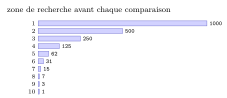
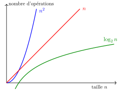

# Cours

<p class="sous-titre">La recherche dichotomique</p>

<span id="chap-07" class="ancre"></span>

|  |  |
|:---|:---|
| **Programme (BO)** | *« Algorithmes sur les tableaux »* : *recherche dichotomique* dans un tableau *trié* ; *coût logarithmique* ; *terminaison* d’une boucle (variant). |
| **Prérequis** | la boucle `while`, les tableaux (indices, `len`) ; la **recherche séquentielle** et la **notion de coût** (chapitre *Algorithmique : le parcours séquentiel*) ; le fait qu’un tableau puisse être **trié** (chapitre *Les algorithmes de tri*). |
| **Objectifs** | comprendre et écrire la recherche dichotomique ; **dérouler** son exécution ; prouver qu’elle **se termine** (variant de boucle) ; établir son **coût logarithmique** et mesurer à quel point il est petit. |

!!! remarque "Remarque — Le jeu qui cache un algorithme"

    « Je pense à un nombre entre 1 et 100. À chaque essai, je vous dis *plus petit* ou *plus grand*. » Personne ne propose 1, puis 2, puis 3… Tout le monde propose **50**, puis coupe encore en deux. En 7 essais au maximum, c’est gagné. Ce réflexe si naturel *est* un algorithme fondamental : la **recherche dichotomique** (du grec *dikho-tomia*, « couper en deux »). Vous l’avez d’ailleurs déjà programmé sans le savoir : au chapitre *Les bases de la programmation Python*, le défi « L’ordinateur devine » du TP « Le nombre mystère » appliquait exactement cette stratégie du milieu. Ce chapitre ne la redécouvre donc pas : il lui donne son **nom**, l’étend à la recherche dans un **tableau trié**, **prouve** qu’elle se termine toujours et **calcule** son coût. Nous allons voir qu’il transforme une recherche dans un million de valeurs en… **vingt** comparaisons. Les points qui dépassent le programme sont signalés par le badge <span class="horsprog">au-delà du programme</span>.

## L’idée : couper en deux, encore et encore

Au chapitre *Algorithmique : le parcours séquentiel*, nous avons cherché un élément en parcourant *tout* le tableau : dans le pire des cas (élément absent), il faut `n` comparaisons. Coût **linéaire**. Peut-on faire mieux ?

!!! regle "Règle 1 — Le déclic"

    On ne peut pas faire mieux qu’un parcours… **sauf si le tableau est trié**. Dans un tableau trié, comparer l’élément cherché à celui du **milieu** permet d’**éliminer la moitié** du tableau d’un seul coup.

Cherchons `x` dans un tableau trié. On regarde l’élément du milieu `m` :

- si `m == x` : **trouvé** ;

- si `x > m` : `x` ne peut être que dans la **moitié droite** (tout ce qui est à gauche est plus petit) ;

- si `x < m` : `x` ne peut être que dans la **moitié gauche**.

On recommence sur la moitié retenue, qui est deux fois plus petite. Et ainsi de suite, jusqu’à trouver `x`… ou jusqu’à ce qu’il ne reste plus rien à explorer.

!!! definition "Définition 1 — Recherche dichotomique"

    Rechercher `x` par **dichotomie** dans un tableau **trié**, c’est restreindre la zone de recherche à un intervalle `[deb ; fin]` que l’on **divise par deux** à chaque étape, en comparant `x` à l’élément du milieu.

## L’algorithme

On repère la zone de recherche par deux indices : `deb` (début) et `fin`. Le milieu est `mil = (deb + fin) // 2` (division **entière**). Tant que la zone n’est pas vide (`deb <= fin`), on teste son milieu.

```python
def recherche_dichotomique(t, x):
    """Renvoie True si x est dans le tableau TRIE t, False sinon."""
    deb = 0
    fin = len(t) - 1
    while deb <= fin:                 # tant que la zone n'est pas vide
        mil = (deb + fin) // 2        # indice du milieu
        if t[mil] == x:
            return True               # trouve !
        elif x > t[mil]:
            deb = mil + 1             # on garde la moitie DROITE
        else:
            fin = mil - 1             # on garde la moitie GAUCHE
    return False                      # zone vide : x est absent
```

!!! remarque "Remarque — Les deux façons de sortir de la boucle"

    On sort **par le `return True`** dès qu’on tombe sur `x` ; ou bien la boucle s’arrête quand `deb > fin`, c’est-à-dire quand la zone de recherche est devenue **vide** : `x` est alors absent. Les frontières `deb` et `fin` se sont « croisées » sans jamais se rencontrer sur `x`.

!!! remarque "Remarque — Version qui renvoie la position"

    Pour connaître *où* se trouve `x`, il suffit de renvoyer `mil` au lieu de `True`, et `-1` au lieu de `False`.

### Dérouler l’algorithme

Cherchons `x = 23` dans `t = [2, 5, 8, 12, 16, 23, 38, 56, 72, 91]` (indices 0 à 9). La zone courante `[deb ; fin]` est `bleutée`, le milieu testé est en `orange`, ce qui est éliminé est `grisé`.

|  | `0` | `1` | `2` | `3` | `4` | `5` | `6` | `7` | `8` | `9` |  |
|---:|:--:|:--:|:--:|:--:|:--:|:--:|:--:|:--:|:--:|:--:|:---|
| départ | `2` | `5` | `8` | `12` | `16` | `23` | `38` | `56` | `72` | `91` | `mil`=4, $16<23$ : à droite |
| `deb`=5 | `2` | `5` | `8` | `12` | `16` | `23` | `38` | `56` | `72` | `91` | `mil`=7, $56>23$ : à gauche |
| `fin`=6 | `2` | `5` | `8` | `12` | `16` | `23` | `38` | `56` | `72` | `91` | `mil`=5, $23=23$ : **trouvé !** |

En **3** comparaisons seulement, sur 10 éléments. Un parcours séquentiel en aurait fait 6 (23 est en 6<sup>e</sup> position).

<span id="cours-07-1" class="ancre"></span>

<span class="afaire">▶ Exercices d'application :</span> exercices **[1](exercices.md#ex-07-1) à [3](exercices.md#ex-07-3)** (dérouler la recherche ; le rôle du tri) et **[4](exercices.md#ex-07-4) à [8](exercices.md#ex-07-8)** (écrire l’algorithme)

## L’algorithme se termine-t-il ?

Avec une boucle `while`, une question capitale se pose : est-on sûr de ne pas tourner **indéfiniment** ? Ici, oui, et on peut le **prouver**.

!!! regle "Règle 2 — Un variant de boucle"

    Considérons la quantité `fin - deb`, la « largeur » de la zone de recherche. À **chaque** tour, on remplace `deb` par `mil + 1`, ou `fin` par `mil - 1` : dans les deux cas, cette largeur **diminue strictement**. Une quantité entière qui décroît strictement ne peut pas le faire éternellement : tôt ou tard `deb > fin`, et la boucle s’arrête. Une telle grandeur est appelée un **variant de boucle**.

!!! demonstration "Démonstration — La terminaison"

    La largeur `fin - deb` est un entier. À chaque tour de boucle qui ne renvoie pas `True`, elle diminue d’au moins 1 (la moitié testée est *écartée*, milieu compris). Une suite d’entiers strictement décroissante finit forcément par franchir 0 : on atteint `deb > fin`, la condition de la boucle devient fausse, l’algorithme se termine en renvoyant `False`.

!!! remarque "Remarque — Variant / invariant : ne pas confondre"

    Un **invariant** (chapitre *Algorithmique : le parcours séquentiel*) est une propriété qui reste *vraie* à chaque tour et prouve que le résultat est **correct**. Un **variant** est une quantité qui *décroît* à chaque tour et prouve que l’algorithme **se termine**. Correction *et* terminaison : les deux garanties d’un bon algorithme.

<span id="cours-07-12" class="ancre"></span>

<span class="afaire">▶ Exercices d'application :</span> exercice **[12](exercices.md#ex-07-12)** (la terminaison)

## Combien ça coûte ? Le coût logarithmique

À chaque tour, la zone de recherche est **divisée par deux**. La vraie question est donc : *combien de fois peut-on diviser `n` par 2 avant d’arriver à 1 ?*

$$n \to \frac{n}{2} \to \frac{n}{4} \to \frac{n}{8} \to \cdots \to 1.$$

!!! regle "Règle 3 — Coût logarithmique"

    Le nombre d’étapes de la recherche dichotomique sur un tableau de taille `n` est de l’ordre de $\log_2(n)$ : c’est le nombre de fois qu’on peut diviser `n` par 2 pour arriver à 1. On dit que son coût est **logarithmique**. C’est *radicalement* plus petit que `n`.

!!! remarque "Remarque — Le logarithme en deux mots au-delà du programme"

    Diviser `n` par 2 un nombre $a$ de fois pour tomber sur 1 revient à écrire $n = 2^a$. Ce nombre $a$ d’étapes se note $a = \log_2(n)$ : c’est la **réciproque** de la puissance de 2. Retenez surtout l’ordre de grandeur : **doubler la taille du tableau n’ajoute qu’*une seule* étape**.

Le tableau ci-dessous donne le nombre *maximal* de comparaisons. Le contraste avec la recherche séquentielle est saisissant. À droite, pour `n = 1000`, la largeur de la zone de recherche *avant* chacune des 10 comparaisons, dans le pire des cas (élément absent, plus grand que tous) : chaque barre est la **moitié** de la précédente.

| **taille `n`** | **séquentielle** ($\approx n$) | **dichotomique** ($\approx \log_2 n$) |
|---:|:--:|:--:|
| $100$ | $100$ | $7$ |
| $1\,000$ | $1\,000$ | $10$ |
| $1\,000\,000$ | $1\,000\,000$ | $20$ |
| $1\,000\,000\,000$ | $1\,000\,000\,000$ | $30$ |

{ .tikz loading=lazy }

Chercher dans l’annuaire du monde entier (8 milliards de noms triés) ne demanderait que **33 comparaisons**. Voilà pourquoi on trie.

### Comparer les trois coûts d’un coup d’œil

Voici les trois coûts rencontrés cette année : **linéaire** ($n$), **quadratique** ($n^2$) et **logarithmique** ($\log_2 n$). Plus une courbe reste *basse*, plus l’algorithme est *efficace* quand `n` grandit.

{ .tikz loading=lazy }

!!! regle "Règle 4 — La hiérarchie à retenir"

    Pour de grandes données : $\log_2 n$ (dichotomie) $\ll$ $n$ (parcours) $\ll$ $n^2$ (tris naïfs). Le logarithme écrase tout : c’est le coût rêvé.

!!! remarque "Remarque — Le prix à payer : un tableau trié"

    La dichotomie **exige** un tableau trié. Si le tableau ne l’est pas, il faut d’abord le trier (coût quadratique, ou $n\log_2 n$ avec un bon tri). Cela ne vaut le coup que si l’on fait **beaucoup** de recherches : on trie *une* fois, on cherche *souvent*, très vite.

!!! remarque "Remarque — En Terminale"

    La dichotomie est l’exemple type de la méthode étudiée dans le chapitre *Diviser pour régner* : ramener un problème à un sous-problème plus petit, du même type. Elle s’y écrit aussi très naturellement sous forme *récursive* (chapitre *La récursivité*).

<span id="cours-07-9" class="ancre"></span>

<span class="afaire">▶ Exercices d'application :</span> exercices **[9](exercices.md#ex-07-9) à [11](exercices.md#ex-07-11)** (le coût logarithmique)

## Un peu d’histoire et de culture

!!! remarque "Remarque — Un algorithme simple… et pourtant redoutable à écrire"

    La recherche dichotomique est décrite dès **1946**, mais la première version publiée *sans bug* pour un tableau quelconque n’apparaît qu’en **1962** ! Le grand informaticien **Donald Knuth** note que, si l’idée est limpide, « les détails » (les $\pm 1$ sur `deb` et `fin`, la condition d’arrêt) font trébucher la plupart des programmeurs. Plus fort encore : la recherche dichotomique de la bibliothèque standard de **Java** a contenu pendant **neuf ans** un bug (un calcul de milieu qui pouvait déborder sur de très grands tableaux), découvert seulement en 2006. La morale : un algorithme « évident » mérite d’être écrit, testé et *prouvé* avec soin — exactement ce que nous avons fait avec le variant de boucle.

!!! remarque "Remarque — Liens avec d’autres chapitres"

    La dichotomie s’appuie sur la recherche séquentielle et la notion de coût (**Algorithmique : le parcours séquentiel**), le tableau trié (**Les algorithmes de tri**) et le **variant** vu dans **Les bases de la programmation Python**. Son coût fait écho au chapitre **Le binaire et l’écriture des nombres** : il faut environ $\log_2 n$ bits pour écrire $n$, comme environ $\log_2 n$ étapes pour isoler une valeur parmi $n$. En Terminale, l’**arbre binaire de recherche** (**Les arbres**) inscrit la dichotomie dans la structure même des données.

## Bilan — la carte mémoire

| **Notion** | **À retenir** |
|:---|:---|
| Condition d’emploi | le tableau doit être **trié** |
| Le principe | comparer au **milieu**, éliminer une **moitié**, recommencer |
| Les indices | `deb`, `fin` ; milieu `mil = (deb + fin) // 2` |
| Aller à droite / gauche | `x > t[mil]` $\to$ `deb = mil+1` ; sinon `fin = mil-1` |
| Condition d’arrêt | `deb > fin` : zone vide $\to$ élément absent |
| Terminaison | `fin - deb` décroît strictement : c’est un **variant** de boucle |
| Coût | **logarithmique** $\approx \log_2 n$ (doubler `n` $\to$ +1 étape) |
| Ordre de grandeur | $1\,000\,000$ éléments $\to$ **20** comparaisons seulement |
| Variant vs invariant | variant $\to$ *termine* ; invariant $\to$ *correct* |

## Erreurs fréquentes

- **Chercher par dichotomie dans un tableau non trié.** L’algorithme **ne fonctionne pas** : le tri est une **hypothèse** indispensable.

- **Mal mettre à jour `deb` / `fin` / `mil`.** Oublier le $\pm 1$ $\Rightarrow$ **boucle infinie**. *Le réflexe :* `mil = (deb + fin) // 2`, puis `deb = mil + 1` ou `fin = mil - 1`.

- **Oublier le cas « absent ».** Quand `deb > fin`, l’élément n’est pas là : renvoyer `False` / `-1`.

- **Confondre variant et invariant.** Le **variant** (`fin - deb`) prouve la **terminaison** ; l’invariant prouve la **correction**.

- **Croire la recherche séquentielle aussi rapide.** Elle est **linéaire** ; la dichotomie est **logarithmique**.

## Savoir-faire à maîtriser

*À la fin du chapitre, je sais…*

- **dérouler** une recherche dichotomique et compter les tours ;

- écrire la **recherche dichotomique** (indices `deb` / `fin` / `mil`) ;

- justifier la **terminaison** par un **variant** (`fin - deb` décroît) ;

- justifier le **coût logarithmique** (on divise par deux à chaque tour) ;

- reconnaître l’**hypothèse** indispensable : le tableau est **trié**.
