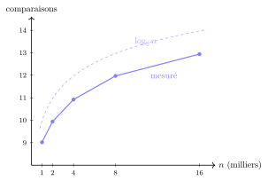

# TP et projets

<p class="sous-titre">La recherche dichotomique</p>

## <span class="etiquette">TP</span> L’annuaire et le devin

*la recherche dichotomique en vrai : jouer, chercher, mesurer, compléter*

!!! fichiers "Fichiers à télécharger"

    [:material-folder-open: dossier en ligne](https://github.com/MathThibaud/nsi-fichiers-eleves/tree/main/premiere/07-tp-annuaire-devin){ .md-button } [:material-zip-box: archive .zip](https://github.com/MathThibaud/nsi-fichiers-eleves/raw/main/zips/premiere-07-tp-annuaire-devin.zip){ .md-button }

|  |  |
|:---|:---|
| **Durée** | 2 h à 2 h 30 (une à deux séances), en binôme, sur machine. |
| **Prérequis** | le cours *La recherche dichotomique* (algorithme, variant, coût logarithmique) ; la recherche séquentielle et la notion de coût (chapitre *Algorithmique : le parcours séquentiel*). |
| **Fichiers** | `tp_dichotomie_annuaire.py` (fabrique l’annuaire, fourni, à ne pas modifier) et `tp_dichotomie_depart.py` (à compléter). Les deux fichiers doivent être dans le **même dossier**. |

!!! encadre "But du TP"

    On va mettre la dichotomie au travail sur deux vrais problèmes :

    1.  un **devin** : un programme qui trouve le nombre auquel *vous* pensez, et qui démasque les tricheurs ;

    2.  un **annuaire** (fictif) de $16\,000$ abonnés : retrouver un numéro par recherche séquentielle puis par dichotomie, **compter** et **chronométrer** les deux, et tracer la courbe du coût logarithmique ;

    3.  une **autocomplétion** : taper le début d’un nom et obtenir les premières suggestions, instantanément.

    **Produit final** : le devin, un annuaire interrogeable avec autocomplétion, un graphique « mesuré contre $\log_2 n$ » et un bilan rédigé.

!!! consignes "Consignes"

    - Niveau : ★ échauffement, ★★ classique (niveau bac), ★★★ défi ; les *coups de pouce* et les *corrigés* se déplient sous chaque exercice. <span class="run" title="À programmer et tester sur machine">▶</span> *À programmer* dans `tp_dichotomie_depart.py`.

    - On écrit les recherches soi-même : pas de `in`, `index` ni `bisect` (sauf quand une question le demande, pour comparer).

    - En bas du fichier, le programme principal contient des lignes en commentaire (`#`) : on les **décommente au fur et à mesure**. Des tests `assert` sont fournis.

    - Le compte rendu (tableaux, réponses, bilan) se fait sur le cahier (ou dans un fichier texte).

    - Usage de l’IA, indiqué sur chaque exercice : <span class="ia ia-rouge" title="Sans IA : le but est l'automatisme lui-même"></span> aucune ; <span class="ia ia-orange" title="IA en appui : déboguer, reformuler, vérifier ; la réponse finale est la vôtre"></span> en appui (déboguer, reformuler, vérifier ; la réponse finale est écrite et comprise par vous) ; <span class="ia ia-vert" title="IA intégrée : l'exercice s'appuie sur une réponse d'IA"></span> l’exercice s’appuie sur une réponse d’IA. Voir la [charte d’usage de l’IA](../charte.md).

## Le devin

Cette fois, c’est **vous** qui pensez à un nombre et **l’ordinateur** qui cherche. À chaque proposition, vous répondez au clavier `+` (votre nombre est plus grand), `-` (plus petit) ou `=` (trouvé).

### <span class="stars" title="Niveau 2 sur 3">★★</span> <span class="exo-num">Exercice 1</span> — Programmer le devin <span class="ia ia-orange" title="IA en appui : déboguer, reformuler, vérifier ; la réponse finale est la vôtre"></span> { #ex-07-la-recherche-dichotomique-tp-1-1 }

1.  <span class="run" title="À programmer et tester sur machine">▶</span> Écrire `devin(bas, haut)` qui cherche par dichotomie un nombre entre `bas` et `haut`, en posant ses questions avec `input`. Elle affiche le nombre d’essais quand elle a trouvé et le **renvoie**.

    ```text
    >>> devin(1, 100)
    Je propose 50 (+, - ou =) ? +
    Je propose 75 (+, - ou =) ? -
    Je propose 62 (+, - ou =) ? =
    Trouvé en 3 essais !
    3
    ```

    ??? pouce "Coup de pouce"

        C’est la recherche dichotomique du cours : `bas` et `haut` jouent le rôle de `deb` et `fin`, la proposition celui de `mil`, et la réponse au clavier remplace la comparaison avec `t[mil]`.

2.  <span class="run" title="À programmer et tester sur machine">▶</span> Jouer cinq parties entre 1 et 100. Quel est le nombre maximal d’essais observé ? Pourquoi ne dépasse-t-on jamais 7 ?

3.  <span class="run" title="À programmer et tester sur machine">▶</span> Jouer entre 1 et $1\,000\,000$ (penser à un nombre à six chiffres). Combien d’essais ? Combien, au pire ?

??? corrige "Corrigé"

    *La dichotomie exige un tableau trié. Elle compare à l’élément du milieu et élimine une moitié à chaque tour : dans notre annuaire de 16 000 noms, 13 comparaisons en moyenne contre 8 141 pour la recherche séquentielle, et 1000 recherches en 0,003 s au lieu de 0,59 s. Quand on double la taille, il ne faut qu’une comparaison de plus (9, 10, 11, 12, 13 pour 1 000 à 16 000 noms) : c’est le coût logarithmique, environ $\log_2 n$, soit 33 comparaisons pour 8 milliards de noms. La même idée sert sans tableau : le devin trouve un nombre entre 1 et un million en 20 questions, et l’on encadre $\sqrt{2}$ à $10^{-6}$ près en 21 tours. Le chronomètre confirme le comptage, mais ajoute que la vitesse du langage compte aussi : `in`, écrit en C, bat notre recherche séquentielle, sans rattraper la dichotomie.*

    ```python
    def devin(bas, haut):
        essais = 0
        while bas <= haut:
            proposition = (bas + haut) // 2
            essais = essais + 1
            reponse = input("Je propose " + str(proposition) + " (+, - ou =) ? ")
            if reponse == "=":
                print("Trouvé en", essais, "essais !")
                return essais
            elif reponse == "+":
                bas = proposition + 1
            else:
                haut = proposition - 1
        print("Impossible : vos réponses se contredisent. Tricheur !")
        return -1
    ```

    - **2.**  Jamais plus de **7** essais entre 1 et 100 : chaque réponse `+` ou `-` divise au moins par deux la zone, et $2^7 = 128 > 100$ (après 6 réponses, il reste au plus une valeur).

    - **3.**  Entre 1 et $1\,000\,000$ : souvent 18 à 20 essais ; au pire **20**, car $2^{20} = 1\,048\,576 > 10^6$. Exemple réel (secret 2026) : 20 essais, propositions 500000, 250000, …, 2027, 2026.

### <span class="stars" title="Niveau 2 sur 3">★★</span> <span class="exo-num">Exercice 2</span> — Démasquer le tricheur <span class="ia ia-orange" title="IA en appui : déboguer, reformuler, vérifier ; la réponse finale est la vôtre"></span> { #ex-07-la-recherche-dichotomique-tp-1-2 }

Un joueur malhonnête répond au hasard. Que fait votre programme ?

1.  Entre 1 et 10, répondre `+`, `-`, `+`, `-`… Que se passe-t-il ? Quelles valeurs prennent `bas` et `haut` à la fin ?

2.  <span class="run" title="À programmer et tester sur machine">▶</span> Modifier `devin` : si la zone de recherche devient **vide**, elle affiche « Impossible : vos réponses se contredisent. Tricheur ! » et renvoie `-1`.

3.  Expliquer pourquoi la zone vide **prouve** la tricherie. *(Que contient la zone `[bas ; haut]` à chaque tour si le joueur est honnête ? C’est un invariant.)*

4.  Justifier, avec le **variant** du cours, que le devin s’arrête toujours, même face à un tricheur.

??? corrige "Corrigé"

    1.  Propositions 5 (`+`, `bas = 6`), 8 (`-`, `haut = 7`), 6 (`+`, `bas = 7`), 7 (`-`, `haut = 6`) : `bas = 7 > haut = 6`, la boucle s’arrête. Sans la modification, la fonction se termine sans rien dire (elle renvoie `None`).

    2.  Ce sont les deux dernières lignes du code ci-dessus (après la boucle).

    3.  Si le joueur est honnête, son nombre est **toujours** dans `[bas ; haut]` : c’est vrai au départ, et chaque réponse vraie n’élimine que des valeurs impossibles (invariant). Une zone vide ne contient aucun nombre : l’invariant est violé, donc au moins une réponse était fausse.

    4.  `haut - bas` est un entier qui diminue strictement à chaque réponse `+` ou `-` (on écarte la proposition et toute une moitié) : c’est un **variant**. Il finit par devenir négatif, et la boucle s’arrête — que le joueur mente ou non.

## L’annuaire

### <span class="stars" title="Niveau 1 sur 3">★</span> <span class="exo-num">Exercice 3</span> — Prise en main <span class="ia ia-orange" title="IA en appui : déboguer, reformuler, vérifier ; la réponse finale est la vôtre"></span> { #ex-07-la-recherche-dichotomique-tp-1-3 }

La fonction `charger_annuaire()`, fournie, renvoie deux tableaux de même longueur : `noms` (des chaînes `"NOM Prénom"`, triées par ordre alphabétique) et `numeros` : `numeros[i]` est le numéro de `noms[i]`. *Tous ces abonnés et numéros sont inventés.*

1.  <span class="run" title="À programmer et tester sur machine">▶</span> Afficher la longueur de l’annuaire, son premier et son dernier abonné.

2.  <span class="run" title="À programmer et tester sur machine">▶</span> Écrire `est_trie(t)` (s’arrêter dès qu’on trouve deux voisins dans le désordre) et vérifier que `noms` est trié. Pourquoi est-ce indispensable pour la suite ?

3.  En Python, deux chaînes se comparent caractère par caractère, selon leur code ; l’espace passe avant les lettres et les majuscules avant les minuscules. Dans l’annuaire, `"LE GALL Adam"` est-il avant ou après `"LEBLANC Adam"` ? Vérifier.

??? corrige "Corrigé"

    1.  $16\,000$ abonnés, de `"ADAM Adam"` à `"VINCENT Zoe"`.

    2.  Code ci-dessous ; `est_trie(noms)` renvoie `True`. La dichotomie n’est **correcte** que sur un tableau trié : on vérifie l’hypothèse avant de s’en servir.

    3.  `"LE GALL Adam"` est **avant** `"LEBLANC Adam"` (indices $8\,100$ et $8\,400$) : les deux chaînes diffèrent au 3<sup>e</sup> caractère, une espace contre un `B`, et l’espace a un code plus petit.

    ```python
    def est_trie(t):
        for i in range(len(t) - 1):
            if t[i] > t[i + 1]:
                return False
        return True
    ```

### <span class="stars" title="Niveau 2 sur 3">★★</span> <span class="exo-num">Exercice 4</span> — Deux façons de trouver un numéro <span class="ia ia-orange" title="IA en appui : déboguer, reformuler, vérifier ; la réponse finale est la vôtre"></span> { #ex-07-la-recherche-dichotomique-tp-1-4 }

Chaque fonction renvoie un **couple** : le numéro trouvé (ou `None` si le nom est absent) et le **nombre de comparaisons** effectuées, chaque tour de boucle comptant pour une comparaison.

1.  <span class="run" title="À programmer et tester sur machine">▶</span> Écrire `numero_sequentiel(noms, numeros, nom)` : parcours du début à la fin, arrêt dès qu’on trouve.

2.  <span class="run" title="À programmer et tester sur machine">▶</span> Écrire `numero_dicho(noms, numeros, nom)` : recherche dichotomique, qui renvoie `numeros[mil]` quand `noms[mil] == nom`.

    ```text
    >>> numero_dicho(["A", "B", "C"], ["1", "2", "3"], "B")
    ('2', 1)
    ```

    ??? pouce "Coup de pouce"

        Reprendre la recherche dichotomique du cours. Les opérateurs `==`, `<` et `>` comparent des chaînes comme des nombres. Le compteur augmente de 1 au début de chaque tour, et on le renvoie dans les deux sorties (trouvé, absent).

3.  <span class="run" title="À programmer et tester sur machine">▶</span> Décommenter `tester_partie_B(noms, numeros)` : tous les tests doivent passer.

??? corrige "Corrigé"

    ```python
    def numero_sequentiel(noms, numeros, nom):
        comparaisons = 0
        for i in range(len(noms)):
            comparaisons = comparaisons + 1
            if noms[i] == nom:
                return numeros[i], comparaisons
        return None, comparaisons

    def numero_dicho(noms, numeros, nom):
        comparaisons = 0
        deb = 0
        fin = len(noms) - 1
        while deb <= fin:
            mil = (deb + fin) // 2
            comparaisons = comparaisons + 1
            if noms[mil] == nom:
                return numeros[mil], comparaisons
            elif nom > noms[mil]:
                deb = mil + 1
            else:
                fin = mil - 1
        return None, comparaisons
    ```

## Mesurer

### <span class="stars" title="Niveau 1 sur 3">★</span> <span class="exo-num">Exercice 5</span> — Quelques recherches à la loupe <span class="ia ia-orange" title="IA en appui : déboguer, reformuler, vérifier ; la réponse finale est la vôtre"></span> { #ex-07-la-recherche-dichotomique-tp-1-5 }

<span class="run" title="À programmer et tester sur machine">▶</span> Recopier sur le cahier le tableau suivant et le compléter avec le nombre de comparaisons renvoyé par chaque fonction.

| **nom cherché**              | **séquentielle** | **dichotomique** |
|:-----------------------------|:-----------------|:-----------------|
| `"ADAM Adam"` (le premier)   |                  |                  |
| `"DUPONT Alice"`             |                  |                  |
| `"MARTIN Hugo"`              |                  |                  |
| `"VINCENT Zoe"` (le dernier) |                  |                  |
| `"ZORRO Zoe"` (absent)       |                  |                  |

1.  Dans quel cas la recherche séquentielle gagne-t-elle ? Est-ce un cas fréquent ?

2.  Quel nom la dichotomie trouve-t-elle en **une seule** comparaison ?

??? corrige "Corrigé"

    | **nom cherché**              | **séquentielle** | **dichotomique** |
    |:-----------------------------|-----------------:|-----------------:|
    | `"ADAM Adam"` (le premier)   |              $1$ |             $13$ |
    | `"DUPONT Alice"`             |         $4\,305$ |             $14$ |
    | `"MARTIN Hugo"`              |        $10\,334$ |             $14$ |
    | `"VINCENT Zoe"` (le dernier) |        $16\,000$ |             $14$ |
    | `"ZORRO Zoe"` (absent)       |        $16\,000$ |             $14$ |

    1.  La séquentielle ne gagne que pour une douzaine de tout premiers noms (il lui faut moins de comparaisons que les 13 ou 14 de la dichotomie), soit moins d’un cas sur mille.

    2.  Le nom du milieu, `noms[7999]` $=$ `"LANGLOIS Zoe"` (premier `mil` $= (0 + 15\,999) // 2$).

### <span class="stars" title="Niveau 2 sur 3">★★</span> <span class="exo-num">Exercice 6</span> — En moyenne, et au chronomètre <span class="ia ia-orange" title="IA en appui : déboguer, reformuler, vérifier ; la réponse finale est la vôtre"></span> { #ex-07-la-recherche-dichotomique-tp-1-6 }

1.  <span class="run" title="À programmer et tester sur machine">▶</span> La fonction `moyenne_comparaisons`, fournie, cherche `nb_essais` noms tirés au hasard dans l’annuaire et renvoie le nombre moyen de comparaisons. La lancer avec 1000 essais pour chaque méthode et noter les deux moyennes. Expliquer la valeur obtenue pour la séquentielle (où se trouve, en moyenne, un nom tiré au hasard ?).

2.  <span class="run" title="À programmer et tester sur machine">▶</span> Écrire `chrono_recherches(noms, numeros, recherche, cibles)` qui renvoie la durée totale, mesurée avec `time.perf_counter()`, de la recherche de **chacun** des noms de la liste `cibles`.

3.  <span class="run" title="À programmer et tester sur machine">▶</span> Fabriquer une liste de 1000 noms tirés au hasard dans l’annuaire, puis chronométrer les deux méthodes **sur la même liste**. Noter les deux durées et leur rapport.

4.  <span class="run" title="À programmer et tester sur machine">▶</span> Chronométrer aussi `nom in noms` pour les mêmes 1000 noms. L’opérateur `in` parcourt la liste élément par élément, mais il est programmé en langage C, bien plus rapide que Python. Le classement des trois méthodes vous surprend-il ? Que se passerait-il avec un annuaire de 100 millions d’abonnés ?

??? corrige "Corrigé"

    ```python
    def chrono_recherches(noms, numeros, recherche, cibles):
        debut = time.perf_counter()
        for nom in cibles:
            recherche(noms, numeros, nom)
        return time.perf_counter() - debut

    cibles = [noms[random.randint(0, len(noms) - 1)] for k in range(1000)]
    ```

    Mesures réellement obtenues :

    - moyennes sur 1000 recherches : séquentielle **8 141** comparaisons ($\approx n/2$ : un nom tiré au hasard est en moyenne au milieu) ; dichotomique **13,0** ;

    - 1000 recherches chronométrées : séquentielle **0,59 s**, dichotomique **0,003 s**, rapport $\approx 190$ ;

    - `nom in noms` : **0,080 s**, sept fois plus rapide que notre séquentielle (le langage C), mais **25 fois plus lente** que notre dichotomie en Python. Avec $10^8$ abonnés ($6\,250$ fois plus), `in` prendrait environ $6\,250 \times 0{,}08 \approx 500$ s, alors que la dichotomie ne ferait qu’une douzaine de comparaisons de plus par recherche : toujours quelques millisecondes. **Un bon algorithme bat un langage rapide** dès que les données sont grandes.

### <span class="stars" title="Niveau 2 sur 3">★★</span> <span class="exo-num">Exercice 7</span> — La courbe du logarithme <span class="ia ia-orange" title="IA en appui : déboguer, reformuler, vérifier ; la réponse finale est la vôtre"></span> { #ex-07-la-recherche-dichotomique-tp-1-7 }

1.  <span class="run" title="À programmer et tester sur machine">▶</span> La fonction `courbe_moyennes`, fournie, mesure le nombre moyen de comparaisons de la dichotomie sur les `n` premiers abonnés (`noms[0:n]`, qui reste trié). La lancer pour `tailles = [1000, 2000, 4000, 8000, 16000]` puis recopier et compléter sur le cahier le tableau suivant :

| **taille `n`**               | $1\,000$ | $2\,000$ | $4\,000$ | $8\,000$ | $16\,000$ |
|:-----------------------------|:---------|:---------|:---------|:---------|:----------|
| **comparaisons (moyenne)**   |          |          |          |          |           |
| **$\log_2 n$** (`math.log2`) |          |          |          |          |           |

1.  De combien augmente le nombre moyen de comparaisons quand la taille **double** ? Comparer à $\log_2 n$. Quelle phrase du cours retrouve-t-on ?

2.  <span class="run" title="À programmer et tester sur machine">▶</span> Décommenter `tracer(...)` et décrire les deux courbes.

3.  **Prédire.** Combien de comparaisons faudrait-il, au plus, pour chercher un nom dans un annuaire de 8 milliards de personnes ? et par recherche séquentielle ?

??? corrige "Corrigé"

    | **taille `n`**             | $1\,000$ | $2\,000$  | $4\,000$  | $8\,000$  | $16\,000$ |
    |:---------------------------|:--------:|:---------:|:---------:|:---------:|:---------:|
    | **comparaisons (moyenne)** | $9{,}02$ | $9{,}94$  | $10{,}92$ | $11{,}97$ | $12{,}94$ |
    | **$\log_2 n$**             | $9{,}97$ | $10{,}97$ | $11{,}97$ | $12{,}97$ | $13{,}97$ |

    - **2.**  **+1** comparaison à chaque doublement, comme $\log_2 n$ (la moyenne vaut environ $\log_2 n - 1$ : on trouve souvent avant la fin). C’est la phrase du cours : « doubler la taille du tableau n’ajoute qu’une seule étape ».

    - **3.**  Deux courbes parallèles, qui montent de moins en moins vite : la courbe mesurée est juste sous $\log_2 n$.

    - **4.**  $\log_2(8 \times 10^9) \approx 32{,}9$ : au plus **33** comparaisons ; jusqu’à **8 milliards** en séquentiel.

    { .tikz loading=lazy }

    *L’axe vertical commence à 8 : la courbe mesurée suit $\log_2 n$ à une unité près.*

## L’autocomplétion

On tape `DUP` dans la barre de recherche : l’annuaire doit proposer **aussitôt** les premiers noms qui commencent par `DUP`. Dans un tableau trié, tous ces noms sont **côte à côte** : il suffit de trouver où commence le bloc.

### <span class="stars" title="Niveau 3 sur 3">★★★</span> <span class="exo-num">Exercice 8</span> — Où commence le bloc ? <span class="ia ia-orange" title="IA en appui : déboguer, reformuler, vérifier ; la réponse finale est la vôtre"></span> { #ex-07-la-recherche-dichotomique-tp-1-8 }

1.  <span class="run" title="À programmer et tester sur machine">▶</span> Écrire `premier_indice_au_moins(noms, debut_nom)` qui renvoie le **plus petit** indice `i` tel que `noms[i] >= debut_nom` (et `len(noms)` s’il n’y en a aucun), par dichotomie. *On ne s’arrête plus quand on « trouve » : on mémorise le candidat `mil` et l’on continue à chercher plus à gauche.*

    ```text
    >>> premier_indice_au_moins(["A", "C", "E"], "B")
    1
    >>> premier_indice_au_moins(["A", "C", "E"], "Z")
    3
    ```

    ??? pouce "Coup de pouce"

        Une variable `res`, initialisée à `len(noms)`. Si `noms[mil] >= debut_nom`, `mil` est un candidat : `res = mil`, puis `fin = mil - 1`. Sinon, `deb = mil + 1`. On renvoie `res` quand la zone est vide.

2.  Pourquoi le premier nom qui commence par `"DUP"` est-il exactement le premier nom `>= "DUP"` ?

3.  <span class="run" title="À programmer et tester sur machine">▶</span> Écrire `suggestions(noms, prefixe, k)` qui renvoie au plus `k` noms commençant par `prefixe`, dans l’ordre. *La méthode `s.startswith(p)` renvoie `True` si la chaîne `s` commence par `p`.*

    ```text
    >>> suggestions(noms, "DUP", 3)
    ['DUPONT Adam', 'DUPONT Adele', 'DUPONT Agathe']
    ```

4.  <span class="run" title="À programmer et tester sur machine">▶</span> Écrire `nb_commencant_par(noms, prefixe)`, puis décommenter `tester_partie_D(noms)`. Combien d’abonnés commencent par `"MAR"` ? par `"LE"` ?

5.  Combien de comparaisons coûte `suggestions(noms, prefixe, k)` au plus, en fonction de $n$ et de $k$ ? Pourquoi l’autocomplétion reste-t-elle instantanée sur un annuaire géant ?

??? corrige "Corrigé"

    ```python
    def premier_indice_au_moins(noms, debut_nom):
        deb = 0
        fin = len(noms) - 1
        res = len(noms)
        while deb <= fin:
            mil = (deb + fin) // 2
            if noms[mil] >= debut_nom:
                res = mil                # candidat ; on cherche encore plus a gauche
                fin = mil - 1
            else:
                deb = mil + 1
        return res

    def suggestions(noms, prefixe, k):
        res = []
        i = premier_indice_au_moins(noms, prefixe)
        while i < len(noms) and len(res) < k and noms[i].startswith(prefixe):
            res.append(noms[i])
            i = i + 1
        return res

    def nb_commencant_par(noms, prefixe):
        i = premier_indice_au_moins(noms, prefixe)
        c = 0
        while i < len(noms) and noms[i].startswith(prefixe):
            c = c + 1
            i = i + 1
        return c
    ```

    - **2.**  Dans l’ordre alphabétique, un préfixe est plus petit que tout mot qui le prolonge (`"DUP" < "DUPONT Adam"`) : tous les noms qui commencent par `"DUP"` sont donc `>= "DUP"`. Et tout nom placé avant ce bloc est `< "DUP"`. Le premier nom `>= "DUP"` (ici l’indice $4\,300$, `"DUPONT Adam"`) ouvre donc le bloc — s’il commence bien par `"DUP"` ; sinon, le bloc est vide.

    - **4.**  **500** abonnés commencent par `"MAR"` (MARCHAND, MARIE, MARTIN, MARTINEZ, MARTY : $5 \times 100$) et **1 600** par `"LE"` (16 noms).

    - **5.**  Environ $\log_2 n$ comparaisons pour trouver le début du bloc, puis au plus $k$ (plus une) pour le lire : $\log_2 n + k$. Avec $k = 5$ et un milliard de noms, une quarantaine d’opérations : instantané.

## Bonus : la dichotomie sur les nombres à virgule

### <span class="stars" title="Niveau 3 sur 3">★★★</span> <span class="exo-num">Exercice 9</span> — Encadrer une racine carrée <span class="ia ia-orange" title="IA en appui : déboguer, reformuler, vérifier ; la réponse finale est la vôtre"></span> { #ex-07-la-recherche-dichotomique-tp-1-9 }

On cherche $\sqrt{a}$ pour un nombre $a \geq 1$ : elle est entre $0$ et $a$. On coupe l’intervalle `[bas ; haut]` en deux et l’on garde la moitié qui contient la racine, **tant que** sa largeur dépasse la précision voulue. Cette fois, on ne cherche pas dans un tableau : on cherche un **nombre** dans un intervalle.

1.  <span class="run" title="À programmer et tester sur machine">▶</span> Écrire `racine(a, precision)` qui renvoie le milieu du dernier intervalle et le nombre de tours effectués (`mil = (bas + haut) / 2`, division *décimale*). Comparer `racine(2, 0.000001)` à `2 ** 0.5`.

    ??? pouce "Coup de pouce"

        Si `mil * mil <= a`, la racine est dans `[mil ; haut]` : on fait `bas = mil`. Sinon, `haut = mil`. Ici, pas de `+ 1` ni de `- 1` : ce ne sont plus des indices.

2.  Combien de tours pour $a = 2$ puis $a = 1\,000\,000$, à la précision $10^{-6}$ ? Expliquer ces nombres : par combien la largeur de l’intervalle est-elle divisée à chaque tour ? Combien de divisions faut-il pour passer d’une largeur $a$ à une largeur $10^{-6}$ ?

??? corrige "Corrigé"

    ```python
    def racine(a, precision):
        bas = 0
        haut = a
        tours = 0
        while haut - bas > precision:
            mil = (bas + haut) / 2
            tours = tours + 1
            if mil * mil <= a:
                bas = mil
            else:
                haut = mil
        return (bas + haut) / 2, tours
    ```

    `racine(2, 0.000001)` renvoie `(1.41421365…, 21)` ; `2 ** 0.5` vaut `1.41421356…` : écart inférieur à $10^{-6}$. Pour $a = 1\,000\,000$ : **40** tours. La largeur est divisée par 2 à chaque tour ; il faut $t$ tours avec $a / 2^t \leq 10^{-6}$, soit $t \geq \log_2(a \times 10^6)$ : $\log_2(2 \times 10^6) \approx 20{,}9$ donne 21, et $\log_2(10^{12}) \approx 39{,}9$ donne 40.

## Bilan à rédiger

Sur le cahier, en huit à dix lignes, **en citant vos mesures** :

- la condition indispensable pour utiliser la dichotomie, et ce qu’elle rapporte (comparaisons, temps) par rapport à la recherche séquentielle ;

- ce que signifie « coût logarithmique » quand on double la taille des données ;

- une situation où la dichotomie ne cherche pas dans un tableau (devin, racine) ;

- ce que les mesures au chronomètre ajoutent (ou pas) au simple comptage des comparaisons.
