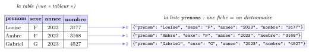
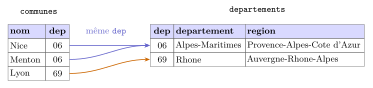
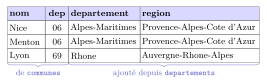

# Cours

<p class="sous-titre">Les données en tables</p>

<span id="chap-08" class="ancre"></span>

|  |  |
|:---|:---|
| **Programme (BO)** | *« Données en table »* : *indexation* d’une table ; *recherche* de lignes répondant à un critère ; *tri* d’une table selon les valeurs d’un descripteur ; *fusion* de deux tables ayant un descripteur commun. *Importer* une table depuis un fichier au format **CSV**. |
| **Prérequis** | les **listes** et les **dictionnaires** (chapitre *Les types construits*) ; le **patron du parcours** et la **notion de coût** (chapitre *Algorithmique : le parcours séquentiel*) ; les boucles `for` et les fonctions. |
| **Objectifs** | représenter une table par une **liste de dictionnaires** ; l’**importer** depuis un CSV ; **rechercher / filtrer** selon un critère ; **calculer** sur une colonne (moyenne, min, max, comptage) ; **trier** selon un descripteur ; **fusionner** deux tables. |

!!! remarque "Remarque — Le fil conducteur : une table, c’est un classeur de fiches"

    Tout ce chapitre repose sur **une seule image**. Une table de données, c’est un **classeur** : chaque **fiche** décrit un individu (un prénom, une commune, un film…) en renseignant les mêmes **rubriques**. En Python, une fiche sera un **dictionnaire** `{rubrique : valeur}`, et le classeur entier une **liste** de ces fiches. Dès qu’on a cette image, tout le reste n’est que du **parcours** : traiter la table, c’est parcourir la liste des fiches — exactement le patron du chapitre *Algorithmique : le parcours séquentiel*. Les points qui dépassent le programme portent le badge <span class="horsprog">au-delà du programme</span>.

!!! remarque "Remarque — Un projet à la clé"

    Ce chapitre débouche sur l’un des **projets de l’année** : *analyser un vrai fichier de données*. On y filtre, trie et croise le fichier des **prénoms donnés en France** (données publiques de l’INSEE) — une véritable application de ce qu’on apprend ici : c’est le projet proposé en fin de chapitre « Les prénoms de l’INSEE ».

## Descripteurs, enregistrements, format CSV

!!! definition "Définition 1 — Table, descripteur, enregistrement"

    Une **table de données** organise l’information en lignes et colonnes.

    - un **descripteur** (ou *attribut*) est le nom d’une colonne : ce qu’on renseigne pour chacun ;

    - un **enregistrement** (une *fiche*, une *ligne*) donne **une valeur pour chaque descripteur**.

    Un enregistrement est donc un **$p$-uplet nommé** : une collection de couples `descripteur : valeur`.

Voici une petite table : les prénoms de filles les plus donnés en France en 2023 (chiffres INSEE non arrondis, éditions antérieures à 2026).

| **prenom** | **sexe** | **annee** | **nombre** |
|:-----------|:--------:|:---------:|:----------:|
| Louise     |    F     |   2023    |    3177    |
| Ambre      |    F     |   2023    |    3168    |
| Alba       |    F     |   2023    |    3088    |
| Jade       |    F     |   2023    |    2891    |

Ici les **descripteurs** sont `prenom`, `sexe`, `annee`, `nombre`. La ligne de Louise est **un enregistrement** ; sa valeur pour le descripteur `nombre` est `3177`.

!!! definition "Définition 2 — Le format CSV"

    Un fichier **CSV** (*Comma-Separated Values*, « valeurs séparées par des virgules ») est un simple fichier **texte** qui représente une table :

    - la **première ligne** donne les descripteurs (l’*en-tête*) ;

    - **chaque ligne suivante** est un enregistrement ;

    - sur une ligne, les valeurs sont séparées par un **séparateur** (souvent la virgule `,` ou le point-virgule `;`).

Le contenu du fichier `prenoms.csv` commence ainsi (c’est du texte, on peut l’ouvrir avec un simple éditeur) :

```text
prenom,sexe,annee,nombre
Louise,F,2023,3177
Ambre,F,2023,3168
Alba,F,2023,3088
```

!!! remarque "Remarque — Pourquoi un simple fichier texte, et pas un tableur ?"

    Un fichier CSV n’est *que* du texte. C’est en apparence pauvre, mais c’est une force :

    - **universel et pérenne** : n’importe quel logiciel (tableur, éditeur, programme Python) le lit, sans dépendre d’une marque ni d’une version ;

    - **léger** : environ 16 Mo pour les 700 000 lignes du fichier des prénoms (4 Mo compressé) ;

    - **sans limite cachée** : un fichier texte peut avoir **autant de lignes qu’on veut**. Un tableur, non.

    Ce dernier point n’est pas théorique. En **octobre 2020**, l’agence de santé publique anglaise (*Public Health England*) a « perdu » **15 841** résultats de tests COVID-19 : les laboratoires transmettaient leurs données dans un fichier tableur au vieux format `.xls`, **limité à 65 536 lignes**. Une fois cette limite atteinte, les nouveaux cas n’étaient pas signalés par une erreur… ils étaient **silencieusement ignorés**. Résultat : près de **48 000** personnes ayant été en contact avec un cas positif n’ont pas été prévenues à temps. Un simple fichier CSV, lui, n’aurait rien plafonné. *La leçon : le bon format de données peut avoir des conséquences très réelles.*

!!! remarque "Remarque — Deux pièges très concrets : le séparateur et l’encodage"

    **(1) Virgule ou point-virgule ?** En France, la virgule sert déjà de séparateur *décimal* (`3,14`). Pour éviter la confusion, les fichiers « à la française » utilisent le **point-virgule** `;` comme séparateur de colonnes. Il faut donc **toujours vérifier** quel séparateur est utilisé avant de traiter un fichier.  
    **(2) L’encodage.** Un fichier texte range chaque caractère selon un **encodage**. Le standard aujourd’hui est **UTF-8** (il connaît les accents, les emojis…). Si on ouvre un fichier avec le mauvais encodage, `é` peut devenir `é`. On précisera donc `encoding="utf-8"` à l’ouverture.

!!! exemple "Exemple — Une vraie table publique : le fichier des prénoms de l’INSEE"

    L’État publie des milliers de jeux de données **librement réutilisables** sur `data.gouv.fr`. Le plus célèbre en NSI est le **Fichier des prénoms** de l’INSEE : tous les prénoms donnés en France **depuis 1900**. Dans l’édition parue en juillet 2026, son en-tête réel est :

    ```text
    sexe;prenom;periode;valeur;rang
    ```

    Le séparateur est le **point-virgule** ; `sexe` vaut `1` (garçon) ou `2` (fille) ; `periode` est l’année de naissance, `valeur` le nombre de naissances (désormais **arrondi au multiple de 5**) et `rang` le classement du prénom cette année-là. Les éditions précédentes utilisaient un autre en-tête (`sexe;preusuel;annais;nombre`) : un même jeu de données peut **changer de format**, il faut toujours lire l’en-tête avant de programmer. Le fichier compte plus de **700 000 enregistrements** pour environ 16 Mo (4 Mo une fois compressé) : le texte reste **compact**. Pour ce cours, on travaillera sur un **extrait allégé** (`prenoms.csv`, séparateur virgule, en-têtes plus lisibles, sexe `F`/`G`, prénoms écrits **sans accents**) : il contient le top 10 de chaque sexe en 2023, avec les chiffres non arrondis des éditions précédentes, et en 2025, avec les chiffres de l’édition 2025, arrondis au multiple de 5.

<span id="cours-08-1" class="ancre"></span>

<span class="afaire">▶ Exercices d'application :</span> exercice **[1](exercices.md#ex-08-1)** (vocabulaire d’un fichier CSV)

## Représenter une table : la liste de dictionnaires

Puisqu’un enregistrement associe une valeur à chaque descripteur, l’objet Python qui lui ressemble le plus est le **dictionnaire**. Toute la table devient alors une **liste de dictionnaires**.

!!! regle "Règle 1 — Table $=$ liste de dictionnaires"

    - **un enregistrement** $\rightarrow$ un dictionnaire `{descripteur : valeur}` ;

    - **la table** $\rightarrow$ une `liste` de ces dictionnaires.

```python
prenoms = [
    {"prenom": "Louise", "sexe": "F", "annee": "2023", "nombre": "3177"},
    {"prenom": "Ambre",  "sexe": "F", "annee": "2023", "nombre": "3168"},
    {"prenom": "Gabriel","sexe": "G", "annee": "2023", "nombre": "4527"},
]
```

{ .tikz loading=lazy }

Chaque ligne devient un dictionnaire ; les en-têtes de colonnes deviennent ses clés ; l’indice de la fiche dans la liste est en couleur.

On accède alors à une valeur en deux temps : d’abord la fiche (par son **indice** dans la liste), puis la rubrique (par son **descripteur**).

```text
>>> prenoms[0]["prenom"]
'Louise'
>>> prenoms[2]["nombre"]
'4527'
```

!!! remarque "Remarque — Pourquoi des dictionnaires, et pas des listes de listes ?"

    On *pourrait* coder chaque fiche par une liste `["Louise","F","2023","3177"]`. Mais il faudrait alors se souvenir que `nombre` est la case `3`… et écrire `ligne[3]`, illisible et fragile (si on ajoute une colonne, tout décale). Avec un dictionnaire, on écrit `ligne["nombre"]` : **on nomme ce qu’on manipule**. C’est exactement la promesse des $p$-uplets nommés du chapitre *Les types construits*.

<span id="cours-08-4" class="ancre"></span>

<span class="afaire">▶ Exercices d'application :</span> exercices **[4](exercices.md#ex-08-4) à [6](exercices.md#ex-08-6)** (représenter une table : liste de dictionnaires)

## Importer une table depuis un CSV

Saisir la table à la main serait absurde pour 700 000 lignes. La bibliothèque standard `csv` sait lire un fichier et en faire **directement** une liste de dictionnaires, grâce à `csv.DictReader` qui utilise la ligne d’en-tête comme clés.

!!! regle "Règle 2 — Le patron d’importation d’un CSV"

    ```python
    import csv

    def charger(fichier):
        with open(fichier, encoding="utf-8", newline="") as f:
            lecteur = csv.DictReader(f)
            table = [ligne for ligne in lecteur]
        return table
    ```

    - `open(...)` ouvre le fichier ; `with` le **referme** tout seul à la fin ;

    - `csv.DictReader` lit l’**en-tête**, puis transforme chaque ligne en dictionnaire ; si le séparateur est le point-virgule, on le précise : `csv.DictReader(f, delimiter=";")` ;

    - la compréhension `[ligne for ligne in lecteur]` range toutes les fiches dans une liste.

```text
>>> prenoms = charger("prenoms.csv")
>>> len(prenoms)
40
>>> prenoms[0]
{'prenom': 'Louise', 'sexe': 'F', 'annee': '2023', 'nombre': '3177'}
```

!!! remarque "Remarque — Le piège no 1 : tout est du texte !"

    `csv` lit un fichier **texte** : **toutes** les valeurs sont des **chaînes de caractères** (`str`), **même les nombres**. Ainsi `prenoms[0]``["nombre"]` vaut la chaîne `"3177"`, pas l’entier `3177`.

    ```text
    >>> prenoms[0]["nombre"] + prenoms[1]["nombre"]
    '31773168'          # concatenation de chaines, pas une addition !
    ```

    **Le réflexe** : dès qu’on veut *calculer* sur une colonne numérique, on **convertit** avec `int(...)` ou `float(...)`.

<span id="cours-08-2" class="ancre"></span>

<span class="afaire">▶ Exercices d'application :</span> exercices **[2](exercices.md#ex-08-2) et [3](exercices.md#ex-08-3)** (séparateur, encodage), **[7](exercices.md#ex-08-7) et [8](exercices.md#ex-08-8)** (importer ; le piège du texte)

## Rechercher et filtrer : le parcours revient

Sélectionner les lignes qui vérifient un critère, c’est **parcourir** la table et **garder** celles qui conviennent dans une nouvelle liste. C’est le patron du parcours, avec un accumulateur qui est… une liste.

!!! regle "Règle 3 — Filtrer selon un critère"

    ```python
    def selection(table, sexe, annee):
        resultat = []
        for ligne in table:
            if ligne["sexe"] == sexe and ligne["annee"] == annee:
                resultat.append(ligne)
        return resultat
    ```

```text
>>> filles23 = selection(prenoms, "F", "2023")
>>> [ligne["prenom"] for ligne in filles23]
['Louise', 'Ambre', 'Alba', 'Jade', 'Emma', 'Rose',
 'Alma', 'Alice', 'Romy', 'Anna']
```

!!! remarque "Remarque — La même chose en une ligne : la compréhension"

    Ce filtrage s’écrit aussi avec une **compréhension de liste** (vue au chapitre *Les types construits*), qui dit littéralement « garde `ligne` pour chaque `ligne` qui vérifie le critère » :

    ```python
    filles23 = [ligne for ligne in prenoms
                if ligne["sexe"] == "F" and ligne["annee"] == "2023"]
    ```

    Deux critères se combinent avec `and` (les deux conditions) ou `or` (au moins une).

Pour trouver **un** enregistrement précis (le *premier* qui convient), on applique le réflexe « sortir tôt » de la recherche séquentielle : on renvoie dès qu’on a trouvé.

```python
def chercher(table, prenom):
    for ligne in table:
        if ligne["prenom"] == prenom:
            return ligne          # trouve : on s'arrete tout de suite
    return None                   # parcours fini sans succes
```

<span id="cours-08-9" class="ancre"></span>

<span class="afaire">▶ Exercices d'application :</span> exercices **[9](exercices.md#ex-08-9) à [12](exercices.md#ex-08-12)** (rechercher et filtrer)

## Calculer sur une colonne : moyenne, min, max, comptage

Une fois la table (ou un sous-ensemble filtré) en main, calculer sur une colonne, c’est **re-parcourir** en tenant à jour une information : un total, un compteur, un champion. On retrouve mot pour mot le chapitre *Algorithmique : le parcours séquentiel* — avec, en plus, la **conversion** `int(...)`.

!!! exemple "Exemple — Compter, faire une moyenne"

    ```python
    def compter(table, sexe):          # combien de fiches pour ce sexe ?
        n = 0
        for ligne in table:
            if ligne["sexe"] == sexe:
                n += 1
        return n

    def nombre_moyen(table):           # attribution moyenne sur la table
        total = 0
        for ligne in table:
            total = total + int(ligne["nombre"])
        return total / len(table)
    ```

    ```text
    >>> compter(prenoms, "G")
    20
    >>> round(nombre_moyen(filles23), 1)
    2628.7
    ```

!!! regle "Règle 4 — L’invariant du champion sur une table"

    Pour le **maximum** (ou le minimum) d’une colonne, on garde la **fiche championne**, initialisée à la première, et on la remplace dès qu’on rencontre mieux.

    ```python
    def plus_donne(table):
        champion = table[0]
        for ligne in table:
            if int(ligne["nombre"]) > int(champion["nombre"]):
                champion = ligne
        return champion["prenom"], int(champion["nombre"])
    ```

```text
>>> plus_donne(filles23)
('Louise', 3177)
>>> plus_donne(prenoms)          # toutes lignes, 2023 et 2025 confondues
('Gabriel', 4625)
```

!!! remarque "Remarque — Le réflexe coût"

    Chacune de ces fonctions parcourt la table **une seule fois** : le coût est **linéaire** en le nombre de lignes. Attention au piège de la variance vu au chapitre *Algorithmique : le parcours séquentiel* : ne **jamais** rappeler `nombre_moyen(table)` *à l’intérieur* d’une boucle sur la table (le coût deviendrait *quadratique*).

<span id="cours-08-13" class="ancre"></span>

<span class="afaire">▶ Exercices d'application :</span> exercices **[13](exercices.md#ex-08-13) à [16](exercices.md#ex-08-16)** (calculer sur une colonne)

## Trier une table selon un descripteur

Trier une table, c’est ranger ses fiches selon les valeurs d’**un** descripteur. Inutile de réécrire un tri : la fonction `sorted` le fait, à condition de lui dire **sur quoi** comparer, via le paramètre `key`.

!!! regle "Règle 5 — Trier avec sorted et une clé"

    ```python
    def trier_par_nombre(table):
        return sorted(table, key=lambda ligne: int(ligne["nombre"]),
                      reverse=True)
    ```

    - `key` indique la valeur à comparer pour chaque fiche. La petite expression `lambda ligne: …` est une fonction anonyme qui, à une fiche, associe sa clé de tri ;

    - `reverse=True` trie du plus grand au plus petit ;

    - `sorted` renvoie une **nouvelle** liste et **ne modifie pas** l’original.

```text
>>> top = trier_par_nombre(selection(prenoms, "F", "2025"))
>>> [(l["prenom"], l["nombre"]) for l in top][:3]
[('Louise', '3070'), ('Jade', '2925'), ('Ambre', '2805')]
```

!!! remarque "Remarque — Clé numérique ou clé texte"

    La clé change complètement le tri. `int(ligne["nombre"])` trie par **valeur numérique** ; `ligne["prenom"]` trie par **ordre alphabétique** :

    ```text
    >>> [l["prenom"] for l in sorted(filles23, key=lambda l: l["prenom"])][:3]
    ['Alba', 'Alice', 'Alma']
    ```

    Si on oublie `int`, `"3070"` et `"900"` seraient comparés *comme des mots*, caractère par caractère : comme `’3’ < ’9’`, la chaîne `"900"` est jugée plus grande que `"3070"`. Dans l’ordre croissant, `"3070"` passerait donc *avant* `"900"` ; avec `reverse=True`, `"900"` passerait avant `"3070"`. Encore le piège n<sup>o</sup> 1 !

<span id="cours-08-17" class="ancre"></span>

<span class="afaire">▶ Exercices d'application :</span> exercices **[17](exercices.md#ex-08-17) à [19](exercices.md#ex-08-19)** (trier une table)

## Fusionner deux tables : la jointure

L’information est souvent **répartie** sur plusieurs tables reliées par un descripteur commun. Les rassembler s’appelle une **fusion** (ou *jointure*).

!!! definition "Définition 3 — Fusion sur un descripteur commun"

    Fusionner deux tables partageant un descripteur, c’est produire une table où chaque enregistrement de la première est **complété** par les informations de la seconde **ayant la même valeur** pour ce descripteur.

Prenons une table de communes et une table de départements, reliées par le code `dep` :

{ .tikz loading=lazy }

!!! regle "Règle 6 — Le patron de la jointure"

    Pour chaque fiche de gauche, on cherche dans la table de droite **celle qui a la même clé**, et on **combine** les deux dictionnaires.

    ```python
    def jointure(gauche, droite, cle):
        resultat = []
        for lg in gauche:
            for ld in droite:
                if lg[cle] == ld[cle]:      # meme valeur de descripteur
                    fusion = dict(lg)       # copie de la fiche de gauche
                    for c in ld:
                        fusion[c] = ld[c]   # on ajoute les colonnes de droite
                    resultat.append(fusion)
        return resultat
    ```

```text
>>> villes = jointure(communes, departements, "dep")
>>> villes[0]["nom"], villes[0]["region"]
('Nice', "Provence-Alpes-Cote d'Azur")
```

La table obtenue réunit les colonnes des deux tables, une ligne par commune :

{ .tikz loading=lazy }

!!! remarque "Remarque — Une fiche sans correspondance disparaît"

    Si une commune a un code `dep` **absent** de la table des départements (par exemple `2A`, la Corse-du-Sud, non listée ici), **aucune** ligne ne sera produite pour elle : elle *tombe* de la fusion. C’est logique — on n’a pas d’information à lui rattacher — mais il faut y penser. **Réflexe coût** : cette jointure examine chaque paire (gauche, droite) : son coût est *quadratique* <span class="horsprog">au-delà du programme</span>.

<span id="cours-08-20" class="ancre"></span>

<span class="afaire">▶ Exercices d'application :</span> exercices **[20](exercices.md#ex-08-20) à [22](exercices.md#ex-08-22)** (fusionner : la jointure)

## Pour aller plus vite : la bibliothèque `pandas` <span class="horsprog">au-delà du programme</span>

Tout ce chapitre s’écrit **sans aucune bibliothèque**, pour *comprendre* ce qu’on fait. Dans la vraie vie, les scientifiques des données utilisent `pandas`, qui fait tenir chaque opération en une ligne. **Ce n’est pas au programme**, mais il est bon de savoir que ça existe.

```python
import pandas
t = pandas.read_csv("prenoms.csv")            # importer (types devines !)
t.loc[(t["sexe"] == "F") & (t["annee"] == 2023), ["prenom", "nombre"]]
t["nombre"].mean()                            # moyenne d'une colonne
t.sort_values(by="nombre", ascending=False)   # trier
pandas.merge(communes, departements)          # fusionner
```

!!! remarque "Remarque — Le prix de la magie"

    `pandas` devine tout seul que `nombre` est un entier (plus besoin de `int`). C’est confortable, mais c’est une **boîte noire** : au bac comme dans ce cours, on veut savoir écrire soi-même le parcours, le filtre, le tri et la jointure. `pandas` viendra *après*.

!!! remarque "Remarque — En Terminale"

    Le chapitre *Bases de données et langage SQL* change de point de vue : on n’écrit plus le parcours soi-même, on *décrit* les lignes voulues (`SELECT`… `WHERE`…) et le système de gestion de base de données s’occupe du reste, jointures comprises.

## Un peu d’histoire

!!! remarque "Remarque — Des cartes perforées à l’open data"

    En **1890**, recenser les 63 millions d’Américains à la main menaçait de prendre plus de dix ans. **Herman Hollerith** (1860–1929) invente une machine qui lit des **cartes perforées** — une carte par personne, un trou par caractéristique : c’est déjà « une fiche par individu, les mêmes rubriques pour tous », l’idée même d’une table. Grâce à elle, le total de la population est connu dès la fin de 1890, et le dépouillement complet ne prend que quelques années au lieu de la décennie redoutée. Hollerith fonde en 1896 une société qui, par fusions, deviendra en **1924** une certaine… **IBM**.

    \*(image manquante : 08_hist_hollerith)\*  
    Herman Hollerith

    \*(image manquante : 08_hist_carte_hollerith)\*  
    Une carte perforée Hollerith : chaque position de trou code une réponse

    En **1970**, **Edgar Codd** pose la théorie des **bases de données relationnelles** (des tables reliées par des descripteurs communs — notre jointure !), qu’on étudiera en Terminale. Le format **CSV**, lui, traîne dans les ordinateurs depuis les années 1970 pour sa simplicité désarmante. Et depuis **2011**, l’État français ouvre ses données sur `data.gouv.fr` : le *parcours de tables* n’est plus un exercice, c’est un pouvoir citoyen. (Petit vertige : une fois compressé, le fichier des prénoms tout entier, plus de 700 000 lignes, ne pèse que quelques mégaoctets, à peu près autant qu’*une seule* photo de votre téléphone.)

!!! remarque "Remarque — Liens avec d’autres chapitres"

    Ce chapitre assemble des outils déjà connus : la liste de dictionnaires vient du chapitre **Les types construits** ; filtrer, compter ou garder la fiche championne relèvent du patron du chapitre **Algorithmique : le parcours séquentiel** ; le tri selon un descripteur prolonge **Les algorithmes de tri**, en déléguant le travail à `sorted`. Le charabia « é » d’un fichier mal ouvert est celui qu’explique le chapitre **Le binaire et l’écriture des nombres** (de l’UTF-8 relu comme du Latin-1). Le jeu de données du chapitre **Les k plus proches voisins** sera exactement une telle table : une fiche par individu, des descripteurs, plus une étiquette. En Terminale, le chapitre **Bases de données et SQL** appelle **clé étrangère** le descripteur commun d’une jointure, et la **clé primaire** y garantit que chaque fiche est identifiée sans ambiguïté.

## Bilan — la carte mémoire

| **Notion** | **À retenir** |
|:---|:---|
| Table | liste de dictionnaires ; 1 fiche $=$ 1 dictionnaire `{descripteur:valeur}` |
| Descripteur | nom d’une colonne (une *clé* des dictionnaires) |
| CSV | fichier *texte* ; 1<sup>re</sup> ligne $=$ en-tête ; attention au **séparateur** (`,` ou `;`) |
| Importer | `csv.DictReader` $\rightarrow$ liste de dictionnaires ; `encoding="utf-8"` |
| Piège n<sup>o</sup> 1 | tout est `str` : `int(ligne["nombre"])` avant de **calculer** ou **trier** |
| Rechercher | **parcourir** et `append` ceux qui vérifient le critère (ou compréhension) |
| Calculer | moyenne / min / max / comptage $=$ le **patron du parcours**, coût *linéaire* |
| Trier | `sorted(table, key=lambda l: l["..."] , reverse=...)` ; ne modifie pas l’original |
| Fusionner | jointure sur un descripteur commun ; les fiches sans correspondance *disparaissent* |

## Erreurs fréquentes

- **Oublier que tout est du texte.** `ligne["nombre"]` est une *chaîne*. `"3177"+"3168"` concatène. *Le réflexe :* `int(...)` avant tout calcul ou tri numérique.

- **Se tromper de séparateur.** Un fichier « à la française » utilise `;`. Symptôme : une seule colonne géante. *Solution :* `csv.DictReader(f, delimiter=";")`.

- **Mauvais encodage.** Des `é` à la place des `é` : préciser `encoding="utf-8"`.

- **Confondre indice de ligne et descripteur.** `table[0]` est *une fiche* ; `table[0]["prenom"]` est *une valeur*.

- **Trier « comme des mots ».** Sans `int`, `"900"` est jugé plus grand que `"3070"` : dans un classement décroissant, il passe devant.

- **Oublier les fiches sans correspondance** dans une jointure.

## Savoir-faire à maîtriser

*À la fin du chapitre, je sais…*

- reconnaître descripteurs et enregistrements, lire un fichier CSV brut ;

- **importer** un CSV en liste de dictionnaires avec `csv.DictReader` ;

- **filtrer** selon un ou plusieurs critères (boucle ou compréhension) ;

- **calculer** moyenne / min / max / comptage sur une colonne, sans oublier `int(...)` ;

- **trier** une table selon un descripteur avec `sorted` et `key` ;

- **fusionner** deux tables sur un descripteur commun.
