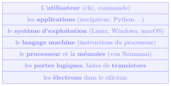
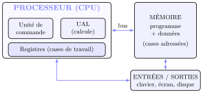
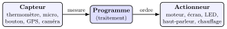
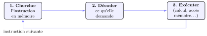
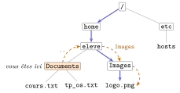

# Cours

<p class="sous-titre">Architecture des ordinateurs et systèmes d'exploitation</p>

<span id="chap-09" class="ancre"></span>

|  |  |
|:---|:---|
| **Programme (BO)** | *Modèle d’architecture de von Neumann* : unité de traitement (UAL, registres), unité de commande, mémoire, dispositifs d’entrée-sortie. *Dérouler* l’exécution d’une séquence d’instructions simples de type langage machine. Le *transistor*, brique de base ; quelques ordres de grandeur. *Systèmes d’exploitation* : rôles et fonctions ; utiliser les commandes de base en ligne de commande ; gérer les droits et permissions d’accès aux fichiers. *Périphériques d’entrée-sortie* : identifier le rôle des *capteurs* et des *actionneurs*. |
| **Prérequis** | le **binaire** et le codage de l’information (chapitre *Le binaire et l’écriture des nombres*) ; savoir ce qu’est un **programme** et une **variable**. |
| **Objectifs** | comprendre **comment** une machine exécute un programme ; nommer les **composants** d’un ordinateur et leur rôle ; **dérouler** un petit programme en langage machine ; savoir ce que fait un **système d’exploitation** ; **se déplacer et manipuler** des fichiers en ligne de commande sous Linux ; **lire et modifier** les droits d’un fichier. |

!!! remarque "Remarque — Le fil conducteur : un mille-feuille de couches"

    Un ordinateur qui affiche cette page fait, à la base, circuler des **électrons** dans des interrupteurs microscopiques. Comment passe-t-on de l’électron au clic de souris ? Grâce à un empilement de **couches d’abstraction** : chaque couche ne parle qu’à celle juste en dessous, et **cache sa complexité** à celle du dessus.

    { .tikz loading=lazy }

    Ce chapitre gravit ce mille-feuille : on part de la brique du bas (**le transistor**), on monte au **matériel** (von Neumann) puis au **langage machine**, et on termine par la couche qui donne le plus de confort : le **système d’exploitation**. Les points qui dépassent le programme portent le badge <span class="horsprog">au-delà du programme</span>.

## La brique de base : le transistor

Tout, dans un ordinateur, se ramène à deux états : le courant **passe** ou **ne passe pas**, qu’on note **1** et **0**. L’objet qui réalise physiquement ce choix est le **transistor**.

!!! definition "Définition 1 — Le transistor"

    Un **transistor** est un minuscule **interrupteur commandé électriquement** : une troisième borne (la « commande ») décide si le courant passe ou non entre les deux autres. C’est un interrupteur *sans pièce mécanique*, qui bascule des **milliards de fois par seconde**.

En combinant quelques transistors, on fabrique des **portes logiques** (ET, OU, NON) qui calculent sur les 0 et les 1 ; en combinant des portes, on fabrique des circuits qui **additionnent**, **comparent**, **mémorisent**… et de proche en proche, tout un **processeur**. Le transistor est donc la **brique élémentaire** à partir de laquelle tout est construit.

!!! remarque "Remarque — Quelques ordres de grandeur (capacité attendue)"

    Il faut avoir en tête des *ordres de grandeur*, pas des chiffres exacts :

    - un transistor mesure aujourd’hui quelques **nanomètres** (1 nm $=10^{-9}$ m, soit environ 10 atomes de large) ;

    - un processeur de smartphone ou d’ordinateur contient de l’ordre de **plusieurs milliards** de transistors ($10^{10}$) ;

    - il exécute quelques **milliards d’opérations par seconde** : sa **fréquence** est de l’ordre du **gigahertz** (1 GHz $=10^{9}$ battements par seconde).

!!! exemple "Exemple — La loi de Moore"

    En **1965**, Gordon **Moore** (cofondateur d’Intel) remarque que le nombre de transistors qu’on sait graver sur une puce **double chaque année** ; en **1975**, il révise ce rythme : un doublement **environ tous les deux ans**. Cette observation, la **loi de Moore**, s’est vérifiée pendant un demi-siècle : de **2 300** transistors sur le premier microprocesseur (l’Intel 4004, en 1971) à **plusieurs dizaines de milliards** aujourd’hui. Ce n’est pas une loi physique mais une **tendance**, qui **ralentit** désormais : on approche de la taille de l’atome, en dessous de laquelle un interrupteur n’a plus de sens.

## L’architecture de von Neumann

Comment organiser ces milliards d’interrupteurs pour **exécuter un programme** ? La réponse, proposée en **1945**, est le **modèle de von Neumann**. **Quasiment tous** les ordinateurs, du smartphone au super-calculateur, le suivent encore.

!!! definition "Définition 2 — Les quatre unités du modèle de von Neumann"

    Une machine de von Neumann est faite de quatre grands organes :

    - l’**unité de commande** : elle *lit* les instructions du programme, les *décode* et *ordonne* leur exécution (le « chef ») ;

    - l’**unité arithmétique et logique** (**UAL**) : elle *calcule* (additions, comparaisons, ET/OU logiques…) ;

    - la **mémoire** : elle *range* à la fois le **programme** et les **données**, dans des cases numérotées par une **adresse** ;

    - les **entrées-sorties** (E/S) : elles font *communiquer* la machine avec le monde (clavier, écran, disque, réseau…).

    L’unité de commande et l’UAL, réunies avec quelques cases de travail ultra-rapides, forment le **processeur** (ou **CPU**, *Central Processing Unit*).

{ .tikz loading=lazy }

Les organes sont reliés par des **bus** : des faisceaux de fils qui transportent les données, les adresses et les commandes.

!!! regle "Règle 1 — L’idée géniale : le programme est une donnée"

    Dans le modèle de von Neumann, le **programme est rangé dans la même mémoire que les données**, sous forme de nombres. Un ordinateur ne « connaît » donc pas ses programmes à l’avance : il en **lit** un depuis la mémoire, exactement comme il lirait un nombre. C’est ce qui rend une machine **universelle** : changer de programme, c’est juste changer les nombres en mémoire — pas recâbler la machine.

!!! remarque "Remarque — La hiérarchie des mémoires"

    Toutes les mémoires ne se valent pas. Plus une mémoire est **rapide**, plus elle est **petite et chère** :

    - les **registres**, dans le processeur : minuscules (quelques dizaines de cases) mais instantanés ;

    - la **mémoire vive** (**RAM**) : quelques giga-octets, rapide, mais **volatile** (tout s’efface à l’extinction) ;

    - le **disque** (SSD, disque dur) : énorme et **permanent**, mais bien plus lent.

    Éteindre l’ordinateur sans enregistrer perd le travail resté en RAM : voilà pourquoi « enregistrer », c’est **recopier de la RAM vers le disque**.

### Les entrées-sorties : capteurs et actionneurs (capacité attendue)

L’unité d’**entrées-sorties** est la porte par laquelle la machine **échange avec le monde physique**. On distingue deux rôles complémentaires.

!!! definition "Définition 3 — Capteur et actionneur"

    Un **capteur** *mesure* une grandeur du monde physique et la transforme en une valeur numérique *entrant* dans la machine (c’est une **entrée**). Un **actionneur** fait l’inverse : il reçoit un ordre numérique et *agit* sur le monde physique (c’est une **sortie**).

{ .tikz loading=lazy }

La chaîne capteur $\to$ programme $\to$ actionneur, au cœur de tout objet connecté.

!!! exemple "Exemple — Un thermostat"

    Un radiateur connecté *lit* la température de la pièce (**capteur**), la compare à la consigne (**programme**), puis *allume ou coupe* le chauffage (**actionneur**). De même, un smartphone regorge de capteurs (écran tactile, accéléromètre, luminosité, GPS) et d’actionneurs (haut-parleur, vibreur, dalle de l’écran).

!!! remarque "Remarque"

    Clavier, souris et écran sont les entrées-sorties les plus familières ; mais dès qu’un programme pilote un **objet** (robot, domotique, voiture), c’est toujours la même boucle : **capter** le monde, **décider**, **agir**. On y reviendra avec les *objets connectés*.

<span id="cours-09-1" class="ancre"></span>

<span class="afaire">▶ Exercices d'application :</span> exercices **[1](exercices.md#ex-09-1) à [6](exercices.md#ex-09-6)** (transistor, von Neumann, mémoires, capteurs/actionneurs)

## Le processeur au travail : le langage machine

### Le cycle d’exécution

Le processeur ne fait qu’**une** chose, mais des milliards de fois par seconde : répéter le **cycle** suivant.

{ .tikz loading=lazy }

À chaque tour, l’unité de commande utilise un registre spécial, le **compteur de programme** (ou *compteur ordinal*), qui contient l’**adresse de la prochaine instruction**. Normalement il avance d’un cran à chaque cycle ; une instruction de **saut** peut le forcer à une autre adresse — c’est ainsi qu’on réalise les **tests** et les **boucles**.

### Langage machine et assembleur

!!! definition "Définition 4 — Langage machine, assembleur"

    Le processeur n’obéit qu’à un jeu réduit d’instructions très simples (charger une case, additionner, comparer, sauter…), codées en **binaire** : c’est le **langage machine**. Illisible pour un humain, on l’écrit avec des **abréviations** : c’est l’**assembleur**. Une instruction assembleur $=$ une instruction machine, juste plus lisible.

!!! remarque "Remarque — La grande pyramide des langages"

    Notre `a = b + c` en Python ne « tourne » pas tel quel : un autre programme le **traduit** en une suite d’instructions machine. Plus on descend, plus c’est proche de la machine et loin de l’humain : $$\text{Python (très lisible)}\ \longrightarrow\ \text{assembleur}\ \longrightarrow\ \text{langage machine (des 0 et des 1)}.$$ C’est encore le mille-feuille : chaque niveau cache la complexité du niveau du dessous.

### Une machine-modèle : le *Little Man Computer*

Pour *dérouler* un vrai programme machine sans se noyer, on utilise une machine-modèle classique, le **Little Man Computer** (LMC). Elle est **von Neumann** en miniature :

- une **mémoire** de 100 cases numérotées de `00` à `99` (qui contiennent **indistinctement** programme *et* données) ;

- un seul registre de calcul, l’**accumulateur** (noté **ACC**) ;

- un **compteur de programme** qui pointe la prochaine instruction.

| **Instr.** | **Effet** | **En français** |
|:--:|:---|:---|
| `INP` | lit une entrée dans ACC | « demande un nombre » |
| `OUT` | affiche ACC | « affiche le résultat » |
| `LDA n` | ACC $\leftarrow$ contenu de la case `n` | « charge » (*LoaD*) |
| `STA n` | case `n` $\leftarrow$ ACC | « range » (*STore*) |
| `ADD n` | ACC $\leftarrow$ ACC $+$ contenu de la case `n` | « ajoute » |
| `SUB n` | ACC $\leftarrow$ ACC $-$ contenu de la case `n` | « soustrais » |
| `BRA n` | saute à l’instruction en case `n` | saut *toujours* |
| `BRZ n` | saute à `n` *si* ACC $=0$ | saut *si zéro* |
| `BRP n` | saute à `n` *si* ACC $\geq 0$ | saut *si positif* |
| `HLT` | arrête la machine | stop |
| `DAT` | réserve une case pour une donnée | déclare une variable |

!!! exemple "Exemple — Dérouler un programme (capacité attendue)"

    Voici un programme LMC qui lit deux nombres et affiche leur **somme**. À gauche l’**adresse** de la case, à droite l’instruction qui y est rangée. `a` et `b` sont des étiquettes désignant les cases de données `08` et `09`.

    ```console
    00   INP        « lire le 1er nombre »
    01   STA a      « le ranger dans a »
    02   INP        « lire le 2e nombre »
    03   STA b      « le ranger dans b »
    04   LDA a      « ACC <- a »
    05   ADD b      « ACC <- a + b »
    06   OUT        « afficher »
    07   HLT
    08   a  DAT
    09   b  DAT
    ```

    **Déroulé pour les entrées 5 puis 3** (on suit l’accumulateur et les cases) :

    | **Adr.** | **Instr.** | **ACC** | `a` | `b` |
    |:--------:|:----------:|:-------:|:---:|:---:|
    |    00    |    INP     |    5    |  –  |  –  |
    |    01    |   STA a    |    5    |  5  |  –  |
    |    02    |    INP     |    3    |  5  |  –  |
    |    03    |   STA b    |    3    |  5  |  3  |
    |    04    |   LDA a    |    5    |  5  |  3  |
    |    05    |   ADD b    |    8    |  5  |  3  |
    |    06    |    OUT     |    8    |  5  |  3  |

    La sortie est **8**. *Dérouler*, c’est exactement cela : suivre ligne à ligne l’état de l’accumulateur et des cases.

!!! remarque "Remarque — Sur machine"

    Des **simulateurs en ligne**, comme `peterhigginson.co.uk/lmc/`, exécutent ce processeur pas à pas dans le navigateur : on **voit** l’accumulateur, le compteur de programme et les cases changer. Écrire et tester ses propres programmes LMC (tests, boucles, multiplication…) est l’objet de la partie A du **TP** proposé en fin de chapitre.

<span id="cours-09-7" class="ancre"></span>

<span class="afaire">▶ Exercices d'application :</span> exercices **[7](exercices.md#ex-09-7) à [11](exercices.md#ex-09-11)** (le langage machine, le LMC)

## Le système d’exploitation : le chef d’orchestre

Écrire chaque programme en langage machine, en gérant soi-même la mémoire, le disque et l’écran, serait un cauchemar. Une couche s’en charge à notre place : le **système d’exploitation**.

!!! definition "Définition 5 — Système d’exploitation (OS)"

    Un **système d’exploitation** (*Operating System*, OS) est l’ensemble de programmes qui **gèrent le matériel** et le **mettent à disposition** des applications et de l’utilisateur. Il joue les **intermédiaires** entre le matériel (compliqué, varié) et les logiciels (qui veulent juste « lire un fichier » ou « afficher une fenêtre »).

!!! regle "Règle 2 — Les grandes fonctions d’un OS"

    - **gérer le processeur** : décider quel programme s’exécute, et quand (plusieurs semblent tourner « en même temps ») ;

    - **gérer la mémoire** : attribuer à chaque programme sa part de RAM, empêcher qu’ils s’écrasent l’un l’autre ;

    - **gérer les fichiers** : organiser le disque en dossiers et fichiers ;

    - **gérer les périphériques** : parler au clavier, à l’écran, à l’imprimante, au réseau, via des *pilotes* ;

    - **gérer les utilisateurs** : comptes, mots de passe, **droits d’accès**.

    Toujours le même mot-clé : **abstraction**. L’OS offre des actions simples (« ouvrir un fichier ») et cache la complexité du matériel dessous.

!!! remarque "Remarque — Les grandes familles d’aujourd’hui"

    Trois lignées se partagent le monde : **Windows** (Microsoft), **macOS** (Apple) et surtout la famille **UNIX/Linux**. Cette dernière, **invisible** au grand public, est pourtant la plus répandue : elle fait tourner l’immense majorité des **serveurs** du Web, la plupart des **smartphones** (Android est bâti sur un noyau Linux) et les objets connectés. Windows et macOS sont des logiciels **propriétaires** (code source fermé) ; Linux est **libre** : chacun peut l’étudier, le modifier et le partager. *Attention* : « libre » ne veut pas dire « gratuit » — l’anglais *free* entretient la confusion.

!!! remarque "Remarque — En Terminale"

    Le chapitre *Processus et systèmes d’exploitation* montre comment l’OS partage le processeur entre tous les programmes en cours d’exécution (les **processus**) : états d’un processus, ordonnancement, blocages.

<span id="cours-09-12" class="ancre"></span>

<span class="afaire">▶ Exercices d'application :</span> exercices **[12](exercices.md#ex-09-12) à [14](exercices.md#ex-09-14)** (le système d’exploitation)

## Parler à l’OS en Linux : la ligne de commande

L’interface graphique (fenêtres, souris) est confortable, mais la **ligne de commande** (le **terminal**) reste indispensable : plus rapide, automatisable, et incontournable sur les serveurs (souvent sans écran). On travaille ici sous **Linux** : pour essayer les commandes, il suffit d’un terminal Linux en ligne, comme **JSLinux** (`bellard.org/jslinux`), déjà utilisé dans l’activité de découverte (on y est l’utilisateur `root`, de répertoire personnel `/root`).

!!! remarque "Remarque — L’invite de commande"

    Le terminal affiche une **invite** qui rappelle qui vous êtes et où vous êtes, puis attend votre commande :

    ```console
    |eleve@pc-nsi|:|~/Documents|$ |ls|
    ```

    Ici l’utilisateur est `eleve`, la machine `pc-nsi`, et le répertoire courant est `~/Documents`. Le **tilde** `~` désigne votre **répertoire personnel** (`/home/eleve`).

### L’arborescence des fichiers

Sous Linux, les fichiers sont organisés en **arbre**, dont la base est la **racine**, notée `/`.

```text
/                          « la racine »
|-- home/
|   |-- eleve/             « votre repertoire personnel  (~) »
|       |-- Documents/
|       |   |-- cours.txt
|       |   |-- tp_os.txt
|       |-- Images/
|           |-- logo.png
|-- etc/
    |-- hosts
```

!!! definition "Définition 6 — Chemin absolu, chemin relatif"

    Un **chemin** désigne l’emplacement d’un fichier.

    - un chemin **absolu** part de la racine et commence donc par `/` : `/home/eleve/Documents/cours.txt` ;

    - un chemin **relatif** part du **répertoire courant** et ne commence *pas* par `/`.

    Deux raccourcis universels : `.` désigne le répertoire **courant**, et `..` le répertoire **parent** (un cran au-dessus).

!!! exemple "Exemple — Se repérer"

    Depuis `/home/eleve/Documents`, pour atteindre `logo.png` :

    - chemin absolu : `/home/eleve/Images/logo.png` (**trait plein** : on part de la racine) ;

    - chemin relatif : `../Images/logo.png` (**tirets** : on remonte d’un cran avec `..`, puis on descend dans `Images`).

    { .tikz loading=lazy }

### Les commandes de base (capacité attendue)

| **Commande** | **Rôle**                               | **Exemple**       |
|:-------------|:---------------------------------------|:------------------|
| `pwd`        | afficher le répertoire courant         | `pwd`             |
| `ls`         | lister le contenu d’un répertoire      | `ls Documents`    |
| `ls -l`      | lister en *détail* (droits, taille…)   | `ls -l`           |
| `cd`         | changer de répertoire                  | `cd ../Images`    |
| `mkdir`      | créer un répertoire                    | `mkdir Projets`   |
| `touch`      | créer un fichier vide                  | `touch note.txt`  |
| `cat`        | afficher le contenu d’un fichier       | `cat cours.txt`   |
| `cp`         | copier un fichier                      | `cp a.txt sauve/` |
| `mv`         | déplacer ou renommer                   | `mv a.txt b.txt`  |
| `rm`         | supprimer un fichier                   | `rm note.txt`     |
| `rm -r`      | supprimer un répertoire et son contenu | `rm -r Projets`   |
| `man`        | afficher le manuel d’une commande      | `man ls`          |

Ces commandes se combinent : par exemple, depuis `~/Documents`, `mkdir archives` puis `cp cours.txt archives/` rangent une copie de `cours.txt` dans un nouveau dossier `archives`. Les manipulations (construire une arborescence, copier, déplacer, supprimer, tester les droits avec deux utilisateurs) se font dans la partie B du **TP** proposé en fin de chapitre.

!!! remarque "Remarque — Deux réflexes de survie"

    **(1) `rm` ne pardonne pas** : il supprime **définitivement**, sans corbeille. Un `rm -r` lancé au mauvais endroit peut effacer tout un dossier. On réfléchit avant de valider (option `rm -i` pour demander confirmation).  
    **(2) Linux est sensible à la casse** : `Documents` et `documents` sont **deux** répertoires différents. La touche **Tab** complète automatiquement les noms : on l’utilise sans modération, elle évite les fautes de frappe.

<span id="cours-09-15" class="ancre"></span>

<span class="afaire">▶ Exercices d'application :</span> exercices **[15](exercices.md#ex-09-15) à [19](exercices.md#ex-09-19)** (la ligne de commande Linux)

## Droits et permissions

Linux est **multi-utilisateur** : plusieurs comptes partagent la machine, chacun avec ses fichiers. Il faut donc contrôler **qui** a le droit de faire **quoi**. Un compte particulier, l’**administrateur** (`root`), a **tous** les droits.

!!! regle "Règle 3 — Trois droits, trois catégories"

    Chaque fichier ou répertoire porte **trois droits** : $$\texttt{r}=\text{lecture (\emph{read})},\quad \texttt{w}=\text{écriture (\emph{write})},\quad \texttt{x}=\text{exécution (\emph{execute})},$$ accordés séparément à **trois catégories** d’utilisateurs : $$\texttt{u}=\text{le propriétaire (\emph{user})},\quad \texttt{g}=\text{le groupe},\quad \texttt{o}=\text{les autres (\emph{others})}.$$

!!! exemple "Exemple — Lire une ligne de ls -l"

    ```console
    |eleve@pc-nsi|:|~|$ |ls -l|
    -rw-r--r--  1 eleve  eleve   58  8 sep 09:12 cours.txt
    drwxr-xr-x  2 eleve  eleve 4096  8 sep 09:14 Projets
    ```

    Décryptons la première chaîne `-rw-r--r--`, lue **par groupes de trois** après le premier caractère :

    |   **type**    | **propriétaire (u)** | **groupe (g)** | **autres (o)** |
    |:-------------:|:--------------------:|:--------------:|:--------------:|
    | `-` (fichier) |        `rw-`         |     `r--`      |     `r--`      |

    *Traduction* : c’est un fichier ; le propriétaire peut le **lire et écrire** (`rw-`), le groupe et les autres peuvent seulement le **lire** (`r--`). Le `d` initial de la 2<sup>e</sup> ligne indique un **répertoire** ; pour un dossier, `x` signifie « on peut le **traverser** ».

!!! regle "Règle 4 — Modifier les droits : chmod"

    La commande `chmod` change les permissions, avec la grammaire `chmod [ugoa][+-=][rwx] fichier` :

    ```console
    |chmod| o-r cours.txt     « retire aux autres le droit de lecture »
    |chmod| g+w cours.txt     « donne au groupe le droit d'ecriture »
    |chmod| u+x script.sh     « rend le fichier executable par son proprietaire »
    ```

    (`a` $=$ « tout le monde » $=$ `u`, `g` et `o` à la fois ; `=` réinitialise.)

!!! remarque "Remarque — Pourquoi c’est un enjeu de sécurité"

    Les droits ne sont pas un détail d’administration : ils **protègent** vos données des autres comptes, et limitent les dégâts qu’un programme malveillant peut causer. Un fichier de mots de passe lisible par « les autres », c’est une fuite ; un fichier téléchargé rendu `x` sans réfléchir, c’est un risque. `root`, qui a tous les droits, est aussi le compte le plus dangereux : on ne l’utilise que lorsque c’est nécessaire.

<span id="cours-09-20" class="ancre"></span>

<span class="afaire">▶ Exercices d'application :</span> exercices **[20](exercices.md#ex-09-20) à [22](exercices.md#ex-09-22)** (droits et permissions)

## Un peu d’histoire

!!! remarque "Remarque — De l’ampoule au smartphone : la grande accélération"

    **1945** — Dans un rapport resté célèbre (le *First Draft of a Report on the EDVAC*), le mathématicien **John von Neumann** (1903–1957) décrit une machine où **programme et données partagent la même mémoire**. L’idée n’est pas de lui seul : elle doit beaucoup à **Alan Turing** (sa « machine universelle » de 1936) et aux ingénieurs **Eckert** et **Mauchly**, bâtisseurs de l’ENIAC. Mais c’est ce rapport qui diffuse le modèle — au point qu’il porte, un peu injustement, son seul nom.  
    **1947** — Aux **Bell Labs**, **Bardeen**, **Brattain** et **Shockley** inventent le **transistor** (prix Nobel 1956). Fini les tubes à vide fragiles et brûlants des premiers ordinateurs — l’**ENIAC** (1945), premier grand calculateur électronique, en alignait près de $18\,000$ dans une salle entière, pour $30$ tonnes — : la brique moderne est née.

    \*(image manquante : 09_hist_eniac)\*  
    L’ENIAC et ses armoires de tubes à vide

    **1965** — **Gordon Moore** énonce sa loi. La miniaturisation s’emballe : l’Intel 4004 (1971) tient 2 300 transistors ; une puce actuelle en aligne des dizaines de milliards.  
    **1969** — Aux Bell Labs encore, **Ken Thompson** et **Dennis Ritchie** créent **UNIX**, un système élégant et portable qui inspirera presque tous les suivants (et donnera naissance au langage C).  
    **1991** — Un étudiant finlandais, **Linus Torvalds**, écrit « pour le plaisir » un noyau libre inspiré d’UNIX : **Linux**. Trois décennies plus tard, ce projet d’étudiant fait tourner le Web, Android et les super-calculateurs. *Le mille-feuille de couches sur lequel vous lisez cette page a mis moins d’un siècle à se construire.*

!!! remarque "Remarque — Liens avec d’autres chapitres"

    Les 0 et les 1 du chapitre **Le binaire et l’écriture des nombres** prennent ici corps : ce sont les états des **transistors**, et un programme en langage machine n’est qu’une suite de nombres rangés en mémoire. Les sauts `BRZ` et `BRP` du *Little Man Computer* montrent comment se réalisent, tout en bas, les `if` et les `while` du chapitre **Les bases de la programmation Python**, et c’est la traduction vers ce langage machine qui distingue langages **compilés** et **interprétés** (chapitre **Spécifier et mettre au point ses programmes**). Les serveurs du chapitre suivant, **Le Web : réseaux et interactions homme-machine**, seront le plus souvent des machines Linux, administrées en ligne de commande. En Terminale, **Processus et systèmes d’exploitation** détaille le partage du processeur, **Systèmes sur puce** réunit processeur, mémoire et entrées-sorties sur une seule puce, et l’arborescence des fichiers devient un exemple d’**arbre**.

## Bilan — la carte mémoire

| **Notion** | **À retenir** |
|:---|:---|
| Transistor | interrupteur commandé $\to$ 0/1 ; brique de toutes les portes logiques |
| Ordres de grandeur | transistor $\sim$ nm ; milliards par puce ; fréquence $\sim$ GHz ; loi de Moore |
| von Neumann | unité de commande $+$ UAL ($=$ CPU) $+$ mémoire $+$ entrées-sorties |
| Idée clé | **programme et données dans la même mémoire** $\to$ machine universelle |
| Mémoires | registres $<$ RAM (volatile) $<$ disque (permanent) : vitesse $\downarrow$, taille $\uparrow$ |
| Cycle CPU | chercher $\to$ décoder $\to$ exécuter, en boucle |
| Langage machine | instructions simples en binaire ; assembleur $=$ version lisible |
| Dérouler | suivre l’accumulateur et les cases, instruction par instruction |
| Entrées-sorties | **capteur** $=$ mesure (entrée) ; **actionneur** $=$ agit (sortie) ; boucle capter/décider/agir |
| Système d’exploitation | gère processeur, mémoire, fichiers, périphériques, utilisateurs |
| Ligne de commande | `pwd ls cd mkdir touch cat cp mv rm man` ; `.` courant, `..` parent |
| Chemins | absolu (commence par `/`) vs relatif (part du répertoire courant) |
| Droits | `rwx` pour `u`/`g`/`o` ; lire `ls -l` ; modifier avec `chmod` |

## Erreurs fréquentes

- **Confondre mémoire vive et disque.** La RAM est *volatile* : ce qui n’est pas enregistré sur le disque est perdu à l’extinction.

- **Croire que le processeur « comprend » Python.** Il n’exécute que du *langage machine* ; l’interpréteur Python traduit le programme, au fur et à mesure, en instructions machine.

- **Oublier le `/` initial** d’un chemin absolu, ou en mettre un à un chemin relatif.

- **Se tromper de casse** : `Documents` $\neq$ `documents` sous Linux.

- **Lancer `rm -r` sans réfléchir** : suppression *définitive*, sans corbeille.

- **Lire les droits d’un bloc** : ils se lisent *par groupes de trois* (`u`, puis `g`, puis `o`).

## Savoir-faire à maîtriser

*À la fin du chapitre, je sais…*

- nommer les composants du modèle de von Neumann et leur rôle ;

- **distinguer** un **capteur** (entrée : mesure) d’un **actionneur** (sortie : action) et citer des exemples ;

- citer des ordres de grandeur (taille, nombre de transistors, fréquence) et énoncer la loi de Moore ;

- **dérouler** une petite séquence d’instructions en langage machine (accumulateur et cases) ;

- expliquer ce qu’est un système d’exploitation et citer ses grandes fonctions ;

- me **repérer** dans une arborescence (chemins absolu et relatif, `.` et `..`) ;

- **utiliser** les commandes de base en ligne de commande sous Linux ;

- **lire** une ligne de `ls -l` et **modifier** des droits avec `chmod`.
