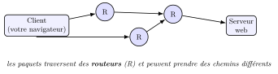
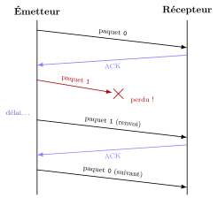
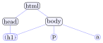
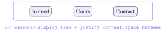

# Cours

<p class="sous-titre">Le Web : réseaux et interactions homme-machine</p>

<span id="chap-10" class="ancre"></span>

|  |  |
|:---|:---|
| **Programme (BO)** | *Interactions homme-machine sur le Web* : décomposer une **URL** ; distinguer ce qui relève du **client** et du **serveur** ; requêtes **HTTP** `GET`/`POST` ; réaliser et analyser une page **HTML**/**CSS** simple ; rôle de **HTML**, **CSS**, **JavaScript** ; **événements** et modification du document ; **formulaires**. *Réseaux* : notion de **protocole**, **adresse IP**, acheminement par **paquets** (routeurs, commutateurs), modèles **client-serveur** et **pair-à-pair**. |
| **Prérequis** | le chapitre *Architecture des ordinateurs et systèmes d’exploitation* (client/serveur $=$ deux machines en réseau) ; savoir écrire une fonction. |
| **Objectifs** | comprendre **ce qui se passe** entre un clic et l’affichage d’une page ; **lire une URL** ; savoir ce qu’est un **protocole**, une **adresse IP**, un **paquet** ; distinguer **client** et **serveur** ; écrire une page **HTML**/**CSS** et la rendre **interactive** en JavaScript ; envoyer des données par un **formulaire** (`GET`/`POST`). |

!!! remarque "Remarque — Le fil conducteur : le voyage d’un clic"

    Vous tapez une adresse, vous appuyez sur *Entrée*, et en une fraction de seconde une page s’affiche. Que s’est-il passé ? Un **voyage** : votre navigateur (le **client**) a trouvé la bonne machine sur le réseau (via son **adresse IP**), lui a envoyé une **requête HTTP** découpée en **paquets** qui ont traversé des **routeurs**, le **serveur** a renvoyé des fichiers **HTML**/**CSS**/**JavaScript**, et le navigateur les a **assemblés** en une page avec laquelle vous **interagissez**. Ce chapitre suit ce voyage, de bout en bout. Les points qui dépassent le programme portent le badge <span class="horsprog">au-delà du programme</span>.

## Internet et le Web : ne pas confondre

!!! definition "Définition 1 — Internet et le Web"

    **Internet** est le **réseau** mondial : l’*infrastructure* de câbles, fibres, antennes et machines qui relient les ordinateurs entre eux. **Le Web** (*World Wide Web*) est **l’un des services** qui circulent sur Internet : l’ensemble des pages reliées par des **liens hypertextes**, consultées avec un navigateur.

Internet transporte bien d’autres choses que le Web : le courriel, les messageries, les jeux en ligne, le streaming… *Confondre les deux, c’est confondre la route (Internet) et l’un des véhicules qui roulent dessus (le Web).*

## Le réseau : comment les machines se parlent

!!! definition "Définition 2 — Protocole"

    Un **protocole** est un **ensemble de règles** précises que deux machines respectent pour communiquer. Comme deux personnes doivent parler la même langue et respecter des tours de parole, deux ordinateurs doivent suivre le même protocole pour se comprendre.

!!! definition "Définition 3 — Adresse IP"

    Pour être jointe sur le réseau, chaque machine possède une **adresse IP** (*Internet Protocol*), son « numéro » unique. En version IPv4, c’est une suite de quatre nombres de 0 à 255, par exemple `193.51.208.14`. C’est l’équivalent d’une **adresse postale** : sans elle, impossible de livrer un message à la bonne machine.

!!! regle "Règle 1 — On voyage en paquets"

    Un message (une page, un mail, une vidéo) n’est pas envoyé d’un bloc : il est **découpé en petits morceaux**, les **paquets**. Chaque paquet porte l’**adresse IP** de départ et d’arrivée, voyage **indépendamment** à travers le réseau, et les paquets sont **réassemblés** à l’arrivée. Si un paquet se perd, il est **renvoyé**.

{ .tikz loading=lazy }

!!! definition "Définition 4 — Routeur et commutateur"

    Un **routeur** est une machine qui **aiguille** les paquets : il lit l’adresse IP de destination et choisit vers quel voisin renvoyer le paquet pour le rapprocher du but (comme un centre de tri postal). Un **commutateur** (*switch*) relie les machines d’un **même** réseau local (une salle, une maison). L’ensemble des routeurs interconnectés forme Internet.

!!! remarque "Remarque — Trouver l’adresse : le DNS"

    On ne retient pas des suites de chiffres : on tape `www.lycee.mc`, pas `193.51.208.14`. Le **DNS** (*Domain Name System*) est l’**annuaire** du réseau : il **traduit un nom** de domaine en **adresse IP**. Première étape du voyage : le navigateur demande au DNS « quelle est l’IP de `www.lycee.mc` ? ».

!!! definition "Définition 5 — Client-serveur et pair-à-pair"

    Deux façons d’organiser les échanges :

    - **client-serveur** : des machines **clientes** *demandent* des ressources à une machine **serveur** qui les *fournit* (le modèle du Web) ;

    - **pair-à-pair** (*peer-to-peer*, P2P) : chaque machine est à la fois cliente **et** serveur, et échange directement avec les autres, sans passer par un serveur central (partage de fichiers, certaines messageries).

### Ne perdre aucun paquet : l’accusé de réception et le bit alterné

Un paquet perdu est *renvoyé* : encore faut-il que l’émetteur **sache** qu’il est perdu. Le récepteur doit donc **répondre**.

!!! definition "Définition 6 — Accusé de réception"

    Après avoir reçu un paquet, le récepteur renvoie un petit message de confirmation, l’**accusé de réception** (*ACK*, de *acknowledgement*). Tant que l’émetteur n’a pas reçu l’accusé au bout d’un certain délai, il considère le paquet perdu et le **renvoie**.

Si c’est l’**accusé** qui se perd, l’émetteur renvoie un paquet déjà reçu : le récepteur doit pouvoir **reconnaître ce doublon**.

!!! regle "Règle 2 — Le protocole du bit alterné"

    On étiquette chaque paquet avec un **seul bit**, qui vaut alternativement `0`, `1`, `0`, `1`… L’accusé renvoie le numéro du paquet attendu ensuite. Les règles :

    - l’émetteur **n’envoie le paquet suivant** (avec le bit changé) que lorsqu’il a reçu l’accusé du paquet courant ;

    - sans accusé au bout du délai, il **renvoie le même paquet**, avec le **même** bit ;

    - si le récepteur reçoit un paquet portant le bit qu’il a **déjà** traité, c’est un **doublon** : il le **jette** mais renvoie quand même l’accusé.

    Un seul bit suffit à distinguer « le nouveau paquet » de « le même, renvoyé ».

{ .tikz loading=lazy }

Le paquet `1` est perdu ; faute d’accusé, l’émetteur le renvoie à l’identique. Le bit permet au récepteur de ne pas confondre un renvoi avec un nouveau paquet.

!!! remarque "Remarque"

    Ce mécanisme d’accusés et de renvois est au cœur du protocole **TCP**, qui garantit sur Internet qu’aucune donnée n’est perdue ni dupliquée ; le bit alterné en est la version la plus simple.

!!! remarque "Remarque — En Terminale"

    Le chapitre *Les réseaux et le routage* détaille comment les routeurs choisissent le chemin des paquets (protocoles RIP et OSPF) et comment on découpe les adresses IP en sous-réseaux.

<span id="cours-10-1" class="ancre"></span>

<span class="afaire">▶ Exercices d'application :</span> exercices **[1](exercices.md#ex-10-1) à [5](exercices.md#ex-10-5)** (réseaux : Internet/Web, paquets, bit alterné)

## Le modèle client-serveur et l’URL

Sur le Web, votre navigateur est un **client** : il demande des pages à des **serveurs web**, des machines allumées en permanence dont le rôle est de *servir* des ressources. Pour désigner la ressource voulue, on utilise une **URL**.

!!! definition "Définition 7 — URL — Uniform Resource Locator"

    Une URL est l’**adresse d’une ressource** sur le Web. On la décompose :

    { .tikz loading=lazy }

    - `https` : le **protocole** utilisé (ici la version *sécurisée* de HTTP) ;

    - `www.lycee.mc` : le **nom de domaine** du serveur (traduit en IP par le DNS) ;

    - `/nsi/cours.html` : le **chemin** de la ressource sur le serveur.

!!! remarque "Remarque — Reconnaître une page sécurisée (capacité attendue)"

    Quand l’URL commence par `https` (et non `http`), la communication est **chiffrée** : personne ne peut lire au passage ce qui circule. **Réflexe** : avant de saisir un mot de passe ou des coordonnées bancaires, **vérifier le `https`**. Le « s » veut dire *secure*. On étudiera le chiffrement en Terminale.

!!! remarque "Remarque — Le port au-delà du programme"

    L’adresse IP désigne la **machine** ; le **port** (un numéro) désigne le **service** visé sur cette machine. Le Web utilise par convention le port **80** en `http` et le port **443** en `https`. C’est pourquoi on ne les écrit presque jamais dans l’URL : ils sont **sous-entendus**.

## HTTP : la langue du Web

Une fois le serveur trouvé, client et serveur dialoguent selon le protocole **HTTP** (*HyperText Transfer Protocol*) : le client envoie une **requête**, le serveur renvoie une **réponse**.

!!! regle "Règle 3 — Requête et réponse HTTP"

    Une **requête** contient notamment une **méthode** et le chemin de la ressource :

    ```http
    GET /nsi/cours.html HTTP/1.1
    ```

    La **réponse** commence par un **code de statut**, suivi d’**en-têtes** (des métadonnées : type et taille du contenu, date…), puis d’une ligne vide et enfin du **corps** (la ressource elle-même) :

    ```http
    HTTP/1.1 200 OK
    Content-Type: text/html; charset=utf-8
    Content-Length: 1024
    ...
    <!doctype html> ...le code HTML de la page...
    ```

!!! definition "Définition 8 — Les deux méthodes à connaître : GET et POST"

    - `GET` : **demander** une ressource (le cas le plus courant : afficher une page). Les éventuels paramètres sont **visibles dans l’URL**.

    - `POST` : **envoyer** des données au serveur pour qu’il les traite (typiquement, les données d’un **formulaire**). Les données ne sont **pas** dans l’URL.

!!! remarque "Remarque — Quelques codes de statut"

    Le code résume ce qui s’est passé : **200** « OK, voici la ressource » ; **304** « pas modifiée, garde ta version en *cache* » (évite de re-télécharger un fichier inchangé) ; **404** « ressource introuvable » (la fameuse page d’erreur) ; **403** « accès interdit » ; **500** « erreur du serveur ». Les codes qui commencent par **2** sont des succès, par **3** des redirections ou du cache, par **4** des erreurs du client, par **5** des erreurs du serveur.

!!! regle "Règle 4 — Une page $=$ souvent des dizaines de requêtes"

    Afficher une page « simple » ne demande presque jamais **une seule** ressource. Le navigateur reçoit d’abord le **HTML**, le **lit**, et y découvre des références vers d’autres fichiers (feuilles `.css`, scripts `.js`, images, polices…) : pour **chacun** il envoie **une nouvelle requête HTTP**. Une page riche déclenche ainsi facilement **plusieurs dizaines** d’échanges requête/réponse avant d’être complète.

!!! remarque "Remarque — Observer les échanges : les outils de développement (capacité attendue)"

    Tous les navigateurs offrent des **outils de développement** (touche `F12`, onglet **Réseau**). On y voit **en direct**, pour chaque page, la **liste des requêtes**, leur **méthode** (`GET`…), leur **code de statut** (`200`, `304`, `404`…), leur **taille** et leur **temps** de chargement. C’est le meilleur moyen de *voir* concrètement le protocole HTTP à l’œuvre.

<span id="cours-10-6" class="ancre"></span>

<span class="afaire">▶ Exercices d'application :</span> exercices **[6](exercices.md#ex-10-6) à [9](exercices.md#ex-10-9)** (URL et HTTP)

## HTML : structurer la page

La ressource renvoyée est le plus souvent un fichier **HTML** (*HyperText Markup Language*). Ce n’est **pas** un langage de programmation : c’est un langage de **balisage** qui décrit la **structure** du contenu (titres, paragraphes, images, liens…).

!!! definition "Définition 9 — Balises"

    Le contenu est encadré par des **balises** : une balise **ouvrante** `<p>` et une balise **fermante** `</p>`. Certaines portent des **attributs**.

```html
<!doctype html>
<html lang="fr">
  <head>
    <meta charset="utf-8">
    <title>Ma page</title>
    <link rel="stylesheet" href="style.css">
  </head>
  <body>
    <h1>Bienvenue en NSI</h1>
    <p>Ceci est un <strong>paragraphe</strong> important.</p>
    <a href="https://eduscol.education.fr">Un lien hypertexte</a>
    
  </body>
</html>
```

- `<head>` : les informations *sur* la page (titre, encodage, feuille de style) ; `<body>` : le contenu *visible* ;

- `<h1>` un titre, `<p>` un paragraphe, `<strong>` du texte important, `` une image ;

- `<a href="...">` crée un **lien hypertexte** : c’est lui qui relie les pages entre elles et fait du Web une **toile**.

!!! remarque "Remarque — D’autres balises courantes"

    Au-delà de l’exemple : les **titres** `<h1>` à `<h6>` (du plus au moins important) ; les **listes** `<ul>` (à puces) ou `<ol>` (numérotée), dont chaque élément est un `<li>` ; `<br>` un retour à la ligne ; `<table>` un tableau ; et les **conteneurs** `<div>` (en bloc) et `<span>` (en ligne) qui **regroupent** des éléments pour les mettre en forme ou les manipuler. Un **commentaire**, ignoré par le navigateur, s’écrit `<!-- ... -->`.

!!! remarque "Remarque — Les balises « auto-fermantes »"

    Certaines balises n’entourent aucun contenu et n’ont **pas** de balise fermante : ``, `<br>`, `<meta>`, `<input>`, `<link>`. On écrit `` et jamais `…</img>`.

!!! definition "Définition 10 — Les attributs id et class"

    On peut « étiqueter » une balise pour la **retrouver** ensuite (en CSS ou en JavaScript) :

    - `id="menu"` : un identifiant **unique** dans la page (une seule balise peut le porter) ;

    - `class="bouton"` : une étiquette **partagée**, que plusieurs balises peuvent avoir en commun (pour les traiter ensemble).

!!! remarque "Remarque — Une page est un arbre : le DOM"

    Les balises s’**emboîtent** sans se croiser : le document forme un **arbre**, appelé **DOM** (*Document Object Model*). C’est cet arbre que le navigateur construit en mémoire, et que le JavaScript pourra modifier.

    { .tikz loading=lazy }

<span id="cours-10-10" class="ancre"></span>

<span class="afaire">▶ Exercices d'application :</span> exercices **[10](exercices.md#ex-10-10) à [13](exercices.md#ex-10-13)** (balises ; lire, corriger, créer du HTML)

## CSS : mettre en forme

Le **CSS** (*Cascading Style Sheets*) décrit la **présentation** : couleurs, tailles, polices, dispositions. **Principe fondamental : séparer le fond (HTML) de la forme (CSS).** Le même contenu peut ainsi changer d’apparence sans qu’on touche au HTML.

!!! regle "Règle 5 — Une règle CSS"

    Une règle vise un **sélecteur** (quelles balises) et lui applique des **propriétés**, chacune sous la forme `propriété: valeur;` :

    ```css
    h1      { color: darkblue; text-align: center; }   /* toutes les balises h1 */
    p       { font-size: 14px; line-height: 1.5; }     /* tous les paragraphes  */
    #menu   { background-color: gold; }        /* l'unique balise id="menu"     */
    .bouton { color: white; padding: 8px; }    /* toutes les balises class="bouton" */
    ```

!!! definition "Définition 11 — Les trois sélecteurs à connaître"

    - par **nom de balise** (`h1`, `p`) : vise *toutes* les balises de ce type ;

    - par **identifiant**, préfixe `#` (`#menu`) : vise l’*unique* balise `id="menu"` ;

    - par **classe**, préfixe `.` (`.bouton`) : vise *toutes* les balises `class="bouton"`.

!!! remarque "Remarque — Trois façons de brancher le CSS"

    Le plus propre : une **feuille externe** `style.css` reliée par `<link rel="stylesheet" href="style.css">` (réutilisable sur tout le site). On peut aussi écrire le CSS **dans** le `<head>`, entre `<style>…</style>`, ou **en ligne** sur une balise via l’attribut `style="…"` — à réserver aux petits ajustements.

!!! remarque "Remarque — Quelques propriétés utiles"

    `color` (couleur du texte), `background-color` (fond), `font-size`, `font-family`, `text-align` ; et pour l’espacement : `margin` (marge *extérieure*), `padding` (marge *intérieure*), `border` (bordure), `width`/`height` (dimensions). Les tailles s’expriment en `px` (pixels), `%` ou `em`.

!!! remarque "Remarque — Pourquoi « cascade » ? au-delà du programme"

    Plusieurs règles peuvent viser la même balise. En cas de **conflit**, la plus **spécifique** l’emporte (un `#id` bat une `.classe`, qui bat un nom de balise) ; à spécificité égale, la **dernière** écrite gagne. Les styles « ruissellent » ainsi du général vers le particulier — d’où le nom *Cascading Style Sheets*.

### Disposer les éléments : Flexbox

Par défaut, les blocs (`<div>`, `<p>`, `<li>`…) s’empilent **verticalement**, l’un sous l’autre. Pour les aligner **horizontalement** et les répartir proprement, on transforme leur **conteneur** en « boîte flexible » avec la propriété `display: flex`.

```css
.barre {
    display: flex;              /* les enfants se placent en ligne */
    gap: 10px;                  /* espace entre eux */
    justify-content: center;    /* repartition horizontale */
    align-items: center;        /* alignement vertical */
}
```

Appliquée à un bloc `<div class="barre">``…</div>`, cette règle aligne **tous ses enfants directs** sur une même ligne. `justify-content` règle la **répartition horizontale** (`center`, `space-between`, `flex-start`…), `align-items` l’**alignement vertical**, et `gap` l’espace entre les éléments. C’est l’outil standard pour construire une **barre de navigation** ou disposer des cartes côte à côte.

{ .tikz loading=lazy }

<span id="cours-10-14" class="ancre"></span>

<span class="afaire">▶ Exercices d'application :</span> exercices **[14](exercices.md#ex-10-14) à [16](exercices.md#ex-10-16)** (CSS : relier une feuille, sélecteurs `id`/`class`, aligner avec Flexbox)

## JavaScript : rendre la page interactive

HTML structure, CSS met en forme… mais tout cela est **figé**. Le **JavaScript** (JS) est un vrai **langage de programmation**, exécuté **dans le navigateur** (côté **client**), qui rend la page **vivante** : réagir à un clic, modifier le contenu, valider un formulaire…

!!! regle "Règle 6 — Les trois langages du Web"

    **HTML** $=$ le *fond* (structure) ; **CSS** $=$ la *forme* (présentation) ; **JavaScript** $=$ le *comportement* (interaction). Trois rôles distincts, une seule page.

!!! remarque "Remarque — Un peu de syntaxe JavaScript"

    On **déclare** une variable avec `let` (ou `const` si sa valeur ne change jamais) ; une **fonction** s’écrit `function nom() { …}` ; les instructions se terminent par `;` et un commentaire par `//`. C’est proche du Python, mais avec des **accolades** `{ }` à la place de l’indentation.

### Répondre à un événement

Un **événement** est quelque chose qui **se produit** dans la page, le plus souvent une action de l’utilisateur : un **clic** (`click`), le **survol** de la souris (`mouseover`), une **touche** du clavier (`keydown`), la **modification** d’un champ (`change`), l’**envoi** d’un formulaire (`submit`), le **chargement** de la page (`load`)… On y réagit en exécutant une fonction JavaScript.

```html
<p id="monPara">Voici une page qui ne fait pas grand-chose.</p>
<button onclick="changer()">Cliquer ici</button>
<script src="script.js"></script>
```

!!! remarque "Remarque — Deux manières de brancher un événement"

    Rapide : un **attribut** `on…` directement dans le HTML, comme `<button onclick="changer()">`. Plus propre (le comportement reste séparé de la structure) : depuis le JavaScript, avec `addEventListener`. Le bouton porte alors un identifiant, et plus d’attribut `onclick` :

    ```html
    <button id="monBouton">Cliquer ici</button>
    ```

    ```javascript
    let bouton = document.querySelector("#monBouton");
    bouton.addEventListener("click", changer);   // sans les parentheses
    ```

### Modifier le document (le DOM)

Dans `script.js`, on **sélectionne** un élément puis on le **modifie** :

```javascript
function changer() {
    let maBalise = document.querySelector("#monPara");
    maBalise.innerHTML = "Bravo ! Le contenu vient de changer.";
}
```

- `document.querySelector("#monPara")` retrouve dans le DOM la balise d’`id monPara` ;

- `.innerHTML = "..."` **remplace son contenu**. Au clic, le texte du paragraphe change — **sans recharger la page**.

!!! definition "Définition 12 — Sélectionner et modifier dans le DOM"

    **Sélectionner** un élément :

    - `document.getElementById("monPara")` : par son `id` ;

    - `document.querySelector("#monPara")` : par un *sélecteur CSS* (le premier qui correspond) ;

    - `document.querySelectorAll(".bouton")` : *tous* ceux qui correspondent.

    Puis le **modifier** :

    - `.textContent` ou `.innerHTML` : changer le **contenu** ;

    - `.style.color`, `.style.background`… : changer la **forme** ;

    - `.classList.add("actif")` / `.classList.remove("actif")` : ajouter/retirer une **classe** CSS ;

    - `.value` : lire (ou écrire) le **contenu d’un champ** de formulaire.

!!! exemple "Exemple — Réagir à une saisie"

    Une zone de texte, un bouton, et un paragraphe qui salue l’utilisateur :

    ```html
    <input type="text" id="nom">
    <button onclick="saluer()">Bonjour</button>
    <p id="message"></p>
    ```

    ```javascript
    function saluer() {
        let nom = document.querySelector("#nom").value;   // lire le champ
        document.querySelector("#message").textContent = "Bonjour " + nom + " !";
    }
    ```

    Rien n’est envoyé au serveur : tout se passe **dans le navigateur**, instantanément.

!!! remarque "Remarque — Côté client, côté serveur (capacité attendue)"

    Le **JavaScript** est le langage de l’interaction **côté client** : il s’exécute **sur votre machine**, **après** réception de la page, pour les réactions immédiates (afficher/masquer, vérifier qu’un champ n’est pas vide…). D’autres traitements se font **côté serveur**, sur la machine distante, dans un **autre langage** — par exemple **PHP**, ou Python : consulter une base de données, vérifier un mot de passe, générer une page personnalisée. *Savoir qui fait quoi* est essentiel : ce qui se passe côté client est visible et modifiable par l’utilisateur, donc jamais sûr pour des vérifications sensibles.

!!! remarque "Remarque — Faut-il apprendre PHP ? (mise au point)"

    Pour **l’interaction** dans la page, le programme s’en tient au **JavaScript** — il n’y a pas d’autre langage à connaître de ce côté. **PHP** n’est cité ici que comme *exemple* de langage **côté serveur**, pour bien opposer « ce que fait le client » et « ce que fait le serveur ». Le programme précise d’ailleurs qu’il ne s’agit **pas** de développer une expertise dans ces langages (PHP comme JavaScript) : on doit savoir *distinguer les rôles*, pas coder un serveur en PHP. C’est en Terminale, avec les **bases de données**, que le « côté serveur » sera approfondi.

### Assembler les trois langages : une page complète

Voici une page **autonome** qui réunit tout : la **structure** (HTML), la **mise en forme** avec Flexbox (CSS) et l’**interactivité** (JavaScript). L’utilisateur tape un article, clique sur *Ajouter*, et l’article s’ajoute à une liste — **sans jamais recharger la page**.

```html
<!doctype html>
<html lang="fr">
<head>
  <meta charset="utf-8">
  <title>Ma liste</title>
  <style>
    body      { font-family: sans-serif; margin: 20px; }
    .ligne    { display: flex; gap: 8px; }      /* champ + bouton en ligne */
    #liste li { color: darkblue; }
  </style>
</head>
<body>
  <h1>Ma liste de courses</h1>
  <div class="ligne">
    <input type="text" id="article" placeholder="Un article...">
    <button onclick="ajouter()">Ajouter</button>
  </div>
  <ul id="liste"></ul>

  <script>
    function ajouter() {
        let champ = document.querySelector("#article");
        let texte = champ.value;                // lire la saisie
        if (texte !== "") {                     // ignorer une saisie vide
            let liste = document.querySelector("#liste");
            liste.innerHTML += "<li>" + texte + "</li>";   // ajouter un <li>
            champ.value = "";                   // vider le champ
        }
    }
  </script>
</body>
</html>
```

- le `<style>` met en forme et **aligne** le champ et le bouton avec **Flexbox** ;

- au clic, `ajouter()` **lit** le champ (`.value`), **teste** qu’il n’est pas vide, **ajoute** un `<li>` à la liste, puis **vide** le champ ;

- les trois langages coopèrent, et tout se déroule **côté client**.

<span id="cours-10-17" class="ancre"></span>

<span class="afaire">▶ Exercices d'application :</span> exercices **[17](exercices.md#ex-10-17) à [21](exercices.md#ex-10-21)** (JavaScript ; client ou serveur)

## Les formulaires : envoyer des données

Jusqu’ici le client *recevait*. Un **formulaire** lui permet d’**envoyer** des données au serveur (identifiants, recherche, message…).

```html
<form action="/connexion" method="post">
    <label for="pseudo">Pseudo :</label>
    <input type="text" name="pseudo" id="pseudo">
    <input type="password" name="mdp">
    <button type="submit">Se connecter</button>
</form>
```

- `action` : l’**adresse** sur le serveur qui recevra les données ;

- `method` : **comment** les envoyer — `get` (données dans l’URL) ou `post` (données dans le corps de la requête) ;

- chaque `<input>` a un `name` : c’est l’**étiquette** sous laquelle sa valeur arrive au serveur.

!!! remarque "Remarque — Quelques types de champs"

    L’attribut `type` d’un `<input>` choisit la nature du champ : `text` (texte visible), `password` (masqué), `radio` (un seul choix parmi plusieurs), `checkbox` (cases à cocher, plusieurs choix possibles), `email`, `number`, `date`… Un `<input type="submit">` (ou un `<button type="submit">`) **envoie** le formulaire vers l’`action`.

!!! regle "Règle 7 — GET ou POST pour un formulaire ?"

    - `GET` : les données apparaissent dans l’URL après un `?`, sous la forme `clef=valeur` séparées par `&` (`.../recherche?q=chat&tri=date`). Pratique pour une **recherche** qu’on peut partager ou mettre en favori ; à **éviter** pour un mot de passe (visible et enregistré dans l’historique).

    - `POST` : les données ne sont pas dans l’URL. À utiliser dès qu’on **envoie** quelque chose de sensible ou qui **modifie** l’état du serveur (connexion, publication…).

!!! remarque "Remarque — Le web dynamique au-delà du programme"

    Quand le serveur **fabrique** la page en fonction de la requête (heure, utilisateur connecté, résultats d’une recherche), on parle de **web dynamique**. Un programme s’exécute alors **côté serveur**, dans un langage comme PHP, Python (*Flask*), etc., pour **générer** le HTML renvoyé. C’est ce qui distingue un site vivant d’un simple fichier figé.

<span id="cours-10-22" class="ancre"></span>

<span class="afaire">▶ Exercices d'application :</span> exercices **[22](exercices.md#ex-10-22) et [23](exercices.md#ex-10-23)** (lire et écrire un formulaire)

## Un peu d’histoire

!!! remarque "Remarque — D’ARPANET au CERN"

    **Fin des années 1960**, la recherche militaire américaine crée **ARPANET**, l’ancêtre d’Internet. Dans les années 1970, **Vinton Cerf** et **Robert Kahn** conçoivent **TCP/IP**, la famille de protocoles qui permet à des réseaux différents de communiquer : Internet devient possible. En **1983** apparaît le **DNS**, l’annuaire des noms.  
    **1989–1991**, au **CERN** (le laboratoire européen de physique, près de Genève), **Tim Berners-Lee** invente le **World Wide Web** pour que les chercheurs partagent leurs documents : il crée d’un coup le **HTML**, les **URL** et le protocole **HTTP**. Le premier site est en ligne en 1991. En **1993**, le navigateur *Mosaic* popularise le Web auprès du grand public, et en 1995 **Brendan Eich** écrit **JavaScript** en dix jours. *Trente ans plus tard, ce système imaginé pour quelques physiciens relie la planète entière.*

!!! remarque "Remarque — Liens avec d’autres chapitres"

    Les adresses IP (quatre **octets**) et `utf-8` viennent du chapitre **Le binaire et l’écriture des nombres**, et le DNS agit comme un **dictionnaire** (chapitre **Les types construits**) ; en Terminale, le DOM devient un **arbre** et le `https` s’explique en **Cryptographie**.

## Bilan — la carte mémoire

| **Notion** | **À retenir** |
|:---|:---|
| Internet vs Web | Internet $=$ le réseau ; le Web $=$ un service (pages $+$ liens) dessus |
| Protocole | ensemble de règles pour communiquer (ex. HTTP, TCP/IP) |
| Adresse IP | « numéro » unique d’une machine (ex. `193.51.208.14`) |
| Paquets | message découpé, routé indépendamment, réassemblé à l’arrivée |
| Routeur | aiguille les paquets vers la destination ; le DNS traduit nom $\to$ IP |
| Client / serveur | le client *demande*, le serveur *fournit* ; P2P $=$ chacun les deux |
| Fiabilité (bit alterné) | **accusé de réception** $+$ renvoi si perte ; un bit `0`/`1` évite les **doublons** |
| URL | `protocole://domaine/chemin` ; `https` $=$ sécurisé (chiffré) |
| HTTP | requête (`GET`/`POST`) $\to$ réponse (code `200`, `304`, `404`…) |
| Une page | souvent des *dizaines* de requêtes (HTML, CSS, JS, images…) |
| Outils dev | `F12`, onglet *Réseau* : voir les requêtes, méthodes, codes, tailles |
| HTML | *fond* : structure en balises ; `id` (unique) / `class` (partagée) ; arbre (DOM) |
| CSS | *forme* : sélecteurs `balise` / `#id` / `.classe` $+$ `{ propriété: valeur; }` |
| Flexbox | `display:flex` sur le *conteneur* : aligne les enfants en ligne (`gap`, `justify-content`) |
| JavaScript | *comportement* : événement (`click`…) $\to$ `querySelector` $+$ `.value`/DOM, côté client |
| Formulaire | `<form action method>` ; `POST` pour envoyer/du sensible |

## Erreurs fréquentes

- **Confondre Internet et le Web** : l’un est le réseau, l’autre un service qui roule dessus.

- **Croire que HTML est un langage de programmation** : c’est un langage de *balisage* (structure).

- **Oublier de fermer une balise** (`</p>`) ou les emboîter en les croisant.

- **Mélanger les rôles** HTML / CSS / JS (fond / forme / comportement).

- **Confondre `id` et `class`** : un `id` est *unique* dans la page, une `class` est *partagée* ; en CSS, `#` pour l’id, `.` pour la classe.

- **Envoyer un mot de passe en `GET`** : il finit visible dans l’URL et l’historique.

- **Croire qu’une vérification côté client (JS) est sûre** : l’utilisateur peut la contourner ; le serveur doit re-vérifier.

- **Croire qu’afficher une page ne demande qu’une seule requête** : il en faut souvent des dizaines (CSS, JS, images, polices…).

- **Mettre `display:flex` sur un enfant** au lieu du **conteneur** : c’est le conteneur qui devient flexible, ses enfants s’alignent.

## Savoir-faire à maîtriser

*À la fin du chapitre, je sais…*

- expliquer la différence entre Internet et le Web, et ce qu’est un protocole ;

- dire à quoi servent une adresse IP, un paquet, un routeur, le DNS ;

- **dérouler** le protocole du **bit alterné** (accusé de réception, renvoi, doublon) sur un scénario de perte ;

- **décomposer** une URL et reconnaître une page sécurisée ;

- distinguer ce qui relève du **client** et du **serveur**, et `GET` de `POST` ;

- **observer** les requêtes HTTP échangées avec les **outils de développement** (`F12`, onglet Réseau) ;

- écrire et analyser une page **HTML** simple (balises, `id`/`class`) et sa mise en forme **CSS** (sélecteurs `balise`, `#id`, `.classe`) ;

- **disposer** des éléments côte à côte avec **Flexbox** (`display:flex`) ;

- rendre une page interactive : réagir à un **événement**, **sélectionner** un élément (`querySelector`), **lire un champ** (`.value`) et **modifier le DOM** ;

- assembler HTML $+$ CSS $+$ JavaScript en une **petite page interactive complète** ;

- écrire un **formulaire** et choisir sa méthode d’envoi.
