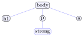

# Exercices

<p class="sous-titre">Le Web : réseaux et interactions homme-machine</p>

!!! consignes "Mode d’emploi"

    - Niveau : ★ échauffement, ★★ classique (niveau bac), ★★★ défi ; les *coups de pouce* et les *corrigés* se déplient sous chaque exercice.

    - <span class="run" title="À programmer et tester sur machine">▶</span> *À taper et tester* dans un navigateur (fichier `.html` ouvert localement, ou un éditeur en ligne).

    - Rôles à ne pas confondre : **HTML** $=$ le fond (structure) ; **CSS** $=$ la forme ; **JavaScript** $=$ le comportement.

    - Usage de l’IA, indiqué sur chaque exercice : <span class="ia ia-rouge" title="Sans IA : le but est l'automatisme lui-même"></span> aucune ; <span class="ia ia-orange" title="IA en appui : déboguer, reformuler, vérifier ; la réponse finale est la vôtre"></span> en appui (déboguer, reformuler, vérifier ; la réponse finale est écrite et comprise par vous) ; <span class="ia ia-vert" title="IA intégrée : l'exercice s'appuie sur une réponse d'IA"></span> l’exercice s’appuie sur une réponse d’IA. Voir la [charte d’usage de l’IA](../charte.md).

### Réseaux : comment les machines se parlent

### <span class="stars" title="Niveau 1 sur 3">★</span> <span class="exo-num">Exercice 1</span> — Internet ou Web ? <span class="ia ia-rouge" title="Sans IA : le but est l'automatisme lui-même"></span> { #ex-10-1 }

Pour chaque phrase, dire si elle concerne **Internet** (le réseau) ou **le Web** (le service).

1.  consulter une page de cours avec des liens hypertextes ;

2.  envoyer un courriel ;

3.  l’ensemble des câbles, fibres et routeurs qui relient les machines ;

4.  cliquer d’article en article sur une encyclopédie en ligne.

??? corrige "Corrigé"

    !!! remarque "Remarque"

        On donne **une** version simple ; d’autres écritures sont possibles.

    a\) **Web** ; b) **Internet** (le courriel est un service d’Internet, pas du Web) ; c) **Internet** ; d) **Web**.

### <span class="stars" title="Niveau 1 sur 3">★</span> <span class="exo-num">Exercice 2</span> — Le bon mot <span class="ia ia-rouge" title="Sans IA : le but est l'automatisme lui-même"></span> { #ex-10-2 }

Compléter avec : *protocole* / *adresse IP* / *paquet* / *routeur* / *DNS*.

1.  Le … traduit un nom de domaine en ….

2.  Un message est découpé en … avant de circuler.

3.  Un … aiguille ces morceaux vers leur destination.

4.  HTTP est un … : un ensemble de règles de communication.

??? corrige "Corrigé"

    a\) le **DNS** traduit un nom de domaine en **adresse IP** ; b) **paquets** ; c) **routeur** ; d) **protocole**.

### <span class="stars" title="Niveau 1 sur 3">★</span> <span class="exo-num">Exercice 3</span> — Client-serveur ou pair-à-pair ? <span class="ia ia-rouge" title="Sans IA : le but est l'automatisme lui-même"></span> { #ex-10-3 }

1.  Décrire, avec les mots *demande* et *fournit*, le modèle client-serveur.

2.  Dans un logiciel de partage de fichiers en *pair-à-pair*, quel(s) rôle(s) joue votre machine ?

3.  Quand vous consultez un site web, votre ordinateur est-il plutôt client ou serveur ? Pourquoi ?

??? corrige "Corrigé"

    **a)** Des machines **clientes** *demandent* des ressources ; une machine **serveur** les *fournit*. **b)** En pair-à-pair, votre machine est **à la fois cliente et serveur** (elle reçoit et fournit). **c)** **Client** : elle demande des pages aux serveurs web et ne fournit rien en retour.

### <span class="stars" title="Niveau 2 sur 3">★★</span> <span class="exo-num">Exercice 4</span> — Le voyage d’un paquet <span class="ia ia-orange" title="IA en appui : déboguer, reformuler, vérifier ; la réponse finale est la vôtre"></span> { #ex-10-4 }

Un paquet part de votre machine (IP `192.168.1.10`) vers un serveur (IP `193.51.208.14`).

1.  Quelles adresses le paquet doit-il porter pour arriver *et* pour qu’on puisse lui répondre ?

2.  Deux paquets d’un même message peuvent-ils suivre des chemins différents ? Que se passe-t-il si l’un se perd ?

    ??? pouce "Coup de pouce"

        Penser à une lettre postale : quelles adresses écrit-on sur l’enveloppe pour qu’elle arrive, et pour qu’on puisse y répondre ?

??? corrige "Corrigé"

    **a)** L’adresse IP de **destination** `193.51.208.14` *et* l’adresse IP **source** `192.168.1.10` (sans elle, le serveur ne saurait pas à qui répondre). **b)** Oui, deux paquets peuvent suivre des **chemins différents** ; un paquet perdu est simplement **renvoyé**.

### <span class="stars" title="Niveau 2 sur 3">★★</span> <span class="exo-num">Exercice 5</span> — Dérouler le protocole du bit alterné <span class="ia ia-orange" title="IA en appui : déboguer, reformuler, vérifier ; la réponse finale est la vôtre"></span> { #ex-10-5 }

Alice envoie à Bob quatre paquets, étiquetés successivement `0`, `1`, `0`, `1`. Après chaque paquet reçu, Bob renvoie un accusé de réception (ACK). Sans ACK au bout du délai, Alice renvoie le *même* paquet.

1.  Rappeler à quoi sert le bit `0`/`1` qui étiquette chaque paquet.

2.  **Scénario 1.** Tout arrive normalement. Combien de paquets et combien d’accusés circulent en tout ?

3.  **Scénario 2.** Le **2<sup>e</sup> paquet** (étiquette `1`) se perd en route. Décrire, étape par étape, ce que fait Alice, puis Bob. Combien de fois le paquet `1` est-il finalement envoyé ?

4.  **Scénario 3.** Cette fois le 2<sup>e</sup> paquet arrive bien, mais c’est son **accusé qui se perd**. Alice renvoie donc le paquet `1`. Comment Bob comprend-il que c’est un **doublon**, et que fait-il alors ?

    ??? pouce "Coup de pouce"

        Dessiner deux colonnes, Alice et Bob, et une flèche par message (paquet ou accusé), en notant l’étiquette `0` ou `1` de chaque paquet.

??? corrige "Corrigé"

    **a)** Le bit `0`/`1` sert à **distinguer un nouveau paquet d’un paquet renvoyé** : si Bob reçoit deux fois de suite un paquet portant le même bit, le second est un **doublon**.

    **b) Scénario 1 (tout arrive).** 4 paquets partent, 4 accusés reviennent : **4 paquets et 4 accusés**, aucun renvoi.

    **c) Scénario 2 (le paquet `1` se perd).** Alice envoie le paquet `1` et attend son accusé. Comme le paquet n’arrive pas à Bob, aucun accusé n’est renvoyé ; au bout du délai, Alice **renvoie le même paquet `1`**. Cette fois il arrive, Bob le traite et renvoie l’accusé. Le paquet `1` a donc été envoyé **2 fois**. Alice passe ensuite au paquet `0` suivant.

    **d) Scénario 3 (l’accusé du paquet `1` se perd).** Bob a bien reçu et traité le paquet `1`, mais son accusé se perd. Faute d’accusé, Alice **renvoie le paquet `1`**. Bob constate qu’il porte **le bit qu’il vient déjà de traiter** : c’est un doublon, il le **jette** (sans le traiter une deuxième fois) mais **renvoie quand même l’accusé**, pour qu’Alice puisse avancer.

### URL et protocole HTTP

### <span class="stars" title="Niveau 1 sur 3">★</span> <span class="exo-num">Exercice 6</span> — Décomposer une URL <span class="ia ia-rouge" title="Sans IA : le but est l'automatisme lui-même"></span> { #ex-10-6 }

On donne l’URL \; `https://www.lycee.mc/nsi/web/cours.html`

1.  Quel est le **protocole** ? La communication est-elle sécurisée ? À quoi le voit-on ?

2.  Quel est le **nom de domaine** du serveur ?

3.  Quel est le **chemin** de la ressource sur le serveur ?

??? corrige "Corrigé"

    a\) protocole `https` : oui, **sécurisée** (chiffrée), on le voit au « s » de `https`. \; b) `www.lycee.mc`. \; c) `/nsi/web/cours.html`.

### <span class="stars" title="Niveau 1 sur 3">★</span> <span class="exo-num">Exercice 7</span> — Les codes de réponse HTTP <span class="ia ia-rouge" title="Sans IA : le but est l'automatisme lui-même"></span> { #ex-10-7 }

Associer chaque code à la situation correspondante : \; `200` \;/\; `304` \;/\; `403` \;/\; `404` \;/\; `500`.

1.  la page demandée existe et le serveur l’envoie ;

2.  l’adresse contient une faute de frappe : la page n’existe pas ;

3.  le programme du serveur a planté pendant la préparation de la page ;

4.  la page existe, mais vous n’avez pas le droit de la consulter ;

5.  l’image n’a pas changé depuis votre dernière visite : le navigateur garde sa copie.

??? corrige "Corrigé"

    a\) `200` ; \; b) `404` ; \; c) `500` ; \; d) `403` ; \; e) `304`. Les codes en `4..` sont des erreurs du client (mauvaise adresse, accès refusé), ceux en `5..` des erreurs du serveur.

### <span class="stars" title="Niveau 2 sur 3">★★</span> <span class="exo-num">Exercice 8</span> — Lire un échange HTTP <span class="ia ia-rouge" title="Sans IA : le but est l'automatisme lui-même"></span> { #ex-10-8 }

```html
GET /nsi/web/cours.html HTTP/1.1

HTTP/1.1 404 Not Found
Content-Type: text/html
```

1.  Qui envoie la première ligne ? la deuxième partie ?

2.  Quelle est la **méthode** de la requête ?

3.  Que signifie le code **404** ? La ressource a-t-elle été trouvée ? Que renverrait le serveur en cas de succès ?

    ??? pouce "Coup de pouce"

        Une requête commence par une méthode ; une réponse commence par la version de HTTP, suivie d’un code.

??? corrige "Corrigé"

    **a)** La première ligne (`GET…`) est envoyée par le **client** ; la partie `HTTP/1.1 404…` est la **réponse du serveur**. **b)** La méthode est `GET`. **c)** **404** signifie « ressource **introuvable** » : elle n’a pas été trouvée. En cas de succès, le serveur renverrait `200 OK` suivi du code HTML de la page.

### <span class="stars" title="Niveau 2 sur 3">★★</span> <span class="exo-num">Exercice 9</span> — `GET` ou `POST` ? <span class="ia ia-rouge" title="Sans IA : le but est l'automatisme lui-même"></span> { #ex-10-9 }

Pour chaque situation, choisir la méthode la plus adaptée et **justifier**.

1.  afficher la page d’accueil d’un site ;

2.  envoyer un identifiant et un mot de passe pour se connecter ;

3.  lancer une recherche « chat » qu’on aimerait pouvoir mettre en favori.

    ??? pouce "Coup de pouce"

        Pour chaque cas, se demander : les données peuvent-elles être visibles (et mémorisées) dans l’URL, ou doivent-elles rester cachées ?

??? corrige "Corrigé"

    **a)** `GET` : on *demande* une page. **b)** `POST` : un mot de passe est sensible, il ne doit **pas** apparaître dans l’URL. **c)** `GET` : la recherche apparaît dans l’URL (`...?q=chat`), donc partageable et gardable en favori.

### HTML et CSS

### <span class="stars" title="Niveau 1 sur 3">★</span> <span class="exo-num">Exercice 10</span> — À chaque balise son rôle <span class="ia ia-rouge" title="Sans IA : le but est l'automatisme lui-même"></span> { #ex-10-10 }

Associer chaque balise à son rôle : \; `<h1>` \;/\; `<p>` \;/\; `<a>` \;/\; `` \;/\; `<ul>` \;/\; `<li>`.

1.  un lien hypertexte ;

2.  un élément d’une liste ;

3.  un titre principal ;

4.  une image ;

5.  un paragraphe ;

6.  une liste à puces.

Laquelle de ces balises s’écrit **sans** balise fermante ?

??? corrige "Corrigé"

    a\) `<a>` ; \; b) `<li>` ; \; c) `<h1>` ; \; d) `` ; \; e) `<p>` ; \; f) `<ul>`. La balise `` n’a pas de balise fermante : elle n’entoure aucun contenu (``).

### <span class="stars" title="Niveau 1 sur 3">★</span> <span class="exo-num">Exercice 11</span> — Lire du HTML <span class="ia ia-rouge" title="Sans IA : le but est l'automatisme lui-même"></span> { #ex-10-11 }

```html
<body>
  <h1>Recettes</h1>
  <p>Voici ma recette <strong>preferee</strong>.</p>
  <a href="dessert.html">Voir les desserts</a>
</body>
```

1.  Nommer la balise du titre, celle du paragraphe, celle du lien.

2.  Vers quelle page mène le lien ? Est-ce un chemin relatif ou absolu ?

3.  Dessiner l’**arbre** (DOM) de ce fragment.

??? corrige "Corrigé"

    **a)** Titre : `<h1>` ; paragraphe : `<p>` ; lien : `<a>`. **b)** Vers `dessert.html` ; c’est un chemin **relatif** (pas de `/` ni de domaine au début). **c)** Arbre (DOM) :

    { .tikz loading=lazy }

### <span class="stars" title="Niveau 2 sur 3">★★</span> <span class="exo-num">Exercice 12</span> — Corriger le HTML <span class="ia ia-orange" title="IA en appui : déboguer, reformuler, vérifier ; la réponse finale est la vôtre"></span> { #ex-10-12 }

Ce fragment contient deux erreurs de balises. Les repérer et corriger.

```html
<p>Un paragraphe <strong>en gras</p></strong>
<h2>Un sous-titre
```

??? pouce "Coup de pouce"

    Vérifier que chaque balise ouverte est fermée, et que les balises s’emboîtent sans se croiser : la dernière ouverte est la première fermée.

??? corrige "Corrigé"

    Les balises `<strong>` et `<p>` sont **mal imbriquées**, et le `<h2>` n’est pas fermé :

    ```html
    <p>Un paragraphe <strong>en gras</strong></p>
    <h2>Un sous-titre</h2>
    ```

### <span class="stars" title="Niveau 2 sur 3">★★</span> <span class="exo-num">Exercice 13</span> — <span class="run" title="À programmer et tester sur machine">▶</span>  Ma première page <span class="ia ia-orange" title="IA en appui : déboguer, reformuler, vérifier ; la réponse finale est la vôtre"></span> { #ex-10-13 }

Écrire une page HTML complète (avec `<!doctype html>`, `<head>` et `<body>`) affichant un titre « Mon site NSI », un paragraphe de présentation, et un lien vers `eduscol.education.fr`. L’ouvrir dans un navigateur.

??? pouce "Coup de pouce"

    Repartir du squelette de page complète du cours. Un lien vers un autre site demande une adresse complète, qui commence par `https://`, dans `href`.

??? corrige "Corrigé"

    Une solution :

    ```html
    <!doctype html>
    <html lang="fr">
      <head>
        <meta charset="utf-8">
        <title>Mon site NSI</title>
      </head>
      <body>
        <h1>Mon site NSI</h1>
        <p>Bienvenue sur ma page de presentation.</p>
        <a href="https://eduscol.education.fr">Eduscol</a>
      </body>
    </html>
    ```

### <span class="stars" title="Niveau 2 sur 3">★★</span> <span class="exo-num">Exercice 14</span> — Relier le CSS <span class="ia ia-rouge" title="Sans IA : le but est l'automatisme lui-même"></span> { #ex-10-14 }

On donne le CSS :

```css
h1 { color: darkblue; text-align: center; }
p  { font-size: 18px; }
#avertissement { color: red; }
```

1.  Quelle sera l’apparence des titres `<h1>` ?

2.  Quelle balise sera affichée en rouge ?

3.  Quel principe fondamental illustre la séparation entre le fichier HTML et le fichier CSS ?

    ??? pouce "Coup de pouce"

        Le symbole `#` devant un nom désigne l’élément qui porte cet `id`. Pour c), relire les rôles des trois langages dans le mode d’emploi.

??? corrige "Corrigé"

    **a)** Les `<h1>` seront en **bleu foncé** et **centrés**. **b)** La balise portant `id="avertissement"` sera en **rouge**. **c)** La **séparation du fond (HTML) et de la forme (CSS)** : on change l’apparence sans toucher au contenu.

### <span class="stars" title="Niveau 2 sur 3">★★</span> <span class="exo-num">Exercice 15</span> — `id` ou `class` ? <span class="ia ia-orange" title="IA en appui : déboguer, reformuler, vérifier ; la réponse finale est la vôtre"></span> { #ex-10-15 }

On donne ce fragment :

```html
<h1 id="titre">Menu</h1>
<p class="plat">Pizza</p>
<p class="plat">Salade</p>
```

1.  Pourquoi `titre` est-il un `id` et `plat` une `class` ? (penser à *unique* / *partagé*)

2.  Écrire le sélecteur CSS qui met **le titre** en bleu.

3.  Écrire le sélecteur CSS qui met **les deux plats** en vert, *d’un seul coup*.

    ??? pouce "Coup de pouce"

        Revoir les trois sortes de sélecteurs du cours : par balise, par `id`, par classe, et le symbole qui précède chacun.

??? corrige "Corrigé"

    **a)** `titre` est un `id` car il désigne **une seule** balise (unique) ; `plat` est une `class` car elle est **partagée** par plusieurs balises. **b)** et **c)** :

    ```css
    #titre { color: blue; }    /* # pour l'identifiant unique */
    .plat  { color: green; }   /* . pour la classe partagee : les deux plats */
    ```

### <span class="stars" title="Niveau 2 sur 3">★★</span> <span class="exo-num">Exercice 16</span> — <span class="run" title="À programmer et tester sur machine">▶</span>  Aligner avec Flexbox <span class="ia ia-orange" title="IA en appui : déboguer, reformuler, vérifier ; la réponse finale est la vôtre"></span> { #ex-10-16 }

Écrire une page contenant une barre de navigation : un `<div class="barre">` qui contient trois liens (`<a>`) « Accueil », « Cours », « Contact ».

1.  Dans le CSS, écrire la règle `.barre` qui aligne les trois liens **horizontalement** avec un espace de `15px` entre eux.

2.  Les répartir ensuite avec `justify-content: space-between`. Que change cette valeur ?

3.  *Piège :* faut-il mettre `display:flex` sur le `<div>` ou sur les `<a>` ? Pourquoi ?

    ??? pouce "Coup de pouce"

        Partir de l’exemple Flexbox du cours : quelles propriétés y figurent, et dans quelle règle sont-elles écrites ?

??? corrige "Corrigé"

    ```html
    <div class="barre">
      <a href="#">Accueil</a>
      <a href="#">Cours</a>
      <a href="#">Contact</a>
    </div>
    ```

    **a)** et **b)** :

    ```css
    .barre {
        display: flex;
        gap: 15px;                    /* a) espace entre les liens */
        justify-content: space-between;  /* b) pousse les liens aux extremites */
    }
    ```

    **b)** `space-between` **répartit** les liens sur toute la largeur, le premier collé à gauche, le dernier à droite, l’espace restant distribué entre eux. **c)** Sur le **`<div>`** (le **conteneur**) : c’est lui qui devient une boîte flexible, et ce sont *ses enfants* (les `<a>`) qui s’alignent.

### JavaScript : rendre la page vivante

### <span class="stars" title="Niveau 1 sur 3">★</span> <span class="exo-num">Exercice 17</span> — Prévoir l’effet <span class="ia ia-rouge" title="Sans IA : le but est l'automatisme lui-même"></span> { #ex-10-17 }

```html
<p id="message">Bonjour</p>
<button onclick="saluer()">Clique</button>
```

```javascript
function saluer() {
    let e = document.querySelector("#message");
    e.innerHTML = "Bonsoir !";
}
```

1.  Que se passe-t-il quand on clique sur le bouton ?

2.  À quel **événement** réagit-on ? Quel rôle joue `querySelector` ?

3.  Ce traitement s’exécute-t-il côté client ou côté serveur ?

??? corrige "Corrigé"

    **a)** Au clic, le paragraphe « Bonjour » devient « **Bonsoir !** ». **b)** On réagit à l’événement `click` (le clic sur le bouton), branché par l’attribut `onclick` ; `querySelector("#message")` **sélectionne** dans le DOM la balise d’`id message`. **c)** Ce traitement s’exécute **côté client** (dans le navigateur).

### <span class="stars" title="Niveau 3 sur 3">★★★</span> <span class="exo-num">Exercice 18</span> — <span class="run" title="À programmer et tester sur machine">▶</span>  Un compteur de clics <span class="ia ia-orange" title="IA en appui : déboguer, reformuler, vérifier ; la réponse finale est la vôtre"></span> { #ex-10-18 }

Sur une page contenant `<p id="score">0</p>` et un bouton, écrire une fonction JavaScript qui, à chaque clic, **augmente de 1** le nombre affiché.

??? pouce "Coup de pouce"

    Trois étapes : lire le nombre affiché, lui ajouter 1, réécrire le résultat dans le paragraphe. Le texte lu est une chaîne : `parseInt(e.innerHTML)` le transforme en entier.

??? pouce "Coup de pouce 2 (début de solution)"

    `function compter() {`  
    `let e = document.querySelector("#score");`  
    `let n = parseInt(e.innerHTML);`  
    …

??? corrige "Corrigé"

    ```html
    <p id="score">0</p>
    <button onclick="compter()">+1</button>
    <script src="script.js"></script>
    ```

    ```javascript
    function compter() {
        let e = document.querySelector("#score");
        let n = parseInt(e.innerHTML);
        e.innerHTML = n + 1;
    }
    ```

### <span class="stars" title="Niveau 2 sur 3">★★</span> <span class="exo-num">Exercice 19</span> — <span class="run" title="À programmer et tester sur machine">▶</span>  Additionner deux nombres <span class="ia ia-orange" title="IA en appui : déboguer, reformuler, vérifier ; la réponse finale est la vôtre"></span> { #ex-10-19 }

Une page contient deux champs et un bouton :

```html
<input type="number" id="a">
<input type="number" id="b">
<button id="calc">Additionner</button>
<p id="resultat"></p>
```

1.  Écrire la fonction `additionner()` qui **lit** les deux champs avec `.value`, en fait la somme (`parseInt(...)`) et l’affiche dans le paragraphe `#resultat`.

2.  Au lieu de `onclick` dans le HTML, **brancher** le bouton depuis le JavaScript avec `addEventListener`.

3.  Ce calcul a-t-il besoin du serveur ?

    ??? pouce "Coup de pouce"

        `.value` donne le texte saisi dans un champ : le convertir avant d’additionner, sinon `+` colle les deux textes. Pour b), revoir la forme `bouton.addEventListener("click", …)` du cours.

    ??? pouce "Coup de pouce 2 (début de solution)"

        `function additionner() {`  
        `let a = parseInt(document.querySelector("#a").value);`  
        `let b = …`

??? corrige "Corrigé"

    **a)** et **b)** (version avec `addEventListener`) :

    ```javascript
    function additionner() {
        let a = parseInt(document.querySelector("#a").value);
        let b = parseInt(document.querySelector("#b").value);
        document.querySelector("#resultat").textContent = a + b;
    }
    // on branche le bouton depuis le JS (pas d'onclick dans le HTML)
    document.querySelector("#calc").addEventListener("click", additionner);
    ```

    **c)** **Non** : le calcul se fait entièrement **côté client**, dans le navigateur. *(Attention : `.value` renvoie du texte ; `parseInt` le convertit en entier, sinon `"2"+"3"` donnerait `"23"`.)*

### <span class="stars" title="Niveau 3 sur 3">★★★</span> <span class="exo-num">Exercice 20</span> — <span class="run" title="À programmer et tester sur machine">▶</span>  Mini-projet : un thème clair/sombre <span class="ia ia-orange" title="IA en appui : déboguer, reformuler, vérifier ; la réponse finale est la vôtre"></span> { #ex-10-20 }

Construire une page **complète** (HTML $+$ CSS $+$ JS dans un seul fichier) avec un titre, un paragraphe, et un bouton « Changer de thème ».

1.  En CSS, définir une classe `.sombre` qui met le fond en noir et le texte en blanc (`background` et `color`).

2.  En JavaScript, au clic sur le bouton, **ajouter ou retirer** cette classe sur le `<body>`, avec l’instruction :  
    `document.body.classList.toggle("sombre")`

3.  *Bonus :* placer le bouton et un second bouton « À propos » dans une barre `display:flex` alignée à droite (`justify-content: flex-end`).

    ??? pouce "Coup de pouce"

        Construire dans l’ordre : la page HTML, puis la règle `.sombre` dans un `<style>` du `<head>`, puis une fonction appelée au clic.

    ??? pouce "Coup de pouce 2 (début de solution)"

        `<button onclick="changer()">Changer de thème</button>`  
        `function changer() {`  
        …

??? corrige "Corrigé"

    Une page complète possible :

    ```html
    <!doctype html>
    <html lang="fr">
    <head>
      <meta charset="utf-8">
      <title>Theme</title>
      <style>
        body        { font-family: sans-serif; margin: 20px; }
        .barre      { display: flex; justify-content: flex-end; gap: 8px; }
        .sombre     { background: black; color: white; }
      </style>
    </head>
    <body>
      <div class="barre">
        <button onclick="basculer()">Changer de theme</button>
        <button>A propos</button>
      </div>
      <h1>Mon site</h1>
      <p>Clique sur le bouton pour changer l'apparence.</p>

      <script>
        function basculer() {
            document.body.classList.toggle("sombre");
        }
      </script>
    </body>
    </html>
    ```

    Au clic, `classList.toggle("sombre")` **ajoute** la classe si elle est absente, la **retire** sinon : le fond bascule du clair au sombre. La barre de boutons est alignée à droite grâce à `display:flex` $+$ `justify-content: flex-end`.

### <span class="stars" title="Niveau 2 sur 3">★★</span> <span class="exo-num">Exercice 21</span> — Client ou serveur ? <span class="ia ia-orange" title="IA en appui : déboguer, reformuler, vérifier ; la réponse finale est la vôtre"></span> { #ex-10-21 }

1.  Pour chaque tâche, dire si elle est plutôt exécutée **côté client** (dans le navigateur, en JavaScript) ou **côté serveur** (sur la machine distante) :

    1.  afficher ou masquer un menu quand on clique dessus ;

    2.  changer la couleur d’un bouton au survol de la souris ;

    3.  vérifier qu’un champ contient bien un « @ » *avant* d’envoyer un formulaire ;

    4.  vérifier qu’un mot de passe est correct pour connecter l’utilisateur ;

    5.  consulter une base de données pour afficher les résultats d’une recherche ;

    6.  enregistrer définitivement une commande d’achat.

2.  Un site vérifie **en JavaScript** qu’un code promo est valide avant d’accorder une réduction. Un élève affirme : « puisque c’est vérifié, le prix payé est forcément juste. » Expliquer **pourquoi le serveur doit refaire la vérification** de son côté.

    ??? pouce "Coup de pouce"

        Qui peut voir et modifier le JavaScript d’une page ?

3.  Le traitement côté serveur s’écrit dans un *autre* langage que celui de l’interaction dans la page. Citer un exemple de langage côté serveur, et le langage utilisé côté client.

??? corrige "Corrigé"

    **a)**

    1.  afficher/masquer un menu : **client** (réaction immédiate d’affichage, aucun besoin du serveur) ;

    2.  couleur au survol : **client** (souvent même en CSS seul) ;

    3.  vérifier la présence d’un « @ » avant l’envoi : **client** (confort : prévenir tout de suite), *mais* le serveur devra revérifier ;

    4.  vérifier un mot de passe : **serveur** (le client ne doit pas connaître les mots de passe enregistrés) ;

    5.  consulter une base de données : **serveur** (c’est lui qui détient et interroge la base) ;

    6.  enregistrer une commande : **serveur** (donnée durable et sensible).

    **b)** Le JavaScript s’exécute **sur la machine de l’utilisateur** : celui-ci peut le **lire et le modifier** (outils de développement), ou même envoyer la requête sans passer par la page. Une vérification faite *seulement* côté client est donc **contournable** : le serveur, hors de portée de l’utilisateur, doit **refaire** la vérification avant d’accorder la réduction. *Règle générale : tout contrôle sensible se refait côté serveur.*

    **c)** Côté client : **JavaScript**. Côté serveur : par exemple **PHP** (ou Python) — il n’est pas demandé d’en développer une expertise, seulement de savoir *qui fait quoi*.

### Les formulaires

### <span class="stars" title="Niveau 2 sur 3">★★</span> <span class="exo-num">Exercice 22</span> — Lire un formulaire <span class="ia ia-rouge" title="Sans IA : le but est l'automatisme lui-même"></span> { #ex-10-22 }

```html
<form action="/inscription" method="post">
    <input type="text" name="prenom">
    <input type="email" name="courriel">
    <button type="submit">Envoyer</button>
</form>
```

1.  Vers quelle adresse les données sont-elles envoyées ? Avec quelle méthode ?

2.  Sous quels noms les deux valeurs arriveront-elles au serveur ?

3.  Avec cette méthode, les données apparaissent-elles dans l’URL ?

    ??? pouce "Coup de pouce"

        Les attributs `action`, `method` et `name` répondent chacun à l’une des questions.

??? corrige "Corrigé"

    **a)** Vers `/inscription`, avec la méthode `post`. **b)** Sous les noms `prenom` et `courriel` (les attributs `name`). **c)** **Non** : avec `POST`, les données ne figurent pas dans l’URL.

### <span class="stars" title="Niveau 3 sur 3">★★★</span> <span class="exo-num">Exercice 23</span> — <span class="run" title="À programmer et tester sur machine">▶</span>  Un formulaire de recherche <span class="ia ia-orange" title="IA en appui : déboguer, reformuler, vérifier ; la réponse finale est la vôtre"></span> { #ex-10-23 }

Le site `https://www.recettes.mc` veut un formulaire de recherche, envoyé à l’adresse `/recherche`.

1.  Écrire ce formulaire : un champ texte nommé `q` (le mot cherché), un champ texte nommé `tri`, et un bouton d’envoi. Choisir la méthode, sachant qu’on veut pouvoir mettre une recherche en favori.

2.  Un visiteur tape « tarte » dans `q` et « prix » dans `tri`, puis envoie. Écrire l’URL complète demandée au serveur.

3.  On lit dans l’historique : `https://www.recettes.mc/recherche?q=soupe&tri=date`. Qu’avait-on saisi dans chaque champ ?

4.  Le site ajoute un formulaire de connexion avec un mot de passe. Peut-on reprendre la même méthode ? Pourquoi ?

??? pouce "Coup de pouce"

    Revoir dans le cours la forme d’une URL avec `GET` : un `?`, puis des paires `clef=valeur` séparées par `&`.

??? pouce "Coup de pouce 2 (début de solution)"

    `<form action="/recherche" method="…">`  
    `<input type="text" name="q">`  
    …

??? corrige "Corrigé"

    **a)** Méthode `get`, pour que la recherche figure dans l’URL et puisse être gardée en favori :

    ```html
    <form action="/recherche" method="get">
        <input type="text" name="q">
        <input type="text" name="tri">
        <button type="submit">Chercher</button>
    </form>
    ```

    **b)** `https://www.recettes.mc/recherche?q=tarte&tri=prix` : l’adresse `action`, puis `?`, puis les paires `name=valeur` séparées par `&`. **c)** « soupe » dans le champ `q`, « date » dans le champ `tri`. **d)** **Non** : avec `get`, le mot de passe apparaîtrait dans l’URL, donc à l’écran et dans l’historique. On utilise `post` (et une page en `https`).

### <span class="stars" title="Niveau 2 sur 3">★★</span> <span class="exo-num">Exercice 24</span> — Le voyage d’un clic (synthèse) <span class="ia ia-orange" title="IA en appui : déboguer, reformuler, vérifier ; la réponse finale est la vôtre"></span> { #ex-10-24 }

Remettre dans l’ordre les étapes qui vont de la saisie d’une URL à l’affichage de la page.

1.  le navigateur affiche la page en assemblant HTML, CSS et JavaScript ;

2.  le serveur renvoie une réponse HTTP contenant le HTML ;

3.  le DNS traduit le nom de domaine en adresse IP ;

4.  le navigateur envoie une requête HTTP `GET` au serveur ;

5.  les paquets traversent des routeurs jusqu’au serveur.

    ??? pouce "Coup de pouce"

        Avant de pouvoir contacter le serveur, le navigateur doit connaître son adresse IP.

??? corrige "Corrigé"

    Ordre : **3** (le DNS traduit le nom en IP) $\to$ **4** (requête HTTP `GET`) $\to$ **5** (les paquets traversent les routeurs) $\to$ **2** (réponse HTTP avec le HTML) $\to$ **1** (le navigateur assemble et affiche).

### <span class="stars" title="Niveau 2 sur 3">★★</span> <span class="exo-num">Exercice 25</span> — `GET` et `POST` selon un assistant d’IA <span class="ia ia-vert" title="IA intégrée : l'exercice s'appuie sur une réponse d'IA"></span> { #ex-10-25 }

Un élève demande à un assistant d’IA : « Quelle est la différence entre les méthodes `GET` et `POST` ? » Voici la réponse obtenue.

« Ce sont les deux méthodes principales du protocole HTTP. `GET` sert à **demander** une ressource, par exemple afficher une page : c’est la méthode utilisée quand on tape une URL dans le navigateur. `POST` sert à **envoyer** des données au serveur pour qu’il les traite, typiquement celles d’un formulaire. Dans les deux cas, le navigateur (le client) envoie une requête et le serveur répond avec un code de statut (`200`, `404`, etc.). La différence concrète pour un formulaire : avec `GET`, les données sont placées dans le corps de la requête et n’apparaissent pas dans l’URL ; avec `POST`, elles sont ajoutées à la fin de l’URL après un `?`. »

1.  La réponse est-elle correcte ? Vérifier avec le cours, puis en soumettant un formulaire `method="get"` (par exemple une recherche sur un moteur de recherche) et en observant l’URL obtenue.

2.  Localiser et corriger l’erreur.

3.  Quelle vérification simple, faite avant de faire confiance à la réponse, aurait suffi à détecter l’erreur ?

    ??? pouce "Coup de pouce"

        Confronter chaque phrase à la partie « Les formulaires » du cours, en particulier ce qui est dit de l’URL.

??? corrige "Corrigé"

    **a)** Non. Le cours dit : « `GET` : les éventuels paramètres sont **visibles dans l’URL** » et « `POST` : les données ne sont **pas** dans l’URL ». En pratique, après une recherche sur un moteur (formulaire en `get`), l’URL contient bien les mots cherchés après le `?` (par exemple `...?q=lycee+monaco`). **b)** L’erreur est l’**inversion** de la dernière phrase. Correction : avec `GET`, les données sont ajoutées à la fin de l’URL après un `?` ; avec `POST`, elles voyagent dans le **corps** de la requête et n’apparaissent pas dans l’URL. Le reste (rôles de `GET` et `POST`, client-serveur, codes de statut) est juste. **c)** Un test d’une minute : soumettre un formulaire en `get` et regarder la barre d’adresse, ou ouvrir l’onglet Réseau des outils de développement (`F12`) et lire la méthode et l’URL de la requête. Le ton assuré ne prouve rien : l’inversion est l’erreur la plus facile à commettre sur deux notions symétriques.
