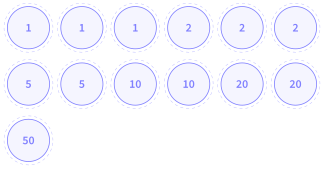
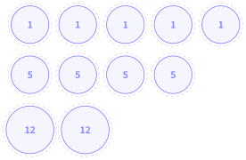

# Activités préparatoires

Les algorithmes gloutons

## Activité 1 La caisse du marchand

*rendre la monnaie avec le moins de pièces possible*

Durée : 20 min · Par deux, sans ordinateur, réponses sur le cahier

!!! consignes "Consignes"

    - Matériel : de vraies pièces et de vrais billets, ou les jetons de la page 2, découpés.

    - L’un joue le **marchand** et rend la monnaie ; l’autre **vérifie** (la somme est-elle exacte ? peut-on faire avec moins ?). On échange les rôles à chaque somme.

    - Le but : rendre **exactement** la somme, avec le **moins possible** de pièces et de billets. On dispose d’autant de pièces et de billets de chaque valeur qu’on veut.

### Exercice 1 — Rendre la monnaie en euros  { #ex-11-les-algorithmes-gloutons-act-1-1 }

Valeurs disponibles : **1, 2, 5, 10, 20 et 50 €**.

1.  Rendre successivement **8 €**, **13 €**, **27 €** et **36 €**. Pour chaque somme, noter sur le cahier les pièces et billets rendus, et leur nombre.

2.  Le vérificateur a-t-il trouvé, pour l’une des sommes, une façon de faire avec moins de pièces ? Laquelle ?

3.  Pour 36 €, quelle valeur avez-vous posée **en premier** ? Pourquoi celle-là ? Écrire, en une phrase, la **règle** que vous avez suivie pour choisir chaque pièce.

??? corrige "Corrigé"

    **1.**

    | **Somme** | **Pièces et billets rendus** | **Nombre** |
    |:---------:|:-----------------------------|:----------:|
    |    8 €    | $5 + 2 + 1$                  |     3      |
    |   13 €    | $10 + 2 + 1$                 |     3      |
    |   27 €    | $20 + 5 + 2$                 |     3      |
    |   36 €    | $20 + 10 + 5 + 1$            |     4      |

    **2.** En général non : si un élève a fait autrement (par exemple $8 = 2 + 2 + 2 + 2$), le vérificateur trouve mieux. On ne peut pas faire moins que les nombres du tableau.

    **3.** On pose d’abord le billet de 20 €, le plus grand qui ne dépasse pas 36. Règle attendue : « à chaque fois, je prends la **plus grande** pièce (ou le plus grand billet) qui ne dépasse **pas ce qu’il reste** à rendre ».

### Exercice 2 — Appliquer la règle sans réfléchir  { #ex-11-les-algorithmes-gloutons-act-1-2 }

1.  Appliquer votre règle, sans chercher d’autre solution, pour **49 €**, puis pour **88 €**. Combien de pièces et billets faut-il ?

2.  En appliquant la règle, vous est-il arrivé de **reprendre** une pièce déjà posée pour en mettre une autre ?

??? corrige "Corrigé"

    **4.** $49 = 20 + 20 + 5 + 2 + 2$ : 5 pièces et billets. $88 = 50 + 20 + 10 + 5 + 2 + 1$ : 6.

    **5.** Non : on ajoute des pièces, sans jamais revenir sur un choix déjà fait.

### Exercice 3 — Au pays de Nsiland  { #ex-11-les-algorithmes-gloutons-act-1-3 }

À Nsiland, les pièces valent **1, 5 et 12 nsis**. Les pièces de 12 sont les plus grosses.

1.  Appliquer votre règle pour rendre **15 nsis**. Quelles pièces ? Combien ?

2.  Le vérificateur cherche une meilleure solution. Existe-t-elle ? Laquelle ?

3.  Trouver une autre somme, entre 16 et 20 nsis, pour laquelle votre règle ne donne pas le moins de pièces possible.

??? corrige "Corrigé"

    **6.** La règle donne $12 + 1 + 1 + 1$ : **4 pièces**.

    **7.** Oui : $5 + 5 + 5$, soit **3 pièces**. Prendre la plus grosse pièce au début était un mauvais choix, et la règle ne permet pas de le défaire.

    **8.** **16** ($12 + 1 + 1 + 1 + 1$ : 5 pièces, alors que $5 + 5 + 5 + 1$ en utilise 4) ou **20** ($12 + 5 + 1 + 1 + 1$ : 5 pièces, alors que $5 + 5 + 5 + 5$ en utilise 4). Pour 17, 18 et 19, la règle donne bien le minimum.

### Exercice 4 — Ce qu’on a découvert  { #ex-11-les-algorithmes-gloutons-act-1-4 }

1.  Recopier et compléter sur le cahier, avec vos mots.

    - À chaque étape, la règle consiste à prendre …

    - Une fois une pièce posée, on …

    - Avec les euros, la règle donne …

    - Avec les pièces de Nsiland, la règle donne …

**Jetons à découper** (si l’on n’a pas de vraies pièces)

Euros

{ .tikz loading=lazy }

Nsiland (nsis)

{ .tikz loading=lazy }

??? corrige "Corrigé"

    **9.** Réponse possible :

    - à chaque étape, la règle consiste à prendre la plus grande pièce qui ne dépasse pas ce qu’il reste à rendre : le **meilleur choix sur le moment** ;

    - une fois une pièce posée, on ne revient **jamais** en arrière ;

    - avec les euros, la règle donne toujours le moins de pièces possible ;

    - avec les pièces de Nsiland, la règle donne une solution, mais pas toujours la meilleure.
