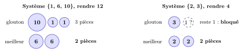
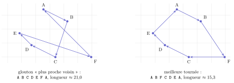

# Cours

<p class="sous-titre">Les algorithmes gloutons</p>

<span id="chap-11" class="ancre"></span>

|  |  |
|:---|:---|
| **Programme (BO)** | *Algorithmique* : résoudre un **problème d’optimisation** à l’aide d’un **algorithme glouton** (exemple emblématique : le *rendu de monnaie*). |
| **Prérequis** | les boucles `for`/`while`, les listes, écrire une fonction ; la **notion de coût** (chapitre *Algorithmique : le parcours séquentiel*) ; l’**invariant du champion** (garder le meilleur vu jusque-là). |
| **Objectifs** | reconnaître un **problème d’optimisation** ; comprendre et appliquer la **stratégie gloutonne** ; la **programmer** sur le rendu de monnaie ; savoir qu’un algorithme glouton est **rapide mais pas toujours optimal** (voire pas toujours une solution). |

!!! remarque "Remarque — Le fil conducteur : le meilleur choix, ici et maintenant"

    Un algorithme glouton (*greedy* en anglais) construit une solution par une **suite de choix**, en prenant à chaque étape ce qui **paraît le meilleur sur le moment**, **sans jamais revenir en arrière**. C’est la stratégie de celui qui, à un buffet, remplit son assiette en attrapant à chaque fois le plat le plus appétissant devant lui. C’est **simple** et **rapide** — mais, on le verra, cette myopie a un prix : le résultat n’est **pas toujours le meilleur possible**. Les points qui dépassent le programme portent le badge <span class="horsprog">au-delà du programme</span>.

## Les problèmes d’optimisation

!!! definition "Définition 1 — Problème d’optimisation"

    Un **problème d’optimisation** demande, parmi de **nombreuses** solutions valides, d’en trouver une **la meilleure possible** selon un critère. Il faut donc :

    - un ensemble de **solutions valides** (celles qui respectent les contraintes) ;

    - une **mesure de qualité** (une quantité à *minimiser* ou *maximiser*).

    Une **solution optimale** est une meilleure solution ; une **solution approchée** est une bonne solution, pas forcément la meilleure.

!!! exemple "Exemple — Trois problèmes d’optimisation"

    - **rendu de monnaie** : rendre une somme avec le *moins de pièces possible* ;

    - **sac à dos** : remplir un sac de capacité limitée en emportant le *plus de valeur possible* ;

    - **voyageur de commerce** : visiter des villes et revenir au départ en parcourant le *moins de kilomètres possible*.

!!! remarque "Remarque — Pourquoi ne pas tout essayer ? L’explosion combinatoire"

    On pourrait **énumérer toutes** les solutions et garder la meilleure. Mais leur nombre **explose** : pour le voyageur, il y a déjà $181\,440$ circuits différents pour 10 villes, environ 240 millions pour 13, et plus de 60 *millions de milliards* pour 20 (en partant d’une ville fixée, on peut visiter les $n-1$ autres dans $(n-1) \times (n-2) \times \cdots \times 1$ ordres, et chaque circuit est compté deux fois, une fois dans chaque sens). Même un ordinateur ne peut pas les parcourir. Le tableau ci-dessous donne la taille $n$ traitable en environ un milliard d’opérations selon le coût de l’algorithme :

    |      **Coût**       | **$n$ traitable ($\approx 10^9$ opérations)** |
    |:-------------------:|:---------------------------------------------:|
    |   $n$ (linéaire)    |                 1 000 000 000                 |
    | $n^2$ (quadratique) |                environ 31 600                 |
    | $2^n$ (exponentiel) |                  environ 30                   |
    |  $n!$ (factoriel)   |                      12                       |

    Face à ces problèmes, on renonce souvent à *la* meilleure solution pour une **bonne** solution obtenue **vite**. C’est là qu’intervient la méthode gloutonne.

<span id="cours-11-1" class="ancre"></span>

<span class="afaire">▶ Exercices d'application :</span> exercice **[1](exercices.md#ex-11-1)** (problèmes d’optimisation)

## La stratégie gloutonne

!!! regle "Règle 1 — Le principe glouton"

    On construit la solution **morceau par morceau**. À chaque étape :

    1.  parmi les choix encore **possibles** (faisables), on prend celui qui **optimise le critère localement** (le « meilleur sur le moment ») ;

    2.  on **ne remet jamais en cause** un choix déjà fait ;

    3.  on s’arrête quand la solution est complète.

Pour appliquer la méthode à un problème, il faut donc décider :

- quels sont les **candidats** (les morceaux qu’on ajoute) ;

- le **critère de choix glouton** (comment on classe « le meilleur sur le moment ») ;

- la **contrainte de faisabilité** (ce qui reste possible).

!!! remarque "Remarque — La force et la faiblesse, en une phrase"

    Ne faire qu’**un** choix à chaque étape (au lieu de tout explorer) rend l’algorithme **très rapide**. Mais ce choix est **myope** : le meilleur coup immédiat peut mener à une solution globale médiocre. *Rapide n’est pas optimal.*

<span id="cours-11-2" class="ancre"></span>

<span class="afaire">▶ Exercices d'application :</span> exercice **[2](exercices.md#ex-11-2)** (le principe glouton)

## L’exemple phare : le rendu de monnaie

Un commerçant doit rendre une somme avec le **moins de pièces et billets possible**. On dispose des coupures en euros (on oublie les centimes) : \; 1, 2, 5, 10, 20, 50, 100, 200.

!!! regle "Règle 2 — La stratégie gloutonne pour le rendu de monnaie"

    Tant qu’il reste une somme à rendre, on choisit **la plus grande coupure qui ne dépasse pas** la somme restante (le choix qui fait *décroître le plus vite* ce qui reste à rendre).

!!! exemple "Exemple — Rendre 9 €"

    Somme $=9$ : la plus grande coupure $\leq 9$ est **5** (reste 4) ; puis **2** (reste 2) ; puis **2** (reste 0). Résultat : \; $5 + 2 + 2$, soit **3 pièces**. On peut vérifier qu’on ne fait pas mieux : c’est **optimal**.

!!! regle "Règle 3 — Le rendu de monnaie glouton en Python"

    ```python
    pieces = [200, 100, 50, 20, 10, 5, 2, 1]   # de la plus grande a la plus petite

    def rendre(somme):
        rendu = []
        for p in pieces:
            while somme >= p:      # tant que la coupure "tient" encore
                rendu.append(p)
                somme = somme - p
        return rendu
    ```

```text
>>> rendre(9)
[5, 2, 2]
>>> rendre(48)
[20, 20, 5, 2, 1]
>>> len(rendre(48))
5
```

!!! remarque "Remarque — Le réflexe coût"

    On parcourt les coupures de la plus grande à la plus petite **une seule fois**, et pour chacune on retire autant de fois que possible : l’algorithme est **très rapide**. On peut d’ailleurs remplacer la boucle `while` par une division : le nombre de coupures `p` est `somme // p`, et il reste `somme % p`.

!!! propriete "Propriété 1 — Les euros forment un système « canonique »"

    Avec le système des euros, l’algorithme glouton donne **toujours** la solution **optimale**. On dit que ce système est **canonique**. *(Ce n’est pas une évidence : cela se démontre, coupure par coupure.)*

!!! remarque "Remarque — Attention : ce n’est pas toujours le cas ! Deux contre-exemples"

    Le glouton n’est optimal **que** pour certains systèmes de pièces.

    - **Système {1, 6, 10}, rendre 12.** Le glouton prend 10, puis 1, puis 1 : **3 pièces**. Mais $6 + 6$ ne fait que **2 pièces** ! Le glouton donne une solution *correcte mais pas optimale*.

    - **Système {2, 3}, rendre 4.** Le glouton prend 3… il reste 1, impossible à rendre : le glouton **échoue**, alors que $2 + 2$ marchait ! Ici il ne trouve *aucune* solution pourtant existante.

    **Leçon :** un algorithme glouton doit toujours être *justifié* sur le problème précis ; on ne peut pas supposer qu’il est optimal.

{ .tikz loading=lazy }

<span id="cours-11-3" class="ancre"></span>

<span class="afaire">▶ Exercices d'application :</span> exercices **[3](exercices.md#ex-11-3)** (les ingrédients du rendu de monnaie) et **[4](exercices.md#ex-11-4) à [9](exercices.md#ex-11-9)** (le rendu de monnaie)

## Un deuxième exemple : le sac à dos

On dispose d’objets ayant chacun une **valeur** et un **poids**, et d’un sac de **capacité** limitée. On veut emporter le **plus de valeur possible** sans dépasser la capacité.

!!! exemple "Exemple — Un petit sac à dos"

    Capacité du sac : **5 kg**. Objets disponibles :

    | **Objet** | **Valeur** | **Poids** | **Valeur / poids** |
    |:----------|:----------:|:---------:|:------------------:|
    | A         |     60     |   1 kg    |         60         |
    | B         |    100     |   2 kg    |         50         |
    | C         |    120     |   3 kg    |         40         |

    Quel **critère glouton** choisir ? Prendre d’abord l’objet le plus *utile au kilo*, c’est-à-dire le meilleur rapport **valeur / poids**. Ordre : A (60), B (50), C (40).

    - on prend **A** (1 kg, valeur 60) ; il reste 4 kg ;

    - on prend **B** (2 kg, valeur 100) ; il reste 2 kg ;

    - **C** pèse 3 kg : il ne rentre pas. On s’arrête.

    Butin : A $+$ B, poids 3 kg, **valeur 160**.

!!! remarque "Remarque — Encore une fois : rapide, mais pas garanti optimal"

    Ici le meilleur choix réel était **B $+$ C** (5 kg, valeur **220**) : le glouton, en prenant A « le plus rentable au kilo » d’abord, est passé à côté. Le glouton par rapport valeur/poids est **optimal si l’on peut couper les objets** (sac à dos « fractionnaire »), mais **pas** quand on doit prendre chaque objet en entier ou pas du tout. *Le même piège que le rendu de monnaie.*

{ .tikz loading=lazy }

<span id="cours-11-10" class="ancre"></span>

<span class="afaire">▶ Exercices d'application :</span> exercices **[10](exercices.md#ex-11-10) et [11](exercices.md#ex-11-11)** (le sac à dos)

## Quand le glouton se trompe : le voyageur de commerce

Le **voyageur de commerce** doit visiter toutes les villes d’une liste et revenir à son point de départ en parcourant le **moins de kilomètres**. La stratégie gloutonne naturelle : **aller à chaque fois vers la ville non visitée la plus proche**.

!!! remarque "Remarque — Une bonne solution, pas la meilleure"

    Ce glouton « du plus proche voisin » donne **très vite** un itinéraire correct, souvent bon, mais **rarement optimal** : en fonçant toujours vers le plus proche, on peut laisser une ville isolée qu’il faudra rejoindre par un long détour final. C’est le cas typique où le glouton sert d’**approximation** rapide, faute de pouvoir tout essayer.

{ .tikz loading=lazy }

Parti de A, le glouton enchaîne les sauts courts (B, C, D, E)… en oubliant F, isolée au sud-est. Il doit alors traverser toute la carte pour aller la chercher, puis revenir en A : deux longues traversées. La meilleure tournée passe par F « en chemin », juste après B. (Longueurs à vol d’oiseau, un carreau $=$ une unité.)

!!! remarque "Remarque — Un problème « difficile » et une question à un million de dollars au-delà du programme"

    Le voyageur de commerce fait partie des problèmes dits **NP-complets** : on **sait vérifier** vite qu’un itinéraire donné est court, mais personne ne **sait trouver** la solution optimale rapidement quand il y a beaucoup de villes. Savoir si un algorithme rapide existe pour *tous* ces problèmes est la fameuse question **« P $=$ NP ? »**, non résolue à ce jour : un prix d’**un million de dollars** récompense qui la tranchera. En attendant, pour ces problèmes, les algorithmes gloutons (et d’autres heuristiques) sont précieux : ils donnent une bonne réponse en un temps raisonnable.

!!! remarque "Remarque — En Terminale"

    Le chapitre *La programmation dynamique* résout de façon **exacte** des problèmes où le glouton échoue (rendu de monnaie avec des pièces $\{1, 6, 10\}$, sac à dos) : on combine les solutions de sous-problèmes, sans jamais les recalculer.

<span id="cours-11-12" class="ancre"></span>

<span class="afaire">▶ Exercices d'application :</span> exercice **[12](exercices.md#ex-11-12)** (le plus proche voisin)

## Un peu d’histoire

!!! remarque "Remarque — Des télécommunications à la conjecture du siècle"

    Les stratégies « au plus pressé » sont étudiées dès les années 1950, bien avant d’avoir un nom : l’expression « algorithme glouton » (*greedy algorithm*) ne se répand qu’autour de 1970 (on l’attribue souvent au mathématicien Jack Edmonds, en 1971). En **1952**, **David Huffman**, étudiant au MIT, invente un algorithme glouton de **compression** de données (le codage de Huffman) qui sert encore aujourd’hui. En **1956–1957**, **Joseph Kruskal** et **Robert Prim** publient des algorithmes gloutons pour relier des points au moindre coût (les « arbres couvrants », utiles pour les réseaux électriques et de télécommunications). Le glouton est donc né avec des applications très concrètes.

    Le revers de la médaille — les problèmes que le glouton ne sait qu’*approcher* — a donné naissance en **1971** (**Stephen Cook**) à la théorie des problèmes **NP-complets**, et à la question **P $=$ NP**, l’un des sept « problèmes du millénaire » dotés d’un prix d’un million de dollars. Le mathématicien américain **Stephen Cook**, alors jeune professeur (ci-contre en 1968, à Berkeley), montre en 1971 qu’un problème de logique (le problème SAT) est « NP-complet » : savoir le résoudre vite permettrait de résoudre vite tous les problèmes d’une très vaste famille. Dès 1972, Richard Karp en exhibe 21 autres, dont le sac à dos ; on en connaît aujourd’hui des milliers, dont le voyageur de commerce, qui sont en fait *le même* problème déguisé : savoir en résoudre un vite permettrait de les résoudre tous. Cette découverte lui vaut le prix Turing en 1982. *Ainsi, un chapitre de Première touche à l’une des plus grandes questions ouvertes de l’informatique.*

    \*(image manquante : 11_hist_stephen_cook)\*  
    Stephen Cook en 1968

!!! remarque "Remarque — Liens avec d’autres chapitres"

    Le glouton suppose les candidats triés (**Les algorithmes de tri**) et prend à chaque étape le meilleur, comme l’invariant du champion (**Algorithmique : le parcours séquentiel**) ; le coût $2^n$ de l’exploration complète vient des $2^n$ nombres de $n$ bits (**Le binaire et l’écriture des nombres**). En Terminale, la **programmation dynamique** résout exactement ces problèmes, et **Dijkstra** (**Graphes**) est un glouton prouvé optimal.

## Bilan — la carte mémoire

| **Notion** | **À retenir** |
|:---|:---|
| Problème d’optimisation | trouver, parmi beaucoup de solutions valides, la *meilleure* (min ou max) |
| Solution optimale / approchée | la meilleure / une bonne, pas forcément la meilleure |
| Explosion combinatoire | tout essayer est impossible (millions, milliards… de solutions) |
| Stratégie gloutonne | suite de choix ; à chaque étape le *meilleur choix local* ; jamais revenir en arrière |
| Ingrédients | candidats $+$ critère de choix $+$ contrainte de faisabilité |
| Force / faiblesse | **rapide et simple** ; mais **pas toujours optimal** (ni même une solution) |
| Rendu de monnaie | prendre la plus grande coupure $\leq$ somme restante |
| Système canonique | système où le glouton est *toujours* optimal (ex. les euros) |
| Contre-exemples | {1,6,10} rendre 12 (sous-optimal) ; {2,3} rendre 4 (échec) |

## Erreurs fréquentes

- **Croire que le glouton est toujours optimal.** Il faut le *justifier* pour chaque problème.

- **Oublier de trier / parcourir les candidats dans le bon ordre** (coupures de la plus grande à la plus petite ; objets par valeur/poids décroissant).

- **Confondre « pas optimal » et « pas de solution ».** Le glouton peut donner une solution non optimale ({1,6,10}) ou carrément échouer ({2,3}).

- **Vouloir revenir en arrière** : un algorithme glouton, par définition, ne revient jamais sur un choix.

- **Confondre valeur et poids** dans le sac à dos : le critère glouton est le *rapport* valeur/poids.

## Savoir-faire à maîtriser

*À la fin du chapitre, je sais…*

- reconnaître un problème d’optimisation et dire ce qu’on minimise ou maximise ;

- énoncer le principe glouton (choix local, sans retour en arrière) et ses ingrédients ;

- **dérouler** et **programmer** le rendu de monnaie glouton ;

- donner un **contre-exemple** où le glouton n’est pas optimal (ou échoue) ;

- appliquer un critère glouton à un autre problème (sac à dos, plus proche voisin) ;

- expliquer pourquoi le glouton est *rapide* mais *pas toujours* optimal.
