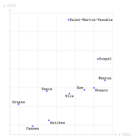
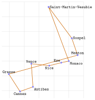
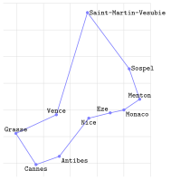

# TP et projets

<p class="sous-titre">Les algorithmes gloutons</p>

## <span class="etiquette">TP</span> Le glouton à l’épreuve

*monnaie, sac à dos, tournée sur la Riviera : programmer, comparer à l’optimum, mesurer*

<p class="infos-activite">Durée : 2 à 3 h (deux séances) · Seul ou en binôme, sur machine</p>

!!! fichiers "Fichiers à télécharger"

    [:material-folder-open: dossier en ligne](https://github.com/MathThibaud/nsi-fichiers-eleves/tree/main/premiere/11-tp-glouton-epreuve){ .md-button } [:material-zip-box: archive .zip](https://github.com/MathThibaud/nsi-fichiers-eleves/raw/main/zips/premiere-11-tp-glouton-epreuve.zip){ .md-button }

!!! encadre "But du TP"

    Le cours affirme qu’un algorithme glouton est **rapide** mais **pas toujours optimal**. On va le **vérifier soi-même**, chiffres à l’appui, sur trois problèmes d’optimisation. Pour chacun : on programme le glouton, on calcule la **vraie** meilleure solution par **force brute** (en essayant tout, ce qui n’est possible que sur de petites tailles), puis on **mesure** l’écart entre les deux — et le temps que coûte la force brute. Le produit final est un **tableau de bilan** rempli avec vos propres mesures.

!!! consignes "Consignes"

    - Fichier à télécharger (lien ci-dessus) : `tp_gloutons_depart.py` (tout votre code s’y écrit).

    - <span class="run" title="À programmer et tester sur machine">▶</span> *À programmer et tester.* En bas du fichier, `test_partie1()`, `test_partie2()` et `test_partie3()` vérifient vos fonctions : à chaque lancement, chaque partie affiche `[OK]` ou `[A FAIRE]` (au début, tout est `[A FAIRE]` : c’est normal).

    - Notez au fur et à mesure vos résultats et vos réponses sur le cahier : ils servent au bilan final (partie 4). Niveau : ★ échauffement, ★★ classique (niveau bac), ★★★ défi ; les *coups de pouce* et les *corrigés* se déplient sous chaque exercice.

    - Usage de l’IA, indiqué sur chaque exercice : <span class="ia ia-rouge" title="Sans IA : le but est l'automatisme lui-même"></span> aucune ; <span class="ia ia-orange" title="IA en appui : déboguer, reformuler, vérifier ; la réponse finale est la vôtre"></span> en appui (déboguer, reformuler, vérifier ; la réponse finale est écrite et comprise par vous) ; <span class="ia ia-vert" title="IA intégrée : l'exercice s'appuie sur une réponse d'IA"></span> l’exercice s’appuie sur une réponse d’IA. Voir la [charte d’usage de l’IA](../charte.md).

## Rendu de monnaie : canonique ou pas ?

Un système de pièces est **canonique** si le glouton y rend *toujours* le nombre minimal de pièces. Les euros le sont ; le système $\{1, 6, 10\}$ ne l’est pas. Comment le savoir pour un système quelconque ? En comparant, somme par somme, le glouton à la **vraie** solution optimale.

### <span class="stars" title="Niveau 1 sur 3">★</span> <span class="exo-num">Exercice 1</span> — Le glouton fourni <span class="ia ia-rouge" title="Sans IA : le but est l'automatisme lui-même"></span> { #ex-11-les-algorithmes-gloutons-tp-1-1 }

<span class="run" title="À programmer et tester sur machine">▶</span> 

La fonction `rendu_glouton(systeme, somme)` est donnée : c’est celle du cours, mais elle renvoie le **nombre** de pièces, ou `None` quand il reste une somme impossible à rendre.

1.  Prévoir à la main, puis vérifier : `rendu_glouton([10, 6, 1], 12)` et `rendu_glouton([3, 2], 4)`.

2.  Pourquoi le test `if somme != 0` est-il nécessaire en fin de fonction ?

??? corrige "Corrigé"

    Tous les résultats ont été obtenus en exécutant le programme corrigé (les fonctions complètes figurent dans chaque exercice ; elles passent les tests de `tp_gloutons_depart.py`). Les **durées** dépendent de la machine : seuls leurs ordres de grandeur et leur *croissance* comptent.

    <table>
    <thead>
    <tr>
    <th style="text-align: left;">problème</th>
    <th style="text-align: center;">glouton</th>
    <th style="text-align: center;">optimum</th>
    <th style="text-align: center;">écart</th>
    <th style="text-align: center;">force brute</th>
    </tr>
    </thead>
    <tbody>
    <tr>
    <td style="text-align: left;">monnaie <span class="math inline">{1, 6, 10}</span>, somme 12</td>
    <td style="text-align: center;">3 pièces</td>
    <td style="text-align: center;">2 pièces</td>
    <td style="text-align: center;"><span class="math inline">+50 %</span></td>
    <td style="text-align: center;">—</td>
    </tr>
    <tr>
    <td style="text-align: left;">sac de Léa (critère rapport)</td>
    <td style="text-align: center;">260</td>
    <td style="text-align: center;">270</td>
    <td style="text-align: center;"><span class="math inline">3, 7 %</span></td>
    <td style="text-align: center;">1 024 sacs, instantané</td>
    </tr>
    <tr>
    <td style="text-align: left;">200 sacs au hasard (rapport)</td>
    <td colspan="2" style="text-align: left;">optimum 126 fois sur 200</td>
    <td style="text-align: center;">moyen : 1,7 %</td>
    <td style="text-align: center;">—</td>
    </tr>
    <tr>
    <td style="text-align: left;">tournée depuis Monaco</td>
    <td style="text-align: center;">189,6 km</td>
    <td style="text-align: center;">156,7 km</td>
    <td style="text-align: center;">21 %</td>
    <td style="text-align: center;">362 880 ordres, <span class="math inline"> ≈ 3, 5</span> s</td>
    </tr>
    <tr>
    <td style="text-align: left;">tournée, meilleur départ</td>
    <td style="text-align: center;">162,4 km</td>
    <td style="text-align: center;">156,7 km</td>
    <td style="text-align: center;">3,6 %</td>
    <td style="text-align: center;">—</td>
    </tr>
    </tbody>
    </table>

    \(1\) Le glouton n’est **garanti** optimal que lorsqu’on l’a *démontré* pour le problème précis (rendu de monnaie dans un système canonique comme l’euro ; sac à dos *fractionnaire*). (2) La force brute devient impossible très vite : $2^n$ sacs ou $(n-1)!$ tournées, chaque objet ou ville de plus multipliant le travail (explosion combinatoire). (3) Exemples : calcul d’itinéraire à la volée, tournées de livraison quotidiennes, ordonnancement en temps réel : une solution à quelques pourcents de l’optimum, obtenue instantanément, vaut mieux qu’une solution parfaite trop tard.

    **1.** `rendu_glouton([10, 6, 1], 12)` vaut **3** ($10 + 1 + 1$) ; `rendu_glouton([3, 2], 4)` vaut `None` (on prend 3, il reste 1, que ni 3 ni 2 ne peuvent rendre). **2.** Sans ce test, la fonction renverrait 1 pour la somme 4 en $\{2, 3\}$ : elle compterait des pièces alors que la somme **n’a pas été entièrement rendue**.

### <span class="stars" title="Niveau 2 sur 3">★★</span> <span class="exo-num">Exercice 2</span> — La vraie solution, par force brute <span class="ia ia-orange" title="IA en appui : déboguer, reformuler, vérifier ; la réponse finale est la vôtre"></span> { #ex-11-les-algorithmes-gloutons-tp-1-2 }

<span class="run" title="À programmer et tester sur machine">▶</span> 

Pour un système de **trois** pièces `[p1, p2, p3]`, on peut essayer *toutes* les façons de rendre la somme : $a$ pièces `p1` ($a$ de 0 à `somme // p1`), puis $b$ pièces `p2` (autant qu’il en tient dans ce qui reste) ; le reste doit alors se faire **exactement** en pièces `p3`.

1.  Pour `[10, 6, 1]` et la somme 12, recopier et compléter le tableau des essais :

    | $a$ (pièces de 10) | $b$ (pièces de 6) | reste (en pièces de 1) | nombre de pièces |
    |:--:|:--:|:--:|:--:|
    | 0 | 0 | 12 | 12 |
    | 0 | 1 | … | … |
    | 0 | 2 | … | … |
    | 1 | 0 | … | … |

2.  Compléter `optimal3(systeme, somme)`, qui renvoie le plus petit nombre de pièces trouvé, ou `None` si aucun essai ne tombe juste.

    ??? pouce "Coup de pouce"

        Dans la boucle sur `b` : calculer `reste = somme - a * p1 - b * p2` ; si `reste % p3 == 0`, l’essai réussit avec `a + b + reste // p3` pièces : c’est un candidat pour le minimum (invariant du champion, avec `None` au départ).

??? corrige "Corrigé"

    **1.** Pour `[10, 6, 1]` et 12 :

    | $a$ | $b$ | reste | pièces |
    |:---:|:---:|:-----:|:------:|
    |  0  |  0  |  12   |   12   |
    |  0  |  1  |   6   |   7    |
    |  0  |  2  |   0   | **2**  |
    |  1  |  0  |   2   |   3    |

    Le minimum est **2** ($6 + 6$) ; le glouton, lui, a suivi la dernière ligne (3 pièces).

    **2.**

    ```python
    def optimal3(systeme, somme):
        p1, p2, p3 = systeme
        meilleur = None
        for a in range(somme // p1 + 1):
            for b in range((somme - a * p1) // p2 + 1):
                reste = somme - a * p1 - b * p2
                if reste % p3 == 0:                  # le reste se fait en pieces p3
                    n = a + b + reste // p3
                    if meilleur is None or n < meilleur:
                        meilleur = n
        return meilleur
    ```

### <span class="stars" title="Niveau 2 sur 3">★★</span> <span class="exo-num">Exercice 3</span> — Chercher un contre-exemple <span class="ia ia-orange" title="IA en appui : déboguer, reformuler, vérifier ; la réponse finale est la vôtre"></span> { #ex-11-les-algorithmes-gloutons-tp-1-3 }

<span class="run" title="À programmer et tester sur machine">▶</span> 

Compléter `premier_contre_exemple(systeme, smax)`, qui renvoie la plus petite somme de 1 à `smax` où le glouton ne donne pas l’optimum (ou `None`). Puis recopier sur le cahier et compléter le tableau suivant (`smax = 100`) :

| système | $\{1,2,5\}$ | $\{1,6,10\}$ | $\{1,3,4\}$ | $\{1,5,7\}$ | $\{1,10,25\}$ | $\{1,10,20\}$ | $\{5,10,25\}$ |
|:--:|:--:|:--:|:--:|:--:|:--:|:--:|:--:|
| contre-exemple |  |  |  |  |  |  |  |
| glouton / optimum |  |  |  |  |  |  |  |

*Attention : la fonction attend le système trié du plus grand au plus petit, par exemple `[10, 6, 1]`.*

??? corrige "Corrigé"

    ```python
    def premier_contre_exemple(systeme, smax):
        for somme in range(1, smax + 1):
            if rendu_glouton(systeme, somme) != optimal3(systeme, somme):
                return somme
        return None
    ```

    | système | $\{1,2,5\}$ | $\{1,6,10\}$ | $\{1,3,4\}$ | $\{1,5,7\}$ | $\{1,10,25\}$ | $\{1,10,20\}$ | $\{5,10,25\}$ |
    |:--:|:--:|:--:|:--:|:--:|:--:|:--:|:--:|
    | contre-exemple | aucun | 12 | 6 | 10 | 30 | aucun | aucun |
    | glouton / optimum | — | 3 / 2 | 3 / 2 | 4 / 2 | 6 / 3 | — | — |

    Pour $\{5,10,25\}$, les sommes qui ne sont pas multiples de 5 ne peuvent être rendues ni par le glouton ni par personne : les deux fonctions renvoient `None`, ce n’est pas un contre-exemple.

### <span class="stars" title="Niveau 2 sur 3">★★</span> <span class="exo-num">Exercice 4</span> — La chasse aux systèmes non canoniques <span class="ia ia-orange" title="IA en appui : déboguer, reformuler, vérifier ; la réponse finale est la vôtre"></span> { #ex-11-les-algorithmes-gloutons-tp-1-4 }

<span class="run" title="À programmer et tester sur machine">▶</span> 

On examine **tous** les systèmes $\{1, a, b\}$ avec $2 \leqslant a < b \leqslant 20$.

1.  Écrire une double boucle qui compte combien de ces systèmes il y a, et combien ne sont **pas** canoniques (en testant les sommes de 1 à 100). Un système « pris au hasard » a-t-il des chances d’être canonique ?

2.  Pour chaque système non canonique, comparer le plus petit contre-exemple à $a + b$. Que constate-t-on ? *(On admet que ce constat est un théorème : pour trois pièces, il suffit de tester les sommes inférieures à $a+b$.)*

??? corrige "Corrigé"

    ```python
    total = 0
    non_canoniques = 0
    for a in range(2, 20):
        for b in range(a + 1, 21):
            total = total + 1
            if premier_contre_exemple([b, a, 1], 100) is not None:
                non_canoniques = non_canoniques + 1
    print(total, non_canoniques)                 # 171 100
    ```

    **1.** **171** systèmes, dont **100** non canoniques (environ 58 %) : un système « au hasard » a plutôt *moins* d’une chance sur deux d’être canonique. Les euros sont un choix réfléchi. **2.** Le plus petit contre-exemple est **toujours strictement inférieur à** $a + b$ (vérifié sur les 100 systèmes).

### <span class="stars" title="Niveau 3 sur 3">★★★</span> <span class="exo-num">Exercice 5</span> — Une règle cachée, et deux histoires vraies <span class="ia ia-orange" title="IA en appui : déboguer, reformuler, vérifier ; la réponse finale est la vôtre"></span> { #ex-11-les-algorithmes-gloutons-tp-1-5 }

<span class="run" title="À programmer et tester sur machine">▶</span> 

1.  Écrivons $b = q \times a + r$ (division euclidienne : `q, r = b // a, b % a`). En affichant `a`, `b`, `q`, `r` pour les systèmes canoniques et non canoniques, chercher une règle qui permet de prévoir, *sans rien essayer*, si $\{1, a, b\}$ est canonique. La vérifier sur les 171 systèmes.

2.  Aux États-Unis, on rend la monnaie avec des pièces de 1, 5, 10 et 25 cents. Si la pièce de 5 cents disparaissait, le système $\{1, 10, 25\}$ serait-il encore canonique ? (voir l’exercice précédent)

3.  Avant 1971, le Royaume-Uni comptait en *pence* avec des pièces de 1, 3, 6, 12, 24 et 30 pence. Avec `rendu_glouton`, rendre 48 pence. Trouver à la main une solution en moins de pièces. Ce système était-il canonique ?

??? pouce "Coup de pouce"

    Comparer, pour chaque système, le reste `r` à `a - q`. Commencer par les systèmes où `r` vaut 0.

??? corrige "Corrigé"

    **1.** Règle : $\{1, a, b\}$ est canonique **si et seulement si** $r = 0$ **ou** $r \geqslant a - q$. Vérification sur les 171 systèmes : 171 accords.

    ```python
    accords = 0
    for a in range(2, 20):
        for b in range(a + 1, 21):
            q, r = b // a, b % a
            canonique = premier_contre_exemple([b, a, 1], 100) is None
            if canonique == (r == 0 or r >= a - q):
                accords = accords + 1
    print(accords)                               # 171
    ```

    Exemples : $\{1, 6, 10\}$ : $q = 1$, $r = 4 < 6 - 1$ $\to$ non canonique ; $\{1, 2, 5\}$ : $q = 2$, $r = 1 \geqslant 0$ $\to$ canonique. (Résultat connu pour trois pièces, admis ici.)

    **2.** $\{1, 10, 25\}$ n’est **pas** canonique : pour 30 cents, le glouton donne $25 + 5 \times 1$ (6 pièces) au lieu de $3 \times 10$ (3 pièces). La pièce de 5 cents « sauve » le système américain.

    **3.** `rendu_glouton([30, 24, 12, 6, 3, 1], 48)` vaut **3** ($30 + 12 + 6$), alors que $24 + 24$ n’utilise que **2** pièces : l’ancien système britannique n’était **pas canonique**.

## Le sac à dos du randonneur

Pour un bivouac dans le Mercantour, Léa peut porter **10 kg**. Chaque objet a un poids et un **intérêt** (en points, selon Léa). Elle veut un sac d’intérêt total **maximal**, sans dépasser 10 kg.

| objet | tente | duvet | réchaud | nourriture | trousse | gourde | photo | jumelles | doudoune | livre |
|:---|:--:|:--:|:--:|:--:|:--:|:--:|:--:|:--:|:--:|:--:|
| poids (kg) | 4 | 2 | 2 | 3 | 1 | 2 | 1 | 1 | 2 | 1 |
| intérêt | 75 | 60 | 30 | 70 | 40 | 55 | 25 | 10 | 45 | 5 |

Dans le programme, un objet est un triplet `(nom, poids, intérêt)` ; la liste `OBJETS` et la constante `CAPACITE` sont fournies.

### <span class="stars" title="Niveau 1 sur 3">★</span> <span class="exo-num">Exercice 6</span> — Trois critères gloutons <span class="ia ia-rouge" title="Sans IA : le but est l'automatisme lui-même"></span> { #ex-11-les-algorithmes-gloutons-tp-1-6 }

Le glouton prend les objets **un par un dans un certain ordre**, et met chaque objet dans le sac s’il rentre encore. Trois ordres sont naturels : par intérêt **décroissant**, par poids **croissant**, par rapport intérêt/poids **décroissant**.

1.  Calculer à la main le rapport intérêt/poids de chaque objet et les classer.

2.  Dérouler à la main le glouton « par rapport » : quels objets sont pris, pour quel poids et quel intérêt ?

??? corrige "Corrigé"

    **1.** Rapports : trousse 40 ; duvet 30 ; gourde 27,5 ; photo 25 ; nourriture $\approx 23{,}3$ ; doudoune 22,5 ; tente 18,75 ; réchaud 15 ; jumelles 10 ; livre 5.

    **2.** trousse (1 kg) ; duvet (3 kg) ; gourde (5 kg) ; photo (6 kg) ; nourriture (9 kg) ; doudoune : 11 kg, refusée ; tente, réchaud : refusés ; jumelles (10 kg) ; livre : refusé. Sac : **10 kg, intérêt 260**.

### <span class="stars" title="Niveau 2 sur 3">★★</span> <span class="exo-num">Exercice 7</span> — Programmer le glouton <span class="ia ia-orange" title="IA en appui : déboguer, reformuler, vérifier ; la réponse finale est la vôtre"></span> { #ex-11-les-algorithmes-gloutons-tp-1-7 }

<span class="run" title="À programmer et tester sur machine">▶</span> 

1.  Compléter `rapport(objet)`, puis `sac_glouton(objets, capacite, critere, decroissant)`. Le paramètre `critere` est une **fonction** (`interet`, `poids` ou `rapport`) qui sert de clé de tri : `sorted(objets, key=critere, reverse=decroissant)`.

2.  Lancer les trois gloutons sur `OBJETS`. Noter pour chacun les objets pris et l’intérêt total. Votre déroulé à la main était-il juste ?

??? corrige "Corrigé"

    ```python
    def rapport(objet):
        return objet[2] / objet[1]

    def sac_glouton(objets, capacite, critere, decroissant):
        pris = []
        poids_total = 0
        interet_total = 0
        for objet in sorted(objets, key=critere, reverse=decroissant):
            if poids_total + objet[1] <= capacite:      # l'objet rentre encore
                pris.append(objet[0])
                poids_total = poids_total + objet[1]
                interet_total = interet_total + objet[2]
        return pris, poids_total, interet_total
    ```

    | critère | objets pris | intérêt |
    |:---|:---|:--:|
    | intérêt décroissant | tente, nourriture, duvet, trousse | 245 |
    | poids croissant | trousse, photo, jumelles, livre, duvet, réchaud, gourde | 225 |
    | rapport décroissant | trousse, duvet, gourde, photo, nourriture, jumelles | 260 |

    (À poids égal, `sorted` garde l’ordre de la liste `OBJETS` : le tri est *stable*.)

### <span class="stars" title="Niveau 2 sur 3">★★</span> <span class="exo-num">Exercice 8</span> — L’optimum, en comptant en binaire <span class="ia ia-orange" title="IA en appui : déboguer, reformuler, vérifier ; la réponse finale est la vôtre"></span> { #ex-11-les-algorithmes-gloutons-tp-1-8 }

<span class="run" title="À programmer et tester sur machine">▶</span> 

Avec $n$ objets, il y a $2^n$ sacs possibles (chaque objet est pris ou non). On les numérote de $0$ à $2^n - 1$ : écrit en **binaire** sur $n$ bits, le numéro $k$ dit quels objets on prend (bit $i$ égal à 1 : l’objet $i$ est dans le sac). Par exemple, avec 3 objets, $k = 5$, qui s’écrit `101` en binaire, désigne le sac « objet 0 et objet 2 ».

1.  Avec 3 objets, quels sacs désignent $k = 3$ et $k = 6$ ? Combien de sacs pour les 10 objets de Léa ?

2.  Compléter `sac_optimal(objets, capacite)` : pour chaque $k$, construire le sac, et le garder s’il ne dépasse pas la capacité et bat le meilleur sac trouvé jusque-là.

    ??? pouce "Coup de pouce"

        `(k // 2 ** i) % 2` est le bit numéro `i` de `k` (le chiffre des unités en binaire est le bit 0).

3.  Quel est le sac optimal ? Lequel des trois gloutons l’a trouvé ? De combien de points (et de quel pourcentage) chacun s’en écarte-t-il ? Le choix fait par l’optimum vous semble-t-il raisonnable pour un bivouac ? Qu’en conclure sur le *modèle* ?

??? corrige "Corrigé"

    **1.** $3 = \texttt{011}$ : objets 0 et 1 ; $6 = \texttt{110}$ : objets 1 et 2. Pour 10 objets : $2^{10} = \textbf{1\,024}$ sacs.

    **2.**

    ```python
    def sac_optimal(objets, capacite):
        n = len(objets)
        meilleur = ([], 0, 0)
        for k in range(2 ** n):
            pris = []
            poids_total = 0
            interet_total = 0
            for i in range(n):
                if (k // 2 ** i) % 2 == 1:      # le bit i de k vaut 1
                    pris.append(objets[i][0])
                    poids_total = poids_total + objets[i][1]
                    interet_total = interet_total + objets[i][2]
            if poids_total <= capacite and interet_total > meilleur[2]:
                meilleur = (pris, poids_total, interet_total)
        return meilleur
    ```

    **3.** Optimum : duvet, nourriture, trousse, gourde, doudoune — **10 kg, 270 points**. **Aucun** des trois gloutons ne le trouve. Écarts : intérêt $-25$ points ($9{,}3\,\%$) ; poids $-45$ ($16{,}7\,\%$) ; rapport $-10$ ($3{,}7\,\%$). L’optimum **laisse la tente** : pour un bivouac, c’est absurde ! L’algorithme a bien résolu le problème *posé*, mais le **modèle** est incomplet : il faudrait imposer les objets indispensables (ou leur donner un intérêt bien plus grand). À retenir : un résultat « optimal » n’est jamais meilleur que le modèle.

### <span class="stars" title="Niveau 2 sur 3">★★</span> <span class="exo-num">Exercice 9</span> — Mesurer sur 200 sacs au hasard <span class="ia ia-orange" title="IA en appui : déboguer, reformuler, vérifier ; la réponse finale est la vôtre"></span> { #ex-11-les-algorithmes-gloutons-tp-1-9 }

<span class="run" title="À programmer et tester sur machine">▶</span> 

Une instance ne prouve rien : on va mesurer sur **200 instances** de 10 objets tirées au hasard (fonction `objets_au_hasard` fournie), avec une capacité de 15 kg. Écrire une boucle qui, pour chaque instance, calcule l’optimum et le résultat des trois gloutons, puis affiche pour chaque critère : le **nombre de fois** où il trouve l’optimum, et l’**écart moyen** en pourcentage, $\dfrac{\text{optimum} - \text{glouton}}{\text{optimum}} \times 100$. Écrire `random.seed(2026)` avant la boucle pour que tout le monde obtienne les mêmes instances.

??? pouce "Coup de pouce"

    Deux dictionnaires indexés par le nom du critère (`"interet"`, `"poids"`, `"rapport"`) : l’un compte les succès, l’autre cumule les écarts ; on divise par 200 à la fin.

??? corrige "Corrigé"

    ```python
    random.seed(2026)
    criteres = [("interet", interet, True), ("poids", poids, False),
                ("rapport", rapport, True)]
    nb_optimal = {"interet": 0, "poids": 0, "rapport": 0}
    ecart_total = {"interet": 0, "poids": 0, "rapport": 0}
    for essai in range(200):
        objets = objets_au_hasard(10)
        meilleur = sac_optimal(objets, 15)[2]
        for nom, critere, decroissant in criteres:
            valeur = sac_glouton(objets, 15, critere, decroissant)[2]
            if valeur == meilleur:
                nb_optimal[nom] = nb_optimal[nom] + 1
            ecart_total[nom] = ecart_total[nom] + (meilleur - valeur) / meilleur * 100
    for nom in nb_optimal:
        print(nom, nb_optimal[nom], round(ecart_total[nom] / 200, 1))
    ```

    | critère             |    optimum trouvé    | écart moyen |
    |:--------------------|:--------------------:|:-----------:|
    | intérêt décroissant |   114 fois sur 200   |    4,5 %    |
    | poids croissant     |   11 fois sur 200    |   17,9 %    |
    | rapport décroissant | **126 fois sur 200** |  **1,7 %**  |

    Le critère « rapport » est nettement le meilleur : optimal près de deux fois sur trois, et sinon très proche. Le critère « poids » est mauvais : il remplit le sac d’objets légers mais peu utiles.

### <span class="stars" title="Niveau 2 sur 3">★★</span> <span class="exo-num">Exercice 10</span> — Le prix de la force brute <span class="ia ia-orange" title="IA en appui : déboguer, reformuler, vérifier ; la réponse finale est la vôtre"></span> { #ex-11-les-algorithmes-gloutons-tp-1-10 }

<span class="run" title="À programmer et tester sur machine">▶</span> 

Avec `time.time()` (appelé avant et après), mesurer la durée de `sac_optimal` pour $n = 10, 12, 14, 16, 18, 20$ objets (capacité : `3 * n // 2`). Par combien le temps est-il multiplié quand on ajoute **deux** objets ? En déduire une estimation pour 30 objets, puis pour 40. Combien de temps prend le glouton pour 40 objets ?

??? corrige "Corrigé"

    Mesures sur notre machine : $n = 10$ : 0,00 s ; 12 : 0,02 s ; 14 : 0,08 s ; 16 : 0,36 s ; 18 : 1,6 s ; 20 : 7,3 s. Ajouter deux objets multiplie le temps par **4 environ** ($2^n$ sacs : chaque objet de plus **double** le travail). Pour 30 objets : $7{,}3 \times 2^{10} \approx 7\,500$ s, soit **2 heures** ; pour 40 : $\times 2^{10}$ encore, soit environ **90 jours**. Le glouton, lui, traite 40 objets en quelques **centièmes de milliseconde** (un tri et un parcours).

## Une tournée sur la Riviera

Un livreur part de Monaco, doit passer une fois dans chacune des dix villes ci-dessous et **revenir** à Monaco, en parcourant le moins de kilomètres possible (distances à vol d’oiseau). Les coordonnées, en km, sont rangées dans le dictionnaire `VILLES` ; la fonction `distance(v1, v2)` est fournie.

| ville                  |       $x$ |       $y$ |
|:-----------------------|----------:|----------:|
| `Monaco`               |       0,0 |       0,0 |
| `Menton`               |       5,9 |       4,0 |
| `Sospel`               |       2,0 |      15,4 |
| `Eze`                  |  $-5{,}1$ |  $-1{,}1$ |
| `Nice`                 | $-13{,}1$ |  $-3{,}1$ |
| `Vence`                | $-25{,}2$ |  $-1{,}8$ |
| `Grasse`               | $-40{,}3$ |  $-8{,}8$ |
| `Cannes`               | $-32{,}8$ | $-20{,}5$ |
| `Antibes`              | $-24{,}1$ | $-17{,}4$ |
| `Saint-Martin-Vesubie` | $-13{,}6$ |      36,5 |

{ .tikz .tikz-inline loading=lazy }

### <span class="stars" title="Niveau 1 sur 3">★</span> <span class="exo-num">Exercice 11</span> — Longueur d’une tournée <span class="ia ia-orange" title="IA en appui : déboguer, reformuler, vérifier ; la réponse finale est la vôtre"></span> { #ex-11-les-algorithmes-gloutons-tp-1-11 }

<span class="run" title="À programmer et tester sur machine">▶</span> 

Compléter `longueur(tournee)`, qui additionne les distances entre villes consécutives **sans oublier le retour** de la dernière ville à la première. Vérifier : `longueur(["Monaco", "Menton", "Sospel"])` vaut environ 34,7 km.

??? corrige "Corrigé"

    ```python
    def longueur(tournee):
        total = 0
        for i in range(len(tournee) - 1):
            total = total + distance(tournee[i], tournee[i + 1])
        return total + distance(tournee[-1], tournee[0])     # retour au depart
    ```

    Monaco $\to$ Menton (7,1 km) $\to$ Sospel (12,0 km) $\to$ Monaco (15,5 km) : 34,7 km au total (l’écart de 0,1 vient des arrondis de chaque étape).

### <span class="stars" title="Niveau 2 sur 3">★★</span> <span class="exo-num">Exercice 12</span> — Le plus proche voisin <span class="ia ia-orange" title="IA en appui : déboguer, reformuler, vérifier ; la réponse finale est la vôtre"></span> { #ex-11-les-algorithmes-gloutons-tp-1-12 }

<span class="run" title="À programmer et tester sur machine">▶</span> 

1.  Compléter `plus_proche_voisin(depart, villes)` : depuis la ville où l’on se trouve, aller vers la ville **non visitée la plus proche** (invariant du champion), la retirer de `a_visiter`, recommencer.

2.  Afficher la tournée obtenue depuis Monaco et sa longueur. La dessiner sur le cahier, sur un croquis à main levée de la carte. Quelle étape paraît maladroite ?

??? corrige "Corrigé"

    ```python
    def plus_proche_voisin(depart, villes):
        tournee = [depart]
        a_visiter = [v for v in villes if v != depart]
        while len(a_visiter) > 0:
            ici = tournee[-1]
            proche = a_visiter[0]
            for v in a_visiter:
                if distance(ici, v) < distance(ici, proche):
                    proche = v
            tournee.append(proche)
            a_visiter.remove(proche)
        return tournee
    ```

    Tournée : Monaco, Eze, Nice, Vence, Antibes, Cannes, Grasse, Menton, Sospel, Saint-Martin-Vesubie (et retour) : **189,6 km**. Étape maladroite : **Grasse $\to$ Menton** (47,9 km d’un bout à l’autre de la carte), puis le long retour Saint-Martin-Vesubie $\to$ Monaco (39,0 km) : en fonçant vers les villes proches, le glouton a laissé Menton, Sospel et Saint-Martin-Vesubie « pour la fin ».

### <span class="stars" title="Niveau 2 sur 3">★★</span> <span class="exo-num">Exercice 13</span> — L’optimum, et ce qu’il coûte <span class="ia ia-orange" title="IA en appui : déboguer, reformuler, vérifier ; la réponse finale est la vôtre"></span> { #ex-11-les-algorithmes-gloutons-tp-1-13 }

<span class="run" title="À programmer et tester sur machine">▶</span> 

1.  Compléter la fonction `tournee_optimale`. L’appel `itertools.permutations(autres)` énumère **tous les ordres** possibles des 9 autres villes. Combien y en a-t-il ? Mesurer la durée du calcul.

2.  Afficher la tournée optimale et sa longueur ; la dessiner sur le même croquis, d’une autre couleur. Calculer l’écart du glouton en pourcentage.

3.  Pour 15 villes, il y aurait $14 \times 13 \times \dots \times 2 \times 1$ ordres à essayer. Estimer la durée du calcul sur votre machine.

??? corrige "Corrigé"

    ```python
    def tournee_optimale(depart, villes):
        autres = [v for v in villes if v != depart]
        meilleure = None
        for ordre in itertools.permutations(autres):
            tournee = [depart] + [v for v in ordre]
            if meilleure is None or longueur(tournee) < longueur(meilleure):
                meilleure = tournee
        return meilleure
    ```

    **1.** $9! = 362\,880$ ordres ; environ **3,5 s** sur notre machine. **2.** Optimum : Monaco, Menton, Sospel, Saint-Martin-Vesubie, Vence, Grasse, Cannes, Antibes, Nice, Eze : **156,7 km**. Écart du glouton : $\dfrac{189{,}6 - 156{,}7}{156{,}7} \approx \textbf{21\,\%}$. **3.** $14! = 87\,178\,291\,200$, soit $240\,240$ fois plus que $9!$ : environ $3{,}5 \times 240\,240 \approx 840\,000$ s, **près de 10 jours**.

    { .tikz .tikz-inline loading=lazy }  
    plus proche voisin depuis Monaco : 189,6 km

    { .tikz .tikz-inline loading=lazy }  
    tournée optimale : 156,7 km

### <span class="stars" title="Niveau 2 sur 3">★★</span> <span class="exo-num">Exercice 14</span> — Et si l’on partait d’ailleurs ? <span class="ia ia-orange" title="IA en appui : déboguer, reformuler, vérifier ; la réponse finale est la vôtre"></span> { #ex-11-les-algorithmes-gloutons-tp-1-14 }

<span class="run" title="À programmer et tester sur machine">▶</span> 

Une tournée revient à son point de départ : on peut la commencer dans n’importe quelle ville. Lancer le plus proche voisin depuis **chacune** des dix villes et garder la tournée la plus courte. Quelle longueur obtient-on ? Quel est le nouvel écart à l’optimum ? Combien de fois a-t-on appelé `plus_proche_voisin`, comparé aux ordres essayés par la force brute ?

??? corrige "Corrigé"

    ```python
    meilleure = None
    for v in VILLES:
        t = plus_proche_voisin(v, VILLES)
        if meilleure is None or longueur(t) < longueur(meilleure):
            meilleure = t
    print(meilleure, round(longueur(meilleure), 1))
    ```

    Longueurs selon le départ : Monaco 189,6 ; Menton 184,4 ; Sospel 162,4 ; Eze 190,3 ; Nice 165,5 ; Vence 162,4 ; Grasse 162,4 ; Cannes 162,4 ; Antibes 165,7 ; Saint-Martin-Vesubie 162,4. Meilleure : **162,4 km** (par exemple depuis Sospel), soit un écart de **3,6 %** seulement — pour 10 appels du glouton, contre $362\,880$ tournées examinées par la force brute. Le livreur peut suivre ce circuit en partant de Monaco : c’est le même cycle.

### <span class="stars" title="Niveau 3 sur 3">★★★</span> <span class="exo-num">Exercice 15</span> — Décroiser la tournée <span class="ia ia-orange" title="IA en appui : déboguer, reformuler, vérifier ; la réponse finale est la vôtre"></span> { #ex-11-les-algorithmes-gloutons-tp-1-15 }

<span class="run" title="À programmer et tester sur machine">▶</span> 

Sur votre croquis, la tournée gloutonne se **croise**-t-elle ? Un circuit qui se croise n’est jamais optimal : en **retournant** le morceau de tournée situé entre les deux segments qui se croisent, on raccourcit. Écrire `ameliorer(tournee)` qui, tant que c’est possible, cherche deux positions $i < j$ (avec $i \geqslant 1$ pour garder la ville de départ) telles que retourner `tournee[i:j+1]` raccourcisse la tournée, et effectue ce retournement. L’appliquer à la tournée gloutonne depuis Monaco : quelle longueur obtient-on ?

??? pouce "Coup de pouce"

    `tournee[:i] + tournee[i:j+1][::-1] + tournee[j+1:]` est la tournée où le morceau de `i` à `j` est retourné. Une variable `amelioration` (booléenne) dit s’il faut refaire un passage.

*Les longueurs sont des flottants, calculés avec de petites erreurs d’arrondi : ne compter comme amélioration qu’un gain d’au moins 1 mètre, c’est-à-dire tester `longueur(essai) < longueur(tournee) - 0.001`.*

??? corrige "Corrigé"

    Oui : le segment Grasse $\to$ Menton croise Vence $\to$ Antibes et Saint-Martin-Vesubie $\to$ Monaco.

    L’idée : pour chaque couple de positions $i < j$, on fabrique la tournée `essai` identique à `tournee`, sauf que les villes des positions $i$ à $j$ sont parcourues **dans l’autre sens** (on les relit de $j$ à $i$, par compréhension) ; si elle est plus courte, on la garde et on refera un passage.

    ```python
    def ameliorer(tournee):
        amelioration = True
        while amelioration:
            amelioration = False
            for i in range(1, len(tournee) - 1):
                for j in range(i + 1, len(tournee)):
                    retourne = [tournee[k] for k in range(j, i - 1, -1)]   # de j a i
                    essai = tournee[:i] + retourne + tournee[j + 1:]
                    if longueur(essai) < longueur(tournee) - 0.001:   # gain >= 1 m
                        tournee = essai
                        amelioration = True
        return tournee
    ```

    Le morceau `retourne` est exactement `tournee[i:j+1][::-1]`, l’écriture proposée dans le coup de pouce. Appliquée à la tournée gloutonne depuis Monaco, on obtient **156,7 km** : ici on retombe sur l’optimum (parcouru dans l’autre sens). C’est une chance : appliquée aux tournées gloutonnes issues des autres villes de départ (sauf Menton), elle s’arrête à 162,4 km, une tournée sans croisement mais non optimale. Cette amélioration locale (appelée *2-opt*) donne en général une très bonne tournée, *sans garantie* d’optimalité. Sans la marge de 0,001 km, les erreurs d’arrondi des flottants peuvent faire accepter de fausses « améliorations » (une tournée simplement parcourue à l’envers) et changer le résultat : c’est un piège classique.

## Bilan

### <span class="exo-num">Exercice 16</span> — Le tableau de bilan <span class="ia ia-orange" title="IA en appui : déboguer, reformuler, vérifier ; la réponse finale est la vôtre"></span> { #ex-11-les-algorithmes-gloutons-tp-1-16 }

Recopier sur le cahier et remplir avec **vos** mesures.

<table>
<thead>
<tr>
<th style="text-align: left;">problème</th>
<th style="text-align: center;">glouton</th>
<th style="text-align: center;">optimum</th>
<th style="text-align: center;">écart</th>
<th style="text-align: center;">durée de la force brute</th>
</tr>
</thead>
<tbody>
<tr>
<td style="text-align: left;">monnaie <span class="math inline">{1, 6, 10}</span>, somme 12</td>
<td style="text-align: center;"></td>
<td style="text-align: center;"></td>
<td style="text-align: center;"></td>
<td style="text-align: center;">—</td>
</tr>
<tr>
<td style="text-align: left;">sac de Léa (meilleur critère)</td>
<td style="text-align: center;"></td>
<td style="text-align: center;"></td>
<td style="text-align: center;"></td>
<td style="text-align: center;"></td>
</tr>
<tr>
<td style="text-align: left;">200 sacs au hasard (critère « rapport »)</td>
<td colspan="2" style="text-align: left;">optimum trouvé … fois</td>
<td style="text-align: center;">moyen :</td>
<td style="text-align: center;">—</td>
</tr>
<tr>
<td style="text-align: left;">tournée depuis Monaco</td>
<td style="text-align: center;"></td>
<td style="text-align: center;"></td>
<td style="text-align: center;"></td>
<td style="text-align: center;"></td>
</tr>
<tr>
<td style="text-align: left;">tournée, meilleur départ</td>
<td style="text-align: center;"></td>
<td style="text-align: center;"></td>
<td style="text-align: center;"></td>
<td style="text-align: center;">—</td>
</tr>
</tbody>
</table>

Puis répondre sur le cahier, en quelques lignes : (1) dans quel cas le glouton est-il **garanti** optimal ? (2) Quand la force brute devient-elle impossible, et pourquoi ? (3) Dans quelle situation réelle préféreriez-vous une solution gloutonne à une solution optimale ?
