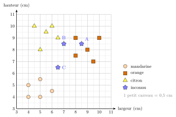

# Activités préparatoires

Les $k$k plus proches voisins

## Activité 1 Quel est ce fruit ?

*classer un fruit inconnu d’après ceux qu’on connaît déjà*

Durée : 25 min · Par binômes, sans machine

!!! consignes "Consignes"

    - Matériel : le graphique ci-dessous (à l’écran ou projeté), le cahier pour les réponses, une calculatrice.

    - Un primeur a mesuré 15 fruits dont il connaît la sorte : des **mandarines** ($\circ$), des **oranges** ($\square$) et des **citrons** ($\triangle$). Pour chacun, il a noté la **largeur** et la **hauteur** (en cm), et l’a placé comme un point sur le graphique.

    - Trois nouveaux fruits, **A**, **B** et **C** ($\star$), ont été mesurés, mais leur étiquette est tombée. Il faut deviner leur sorte **uniquement** à partir du graphique.

{ .tikz loading=lazy }

### Exercice 1 — Lire le nuage de points  { #ex-12-les-k-k-plus-proches-voisins-act-1-1 }

1.  Décrire en une phrase où se trouvent les mandarines, les oranges, les citrons. Qu’est-ce qui distingue un citron d’une orange ? une orange d’une mandarine ?

2.  D’après vous, quelle est la sorte du fruit **A** ? Comment l’avez-vous décidé ?

??? corrige "Corrigé"

    **1.** Les mandarines sont **petites** (en bas à gauche, 4 à 6 cm dans les deux sens) ; les oranges sont **grosses et rondes** (en haut à droite, 7 à 10 cm) ; les citrons sont **plus hauts que larges** (en haut à gauche). Citron/orange : la forme (allongé ou rond) ; orange/mandarine : la taille.  
    **2.** A est une **orange** : il est au milieu des oranges (ses deux plus proches voisins, $(9\,;\,8)$ et $(8\,;\,9)$, sont à $0{,}71$ cm, et ses 5 plus proches voisins sont tous des oranges). Dire « il est dans le paquet des oranges », c’est déjà l’idée de voisinage.

### Exercice 2 — Demander aux voisins  { #ex-12-les-k-k-plus-proches-voisins-act-1-2 }

1.  Règle 1 : « *un fruit inconnu est de la même sorte que le fruit connu le plus proche* ». Quel est le fruit connu le plus proche de **B** ? Quelle sorte prédit la règle 1 ?

2.  Règle 3 : « *on regarde les 3 fruits connus les plus proches, et on prend la sorte majoritaire* ». Repérer ces 3 fruits autour de B (noter leurs coordonnées). Quelle sorte prédit la règle 3 ?

3.  Même question avec les **5** fruits les plus proches de B.

4.  Les règles ne sont pas d’accord ! Laquelle vous semble la plus fiable ? Que risque-t-on si l’on ne regarde qu’**un** voisin ? Et si l’on regardait les 15 fruits ?

??? corrige "Corrigé"

    **3.** Le plus proche de B est le citron $(6{,}5\,;\,9)$, à $0{,}71$ cm : la règle 1 prédit **citron**.  
    **4.** Les 3 plus proches : le citron $(6{,}5\,;\,9)$ ($0{,}71$ cm), l’orange $(8\,;\,9)$ ($1{,}12$ cm), l’orange $(8\,;\,7{,}5)$ ($1{,}41$ cm) : 2 oranges contre 1 citron, la règle 3 prédit **orange**.  
    **5.** Les 4e et 5e sont les citrons $(5{,}5\,;\,9{,}5)$ et $(6\,;\,10)$, tous deux à $1{,}80$ cm : 3 citrons contre 2 oranges, on revient à **citron**.  
    **6.** B est à la frontière entre deux sortes : la réponse **dépend du nombre de voisins** consultés. Un seul voisin, c’est fragile : un fruit mal mesuré ou mal étiqueté suffit à tromper. Avec les 15 fruits, chaque sorte a 5 voix : **égalité** pour tous les fruits, la règle ne sert plus à rien. Il faut un nombre de voisins « raisonnable », petit devant le nombre d’exemples, et de préférence impair.

### Exercice 3 — Le fruit qui fâche  { #ex-12-les-k-k-plus-proches-voisins-act-1-3 }

1.  À l’œil, quel est le fruit connu le plus proche de **C** ? Comparer avec le binôme voisin.

2.  Pour trancher sans se disputer, il faut **mesurer** « être proche ». Proposer une façon de mesurer l’écart entre deux points du graphique.

3.  Entre C et la mandarine de coordonnées $(5\,;\,5{,}5)$, compter le décalage horizontal et le décalage vertical (en cm). Faire de même entre C et l’orange $(8\,;\,7{,}5)$. Qu’observe-t-on ?

4.  Avec ces deux décalages, comment obtenir la longueur du segment qui relie les deux points, « à vol d’oiseau » ? (Penser à un triangle rectangle.) Calculer cette longueur pour la mandarine et pour l’orange.

5.  Le plus proche voisin ne permet pas de décider pour C. Que proposer ? Essayer la règle 3 : quelle sorte obtient-on ?

??? corrige "Corrigé"

    **7.** Les binômes ne sont pas d’accord : certains voient la mandarine $(5\,;\,5{,}5)$, d’autres l’orange $(8\,;\,7{,}5)$, quelques-uns la mandarine $(6\,;\,4{,}5)$ ou le citron $(5\,;\,8)$.  
    **8.** Plusieurs réponses conviennent : mesurer à la règle, compter les carreaux, faire la somme des décalages… Toutes conviennent : l’essentiel est de **se mettre d’accord sur une mesure**.  
    **9.** Mandarine $(5\,;\,5{,}5)$ : $1{,}5$ cm horizontalement (3 carreaux) et $1$ cm verticalement (2 carreaux). Orange $(8\,;\,7{,}5)$ : **exactement les mêmes** décalages. C est à égale distance des deux.  
    **10.** Le segment est l’hypoténuse d’un triangle rectangle dont les côtés sont les deux décalages (Pythagore) : $\sqrt{1{,}5^2 + 1^2} = \sqrt{3{,}25} \approx 1{,}80$ cm, pour la mandarine comme pour l’orange.  
    **11.** On peut regarder plus de voisins : les 3 plus proches de C sont la mandarine $(5\,;\,5{,}5)$ et l’orange $(8\,;\,7{,}5)$ (à $1{,}80$ cm) puis la mandarine $(6\,;\,4{,}5)$ (à $2{,}06$ cm) : la règle 3 prédit **mandarine**. Autres idées possibles : tirer au sort, préférer le voisin d’une sorte plus fréquente…

### Exercice 4 — Mettre des mots  { #ex-12-les-k-k-plus-proches-voisins-act-1-4 }

1.  Recopier sur le cahier en complétant les trous **(a)** à **(e)** : « Pour deviner la sorte d’un fruit inconnu, on cherche parmi les fruits … **(a)** ceux qui sont les plus … **(b)** de lui, et on prend la sorte … **(c)** parmi eux. Il faut choisir … **(d)** on regarde de voisins, et une façon de mesurer la … **(e)** entre deux fruits. »

2.  Un ordinateur ne « voit » pas le graphique. De quoi a-t-il besoin pour appliquer la même méthode ?

??? corrige "Corrigé"

    **12.** « …parmi les fruits **déjà connus** (étiquetés) ceux qui sont les plus **proches** de lui, et on prend la sorte **majoritaire** parmi eux. Il faut choisir **combien** on regarde de voisins, et une façon de mesurer la **distance** entre deux fruits. »  
    **13.** Des **nombres** : les mesures de chaque fruit (ses coordonnées), la sorte des fruits connus, une **formule** de distance et une règle de vote (avec que faire en cas d’égalité). Le coup d’œil doit devenir un **calcul**.
