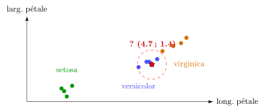
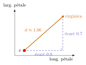

# Cours

<p class="sous-titre">Les $k$k plus proches voisins</p>

<span id="chap-12" class="ancre"></span>

|  |  |
|:---|:---|
| **Programme (BO)** | *Algorithmique* : écrire un algorithme de **classification** par la méthode des **$k$ plus proches voisins** ($k$-NN). |
| **Prérequis** | **listes** et **dictionnaires** ; **patron de parcours** et **invariant du champion** ; **tri** (`sorted` et clé) ; **données en tables** (un individu $=$ une fiche de descripteurs). |
| **Objectifs** | comprendre la **classification supervisée** ; définir une **distance** entre deux individus ; écrire l’algorithme des **$k$ plus proches voisins** ; comprendre la **frontière de décision** et **choisir $k$** ; **évaluer** un classifieur (entraînement / test) ; connaître ses **forces et limites** ; l’appliquer à la **reconnaissance d’images**. |

!!! remarque "Remarque — Le fil conducteur : « qui se ressemble s’assemble »"

    Comment un ordinateur reconnaît-il un chiffre écrit à la main, recommande-t-il un film, ou devine-t-il l’espèce d’une fleur ? L’idée des $k$-NN est d’une simplicité désarmante : pour classer un individu **inconnu**, on regarde les individus **déjà connus qui lui ressemblent le plus**, et on lui attribue l’**étiquette majoritaire** parmi eux. « Dis-moi qui sont tes voisins, je te dirai qui tu es. » Tout le chapitre consiste à rendre cette phrase **précise** et **programmable** — jusqu’à **reconnaître des chiffres et des lettres manuscrits** en fin de chapitre. Les points qui dépassent le programme portent le badge <span class="horsprog">au-delà du programme</span>.

## Apprendre à une machine à reconnaître

Reconnaître un visage, filtrer un courriel indésirable, diagnostiquer une maladie sur une radio, suggérer une chanson : derrière ces prouesses se cache souvent la même idée, l’**apprentissage automatique** (*machine learning*). Plutôt que de *programmer* explicitement toutes les règles, on **montre des exemples** à la machine et on la laisse **généraliser**.

!!! definition "Définition 1 — Classification supervisée"

    On dispose d’un ensemble d’**exemples déjà étiquetés** : pour chacun, on connaît ses **descripteurs** (des mesures) *et* sa **classe** (son étiquette). On reçoit ensuite un **nouvel individu** dont on connaît les descripteurs mais **pas** la classe, et on veut la **prédire**. C’est de l’**apprentissage supervisé** : la machine apprend « sous la supervision » d’exemples corrigés.

!!! remarque "Remarque — Supervisé, non supervisé"

    Si les exemples sont **étiquetés** (on connaît la bonne réponse), on parle d’apprentissage **supervisé** — c’est le cas du $k$-NN. Quand aucune étiquette n’est fournie et que la machine doit *regrouper* seule les individus qui se ressemblent, on parle d’apprentissage **non supervisé** (*clustering*). <span class="horsprog">au-delà du programme</span>

Le $k$-NN est sans doute l’algorithme d’apprentissage supervisé **le plus simple** qui soit — et pourtant redoutablement efficace sur beaucoup de problèmes. C’est une excellente porte d’entrée dans le monde de l’intelligence artificielle.

## Le jeu de données : l’exemple des iris

En apprentissage, tout part d’un **jeu de données** (*dataset*) : un tableau où chaque **ligne** est un individu et chaque **colonne** un descripteur, plus une colonne d’**étiquette**. On retrouve exactement les *données en tables* : un individu $=$ une fiche.

!!! exemple "Exemple — Le célèbre jeu de données Iris"

    Le jeu **Iris** (botanique, 1936) décrit **150 fleurs** d’iris réparties en **3 espèces** (*setosa*, *versicolor*, *virginica*), par **4 mesures** : longueur et largeur du **sépale**, longueur et largeur du **pétale** (en cm). C’est le jeu de données le plus célèbre de l’histoire de la classification. Les espèces *versicolor* et *virginica* se ressemblent beaucoup à l’œil nu (photos ci-dessous) : ce sont les **mesures** qui permettent de les distinguer. En voici quelques lignes (pétales seulement) :

    | **long. pétale** | **larg. pétale** | **espèce** |
    |:----------------:|:----------------:|:----------:|
    |       1.4        |       0.2        |   setosa   |
    |       1.5        |       0.2        |   setosa   |
    |       4.5        |       1.5        | versicolor |
    |       4.9        |       1.5        | versicolor |
    |       5.5        |       2.1        | virginica  |
    |       5.8        |       2.2        | virginica  |

    \*(image manquante : 12_hist_iris_versicolor)\*  
    Iris versicolor

    \*(image manquante : 12_hist_iris_virginica)\*  
    Iris virginica

!!! remarque "Remarque — Un individu $=$ un point"

    Chaque descripteur est une **coordonnée**. Avec 2 descripteurs, un individu est un **point du plan** ; avec $p$ descripteurs, un point d’un espace à $p$ dimensions. **Classer**, c’est regarder **où** tombe le nouveau point par rapport aux points déjà étiquetés. On se limite souvent à 2 descripteurs pour pouvoir **dessiner** — ici la longueur et la largeur du pétale, qui séparent déjà très bien les trois espèces.

{ .tikz loading=lazy }

## Mesurer la ressemblance : la distance

Pour dire qui « ressemble » à qui, il faut mesurer une **distance**. En 2D, c’est la distance à vol d’oiseau, donnée par le théorème de Pythagore.

!!! definition "Définition 2 — Distance euclidienne"

    Entre deux individus $A=(a_1, \dots, a_p)$ et $B=(b_1, \dots, b_p)$ décrits par $p$ descripteurs, $$d(A,B) = \sqrt{(a_1-b_1)^2 + (a_2-b_2)^2 + \dots + (a_p-b_p)^2}\,.$$ C’est la généralisation de Pythagore : la racine de la **somme des carrés des écarts**, descripteur par descripteur.

**Sur l’exemple des iris** (2 descripteurs), entre la fleur inconnue $x = (4.7 ; 1.4)$ et la *virginica* $(5.5 ; 2.1)$ : les écarts sont $5.5 - 4.7 = 0.8$ (longueur) et $2.1 - 1.4 = 0.7$ (largeur). Ce sont les deux côtés de l’angle droit, et la distance est l’hypoténuse :

$d^2 = 0.8^2 + 0.7^2 = 0.64 + 0.49 = 1.13$  
donc  $d = \sqrt{1.13} \approx 1.06$.

{ .tikz loading=lazy }

!!! regle "Règle 1 — La distance en Python"

    ```python
    def distance(A, B):
        """distance euclidienne entre deux listes de meme longueur"""
        somme = 0
        for i in range(len(A)):
            somme = somme + (A[i] - B[i]) ** 2
        return somme ** 0.5
    ```

!!! remarque "Remarque — Comparer sans la racine carrée"

    Pour **comparer** des distances, la racine est **inutile** : $\sqrt{u}<\sqrt{v}$ exactement quand $u<v$. On peut donc trier sur la **somme des carrés** (plus rapide) et ne garder `**0.5` que si l’on veut la vraie valeur. *On note $d^2$ cette « distance au carré ».*

!!! remarque "Remarque — Il existe d’autres distances au-delà du programme"

    La distance euclidienne n’est pas la seule. La distance de **Manhattan** (somme des écarts en *valeur absolue*, comme un taxi qui suit les rues) est parfois préférée. Le choix de la distance fait partie de la conception du classifieur.

<span id="cours-12-1" class="ancre"></span>

<span class="afaire">▶ Exercices d'application :</span> exercices **[1](exercices.md#ex-12-1) et [2](exercices.md#ex-12-2)** (vocabulaire, calculer des distances)

## L’algorithme des $k$ plus proches voisins

!!! regle "Règle 2 — La méthode des $k$-NN"

    Pour classer un nouvel individu $x$ :

    1.  calculer la **distance** de $x$ à **chaque** exemple connu ;

    2.  retenir les **$k$ exemples les plus proches** (ses $k$ « voisins ») ;

    3.  lui attribuer la **classe majoritaire** parmi ces $k$ voisins (le vote).

!!! exemple "Exemple — Classer la fleur $x=(4.7 ; 1.4)$, en détail"

    On calcule la distance au carré de $x$ à chacun des 6 exemples :

    | **exemple** | **espèce** | **calcul de $d^2$** | **$d^2$** |
    |:-----------:|:----------:|:-------------------:|:---------:|
    | (1.4 ; 0.2) |   setosa   |    $3.3^2+1.2^2$    |   12.33   |
    | (1.5 ; 0.2) |   setosa   |    $3.2^2+1.2^2$    |   11.68   |
    | (4.5 ; 1.5) | versicolor |    $0.2^2+0.1^2$    | **0.05**  |
    | (4.9 ; 1.5) | versicolor |    $0.2^2+0.1^2$    | **0.05**  |
    | (5.5 ; 2.1) | virginica  |    $0.8^2+0.7^2$    | **1.13**  |
    | (5.8 ; 2.2) | virginica  |    $1.1^2+0.8^2$    |   1.85    |

    **$1$-NN** ($k=1$) : le plus proche est une *versicolor* ($d^2=0.05$) $\to$ **versicolor**. **$3$-NN** ($k=3$) : les 3 plus proches sont deux *versicolor* (0.05 ; 0.05) et une *virginica* (1.13) $\to$ vote 2 contre 1 $\to$ **versicolor**.

On assemble le tout en Python. On réutilise le **tri par clé** et un **dictionnaire d’occurrences** pour le vote.

!!! regle "Règle 3 — Les $k$ plus proches, puis le vote"

    ```python
    def k_plus_proches(exemples, x, k):
        """exemples : liste de (descripteurs, classe). Renvoie les classes des k voisins."""
        dists = []
        for descripteurs, classe in exemples:
            dists.append((distance(x, descripteurs), classe))
        dists.sort(key=lambda couple: couple[0])      # tri par distance croissante
        return [classe for (d, classe) in dists[:k]]  # les k premiers

    def vote(classes):
        compte = {}
        for c in classes:
            compte[c] = compte.get(c, 0) + 1          # dictionnaire d'occurrences
        meilleure = None
        for c in compte:
            if meilleure is None or compte[c] > compte[meilleure]:
                meilleure = c
        return meilleure

    def classer(exemples, x, k):
        return vote(k_plus_proches(exemples, x, k))
    ```

```text
>>> classer(iris, [4.7, 1.4], 3)
'versicolor'
```

!!! remarque "Remarque — Une méthode « paresseuse »"

    Le $k$-NN n’a **rien à apprendre à l’avance** : il ne construit aucun modèle, il se contente de **garder tous les exemples** et de comparer au moment de la question. On dit qu’il est **paresseux** (*lazy*). Simple… mais on verra que cela a un coût.

<span id="cours-12-3" class="ancre"></span>

<span class="afaire">▶ Exercices d'application :</span> exercices **[3](exercices.md#ex-12-3) à [7](exercices.md#ex-12-7)** (voter, dérouler puis programmer le k-NN)

## La frontière de décision et le choix de $k$

Imaginons qu’on **colorie** tout le plan selon la classe que le $k$-NN prédirait en chaque point : on obtient des **régions** colorées, séparées par une **frontière de décision**. Cette frontière change avec $k$.

\*(image manquante : 12_frontiere_knn)\*

*Jeu Iris (pétales). À gauche $k=1$ : la frontière est très **découpée** et forme même un petit « îlot » autour d’un point isolé. À droite $k=15$ : la frontière est **lisse** et ignore ces détails.*

!!! regle "Règle 4 — L’effet de $k$"

    - **$k$ trop petit** ($k=1$) : on copie le voisin le plus proche. La frontière **colle** à chaque exemple, y compris aux points **aberrants** ou bruités : on *surapprend*, on est très sensible au bruit.

    - **$k$ trop grand** : on interroge des voisins de plus en plus *lointains*, la frontière se **lisse** à l’excès ; à l’extrême ($k=$ nombre d’exemples), on répond **toujours** la classe la plus fréquente, quel que soit l’individu.

    - **$k$ impair** (pour 2 classes) : évite les **égalités** de vote.

    Le bon $k$ est un **compromis** : ni trop petit (frontière qui épouse le bruit), ni trop grand (frontière qui efface l’information locale).

<span id="cours-12-8" class="ancre"></span>

<span class="afaire">▶ Exercices d'application :</span> exercices **[8](exercices.md#ex-12-8) et [9](exercices.md#ex-12-9)** (l’effet de $k$, départager une égalité)

## Comment sait-on que ça marche ? Entraînement et test

Un classifieur peut sembler parfait… sur les exemples qu’il connaît déjà. Ce qui compte, c’est sa performance sur des individus **jamais vus**.

!!! regle "Règle 5 — Séparer entraînement et test"

    On coupe le jeu de données en deux :

    - un **jeu d’entraînement** : les exemples que le $k$-NN utilise pour voter ;

    - un **jeu de test** : d’autres exemples, **étiquetés** eux aussi, mais dont on *cache* l’étiquette pour vérifier la prédiction.

    Le **taux de réussite** (la proportion de bonnes réponses sur le jeu de test) mesure la vraie qualité.

```python
def taux_reussite(train, test, k):
    bons = 0
    for descripteurs, vraie in test:
        if classer(train, descripteurs, k) == vraie:
            bons += 1
    return bons / len(test)
```

!!! remarque "Remarque — Évaluer sur l’entraînement serait tricher"

    Mesurer la qualité sur les exemples d’entraînement est trompeur : avec $k=1$, chaque exemple est son propre plus proche voisin, donc on aurait **100 %**… sans rien prouver ! Seul le jeu de **test** dit si le modèle **généralise**. Tester plusieurs valeurs de $k$ et garder la meilleure sur le jeu de test est la façon habituelle de **choisir $k$**.

!!! remarque "Remarque — La matrice de confusion au-delà du programme"

    Pour comprendre *où* un classifieur se trompe, on dresse une **matrice de confusion** : un tableau qui croise la *vraie* classe et la classe *prédite*. On y lit d’un coup d’œil les confusions fréquentes (par exemple « des 4 pris pour des 9 »). C’est l’outil de base pour diagnostiquer un modèle.

## Deux pièges : l’échelle et la dimension

!!! regle "Règle 6 — Normaliser des descripteurs d’échelles différentes"

    Si un descripteur va de 0 à 1 et un autre de 0 à 1000, le second **écrase** le premier dans la distance. Exemple : classer des personnes par leur **âge** (0–100) et leur **revenu** (0–5000). Un écart de 10 ans (énorme) pèse $10^2=100$, un écart de 200 € (minime) pèse $200^2 = 40\,000$ : le revenu **domine** tout. **Solution** : *normaliser*, c’est-à-dire ramener chaque descripteur à la même échelle (par exemple entre 0 et 1) pour qu’ils comptent **équitablement**.

!!! remarque "Remarque — La malédiction de la dimension au-delà du programme"

    Quand le nombre de descripteurs devient très grand, un phénomène contre-intuitif apparaît : tous les points finissent par être *à peu près aussi loin* les uns des autres, et la notion de « plus proche voisin » perd de son sens. C’est la **malédiction de la dimension**. Le $k$-NN reste néanmoins très efficace tant que les descripteurs sont peu nombreux et bien choisis.

<span id="cours-12-10" class="ancre"></span>

<span class="afaire">▶ Exercices d'application :</span> exercices **[10](exercices.md#ex-12-10) et [11](exercices.md#ex-12-11)** (le piège de l’échelle ; le coût)

## Forces et limites

| **Forces** | **Limites** |
|:---|:---|
| très **simple** à comprendre et à programmer | **lent** à la prédiction : compare à *tous* les exemples |
| **aucun apprentissage** préalable (paresseux) | doit **garder toutes** les données en mémoire |
| s’adapte à **n’importe quel** nombre de classes | sensible à l’**échelle** des descripteurs (normaliser) |
| donne de **bons résultats** sur beaucoup de problèmes | sensible aux descripteurs **inutiles** et au choix de $k$ |

!!! remarque "Remarque — Le réflexe coût"

    Pour classer *un seul* individu, on calcule sa distance à **tous** les exemples : le coût est **linéaire** en le nombre d’exemples. Avec des milliers d’exemples et des centaines de descripteurs (une image $=$ des centaines de pixels !), cela devient **lent**. C’est le prix de la « paresse » : rien n’est préparé à l’avance, tout est recalculé à chaque question.

## Vers la reconnaissance d’images (OCR)

Le plus beau : une **image** n’est qu’un **tableau de pixels**, donc… une **liste de nombres** ! Une petite image de $14\times14$ pixels devient une liste de $196$ nombres ($0=$ blanc, $1=$ encre). Deux images se **ressemblent** si elles diffèrent sur **peu** de pixels : c’est exactement notre distance (avec des 0/1, la distance au carré *compte les pixels différents* !).

!!! regle "Règle 7 — Reconnaître un chiffre ou une lettre manuscrite"

    On dispose d’une **base d’exemples** étiquetés : des milliers d’images de chiffres (**MNIST**) ou de lettres (**EMNIST**). Pour reconnaître une image inconnue, on lui applique le $k$-NN : ses $k$ images les plus proches votent pour un chiffre (ou une lettre). C’est ce que vous ferez dans le **TP** proposé en fin de chapitre — sur de *vraies* écritures manuscrites.

!!! remarque "Remarque — C’est ainsi qu’on a longtemps lu les codes postaux"

    La lecture automatique des **codes postaux** et des **montants sur les chèques** a d’abord reposé sur des méthodes de ce genre. Le $k$-NN sur MNIST atteint déjà, sans réglage sophistiqué, **plus de 95 %** de bonnes réponses — de quoi trier bien des lettres.

<span id="cours-12-12" class="ancre"></span>

<span class="afaire">▶ Exercices d'application :</span> exercices **[12](exercices.md#ex-12-12) et [13](exercices.md#ex-12-13)** (applications : recommander un poste, reconnaître une image)

## Pour aller plus loin <span class="horsprog">au-delà du programme</span>

- **$k$-NN pondéré** : au lieu d’un vote « une voix par voisin », on donne *plus de poids* aux voisins les plus proches (par exemple un poids en $1/d$). Un voisin très proche compte alors davantage qu’un voisin lointain.

- **Régression** : au lieu de voter une classe, on peut *moyenner* une valeur numérique des $k$ voisins (prédire un prix, une note…).

- **Accélérations** : pour éviter de comparer à *tous* les exemples, on utilise des structures de données (arbres $k$-d) qui trouvent les voisins plus vite.

## Un peu d’histoire

!!! remarque "Remarque — Des statisticiens de 1951 à l’intelligence artificielle"

    La **règle du plus proche voisin** est formalisée dès **1951** par deux statisticiens américains, **Evelyn Fix** et **Joseph Hodges**, dans un rapport pour l’armée de l’air. En **1967**, **Thomas Cover** et **Peter Hart** en donnent l’analyse théorique et démontrent une propriété étonnante : quand les exemples sont très nombreux, la règle du plus proche voisin ne se trompe **jamais plus de deux fois** plus que la *meilleure* méthode imaginable.  
    Le jeu de données **Iris**, lui, vient du statisticien **Ronald Fisher** (1936), à partir de mesures du botaniste Edgar Anderson : c’est le jeu de données le plus célèbre de la classification. Les images de chiffres manuscrits **MNIST**, popularisées par le Français **Yann LeCun** (pionnier de l’IA, prix Turing 2018) dans les années 1990, sont devenues le « bonjour le monde » de la reconnaissance d’images. Aujourd’hui, le $k$-NN reste utilisé dans les **systèmes de recommandation** (« les personnes qui vous ressemblent ont aimé…») et comme **référence** à battre pour tout nouveau modèle. *Une idée de 1951 fait partie des tout premiers pas de l’intelligence artificielle moderne.*

!!! remarque "Remarque — Liens avec d’autres chapitres"

    Ce chapitre réinvestit presque toute l’année. Le jeu de données est une table au sens du chapitre **Les données en tables** ; la distance se calcule avec le motif de l’accumulateur et le vote garde un champion (**Algorithmique : le parcours séquentiel**) ; les voisins s’obtiennent par un tri par clé (**Les algorithmes de tri**) et les voix se comptent dans un dictionnaire d’occurrences (**Les types construits**). Une image n’est qu’un tableau de pixels codés par des nombres (**Le binaire et l’écriture des nombres**), d’où la reconnaissance de caractères. Séparer jeu d’entraînement et jeu de test rejoint la leçon de **Spécifier et mettre au point ses programmes** : un résultat ne vaut que vérifié sur des cas bien choisis, ici des exemples jamais vus. En Terminale, les **arbres** (l’arbre binaire de recherche, et ses cousins les arbres $k$-d évoqués plus haut) permettent de retrouver une valeur, ou des voisins, sans tout parcourir.

## Bilan — la carte mémoire

| **Notion** | **À retenir** |
|:---|:---|
| Apprentissage supervisé | apprendre à étiqueter à partir d’exemples *déjà étiquetés* |
| Jeu de données | un tableau : lignes $=$ individus, colonnes $=$ descripteurs $+$ étiquette |
| Individu | un point : ses descripteurs sont ses coordonnées |
| $k$-NN | distance à tous les exemples $\to$ $k$ plus proches $\to$ vote majoritaire |
| Distance euclidienne | $\sqrt{\sum (a_i-b_i)^2}$ ; pour comparer, la racine est inutile ($d^2$) |
| Frontière de décision | petit $k$ : découpée (surapprentissage) ; grand $k$ : lisse |
| Choix de $k$ | petit mais pas trop ; impair (2 classes) ; le **tester** |
| Entraînement / test | évaluer sur des exemples *jamais vus* ; taux de réussite |
| Normalisation | ramener les descripteurs à la même échelle |
| Coût | linéaire en le nombre d’exemples *à chaque* prédiction (paresseux) |
| Image $\to$ vecteur | une image $=$ une liste de pixels $\to$ OCR par $k$-NN |

## Erreurs fréquentes

- **Oublier le vote** : les $k$-NN renvoient $k$ classes, il faut en tirer la *majoritaire*.

- **Prendre $k$ pair** avec 2 classes $\to$ risque d’**égalité**.

- **Confondre distance et écart d’un seul descripteur** : la distance combine *tous* les descripteurs.

- **Ne pas normaliser** des descripteurs d’échelles très différentes.

- **Évaluer sur l’entraînement** : trompeur ($k=1$ donnerait 100 %). On évalue sur le *test*.

- **Croire que le $k$-NN « apprend »** : il ne fait que *mémoriser* et comparer à la demande.

## Savoir-faire à maîtriser

*À la fin du chapitre, je sais…*

- expliquer ce qu’est une classification supervisée et un jeu de données ;

- calculer une **distance euclidienne** entre deux individus ;

- dérouler le $k$-NN à la main et **programmer** distance / $k$ plus proches / vote ;

- lire une **frontière de décision** et discuter le **choix de $k$** ;

- **évaluer** un classifieur sur un jeu de test (taux de réussite) ;

- citer les **limites** (coût, échelle) et expliquer comment une **image** devient classable par $k$-NN.
