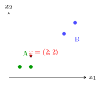
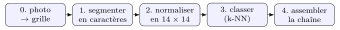

# TP et projets

<p class="sous-titre">Les $k$k plus proches voisins</p>

## <span class="etiquette">TP</span> Reconnaître des chiffres et des lettres manuscrits

!!! fichiers "Fichiers à télécharger"

    [:material-folder-open: dossier en ligne](https://github.com/MathThibaud/nsi-fichiers-eleves/tree/main/premiere/12-tp-ocr){ .md-button } [:material-zip-box: archive .zip](https://github.com/MathThibaud/nsi-fichiers-eleves/raw/main/zips/premiere-12-tp-ocr.zip){ .md-button }

*Un projet de l’année : une vraie application de ce qu’on apprend en cours.*

!!! remarque "Remarque — Où l’on va"

    Vous allez faire **reconnaître par la machine** de vrais chiffres et de vraies lettres **écrits à la main**. On avance en **deux temps** :

    1.  d’abord, on comprend l’algorithme des $k$ plus proches voisins sur un **tout petit exemple** de 4 points (qu’on peut vérifier à la main) ;

    2.  ensuite, on l’applique à des **images** — car une image n’est qu’une longue liste de nombres.

    À la toute fin, vous ferez reconnaître **votre propre** lettre, dessinée à la main. Suivez les **points d’étape** : ils indiquent ce que vous devez obtenir pour être sûr d’être sur la bonne voie.

!!! encadre "Avant de commencer : préparer le terrain"

    1.  Créez un dossier de travail. Placez-y les **quatre fichiers de données** à télécharger (lien ci-dessus) : `chiffres_train.csv`, `chiffres_test.csv`, `lettres_train.csv`, `lettres_test.csv`.

    2.  Dans le **même dossier**, placez le fichier fourni `ocr.py` : c’est la **trame** du programme (fonctions à trous, fonctions fournies et tests). C’est vous qui allez la compléter, morceau par morceau. En bas du fichier, des tests affichent `[OK]` ou `[A FAIRE]` pour chaque étape (au début, tout est `[A FAIRE]` : c’est normal) ; vos essais s’écrivent tout à la fin, sous les tests.

    3.  À chaque étape, on ajoute un bout de code, puis on le **teste** tout de suite.

    4.  Usage de l’IA : <span class="ia ia-rouge" title="Sans IA : le but est l'automatisme lui-même"></span> aucune dans la partie 1 (les fonctions `distance`, `k_plus_proches`, `vote` et `classer` sont le cœur de l’algorithme : vous les écrivez seul) ; <span class="ia ia-orange" title="IA en appui : déboguer, reformuler, vérifier ; la réponse finale est la vôtre"></span> en appui ensuite (comprendre un message d’erreur, analyser les résultats), chaque ligne de `ocr.py` étant écrite et comprise par vous. Voir la charte.

!!! remarque "Remarque — Source des données"

    Les images de **chiffres** proviennent de la base **MNIST** (Y. LeCun, C. Cortes, C. J. C. Burges), diffusée sous licence **Creative Commons BY-SA 3.0** ; les images de **lettres** proviennent de la base **EMNIST** (G. Cohen, S. Afshar, J. Tapson, A. van Schaik, 2017), issue de la *NIST Special Database 19*. Pour ce TP, elles ont été réduites à $14\times 14$ pixels en noir et blanc ; les fichiers ainsi obtenus sont diffusés sous la même licence (CC BY-SA 3.0).

## Comprendre le $k$-NN sur 4 points

<span class="ia ia-rouge" title="Sans IA : le but est l'automatisme lui-même"></span> *Ici, pas encore d’images : on apprend la mécanique de l’algorithme sur un exemple minuscule. Toute cette partie se fait **sans IA**.*

### 1.1 Le problème

On a **4 exemples** déjà étiquetés, décrits par deux nombres $(x_1 ; x_2)$, et rangés en deux classes `A` et `B` :

| **$x_1$** | **$x_2$** | **classe** |
|:---------:|:---------:|:----------:|
|     1     |     1     |     A      |
|     2     |     1     |     A      |
|     5     |     4     |     B      |
|     6     |     5     |     B      |

{ .tikz loading=lazy }

On veut deviner la classe du nouveau point **$x=(2 ; 2)$** (l’étoile rouge). À l’œil, il est clairement du côté des `A`… vérifions-le par le calcul.

### 1.2 À la main d’abord

La **distance au carré** entre deux points $(a_1;a_2)$ et $(b_1;b_2)$ vaut $(a_1-b_1)^2+(a_2-b_2)^2$.

1.  Recopier sur le cahier et compléter le tableau des distances au carré de $x=(2;2)$ aux 4 exemples :

    | exemple | classe |  calcul   | $d^2$ |
    |:-------:|:------:|:---------:|:-----:|
    |  (1;1)  |   A    | $1^2+1^2$ |   …   |
    |  (2;1)  |   A    | $0^2+1^2$ |   …   |
    |  (5;4)  |   B    | $3^2+2^2$ |   …   |
    |  (6;5)  |   B    | $4^2+3^2$ |   …   |

2.  Quel est le **plus proche** voisin ? En déduire la prédiction du $1$-NN.

3.  Quels sont les **3 plus proches** ? Faire voter leur classe : que prédit le $3$-NN ?

### 1.3 La distance, en Python

Dans `ocr.py`, on représente un point par une **liste** (ex. `[2, 2]`). Compléter la fonction qui calcule la distance au carré. *Attention :* dans `ocr.py`, cette fonction s’appelle `distance`, mais, contrairement à la fonction `distance` du cours, elle renvoie la distance **au carré** $d^2$, sans racine : pour *comparer* des distances, c’est suffisant (et plus rapide).

```python
def distance(a, b):
    """somme des ecarts au carre, coordonnee par coordonnee"""
    s = 0
    for i in range(len(a)):
        s = s + ...............     # (a) l'ecart au carre sur la coordonnee i
    return s
```

<span class="run" title="À programmer et tester sur machine">▶</span>  Compléter le trou **(a)**, puis **tester** :

```text
>>> distance([1, 1], [2, 2])
2
```

**Point d’étape  ✓** `distance([1, 1], [2, 2])` doit renvoyer **2** (car $1^2+1^2=2$). Si vous obtenez autre chose, revoyez le trou (a).

### 1.4 Trouver les $k$ plus proches voisins

On range les exemples dans une liste de couples `(descripteurs, classe)` :

```python
exemples = [([1,1], "A"), ([2,1], "A"), ([5,4], "B"), ([6,5], "B")]
```

La fonction suivante calcule la distance de `x` à chaque exemple, trie du plus proche au plus lointain, et renvoie les classes des `k` premiers :

```python
def k_plus_proches(exemples, x, k):
    dists = []
    for descripteurs, classe in exemples:
        dists.append(( ................ , classe))   # (b) distance de x a cet exemple
    dists.sort(key=lambda couple: ........)          # (c) tri par la distance
    return [classe for (d, classe) in dists[:k]]     # les k plus proches
```

<span class="run" title="À programmer et tester sur machine">▶</span>  Compléter **(b)** et **(c)** (la clé de tri d’un couple est son premier élément, la distance), puis tester :

```text
>>> k_plus_proches(exemples, [2, 2], 3)
['A', 'A', 'B']
```

**Point d’étape  ✓** Vous devez obtenir `[’A’, ’A’, ’B’]` : les 3 plus proches de $(2;2)$ sont les deux `A` puis un `B`. C’est exactement ce que vous aviez trouvé à la main en 1.2 !

### 1.5 Le vote majoritaire

Il reste à choisir la classe **la plus fréquente** parmi ces voisins. On compte les occurrences dans un **dictionnaire** :

```python
def vote(classes):
    compte = {}
    for c in classes:
        compte[c] = ...............      # (d) ajouter 1 au compteur de c
    meilleure = None
    for c in compte:
        if meilleure is None or compte[c] > compte[meilleure]:
            meilleure = c
    return meilleure
```

<span class="run" title="À programmer et tester sur machine">▶</span>  Compléter **(d)** (indice : `compte.get(c, 0)` donne le compteur actuel de `c`, ou 0). Tester :

```text
>>> vote(["A", "B", "A"])
'A'
```

### 1.6 Assembler : `classer`

Dans `ocr.py`, compléter `classer` : elle tient en une ligne.

```python
def classer(exemples, x, k):
    return vote(k_plus_proches(exemples, x, k))
```

<span class="run" title="À programmer et tester sur machine">▶</span>  Tester :

```text
>>> classer(exemples, [2, 2], 3)
'A'
```

**Point d’étape  ✓** Vous venez d’écrire un classifieur $k$-NN complet ! Il tient en trois petites fonctions : `distance`, `k_plus_proches`, `vote`. La suite ne change *rien* à ces fonctions : on va juste leur donner des **images** au lieu de points.

## Une image est une liste de nombres

### 2.1 Charger les données

La fonction de chargement est fournie dans `ocr.py` (elle réutilise vos compétences « données en tables ») : chaque ligne d’un CSV donne une **étiquette** puis les **pixels**.

```python
import csv
TAILLE = 14

def charger(fichier):
    donnees = []
    with open(fichier, encoding="utf-8", newline="") as f:
        lecteur = csv.reader(f)
        next(lecteur)                        # sauter la ligne d'en-tete
        for ligne in lecteur:
            etiquette = ligne[0]
            pixels = [int(v) for v in ligne[1:]]
            donnees.append((pixels, etiquette))
    return donnees
```

<span class="run" title="À programmer et tester sur machine">▶</span>  Charger les chiffres et vérifier la taille :

```text
>>> train = charger("chiffres_train.csv")
>>> test = charger("chiffres_test.csv")
>>> len(train), len(test)
(3000, 500)
```

**Point d’étape  ✓** Vous devez obtenir **3000** exemples d’entraînement et **500** de test. Si Python dit `FileNotFoundError`, c’est que les CSV ne sont pas dans le même dossier que `ocr.py`.

### 2.2 Voir ce que la machine voit

Chaque image est déjà, exactement comme en partie 1, un **couple (pixels, étiquette)** — sauf que `pixels` contient maintenant **196 nombres** (des 0 et des 1). La fonction suivante, fournie dans `ocr.py`, dessine une image en « art ASCII » :

```python
def afficher(pixels):
    for l in range(TAILLE):
        ligne = ""
        for c in range(TAILLE):
            if pixels[l * TAILLE + c] == 1:
                ligne = ligne + "#"     # encre
            else:
                ligne = ligne + "."     # blanc
        print(ligne)
```

<span class="run" title="À programmer et tester sur machine">▶</span>  Afficher la première image d’entraînement et son étiquette :

```python
pixels, etiquette = train[0]
afficher(pixels)
print("etiquette :", etiquette)
```

Vous devez voir apparaître un chiffre manuscrit :

```text
..............
..............
....######....
...########...
...#.....###..
..........##..
..........##..
..##.....###..
..#####..##...
..#..######...
..#########...
..######......
..............
..............
etiquette : 2
```

### 2.3 Pourquoi 196 nombres ?

1.  L’image fait $14$ pixels de large sur $14$ de haut. Combien de pixels en tout ? Vérifier avec `len(pixels)`.

2.  Que valent les nombres de la liste ? Que représentent un `1` et un `0` ?

### 2.4 La distance mesure la ressemblance

Reprenons *la même* fonction `distance` qu’en partie 1 : elle marche aussi bien sur des listes de 196 nombres ! Deux images se ressemblent si elles diffèrent sur **peu** de pixels.

1.  <span class="run" title="À programmer et tester sur machine">▶</span>  Récupérer les deux premières images de chiffre **« 0 »** et la première image de **« 1 »** du jeu d’entraînement (dans des variables `zero_a`, `zero_b` et `un`), puis comparer :

    ```text
    >>> distance(zero_a, zero_b)     # deux "0" entre eux
    39
    >>> distance(zero_a, un)         # un "0" et un "1"
    51
    ```

2.  Laquelle des deux distances est la plus petite ? Expliquer pourquoi c’est **rassurant** pour reconnaître les chiffres.

**Point d’étape  ✓** Deux « 0 » sont *plus proches* l’un de l’autre qu’un « 0 » et un « 1 ». C’est toute l’idée : le bon chiffre est celui des voisins qui **ressemblent** le plus.

## Reconnaître les chiffres

### 3.1 Classer une image

<span class="run" title="À programmer et tester sur machine">▶</span>  Prendre une image de **test** (que le programme n’a jamais vue), l’afficher, et demander sa classe au $k$-NN avec $k=3$ :

```python
pixels, vraie = test[0]
afficher(pixels)
print("vraie :", vraie, "  predite :", classer(train, pixels, 3))
```

**Point d’étape  ✓** La classe **prédite** doit coïncider avec la **vraie** étiquette. La machine vient de reconnaître un chiffre qu’elle n’avait jamais vu, uniquement en le comparant à ses 3 voisins les plus proches.

### 3.2 Sur plusieurs images

<span class="run" title="À programmer et tester sur machine">▶</span>  Classer les **10** premières images de test et compter les bonnes réponses :

```python
bons = 0
for pixels, vraie in test[:10]:
    if classer(train, pixels, 3) == vraie:
        bons = bons + 1
print(bons, "bonnes reponses sur 10")
```

### 3.3 Le taux de réussite

<span class="run" title="À programmer et tester sur machine">▶</span>  Écrire une fonction qui calcule la **proportion** de bonnes réponses. *Attention :* classer beaucoup d’images est **lent** (le $k$-NN recompare tout à chaque fois) ; on se limite donc aux `limite` premières images de test.

```python
def taux_reussite(exemples, tests, k, limite=100):
    tests = tests[:limite]
    bons = 0
    for pixels, vraie in tests:
        if ....................... :       # (e) la prediction est-elle correcte ?
            bons = bons + 1
    return bons / len(tests)
```

<span class="run" title="À programmer et tester sur machine">▶</span>  Compléter **(e)** et lancer (cela prend quelques dizaines de secondes) :

```text
>>> taux_reussite(train, test, 3, 100)
0.97
```

**Point d’étape  ✓** Vous devez obtenir environ **0.92 à 0.97**, c’est-à-dire **plus de 9 chiffres sur 10** correctement reconnus — avec quelques lignes de Python et *sans* aucune bibliothèque d’intelligence artificielle !

### 3.4 L’influence de $k$

<span class="run" title="À programmer et tester sur machine">▶</span>  Mesurer le taux (100 premiers tests) pour plusieurs valeurs de $k$, puis recopier et compléter le tableau sur le cahier :

| $k$  |  1  |  3  |  5  |  7  |
|:----:|:---:|:---:|:---:|:---:|
| taux |     |     |     |     |

Le taux change-t-il beaucoup ? Essayer aussi un $k$ **énorme** (`k = 500`) : que se passe-t-il, et pourquoi ?

## Aller plus loin

### 4.1 Regarder les erreurs

<span class="run" title="À programmer et tester sur machine">▶</span>  Afficher les images **mal classées** parmi les 100 premières :

```python
for pixels, vraie in test[:100]:
    predite = classer(train, pixels, 3)
    if predite != vraie:
        afficher(pixels)
        print("vraie :", vraie, "  predite :", predite, "\n")
```

Choisir une erreur et l’expliquer : le chiffre est-il mal écrit ? ressemble-t-il vraiment à celui prédit ? Ces erreurs vous semblent-elles **compréhensibles** ?

### 4.2 Et les lettres ?

<span class="run" title="À programmer et tester sur machine">▶</span>  Refaire les étapes 3.3 et 3.4 avec les **lettres** (prendre plutôt $k=5$) :

```python
trainL = charger("lettres_train.csv")
testL = charger("lettres_test.csv")
print(taux_reussite(trainL, testL, 5, 100))
```

1.  Le taux est-il meilleur ou moins bon que pour les chiffres ? Proposer **deux** raisons (combien de classes pour les chiffres ? pour les lettres ?).

2.  Quelles **confusions** de lettres vous semblent inévitables (O/Q, I/L, U/V…) ?

## Défi — *dessine ta propre lettre*

L’outil suivant, fourni dans `ocr.py`, transforme une grille dessinée à la main en image (`’#’` $=$ encre) :

```python
def grille_vers_vecteur(grille):
    pixels = []
    for ligne in grille:
        for c in ligne:
            if c in "#1X*":
                pixels.append(1)     # encre
            else:
                pixels.append(0)     # blanc
    return pixels
```

<span class="run" title="À programmer et tester sur machine">▶</span>  Dessiner votre lettre dans une grille de **14 lignes de 14 caractères**, puis la faire reconnaître :

```python
ma_lettre = [
    "..............",
    "..............",
    "..#########...",
    "..#########...",
    "......###.....",
    "......###.....",
    "......###.....",
    "......###.....",
    "......###.....",
    "......###.....",
    "......###.....",
    "..............",
    "..............",
    "..............",
]
x = grille_vers_vecteur(ma_lettre)
afficher(x)
print("reconnue comme :", classer(trainL, x, 5))
```

1.  Cette grille dessine un `T`. Est-il reconnu ? Dessinez ensuite **vos initiales** et testez.

2.  Les lettres arrondies (`O`, `C`) dessinées de façon anguleuse sont souvent mal reconnues. Et si votre lettre est **mal centrée** ou trop **fine** ? Expliquer, en pensant que la distance compare *pixel par pixel, à la même position*.

## Bilan

En une poignée de fonctions, sans aucune bibliothèque d’« intelligence artificielle », vous avez construit un **reconnaisseur d’écriture manuscrite**. C’est exactement l’idée qui a longtemps servi à lire les **codes postaux** et les **chèques**. À retenir : les fonctions `distance`, `k_plus_proches` et `vote` sont **les mêmes** pour 4 points ou pour des images — seule change la **longueur** des listes. Et la limite du $k$-NN : il doit **tout garder** en mémoire et **tout recomparer** à chaque image (c’est lent sur de très grandes bases).

??? corrige "Corrigé de l'activité"

    **1.2 À la main.** **1.** Distances au carré de $x=(2;2)$ :

    | exemple | classe |          $d^2$          |                             |
    |:-------:|:------:|:-----------------------:|:---------------------------:|
    |  (1;1)  |   A    | $1^2+1^2 = \textbf{2}$  |                             |
    |  (2;1)  |   A    | $0^2+1^2 = \textbf{1}$  | $\leftarrow$ le plus proche |
    |  (5;4)  |   B    | $3^2+2^2 = \textbf{13}$ |                             |
    |  (6;5)  |   B    | $4^2+3^2 = \textbf{25}$ |                             |

    **2.** Le plus proche est $(2;1)$, de classe `A` $\to$ le $1$-NN prédit **A**. **3.** Les 3 plus proches : $(2;1)$ A, $(1;1)$ A, $(5;4)$ B $\to$ vote 2 A contre 1 B $\to$ le $3$-NN prédit **A**.

    **1.3 — 1.6 Les trous.** **(a)** `(a[i] - b[i]) ** 2` **(b)** `distance(x, descripteurs)` **(c)** `couple[0]` **(d)** `compte.get(c, 0) + 1`. Ici, la fonction `distance` de `ocr.py` renvoie la distance **au carré** $d^2$ (sans racine, contrairement à celle du cours) : pour comparer des distances, cela suffit.

    ```python
    def distance(a, b):
        s = 0
        for i in range(len(a)):
            s = s + (a[i] - b[i]) ** 2
        return s

    def k_plus_proches(exemples, x, k):
        dists = []
        for descripteurs, classe in exemples:
            dists.append((distance(x, descripteurs), classe))
        dists.sort(key=lambda couple: couple[0])
        return [classe for (d, classe) in dists[:k]]

    def vote(classes):
        compte = {}
        for c in classes:
            compte[c] = compte.get(c, 0) + 1
        meilleure = None
        for c in compte:
            if meilleure is None or compte[c] > compte[meilleure]:
                meilleure = c
        return meilleure
    ```

    Les tests attendus, cohérents avec le calcul à la main :

    - `distance([1,1],[2,2])` $=2$ ;

    - `k_plus_proches(exemples,[2,2],3)` $=$ `[’A’,’A’,’B’]` ;

    - `vote(["A","B","A"])` $=$ `’A’` ;

    - `classer(exemples,[2,2],3)` $=$ `’A’`.

    **2.1** `len(train), len(test)` $=$ **(3000, 500)**.

    **2.2** La première image d’entraînement est un **2** (étiquette `’2’`) ; le jeu compte 300 images de chacun des 10 chiffres.

    **2.3** **1.** $14\times14 = \textbf{196}$ pixels ; `len(pixels)` vaut 196. **2.** Chaque nombre vaut **0** (pixel blanc) ou **1** (pixel d’encre).

    **2.4** **1.** Les images s’obtiennent par exemple avec `zeros = [p for (p, e) in train if e == "0"]`, puis `zero_a = zeros[0]`, `zero_b = zeros[1]` (de même pour `un`). **2.** La distance entre deux « 0 » ($=39$) est **plus petite** que celle entre un « 0 » et un « 1 » ($=51$). C’est rassurant : deux images du **même** chiffre se ressemblent (peu de pixels diffèrent), donc elles sont *proches* au sens de la distance — c’est précisément ce qui permet au $k$-NN de reconnaître le bon chiffre.

    **3.1 / 3.2** `test[0]` est un **1**, prédit **1**. Sur les 10 premières images de test : **10 bonnes réponses sur 10**.

    **3.3** Trou **(e)** : `classer(exemples, pixels, k) == vraie`.

    ```python
    def taux_reussite(exemples, tests, k, limite=100):
        tests = tests[:limite]
        bons = 0
        for pixels, vraie in tests:
            if classer(exemples, pixels, k) == vraie:
                bons = bons + 1
        return bons / len(tests)
    ```

    On obtient **0,97** sur les 100 premiers tests (plus de 9 chiffres sur 10).

    **3.4** Pour les chiffres, le taux est **très stable**, entre 95 et 97 % :

    | $k$  |  1   |  3   |  5   |  7   |
    |:----:|:----:|:----:|:----:|:----:|
    | taux | 0,95 | 0,97 | 0,95 | 0,96 |

    Avec $k=500$, on fait voter des voisins très **lointains**, qui sont souvent d’autres chiffres : la réponse dépend de moins en moins de l’image et le taux **chute** nettement (**0,69** sur les 100 premiers tests). À la limite, si tous les exemples votaient, chaque chiffre aurait ses 300 voix et le vote ne départagerait plus rien.

    **4.1** Les images mal classées sont souvent des chiffres **mal écrits** ou **ambigus** (un 4 ouvert ressemble à un 9, un 3 à un 5…). Les erreurs sont **compréhensibles** : la machine confond ce qu’un humain trouverait *aussi* ambigu.

    **4.2** Le taux des lettres est **moins bon** : **0,70** avec $k=5$ sur les 100 premiers tests. Deux raisons : il y a **26 classes** de lettres contre seulement **10** de chiffres, et les lettres manuscrites ont des formes **plus variées et plus proches** les unes des autres. Confusions inévitables : **O/Q**, **I/L**, **U/V**, **O/C**…

    **1.** Le `T` fourni est bien reconnu comme `T`. Les initiales fonctionnent d’autant mieux qu’elles sont **épaisses** et **centrées**. **2.** La distance compare les images **pixel par pixel, à la même position**. Une lettre **mal centrée** ou trop **fine** n’a presque aucun pixel « en commun » avec les exemples de la même lettre : sa distance à *tous* les exemples devient grande et la prédiction déraille. Les formes arrondies dessinées de façon anguleuse tombent près d’autres lettres. C’est la limite du $k$-NN sur les images brutes : il ne « comprend » pas la forme, il compare des pixels.

??? corrige "Corrigé de l'activité"

    **1.2 À la main.** **1.** Distances au carré de $x=(2;2)$ :

    | exemple | classe |          $d^2$          |                             |
    |:-------:|:------:|:-----------------------:|:---------------------------:|
    |  (1;1)  |   A    | $1^2+1^2 = \textbf{2}$  |                             |
    |  (2;1)  |   A    | $0^2+1^2 = \textbf{1}$  | $\leftarrow$ le plus proche |
    |  (5;4)  |   B    | $3^2+2^2 = \textbf{13}$ |                             |
    |  (6;5)  |   B    | $4^2+3^2 = \textbf{25}$ |                             |

    **2.** Le plus proche est $(2;1)$, de classe `A` $\to$ le $1$-NN prédit **A**. **3.** Les 3 plus proches : $(2;1)$ A, $(1;1)$ A, $(5;4)$ B $\to$ vote 2 A contre 1 B $\to$ le $3$-NN prédit **A**.

    **1.3 — 1.6 Les trous.** **(a)** `(a[i] - b[i]) ** 2` **(b)** `distance(x, descripteurs)` **(c)** `couple[0]` **(d)** `compte.get(c, 0) + 1`. Ici, la fonction `distance` de `ocr.py` renvoie la distance **au carré** $d^2$ (sans racine, contrairement à celle du cours) : pour comparer des distances, cela suffit.

    ```python
    def distance(a, b):
        s = 0
        for i in range(len(a)):
            s = s + (a[i] - b[i]) ** 2
        return s

    def k_plus_proches(exemples, x, k):
        dists = []
        for descripteurs, classe in exemples:
            dists.append((distance(x, descripteurs), classe))
        dists.sort(key=lambda couple: couple[0])
        return [classe for (d, classe) in dists[:k]]

    def vote(classes):
        compte = {}
        for c in classes:
            compte[c] = compte.get(c, 0) + 1
        meilleure = None
        for c in compte:
            if meilleure is None or compte[c] > compte[meilleure]:
                meilleure = c
        return meilleure
    ```

    Les tests attendus, cohérents avec le calcul à la main :

    - `distance([1,1],[2,2])` $=2$ ;

    - `k_plus_proches(exemples,[2,2],3)` $=$ `[’A’,’A’,’B’]` ;

    - `vote(["A","B","A"])` $=$ `’A’` ;

    - `classer(exemples,[2,2],3)` $=$ `’A’`.

    **2.1** `len(train), len(test)` $=$ **(3000, 500)**.

    **2.2** La première image d’entraînement est un **2** (étiquette `’2’`) ; le jeu compte 300 images de chacun des 10 chiffres.

    **2.3** **1.** $14\times14 = \textbf{196}$ pixels ; `len(pixels)` vaut 196. **2.** Chaque nombre vaut **0** (pixel blanc) ou **1** (pixel d’encre).

    **2.4** **1.** Les images s’obtiennent par exemple avec `zeros = [p for (p, e) in train if e == "0"]`, puis `zero_a = zeros[0]`, `zero_b = zeros[1]` (de même pour `un`). **2.** La distance entre deux « 0 » ($=39$) est **plus petite** que celle entre un « 0 » et un « 1 » ($=51$). C’est rassurant : deux images du **même** chiffre se ressemblent (peu de pixels diffèrent), donc elles sont *proches* au sens de la distance — c’est précisément ce qui permet au $k$-NN de reconnaître le bon chiffre.

    **3.1 / 3.2** `test[0]` est un **1**, prédit **1**. Sur les 10 premières images de test : **10 bonnes réponses sur 10**.

    **3.3** Trou **(e)** : `classer(exemples, pixels, k) == vraie`.

    ```python
    def taux_reussite(exemples, tests, k, limite=100):
        tests = tests[:limite]
        bons = 0
        for pixels, vraie in tests:
            if classer(exemples, pixels, k) == vraie:
                bons = bons + 1
        return bons / len(tests)
    ```

    On obtient **0,97** sur les 100 premiers tests (plus de 9 chiffres sur 10).

    **3.4** Pour les chiffres, le taux est **très stable**, entre 95 et 97 % :

    | $k$  |  1   |  3   |  5   |  7   |
    |:----:|:----:|:----:|:----:|:----:|
    | taux | 0,95 | 0,97 | 0,95 | 0,96 |

    Avec $k=500$, on fait voter des voisins très **lointains**, qui sont souvent d’autres chiffres : la réponse dépend de moins en moins de l’image et le taux **chute** nettement (**0,69** sur les 100 premiers tests). À la limite, si tous les exemples votaient, chaque chiffre aurait ses 300 voix et le vote ne départagerait plus rien.

    **4.1** Les images mal classées sont souvent des chiffres **mal écrits** ou **ambigus** (un 4 ouvert ressemble à un 9, un 3 à un 5…). Les erreurs sont **compréhensibles** : la machine confond ce qu’un humain trouverait *aussi* ambigu.

    **4.2** Le taux des lettres est **moins bon** : **0,70** avec $k=5$ sur les 100 premiers tests. Deux raisons : il y a **26 classes** de lettres contre seulement **10** de chiffres, et les lettres manuscrites ont des formes **plus variées et plus proches** les unes des autres. Confusions inévitables : **O/Q**, **I/L**, **U/V**, **O/C**…

    **1.** Le `T` fourni est bien reconnu comme `T`. Les initiales fonctionnent d’autant mieux qu’elles sont **épaisses** et **centrées**. **2.** La distance compare les images **pixel par pixel, à la même position**. Une lettre **mal centrée** ou trop **fine** n’a presque aucun pixel « en commun » avec les exemples de la même lettre : sa distance à *tous* les exemples devient grande et la prédiction déraille. Les formes arrondies dessinées de façon anguleuse tombent près d’autres lettres. C’est la limite du $k$-NN sur les images brutes : il ne « comprend » pas la forme, il compare des pixels.

??? corrige "Corrigé de l'activité"

    **1.2 À la main.** **1.** Distances au carré de $x=(2;2)$ :

    | exemple | classe |          $d^2$          |                             |
    |:-------:|:------:|:-----------------------:|:---------------------------:|
    |  (1;1)  |   A    | $1^2+1^2 = \textbf{2}$  |                             |
    |  (2;1)  |   A    | $0^2+1^2 = \textbf{1}$  | $\leftarrow$ le plus proche |
    |  (5;4)  |   B    | $3^2+2^2 = \textbf{13}$ |                             |
    |  (6;5)  |   B    | $4^2+3^2 = \textbf{25}$ |                             |

    **2.** Le plus proche est $(2;1)$, de classe `A` $\to$ le $1$-NN prédit **A**. **3.** Les 3 plus proches : $(2;1)$ A, $(1;1)$ A, $(5;4)$ B $\to$ vote 2 A contre 1 B $\to$ le $3$-NN prédit **A**.

    **1.3 — 1.6 Les trous.** **(a)** `(a[i] - b[i]) ** 2` **(b)** `distance(x, descripteurs)` **(c)** `couple[0]` **(d)** `compte.get(c, 0) + 1`. Ici, la fonction `distance` de `ocr.py` renvoie la distance **au carré** $d^2$ (sans racine, contrairement à celle du cours) : pour comparer des distances, cela suffit.

    ```python
    def distance(a, b):
        s = 0
        for i in range(len(a)):
            s = s + (a[i] - b[i]) ** 2
        return s

    def k_plus_proches(exemples, x, k):
        dists = []
        for descripteurs, classe in exemples:
            dists.append((distance(x, descripteurs), classe))
        dists.sort(key=lambda couple: couple[0])
        return [classe for (d, classe) in dists[:k]]

    def vote(classes):
        compte = {}
        for c in classes:
            compte[c] = compte.get(c, 0) + 1
        meilleure = None
        for c in compte:
            if meilleure is None or compte[c] > compte[meilleure]:
                meilleure = c
        return meilleure
    ```

    Les tests attendus, cohérents avec le calcul à la main :

    - `distance([1,1],[2,2])` $=2$ ;

    - `k_plus_proches(exemples,[2,2],3)` $=$ `[’A’,’A’,’B’]` ;

    - `vote(["A","B","A"])` $=$ `’A’` ;

    - `classer(exemples,[2,2],3)` $=$ `’A’`.

    **2.1** `len(train), len(test)` $=$ **(3000, 500)**.

    **2.2** La première image d’entraînement est un **2** (étiquette `’2’`) ; le jeu compte 300 images de chacun des 10 chiffres.

    **2.3** **1.** $14\times14 = \textbf{196}$ pixels ; `len(pixels)` vaut 196. **2.** Chaque nombre vaut **0** (pixel blanc) ou **1** (pixel d’encre).

    **2.4** **1.** Les images s’obtiennent par exemple avec `zeros = [p for (p, e) in train if e == "0"]`, puis `zero_a = zeros[0]`, `zero_b = zeros[1]` (de même pour `un`). **2.** La distance entre deux « 0 » ($=39$) est **plus petite** que celle entre un « 0 » et un « 1 » ($=51$). C’est rassurant : deux images du **même** chiffre se ressemblent (peu de pixels diffèrent), donc elles sont *proches* au sens de la distance — c’est précisément ce qui permet au $k$-NN de reconnaître le bon chiffre.

    **3.1 / 3.2** `test[0]` est un **1**, prédit **1**. Sur les 10 premières images de test : **10 bonnes réponses sur 10**.

    **3.3** Trou **(e)** : `classer(exemples, pixels, k) == vraie`.

    ```python
    def taux_reussite(exemples, tests, k, limite=100):
        tests = tests[:limite]
        bons = 0
        for pixels, vraie in tests:
            if classer(exemples, pixels, k) == vraie:
                bons = bons + 1
        return bons / len(tests)
    ```

    On obtient **0,97** sur les 100 premiers tests (plus de 9 chiffres sur 10).

    **3.4** Pour les chiffres, le taux est **très stable**, entre 95 et 97 % :

    | $k$  |  1   |  3   |  5   |  7   |
    |:----:|:----:|:----:|:----:|:----:|
    | taux | 0,95 | 0,97 | 0,95 | 0,96 |

    Avec $k=500$, on fait voter des voisins très **lointains**, qui sont souvent d’autres chiffres : la réponse dépend de moins en moins de l’image et le taux **chute** nettement (**0,69** sur les 100 premiers tests). À la limite, si tous les exemples votaient, chaque chiffre aurait ses 300 voix et le vote ne départagerait plus rien.

    **4.1** Les images mal classées sont souvent des chiffres **mal écrits** ou **ambigus** (un 4 ouvert ressemble à un 9, un 3 à un 5…). Les erreurs sont **compréhensibles** : la machine confond ce qu’un humain trouverait *aussi* ambigu.

    **4.2** Le taux des lettres est **moins bon** : **0,70** avec $k=5$ sur les 100 premiers tests. Deux raisons : il y a **26 classes** de lettres contre seulement **10** de chiffres, et les lettres manuscrites ont des formes **plus variées et plus proches** les unes des autres. Confusions inévitables : **O/Q**, **I/L**, **U/V**, **O/C**…

    **1.** Le `T` fourni est bien reconnu comme `T`. Les initiales fonctionnent d’autant mieux qu’elles sont **épaisses** et **centrées**. **2.** La distance compare les images **pixel par pixel, à la même position**. Une lettre **mal centrée** ou trop **fine** n’a presque aucun pixel « en commun » avec les exemples de la même lettre : sa distance à *tous* les exemples devient grande et la prédiction déraille. Les formes arrondies dessinées de façon anguleuse tombent près d’autres lettres. C’est la limite du $k$-NN sur les images brutes : il ne « comprend » pas la forme, il compare des pixels.

## <span class="etiquette">Projet</span> Lire une plaque d’immatriculation

!!! fichiers "Fichiers à télécharger"

    [:material-folder-open: dossier en ligne](https://github.com/MathThibaud/nsi-fichiers-eleves/tree/main/premiere/12-projet-plaque){ .md-button } [:material-zip-box: archive .zip](https://github.com/MathThibaud/nsi-fichiers-eleves/raw/main/zips/premiere-12-projet-plaque.zip){ .md-button }

!!! remarque "Remarque — Le but"

    Vous savez faire reconnaître *un* caractère par le $k$-NN (TP précédent). Ici, on construit la **chaîne complète** qui lit une **plaque entière**, depuis une **photo** jusqu’au **texte**. On **suppose** qu’on dispose d’une photo ne montrant **que la plaque** (rien autour), bien nette.

    { .tikz loading=lazy }

    On avance étape par étape, en testant à chaque fois. On réutilise votre fichier `ocr.py` du TP OCR (fonctions `charger`, `classer`, `afficher`) ; on complète le fichier fourni `plaque.py`, placé dans le même dossier : c’est la **trame** du projet (fonctions à trous, fonctions fournies et tests qui affichent `[OK]` ou `[A FAIRE]` à chaque lancement). Autres fichiers fournis : `plaque_photo.png` (une photo de plaque), `caracteres_train.csv` (caractères imprimés), `image_vers_grille.py` (outil). Vos essais de `ocr.py` doivent rester sous la ligne `if __name__ == ’__main__’:` de la fin : sinon, ils seraient relancés à chaque `import`.

!!! remarque "Remarque — Usage de l’IA"

    <span class="ia ia-rouge" title="Sans IA : le but est l'automatisme lui-même"></span> **Sans IA** : la binarisation à la main (0.1) et les trous **(a)**, **(b)**, **(c)** à compléter — ce sont les gestes à savoir refaire seul. <span class="ia ia-orange" title="IA en appui : déboguer, reformuler, vérifier ; la réponse finale est la vôtre"></span> **En appui** pour le reste (comprendre un message d’erreur, analyser le seuil et les limites) : ce que vous écrivez, vous devez pouvoir l’expliquer. Voir la charte.

## Étape 0 — De la photo à la grille (binarisation)

Une image en **niveaux de gris** est une grille de **nombres** de **0** (noir) à **255** (blanc). **Binariser**, c’est décider pour chaque pixel s’il est de l’**encre** ou du **fond**, avec un **seuil** : *pixel sombre (valeur $<$ seuil) $\rightarrow$ encre (1)*, sinon fond (0).

### 0.1 Binariser (à la main puis en Python)

Voici une petite image $6\times6$ en niveaux de gris (un « T ») :

| 20  | 20  | 20  | 20  | 20  | 20  |
|:---:|:---:|:---:|:---:|:---:|:---:|
| 220 | 220 | 30  | 30  | 220 | 220 |
| 220 | 220 | 30  | 30  | 220 | 220 |
| 220 | 220 | 30  | 30  | 220 | 220 |
| 220 | 220 | 30  | 30  | 220 | 220 |
| 220 | 220 | 220 | 220 | 220 | 220 |

1.  **À la main**, binariser avec le **seuil 100** (1 si valeur $<100$). Quelle lettre apparaît ?

2.  <span class="run" title="À programmer et tester sur machine">▶</span>  Compléter `binariser` (trou **(a)**) dans `plaque.py` :

    ```python
    def binariser(gris, seuil=100):
        """gris : grille de nombres 0-255. Renvoie une grille de 0/1."""
        grille = []
        for ligne in gris:
            nouvelle = []
            for valeur in ligne:
                if ...............:          # (a) le pixel est-il sombre ?
                    nouvelle.append(1)       # encre
                else:
                    nouvelle.append(0)       # fond
            grille.append(nouvelle)
        return grille
    ```

### 0.2 Sur une vraie image (avec Pillow)

Pour ouvrir un fichier `.png`, on utilise la bibliothèque **Pillow**, via l’outil fourni :

```python
from image_vers_grille import charger_image_gris, enregistrer_grille
# charger_image_gris(fichier) -> grille de niveaux de gris (0 a 255)
```

<span class="run" title="À programmer et tester sur machine">▶</span>  Charger la photo, regarder deux pixels, puis binariser et afficher :

```python
gris = charger_image_gris("plaque_photo.png")
print("un pixel de FOND :", gris[2][2], "  un pixel de TEXTE :", gris[20][15])
grille = binariser(gris, 100)
afficher_grille(grille)          # afficher_grille : voir l'etape 1 ci-dessous
```

**Point d’étape  ✓** Le fond (clair) donne une grande valeur ($194$), le texte (sombre) une petite ($45$ pour ce pixel ; selon les pixels, le texte va de $0$ à environ $140$, car les bords des caractères sont gris). Après `binariser`, on voit apparaître la plaque en `’#’`/`’.’`.

## Étape 1 — Segmenter par projection

On dispose maintenant d’une grille de 0/1. Pour la découper en caractères : **entre deux caractères, il y a une colonne sans encre**. On compte donc l’encre de chaque colonne (la « **projection** ») ; les caractères sont les groupes de colonnes où ce total est $>0$.

```python
def afficher_grille(grille):
    for ligne in grille:
        texte = ""
        for v in ligne:
            if v == 1:
                texte = texte + "#"     # encre
            else:
                texte = texte + "."     # fond
        print(texte)

def segmenter(grille):
    """Renvoie la liste des (debut, fin) de colonnes de chaque caractere."""
    hauteur = len(grille)
    largeur = len(grille[0])
    encre = []
    for x in range(largeur):
        total = 0
        for y in range(hauteur):
            total = total + ...............     # (b) le pixel (y, x)
        encre.append(total)
    segments = []
    x = 0
    while x < largeur:
        if encre[x] > 0:
            debut = x
            while x < largeur and encre[x] > 0:
                x = x + 1
            if x - debut >= 3:         # ignorer les traits trop fins (bruit)
                segments.append((debut, x))
        else:
            x = x + 1
    return segments
```

<span class="run" title="À programmer et tester sur machine">▶</span>  Compléter **(b)**, puis :

```text
>>> len(segmenter(binariser(charger_image_gris("plaque_photo.png"), 100)))
7
```

**Point d’étape  ✓** On doit trouver **7 segments** pour une plaque de 7 caractères.

## Étape 2 — Normaliser en $14\times14$

Chaque caractère découpé a une taille quelconque : il faut le ramener au **format d’entraînement** ($14\times14$). On donne les deux fonctions :

```python
def decouper(grille, debut, fin):
    """Extrait le caractere entre les colonnes debut et fin, recadre en hauteur."""
    colonnes = []
    for ligne in grille:
        colonnes.append(ligne[debut:fin])
    haut = 0
    while 1 not in colonnes[haut]:       # premiere ligne avec de l'encre
        haut = haut + 1
    bas = len(colonnes) - 1
    while 1 not in colonnes[bas]:        # derniere ligne avec de l'encre
        bas = bas - 1
    return colonnes[haut:bas + 1]

def redimensionner(sous_grille, N=14):
    """Ramene la sous-grille a N x N (moyenne par bloc) -> liste de N*N pixels."""
    h = len(sous_grille)
    w = len(sous_grille[0])
    vecteur = []
    for i in range(N):
        for j in range(N):
            # le bloc de la sous-grille qui devient le pixel (i, j)
            y0 = i * h // N
            y1 = max(y0 + 1, (i + 1) * h // N)
            x0 = j * w // N
            x1 = max(x0 + 1, (j + 1) * w // N)
            total = 0
            for y in range(y0, y1):
                for x in range(x0, x1):
                    total = total + sous_grille[y][x]
            aire = (y1 - y0) * (x1 - x0)
            if 2 * total >= aire:        # majorite d'encre
                vecteur.append(1)
            else:
                vecteur.append(0)
    return vecteur
```

<span class="run" title="À programmer et tester sur machine">▶</span>  Découper et redimensionner le **premier** caractère, puis l’afficher avec `afficher` (de `ocr.py`). Reconnaissez-vous un « A » de $14\times14$ ? Pourquoi doit-on absolument obtenir 196 pixels ? (indice : la fonction `distance` compare des listes…)

## Étape 3 et 4 — Classer et assembler

Une plaque est écrite en **police imprimée**. On l’entraîne donc sur des caractères **imprimés** (chiffres et lettres, plusieurs polices), rassemblés dans le fichier `caracteres_train.csv`.

```python
from ocr import charger, classer, afficher

def lire_plaque(fichier_image, exemples, seuil=100, k=3):
    grille = binariser(charger_image_gris(fichier_image), seuil)
    plaque = ""
    for debut, fin in segmenter(grille):
        caractere = redimensionner(decouper(grille, debut, fin))
        plaque = plaque + ...............     # (c) la classe predite pour ce caractere
    return plaque
```

<span class="run" title="À programmer et tester sur machine">▶</span>  Compléter **(c)** (utiliser `classer(exemples, caractere, k)`), puis :

```text
>>> imprime = charger("caracteres_train.csv")
>>> lire_plaque("plaque_photo.png", imprime)
'AB123CD'
```

**Point d’étape  ✓** Le programme lit **AB123CD** : parti d’une simple photo, votre k-NN a lu la plaque de bout en bout !

### L’expérience qui fait comprendre : le bon jeu d’entraînement

Les caractères **manuscrits** sont ceux du TP OCR (bases MNIST et EMNIST, licence CC BY-SA 3.0, voir la source citée dans le TP).

<span class="run" title="À programmer et tester sur machine">▶</span>  Relire la **même** plaque avec un entraînement **manuscrit** :

```python
manuscrit = charger("lettres_train.csv") + charger("chiffres_train.csv")
print(lire_plaque("plaque_photo.png", manuscrit))
```

Le résultat est du charabia (p. ex. `DM1DJCM`). **Pourquoi** le même programme échoue-t-il avec un autre entraînement ? Quelle **règle générale** de l’apprentissage cela illustre-t-il ?

## Bien choisir le seuil

Sur `plaque_photo.png`, un pixel de **fond** vaut $194$, un pixel de **texte** entre $0$ et environ $140$ (les bords des caractères sont gris). <span class="run" title="À programmer et tester sur machine">▶</span>  Refaire la lecture en changeant le seuil, puis recopier et compléter le tableau sur le cahier :

| **seuil** | **résultat** |
|:---------:|:-------------|
|    60     | …            |
|    100    | …            |
|    250    | …            |

1.  Avec un seuil **trop bas** (60), une partie du texte (les pixels gris des bords) n’est plus captée : que devient la lecture ?

2.  Avec un seuil **trop haut** (250), même le fond ($194$) devient encre : que se passe-t-il à la segmentation ?

3.  En déduire : entre quelles valeurs choisir le seuil ?

## Et sur une vraie photo ? Les limites

Ici tout était **facile** car la photo ne montrait *que* la plaque, nette, sur fond uni. En vrai, un lecteur de plaques doit en plus :

- **trouver** la plaque dans une photo pleine de décor (détection) ;

- gérer l’**angle**, la **lumière**, les ombres, le **flou** ;

- séparer des caractères **collés** ou **penchés** (la projection ne suffit plus) ;

- éviter les **confusions** `O`/`0`, `I`/`1`, `B`/`8` — c’est pourquoi les plaques françaises n’utilisent ni `I`, ni `O`, ni `U`.

Ces étapes relèvent de la **vision par ordinateur** et dépassent le $k$-NN. Mais le cœur — *reconnaître un caractère en le comparant à des exemples* — reste exactement ce que vous avez programmé.

## Bilan

Lire une plaque, c’est enchaîner : **binariser** (photo $\to$ grille, avec un bon seuil) $\to$ **segmenter** (projection) $\to$ **normaliser** ($14\times14$) $\to$ **classer** (k-NN) $\to$ **assembler**. Deux leçons : (1) le **prétraitement** (binarisation, segmentation, normalisation) est souvent plus délicat que la reconnaissance elle-même ; (2) le **jeu d’entraînement doit ressembler** à ce qu’on veut lire — un k-NN manuscrit ne lit pas une plaque imprimée.
