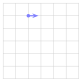
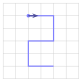
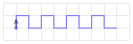
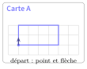
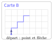

# Activités préparatoires

Complément : dessiner avec la tortue

## Activité 1 Le robot dessinateur

*guider un camarade avec trois ordres, avant de guider une tortue*

Durée : 25 min · Sans ordinateur, par deux, crayon et cahier à petits carreaux

!!! consignes "Consignes"

    - Crayon et cahier (ou feuille) à petits carreaux : tous les tracés et toutes les réponses se font sur le cahier.

    - L’un est le **programmeur**, l’autre le **robot**. Le robot tient le crayon posé sur un point du quadrillage, **tourné** dans une direction (la flèche). Il ne comprend que trois ordres :

      - **AVANCER n** : avancer tout droit de `n` carreaux **en traçant** ;

      - **GAUCHE** : tourner d’un quart de tour vers **sa** gauche, sur place, sans tracer ;

      - **DROITE** : tourner d’un quart de tour vers **sa** droite, sur place, sans tracer.

    - Le robot exécute les ordres **un par un, dans l’ordre**, sans rien deviner et sans poser de question. Gauche et droite sont celles du robot : celles qu’on aurait en marchant sur le trait, dans le sens de la flèche.

### Exercice 1 — Exécuter un programme  { #ex-dessiner-avec-la-tortue-act-1-1 }

Chacun joue le robot, sur son cahier. Le robot part du point, tourné vers la flèche (reproduire ce point de départ sur le quadrillage du cahier).

<table>
<tbody>
<tr>
<td style="text-align: left;"><table>
<tbody>
<tr>
<td style="text-align: left;"><strong>AVANCER 2</strong></td>
</tr>
<tr>
<td style="text-align: left;"><strong>DROITE</strong></td>
</tr>
<tr>
<td style="text-align: left;"><strong>AVANCER 2</strong></td>
</tr>
<tr>
<td style="text-align: left;"><strong>DROITE</strong></td>
</tr>
<tr>
<td style="text-align: left;"><strong>AVANCER 2</strong></td>
</tr>
<tr>
<td style="text-align: left;"><strong>GAUCHE</strong></td>
</tr>
<tr>
<td style="text-align: left;"><strong>AVANCER 2</strong></td>
</tr>
<tr>
<td style="text-align: left;"><strong>GAUCHE</strong></td>
</tr>
<tr>
<td style="text-align: left;"><strong>AVANCER 2</strong></td>
</tr>
</tbody>
</table></td>
<td style="text-align: center;">{ .tikz .tikz-inline loading=lazy }</td>
</tr>
</tbody>
</table>

1.  Tracer le dessin obtenu. Que représente-t-il ?

2.  Combien d’ordres ce programme contient-il ? Combien tracent un trait ?

3.  Que dessinerait-on en échangeant **GAUCHE** et **DROITE** partout ?

??? corrige "Corrigé"

    **1.** Le robot trace le **chiffre 2**.  
    **2.** 9 ordres, dont 5 **AVANCER** qui tracent ; les 4 virages ne tracent rien.  
    **3.** Chaque virage change de sens : la figure devient son symétrique par rapport à la première ligne horizontale, un **5**, qui monte au lieu de descendre et sort du quadrillage par le haut. Une seule inversion gauche/droite suffit à tout changer.

    { .tikz loading=lazy }

### Exercice 2 — Le programmeur et le robot  { #ex-dessiner-avec-la-tortue-act-1-2 }

Les deux cartes sont à la fin de l’activité. Le programmeur regarde la carte A **sans la montrer** au robot, écrit sur son cahier le programme qui fait tracer la figure, puis le lit au robot, qui trace sur son cahier en partant d’un point, tourné vers le haut. On compare avec la carte. Puis on échange les rôles avec la carte B.

1.  Écrire le programme de la carte A. Combien contient-il d’ordres ?

2.  Écrire le programme de la carte B. Combien contient-il d’ordres ?

3.  Le robot a-t-il tracé exactement la figure ? Sinon, l’erreur venait-elle du programme ou du robot ?

4.  En relisant le programme B, que remarque-t-on ?

??? corrige "Corrigé"

    |  |  |
    |:---|:---|
    | **4. Carte A** (7 ordres) : **AVANCER 2, DROITE, AVANCER 4, DROITE, AVANCER 2, DROITE, AVANCER 4**. | **5. Carte B** (11 ordres) : **AVANCER 1, DROITE, AVANCER 1, GAUCHE, AVANCER 1, DROITE, AVANCER 1, GAUCHE, AVANCER 1, DROITE, AVANCER 1**. |

    D’autres programmes sont justes (par exemple en tournant à gauche au départ pour la carte A, ou en ajoutant un dernier virage pour revenir tourné vers le haut) : la figure seule fait foi.  
    **6.** Réponses variables. Les erreurs viennent le plus souvent du **programme** (un virage oublié, gauche et droite confondues, une longueur fausse) ; le robot, lui, n’a qu’à obéir — c’est tout l’intérêt de la règle « sans rien deviner ».  
    **7.** Le même groupe de quatre ordres **AVANCER 1, DROITE, AVANCER 1, GAUCHE** revient trois fois : on a envie de dire « trois fois la même chose ».

### Exercice 3 — Répéter  { #ex-dessiner-avec-la-tortue-act-1-3 }

On autorise un nouvel ordre : **RÉPÉTER k FOIS :** suivi d’un bloc d’ordres, que le robot exécute `k` fois de suite.

1.  Écrire, **sans** **RÉPÉTER**, le programme d’un carré de côté 3. Puis l’écrire **avec** **RÉPÉTER**.

2.  Réécrire le programme de la carte B avec **RÉPÉTER**.

3.  Le robot part tourné vers le haut et exécute : **RÉPÉTER 4 FOIS : AVANCER 1, DROITE, AVANCER 1, DROITE, AVANCER 1, GAUCHE, AVANCER 1, GAUCHE**.  
    Tracer le résultat sur le cahier. Combien d’ordres aurait-il fallu écrire sans **RÉPÉTER** ?

??? corrige "Corrigé"

    **8.** Sans répétition (8 ordres) : **AVANCER 3, GAUCHE, AVANCER 3, GAUCHE, AVANCER 3, GAUCHE, AVANCER 3, GAUCHE** (le dernier virage est facultatif : il remet le robot dans sa direction de départ). Avec : **RÉPÉTER 4 FOIS : AVANCER 3, GAUCHE**.  
    **9.** **RÉPÉTER 3 FOIS : AVANCER 1, DROITE, AVANCER 1, GAUCHE** — le dernier **GAUCHE**, en trop par rapport au programme de la question 5, ne trace rien.  
    **10.** Une frise de **4 créneaux** ; sans **RÉPÉTER**, il faudrait $4 \times 8 = 32$ ordres, contre une ligne de répétition et 8 ordres.

    { .tikz loading=lazy }

### Exercice 4 — Faire le tour  { #ex-dessiner-avec-la-tortue-act-1-4 }

1.  Après le carré de la question 8, le robot est revenu à son point de départ, tourné dans la même direction. De combien de degrés a-t-il tourné **en tout** ?

2.  Un robot plus habile sait tourner de n’importe quel angle. Pour tracer un triangle à trois côtés égaux et revenir tourné comme au départ, il tourne trois fois du même angle. Lequel ? Et pour un hexagone (six côtés égaux) ?

??? corrige "Corrigé"

    **11.** Quatre quarts de tour, soit $4 \times 90 = \mathbf{360}$ degrés : un tour complet. C’est vrai pour *toute* figure fermée parcourue en revenant dans la direction de départ (rectangle de la carte A compris, avec son dernier virage).  
    **12.** Trois virages égaux pour un tour complet : $360 / 3 = \mathbf{120}$ degrés (et non 60, l’angle *intérieur* du triangle : en tournant de 60 degrés, le robot trace… un hexagone). Hexagone : $360 / 6 = \mathbf{60}$ degrés.

### Exercice 5 — Ce qu’on a découvert  { #ex-dessiner-avec-la-tortue-act-1-5 }

1.  Recopier et compléter sur le cahier : « Un programme est une suite d’…… exécutées ……, une par une : c’est une ……. Le robot ne devine rien : une seule erreur dans le programme et le dessin est ……. Pour ne pas recopier plusieurs fois les mêmes ordres, on utilise une ……. Pour faire le tour d’une figure à `n` coins égaux, on tourne à chaque coin de …… degrés. »

**Cartes de l’exercice 2** (le robot ne doit pas les voir)

{ .tikz loading=lazy }

{ .tikz loading=lazy }

??? corrige "Corrigé"

    **13.** « Un programme est une suite d’**instructions** exécutées **dans l’ordre**, une par une : c’est une **séquence**. Le robot ne devine rien : une seule erreur dans le programme et le dessin est **faux**. Pour ne pas recopier plusieurs fois les mêmes ordres, on utilise une **boucle** (une répétition). Pour faire le tour d’une figure à `n` coins égaux, on tourne à chaque coin de **`360 / n`** degrés. »
