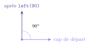
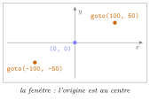
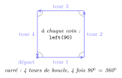
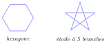
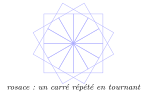

# Cours

<p class="sous-titre">Complément : dessiner avec la tortue</p>

<span id="chap-T" class="ancre"></span>

|  |  |
|:---|:---|
| **Idée** | une « tortue » se déplace sur l’écran en traçant un trait derrière elle. En lui donnant des ordres simples (avance, tourne), on dessine des figures. |
| **Prérequis** | le chapitre *Les bases de la programmation Python* (boucles et fonctions). Le complément est ouvert par l’activité débranchée qui précède. La **partie 1** utilise des instructions en séquence puis la boucle `for` ; la **partie 2**, les fonctions. |
| **Pourquoi** | `turtle` rend **visibles** les boucles et les fonctions : on *voit* la répétition et la factorisation. C’est un formidable terrain d’entraînement. |

!!! remarque "Remarque — Un peu d’histoire"

    La « tortue » vient du langage **Logo**, créé en 1967 par **Seymour Papert** et Wally Feurzeig. À l’origine, c’était un vrai petit robot en forme de tortue qui traçait au sol ! Papert, mathématicien du MIT qui avait travaillé à Genève avec le psychologue Jean Piaget, en tire une idée forte : on apprend le mieux en **fabriquant** des choses. Dans les années 1980, des robots tortues comme celui ci-contre entrent dans les écoles : munis d’un feutre, ils dessinent sur une grande feuille posée par terre les figures programmées en Logo. Python a hérité de cette tortue, devenue virtuelle.

    \*(image manquante : T_hist_robot_tortue)\*  
    Un robot tortue de sol et ses dessins

## Partie 1 — Des instructions en séquence, puis la boucle `for`

## Prendre la tortue en main

Tout programme commence par **importer** le module, et se termine par `turtle.done()` (qui garde la fenêtre ouverte). Entre les deux, les ordres sont exécutés **dans l’ordre**, de haut en bas, un par un : c’est une **séquence** d’instructions.

```python
import turtle

turtle.forward(100)   # avance de 100 pas (pixels)
turtle.left(90)       # tourne de 90 degres vers la gauche
turtle.forward(100)

turtle.done()         # garde la fenetre ouverte
```

On peut **raccourcir** les noms en donnant un surnom au module, ce qui allège le code :

```python
import turtle as t

t.forward(100)
t.left(90)
t.forward(100)
t.done()
```

### Les ordres essentiels

| **Ordre** | **Effet** |
|:---|:---|
| `forward(d)` / `fd(d)` | avance de `d` pas |
| `backward(d)` / `bk(d)` | recule de `d` pas |
| `left(a)` / `lt(a)` | tourne de `a` degrés vers la gauche |
| `right(a)` / `rt(a)` | tourne de `a` degrés vers la droite |
| `penup()` / `pendown()` | lever / baisser le stylo (se déplacer sans tracer) |
| `goto(x, y)` | aller au point de coordonnées `(x, y)` |
| `color("red")` | couleur du trait |
| `pensize(n)` | épaisseur du trait |
| `speed(n)` | vitesse (`0` = très rapide, `1` = lent) |
| `circle(r)` | trace un cercle de rayon `r` |

!!! remarque "Remarque"

    La tortue a une **position** et une **direction** (le « cap »). `left`/`right` ne font que changer le cap ; le trait n’apparaît qu’avec `forward`/`backward`. Les angles sont en degrés.

{ .tikz loading=lazy }

{ .tikz loading=lazy }

## Répéter : la boucle `for`

Dessiner un carré « à la main », c’est quatre fois la même chose :

```python
import turtle as t
t.forward(100)
t.left(90)
t.forward(100)
t.left(90)
t.forward(100)
t.left(90)
t.forward(100)
t.left(90)
t.done()
```

… mais **répéter**, c’est exactement le rôle d’une boucle `for`. Le même carré, en bien plus court :

```python
import turtle as t
for cote in range(4):
    t.forward(100)
    t.left(90)
t.done()
```

!!! regle "Règle 1 — Écrire une boucle for"

    `for cote in range(4):` répète **4 fois** les lignes qui suivent et qui sont **décalées** vers la droite (4 espaces) : c’est le **corps** de la boucle. Ne pas oublier le **deux-points** en fin de ligne. La ligne `t.done()`, non décalée, n’est exécutée qu’une fois, après la boucle. (`range` a été présenté au chapitre *Les bases de la programmation Python*.)

{ .tikz loading=lazy }

!!! regle "Règle 2 — Le secret des polygones réguliers"

    Pour fermer un polygone régulier à `n` côtés, la tortue doit avoir tourné en tout de $360^\circ$. À chaque sommet, elle tourne donc de $\dfrac{360}{n}$ degrés.

Un hexagone (6 côtés, on tourne de $360/6 = 60^\circ$) et une étoile deviennent immédiats :

```python
import turtle as t
for cote in range(6):    # hexagone
    t.forward(80)
    t.left(60)
t.done()
```

{ .tikz loading=lazy }

## Colorier une forme

Pour remplir une figure, on encadre le tracé par `begin_fill()` et `end_fill()`.

```python
import turtle as t
t.color("orange")
t.begin_fill()
for i in range(3):
    t.forward(120)
    t.left(120)
t.end_fill()
t.done()
```

## Partie 2 — Les fonctions

## Factoriser : les fonctions

Quand on veut réutiliser un dessin, on en fait une **fonction** avec un **paramètre** pour le régler.

```python
import turtle as t

def carre(cote):
    for i in range(4):
        t.forward(cote)
        t.left(90)

carre(50)
carre(100)     # on reutilise, avec une autre taille
t.done()
```

Encore mieux : une fonction pour **n’importe quel** polygone régulier.

```python
def polygone(n, cote):
    for i in range(n):
        t.forward(cote)
        t.left(360 / n)

polygone(3, 100)   # triangle
polygone(8, 60)    # octogone
```

## Le plus beau : les rosaces

Une **rosace** s’obtient en répétant une même figure tout en **tournant** un peu à chaque fois. Ici, 12 carrés, pivotés de $360/12 = 30^\circ$ :

```python
import turtle as t

def carre(cote):
    for i in range(4):
        t.forward(cote)
        t.left(90)

for k in range(12):     # 12 carres...
    carre(100)
    t.left(30)          # ...pivotes de 30 degres
t.done()
```

{ .tikz loading=lazy }

!!! remarque "Remarque"

    On tient là toute la puissance du complément : une **fonction** (le motif), une **boucle** (la répétition) et un petit **tour** à chaque étape suffisent à produire des figures très riches. À vous de jouer dans les exercices !

!!! remarque "Remarque — Liens avec d’autres chapitres"

    Ce complément met en images les boucles et les fonctions du chapitre *Les bases de la programmation Python*, et `turtle` est une **bibliothèque**, au sens que précisera le chapitre *Spécifier et mettre au point ses programmes*. En Terminale, la tortue tracera des fractales au chapitre *La récursivité*.

## Mémo

| **Pour…**                     | **On utilise…**                      |
|:------------------------------|:-------------------------------------|
| avancer / reculer             | `forward(d)` / `backward(d)`         |
| tourner                       | `left(a)` / `right(a)`               |
| répéter un motif              | une boucle `for`                     |
| polygone régulier à `n` côtés | tourner de `360 / n` à chaque sommet |
| réutiliser un dessin          | une **fonction** avec paramètre(s)   |
| remplir                       | `begin_fill()` … `end_fill()`        |
| se déplacer sans tracer       | `penup()` … `pendown()`              |
