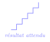
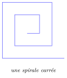

# Exercices

<p class="sous-titre">Complément : dessiner avec la tortue</p>

!!! consignes "Mode d’emploi"

    - Niveau : ★ échauffement, ★★ classique (niveau bac), ★★★ défi ; les *coups de pouce* et les *corrigés* se déplient sous chaque exercice.

    - <span class="run" title="À programmer et tester sur machine">▶</span> *À programmer et exécuter* sur machine. Commencez toujours par `import turtle as t` et terminez par `t.done()`.

    - **Partie 1** : des ordres en séquence, puis la boucle `for`. **Partie 2** : avec des fonctions.

    - **Réflexes** : une figure qui se répète $\rightarrow$ une boucle `for` ; un motif à réutiliser $\rightarrow$ une **fonction** (partie 2) ; un polygone à `n` côtés $\rightarrow$ on tourne de `360 / n`.

    - Usage de l’IA, indiqué sur chaque exercice : <span class="ia ia-rouge" title="Sans IA : le but est l'automatisme lui-même"></span> aucune ; <span class="ia ia-orange" title="IA en appui : déboguer, reformuler, vérifier ; la réponse finale est la vôtre"></span> en appui (déboguer, reformuler, vérifier ; la réponse finale est écrite et comprise par vous) ; <span class="ia ia-vert" title="IA intégrée : l'exercice s'appuie sur une réponse d'IA"></span> l’exercice s’appuie sur une réponse d’IA. Voir la [charte d’usage de l’IA](../charte.md).

### Partie 1 — Séquence d’instructions et boucle `for`

### Premiers tracés

### <span class="stars" title="Niveau 1 sur 3">★</span> <span class="exo-num">Exercice 1</span> — Le carré <span class="ia ia-rouge" title="Sans IA : le but est l'automatisme lui-même"></span> { #ex-T-1 }

<span class="run" title="À programmer et tester sur machine">▶</span> Dessiner un carré de côté `100` (4 côtés, on tourne de `90` à chaque fois) : d’abord en écrivant les ordres **à la suite**, l’un sous l’autre (combien en faut-il ?), puis à l’aide d’une boucle `for`.

{ .tikz loading=lazy }

??? corrige "Corrigé"

    !!! remarque "Remarque"

        Plusieurs écritures sont possibles ; on en donne une simple. Chaque programme suppose `import turtle as t` au début et `t.done()` à la fin. On rappelle la règle d’or : un polygone régulier à `n` côtés se ferme en tournant de `360 / n` à chaque sommet.

    **En séquence** : 8 ordres (4 fois « avancer, tourner »).

    ```python
    import turtle as t
    t.forward(100)
    t.left(90)
    t.forward(100)
    t.left(90)
    t.forward(100)
    t.left(90)
    t.forward(100)
    t.left(90)
    t.done()
    ```

    **Avec une boucle** : on répète 4 fois le couple « avancer, tourner ».

    ```python
    import turtle as t
    for i in range(4):
        t.forward(100)
        t.left(90)
    t.done()
    ```

### <span class="stars" title="Niveau 1 sur 3">★</span> <span class="exo-num">Exercice 2</span> — Le rectangle <span class="ia ia-rouge" title="Sans IA : le but est l'automatisme lui-même"></span> { #ex-T-2 }

<span class="run" title="À programmer et tester sur machine">▶</span> Dessiner un rectangle de `200` de large sur `100` de haut. *(Attention : les quatre côtés ne sont pas tous égaux, mais on tourne toujours de `90`.)*

??? corrige "Corrigé"

    Deux longueurs et deux largeurs : on répète **deux fois** le couple « long côté / court côté ».

    ```python
    import turtle as t
    for i in range(2):
        t.forward(200)   # longueur
        t.left(90)
        t.forward(100)   # largeur
        t.left(90)
    t.done()
    ```

### <span class="stars" title="Niveau 1 sur 3">★</span> <span class="exo-num">Exercice 3</span> — L’escalier <span class="ia ia-rouge" title="Sans IA : le but est l'automatisme lui-même"></span> { #ex-T-3 }

<span class="run" title="À programmer et tester sur machine">▶</span> Dessiner un escalier de **5 marches** : une marche est un déplacement horizontal suivi d’un déplacement vertical. Utiliser une boucle qui répète 5 fois « avancer, tourner, avancer, tourner ».

{ .tikz loading=lazy }

??? corrige "Corrigé"

    Chaque marche = un pas horizontal, un pas vertical. Après être monté, on se **remet** à l’horizontale (`right(90)`).

    ```python
    import turtle as t
    for i in range(5):
        t.forward(40)   # horizontal
        t.left(90)
        t.forward(40)   # vertical
        t.right(90)     # on repart a l'horizontale
    t.done()
    ```

### Les polygones réguliers

### <span class="stars" title="Niveau 2 sur 3">★★</span> <span class="exo-num">Exercice 4</span> — Triangle et hexagone <span class="ia ia-orange" title="IA en appui : déboguer, reformuler, vérifier ; la réponse finale est la vôtre"></span> { #ex-T-4 }

<span class="run" title="À programmer et tester sur machine">▶</span> Dessiner un **triangle équilatéral** (3 côtés), puis un **hexagone** (6 côtés). Dans chaque cas, de combien de degrés faut-il tourner à chaque sommet ?0

??? pouce "Coup de pouce"

    Pour le carré, la tortue tourne 4 fois de `90` : `360` degrés en tout pour revenir à son orientation de départ. Le même total vaut-il pour le triangle ? Attention : l’angle dont tourne la tortue n’est pas l’angle intérieur du triangle.

{ .tikz loading=lazy }

??? corrige "Corrigé"

    Triangle : $360 / 3 = \mathbf{120}$ degrés. Hexagone : $360 / 6 = \mathbf{60}$ degrés.

    ```python
    import turtle as t
    for i in range(3):      # triangle equilateral
        t.forward(120)
        t.left(120)
    for i in range(6):      # hexagone
        t.forward(80)
        t.left(60)
    t.done()
    ```

### <span class="stars" title="Niveau 2 sur 3">★★</span> <span class="exo-num">Exercice 5</span> — L’étoile à cinq branches <span class="ia ia-orange" title="IA en appui : déboguer, reformuler, vérifier ; la réponse finale est la vôtre"></span> { #ex-T-5 }

<span class="run" title="À programmer et tester sur machine">▶</span> Dessiner une étoile à 5 branches.0

??? pouce "Coup de pouce"

    Suivre du doigt le tracé de l’étoile : la tortue fait **deux** tours complets sur elle-même avant de revenir à son orientation de départ. Combien de degrés en tout, répartis sur combien de sommets ?

{ .tikz loading=lazy }

??? corrige "Corrigé"

    En tournant de `144` degrés à chaque pointe, on « saute » un sommet sur deux, ce qui trace l’étoile.

    ```python
    import turtle as t
    for i in range(5):
        t.forward(200)
        t.left(144)
    t.done()
    ```

### Répéter en tournant

### <span class="stars" title="Niveau 2 sur 3">★★</span> <span class="exo-num">Exercice 6</span> — Rosace de cercles <span class="ia ia-orange" title="IA en appui : déboguer, reformuler, vérifier ; la réponse finale est la vôtre"></span> { #ex-T-6 }

<span class="run" title="À programmer et tester sur machine">▶</span> La tortue sait tracer un cercle avec `t.circle(rayon)`. Dessiner une jolie « fleur » en répétant **18 cercles** de rayon `80`, en tournant un peu entre chaque. De combien faut-il tourner à chaque fois ?0

??? pouce "Coup de pouce"

    Même raisonnement que pour les polygones : après les 18 cercles, la tortue doit avoir fait exactement un tour complet sur elle-même.

{ .tikz loading=lazy }

??? corrige "Corrigé"

    18 cercles répartis sur un tour complet : on tourne de $360 / 18 = \mathbf{20}$ degrés entre chaque.

    ```python
    import turtle as t
    for k in range(18):
        t.circle(80)
        t.left(20)
    t.done()
    ```

### <span class="stars" title="Niveau 2 sur 3">★★</span> <span class="exo-num">Exercice 7</span> — La spirale carrée <span class="ia ia-orange" title="IA en appui : déboguer, reformuler, vérifier ; la réponse finale est la vôtre"></span> { #ex-T-7 }

<span class="run" title="À programmer et tester sur machine">▶</span> Dessiner une spirale : on tourne toujours de `90` degrés, mais la longueur du côté **augmente** à chaque tour (par exemple `10, 20, 30, …`). Faire une vingtaine de segments.0

??? pouce "Coup de pouce"

    La longueur doit changer à chaque tour : utiliser la variable de boucle `i` dans le calcul de la longueur (que vaut `10 * i` pour `i` allant de `1` à `20` ?).

{ .tikz loading=lazy }

??? corrige "Corrigé"

    On garde l’angle à `90` degrés, mais on **augmente** la longueur du côté à chaque tour.

    ```python
    import turtle as t
    cote = 10
    for i in range(20):
        t.forward(cote)
        t.left(90)
        cote = cote + 10    # le cote grandit
    t.done()
    ```

### Défis

### <span class="stars" title="Niveau 3 sur 3">★★★</span> <span class="exo-num">Exercice 8</span> — La maison <span class="ia ia-orange" title="IA en appui : déboguer, reformuler, vérifier ; la réponse finale est la vôtre"></span> { #ex-T-8 }

<span class="run" title="À programmer et tester sur machine">▶</span> Dessiner une maison : un **carré** pour la façade, surmonté d’un **triangle** pour le toit. *(Il faudra bien positionner la tortue et gérer les angles du toit.)*0

??? pouce "Coup de pouce"

    Tracer d’abord le carré, puis se demander où se trouve la tortue et dans quelle direction elle regarde. Le toit est un triangle équilatéral posé sur le côté du haut : de combien tourner à chaque sommet ?

0

??? pouce "Coup de pouce 2 (début de solution)"

    `for i in range(4):` …(la façade)  
    `t.left(90)`  
    `t.forward(100)` \# la tortue est en haut à gauche  
    `t.right(30)` …

{ .tikz loading=lazy }

??? corrige "Corrigé"

    On trace d’abord la façade (un carré). La tortue revient alors en bas à gauche ; on monte au coin haut-gauche, puis on pose un toit triangulaire (triangle équilatéral, angles de `120` degrés).

    ```python
    import turtle as t
    # La facade (carre de cote 100)
    for i in range(4):
        t.forward(100)
        t.left(90)
    # On monte au coin haut-gauche pour poser le toit
    t.left(90)
    t.forward(100)
    t.right(30)          # on vise le sommet du toit
    # Le toit (triangle equilateral)
    for i in range(3):
        t.forward(100)
        t.right(120)
    t.done()
    ```

### <span class="stars" title="Niveau 2 sur 3">★★</span> <span class="exo-num">Exercice 9</span> — Un triangle selon un assistant d’IA <span class="ia ia-vert" title="IA intégrée : l'exercice s'appuie sur une réponse d'IA"></span> { #ex-T-9 }

Un élève demande à un assistant d’IA : « Écris un programme Python avec la tortue qui dessine un triangle équilatéral de côté 100. » Voici la réponse obtenue.

```python
import turtle as t
for i in range(3):
    t.forward(100)
    t.left(60)
t.done()
```

« La boucle répète trois fois : avancer de 100, puis tourner à gauche de 60 degrés, puisque les angles d’un triangle équilatéral mesurent 60 degrés. Après les trois tours, la tortue est revenue à son point de départ et le triangle est fermé. »

1.  La réponse est-elle correcte ? Calculer de combien de degrés la tortue a tourné en tout à la fin du programme, puis <span class="run" title="À programmer et tester sur machine">▶</span> exécuter le programme.

2.  Localiser et corriger l’erreur.

3.  Quelle vérification simple, faite avant de faire confiance à la réponse, aurait suffi à détecter l’erreur ?0

    ??? pouce "Coup de pouce"

        Pour refermer une figure, de combien de degrés la tortue doit-elle avoir tourné en tout ? Comparer avec `3 * 60`.

??? corrige "Corrigé"

    **1.** Non. En trois tours, la tortue tourne de $3 \times 60 = 180^\circ$ seulement, alors que, pour fermer un polygone, elle doit avoir tourné de $360^\circ$ en tout. À l’exécution, on obtient trois côtés d’un hexagone (une figure ouverte) : la tortue finit à environ $(100\,;\,173)$ du point de départ, cap à $180^\circ$, et rien n’est fermé. **2.** L’erreur est l’angle `left(60)`. L’angle *intérieur* du triangle vaut bien $60^\circ$, mais la tortue tourne de l’angle **extérieur**, $360 / 3 = 120^\circ$ (règle du cours : `360 / n` à chaque sommet).

    ```python
    import turtle as t
    for i in range(3):
        t.forward(100)
        t.left(120)
    t.done()
    ```

    **3.** Faire le calcul « nombre de côtés $\times$ angle $= 360$ » avant de lancer : $3 \times 60 \neq 360$. Ou, plus simplement, exécuter le programme et regarder le dessin : ici, l’erreur se voit à l’écran en une seconde.

### Partie 2 — Avec des fonctions

### Factoriser : les fonctions

### <span class="stars" title="Niveau 2 sur 3">★★</span> <span class="exo-num">Exercice 10</span> — Un polygone au choix <span class="ia ia-orange" title="IA en appui : déboguer, reformuler, vérifier ; la réponse finale est la vôtre"></span> { #ex-T-10 }

<span class="run" title="À programmer et tester sur machine">▶</span> Écrire une fonction `polygone(n, cote)` qui dessine un polygone régulier à `n` côtés de longueur `cote`. L’utiliser pour dessiner un triangle, un carré et un octogone.0

??? pouce "Coup de pouce"

    Reprendre le carré et le triangle : qu’est-ce qui change d’une figure à l’autre ? Ce sont ces deux nombres qui deviennent les paramètres `n` et `cote`.

??? corrige "Corrigé"

    On remplace l’angle par `360 / n` : la même fonction dessine tous les polygones réguliers.

    ```python
    import turtle as t
    def polygone(n, cote):
        for i in range(n):
            t.forward(cote)
            t.left(360 / n)

    polygone(3, 100)   # triangle
    polygone(4, 100)   # carre
    polygone(8, 60)    # octogone
    t.done()
    ```

### <span class="stars" title="Niveau 2 sur 3">★★</span> <span class="exo-num">Exercice 11</span> — Rosace de carrés <span class="ia ia-orange" title="IA en appui : déboguer, reformuler, vérifier ; la réponse finale est la vôtre"></span> { #ex-T-11 }

<span class="run" title="À programmer et tester sur machine">▶</span> En réutilisant une fonction `carre(cote)`, dessiner une rosace formée de **12 carrés**, chacun pivoté de `30` degrés par rapport au précédent. *(Pourquoi 30 ? Parce que $12 \times 30 = 360$.)*0

??? pouce "Coup de pouce"

    Écrire d’abord `carre(cote)` et vérifier qu’elle ramène la tortue à son point et à son orientation de départ. La rosace n’est alors qu’une boucle : un carré, puis on tourne.

{ .tikz loading=lazy }

??? corrige "Corrigé"

    On écrit une fonction `carre`, puis on la répète 12 fois en pivotant de `30` degrés ($12 \times 30 = 360$).

    ```python
    import turtle as t
    def carre(cote):
        for i in range(4):
            t.forward(cote)
            t.left(90)

    for k in range(12):
        carre(100)
        t.left(30)
    t.done()
    ```

### Couleurs et déplacements

### <span class="stars" title="Niveau 2 sur 3">★★</span> <span class="exo-num">Exercice 12</span> — Trois carrés colorés <span class="ia ia-orange" title="IA en appui : déboguer, reformuler, vérifier ; la réponse finale est la vôtre"></span> { #ex-T-12 }

<span class="run" title="À programmer et tester sur machine">▶</span> Dessiner **trois carrés** côte à côte, remplis de trois couleurs différentes (par exemple rouge, vert, bleu), en écrivant une fonction `carre_plein(cote, couleur)` que l’on appelle trois fois.0

??? pouce "Coup de pouce"

    Relire le tableau des commandes du cours : comment passer d’un carré au suivant **sans tracer de trait** ? Comment **remplir** une figure (voir l’exemple coloré du cours) ?

??? corrige "Corrigé"

    On fabrique une fonction « carré plein » (couleur $+$ `begin_fill`/`end_fill`), et on déplace la tortue *sans tracer* entre deux carrés grâce à `penup`/`goto`/`pendown`.

    ```python
    import turtle as t
    def carre_plein(cote, couleur):
        t.color(couleur)
        t.begin_fill()
        for i in range(4):
            t.forward(cote)
            t.left(90)
        t.end_fill()

    t.penup()
    t.goto(-150, 0)
    t.pendown()
    carre_plein(80, "red")
    t.penup()
    t.goto(-50, 0)
    t.pendown()
    carre_plein(80, "green")
    t.penup()
    t.goto(50, 0)
    t.pendown()
    carre_plein(80, "blue")
    t.done()
    ```

### Défi

### <span class="stars" title="Niveau 3 sur 3">★★★</span> <span class="exo-num">Exercice 13</span> — Le damier <span class="ia ia-orange" title="IA en appui : déboguer, reformuler, vérifier ; la réponse finale est la vôtre"></span> { #ex-T-13 }

<span class="run" title="À programmer et tester sur machine">▶</span> À l’aide de **deux boucles imbriquées**, dessiner une grille de **$3 \times 3$ carrés** (9 cases). Pour un vrai défi, remplir une case sur deux en noir, comme un damier.0

??? pouce "Coup de pouce"

    Une boucle pour les lignes, une boucle pour les colonnes : la case de la ligne `ligne` et de la colonne `colonne` commence au point `(colonne * cote, ligne * cote)`. Pour le damier : à quelle condition sur `ligne + colonne` une case est-elle noire ?

0

??? pouce "Coup de pouce 2 (début de solution)"

    `for ligne in range(3):`  
    `for colonne in range(3):`  
    `t.penup()`  
    `t.goto(colonne * cote, ligne * cote)`  
    …

{ .tikz loading=lazy }

??? corrige "Corrigé"

    Deux boucles imbriquées balayent lignes et colonnes, et on se place sur chaque case avec `goto`. Chaque case est un carré ; on ne **remplit** qu’une case sur deux, selon la parité de `ligne + colonne`.

    ```python
    import turtle as t
    def carre(cote):
        for i in range(4):
            t.forward(cote)
            t.left(90)

    cote = 40
    t.color("black")
    for ligne in range(3):
        for colonne in range(3):
            t.penup()
            t.goto(colonne * cote, ligne * cote)
            t.pendown()
            if (ligne + colonne) % 2 == 0:   # case noire : carre rempli
                t.begin_fill()
                carre(cote)
                t.end_fill()
            else:                            # case blanche : contour seul
                carre(cote)
    t.done()
    ```
