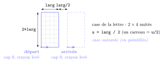
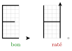
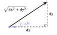
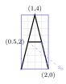
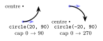
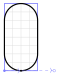
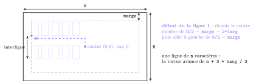
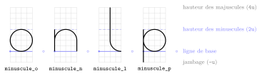
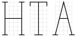

# TP et projets

<p class="sous-titre">Complément : dessiner avec la tortue</p>

## <span class="etiquette">Projet</span> La tortue écrivain

!!! fichiers "Fichiers à télécharger"

    [:material-folder-open: dossier en ligne](https://github.com/MathThibaud/nsi-fichiers-eleves/tree/main/premiere/01b-projet-tortue-ecrivain){ .md-button } [:material-zip-box: archive .zip](https://github.com/MathThibaud/nsi-fichiers-eleves/raw/main/zips/premiere-01b-projet-tortue-ecrivain.zip){ .md-button }

!!! remarque "Remarque — Le but"

    Le programme demande une **phrase** à l’utilisateur, puis la tortue l’**écrit** dans la fenêtre en **dessinant chaque lettre**, trait après trait.

    Chaque lettre est une **fonction** (`lettre_A`, `lettre_B`…). Toutes obéissent au **même contrat** : elles commencent et finissent au même endroit de leur case. C’est ce contrat qui permet d’enchaîner les lettres sans jamais se perdre.

    Vous avancez par **étapes** ; chacun va aussi loin qu’il le peut. Un programme qui écrit proprement dix lettres vaut mieux qu’un alphabet complet qui déraille.

    \*(image manquante : Tt1_rendu_ecriture_turtle)\*

    Ce que l’on vise (étape 5).

!!! consignes "Mode d’emploi"

    - Fichier à télécharger (lien ci-dessus) : `projet_ecriture_depart.py` (le contrat, la fonction de test `verifier`, les outils de l’étape 3 et la lettre `L`). Renommez-le `ecriture_NOM.py`. Laissez `t.speed(0)` au début : sinon, vous passerez la séance à regarder la tortue dessiner.

    - Paliers : **Étapes 1–2** le minimum attendu **Étapes 3–4** le cœur du projet **Étapes 5–6** pour aller plus loin.

    - Travaillez d’abord **sur le cahier à petits carreaux** (une case de lettre = 4 carreaux de large sur 8 de haut, un carreau = une demi-unité ; voir le schéma du contrat), puis codez, puis **testez** chaque lettre avant de passer à la suivante. Le journal de bord de chaque lettre se tient aussi sur le cahier.

    - **À l’oral**, le professeur désigne une lettre de votre programme : vous devez dire, ligne par ligne, **où est la tortue et où elle regarde**.

    - Usage de l’IA : <span class="ia ia-rouge" title="Sans IA : le but est l'automatisme lui-même"></span> aucune pour les étapes 1 et 2 (c’est là que l’on apprend à « être la tortue ») ; <span class="ia ia-orange" title="IA en appui : déboguer, reformuler, vérifier ; la réponse finale est la vôtre"></span> en appui ensuite (déboguer, comprendre une erreur), mais chaque lettre est dessinée et expliquée par vous. Voir la charte.

## Le contrat d’une lettre

On note `larg` la **largeur** des lettres (en pixels) : une lettre tient dans un rectangle de largeur `larg` et de hauteur `2 * larg`. On découpe ce rectangle en un quadrillage d’unité `u = larg / 2` : une lettre fait **2 unités de large** et **4 unités de haut**, et on laisse **1 unité** d’espace avant la lettre suivante.

{ .tikz loading=lazy }

!!! encadre "Le contrat de toutes les lettres"

    - **Départ** : la tortue est au **coin bas-gauche** de la case, elle regarde **vers la droite** (cap 0), crayon **levé**.

    - **Pendant** : la lettre ne sort pas de sa case ($2\times4$ unités).

    - **Arrivée** : la tortue est au **coin bas-gauche de la case suivante** (`3u` plus à droite, à la même hauteur), cap 0, crayon levé.

    En informatique, le départ s’appelle une **précondition** et l’arrivée une **postcondition** : c’est la **spécification** de la fonction.

!!! encadre "Interdits"

    `goto`, `setposition`/`setpos`, `setx`, `sety`, `home`, `setheading`, `teleport` sont **interdits**. On ne se déplace qu’avec `forward`, `backward`, `left`, `right`, `circle`, `penup`, `pendown`. Une lettre qui utilise un ordre interdit ne compte pas.

    *Pourquoi ?* Avec `goto`, on n’a jamais besoin de savoir où l’on est. Ici, à chaque ligne du programme, **vous devez savoir où est la tortue et où elle regarde**.

## Étape 1 — Être la tortue : les lettres « bâton »

On commence par les lettres faites de traits **horizontaux et verticaux**. Voici le `L`, entièrement commenté :

```python
def lettre_L(larg):
    """Dessine un L de largeur larg (contrat respecte)."""
    haut = 2 * larg    # hauteur de la lettre
    ecart = larg / 2   # espace avant la lettre suivante
    t.left(90)         # je regarde vers le haut
    t.forward(haut)    # je monte en haut de la case (crayon leve)
    t.pendown()
    t.backward(haut)   # je redescends en tracant la barre verticale
    t.right(90)        # je regarde de nouveau vers la droite
    t.forward(larg)    # barre du bas
    t.penup()
    t.forward(ecart)   # je rejoins la case suivante
```

!!! remarque "Remarque"

    On évite d’appeler une variable `l` : dans le code, on la confond trop facilement avec le chiffre `1` ; d’où `larg`. Le fichier de départ contient aussi la plus simple des « lettres », l’espace :

    ```python
    def espace(larg):
        """Une case vide."""
        t.penup()
        t.forward(larg + larg / 2)
    ```

!!! exemple "Exemple — Le journal de bord de la tortue"

    Pour écrire une lettre, on tient à la main son **journal de bord** : après chaque ordre, la position, le cap et le crayon. Pour le `L` (départ en $(0,0)$) :

    <table>
    <tbody>
    <tr>
    <td style="text-align: left;"><strong>ordre</strong></td>
    <td style="text-align: center;"><strong>position</strong></td>
    <td style="text-align: center;"><strong>cap</strong></td>
    <td style="text-align: center;"><strong>crayon</strong></td>
    <td style="text-align: left;"></td>
    <td style="text-align: left;"><strong>ordre</strong></td>
    <td style="text-align: center;"><strong>position</strong></td>
    <td style="text-align: center;"><strong>cap</strong></td>
    <td style="text-align: center;"><strong>crayon</strong></td>
    </tr>
    <tr>
    <td style="text-align: left;">(départ)</td>
    <td style="text-align: center;"><span class="math inline">(0, 0)</span></td>
    <td style="text-align: center;">0</td>
    <td style="text-align: center;">levé</td>
    <td style="text-align: left;"></td>
    <td style="text-align: left;"><code>backward(haut)</code></td>
    <td style="text-align: center;"><span class="math inline">(0, 0)</span></td>
    <td style="text-align: center;">90</td>
    <td style="text-align: center;">baissé</td>
    </tr>
    <tr>
    <td style="text-align: left;"><code>left(90)</code></td>
    <td style="text-align: center;"><span class="math inline">(0, 0)</span></td>
    <td style="text-align: center;">90</td>
    <td style="text-align: center;">levé</td>
    <td style="text-align: left;"></td>
    <td style="text-align: left;"><code>right(90)</code></td>
    <td style="text-align: center;"><span class="math inline">(0, 0)</span></td>
    <td style="text-align: center;">0</td>
    <td style="text-align: center;">baissé</td>
    </tr>
    <tr>
    <td style="text-align: left;"><code>forward(haut)</code></td>
    <td style="text-align: center;"><span class="math inline">(0, <code>2*larg</code>)</span></td>
    <td style="text-align: center;">90</td>
    <td style="text-align: center;">levé</td>
    <td style="text-align: left;"></td>
    <td style="text-align: left;"><code>forward(larg)</code></td>
    <td style="text-align: center;"><span class="math inline">(<code>larg</code>, 0)</span></td>
    <td style="text-align: center;">0</td>
    <td style="text-align: center;">baissé</td>
    </tr>
    <tr>
    <td style="text-align: left;"><code>pendown()</code></td>
    <td style="text-align: center;"><span class="math inline">(0, <code>2*larg</code>)</span></td>
    <td style="text-align: center;">90</td>
    <td style="text-align: center;">baissé</td>
    <td style="text-align: left;"></td>
    <td style="text-align: left;"><code>penup()</code></td>
    <td style="text-align: center;"><span class="math inline">(<code>larg</code>, 0)</span></td>
    <td style="text-align: center;">0</td>
    <td style="text-align: center;">levé</td>
    </tr>
    <tr>
    <td colspan="5" style="text-align: left;"></td>
    <td style="text-align: left;"><code>forward(ecart)</code></td>
    <td style="text-align: center;"><span class="math inline">(<code>1.5*larg</code>, 0)</span></td>
    <td style="text-align: center;">0</td>
    <td style="text-align: center;">levé ✓</td>
    </tr>
    </tbody>
    </table>

    La dernière ligne est exactement l’**arrivée** du contrat.

1.  Sur le cahier à petits carreaux, dessiner le `E` dans sa case, puis écrire son journal de bord (colonnes : ordre, position, cap, crayon, comme ci-dessus) **avant** de le programmer.

2.  <span class="run" title="À programmer et tester sur machine">▶</span>  Programmer `lettre_E`, puis `lettre_F`, `lettre_H`, `lettre_I`, `lettre_T`.

3.  <span class="run" title="À programmer et tester sur machine">▶</span>  Tester chaque lettre (voir l’encadré ci-dessous) **avant** de passer à la suivante.

!!! encadre "Tester une lettre"

    Le fichier de départ fournit deux tests ; vous n’avez pas à les écrire.

    **Le test visuel** `essayer(lettre_E)` dessine en gris le quadrillage de la case et le point d’arrivée attendu, puis la lettre, puis un **tampon** de la tortue (`t.stamp()`). Le contrat est respecté si la flèche est **sur le point gris** et pointe **vers la droite**. On voit aussi tout de suite si la lettre déborde de sa case.

    { .tikz loading=lazy }

    **Le test automatique** `verifier(lettre_E)` dessine la lettre puis **contrôle** l’arrivée (position, cap, crayon) avec des `assert` : s’il ne se passe rien, le contrat est respecté ; sinon, Python s’arrête avec un message (`AssertionError: mauvaise position d’arrivee`). C’est le **seul** endroit où l’on a le droit de demander sa position à la tortue.

!!! remarque "Remarque — Pourquoi verifier tolère-t-il un demi-pixel d’écart ?"

    Les calculs sur les nombres à virgule sont **approchés** (`0.1 + 0.2` ne vaut pas exactement `0.3` en Python), et `circle` trace en réalité de petits segments. Une lettre correcte peut donc arriver en `75.00000001` au lieu de `75` : on ne compare jamais deux nombres à virgule avec `==`, on vérifie qu’ils sont **assez proches**.

**Point d’étape  ✓** En enchaînant `lettre_H(40)`, `lettre_E(40)`, `lettre_L(40)`, `lettre_L(40)`, la tortue écrit `HELL`, lettres alignées et régulièrement espacées — sans aucun `goto`.

## Étape 2 — Écrire un mot, puis une phrase

Il reste à faire le lien entre un **caractère** (`"E"`) et la **fonction** qui le dessine (`lettre_E`).

```python
def ecrire(phrase, larg):
    """Ecrit la phrase caractere par caractere, en lettres de largeur larg."""
    for c in phrase.upper():          # on ecrit tout en majuscules (pour l'instant)
        if c == "E":
            lettre_E(larg)
        elif c == "L":
            lettre_L(larg)
        elif c == " ":
            espace(larg)
        ...
        else:
            inconnu(larg)             # caractere que l'on ne sait pas dessiner

phrase = input("Votre phrase : ")
ecrire(phrase, 30)
```

1.  <span class="run" title="À programmer et tester sur machine">▶</span>  Compléter `ecrire` avec toutes vos lettres.

2.  <span class="run" title="À programmer et tester sur machine">▶</span>  Écrire `inconnu(larg)` : elle dessine un petit **rectangle vide** (c’est ce que font les vraies polices quand un caractère manque ; les typographes l’appellent le « tofu »). Elle doit, elle aussi, respecter le contrat !

3.  Pourquoi le contrat est-il indispensable pour que `ecrire` fonctionne ? Que se passerait-il si `lettre_H` finissait en haut de sa case ?

!!! remarque "Remarque — Pour aller plus loin : un dictionnaire de fonctions"

    En Python, une fonction est une **valeur** comme une autre : on peut la ranger dans un dictionnaire. La longue suite de `elif` devient alors :

    ```python
    ALPHABET = {"E": lettre_E, "L": lettre_L, " ": espace}    # sans parentheses !

    def ecrire(phrase, larg):
        for c in phrase.upper():
            if c in ALPHABET:
                ALPHABET[c](larg)    # on recupere la fonction, puis on l'appelle
            else:
                inconnu(larg)
    ```

!!! remarque "Remarque — Deux pièges"

    - `input` attend la phrase dans la **console**, pas dans la fenêtre de la tortue : cliquez dans la console pour taper. Autre possibilité, une petite fenêtre de saisie : `phrase = t.textinput("La tortue", "Votre phrase :")`.

    - `"é".upper()` vaut `"É"`, une lettre que vous n’avez pas (encore) dessinée : les accents sortent en « tofu » jusqu’à l’étape 6. Ce n’est pas un bug !

!!! remarque "Remarque — Variante : la police de la classe"

    On se répartit l’alphabet : chaque binôme programme quelques lettres, puis on rassemble toutes les fonctions dans un seul fichier. Si **tout le monde** a respecté le contrat, `ecrire` fonctionne avec des lettres écrites par des élèves différents, sans rien retoucher. C’est tout l’intérêt d’une **spécification** : chacun peut utiliser le travail des autres sans savoir comment il est fait. Pour contrôler 26 lettres d’un coup, le test automatique `verifier` devient précieux.

**Point d’étape  ✓** Le programme demande une phrase et l’écrit sur une ligne. Les lettres non encore programmées apparaissent en « tofu ».

## Étape 3 — Les diagonales

Pour le `A`, le `N` ou le `Z`, il faut tracer en **biais**. Il faut alors connaître la **longueur** du trait (théorème de Pythagore) et l’**angle** dont tourner. Le fichier de départ fournit deux outils qui font ce calcul :

```python
def trait(dx, dy):
    """Trace un segment de dx vers la droite et dy vers le haut.
    Le cap doit etre 0 avant ; il est de nouveau 0 apres."""
    angle = math.degrees(math.atan2(dy, dx))    # l'angle du segment
    t.pendown()
    t.left(angle)
    t.forward(math.sqrt(dx ** 2 + dy ** 2))     # Pythagore
    t.right(angle)

# saut(dx, dy) : pareil, mais crayon leve
```

Pour aller de `dx` vers la droite et `dy` vers le haut, la tortue suit l’**hypoténuse** d’un triangle rectangle :

- sa **longueur** vient du théorème de Pythagore : $\sqrt{\texttt{dx}^2+\texttt{dy}^2}$ ;

- l’**angle** dont il faut tourner est donné par `math.atan2(dy, dx)` (en radians, que `math.degrees` convertit en degrés). Vous n’avez pas à savoir le calculer : retenez seulement **ce qu’il représente**.

Après le trait, `t.right(angle)` annule le virage : la tortue regarde de nouveau vers la droite.

{ .tikz loading=lazy }

!!! remarque "Remarque"

    `trait` et `saut` sont des déplacements **relatifs** : ils disent *de combien* bouger, pas *où* aller. Ce ne sont donc pas des `goto` déguisés : vous devez toujours savoir d’où vous partez. Elles ont leur propre petit contrat : **cap 0 avant, cap 0 après**. **Attention** : si la tortue ne regarde pas vers la droite au moment de l’appel (par exemple juste après un `circle`), le trait part dans une mauvaise direction.

```python
def lettre_A(larg):
    u = larg / 2              # une unite du quadrillage
    trait(u, 4 * u)           # jambe gauche : -> (u, 4u)
    trait(u, -4 * u)          # jambe droite : -> (2u, 0)
    saut(-u / 2, 2 * u)       # -> (1.5u, 2u)
    trait(-u, 0)              # la barre : -> (0.5u, 2u)
    saut(2.5 * u, -2 * u)     # case suivante : -> (3u, 0)
```

{ .tikz loading=lazy }

On repère les points **en unités** sur le quadrillage : c’est beaucoup plus simple que de raisonner en pixels, et la lettre s’adapte toute seule à la taille `larg`.

1.  Dans `trait`, à quoi sert la dernière ligne `t.right(angle)` ? Que se passerait-il sans elle pour la lettre suivante ?

2.  <span class="run" title="À programmer et tester sur machine">▶</span>  Programmer `K`, `M`, `N`, `V`, `W`, `X`, `Y`, `Z`. Réécrire éventuellement vos lettres de l’étape 1 avec `trait` et `saut` (comparer la longueur du code).

## Étape 4 — Les arrondis

`t.circle(r, angle)` trace un **arc** de cercle de rayon `r` ; la tortue tourne de `angle` degrés en chemin.

- `r > 0` : le centre est à **gauche** de la tortue, elle tourne vers la gauche ;

- `r < 0` : le centre est à **droite**, elle tourne vers la droite ;

- **attention** : après `circle`, le **cap a changé** ! Notez-le en commentaire à chaque fois ;

- avant un `trait` ou un `saut`, revenir au **cap 0** (`left`/`right`).

{ .tikz loading=lazy }

```python
def lettre_O(larg):
    u = larg / 2
    saut(u, 0)              # milieu du bas, cap 0
    t.pendown()
    t.circle(u, 90)         # cap 90
    t.forward(2 * u)        # cote droit
    t.circle(u, 180)        # cap 270
    t.forward(2 * u)        # cote gauche
    t.circle(u, 90)         # cap 0 : retour au milieu du bas
    saut(2 * u, 0)          # case suivante
```

{ .tikz loading=lazy }

1.  Écrire sur le cahier le journal de bord du `O` (position et cap après chaque ligne).

2.  <span class="run" title="À programmer et tester sur machine">▶</span>  Programmer `C`, `D`, `U`, `J`, `P`, `B`, `R`, `G`, `Q`, et enfin `S` (deux arcs de sens contraires).

**Point d’étape  ✓** Les 26 lettres respectent le contrat (`essayer` ou `verifier`). La tortue écrit n’importe quelle phrase en majuscules sur une ligne.

## Étape 5 — La mise en page

Au lancement, la tortue est au **centre** de la fenêtre, cap 0. C’est le seul point que l’on connaît « gratuitement » : tout le reste se calcule à partir de là. La taille de la fenêtre s’obtient avec `t.window_width()` (largeur `W`) et `t.window_height()` (hauteur `H`).

{ .tikz loading=lazy }

1.  **Partir du bon endroit.** <span class="run" title="À programmer et tester sur machine">▶</span>  Écrire une fonction qui amène la tortue, depuis le centre, au début de la première ligne (en haut à gauche, en laissant une marge), et qui la laisse avec cap 0 et crayon levé.

2.  **Aller à la ligne.** Si une ligne contient `n` caractères, de combien la tortue a-t-elle avancé ? <span class="run" title="À programmer et tester sur machine">▶</span>  En déduire le code de `retour_ligne` :

    ```python
    def retour_ligne(n, larg):
        """Depart : fin d'une ligne de n caracteres, cap 0, crayon leve.
        Arrivee : debut de la ligne suivante, cap 0, crayon leve."""
        t.penup()
        t.backward( ............... )    # (a) je reviens au debut de la ligne
        t.right(90)
        t.forward( ............... )     # (b) je descends d'un interligne (3 * larg ?)
        t.left(90)
    ```

3.  **Adapter la taille.** La largeur utile est `L = W - 2 * marge`. Pour que `n` caractères tiennent sur une ligne, il faut $\texttt{n}\times\dfrac{3\,\texttt{larg}}{2} \leqslant \texttt{L}$, c’est-à-dire $\texttt{larg} \leqslant \dfrac{2\,\texttt{L}}{3\,\texttt{n}}$. <span class="run" title="À programmer et tester sur machine">▶</span>  Calculer ainsi la plus grande largeur `larg` possible ; si elle devient trop petite (moins de 10 pixels, par exemple), passer sur plusieurs lignes.

4.  **Défi** <span class="run" title="À programmer et tester sur machine">▶</span>  Couper la phrase **entre les mots** (`phrase.split()`), jamais au milieu d’un mot, puis **centrer** chaque ligne.

## Étape 6 — Le style (à la carte)

Choisissez vos améliorations ; chacune doit continuer à respecter le contrat.

- **Épaisseur et couleur** : `t.pensize(larg / 10)` (épaisseur proportionnelle à la taille), `t.color(...)`. Pour un tracé instantané : `t.tracer(0)` au début et `t.update()` à la fin.

- **Majuscules et minuscules** : voir « Majuscules et minuscules » ci-dessous.

- **Lettres plus belles** : empattements, italique… voir « Des empattements » ci-dessous.

- **Accents et ponctuation** : dessiner `e`, puis revenir en arrière pour poser l’accent ; `.` `,` `!` `?` `’` ; les chiffres.

- **Défi** **Écriture liée** : les lettres s’enchaînent sans lever le crayon. Il faut alors **changer le contrat** (où commence et où finit chaque lettre ?) et l’écrire dans les docstrings.

### Majuscules et minuscules

Jusqu’ici, `ecrire` passait tout en majuscules avec `phrase.upper()`. Pour respecter la casse, on retire le `.upper()` et on confie chaque caractère à une fonction `caractere(c, larg)` qui décide comment le dessiner. Deux idées, que l’on peut combiner.

**Idée 1 — la petite capitale (simple).** Une minuscule, c’est la majuscule **en plus petit**. Mais une lettre de taille `petit` n’avance que de `3 * petit / 2` : on **complète** le déplacement pour que la case garde sa largeur normale, sinon les lettres se chevauchent et le contrat n’est plus respecté.

```python
def dessiner(c, larg):
    """Dessine le caractere c en taille larg (tofu s'il est inconnu)."""
    if c in ALPHABET:
        ALPHABET[c](larg)
    else:
        inconnu(larg)

def caractere(c, larg):
    """Majuscule en taille larg ; minuscule = la majuscule en plus petit."""
    if c.islower():
        petit = 0.65 * larg
        dessiner(c.upper(), petit)       # la case avance de 3 * petit / 2...
        t.forward(3 * (larg - petit) / 2)   # ... jusqu'a 3 * larg / 2
    else:
        dessiner(c, larg)
```

`c.islower()` vaut `True` pour une lettre minuscule ; `"Tortue"` s’écrit alors <span class="smallcaps">Tortue</span>, comme dans les titres de journaux.

**Idée 2 — la vraie minuscule (ambitieuse).** On dessine une autre forme, avec trois repères sur le quadrillage : la **ligne de base** (`y = 0`), la **hauteur des minuscules** (`2u = larg`, la moitié d’une majuscule) et le **jambage** qui descend sous la ligne (jusqu’à `-u`, comme dans le `p`) ou qui monte jusqu’à `4u` (comme dans le `l`).

{ .tikz loading=lazy }

```python
def minuscule_o(larg):
    u = larg / 2
    saut(u, 0)          # milieu du bas
    t.pendown()
    t.circle(u)         # tour complet, cap 0
    saut(2 * u, 0)

def minuscule_l(larg):
    u = larg / 2
    saut(u, 4 * u)      # -> (u, 4u)
    trait(0, -3 * u)    # -> (u, u)
    t.right(90)         # cap 270
    t.circle(u, 90)     # -> (2u, 0), cap 0
    saut(u, 0)
```

```python
def minuscule_n(larg):
    u = larg / 2
    trait(0, 2 * u)     # -> (0, 2u)
    saut(0, -u)         # -> (0, u)
    t.left(90)          # cap 90
    t.pendown()
    t.circle(-u, 180)   # arche : -> (2u, u)
    t.forward(u)        # -> (2u, 0), cap 270
    t.penup()
    t.left(90)          # cap 0
    saut(u, 0)

def minuscule_p(larg):
    u = larg / 2
    saut(0, 2 * u)
    trait(0, -3 * u)    # jambage : -> (0, -u)
    saut(0, 2 * u)      # -> (0, u)
    t.left(90)          # cap 90
    t.pendown()
    t.circle(-u)        # la panse
    t.penup()
    t.right(90)         # cap 0
    saut(3 * u, -u)
```

On range ces fonctions dans un second dictionnaire, et `caractere` choisit : la vraie minuscule si elle existe, sinon la petite capitale.

```python
MINUSCULES = {"o": minuscule_o, "n": minuscule_n, "l": minuscule_l, "p": minuscule_p}

def caractere(c, larg):
    if c in MINUSCULES:                  # une vraie minuscule existe
        MINUSCULES[c](larg)
    elif c.islower():                    # sinon : petite capitale
        petit = 0.65 * larg
        dessiner(c.upper(), petit)
        t.forward(3 * (larg - petit) / 2)
    else:                                # majuscule, chiffre, ponctuation...
        dessiner(c, larg)
```

Le jambage du `p` **sort de la case** : on **adapte le contrat**. Le départ et l’arrivée restent sur la ligne de base, mais la case descend jusqu’à `-u` (pensez à augmenter l’interligne). Écrivez ce nouveau contrat dans les docstrings.

### Des empattements

Les **empattements** sont les petits traits qui terminent les jambes des lettres. Le texte que vous lisez en ce moment en a (police « à empattements », comme le Times) ; les noms de fonctions en police machine aussi. Les polices qui n’en ont pas (Arial, Helvetica…) sont dites « *sans serif* », de l’anglais *serif*, empattement.

On écrit **un seul outil**, puis on l’appelle à chaque extrémité d’une jambe :

```python
def empattement(largeur):
    """Petit trait centre sur la tortue ;
    retour au point de depart, cap 0, crayon leve."""
    saut(-largeur / 2, 0)
    trait(largeur, 0)
    saut(-largeur / 2, 0)

def lettre_H_serif(larg):
    u = larg / 2
    empattement(2 * u / 3)  # pied gauche
    trait(0, 4 * u)
    empattement(2 * u / 3)  # tete gauche
    saut(0, -2 * u)
    trait(2 * u, 0)         # barre
    saut(0, 2 * u)
    empattement(2 * u / 3)  # tete droite
    trait(0, -4 * u)
    empattement(2 * u / 3)  # pied droit
    saut(u, 0)
```

{ .tikz loading=lazy }

H, T et A à empattements

```python
def lettre_T_serif(larg):
    u = larg / 2
    saut(0, 3.5 * u)
    trait(0, u / 2)     # crochet gauche
    trait(2 * u, 0)     # barre du haut
    trait(0, -u / 2)    # crochet droit
    saut(-u, u / 2)     # -> (u, 4u)
    trait(0, -4 * u)    # -> (u, 0)
    empattement(u)      # pied
    saut(2 * u, 0)
```

```python
def lettre_A_serif(larg):
    u = larg / 2
    empattement(2 * u / 3)  # pied gauche
    trait(u, 4 * u)
    trait(u, -4 * u)
    empattement(2 * u / 3)  # pied droit
    saut(-u / 2, 2 * u)
    trait(-u, 0)
    saut(2.5 * u, -2 * u)
```

!!! remarque "Remarque — Pourquoi 2 * u / 3 ?"

    Un empattement dépasse de la case de la moitié de sa largeur, donc ici de `u/3`, dans l’espace entre deux lettres (qui mesure `u`). Avec des empattements plus larges que `u`, ceux de deux lettres voisines se toucheraient. Le départ et l’arrivée, eux, ne changent pas : le contrat est respecté, et `empattement` a le sien (« je reviens où j’étais »).

!!! remarque "Remarque — Encore une idée : l’italique en une ligne"

    Pour pencher les lettres, il suffit de modifier `trait` et `saut` : on décale chaque déplacement vers la droite proportionnellement à sa montée, en ajoutant en première ligne `dx = dx + 0.25 * dy`. Toutes les lettres écrites avec `trait` et `saut` se penchent d’un coup, et elles respectent toujours le contrat : une lettre redescend autant qu’elle monte, donc les décalages s’annulent à l’arrivée. *Limite* : les arcs de `circle` ne se penchent pas, et une lettre qui en contient peut ne plus arriver au bon endroit : vérifiez-la.

!!! encadre "Erreurs fréquentes"

    - appeler `trait` ou `saut` alors que la tortue ne regarde pas vers la droite (juste après un `circle`, un `left`…) ;

    - oublier `pendown()` (rien ne se dessine), ou oublier `penup()` à la fin (un trait parasite relie la lettre à la suivante) ;

    - se tromper de signe dans `circle` : `r > 0` tourne à gauche, `r < 0` tourne à droite ;

    - écrire les longueurs **en pixels** (`forward(50)`) au lieu de les écrire en fonction de `larg` (`forward(larg)`) : la lettre est juste en taille 50 et fausse dans toutes les autres. Testez avec deux tailles !

    - programmer une lettre sans l’avoir dessinée sur le quadrillage : on se perd au bout de trois lignes ;

    - utiliser `goto` « juste pour une lettre » : elle ne compte pas.

!!! remarque "Remarque — Un peu d’histoire : des lettres faites de traits"

    Dans les années 1960, les ordinateurs dessinaient sur des **traceurs** : un vrai stylo, déplacé par des moteurs, qui se lève et se baisse — exactement comme notre tortue. Pour y écrire du texte, il fallait décrire chaque lettre comme une **suite de traits**. En 1967, **Allen V. Hershey**, chercheur dans un laboratoire de la marine américaine, publie ainsi des centaines de caractères (latins, grecs, symboles mathématiques…), chacun défini par une suite de points sur une petite grille : votre quadrillage de conception, en somme. Les **polices Hershey** servent encore aujourd’hui pour graver ou découper des lettres avec des machines à commande numérique.

    Les polices de vos écrans fonctionnent autrement : elles décrivent le **contour** des lettres par des courbes, que l’ordinateur remplit. Et quand un caractère manque, elles affichent le fameux rectangle vide, le « tofu ». Google a d’ailleurs baptisé sa famille de polices couvrant presque toutes les écritures du monde **Noto**, pour « *no more tofu* ».

## Grille d’évaluation

| **Critère** |
|:---|
| **Contrat** : toutes les lettres le respectent (`essayer` ou `verifier`) ; aucun ordre interdit |
| **Alphabet** : lettres bâton ; diagonales ; arrondis |
| **Écrire une phrase** : `input`, espace, caractère inconnu, `ecrire` |
| **Mise en page** : départ calculé, retour à la ligne, taille adaptée (centrage en bonus) |
| **Style** : au moins deux améliorations de l’étape 6 |
| **Code et oral** : une fonction par lettre, docstrings, commentaires de position ; vous savez dérouler n’importe quelle lettre |

!!! remarque "Remarque — Ce que le projet fait travailler"

    **Décomposer** un gros problème en petites fonctions ; **spécifier** chacune par un contrat (précondition, postcondition) ; **tester** (à l’œil avec `essayer`, automatiquement avec des `assert`) ; **réutiliser** (`ecrire` ne connaît rien au dessin des lettres, elle se contente d’appeler les fonctions en leur faisant confiance).
