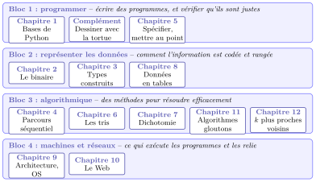
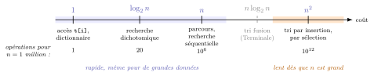
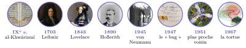
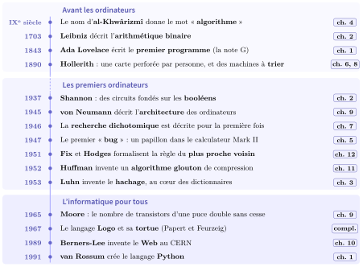

# Panorama de l'année

Les douze chapitres de l’année ne sont pas indépendants : les mêmes outils (la boucle, le tableau, le parcours) reviennent d’un chapitre à l’autre, et deux questions traversent toute l’année : **« mon programme est-il correct ? »** et **« combien coûte-t-il ? »**. Cette fiche donne une vue d’ensemble, à relire à chaque nouveau chapitre. Elle montre aussi ce que chaque chapitre prépare pour la Terminale.

### Le plan de l’année en quatre blocs

Le programme se partage en quatre grands blocs. Dans chaque bande, on lit les chapitres du bloc ; leur **numéro** indique l’ordre dans lequel on les étudie au fil de l’année.

{ .tikz loading=lazy }

On pose d’abord les bases : programmer, coder l’information, ranger les données (chapitres 1 à 3). On alterne ensuite **algorithmes** et **données**, on découvre la **machine** et le **réseau** (chapitres 9 et 10), et l’année se termine par deux méthodes d’algorithmique plus ambitieuses : les algorithmes **gloutons** et les **$k$ plus proches voisins**.

### Les deux fils rouges : correction et coût

Un bon programme doit être **correct** (il fait ce qu’on attend) et **efficace** (il ne demande pas trop d’opérations quand les données sont nombreuses). Pour le coût, on range les algorithmes sur une **échelle** ($n$ désigne la taille des données) :

{ .tikz loading=lazy }

Chaque chapitre apporte des outils pour répondre à l’une des deux questions :

| **Outil** | **L’idée** | **Chapitre** |
|:---|:---|:---|
| Spécifier et tester | Écrire ce que la fonction doit faire (préconditions, postconditions) et le vérifier par des **assertions** et des **jeux de tests**. Un test réussi ne prouve pas que le programme est juste. | 1 Bases de Python, 5 Mise au point |
| Invariant de boucle | Une propriété vraie à chaque tour de boucle, qui explique pourquoi le résultat final est le bon. | 4 Parcours, 6 Tris |
| Variant de boucle | Une quantité entière qui diminue à chaque tour : elle prouve que la boucle **se termine**. | 7 Dichotomie |
| Compter les opérations | Un parcours coûte de l’ordre de $n$, un tri par insertion de l’ordre de $n^2$, une recherche dichotomique de l’ordre de $\log_2 n$. | 4 Parcours, 6 Tris, 7 Dichotomie |
| Accepter un compromis | Un algorithme **glouton** est rapide mais ne donne pas toujours la meilleure solution. | 11 Gloutons |

!!! remarque "Remarque"

    Le $\log_2 n$ n’est qu’un **outil de comptage** : c’est le nombre de fois où l’on peut couper $n$ en deux avant d’arriver à $1$ (à peu près le nombre de bits de $n$, vu au chapitre 2). Pour un million de données, $\log_2 n \approx 20$.

### Chapitre par chapitre

Pour chaque chapitre : ce qu’il **réutilise**, et où il **resservira**, cette année ou en Terminale (signalé par « Tle »).

| **Chapitre** | **S’appuie sur…** | **Resservira dans…** |
|:---|:---|:---|
| 1 Bases de Python | aucun prérequis | tous les chapitres ; mise au point (5) ; Tle : calculabilité (terminaison) |
| Complément : la tortue | boucles et fonctions (1) | Tle : récursivité (dessins fractals) |
| 2 Le binaire | opérateurs `//`, `%`, booléens (1) | architecture (9) ; Tle : réseaux (adresses IP), cryptographie |
| 3 Types construits | bases de Python (1) | parcours, tris, dichotomie (4, 6, 7) ; données en tables (8) ; Tle : diviser pour régner (image dans une matrice) |
| 4 Parcours séquentiel | tableaux (3) | tris, dichotomie, données en tables, gloutons, $k$ plus proches voisins ; Tle : programmation dynamique |
| 5 Spécifier, mettre au point | assertions et tests (1) ; invariant (4) | tris et dichotomie (6, 7) ; Tle : calculabilité |
| 6 Les tris | parcours : patron, invariant, coût (4) | dichotomie (7) ; trier une table (8) ; $k$ plus proches voisins (12) ; Tle : tri fusion, arbres binaires de recherche |
| 7 Dichotomie | recherche séquentielle et coût (4) ; tableau trié (6) | Tle : arbres binaires de recherche |
| 8 Données en tables | listes et dictionnaires (3) ; parcours (4) | $k$ plus proches voisins (12) ; Tle : bases de données et SQL |
| 9 Architecture, OS | binaire (2) | le Web (10) ; Tle : processus, systèmes sur puce |
| 10 Le Web | architecture (9) ; fonctions (1) | Tle : bases de données (côté serveur), cryptographie (HTTPS) |
| 11 Algorithmes gloutons | parcours, coût, invariant du champion (4) | Tle : programmation dynamique, graphes (Dijkstra) |
| 12 $k$ plus proches voisins | parcours (4), tris (6), données en tables (8) | Tle : arbres |

!!! remarque "Remarque"

    Pour ceux qui continuent la NSI en Terminale, la colonne de droite le montre : chaque chapitre de Première y est réutilisé.

### Une histoire de l’informatique en quelques dates

Chaque date de cette frise correspond à une notion que l’on étudie cette année, dans le chapitre indiqué à droite. Beaucoup sont plus anciennes que les ordinateurs (l’algorithme, le binaire, le premier programme) !

{ .tikz loading=lazy }

{ .tikz loading=lazy }
