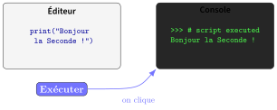
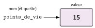
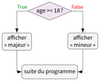
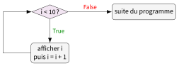

# Cours

<p class="sous-titre">Les bases de la programmation Python</p>

<span id="chap-01" class="ancre"></span>

*Bienvenue ! Rassurez-vous tout de suite : il n’y a rien de magique et rien de réservé aux « génies de l’informatique » dans ce chapitre. Programmer, c’est simplement donner des ordres très précis à une machine qui, soyons honnêtes, est extrêmement rapide mais aussi extraordinairement bête : elle fait exactement ce qu’on lui dit, ni plus, ni moins, même quand c’est absurde. Tout l’art consiste donc à lui parler correctement. Et bonne nouvelle : vous avez déjà fait de la programmation au collège avec Scratch. Ici, on va faire pareil… mais en tapant du texte au lieu d’emboîter des blocs.*

## Programmer, c’est quoi au juste ?

Programmer, c’est écrire un <span id="lex-programme01" class="ancre"></span>**programme**, c’est-à-dire une suite d’instructions données à un ordinateur pour qu’il effectue une tâche. Sans programme, un ordinateur ne sait strictement rien faire : c’est une coquille vide, un peu comme une console de jeu sans jeu.

Le seul langage que le processeur comprend vraiment est le <span id="lex-langagemachine01" class="ancre"></span>**langage machine** : une suite interminable de $0$ et de $1$. Autant dire que personne (ou presque) ne programme directement comme ça aujourd’hui — ce serait aussi agréable que de rédiger une dissertation en morse.

À la place, on écrit des instructions avec des mots (souvent en anglais), plus proches du langage humain. Un programme spécial se charge ensuite de *traduire* ces instructions en langage machine. Selon la méthode de traduction, on parle d’**interpréteur** ou de <span id="lex-compilateur01" class="ancre"></span>**compilateur**. Python, notre langage, est un langage *interprété*.

!!! definition "Définition 1"

    Un <span id="lex-langage01" class="ancre"></span>**langage de programmation** est un langage qui permet d’écrire des programmes compréhensibles par la machine (après traduction). On en distingue deux grandes familles :

    - les langages de **bas niveau** (proches de la machine, ex. l’assembleur) : très rapides, mais très pénibles à écrire ;

    - les langages de **haut niveau** (proches du langage naturel, ex. Python, C, Java) : bien plus agréables pour un humain.

Nous utiliserons **Python** (version 3), un langage de haut niveau réputé pour sa clarté. C’est aussi le langage officiel du programme de SNT et de la spécialité NSI : autant prendre de bonnes habitudes tout de suite.

!!! remarque "Remarque — Un peu d’histoire : des mots plutôt que des nombres"

    L’idée d’écrire un programme avec des **mots** n’allait pas de soi. Dans les années 1950, on programme encore les ordinateurs avec des suites de nombres. L’Américaine **Grace Hopper** (1906–1992), mathématicienne et officière de la marine des États-Unis, pense au contraire que l’ordinateur doit s’adapter à l’humain. En 1952, elle écrit l’un des tout premiers **compilateurs** : un programme qui *traduit* des instructions lisibles en langage machine. On lui répond que « les ordinateurs ne comprennent pas l’anglais » ; elle s’obstine, et ses travaux mènent au langage <span class="smallcaps">Cobol</span> (1959), utilisé dans les banques jusqu’à aujourd’hui.

    Trente ans plus tard, pendant les vacances de Noël 1989, le Néerlandais **Guido van Rossum** commence à écrire, à Amsterdam, un nouveau langage qu’il veut **simple à lire**. Il le baptise **Python**, non pas pour le serpent, mais en hommage à la troupe comique britannique des *Monty Python*. La première version est publiée en 1991 ; c’est à lui que l’on doit l’**indentation obligatoire** que vous allez découvrir. Python est aujourd’hui l’un des langages les plus utilisés au monde, de l’enseignement à l’intelligence artificielle.

    \*(image manquante : 01_hist_grace_hopper)\*  
    Grace Hopper en 1984

    \*(image manquante : 01_hist_guido_van_rossum)\*  
    Guido van Rossum en 2006

### De Scratch à Python : ce qui change (et ce qui ne change pas)

Au collège, vous avez construit des programmes en **empilant des blocs** colorés dans Scratch. En Python, vous allez faire exactement la même chose, mais en **écrivant du texte**. Les grandes idées sont identiques : des variables, des boucles, des tests, des messages à afficher…

| **En Scratch (blocs)** | **En Python (texte)** |
|:-----------------------|:----------------------|
| { .tikz .tikz-inline loading=lazy }               | `print("Bonjour")`             |
| { .tikz .tikz-inline loading=lazy }               | `score = 0`             |
| { .tikz .tikz-inline loading=lazy }               | `for i in range(10):`             |
| { .tikz .tikz-inline loading=lazy }               | `if ... :`             |

Ce qui change vraiment, c’est la **rigueur**. Dans Scratch, un bloc mal placé, au pire, ne s’emboîte pas. En Python, une virgule oubliée, une majuscule de trop ou un guillemet manquant, et l’ordinateur boude en affichant une erreur. Ce n’est pas de la méchanceté : la machine a juste besoin qu’on lui parle *exactement* dans les règles. On s’y habitue très vite.

**L’idée à garder :** passer de Scratch à Python, c’est passer des *blocs* au *texte*. Les concepts sont les mêmes ; seule la façon de les écrire change.

## L’environnement de travail

Pour écrire et exécuter nos programmes, il nous faut un outil. Nous utiliserons principalement le logiciel **Spyder**. En cas de souci (ordinateur récalcitrant, logiciel non installé…), nous aurons une solution de secours en ligne : **Basthon**.

### Prise en main de Spyder

Une fois Spyder lancé, vous obtenez une fenêtre qui ressemble à ceci :

\*(image manquante : 01_spyder)\*

Spyder est divisé en plusieurs sous-fenêtres. Deux seulement vont nous intéresser pour l’instant :

- **L’éditeur** (à gauche) : c’est là qu’on *écrit* le programme. C’est notre feuille de brouillon… non, pardon, notre feuille au propre : ce qu’on y écrit est enregistré dans un fichier et peut être relancé autant de fois qu’on veut.

- **La console** (en bas à droite, avec le `In [1]:`) : c’est là que s’affichent les résultats. On peut aussi y taper des commandes « à la volée » pour tester rapidement une idée. C’est le *vrai* brouillon jetable.

!!! regle "Règle 1"

    **Éditeur ou console ? La règle d’or.**  
    $\bullet$ On écrit le **programme** (celui qu’on veut garder) dans l’**éditeur**.  
    $\bullet$ On utilise la **console** pour **tester** vite fait et **regarder** ce que contient une variable.

#### Le tout premier programme : « Hello World »

Il existe une tradition en informatique : le premier programme qu’on écrit dans un nouveau langage affiche « Hello World » (« Bonjour le monde »). Respectons la tradition.

!!! exemple "Exemple"

    Dans la fenêtre *éditeur*, saisissez exactement :

    ```python
    print("Hello World !")
    ```

    Puis cliquez sur le **triangle vert** $\blacktriangleright$ (en haut) pour **exécuter** le programme. Spyder va vous demander d’enregistrer votre fichier : rangez-le dans un dossier de travail que vous retrouverez (par exemple `Documents/SNT/`). Dans la console, vous devez voir apparaître :

    \*(image manquante : 01_helloworld)\*

L’instruction `print(...)` (« imprimer » en anglais, au sens d’« afficher ») sert à **afficher un message dans la console**. C’est l’équivalent du bloc { .tikz .tikz-inline loading=lazy } de Scratch. Le message à afficher se met entre **guillemets** et entre **parenthèses**.

!!! remarque "Remarque"

    Attention aux petits détails, la machine ne pardonne rien :

    - `print` s’écrit en minuscules (pas `Print` ni `PRINT`) ;

    - il faut des *parenthèses* `( )` et des *guillemets droits* `" "` ;

    - tout doit être écrit en caractères « normaux » : pas de guillemets « à la française » ni de guillemets « courbes » du traitement de texte.

### Basthon : la solution de secours

Il arrivera qu’un poste ne veuille rien savoir : Spyder plante, n’est pas installé, ou vous travaillez sur votre propre ordinateur à la maison. Dans ce cas, direction **Basthon**, un « bac à sable » Python qui fonctionne **directement dans le navigateur**, sans rien installer.

{ .tikz loading=lazy }

On retrouve exactement la même organisation que dans Spyder : **on écrit à gauche**, on clique sur **Exécuter**, et **le résultat s’affiche à droite**. Rien de nouveau à apprendre, c’est rassurant.

!!! regle "Règle 2"

    **Utiliser Basthon en 3 étapes :**

    1.  Ouvrez un navigateur et allez sur <https://console.basthon.fr>.

    2.  Écrivez votre programme dans la zone de gauche (l’éditeur).

    3.  Cliquez sur **Exécuter** : le résultat apparaît dans la console de droite.

!!! remarque "Remarque"

    Basthon dépanne très bien, mais il ne conserve pas vos fichiers d’une séance à l’autre aussi facilement que Spyder. Pensez à **télécharger** votre travail (bouton en forme de flèche vers le bas) si vous voulez le garder.

!!! exemple "Exemple — Le détective"

    Le programme ci-dessous contient **trois** erreurs qui empêchent Python de l’exécuter. Les retrouver et les corriger.

    ```text
    Print("Bonjour)
    print(Au revoir)
    ```

    ??? corrige "Correction"

        Les trois erreurs : `Print` prend une majuscule (Python écrit `print`) ; le guillemet fermant manque après `Bonjour` ; `Au revoir` est du texte, il doit être entre guillemets. Le programme corrigé :

        ```python
        print("Bonjour")
        print("Au revoir")
        ```

<span id="cours-01-1" class="ancre"></span>

<span class="afaire">▶ Exercices d'application :</span> exercices **[1](exercices.md#ex-01-1) à [3](exercices.md#ex-01-3)** (premiers pas : afficher)

## Les variables

### L’idée : une boîte étiquetée dans la mémoire

Un ordinateur passe son temps à *traiter des données* : des nombres, des mots, etc. Pour manipuler une donnée, il doit d’abord la **ranger** quelque part dans sa mémoire (la RAM). Cette mémoire est faite d’une multitude de petites cases.

!!! definition "Définition 2"

    Une <span id="lex-variable01" class="ancre"></span>**variable** est une donnée temporaire rangée dans la mémoire. Elle possède :

    - un **nom** : l’étiquette qui permet de la retrouver ;

    - une **valeur** : la donnée qu’elle contient (par exemple le nombre $15$).

    On dit qu’elle est « variable » car sa valeur peut **changer** au cours du programme.

{ .tikz loading=lazy }

Pour créer une variable, on utilise le signe `=`, appelé <span id="lex-affectation01" class="ancre"></span>**affectation** :

```python
points_de_vie = 15
```

Cette ligne se lit : « la variable `points_de_vie` prend la valeur $15$ ». On dit aussi que `points_de_vie` *référence* le nombre $15$.

!!! passerelle "Passerelle avec Scratch"

    Vous connaissez déjà ça ! Dans Scratch, le bloc { .tikz .tikz-inline loading=lazy } fait exactement la même chose. En Python, on écrit simplement `points_de_vie = 15`.

!!! remarque "Remarque"

    Le signe `=` en Python ne veut **pas** dire « est égal à » comme en maths ! Il veut dire « **reçoit** la valeur ». La ligne `points_de_vie = 15` est un ordre : « range $15$ dans la boîte `points_de_vie` ». C’est une nuance importante, on y revient au § IV.

### Afficher et inspecter une variable

Une fois la variable créée, comment voir ce qu’elle contient ? Deux façons.

**1. Dans un programme**, avec `print` :

```python
points_de_vie = 15
print(points_de_vie)
```

(On écrit le nom *sans* guillemets : on veut afficher la *valeur* rangée dans la boîte, pas le mot « points_de_vie ».)

**2. Dans la console**, en tapant simplement le nom de la variable après avoir exécuté le programme :

\*(image manquante : 01_pointdevie)\*

### Bien nommer ses variables

On a le droit de choisir presque n’importe quel nom… mais pas tout à fait n’importe comment.

!!! regle "Règle 3"

    **Règles pour nommer une variable :**

    - uniquement des lettres, des chiffres et le tiret bas `_` ;

    - **pas d’espace** et **pas de caractères spéciaux** (`-`, `!`, `€`, `?`, etc.) ;

    - le nom ne commence **jamais** par un chiffre ;

    - Python fait la différence entre majuscules et minuscules : `Age`, `age` et `AGE` sont trois variables *différentes* !

!!! remarque "Remarque"

    **Et les accents ?** Python accepte les lettres accentuées : `prénom` ou `année` sont des noms valides. Mais c’est une **bonne pratique** de s’en passer (`prenom`, `annee`) : les accents sont pénibles à taper sur certains claviers, et la quasi-totalité des programmes du monde est écrite sans. On évitera donc les accents dans nos noms de variables.

**Conseil de pro :** donnez à vos variables des noms qui *veulent dire quelque chose*. `prix_total` est mille fois plus clair que `x` ou `truc`. Votre vous du futur (celui qui relira ce code dans deux semaines) vous remerciera.

| **Nom**   | **Valide ?**  | **Pourquoi**                                |
|:----------|:--------------|:--------------------------------------------|
| `age` | **oui**       | parfait                                     |
| `prix_total` | **oui**       | clair et lisible                            |
| `note2` | **oui**       | un chiffre à la fin, autorisé               |
| `2note` | **non**       | commence par un chiffre                     |
| `prix total` | **non**       | contient une espace                         |
| `prénom` | **oui, mais** | accepté, mais à éviter (préférez `prenom`) |

<span id="cours-01-4" class="ancre"></span>

<span class="afaire">▶ Exercices d'application :</span> exercices **[4](exercices.md#ex-01-4) à [7](exercices.md#ex-01-7)** (les variables)

## Les types de données

<span id="lex-type01" class="ancre"></span> Toutes les données ne se ressemblent pas : un nombre entier, un nombre à virgule, un mot, une réponse « vrai / faux »… Python range chaque donnée dans une **catégorie**, qu’on appelle son **type**. Connaître le type, c’est savoir ce qu’on a le droit de faire avec (on n’additionne pas un mot et un nombre comme on additionne deux nombres).

!!! definition "Définition 3"

    Les quatre types de base que nous rencontrerons :

    - `int` : un nombre **entier** (*integer*), ex. `12`, `-4`, `0` ;

    - `float` : un nombre **à virgule** (*flottant*), ex. `5.2`, `-0.5` ;

    - `str` : une <span id="lex-chaine01" class="ancre"></span>**chaîne de caractères** (*string*), du texte, ex. `"Bonjour"` ;

    - `bool` : un <span id="lex-booleen01" class="ancre"></span>**booléen**, qui vaut `True` (vrai) ou `False` (faux). (On l’étudie au § VIII.)

!!! remarque "Remarque"

    **Le point à la place de la virgule !** En Python (comme dans le monde anglo-saxon), le nombre « cinq virgule deux » s’écrit `5.2` et **pas** `5,2`. Écrire une virgule donnerait un résultat inattendu (Python croit qu’on lui donne deux nombres). C’est l’erreur classique de début d’année.

Pour connaître le type d’une donnée, on utilise l’instruction `type(...)` :

!!! exemple "Exemple"

    Testez ce programme, puis tapez `type(a)` puis `type(b)` dans la console :

    ```python
    a = 5.2
    b = 12
    ```

    \*(image manquante : 01_types)\*

    La console répond `float` pour `a` et `int` pour `b`.

### Changer de type (conversion)

On peut demander à Python de **transformer** une donnée d’un type vers un autre, quand c’est possible :

- `int("42")` transforme le texte `"42"` en entier `42` ;

- `float("3.14")` transforme du texte en flottant ;

- `str(42)` transforme le nombre `42` en texte `"42"`.

Ces conversions seront très utiles au § VI, quand on voudra mélanger nombres et texte.

!!! exemple "Exemple — Conversions"

    *Sans machine*, donner le type *et* la valeur de chaque résultat, puis vérifier :

    ```python
    int("12")
    str(12)
    float("3.5")
    int(3.9)
    ```

    (La dernière ligne est un piège amusant : `int` ne fait pas d’arrondi, il coupe.)

    ??? corrige "Correction"

        `int("12")` donne l’entier `12` (`int`) ; `str(12)` donne le texte `"12"` (`str`) ; `float("3.5")` donne le flottant `3.5` (`float`) ; `int(3.9)` donne l’entier `3` (`int`) : la partie après la virgule est **coupée**, pas arrondie.

<span id="cours-01-8" class="ancre"></span>

<span class="afaire">▶ Exercices d'application :</span> exercices **[8](exercices.md#ex-01-8) et [9](exercices.md#ex-01-9)** (les types ; l’échange)

## Un peu de calculs

Un ordinateur, c’est d’abord une grosse calculette. Python connaît les opérations habituelles :

| **Symbole** | **Opération**                 |         **Exemple**         |
|:-----------:|:------------------------------|:---------------------------:|
| `+`  | addition                      | `3 + 4` donne `7` |
| `-`  | soustraction                  | `10 - 6` donne `4` |
| `*`  | multiplication                | `3 * 5` donne `15` |
| `/`  | division                      | `7 / 2` donne `3.5` |
| `//`  | division entière (quotient)   | `7 // 2` donne `3` |
| `%`  | modulo (reste de la division) | `7 % 2` donne `1` |
| `**`  | puissance                     | `2 ** 3` donne `8` |

Les deux lignes `//` et `%` méritent une mention spéciale. Elles répondent à la question de l’école primaire : « dans $7$, combien de fois $2$, et combien reste-t-il ? » Réponse : $3$ fois, et il reste $1$. Le modulo `%` est étonnamment utile (par exemple, un nombre est pair si `n % 2` vaut $0$).

On peut calculer avec des nombres, mais aussi (et surtout) avec des **variables** :

!!! exemple "Exemple"

    ```python
    a = 6
    b = 4
    somme = a + b
    produit = a * b
    ```

    Après exécution, `somme` vaut $10$ et `produit` vaut $24$.

### Le grand classique : `a = a + 1`

Voici une ligne qui déroute tout le monde au début :

```python
a = 11
a = a + 1
```

En maths, « $a = a + 1$ » est impossible (aucun nombre n’est égal à lui-même plus un). Mais souvenez-vous : en Python, `=` ne veut pas dire « est égal à », il veut dire « **reçoit** ». La règle pour comprendre :

!!! regle "Règle 4"

    **On lit une affectation de *droite à gauche*.**  
    On calcule d’abord tout ce qui est à droite du `=`, *puis* on range le résultat dans la variable de gauche.

Déroulons `a = a + 1` : à droite, `a + 1` vaut $11 + 1 = 12$. On range donc $12$ dans `a`. Résultat : `a` vaut maintenant $12$. On vient d’**augmenter** `a` de $1$ (on dit « incrémenter »). Cette technique est partout en programmation, par exemple pour compter des points dans un jeu.

!!! passerelle "Passerelle avec Scratch"

    Encore une vieille connaissance ! Le bloc Scratch { .tikz .tikz-inline loading=lazy } fait exactement ce que fait `a = a + 1`.

### Fonctions mathématiques : le module `math`

Pour des calculs plus avancés (racine carrée, cosinus…), il faut charger une boîte à outils supplémentaire, le <span id="lex-module01" class="ancre"></span>**module** `math`. On l’importe en **tout début de programme** :

```python
import math

racine = math.sqrt(16)      # racine carree de 16 -> 4.0
puissance = math.pow(2, 5)  # 2 puissance 5 -> 32.0
```

Quelques fonctions utiles : `math.sqrt(x)` (racine carrée), `math.cos(x)`, `math.sin(x)` (l’angle `x` est en radians, une unité vue en maths), `math.pi` (la constante $\pi$). La liste complète est dans la documentation officielle : <https://docs.python.org/fr/3/library/math.html>.

!!! remarque "Remarque"

    Pour une simple puissance, l’opérateur `**` suffit et est plus court : `2 ** 5` donne directement `32` (un entier), là où `math.pow(2, 5)` donne `32.0` (un flottant).

!!! exemple "Exemple — L’aire du disque"

    Écrire un programme qui, à partir d’une variable `rayon`, calcule et affiche l’aire d’un disque (rappel : aire $= \pi \times r^2$). Utiliser `math.pi`.

    ??? corrige "Correction"

        On importe le module `math` pour disposer de $\pi$ :

        ```python
        import math

        rayon = 3
        aire = math.pi * rayon ** 2
        print(aire)
        ```

        Pour un rayon de $3$, le programme affiche `28.274333882308138`.

<span id="cours-01-10" class="ancre"></span>

<span class="afaire">▶ Exercices d'application :</span> exercices **[10](exercices.md#ex-01-10) à [16](exercices.md#ex-01-16)** (les calculs)

## Chaînes de caractères, entrées et sorties

On a déjà croisé les chaînes de caractères (le texte entre guillemets). Voyons ce qu’on peut en faire, et surtout comment **dialoguer** avec l’utilisateur.

### Coller des chaînes : la concaténation

Le signe `+` ne sert pas qu’à additionner : avec du texte, il sert à **coller bout à bout** deux chaînes. <span id="lex-concatenation01" class="ancre"></span>On appelle ça la **concaténation**.

!!! exemple "Exemple — Concaténation"

    ```python
    debut = "Bonjour "
    fin = "le monde !"
    message = debut + fin
    print(message)   # affiche : Bonjour le monde !
    ```

!!! remarque "Remarque"

    L’espace après « Bonjour » est important : sans lui, on obtiendrait « Bonjourle monde ! ». La machine colle *exactement* ce qu’on lui donne. On peut aussi *répéter* une chaîne avec `*` : `"ha" * 3` donne `"hahaha"`.

### Mélanger texte et nombres

Que se passe-t-il si on essaie de coller du texte et un nombre ?

!!! exemple "Exemple — Un mélange interdit"

    ```python
    age = 15
    message = "J'ai " + age + " ans"   # ERREUR !
    ```

    Python renvoie une erreur : il refuse de coller du texte (`str`) et un nombre (`int`). C’est comme demander « combien font une pomme plus le mot chat ? ».

Deux solutions élégantes :

**Solution 1 — convertir avec `str` :**

```python
age = 15
message = "J'ai " + str(age) + " ans"
```

**Solution 2 — les f-strings (la plus pratique) :** on place un `f` juste avant le guillemet ouvrant, et on glisse les variables entre **accolades** `{ }` :

```python
age = 15
message = f"J'ai {age} ans"
```

C’est plus lisible, et on peut mettre plusieurs variables dans la même chaîne. Les f-strings deviendront vite votre réflexe.

### Parler à l’utilisateur : `input`

Jusqu’ici, nos programmes récitaient un texte tout prêt. Pour les rendre vivants, on veut pouvoir **poser une question** et **récupérer la réponse** tapée au clavier. C’est le rôle de `input(...)` :

```python
prenom = input("Comment t'appelles-tu ? ")
print(f"Bonjour {prenom} !")
```

!!! passerelle "Passerelle avec Scratch"

    Souvenir de Scratch : le bloc { .tikz .tikz-inline loading=lazy } affichait une question et rangeait la réponse dans le bloc { .tikz .tikz-inline loading=lazy }. En Python, `input("...")` fait les deux d’un coup : il pose la question *et* renvoie ce que l’utilisateur a tapé.

!!! regle "Règle 5"

    **Piège à connaître :** `input` renvoie **toujours du texte** (`str`), même si l’utilisateur tape un nombre ! Pour calculer avec, il faut le **convertir** :

    ```python
    age = int(input("Quel est ton age ? "))
    print(f"L'an prochain tu auras {age + 1} ans.")
    ```

    Sans le `int(...)`, la ligne `age + 1` planterait (on ne peut pas ajouter $1$ à du texte).

!!! exemple "Exemple — La somme dialoguée"

    Écrire un programme qui demande deux nombres à l’utilisateur, puis affiche leur somme sous la forme « La somme vaut …». (Attention à convertir les entrées avec `int` !)

    ??? corrige "Correction"

        Chaque saisie est convertie en entier dès la lecture :

        ```python
        a = int(input("Premier nombre ? "))
        b = int(input("Second nombre ? "))
        print(f"La somme vaut {a + b}")
        ```

        Sans les `int(...)`, `a` et `b` seraient du texte : en tapant `3` et `4`, on obtiendrait `34` (concaténation) au lieu de `7`.

<span id="cours-01-17" class="ancre"></span>

<span class="afaire">▶ Exercices d'application :</span> exercices **[17](exercices.md#ex-01-17) à [21](exercices.md#ex-01-21)** (chaînes, entrées/sorties)

## Les fonctions

<span id="lex-fonction01" class="ancre"></span>

### L’idée : une petite machine à transformer

Quand un programme grandit, on a besoin de l’organiser en **morceaux réutilisables** : les **fonctions**. Une fonction, c’est un mini-programme qui a un nom, à qui on peut donner des valeurs d’entrée, et qui (souvent) renvoie un résultat.

L’idée est très proche de la fonction mathématique : $$\begin{matrix} \text{valeur d'entrée} \\ \text{(le « paramètre »)} \end{matrix}
\;\longrightarrow\; \boxed{\ \text{fonction}\ } \;\longrightarrow\;
\begin{matrix} \text{valeur de sortie} \\ \text{(renvoyée par « return »)} \end{matrix}$$

En maths, si $f(x) = 3x + 2$, alors pour $x = 4$ on obtient $y = 14$. Codons exactement cette fonction en Python :

```python
def ma_fonction(x):
    y = 3 * x + 2
    return y
```

Décortiquons cette syntaxe, ligne par ligne :

- `def` annonce qu’on **définit** une fonction (*define*) ;

- `ma_fonction` est le nom qu’on lui donne ;

- `(x)` est le <span id="lex-parametre01" class="ancre"></span>**paramètre** : la valeur d’entrée ;

- les **deux-points** `:` ouvrent le « corps » de la fonction ;

- `return` indique la valeur **renvoyée**.

### L’indentation : le décalage sacré

Vous avez remarqué le **décalage** des lignes à l’intérieur de la fonction ? Ce décalage s’appelle l’<span id="lex-indentation01" class="ancre"></span>**indentation**. Il n’est pas décoratif : en Python, c’est lui qui indique quelles lignes appartiennent à la fonction.

!!! regle "Règle 6"

    **L’indentation définit les « blocs » de code.** Les lignes décalées (4 espaces, ou une tabulation) forment le **corps** de la fonction. Dès qu’une ligne revient à la marge de gauche, elle est *hors* de la fonction.

C’est l’équivalent, en Scratch, du fait qu’un bloc soit *à l’intérieur* d’un autre bloc qui l’enveloppe. Sauf qu’ici, l’emboîtement se voit au décalage. **Attention** : Python est intraitable là-dessus. Une indentation qui n’est pas régulière, et c’est l’erreur `IndentationError`. Choisissez les 4 espaces (le standard) et n’en changez plus.

### Utiliser (« appeler ») une fonction

Définir une fonction ne la fait pas travailler : c’est comme acheter un robot mixeur et le laisser dans son carton. Il faut **l’appeler** en écrivant son nom suivi de la valeur à lui donner :

!!! exemple "Exemple"

    ```python
    def ma_fonction(x):
        return 3 * x + 2

    solution = ma_fonction(4)
    print(solution)   # affiche 14
    ```

    Au moment de l’exécution, `ma_fonction(4)` est *remplacé* par la valeur renvoyée, c’est-à-dire $14$.

    \*(image manquante : 01_mafonction)\*

### Plusieurs paramètres, ou aucun

Une fonction peut recevoir plusieurs paramètres, séparés par des virgules. Les paramètres peuvent aussi être du texte :

!!! exemple "Exemple"

    ```python
    def dit_bonjour(nom, age):
        return f"Bonjour {nom}, tu as {age} ans."

    print(dit_bonjour("Toto", 14))
    ```

    Affiche : `Bonjour Toto, tu as 14 ans.`

### Le grand piège : `return` n’est pas `print` !

Voici la confusion la plus fréquente de l’année. Retenez bien la différence :

!!! regle "Règle 7"

    $\bullet$ `print(...)` **affiche** quelque chose à l’écran (pour l’humain). Ça *ne* renvoie *rien* d’utilisable par le programme.  
    $\bullet$ `return ...` **renvoie** une valeur au programme (pour la machine). On peut la ranger dans une variable et la réutiliser.

Une fonction qui utilise `print` mais pas `return` *montre* un résultat mais ne le *rend* pas : impossible de le récupérer pour continuer un calcul. Dans certains langages, une telle fonction « qui ne renvoie rien » s’appelle une **procédure**.

!!! exemple "Exemple — return vs print"

    ```python
    def carre_return(x):
        return x * x

    def carre_print(x):
        print(x * x)

    resultat = carre_return(5)   # resultat vaut 25, on peut s'en servir
    resultat = carre_print(5)    # affiche 25, mais resultat vaut... rien (None) !
    ```

!!! exemple "Exemple — A ou B ?"

    Expliquer avec ses propres mots la différence entre la fonction `A` et la fonction `B`. Laquelle permet de récupérer le résultat pour l’utiliser ensuite ?

    ```python
    def A(x):
        return x + 1

    def B(x):
        print(x + 1)
    ```

    ??? corrige "Correction"

        `A` **renvoie** `x + 1` : on peut récupérer ce résultat, par exemple `r = A(3)` range `4` dans `r`. `B` se contente d’**afficher** `x + 1` : l’écran montre `4`, mais `s = B(3)` range `None` (« rien ») dans `s`. Seule la fonction `A` permet de réutiliser le résultat.

<span id="cours-01-22" class="ancre"></span>

<span class="afaire">▶ Exercices d'application :</span> exercices **[22](exercices.md#ex-01-22) à [29](exercices.md#ex-01-29)** (les fonctions)

## Booléens et comparaisons

### Vrai ou faux : le type booléen

Si je vous dis « $4$ est égal à $5$ », vous répondez « faux ». Si je dis « $7$ est égal à $7$ », vous répondez « vrai ». Ces réponses « vrai / faux » sont ce qu’on appelle des **booléens**. En Python, il n’y a que deux booléens : `True` (vrai) et `False` (faux), avec une majuscule.

Une **comparaison** produit un booléen. Le test d’égalité s’écrit avec un **double** signe égal `==` :

!!! exemple "Exemple"

    Tapez dans la console :

    ```python
    4 == 5     # renvoie False
    7 == 7     # renvoie True
    ```

!!! regle "Règle 8"

    **Ne confondez jamais `=` et `==` !**  
    $\bullet$ `=` **affecte** une valeur : `age = 15` range $15$ dans `age`.  
    $\bullet$ `==` **compare** : `age == 15` demande « est-ce que `age` vaut $15$ ? » et renvoie `True` ou `False`.  
    C’est l’erreur la plus courante du monde entier. Vous voilà prévenus.

Les opérateurs de comparaison :

| **Opérateur** | **Sens**              | **Opérateur** | **Sens**              |
|:-------------:|:----------------------|:-------------:|:----------------------|
|  `==`   | égal à                |  `!=`   | différent de          |
|  `<`   | strictement inférieur |  `>`   | strictement supérieur |
|  `<=`   | inférieur ou égal     |  `>=`   | supérieur ou égal     |

### Combiner des conditions : `and`, `or`, `not`

On peut relier plusieurs comparaisons avec les **opérateurs logiques** : `and` (« et »), `or` (« ou ») et `not` (« non »).

- `A and B` est vrai **seulement si** `A` *et* `B` sont vrais tous les deux ;

- `A or B` est vrai **dès que** `A` *ou* `B` (ou les deux) est vrai ;

- `not A` inverse : vrai devient faux, et inversement.

On résume tout dans des **tables de vérité** :

Le « et » (`and`)

| `A` | `B` | `A and B` |
|:----------:|:----------:|:----------:|
|     V      |     V      |   **V**    |
|     V      |     F      |     F      |
|     F      |     V      |     F      |
|     F      |     F      |     F      |

Le « ou » (`or`)

| `A` | `B` | `A or B` |
|:----------:|:----------:|:----------:|
|     V      |     V      |   **V**    |
|     V      |     F      |   **V**    |
|     F      |     V      |   **V**    |
|     F      |     F      |     F      |

!!! remarque "Remarque"

    Le « ou » de l’informatique est *inclusif* : « fromage ou dessert » à la cantine version Python, ça voudrait dire qu’on a le droit aux deux. Dommage que la vraie cantine utilise le « ou » exclusif…

!!! exemple "Exemple — Vrai ou faux ?"

    *Sans machine*, donner `True` ou `False` pour chaque expression, avec `a = 4` et `b = 7` :

    ```python
    a == b
    a != b
    a < b
    a >= 4
    ```

    ??? corrige "Correction"

        Avec `a = 4` et `b = 7` : `a == b` vaut `False` ; `a != b` vaut `True` ; `a < b` vaut `True` ; `a >= 4` vaut `True` ($4$ est bien supérieur *ou égal* à $4$).

!!! exemple "Exemple — Combinaisons logiques"

    *Sans machine*, évaluer ces expressions :

    ```python
    (3 > 2) and (5 == 5)
    (3 > 2) and (5 == 6)
    (3 > 2) or (5 == 6)
    not (3 > 2)
    ```

    ??? corrige "Correction"

        `True` (les deux sont vraies) ; `False` (`5 == 6` est faux, donc le « et » est faux) ; `True` (il suffit que `3 > 2` soit vrai) ; `False` (`not` inverse `True`).

!!! exemple "Exemple — Traduire une phrase en condition"

    Écrire l’expression Python qui teste si une variable `note` est comprise **entre $0$ et $20$** (bornes incluses). Indice : il faut relier deux comparaisons avec `and`.

    ??? corrige "Correction"

        `note >= 0 and note <= 20`. (Python accepte aussi l’écriture raccourcie `0 <= note <= 20`.)

## Les instructions conditionnelles

<span id="lex-condition01" class="ancre"></span>

### « Si… alors… sinon…»

Un programme intéressant doit pouvoir **prendre des décisions** : faire une chose dans un cas, une autre dans l’autre. C’est le rôle du `if` (« si ») et du `else` (« sinon ») :

```python
if age >= 18:
    print("Tu es majeur.")
else:
    print("Tu es mineur.")
```

Si la condition `age >= 18` est `True`, le bloc du `if` s’exécute (et celui du `else` est ignoré). Sinon, c’est l’inverse. Remarquez encore l’**indentation** et les **deux-points** : ce sont eux qui délimitent chaque bloc.

{ .tikz loading=lazy }

!!! passerelle "Passerelle avec Scratch"

    C’est le bloc Scratch { .tikz .tikz-inline loading=lazy } que vous connaissez. En Python, `si` devient `if` et `sinon` devient `else`.

### Plusieurs cas : `elif`

Parfois il y a plus de deux possibilités. On utilise alors `elif` (contraction de « *else if* », « sinon si ») autant de fois que nécessaire :

!!! exemple "Exemple — Les mentions"

    ```python
    note = 13
    if note >= 16:
        print("Tres bien")
    elif note >= 12:
        print("Bien")
    elif note >= 10:
        print("Passable")
    else:
        print("Insuffisant")
    ```

    Python teste les conditions **dans l’ordre** et s’arrête à la première qui est vraie.

!!! exemple "Exemple — La facture du magasin"

    Pour un magasin, écrire une fonction `facture` qui prend en paramètres le prix unitaire d’un article et le nombre d’articles achetés, et renvoie le montant à payer. Règle commerciale : si le client achète au moins $5$ articles, il bénéficie de $5\,\%$ de réduction sur le total.

    ??? corrige "Correction"

        On calcule le total, puis on applique la réduction seulement si la condition est vraie :

        ```python
        def facture(prix_unitaire, nombre):
            total = prix_unitaire * nombre
            if nombre >= 5:
                total = total * 0.95   # 5 % de reduction
            return total
        ```

        Par exemple `facture(10, 4)` renvoie `40` et `facture(10, 5)` renvoie `47.5`.

<span id="cours-01-30" class="ancre"></span>

<span class="afaire">▶ Exercices d'application :</span> exercices **[30](exercices.md#ex-01-30) à [38](exercices.md#ex-01-38)** (booléens et instructions conditionnelles)

## Les boucles

<span id="lex-boucle01" class="ancre"></span> Dernière grande notion, et non des moindres : les **boucles**. Une boucle permet de **répéter** des instructions sans les réécrire dix fois. C’est LA raison pour laquelle les ordinateurs sont si puissants : ils ne se lassent jamais de répéter.

Le programme officiel distingue deux familles de boucles : les boucles **bornées** (on sait à l’avance combien de tours) et les boucles **non bornées** (on tourne jusqu’à ce qu’une condition soit remplie).

### La boucle bornée : `for`

Quand on connaît le **nombre de répétitions** à l’avance, on utilise `for` avec `range` :

!!! exemple "Exemple"

    ```python
    for i in range(5):
        print("Bonjour")
    ```

    Affiche « Bonjour » exactement $5$ fois.

`range(5)` fabrique la suite de nombres $0, 1, 2, 3, 4$ (cinq nombres, en commençant à $0$ — une habitude déroutante mais universelle en informatique). À chaque tour, la variable `i` prend la valeur suivante. On peut d’ailleurs s’en servir :

!!! exemple "Exemple"

    ```python
    for i in range(1, 6):
        print(i)
    ```

    `range(1, 6)` va de $1$ **inclus** à $6$ **exclu**. Le programme affiche donc $1, 2, 3, 4, 5$.

!!! passerelle "Passerelle avec Scratch"

    C’est le bloc { .tikz .tikz-inline loading=lazy } de Scratch. Simple, non ?

### La boucle non bornée : `while`

Quand on **ne sait pas** à l’avance combien de tours seront nécessaires, mais qu’on sait *à quelle condition* s’arrêter, on utilise `while` (« tant que ») :

```python
i = 0
while i < 10:
    print(i)
    i = i + 1
print("Termine !")
```

Tant que la condition `i < 10` est vraie, le bloc indenté se répète. À chaque tour, on augmente `i` de $1$ ; quand `i` atteint $10$, la condition devient fausse et on sort de la boucle.

{ .tikz loading=lazy }

!!! regle "Règle 9"

    **Danger : la boucle infinie !** Si la condition d’un `while` ne devient *jamais* fausse, le programme tourne pour l’éternité (ou jusqu’à ce qu’on l’arrête). Dans l’exemple ci-dessus, si on oublie la ligne `i = i + 1`, alors `i` reste à $0$, la condition `i < 10` reste vraie… et Python affiche $0$ jusqu’à la fin des temps. Pour arrêter un programme emballé dans Spyder : le bouton **stop** rouge (ou { .tikz .tikz-inline loading=lazy } + { .tikz .tikz-inline loading=lazy } dans la console).

!!! passerelle "Passerelle avec Scratch"

    Cela ressemble au bloc { .tikz .tikz-inline loading=lazy } de Scratch — avec une petite subtilité : Scratch répète *jusqu’à ce que* la condition soit vraie, alors que `while` répète *tant que* la condition est vraie. C’est la même idée vue à l’envers.

### `for` ou `while` : lequel choisir ?

**Le bon réflexe :** si vous pouvez compléter la phrase « je vais répéter *tant de fois* », prenez une boucle `for`. Si vous ne pouvez compléter que « je répète *tant que…* » ou « *jusqu’à ce que…* », prenez un `while`.

!!! exemple "Exemple — Table de multiplication"

    Écrire une fonction `table` qui prend en paramètre un entier et affiche sa table de multiplication de $1$ à $10$. Par exemple `table(3)` affiche « $1 \times 3 = 3$ », « $2 \times 3 = 6$ », …, « $10 \times 3 = 30$ ».

    ??? corrige "Correction"

        La variable `i` parcourt les entiers de $1$ à $10$ :

        ```python
        def table(n):
            for i in range(1, 11):
                print(f"{i} x {n} = {i * n}")
        ```

!!! exemple "Exemple — Mystère mathématique"

    *Sans machine*, quelle est la valeur finale de `x` ? Vérifier ensuite.

    ```python
    x = 1
    n = 5
    while n > 1:
        x = x * n
        n = n - 1
    ```

    (Petit indice : le résultat porte un nom connu en maths…)

    ??? corrige "Correction"

        Suivons les variables tour après tour :

        |            | départ | tour 1 | tour 2 | tour 3 | tour 4 |
        |:----------:|:------:|:------:|:------:|:------:|:------:|
        | `x` |  $1$   |  $5$   |  $20$  |  $60$  | $120$  |
        | `n` |  $5$   |  $4$   |  $3$   |  $2$   |  $1$   |

        Quand `n` vaut $1$, la condition `n > 1` est fausse et la boucle s’arrête : `x` vaut $120 = 5 \times 4 \times 3 \times 2 \times 1$. C’est la **factorielle** de $5$, notée $5!$.

<span id="cours-01-39" class="ancre"></span>

<span class="afaire">▶ Exercices d'application :</span> exercices **[39](exercices.md#ex-01-39) à [47](exercices.md#ex-01-47)** (les boucles)

## Mini-projets de synthèse

Vous avez maintenant toutes les briques : variables, types, calculs, chaînes, fonctions, conditions et boucles. Assemblons-les dans de vrais petits programmes.

!!! exemple "Exemple — Le quiz"

    Écrire un programme qui pose $3$ questions de culture générale à l’utilisateur (avec `input`), compte le nombre de bonnes réponses dans une variable `score`, et affiche le score final sous la forme « Vous avez *score*/3 ».

    ??? corrige "Correction"

        Une variable `score` compte les bonnes réponses :

        ```python
        score = 0
        reponse = input("Quelle est la capitale de l'Italie ? ")
        if reponse == "Rome":
            score = score + 1
        reponse = input("Combien font 7 x 8 ? ")
        if reponse == "56":
            score = score + 1
        reponse = input("Quelle planete est la plus proche du Soleil ? ")
        if reponse == "Mercure":
            score = score + 1
        print(f"Vous avez {score}/3")
        ```

        Remarque : on compare `reponse` au *texte* `"56"`, puisque `input` renvoie toujours du texte.

!!! exemple "Exemple — Deviner le nombre"

    L’ordinateur « pense » à un nombre entre $1$ et $100$ ; l’utilisateur doit le deviner. Après chaque proposition, le programme répond « trop grand » ou « trop petit », jusqu’à ce que l’utilisateur trouve. On tire un nombre au hasard avec le module `random` :

    ```python
    import random
    secret = random.randint(1, 100)   # un entier au hasard entre 1 et 100
    ```

    (Indice : c’est un cas typique de boucle `while` — on ne sait pas combien d’essais il faudra.)

    ??? corrige "Correction"

        On redemande un nombre **tant que** la proposition est différente du secret :

        ```python
        import random
        secret = random.randint(1, 100)

        proposition = int(input("Votre proposition ? "))
        while proposition != secret:
            if proposition > secret:
                print("trop grand")
            else:
                print("trop petit")
            proposition = int(input("Votre proposition ? "))
        print("Bravo, vous avez trouve !")
        ```

!!! exemple "Exemple — Le distributeur poli"

    Écrire une fonction `distributeur` qui prend en paramètre le montant retiré et affiche un message adapté : refuse si le montant est négatif ou nul, prévient si le montant dépasse $300$ (plafond), et confirme le retrait sinon.

    ??? corrige "Correction"

        Trois cas, donc un `if`, un `elif` et un `else` :

        ```python
        def distributeur(montant):
            if montant <= 0:
                print("Retrait refuse : montant invalide.")
            elif montant > 300:
                print("Retrait refuse : le plafond est de 300 euros.")
            else:
                print(f"Retrait de {montant} euros confirme.")
        ```

!!! exemple "Exemple — Le thermomètre"

    Écrire une fonction `celsius_vers_fahrenheit` qui convertit une température (rappel : $F = C \times 1{,}8 + 32$). Puis, à l’aide d’une boucle, afficher la table de conversion de $0$ à $100$ °C, de $10$ en $10$.

    ??? corrige "Correction"

        La fonction traduit la formule ; la boucle parcourt $0, 10, 20, \ldots, 100$ grâce au pas de `range` :

        ```python
        def celsius_vers_fahrenheit(c):
            return c * 1.8 + 32

        for c in range(0, 101, 10):
            print(f"{c} C = {celsius_vers_fahrenheit(c)} F")
        ```

        Le programme affiche `0 C = 32.0 F`, `10 C = 50.0 F`, …, jusqu’à `100 C = 212.0 F`.

!!! remarque "Remarque — Liens avec d’autres chapitres"

    Python sert d’outil dans plusieurs thèmes de SNT. Au chapitre *Photographie numérique*, deux boucles `for` imbriquées parcourent tous les **pixels** d’une image pour la retoucher ; au chapitre *Informatique embarquée et objets connectés*, une boucle `while` et un test `if` forment la **boucle de commande** d’un thermostat. La fiche *Turtle* met en images les boucles et les fonctions, et **filtrer** une table de données (chapitre *Données en tables*) revient à tester des conditions combinées par `and` et `or`. En spécialité NSI de Première, ces mêmes bases s’enrichissent de nouveaux types (**listes**, **dictionnaires**) pour traiter des données plus volumineuses.

## Aide-mémoire

| **Je veux…**                        | **J’écris…** |
|:------------------------------------|:-------------|
| afficher un message                 | `print("Bonjour")`   |
| ranger une valeur dans une variable | `age = 15`   |
| lire une saisie au clavier          | `nom = input("Nom ? ")`   |
| convertir une saisie en nombre      | `n = int(input("? "))`   |
| coller du texte et une variable     | `f"J'ai {age} ans"`   |
| connaître le type                   | `type(age)`   |
| prendre une décision                | `if ... : / elif ... : / else :`   |
| répéter un nombre connu de fois     | `for i in range(n):`   |
| répéter tant qu’une condition tient | `while condition:`   |
| définir une fonction                | `def f(x): ... return ...`   |

### Les messages d’erreur les plus fréquents (et ce qu’ils veulent dire)

Un message d’erreur n’est pas une insulte : c’est la machine qui essaie de vous aider. Apprenez à les lire, ils vous font gagner un temps fou.

| **Erreur** | **Traduction en clair** |
|:---|:---|
| `SyntaxError` | « Votre phrase est mal construite. » Souvent un `:` oublié, une parenthèse ou un guillemet non fermé. |
| `NameError` | « Je ne connais pas ce nom. » Une variable utilisée avant d’être créée, ou une faute de frappe dans son nom. |
| `IndentationError` | « Votre décalage est bancal. » Vérifiez vos espaces en début de ligne (toujours 4 espaces). |
| `TypeError` | « Vous mélangez des choux et des carottes. » Par exemple additionner du texte et un nombre (pensez à `str(...)` ou `int(...)`). |

*Voilà, vous avez fait le tour des bases de Python. Le reste n’est qu’entraînement : programmer, ça s’apprend comme le vélo — en tombant un peu, puis en pédalant beaucoup. Bon code !*

## Savoir-faire à maîtriser

*À la fin du chapitre, je sais…*

!!! autopos "Savoir-faire : je me positionne"

    - saisir, exécuter et corriger un programme dans l’environnement de travail ;

    - déclarer et utiliser une **variable** ;

    - reconnaître les **types** de base : entier, flottant, chaîne, booléen ;

    - écrire un **calcul** avec les opérateurs (`+ - * / // % **`) ;

    - manipuler des **chaînes de caractères**, afficher avec `print` et saisir avec `input` ;

    - définir et appeler une **fonction** avec des paramètres et une valeur de retour ;

    - écrire une **condition** (`if` / `elif` / `else`) avec des comparaisons et des booléens ;

    - écrire une **boucle** (`for`, `while`) pour répéter des instructions.
