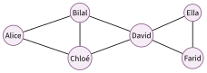

# Cours

Les réseaux sociaux

|  |  |
|:---|:---|
| **Programme** | Identité numérique, e-réputation, identification, authentification ; réseaux sociaux existants ; modèle économique ; représentation par un graphe (degré, distance, rayon, diamètre, centre) ; petit monde et six degrés de séparation ; algorithmes de recommandation. |
| **Idée** | Un réseau social, ce n’est pas seulement une application : c’est un immense **graphe** de relations entre des personnes, exploité par une **entreprise** qui a un modèle économique. Comprendre les deux, c’est reprendre la main. |
| **Objectifs** | Distinguer les grands réseaux et leurs ordres de grandeur ; protéger sa vie privée ; comprendre *comment ils gagnent de l’argent* ; représenter et mesurer un réseau par un graphe ; comprendre *qui choisit ce que vous voyez*. |

!!! remarque "Remarque"

    **Un peu d’histoire (et un ancêtre surprenant).** Avant Internet, en **1967**, le psychologue américain **Stanley Milgram** tente une expérience étonnante : faire parvenir une lettre à un inconnu à l’autre bout du pays, uniquement de connaissance en connaissance. Résultat : en moyenne **cinq ou six intermédiaires** suffisent. Le monde est bien plus « petit » qu’on ne le croit… nous y reviendrons.

    Il faudra attendre **1997** et le site *SixDegrees.com* (dont le nom rend justement hommage à Milgram !) pour voir le premier réseau social en ligne. Puis tout s’accélère : **2003** MySpace et LinkedIn, **2004** Facebook (créé par **Mark Zuckerberg**, étudiant de 19 ans à Harvard), **2005** YouTube, **2006** Twitter, **2010** Instagram, **2011** Snapchat, **2016** TikTok. En moins de vingt ans, une poignée d’entreprises se sont retrouvées à relier… une bonne partie de l’humanité.

    \*(image manquante : 02_hist_milgram)\*  
    Stanley Milgram (1974)

    \*(image manquante : 02_hist_zuckerberg)\*  
    Mark Zuckerberg (2019)

## Qu’est-ce qu’un réseau social ?

!!! definition "Définition 1"

    Un **réseau social** (en ligne) est un service qui permet à des personnes de se créer un **profil**, de se **relier** à d’autres (amis, abonnés, contacts) et de **partager** des contenus (textes, photos, vidéos). Le mot « réseau » n’est pas un hasard : l’ensemble des personnes et des liens forme bel et bien un réseau, que l’on peut dessiner.

Il en existe des dizaines, et ils ne se ressemblent pas : certains servent surtout à partager des **photos** (Instagram), d’autres des **vidéos courtes** (TikTok), des **messages** (X, anciennement Twitter), des **contacts professionnels** (LinkedIn) ou des **messages privés** (WhatsApp, Snapchat). Pour les comparer, on regarde : la nature du contenu, le public visé, et surtout un **ordre de grandeur** du nombre d’utilisateurs.

!!! etudedoc "Combien d’utilisateurs ? Des ordres de grandeur"

    On ne connaît jamais le chiffre exact (il change tous les jours), mais on peut retenir des **ordres de grandeur** du nombre d’utilisateurs actifs chaque mois (données 2024, arrondies ; DataReportal, 2024, et chiffres publiés par les entreprises) :

    | **Réseau** | **Contenu principal** | **Ordre de grandeur** |
    |:---|:---|:---|
    | Facebook | tout (texte, photo, vidéo) | $\sim 3$ milliards |
    | YouTube | vidéos | $\sim 2{,}5$ milliards |
    | Instagram | photos, vidéos courtes | $\sim 2$ milliards |
    | WhatsApp | messages privés | $\sim 2$ milliards |
    | TikTok | vidéos courtes | $\sim 1{,}5$ milliard |
    | LinkedIn | professionnel | $\sim 1$ milliard d’*inscrits*$^{*}$ |
    | X (Twitter) | messages courts | *centaines de millions* |
    | Snapchat | photos éphémères | *centaines de millions* |

    $^{*}$ LinkedIn annonce ses membres inscrits (2023), pas ses utilisateurs actifs, qui sont bien moins nombreux.  
    Rappel : la population mondiale est d’environ **8 milliards** d’humains (ONU, 2022).

    Sources : DataReportal (Kepios, We Are Social, Meltwater), *Digital 2024 Global Overview Report*, janvier 2024, et chiffres publiés par les entreprises (utilisateurs actifs mensuels ; membres de LinkedIn, 2023) ; ONU (Département des affaires économiques et sociales), *World Population Prospects 2022* (8 milliards d’humains en novembre 2022).

!!! activite "Activité — Dresser le portrait des réseaux"

    À l’aide du Document 1 et de vos propres connaissances :

    1.  Classer ces réseaux du plus utilisé au moins utilisé.

    2.  Citer deux réseaux dont le contenu principal est la vidéo.

    3.  Un réseau annonce « 3 milliards d’utilisateurs ». Expliquer pourquoi ce chiffre est difficile à vérifier, et pourquoi on parle plutôt d’un *ordre de grandeur*.

    4.  Choisir deux réseaux que vous connaissez et rédiger, pour chacun, une phrase qui le distingue des autres (public, type de contenu, façon de s’en servir).

▶ Exercices d'application : exercices **[1](exercices.md#ex-02-1) et [2](exercices.md#ex-02-2)** (reconnaître et comparer des réseaux)

## Identité numérique, vie privée et sécurité

Sur un réseau social, vous laissez une trace de vous-même : c’est votre **identité numérique**.

!!! definition "Définition 2"

    L’**identité numérique** est l’ensemble des informations qui vous représentent en ligne : profil, photos, publications, commentaires, « j’aime », mais aussi les traces laissées sans y penser (heure de connexion, position, recherches).  
    La **e-réputation** est l’image que ces informations donnent de vous aux autres.

Une confusion fréquente : « s’identifier » et « s’authentifier », ce n’est pas la même chose.

!!! regle "Règle 1"

    **S’identifier**, c’est *annoncer qui l’on est* (donner son identifiant, par exemple son adresse e-mail).  
    **S’authentifier**, c’est *prouver* que c’est bien vous (donner votre mot de passe, un code reçu par SMS, une empreinte).  
    Un identifiant peut être connu de tous ; le moyen d’authentification, lui, doit rester **secret**.

!!! exemple "Exemple(s)"

    Sur le portail du lycée, votre **identifiant** est votre nom d’élève (les professeurs le connaissent). Votre **mot de passe**, lui, ne doit être connu que de vous : c’est ce qui *authentifie* que la personne qui se connecte est bien vous.

!!! etudedoc "« Ce que je publie ne me regarde plus vraiment »"

    Trois idées à garder en tête :

    - **Rien ne s’efface vraiment.** Une photo supprimée a pu être copiée, enregistrée (capture d’écran), rediffusée. On parle de *permanence* des contenus.

    - **Public par défaut.** Sur beaucoup de réseaux, un compte est *visible de tous* tant qu’on n’a pas réglé la confidentialité.

    - **Le futur vous lira.** Un recruteur, une université… peuvent chercher votre nom. Votre e-réputation d’aujourd’hui vous suit demain.

!!! definition "Définition 3 — Données personnelles"

    Une **donnée personnelle** est une information qui permet d’identifier une personne, directement (nom, photo) ou indirectement (adresse e-mail, numéro de téléphone, localisation). Dans l’Union européenne, leur collecte et leur utilisation sont encadrées par le **RGPD** (*Règlement général sur la protection des données*, règlement UE 2016/679).

!!! regle "Règle 2 — Vos droits sur vos données"

    - **Âge** : en France, c’est à partir de **15 ans** que l’on peut consentir seul à l’utilisation de ses données par un service en ligne (loi Informatique et libertés) ; en dessous, l’accord des parents (titulaires de l’autorité parentale) est aussi nécessaire.

    - **Droits** : droit d’**accès** (savoir quelles données un service détient sur vous et en obtenir une copie), de **rectification** et d’**effacement**.

    - **Recours** : si vous résidez en France (ou dans l’UE), vos droits relèvent du RGPD et de la loi Informatique et libertés ; l’autorité de contrôle est la **CNIL**.

!!! encadre "Et à Monaco ?"

    Monaco n’est pas membre de l’Union européenne : le RGPD n’y est pas directement applicable (un site monégasque qui s’adresse à des personnes situées dans l’UE doit toutefois aussi le respecter). La protection des données y est assurée par la **loi n° 1.565 du 3 décembre 2024** relative à la protection des données personnelles, qui s’aligne sur les standards européens.

    - Ce sont les **mêmes grands droits** : accès (art. 12), rectification (art. 13), effacement (art. 14), opposition (art. 17), portabilité (art. 18).

    - **Mineurs** : pour un service en ligne, en dessous de **15 ans**, il faut l’autorisation du ou des titulaires de l’autorité parentale (art. 6).

    - **Autorité de contrôle** : l’**APDP** (Autorité de protection des données personnelles, `apdp.mc`), qui a succédé à la CCIN.

!!! activite "Activité — Régler sa confidentialité"

    1.  Sur un réseau que vous utilisez, retrouver le menu *Confidentialité* (ou *Paramètres*) et lister trois réglages qui protègent la vie privée (compte privé, qui peut commenter, partage de la position…).

    2.  Proposer un mot de passe « solide » et expliquer, en une phrase, ce qui le rend difficile à deviner.

    3.  Distinguer, dans la liste suivante, ce qui relève de l’*identification* et de l’*authentification* : saisir son adresse e-mail ; entrer un code reçu par SMS ; poser son doigt sur le capteur d’empreinte ; taper son pseudo.

    4.  Débat éclair (5 minutes) : « Publier une photo d’un camarade sans son accord, est-ce grave ? » Noter deux arguments.

▶ Exercices d'application : exercices **[3](exercices.md#ex-02-3) à [6](exercices.md#ex-02-6)** (identité numérique, e-réputation, mot de passe, droits sur ses données)

## Comment gagnent-ils de l’argent ?

La plupart des réseaux sociaux sont **gratuits**. Pourtant, ce sont des entreprises qui pèsent des milliards. La question mérite donc d’être posée sérieusement.

!!! regle "Règle 3"

    La principale ressource des grands réseaux sociaux est la **publicité ciblée**. Le réseau collecte des **données** sur vous (âge, centres d’intérêt, ce sur quoi vous cliquez), puis **loue** aux annonceurs la possibilité de vous montrer *la bonne publicité au bon moment*. Plus vous restez longtemps, plus il peut afficher de publicités : c’est l’**économie de l’attention**.

!!! exemple "Exemple(s)"

    Une formule résume bien l’idée : *« Si c’est gratuit, c’est que le produit, c’est vous. »* Plus exactement : le produit vendu aux annonceurs, c’est votre **attention** et vos **données**.

!!! etudedoc "Les revenus d’un géant"

    Un grand réseau social tire l’essentiel de ses revenus de la publicité. Sur 100 € gagnés, il n’est pas rare que **plus de 95 €** viennent des annonceurs, et à peine quelques euros d’autres sources (abonnements payants, badges, boutique en ligne). Chez Meta (Facebook, Instagram, WhatsApp), la publicité a fourni environ **98 %** du chiffre d’affaires en 2023 (Meta, rapport annuel 2023).

    On mesure aussi le « revenu moyen par utilisateur » (en anglais *ARPU*) : le total des revenus divisé par le nombre d’utilisateurs. Pour Facebook, fin 2023, il était d’environ 13 dollars par trimestre en moyenne mondiale, soit de l’ordre de **40 € par utilisateur et par an**, et plus de 60 dollars par trimestre aux États-Unis et au Canada (Meta, résultats du 4e trimestre 2023). Autrement dit : chaque compte « gratuit » rapporte, en réalité, de l’argent à l’entreprise.

    Source : Meta Platforms, rapport annuel 2023 (formulaire 10-K) et résultats du 4e trimestre 2023 (part de la publicité, revenu moyen par utilisateur).

!!! activite "Activité — Suivre l’argent"

    À l’aide du Document 3 :

    1.  Citer la principale source de revenus d’un grand réseau social.

    2.  Expliquer, avec vos mots, ce qu’on vend réellement à l’annonceur.

    3.  Un réseau compte 2 milliards d’utilisateurs et un revenu moyen de 40 € par utilisateur et par an. Estimer son revenu annuel (ordre de grandeur).

    4.  « Économie de l’attention » : expliquer pourquoi une application a intérêt à ce que vous y passiez le plus de temps possible.

▶ Exercices d'application : exercices **[7](exercices.md#ex-02-7) à [9](exercices.md#ex-02-9)** (le modèle économique)

## Un réseau social, c’est un graphe

Pour *mesurer* un réseau, les informaticiens le dessinent sous forme de **graphe**.

!!! definition "Définition 4"

    Un **graphe** est constitué de **sommets** (ici : les personnes) reliés par des **arêtes** (ici : « est ami avec », ou « suit »). Le **degré** d’un sommet est le nombre d’arêtes qui en partent : c’est, en gros, le nombre d’amis de la personne.

{ .tikz loading=lazy }

Sur ce petit réseau d’amitiés, on peut déjà lire beaucoup de choses. Par exemple, le degré de David est 4 (il est relié à Bilal, Chloé, Ella et Farid) : c’est la personne la plus « connectée ».

!!! definition "Définition 5"

    Une **chaîne** entre deux sommets est un chemin qui les relie en suivant les arêtes. Sa **longueur** est le nombre d’arêtes empruntées. La **distance** entre deux personnes est la longueur de la **plus courte** chaîne qui les relie (le « nombre de poignées de main »).

!!! exemple "Exemple(s)"

    La distance entre Alice et Ella est **3** : Alice – Bilal – David – Ella (aucun chemin plus court n’existe). Alice et David, eux, sont à distance **2**.

À partir de la distance, on définit trois mesures du programme : le rayon, le diamètre et le centre.

!!! definition "Définition 6"

    L’**excentricité** d’un sommet est la distance qui le sépare du sommet le *plus éloigné*.  
    Le **diamètre** du graphe est la **plus grande** excentricité (les deux personnes les plus éloignées du réseau).  
    Le **rayon** est la **plus petite** excentricité.  
    Le **centre** est le (ou les) sommet(s) dont l’excentricité est la plus petite : la personne la mieux placée pour joindre tout le monde rapidement.

!!! activite "Activité — Mesurer le réseau des amis"

    On travaille sur le graphe ci-dessus.

    1.  Donner le degré de chaque personne. Qui est « l’influenceur » (plus grand degré) ?

    2.  Déterminer la distance entre Alice et Farid, puis entre Bilal et Ella.

    3.  Compléter le tableau des excentricités :

        | Alice | Bilal | Chloé | David | Ella | Farid |
        |:-----:|:-----:|:-----:|:-----:|:----:|:-----:|
        |   ?   |   ?   |   ?   |   ?   |  ?   |   ?   |

    4.  En déduire le **diamètre**, le **rayon** et le **centre** du réseau.

    5.  Ella et Farid décident de devenir amis avec Alice. Redessiner (ou décrire) le graphe et dire si le diamètre change.

▶ Exercices d'application : exercices **[10](exercices.md#ex-02-10) à [13](exercices.md#ex-02-13)** (le graphe : degrés, distances, diamètre)

## Le petit monde et les six degrés de séparation

Revenons à l’histoire du début du cours. L’idée qu’on puisse relier deux inconnus par une courte chaîne d’amis a un nom : le **petit monde**.

!!! etudedoc "L’expérience de Milgram (1967)"

    Stanley Milgram confie des lettres à des habitants du Nebraska. Consigne : faire parvenir la lettre à une personne cible (un agent de change à Boston) **sans envoi direct**, seulement en la transmettant à *une connaissance* que l’on juge plus proche de la cible. À chaque étape, la lettre se rapproche.

    Parmi les lettres arrivées à destination, le nombre d’intermédiaires est en moyenne de **5 à 6** (Travers et Milgram, *Sociometry*, 1969). De là est née l’expression « **six degrés de séparation** » : deux personnes au hasard sur Terre seraient reliées par une chaîne d’environ six connaissances.

    *Et aujourd’hui ?* En 2016, une étude menée sur le réseau Facebook (près de 1,6 milliard de comptes à l’époque) a mesuré une distance moyenne d’environ **3,5** (Facebook Research, 2016). Le monde est devenu encore plus petit.

    Sources : J. Travers et S. Milgram, « An Experimental Study of the Small World Problem », *Sociometry*, 1969 ; Facebook Research, « Three and a half degrees of separation », février 2016.

!!! propriete "Propriété 1"

    Dans un très grand réseau, la distance moyenne entre deux personnes reste **petite** (quelques unités), même quand le nombre de personnes se compte en milliards. C’est le phénomène du **petit monde**.

!!! activite "Activité — Combien de degrés nous séparent ?"

    1.  Reformuler « six degrés de séparation » avec vos propres mots.

    2.  Dans le graphe des amis (section IV), quelle est la plus grande distance entre deux personnes ? Comparer avec « six ».

    3.  À votre avis, pourquoi la distance moyenne *diminue*-t-elle quand chacun a beaucoup d’amis en ligne ? (Une phrase.)

▶ Exercices d'application : exercice **[14](exercices.md#ex-02-14)** (six degrés de séparation)

## Qui choisit ce que vous voyez ?

Vous ne voyez jamais *tout* ce qui est publié : un programme trie pour vous.

!!! definition "Définition 7"

    Un **algorithme de recommandation** est un programme qui **choisit et ordonne** les contenus affichés dans votre fil, en fonction de ce que vous (et des gens qui vous ressemblent) avez déjà regardé, aimé, ou partagé. Son but : vous retenir le plus longtemps possible.

Ce tri a des conséquences qu’il faut connaître :

- **Bulle de filtres** : à force de vous montrer ce qui vous plaît, l’algorithme finit par ne plus vous montrer que *cela*. Vous voyez une version rétrécie du monde.

- **Chambre d’écho** : entouré d’avis semblables au vôtre, vous avez l’impression que « tout le monde pense comme vous ».

- **Désinformation** : une *fausse* information spectaculaire est souvent partagée plus vite qu’une information vraie mais ennuyeuse.

!!! etudedoc "Pourquoi cette vidéo, et pas une autre ?"

    Pour ordonner votre fil, un algorithme observe des dizaines de signaux : le temps passé sur chaque vidéo, les « j’aime », les partages, les comptes que vous suivez, l’heure, votre pays, l’appareil utilisé… Il en déduit ce qui a le plus de chances de vous faire *rester*. Personne n’a « choisi à la main » votre fil : c’est un calcul, refait à chaque seconde, pour des milliards de personnes en même temps.

!!! activite "Activité — Enquêter sur son fil"

    1.  Décrire, en deux ou trois phrases, comment un réseau décide de l’ordre des contenus de votre fil.

    2.  Donner un exemple concret de « bulle de filtres » que vous avez déjà remarqué (ou imaginé).

    3.  Proposer deux gestes simples pour *sortir* de sa bulle (suivre des comptes différents, vérifier une information avant de la partager…).

▶ Exercices d'application : exercices **[15](exercices.md#ex-02-15) et [16](exercices.md#ex-02-16)** (qui choisit ce que je vois ? les amis de mes amis)

## Bien vivre avec les réseaux sociaux

Les réseaux sont des outils formidables (s’informer, créer, garder le lien, se mobiliser). Mais, comme tout outil puissant, ils demandent quelques précautions de citoyen.

!!! regle "Règle 4"

    **Le cyberharcèlement** (insultes, menaces, moqueries répétées en ligne) est **interdit par la loi** et lourdement puni. Face à une situation de harcèlement : ne pas répondre, **garder les preuves** (captures d’écran), **bloquer**, **signaler**, et **en parler** à un adulte de confiance (numéro national : **3018**).

!!! activite "Activité — Ma charte des réseaux"

    En binôme, rédiger une **charte de cinq règles** « pour bien vivre sur les réseaux » (une pour la vie privée, une pour l’esprit critique, une contre le harcèlement, deux au choix). Ces règles serviront de base à l’exposé final.

▶ Exercices d'application : exercice **[17](exercices.md#ex-02-17)** (citoyen des réseaux)

## L’envers de l’écran : l’impact environnemental

Un fil infini, des vidéos qui s’enchaînent toutes seules… Tout cela circule dans des **réseaux**, est stocké dans des **centres de données** et s’affiche sur des **appareils** qu’il a fallu fabriquer. Le numérique n’est pas « immatériel » : il a une empreinte environnementale.

!!! etudedoc "Stocker et diffuser des vidéos"

    **Unité.** On mesure les émissions de gaz à effet de serre en **CO2e** (*équivalent CO2*) ; **1 Mt** = 1 million de tonnes. Les chiffres ci-dessous sont des **estimations** : on retient des ordres de grandeur.

    - **La vidéo domine le trafic.** Elle représente la majorité des données qui circulent sur Internet : environ les **deux tiers** du trafic mondial en 2022, selon une estimation de l’équipementier de réseaux Sandvine. En 2024, avec une autre méthode de classement (une partie des vidéos est désormais comptée avec les réseaux sociaux), le seul *streaming* vidéo à la demande (Netflix, Disney+…) représentait encore plus de la **moitié** du trafic reçu par les abonnés.  
      *Sources : Sandvine, *Global Internet Phenomena Report*, janvier 2023 (données 2022) et mars 2024.*

    - **Stocker.** Une vidéo publiée n’est pas rangée une seule fois : la plateforme la conserve sur ses serveurs en **plusieurs définitions** (pour s’adapter à chaque écran et à chaque connexion), souvent recopiée dans plusieurs **centres de données** proches des utilisateurs, et cela tant qu’elle n’est pas supprimée.

    - **Diffuser.** Chaque visionnage renvoie la vidéo à travers les réseaux : une vidéo vue un million de fois est transportée un million de fois. Une heure de vidéo échange jusqu’à **1 Go** de données en définition standard, jusqu’à **3 Go** en haute définition et jusqu’à **7 Go** en 4K.  
      *Source : Netflix, centre d’aide, page sur la consommation de données, consultée en 2026.*

    - **Combien de CO2 ? Une estimation discutée.** En 2019, The Shift Project estimait que la vidéo en ligne émettait plus de 300 Mt CO2e par an (près de 1 % des émissions mondiales). L’Agence internationale de l’énergie (AIE) a jugé ce type de calcul très surestimé : selon elle, une heure de vidéo en streaming émettait en moyenne environ **36 g de CO2** en 2019. Les résultats changent beaucoup selon les hypothèses (appareil, réseau, électricité du pays) ; ce qui est sûr, c’est que plus on regarde, et en haute définition, plus on échange de données.  
      *Sources : The Shift Project, « Climat : l’insoutenable usage de la vidéo en ligne », juillet 2019 ; AIE, « The carbon footprint of streaming video: fact-checking the headlines », décembre 2020.*

    - **Et le numérique en général ?** Selon les études et ce qu’elles comptent, il pèse environ **2 à 4 %** des émissions mondiales (1,7 % pour le seul secteur des technologies de l’information selon l’UIT et la Banque mondiale, données 2022 ; près de 4 % selon The Shift Project, 2019). Pour la France et le calcul complet de l’empreinte d’un smartphone (environ 80 kg CO2e, presque tout à la fabrication), voir le thème *Informatique embarquée et objets connectés*.  
      *Source : UIT et Banque mondiale, *Measuring the Emissions and Energy Footprint of the ICT Sector*, 2024.*

!!! activite "Activité — Sobriété numérique"

    À l’aide du Document 6 :

    1.  Expliquer pourquoi une vidéo très regardée « pèse » bien plus que la taille de son fichier (penser au **stockage** et à la **diffusion**).

    2.  En vous appuyant sur le thème *Objets connectés*, expliquer pourquoi **garder son téléphone plus longtemps** (le faire réparer, choisir un appareil reconditionné) est l’un des gestes les plus efficaces.

    3.  La **lecture automatique** et la **qualité vidéo maximale** sont souvent activées par défaut. Expliquer pourquoi elles augmentent la quantité de données échangées, puis proposer deux réglages pour la réduire.

    4.  Faire le lien avec l’**économie de l’attention** (section III) : pourquoi un réseau social n’a-t-il pas intérêt à proposer lui-même de désactiver le **fil infini** ou la lecture automatique ?

▶ Exercices d'application : exercices **[18](exercices.md#ex-02-18) et [19](exercices.md#ex-02-19)** (le coût d’un smartphone, haute ou basse définition)

!!! remarque "Remarque — Liens avec d’autres chapitres"

    Un réseau social est d’abord un **graphe** : la même structure sert au calcul d’itinéraire (chapitre *Localisation*) et décrit les hyperliens du **Web**. Ce que vous publiez devient une **donnée personnelle**, rangée dans d’immenses **tables** chez l’entreprise (chapitre *Données en tables*) ; une photo peut même trahir, par ses **métadonnées EXIF**, le lieu où elle a été prise (chapitre *Photographie numérique*). Comme le Web, un réseau social est un **service** qui circule sur **Internet** : votre fil arrive en paquets depuis des serveurs. En spécialité NSI de Terminale, on apprend à parcourir des graphes et à y calculer des distances par programme.

## Bilan — la carte mémoire

| **Notion** | **À retenir** |
|:---|:---|
| Réseau social | profils + liens + partage ; comparés par contenu, public, *ordre de grandeur* d’abonnés. |
| Ordres de grandeur | les plus gros : *milliards* d’utilisateurs (population mondiale : $\sim 8$ milliards). |
| Identité numérique | tout ce qui vous représente en ligne ; forge votre *e-réputation* (durable). |
| Identifier / authentifier | annoncer qui l’on est / *prouver* que c’est bien soi (secret). |
| Modèle économique | *publicité ciblée* + données ; « si c’est gratuit, le produit c’est vous ». |
| Graphe | sommets (personnes) + arêtes (liens) ; *degré* = nombre d’amis. |
| Distance | longueur de la plus courte chaîne (nombre de « poignées de main »). |
| Diamètre / rayon / centre | plus grande / plus petite excentricité / sommet(s) le(s) mieux placé(s). |
| Petit monde | Milgram (1967) $\to$ « six degrés » ; sur Facebook ($\sim$<!-- -->2016) : $\approx 3{,}5$. |
| Recommandation | un algorithme trie votre fil ; risques : bulle de filtres, désinformation. |
| Données personnelles | RGPD ; seul dès **15 ans** ; accès, rectification, effacement ; CNIL (France), APDP et loi n° 1.565 (Monaco). |
| Citoyenneté | cyberharcèlement interdit ; garder les preuves, bloquer, signaler, **3018**. |
| Impact environnemental | numérique $\approx 2$ à $4\,\%$ des GES mondiaux (estimations) ; vidéo $=$ majorité du trafic : stockage + diffusion ; garder ses appareils. |

!!! encadre "Débat argumenté"

    Une **fiche débat** accompagne ce thème : « Faut-il interdire les réseaux sociaux aux moins de 15 ans, avec une vérification d’âge obligatoire ? » (documents, rôles, tableau d’arguments et trace écrite, environ 50 min).

## Savoir-faire à maîtriser

*À la fin du chapitre, je sais…*

!!! autopos "Savoir-faire : je me positionne"

    - définir un **réseau social** et citer ses principaux usages ;

    - protéger mon **identité numérique** et régler mes paramètres de confidentialité ;

    - citer mes **droits** sur mes données personnelles (RGPD en France, loi n° 1.565 à Monaco) ;

    - expliquer le **modèle économique** (données personnelles, publicité ciblée) ;

    - modéliser un réseau social par un **graphe** (sommets = comptes, arêtes = relations) et lire le **degré** d’un sommet ;

    - expliquer l’idée des « **six degrés de séparation** » (petit monde) ;

    - expliquer qu’un **algorithme** choisit et ordonne ce qui est affiché (fil, recommandations) ;

    - citer des ordres de grandeur de l’**impact environnemental** du numérique et des gestes de sobriété ;

    - adopter de bonnes pratiques (temps d’écran, esprit critique, lutte contre le harcèlement).
