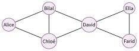
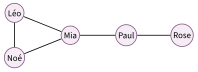

# Exercices

Les réseaux sociaux

!!! consignes "Mode d’emploi"

    - Niveau : ★ échauffement, ★★ classique (niveau bac), ★★★ défi ; les *coups de pouce* et les *corrigés* se déplient sous chaque exercice.

    - sur papier *signale les exercices à faire sur papier* ; $\blacktriangleright$  *ceux qui demandent une petite recherche ou une manipulation.*

    - Vocabulaire du graphe : **sommet**, **arête**, **degré**, **distance**, **excentricité**, **diamètre**, **rayon**, **centre**.

    - Usage de l’IA, indiqué sur chaque exercice :  aucune ;  en appui (déboguer, reformuler, vérifier ; la réponse finale est écrite et comprise par vous) ;  l’exercice s’appuie sur une réponse d’IA. Voir la charte d’usage de l’IA.

### Reconnaître et comparer les réseaux

### ★ Exercice 1 — Le bon réseau  { #ex-02-1 }

sur papier  Associer chaque réseau à son contenu principal : *Instagram, TikTok, LinkedIn, WhatsApp, YouTube* $\;\leftrightarrow\;$ *vidéos, photos, vidéos courtes, messages privés, contacts professionnels*.

??? corrige "Corrigé"

    Instagram $\leftrightarrow$ **photos** ; TikTok $\leftrightarrow$ **vidéos courtes** ; LinkedIn $\leftrightarrow$ **contacts professionnels** ; WhatsApp $\leftrightarrow$ **messages privés** ; YouTube $\leftrightarrow$ **vidéos**. *(Beaucoup de réseaux mélangent aujourd’hui plusieurs formats ; on retient ici leur usage *principal* d’origine.)*

### ★ Exercice 2 — Ordres de grandeur  { #ex-02-2 }

sur papier  On rappelle que la population mondiale est d’environ $8$ milliards d’humains.

1.  Un réseau annonce « $3$ milliards d’utilisateurs actifs ». Quelle proportion de l’humanité cela représente-t-il, environ ?

2.  Pourquoi parle-t-on d’un **ordre de grandeur** plutôt que d’un chiffre exact ?

??? corrige "Corrigé"

    **1.** $3$ milliards sur $8$ milliards, soit $\dfrac{3}{8} \approx 0{,}375$ : environ **37 %** de l’humanité (un peu plus d’un tiers).  
    **2.** Le nombre exact d’utilisateurs *change en permanence* (inscriptions, comptes inactifs ou multiples) et n’est pas vérifiable. Un **ordre de grandeur** (« quelques milliards ») suffit pour comparer et raisonner, sans prétendre à une précision illusoire.

### Identité numérique, sécurité

### ★ Exercice 3 — Identifier ou authentifier ?  { #ex-02-3 }

sur papier  Pour chaque action, dire s’il s’agit d’**identification** (annoncer qui l’on est) ou d’**authentification** (prouver que c’est bien soi) :

1.  saisir son adresse e-mail ;

2.  entrer un code reçu par SMS ;

3.  taper son pseudo ;

4.  poser son doigt sur le capteur d’empreinte.

??? corrige "Corrigé"

    **a.** adresse e-mail $=$ **identification** (on annonce qui l’on est) ; **b.** code reçu par SMS $=$ **authentification** (on prouve qu’on possède le téléphone) ; **c.** pseudo $=$ **identification** ; **d.** empreinte digitale $=$ **authentification**. *En résumé : l’identification *annonce*, l’authentification *prouve*.*

### ★ Exercice 4 — E-réputation  { #ex-02-4 }

sur papier  « Rien ne s’efface vraiment sur Internet. » Expliquer cette phrase, puis donner un exemple de situation où votre e-réputation d’aujourd’hui pourrait vous suivre plus tard.

??? corrige "Corrigé"

    « Rien ne s’efface vraiment » : une photo, un message ou un commentaire mis en ligne peut être **copié, capturé (*screenshot*), partagé et archivé** par d’autres ; même supprimé de la source, il peut subsister ailleurs. *Exemple :* une publication gênante postée à 15 ans peut être retrouvée des années plus tard par un recruteur, une école ou un employeur, et nuire à une candidature.

### ★★ Exercice 5 — Un bon mot de passe  { #ex-02-5 }

$\blacktriangleright$  Proposer deux mots de passe : un **faible** et un **solide**. Expliquer, pour chacun, ce qui le rend facile ou difficile à deviner (longueur, variété des caractères, mot du dictionnaire, information personnelle…).

??? pouce "Coup de pouce"

    Pensez à ce qu’un pirate essaierait en premier : des mots courants, des prénoms, des dates. Qu’est-ce qui rend un mot de passe long à deviner, même pour un ordinateur ?

??? corrige "Corrigé"

    *Exemple.* Faible : `sofiane2010` — court, contient un **prénom** et une **date de naissance** (informations personnelles faciles à deviner), aucun caractère spécial. Solide : `Vg7!kPluie_92xQ` — **long**, mélange **majuscules, minuscules, chiffres et symboles**, ne forme **aucun mot** du dictionnaire ni information personnelle. *Les deux leviers essentiels : la **longueur** et l’**imprévisibilité**.*

### ★★ Exercice 6 — Mes données, mes droits  { #ex-02-6 }

sur papier  Inès, 16 ans, habite à Monaco. Elle a un compte sur une application de partage de photos.

1.  Citer trois **données personnelles** que cette application détient sans doute sur elle.

2.  Inès veut savoir quelles données l’application conserve sur elle, puis faire supprimer une ancienne photo. Quel droit exerce-t-elle dans chaque cas ?

3.  L’application ne lui répond pas. À quelle autorité peut-elle s’adresser ? Et si elle habitait à Nice ?

4.  Sa petite sœur, qui a $13$ ans, peut-elle ouvrir seule un compte sur cette application ?

??? pouce "Coup de pouce"

    Relisez dans le cours l’encadré « Vos droits sur vos données » et l’encadré « Et à Monaco ? » : on y trouve les droits, l’âge à partir duquel on décide seul, et l’autorité de chaque pays.

??? corrige "Corrigé"

    **1.** Par exemple : son **nom** ou son pseudo, son **adresse e-mail**, ses **photos**, sa **date de naissance**, sa **localisation**, la liste de ses abonnés.  
    **2.** Savoir quelles données sont conservées : **droit d’accès**. Faire supprimer une photo : **droit d’effacement**.  
    **3.** Résidant à Monaco, elle s’adresse à l’**APDP** (Autorité de protection des données personnelles, loi n° 1.565). Si elle habitait à Nice (France), ce serait la **CNIL** (RGPD et loi Informatique et libertés).  
    **4.** **Non** : en dessous de $15$ ans, il faut aussi l’accord des parents (titulaires de l’autorité parentale), à Monaco comme en France.

### Le modèle économique

### ★ Exercice 7 — « Si c’est gratuit…»  { #ex-02-7 }

sur papier  La plupart des réseaux sont gratuits mais très riches.

1.  Quelle est leur principale source de revenus ?

2.  Compléter : « Si c’est gratuit, c’est que le ……, c’est ……». Qu’est-ce qu’on vend réellement à l’annonceur ?

??? corrige "Corrigé"

    **1.** La principale source de revenus est la **publicité ciblée** (et la revente de l’espace publicitaire aux annonceurs).  
    **2.** « Si c’est gratuit, c’est que le **produit**, c’est **vous** ». Ce qu’on vend à l’annonceur, ce sont votre **attention** et vos **données personnelles** (centres d’intérêt, comportements), qui permettent de vous montrer des publicités très ciblées.

### ★★ Exercice 8 — Suivre l’argent  { #ex-02-8 }

sur papier  Un réseau compte $2$ milliards d’utilisateurs et rapporte en moyenne $40$ € par utilisateur et par an.

1.  Estimer son **revenu annuel** (ordre de grandeur).

2.  « Économie de l’attention » : expliquer pourquoi l’application a intérêt à vous garder le plus longtemps possible.

??? pouce "Coup de pouce"

    Revenu total $=$ nombre d’utilisateurs $\times$ revenu moyen par utilisateur ; gardez le mot « milliards » dans le calcul.

??? corrige "Corrigé"

    **1.** Revenu $\approx 2\,\text{milliards} \times 40~\text{€} = \mathbf{80}$ **milliards d’euros par an** (ordre de grandeur).  
    **2.** L’application vit de la publicité : plus vous restez, plus elle affiche de publicités et collecte de données. Elle a donc intérêt à **capter votre attention** le plus longtemps possible (notifications, défilement infini, vidéos qui s’enchaînent) : c’est l’**économie de l’attention**.

### ★★ Exercice 9 — Ce que la publicité sait de vous  { #ex-02-9 }

sur papier  En une semaine, Hugo a aimé une douzaine de vidéos de football, cherché « crampons pas chers », publié une photo localisée au stade Louis-II et regardé jusqu’au bout trois vidéos de recettes de pâtes.

1.  Quelles informations le réseau peut-il en **déduire** sur Hugo ?

2.  Proposer deux publicités qu’il risque de voir dans son fil la semaine suivante.

3.  Expliquer pourquoi ces informations ont de la valeur pour le réseau.

??? pouce "Coup de pouce"

    Pour chaque action d’Hugo, demandez-vous ce qu’elle révèle : un goût, un besoin d’achat, un lieu de vie ?

??? corrige "Corrigé"

    **1.** Hugo **aime le football** (et le pratique sans doute : il cherche des crampons), il a un **petit budget** (« pas chers »), il fréquente le **stade Louis-II**, donc vit probablement **à Monaco ou à proximité**, et il s’intéresse à la **cuisine**.  
    **2.** Par exemple : des crampons en promotion dans un magasin de sport proche de Monaco ; des billets pour un match de l’AS Monaco ; une marque de pâtes ou un robot de cuisine.  
    **3.** Ces informations permettent de montrer à Hugo des publicités **ciblées**, qui ont plus de chances de le faire cliquer et acheter. Les annonceurs paient donc plus cher pour les afficher : ce qui est vendu, c’est l’**attention** et les **données** d’Hugo.

### Un réseau social, c’est un graphe

On étudie le réseau d’amitiés suivant (une arête $=$ « est ami avec ») :

{ .tikz loading=lazy }

### ★★ Exercice 10 — Degrés et distances  { #ex-02-10 }

sur papier 

1.  Donner le **degré** de chaque personne. Qui est le plus « connecté » ?

2.  Déterminer la **distance** entre Alice et Ella, puis entre Chloé et Farid (donner un plus court chemin).

??? pouce "Coup de pouce"

    Le degré d’un sommet est le nombre d’arêtes qui en partent. Pour une distance, cherchez le chemin qui emprunte le moins d’arêtes possible.

??? corrige "Corrigé"

    **1.** Degrés : Alice $2$, Bilal $3$, Chloé $3$, **David $4$**, Ella $2$, Farid $2$. La personne la plus « connectée » est **David** (degré $4$).  
    **2.** Distance **Alice–Ella** $= \mathbf{3}$ : un plus court chemin est **Alice–Bilal–David–Ella** (ou Alice–Chloé–David–Ella). Distance **Chloé–Farid** $= \mathbf{2}$ : chemin **Chloé–David–Farid**.

### ★★★ Exercice 11 — Diamètre, rayon, centre  { #ex-02-11 }

sur papier 

1.  Rappeler ce qu’est l’**excentricité** d’un sommet, puis calculer celle de chaque personne.

2.  En déduire le **diamètre**, le **rayon** et le **centre** du réseau.

3.  Alice devient aussi amie avec David. Le diamètre change-t-il ? Justifier.

??? pouce "Coup de pouce"

    L’excentricité d’une personne : calculez sa distance à chacune des cinq autres et gardez la plus grande.

??? pouce "Coup de pouce 2 (début de solution)"

    Excentricité d’Alice : distances à Bilal $1$, à Chloé $1$, à David $2$, à Ella $3$, à Farid $3$ ; la plus grande vaut $3$. Faites de même pour les cinq autres personnes, puis comparez les six excentricités.

??? corrige "Corrigé"

    **1.** L’**excentricité** d’un sommet est la **plus grande distance** qui le sépare d’un autre sommet du réseau (« à quelle distance est la personne la plus éloignée de moi ? »). Ici :

    |              | Alice | Bilal | Chloé | David | Ella | Farid |
    |:------------:|:-----:|:-----:|:-----:|:-----:|:----:|:-----:|
    | excentricité |  $3$  |  $2$  |  $2$  |  $2$  | $3$  |  $3$  |

    **2.** Le **diamètre** (plus grande excentricité) vaut $\mathbf{3}$ ; le **rayon** (plus petite excentricité) vaut $\mathbf{2}$ ; le **centre** (les sommets d’excentricité minimale) est $\{\textbf{Bilal, Chloé, David}\}$.  
    **3.** Si Alice devient aussi amie avec David (nouvelle arête Alice–David), Alice atteint tout le monde en au plus $2$ pas ; Ella et Farid aussi (via David–Alice). Toutes les excentricités valent alors $2$ : le **diamètre passe de $3$ à $\mathbf{2}$**. *Oui, il change* — un seul lien bien placé « rapproche » tout le réseau.

### ★★ Exercice 12 — Dessiner un réseau  { #ex-02-12 }

sur papier  Dans un club, Léo est ami avec Mia et avec Noé ; Mia est aussi amie avec Noé et avec Paul ; Paul est ami avec Rose. Personne d’autre n’est ami.

1.  Dessiner le graphe de ce réseau.

2.  Donner le degré de chaque personne.

3.  Déterminer la distance entre Léo et Rose, puis entre Noé et Paul.

??? pouce "Coup de pouce"

    Placez d’abord les cinq sommets, puis tracez une arête pour chaque relation « est ami avec » de l’énoncé (attention, il y en a cinq).

??? corrige "Corrigé"

    **1.** Cinq sommets et cinq arêtes : Léo–Mia, Léo–Noé, Mia–Noé, Mia–Paul, Paul–Rose.

    { .tikz loading=lazy }

    **2.** Degrés : Léo $2$, **Mia $3$**, Noé $2$, Paul $2$, Rose $1$.  
    **3.** Distance **Léo–Rose** $= \mathbf{3}$ (Léo–Mia–Paul–Rose) ; distance **Noé–Paul** $= \mathbf{2}$ (Noé–Mia–Paul).

### ★★★ Exercice 13 — Fabriquer un diamètre  { #ex-02-13 }

sur papier  On dispose de cinq personnes. Dans chaque réseau demandé, on doit pouvoir aller de n’importe qui à n’importe qui en suivant les arêtes.

1.  Dessiner un réseau de ces cinq personnes dont le **diamètre** vaut $4$. Combien d’arêtes compte-t-il ?

2.  Dessiner un réseau de ces cinq personnes dont le diamètre vaut $1$. Combien d’arêtes compte-t-il ?

3.  Quel est le **centre** du réseau de la question 1 ?

??? pouce "Coup de pouce"

    Diamètre $4$ : deux personnes doivent être séparées par $4$ arêtes, avec seulement cinq personnes en tout. Diamètre $1$ : que signifie « être à distance $1$ de tout le monde » ?

??? pouce "Coup de pouce 2 (début de solution)"

    Question 1 : placez les cinq personnes « en file indienne », chacune amie seulement avec ses voisines. Question 2 : chacun est ami avec les quatre autres ; attention à ne pas compter deux fois la même arête.

??? corrige "Corrigé"

    **1.** On place les cinq personnes en « file indienne » : A–B–C–D–E. Les deux extrémités A et E sont à distance $4$, et aucune distance n’est plus grande : le diamètre vaut $\mathbf{4}$. Ce réseau compte $\mathbf{4}$ arêtes. (C’est d’ailleurs le seul dessin possible : avec cinq personnes, une distance de $4$ oblige à les aligner toutes.)

    { .tikz loading=lazy }

    **2.** Diamètre $1$ : toutes les distances valent $1$, donc **chacun est ami avec tous les autres**. Chaque personne a $4$ amis, ce qui fait $5 \times 4 = 20$ « bouts » d’arêtes ; chaque arête ayant deux bouts, il y a $20 / 2 = \mathbf{10}$ arêtes.  
    **3.** Excentricités dans la file : A $4$, B $3$, **C $2$**, D $3$, E $4$. Le rayon vaut $2$ et le **centre** est la personne du milieu, **C**.

### Petit monde et recommandation

### ★★ Exercice 14 — Six degrés de séparation  { #ex-02-14 }

sur papier 

1.  Expliquer, avec vos propres mots, l’expression « six degrés de séparation » (expérience de Milgram, 1967).

2.  Sur Facebook (vers 2016), la distance moyenne mesurée était d’environ $3{,}5$. Que peut-on en conclure sur l’évolution du « petit monde » ?

??? pouce "Coup de pouce"

    Comparez $3{,}5$ avec les « cinq ou six intermédiaires » de l’expérience de Milgram. Les chaînes de connaissances se sont-elles allongées ou raccourcies, et pourquoi ?

??? corrige "Corrigé"

    **1.** L’idée : deux personnes prises au hasard sur Terre seraient reliées par une **chaîne d’environ six connaissances** (« l’ami d’un ami d’un ami…»). C’est le phénomène du **petit monde**, suggéré par l’expérience de **Milgram** (1967).  
    **2.** Une distance moyenne d’environ $3{,}5$ sur Facebook montre que le monde numérique est devenu un « **petit monde** » *encore plus resserré* : les réseaux sociaux raccourcissent les chaînes de connaissances (bien en dessous de six).

### ★ Exercice 15 — Qui choisit ce que je vois ?  { #ex-02-15 }

sur papier 

1.  Qu’est-ce qu’un **algorithme de recommandation** ? Quel est son but ?

2.  Expliquer ce qu’est une **bulle de filtres**, et proposer un geste simple pour en sortir.

??? corrige "Corrigé"

    **1.** Un **algorithme de recommandation** choisit et ordonne les contenus qui vous sont montrés (fil d’actualité, vidéos suggérées) à partir de vos actions passées. Son but : **maximiser votre engagement** (temps passé, clics, likes).  
    **2.** Une **bulle de filtres** : à force de vous montrer ce qui vous plaît déjà, l’algorithme vous enferme dans des contenus **similaires** et vous cache les autres points de vue. Geste simple pour en sortir : **s’abonner volontairement à des sources variées** (voire opposées), varier ses recherches, ou désactiver la personnalisation.

### ★★★ Exercice 16 — Les amis de mes amis  { #ex-02-16 }

sur papier  Un réseau propose à chacun des « amis suggérés » : les personnes situées à **distance $2$**, en commençant par celles avec qui l’on a le plus d’**amis en commun**. On reprend le graphe d’amitiés de la section 4.

1.  Quelles personnes sont à distance $2$ d’Alice ? Combien d’amis en commun a-t-elle avec chacune ? Qui lui sera suggéré en premier ?

2.  Même question pour Ella.

3.  Expliquer pourquoi ce type de suggestion a tendance à refermer chaque groupe sur lui-même (faire le lien avec la bulle de filtres).

??? pouce "Coup de pouce"

    Être à distance $2$, c’est ne pas être ami direct, mais être ami d’un de ses amis. Pour les amis en commun, écrivez la liste des amis de chacun et cherchez les noms présents dans les deux listes.

??? pouce "Coup de pouce 2 (début de solution)"

    Amis d’Alice : Bilal et Chloé. Amis de Bilal : Alice, Chloé, David ; amis de Chloé : Alice, Bilal, David. Dans ces listes, qui n’est ni Alice, ni déjà son ami ?

??? corrige "Corrigé"

    **1.** Alice a pour amis Bilal et Chloé. Leurs autres amis : David seulement. La seule personne à distance $2$ d’Alice est donc **David**, avec qui elle a **deux** amis en commun (Bilal et Chloé) : David lui est suggéré en premier.  
    **2.** Ella a pour amis David et Farid. Les amis de David qui ne sont pas déjà amis d’Ella sont Bilal et Chloé (Farid, lui, n’a pas d’autre ami). À distance $2$ d’Ella : **Bilal** et **Chloé**, avec chacun **un seul** ami en commun (David) : ils sont à égalité. Alice est à distance $3$ d’Ella : elle n’est pas suggérée.  
    **3.** On vous propose surtout des personnes **déjà proches de vos amis**, qui fréquentent les mêmes groupes et partagent souvent les mêmes goûts et avis. Chaque groupe se resserre, on rencontre rarement des personnes vraiment différentes : comme la bulle de filtres, ce mécanisme rétrécit la variété de ce que l’on voit (ici, des *personnes*).

### ★ Exercice 17 — Citoyen des réseaux  { #ex-02-17 }

sur papier  Face à une situation de cyberharcèlement, citer trois bons réflexes et donner le numéro national d’aide.

??? corrige "Corrigé"

    Face au cyberharcèlement : **(1)** ne pas répondre ni « rendre les coups », **conserver les preuves** (captures d’écran) ; **(2)** **signaler** et bloquer l’auteur sur la plateforme ; **(3)** **en parler** à un adulte de confiance (parent, professeur, CPE). Numéro national d’aide : **3018** (violences numériques), gratuit et anonyme.

### Impact environnemental

### ★★ Exercice 18 — Le coût d’un smartphone  { #ex-02-18 }

sur papier  Sami filme beaucoup de vidéos en 4K pour les publier sur un réseau social. Son téléphone est presque plein : il ne lui reste que $20$ Go libres. On suppose qu’une minute de vidéo en 4K occupe environ $400$ Mo ($1$ Go $= 1\,000$ Mo).

1.  Combien de minutes de vidéo en 4K Sami peut-il encore filmer ?

2.  Sami pense acheter un téléphone neuf avec plus de mémoire. D’après le thème *Objets connectés*, un smartphone émet environ $80$ kg CO2e sur sa vie, presque tout à sa **fabrication**. Proposer deux solutions plutôt que d’acheter un téléphone neuf.

3.  Sami publie une vidéo de $50$ Mo, qui est vue $1$ million de fois. Quelle quantité de données le réseau social doit-il transporter pour ces visionnages ? Donner le résultat en téraoctets ($1$ To $= 10^{6}$ Mo).

4.  Même après avoir libéré son téléphone, Sami garde ses vidéos « dans le nuage ». Où sont-elles stockées en réalité, et pourquoi ce stockage a-t-il aussi un coût environnemental ?

??? pouce "Coup de pouce"

    Question 1 : convertissez d’abord les $20$ Go en mégaoctets. Question 3 : chaque visionnage renvoie toute la vidéo ; multipliez la taille du fichier par le nombre de vues.

??? corrige "Corrigé"

    **1.** $20$ Go $= 20\,000$ Mo, et $20\,000 \div 400 = \mathbf{50}$ **minutes** de vidéo en 4K.  
    **2.** Par exemple : **trier et supprimer** les vidéos ratées ou en double ; filmer en **définition plus basse** (1080p au lieu de 4K, bien suffisant sur un petit écran) ; transférer ses vidéos sur un ordinateur ou un disque dur ; si la mémoire manque vraiment, choisir un téléphone **reconditionné**. Acheter du neuf ajoute environ $80$ kg CO2e, émis presque entièrement à la fabrication.  
    **3.** $50 \times 1\,000\,000 = 50\,000\,000$ Mo $= 50 \times 10^{6}$ Mo, soit $\mathbf{50}$ **To** transportés par les réseaux — un million de fois la taille du fichier.  
    **4.** « Le nuage » est fait de **serveurs** rangés dans des **centres de données** : ils fonctionnent jour et nuit, doivent être fabriqués, alimentés en électricité et refroidis, et les fichiers y sont souvent conservés en plusieurs copies. Stocker des vidéos qu’on ne regarde plus a donc un coût, même si on ne le voit pas.

### ★★ Exercice 19 — Haute ou basse définition ?  { #ex-02-19 }

sur papier  On admet qu’une heure de vidéo en ligne échange environ $3$ Go de données en **haute définition** et environ $1$ Go en **définition standard** (ordres de grandeur, voir le document du cours). Lina regarde $2$ heures de vidéos par jour sur son téléphone.

1.  Quelle quantité de données échange-t-elle en une semaine en haute définition ? En définition standard ?

2.  Combien de fois moins de données consomme-t-elle en définition standard ?

3.  Sur un petit écran de téléphone, la différence de qualité se voit peu. Quel conseil donner à Lina ? Pourquoi est-ce bon pour l’environnement ?

??? pouce "Coup de pouce"

    Calculez d’abord le nombre d’heures de vidéo regardées en une semaine, puis multipliez par la quantité de données échangée en une heure.

??? corrige "Corrigé"

    **1.** En une semaine : $2 \times 7 = 14$ heures de vidéo. Haute définition : $14 \times 3 = \mathbf{42}$ **Go** ; définition standard : $14 \times 1 = \mathbf{14}$ **Go**.  
    **2.** $42 \div 14 = 3$ : **trois fois moins** de données en définition standard.  
    **3.** Conseil : régler la qualité vidéo sur la **définition standard** (ou « économie de données ») et désactiver la lecture automatique. Moins de données échangées, c’est moins de sollicitation des **réseaux** et des **centres de données**, donc moins d’énergie consommée ; cela préserve aussi son forfait.

### Critiquer une réponse d’IA

### ★★ Exercice 20 — Une distance calculée par un assistant  { #ex-02-20 }

sur papier  Un élève a décrit à un assistant d’IA le graphe d’amitiés de la section 4 et lui a demandé : « Quelle est la distance entre Alice et Farid ? » Voici la réponse obtenue :

> Alice et Farid ne sont pas amis directement. Pour aller de l’un à l’autre, il faut passer par David, le sommet le plus connecté du réseau (degré 4). Un plus court chemin est Alice – Bilal – David – Farid (on peut aussi passer par Chloé à la place de Bilal). Ce chemin passe par quatre personnes : la distance entre Alice et Farid est donc de 4. À titre de comparaison, Ella et Farid sont amis, donc à distance 1.

1.  La réponse est-elle correcte ? Vérifiez sur le graphe et relisez la définition de la distance dans le cours.

2.  Localiser et corriger l’erreur.

    ??? pouce "Coup de pouce"

        Recomptez sur le graphe en suivant mot à mot la définition de la longueur d’une chaîne donnée dans le cours.

3.  Quelle vérification simple, faite *avant* de faire confiance à cette réponse, aurait suffi à détecter l’erreur ?

??? corrige "Corrigé"

    **1.** Non. Le chemin proposé (Alice–Bilal–David–Farid) est bien un plus court chemin, David a bien le degré $4$ et Ella–Farid sont bien à distance $1$. Mais, d’après le cours, la longueur d’un chemin est « le nombre d’**arêtes** empruntées », et la distance est la longueur du plus court chemin : ce chemin compte $\mathbf{3}$ arêtes, pas $4$.  
    **2.** L’assistant a compté les **personnes** (sommets) au lieu des **liens** (arêtes) : un chemin qui passe par $4$ sommets comporte $3$ arêtes. La distance Alice–Farid vaut $\mathbf{3}$.  
    **3.** Tester la règle sur un cas évident : Ella et Farid, amis directs, sont « à distance 1 » alors que leur chemin passe par *deux* personnes. La façon de compter de l’assistant se contredit donc elle-même en deux phrases.
