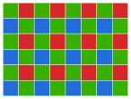
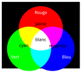
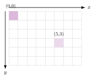

# Cours

<p class="sous-titre">La photographie numérique</p>

<span id="chap-03" class="ancre"></span>

|  |  |
|:---|:---|
| **Programme** | Du capteur au pixel ; codage des couleurs (RVB) ; définition, résolution et taille d’un fichier ; traitement d’image *par programme* ; métadonnées EXIF ; rôle des algorithmes dans les appareils. |
| **Idée** | Une photo numérique n’est qu’un immense tableau de **nombres**. Comprendre ces nombres, c’est pouvoir *lire*, *fabriquer* et *transformer* une image **soi-même**, avec quelques lignes de Python. |
| **Objectifs** | Expliquer comment un capteur forme une image ; coder une couleur en RVB ; calculer définition, résolution et poids ; modifier une image pixel par pixel ; lire les métadonnées et en mesurer l’enjeu pour la vie privée. |

!!! remarque "Remarque"

    **Un peu d’histoire.** La toute première photographie est prise vers **1826** par le Français **Nicéphore Niépce** (« Point de vue du Gras ») : il a fallu *plusieurs heures* de pose ! En **1888**, **George Eastman** lance l’appareil **Kodak** avec un slogan resté célèbre : « *Vous appuyez sur le bouton, nous faisons le reste.* » Mais la vraie révolution est de **1975** : l’ingénieur **Steven Sasson**, chez Kodak, construit le **premier appareil photo numérique**. Il pesait près de 4 kg, enregistrait sur une cassette en **23 secondes**… une image de $100 \times 100$ pixels en noir et blanc ! (IEEE, 2022) Aujourd’hui, le capteur qui tient dans votre téléphone compte plus de **mille fois** plus de pixels (souvent 12 millions ou davantage, contre 10 000), en couleurs.

    \*(image manquante : 03_hist_niepce)\*  
    « Point de vue du Gras » (Niépce, vers 1826)

    \*(image manquante : 03_hist_sasson)\*  
    Le premier appareil numérique (Sasson, 1975)

## De la lumière à l’image : le capteur

Autrefois, l’appareil photo contenait une **pellicule** : une surface sensible à la lumière, qu’il fallait ensuite développer chimiquement en laboratoire. Aujourd’hui, la pellicule est remplacée par un **capteur** électronique.

!!! definition "Définition 1"

    Un <span id="lex-capteurphoto03" class="ancre"></span>**capteur** est une surface couverte de millions de petites cellules, les <span id="lex-photosite03" class="ancre"></span>**photosites**. Chaque photosite mesure la **quantité de lumière** qu’il reçoit et la transforme en un **nombre** (c’est la *numérisation*) : plus il reçoit de lumière, plus le nombre est grand.

\*(image manquante : 03_capteur_cmos_sony_a7riii)\*

Le capteur CMOS d’un appareil photo hybride, démonté : la surface rectangulaire centrale porte des dizaines de millions de photosites.  
Photo : Harry Munday, Wikimedia Commons, licence CC BY-SA 4.0.

Seul, un photosite ne distingue pas les couleurs : on obtiendrait une image en **niveaux de gris**. Pour capter la couleur, on place devant les photosites un <span id="lex-bayer03" class="ancre"></span>**filtre de Bayer** : des petits filtres rouges, verts et bleus. Fait amusant, il y a **deux fois plus de filtres verts** que de rouges ou de bleus, car notre œil est plus sensible au vert.

\*(image manquante : 03_hist_capteur_macro)\*  
Un capteur vu de très près : la mosaïque du filtre coloré

{ .tikz loading=lazy }  
Filtre de Bayer : 1 photosite rouge, 1 bleu et *2 verts* par groupe de quatre.

!!! activite "Activité — Expliquer le capteur"

    Rédiger, en quelques lignes, un résumé qui explique à un camarade comment un capteur d’appareil photo fabrique une image (mots à réutiliser : *photosite*, *lumière*, *nombre*, *filtre de Bayer*).

<span id="cours-03-1" class="ancre"></span>

<span class="afaire">▶ Exercices d'application :</span> exercices **[1](exercices.md#ex-03-1) et [2](exercices.md#ex-03-2)** (le capteur et la formation de l’image)

## Le pixel et le codage des couleurs (RVB)

L’image finale est un quadrillage de points colorés : les **pixels** (de l’anglais *picture element*).

!!! definition "Définition 2"

    Chaque <span id="lex-pixel03" class="ancre"></span>**pixel** porte une couleur codée par **trois nombres** entre **0 et 255** : la quantité de **R**ouge, de **V**ert et de **B**leu (système **RVB**, ou *RGB* en anglais). Exemple : $(247,\ 56,\ 98)$. C’est la <span id="lex-rvb03" class="ancre"></span>**synthèse additive** : en mélangeant de la lumière rouge, verte et bleue, on obtient toutes les autres couleurs.

{ .tikz loading=lazy }

!!! exemple "Exemple"

    Quelques couleurs utiles : rouge $=(255,0,0)$ vert $=(0,255,0)$ bleu $=(0,0,255)$ **noir** $=(0,0,0)$ **blanc** $=(255,255,255)$ jaune $=(255,255,0)$. Quand les trois canaux sont *égaux*, on obtient un **gris**.

{ .tikz loading=lazy }  
La synthèse additive : rouge + vert $=$ jaune, les trois ensemble $=$ blanc.

!!! activite "Activité — Jouer avec les couleurs"

    1.  Avec 256 valeurs possibles par canal (de 0 à 255) et 3 canaux, calculer le nombre total de couleurs différentes.

    2.  Donner le code RVB pour obtenir : du **noir**, du **blanc**, du **jaune** (rouge + vert), du **violet** (rouge + bleu).

    3.  Que voit-on à l’écran avec le code $(125,125,125)$ ? Et avec $(30,30,30)$ ?

!!! projet "Projet — Dessiner des drapeaux avec Python (fiche séparée)"

    Maintenant que vous savez coder une couleur, vous allez **fabriquer** des images de zéro : des drapeaux (Monaco, France, puis d’autres), en respectant les **proportions** et les **couleurs officielles**.  
    $\to$ voir la fiche *« Projet : dessiner des drapeaux avec PIL »*.

<span id="cours-03-3" class="ancre"></span>

<span class="afaire">▶ Exercices d'application :</span> exercices **[3](exercices.md#ex-03-3) à [5](exercices.md#ex-03-5)** (le pixel et le codage RVB)

## Définition, résolution et poids d’une image

!!! definition "Définition 3"

    La <span id="lex-definition03" class="ancre"></span>**définition** d’une image est son nombre de pixels : largeur $\times$ hauteur. Une image $800 \times 600$ contient $800 \times 600 = 480\,000$ pixels.  
    La <span id="lex-resolution03" class="ancre"></span>**résolution** est le nombre de pixels par unité de longueur, souvent en **ppp** (pixels par pouce, ou *dpi*). Un pouce vaut $2{,}54$ cm. Plus la résolution est élevée, plus l’image est nette à l’impression.

!!! regle "Règle 1"

    Une image en couleurs « brute » stocke 3 nombres par pixel (R, V, B), chacun sur **1 octet**. <span id="lex-poids03" class="ancre"></span>Son **poids** vaut donc environ : $$\text{poids} = \text{largeur} \times \text{hauteur} \times 3 \ \text{octets}.$$ (Les formats comme le JPEG *compressent* ensuite l’image pour réduire ce poids.)

!!! activite "Activité — Calculer sur les images"

    1.  Une photo de définition $1200 \times 900$ est tirée au format $20 \times 15$ (en cm). Calculer sa résolution en ppp (rappel : $1$ pouce $=2{,}54$ cm).

    2.  Pour une belle impression, il faut environ $300$ ppp. Calculer la définition minimale d’une photo imprimée en $15 \times 10$ cm.

    3.  Calculer le poids « brut » d’une photo de définition $4000 \times 3000$ (en méga-octets ; $1$ Mo $\approx 10^{6}$ octets).

<span id="cours-03-6" class="ancre"></span>

<span class="afaire">▶ Exercices d'application :</span> exercices **[6](exercices.md#ex-03-6) à [10](exercices.md#ex-03-10)** (définition, résolution, poids)

## Modifier une image par programme (Python + PIL)

Une image étant un tableau de nombres, on peut la **transformer** avec un programme. On utilise la bibliothèque **PIL**. Chaque pixel est repéré par des coordonnées $(x, y)$ : $(0,0)$ est en **haut à gauche**.

{ .tikz loading=lazy }  
Le pixel $(0,0)$ est en haut à gauche ; $x$ va vers la droite, $y$ vers le bas.

**Lire** un pixel avec `getpixel`, le **modifier** avec `putpixel` :

```python
from PIL import Image
img = Image.open("terre.jpg")        # l'image doit etre dans le meme dossier

r, v, b = img.getpixel((100, 250))   # lire le pixel (100, 250)
print("rouge :", r, "vert :", v, "bleu :", b)

img.putpixel((250, 250), (255, 0, 0)) # colorier ce pixel en rouge
img.show()                            # afficher l'image
```

Pour parcourir *toute* l’image, on utilise **deux boucles `for`** imbriquées :

```python
from PIL import Image
img = Image.open("terre.jpg")
largeur, hauteur = 500, 500          # taille de terre.jpg

for y in range(hauteur):
    for x in range(largeur):
        r, v, b = img.getpixel((x, y))
        img.putpixel((x, y), (v, b, r))   # on decale les canaux
img.show()
```

!!! activite "Activité — Ses premières retouches"

    Saisir et tester les programmes ci-dessus dans Spyder (ou Basthon), avec l’image `terre.jpg`. Puis :

    1.  Modifier le premier programme pour afficher les canaux du pixel $(250,300)$.

    2.  Expliquer, en une phrase, l’effet du programme à deux boucles (le décalage des canaux).

    3.  Après une petite recherche sur le **négatif** d’une image, écrire un programme qui *inverse* chaque canal (indice : remplacer $r$ par $255-r$, etc.).

    4.  Après une recherche sur les **niveaux de gris**, écrire un programme qui rend l’image grise (indice : remplacer R, V et B par leur *moyenne* $(r+v+b)//3$).

Avec un `if`, on peut ne modifier *que certains* pixels (par exemple selon leur position ou leur couleur) : c’est la base de la retouche « localisée ».

!!! projet "Projet — Retoucher un tableau célèbre (fiche séparée)"

    Vous appliquerez ces techniques à de vraies œuvres d’art (du domaine public) : changer la couleur du ciel de *La Nuit étoilée* de Van Gogh, ou celle d’un vêtement dans un portrait.  
    $\to$ voir la fiche *« Projet : retoucher un tableau célèbre en RVB »*.

<span id="cours-03-11" class="ancre"></span>

<span class="afaire">▶ Exercices d'application :</span> exercices **[11](exercices.md#ex-03-11) à [16](exercices.md#ex-03-16)** (modifier une image en Python)

## Les métadonnées (EXIF) et la vie privée

Un fichier photo ne contient pas *que* l’image. Il embarque aussi des informations sur la prise de vue : ce sont les **métadonnées EXIF**.

!!! definition "Définition 4"

    Les <span id="lex-exif03" class="ancre"></span>**métadonnées EXIF** sont des données *cachées* rangées dans le fichier : date et heure, marque et modèle de l’appareil, réglages, définition… et, si l’appareil possède un GPS (tous les smartphones), les **coordonnées du lieu** de la prise de vue.

On peut les lire avec un petit programme Python :

```python
from PIL import Image
img = Image.open("photo.jpg")
exif = img._getexif()      # dictionnaire cle : valeur
print(exif)
```

| **Métadonnée EXIF**              | **Valeur (exemple fictif)**    |
|:---------------------------------|:-------------------------------|
| Date et heure de la prise de vue | `2026:05:14 16:42:07`          |
| Fabricant / modèle               | Smartphone (modèle quelconque) |
| Définition                       | $4032 \times 3024$             |
| Temps de pose / sensibilité      | 1/120 s / ISO 100              |
| Latitude GPS                     | $43^\circ\,43'\,50''$ N        |
| Longitude GPS                    | $7^\circ\,25'\,31''$ E         |
| Altitude GPS                     | 12 m                           |

Extrait de métadonnées EXIF (valeurs fictives). En rouge : les coordonnées GPS, qui suffisent à situer la prise de vue sur une carte.

!!! regle "Règle 2"

    Publier une photo prise au smartphone peut **révéler sans le vouloir** où et quand elle a été prise (domicile, école…). Beaucoup de réseaux sociaux retirent l’EXIF à la publication, mais **pas tous** : dans le doute, on peut *effacer les métadonnées* avant de partager.

!!! activite "Activité — Enquêter sur une photo"

    1.  Sur une photo fournie par le professeur, retrouver à l’aide du programme : la **date** de prise de vue, le **fabricant** de l’appareil, la **définition**.

    2.  Expliquer en quoi la présence de coordonnées GPS dans une photo peut poser un **problème de vie privée**.

<span id="cours-03-17" class="ancre"></span>

<span class="afaire">▶ Exercices d'application :</span> exercices **[17](exercices.md#ex-03-17) et [18](exercices.md#ex-03-18)** (métadonnées EXIF et vie privée)

## Les algorithmes dans nos appareils

La photo « parfaite » du smartphone n’est pas seulement captée : elle est **calculée**. Des algorithmes interviennent après la prise de vue :

- **mise au point** et **exposition** automatiques ;

- **HDR** : combinaison de plusieurs clichés pour équilibrer ombres et lumières ;

- **débruitage**, accentuation, **filtres** et embellissement automatique ;

- détection de visages, *portraits* avec flou d’arrière-plan.

!!! regle "Règle 3"

    Une image numérique est **facile à modifier** : une retouche peut être invisible. Une photo n’est donc plus une **preuve** en soi. Avec l’IA (images générées, *deepfakes*), il faut plus que jamais garder un **esprit critique** : d’où vient l’image ? qui l’a publiée ?

!!! remarque "Remarque — Liens avec d’autres chapitres"

    Une photo numérique est un tableau de nombres : on la traite avec les **boucles** et les **conditions** du chapitre *Les bases de Python*. Ses **métadonnées EXIF** sont des **données** au sens du chapitre *Données en tables*, et leurs coordonnées viennent du récepteur **GPS** (chapitre *Localisation*). Le capteur d’image est un **capteur** comme ceux des objets connectés : il transforme une grandeur physique, la lumière, en nombre. En spécialité NSI de Première, on verra que chaque valeur de 0 à 255 tient sur un octet, c’est-à-dire 8 **bits** en écriture binaire.

## Bilan — la carte mémoire

| **Notion** | **À retenir** |
|:---|:---|
| Capteur / photosite | mesure la lumière $\to$ un nombre ; filtre de Bayer (2$\times$ plus de vert). |
| Pixel | un point de l’image, codé en **RVB** : 3 nombres de 0 à 255. |
| Synthèse additive | R + V + B $\to$ toutes les couleurs ; 3 canaux égaux $=$ gris. |
| Définition | nombre de pixels $=$ largeur $\times$ hauteur. |
| Résolution | pixels par pouce (ppp / dpi) ; $1$ pouce $=2{,}54$ cm. |
| Poids brut | largeur $\times$ hauteur $\times 3$ octets (le JPEG compresse). |
| Coordonnées | pixel $(x,y)$ ; $(0,0)$ en haut à gauche. |
| PIL | `getpixel` (lire), `putpixel` (écrire), 2 boucles `for` pour tout parcourir. |
| Négatif / gris | $255-c$ pour chaque canal ; moyenne $(r+v+b)//3$ pour le gris. |
| EXIF | métadonnées cachées (date, appareil, **GPS**) $\to$ enjeu de vie privée. |
| Algorithmes | HDR, filtres, retouche ; une photo n’est plus une preuve $\to$ esprit critique. |

!!! encadre "Débat argumenté"

    Une **fiche débat** accompagne ce thème : « Faut-il obliger à signaler toute photo retouchée, dans la publicité comme sur les réseaux sociaux ? » (documents, rôles, tableau d’arguments et trace écrite, environ 50 min).

## Savoir-faire à maîtriser

*À la fin du chapitre, je sais…*

!!! autopos "Savoir-faire : je me positionne"

    - expliquer comment un **capteur** transforme la lumière en image numérique ;

    - décrire une image par ses **pixels** et coder une couleur en **RVB** (3 valeurs de 0 à 255) ;

    - distinguer **définition**, **résolution** et **poids** d’une image, et estimer un poids ;

    - modifier une image par un programme **Python** (parcourir et changer les pixels avec la bibliothèque PIL) ;

    - expliquer ce que sont les métadonnées **EXIF** et le risque qu’elles posent pour la vie privée ;

    - citer des traitements automatiques (algorithmes) réalisés par un appareil photo ou un smartphone.

## Sources

- Harry Ransom Center (université du Texas à Austin), qui conserve le « Point de vue du Gras » de Nicéphore Niépce (vers 1826–1827). `hrc.utexas.edu`

- George Eastman Museum (Rochester), histoire de l’appareil Kodak de 1888 et de son slogan.

- IEEE, *Milestone* « Handheld Digital Camera, 1975 » (appareil de Steven Sasson : environ 3,6 kg, image de $100 \times 100$ pixels enregistrée en 23 s), inaugurée en 2022. `ethw.org`

**Crédits.** Photo du capteur : Harry Munday, « Sony A7RIII CMOS Sensor and IBIS Module », Wikimedia Commons, licence CC BY-SA 4.0 (image réduite). Image `terre.jpg` utilisée dans les programmes : « The Blue Marble », NASA, équipage d’Apollo 17, 7 décembre 1972, domaine public. Autres figures et tableau EXIF (valeurs fictives) : réalisés pour ce cours.
