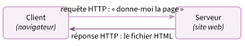
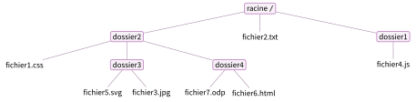

# Cours

<p class="sous-titre">Le Web</p>

<span id="chap-04" class="ancre"></span>

|  |  |
|:---|:---|
| **Programme** | Repères historiques du Web ; distinguer *Web* et *Internet* ; le modèle **client/serveur** et le protocole **HTTP** ; les **URL** et les hyperliens ; le couple **HTML**/**CSS** ; moteurs de recherche et **indexation** ; sécurité et traces (HTTPS, cookies). |
| **Idée** | Une page web est un simple **fichier texte** : du **HTML** pour le *contenu*, du **CSS** pour l’*apparence*. En comprenant ces deux langages, vous passez de *consommateur* à *auteur* du Web. |
| **Objectifs** | Situer l’invention du Web ; ne plus confondre Web et Internet ; lire une URL et un échange client/serveur ; écrire une page en HTML ; la mettre en forme en CSS ; comprendre comment un moteur de recherche classe ses réponses. |

!!! remarque "Remarque"

    **Un peu d’histoire.** L’idée d’un texte « augmenté » de renvois — l’<span id="lex-hypertexte04" class="ancre"></span>**hypertexte** — est imaginée dès **1965** par l’Américain **Ted Nelson**. Mais c’est en **1989** au **CERN** (près de Genève) que le Britannique **Tim Berners-Lee**, avec le Belge **Robert Cailliau**, invente le **World Wide Web** : relier des documents *de machine à machine* par des **hyperliens**. Il écrit le premier **navigateur** et met en ligne la **première page web** de l’histoire, toujours consultable aujourd’hui. Fait remarquable : il choisit de ne rien breveter — le Web est **libre et gratuit**.

    \*(image manquante : 04_hist_premier_serveur)\*  
    Le premier serveur web, un ordinateur NeXT

    \*(image manquante : 04_hist_berners_lee)\*  
    Tim Berners-Lee (2009)

!!! navigateur "Rendu dans le navigateur — info.cern.ch/hypertext/WWW/TheProject.html"

    (image manquante : 04_premiere_page_web)\*

La toute première page web (1991), toujours en ligne sur `info.cern.ch` : les hyperliens y sont déjà soulignés.

!!! regle "Règle 1 — Repères historiques (les grandes étapes)"

    - **1965** — Ted Nelson invente le concept d’**hypertexte**.

    - **1989** — naissance du Web au **CERN** (Tim Berners-Lee).

    - **1993** — le Web tombe dans le **domaine public** ; le navigateur **Mosaic** le rend populaire hors des laboratoires.

    - **1994** — création du **W3C**, l’organisme qui **normalise** le Web.

    - **1995** — des pages *interactives* (**JavaScript**) et *dynamiques* (**PHP**) deviennent possibles.

    - **2001** — standardisation des pages grâce au **DOM**.

    - **2010** — explosion du Web **mobile** (smartphones, applications).

    Sources : ministère de l’Éducation nationale, programme de SNT de seconde, *Bulletin officiel* spécial n° 1 du 22 janvier 2019 (repères historiques du Web) ; CERN, « La naissance du Web » et première page web reconstituée, `home.cern`, `info.cern.ch` ; W3C, « About W3C » (création du consortium en 1994), `w3.org`.

## Le Web n’est pas Internet

C’est la confusion la plus fréquente. Il faut la lever tout de suite.

!!! definition "Définition 1"

    <span id="lex-internet04" class="ancre"></span>**Internet** est le *réseau* physique mondial : des millions d’ordinateurs reliés par des câbles, de la fibre et des ondes, qui échangent des données grâce au protocole **IP**.  
    Le <span id="lex-web04" class="ancre"></span>**Web** (ou « toile ») est *l’un des services* qui circulent sur Internet : l’ensemble des **pages** reliées par des **hyperliens**, consultées avec un **navigateur**.

Autrement dit, le Web *s’appuie* sur Internet, mais ce n’est pas la même chose. Sur Internet circulent aussi les **e-mails** (protocole SMTP), les transferts de fichiers (FTP), les appels vidéo, les jeux en ligne… Le Web repose sur **trois technologies** inventées par Berners-Lee : le protocole **HTTP**, les adresses **URL** et le langage **HTML**.

!!! regle "Règle 2 — À retenir"

    Internet $=$ **le réseau** (la route). Web $=$ **un service** qui roule dessus (les pages). Une bonne image : Internet est le *réseau routier*, le Web est *l’ensemble des magasins* qu’on visite en l’empruntant.

<span id="cours-04-1" class="ancre"></span>

<span class="afaire">▶ Exercices d'application :</span> exercices **[1](exercices.md#ex-04-1) et [2](exercices.md#ex-04-2)** (le Web n’est pas Internet)

## Le modèle client / serveur et le protocole HTTP

Quand vous consultez un site, deux ordinateurs dialoguent.

!!! definition "Définition 2"

    <span id="lex-navigateur04" class="ancre"></span>Le <span id="lex-clientserveur04" class="ancre"></span>**client** est votre navigateur (Firefox, Chrome…) : il **demande** une page.  
    Le **serveur** est un ordinateur, allumé en permanence, qui **stocke** le site et **répond** en envoyant la page. Ce dialogue suit des règles précises : le protocole <span id="lex-http04" class="ancre"></span>**HTTP** (*HyperText Transfer Protocol*).

{ .tikz loading=lazy }

Le navigateur envoie une **requête**, le serveur renvoie une **réponse** (la page, une image…) accompagnée d’un **code** qui dit si la requête a **réussi** ou **échoué** :

| **Code** | **Signification**                                      |
|:--------:|:-------------------------------------------------------|
| **200**  | tout va bien, voici la page *(réussite)*               |
| **403**  | accès interdit *(échec : non autorisé)*                |
| **404**  | page non trouvée *(échec : la ressource n’existe pas)* |
| **500**  | erreur du serveur *(échec : le serveur a planté)*      |

!!! regle "Règle 3 — HTTP et HTTPS"

    **HTTPS** est la version **sécurisée** de HTTP : les données échangées sont **chiffrées**. Le petit **cadenas** dans la barre d’adresse indique que la connexion est protégée — indispensable avant de saisir un mot de passe ou un numéro de carte.

### Décomposer une requête HTTP

Une requête HTTP est un petit message texte. Elle précise une **méthode** (l’action voulue) et la **ressource** demandée sur un **hôte** (le serveur) :

```text
GET /snt/web.html HTTP/1.1        <- methode + ressource demandee
Host: www.lycee.mc                <- le serveur vise
```

La méthode `GET` veut dire « *donne-moi* cette ressource ». On peut **passer des informations au serveur** en les ajoutant à la fin de l’URL, après un point d’interrogation `?` : ce sont les **paramètres**. Chaque paramètre s’écrit `nom=valeur`, et on les sépare par une esperluette `&` :

/recherche?ville=Monaco&jour=lundi

Ici, deux paramètres sont **passés** au serveur : `ville` vaut `Monaco` et `jour` vaut `lundi`. C’est ainsi qu’un formulaire de recherche transmet ce que vous avez tapé.

!!! regle "Règle 4 — Anatomie d’un échange"

    **Requête** (client $\to$ serveur) : *méthode* + *ressource* + éventuels *paramètres* après `?`. **Réponse** (serveur $\to$ client) : un *code* (200, 404…) + le *contenu* (la page HTML).

### Chez le client, chez le serveur

Le serveur peut renvoyer une page toute prête, ou la **fabriquer sur mesure** en fonction des paramètres reçus (une page *dynamique*). La page reçue peut aussi contenir du **code exécuté par le client** — le plus souvent du **JavaScript** — qui anime la page directement dans votre navigateur (menus, animations, vérification d’un formulaire).

!!! regle "Règle 5 — Deux endroits où « ça calcule »"

    **Côté serveur** : la page est choisie ou construite avant l’envoi (souvent en PHP).  
    **Côté client** : le navigateur exécute le **JavaScript** contenu dans la page.  
    On peut voir le code d’une page reçue par un **clic droit $\to$ « Afficher le code source »**.

<span id="cours-04-13" class="ancre"></span>

<span class="afaire">▶ Exercices d'application :</span> exercices **[13](exercices.md#ex-04-13) à [17](exercices.md#ex-04-17)** (client/serveur ; la requête HTTP)

## L’adresse d’une page : l’URL

Pour demander une page, le client doit connaître son adresse : <span id="lex-url04" class="ancre"></span>son **URL**.

!!! definition "Définition 3"

    Une **URL** (*Uniform Resource Locator*) est l’adresse unique d’une ressource (page, image, fichier) sur le Web. Elle se lit de gauche à droite :

https://www.lycee.mc/cours/snt/web.html  

|  |  |  |
|:---|:---|:---|
| $\uparrow$ protocole | $\uparrow$ nom du serveur (domaine) | $\uparrow$ chemin du fichier |

Les fichiers d’un site sont rangés dans des dossiers, comme sur votre ordinateur : c’est une structure en **arborescence** (un arbre à l’envers dont la racine est notée `/`).

{ .tikz loading=lazy }  
Les **dossiers** sont encadrés, les **fichiers** sont les feuilles de l’arbre.

!!! regle "Règle 6 — Chemin absolu, chemin relatif"

    Un **chemin absolu** part de la **racine** `/` : `/dossier2/dossier3/fichier3.jpg`.  
    Un **chemin relatif** part du **dossier courant** (pas de `/` au début) : `dossier3/fichier3.jpg`. On **remonte** d’un niveau avec `..` : `../dossier3/fichier5.svg`.

<span id="cours-04-3" class="ancre"></span>

<span class="afaire">▶ Exercices d'application :</span> exercices **[3](exercices.md#ex-04-3) à [5](exercices.md#ex-04-5)** (l’URL et les chemins)

## HTML : le contenu de la page

Nous arrivons au cœur du chapitre : le couple **HTML** + **CSS**.

!!! definition "Définition 4"

    <span id="lex-html04" class="ancre"></span>**HTML** (*HyperText Markup Language*) est le langage qui décrit le **contenu** et la **structure** d’une page : titres, paragraphes, images, liens… Ce n’est **pas** un langage de programmation (pas de boucles ni de conditions) : c’est un langage de **balisage**.

En HTML, on entoure le contenu de <span id="lex-balise04" class="ancre"></span>**balises**. Une balise **ouvrante** `<p>` et une balise **fermante** `</p>` délimitent un **élément** :

```html
<h1>Hello World ! Ceci est un titre</h1>
<p>Ceci est un <strong>paragraphe</strong>. Avez-vous bien compris ?</p>
```

!!! navigateur "Rendu dans le navigateur"

    **Hello World ! Ceci est un titre**

    Ceci est un **paragraphe**. Avez-vous bien compris ?

Chaque balise a un **sens** (on parle de *sémantique*) : `<h1>` est un titre important (`<h2>`, `<h3>`… des sous-titres), `<p>` un paragraphe, `<strong>` un mot important, `` une image, `<a>` un lien.

!!! regle "Règle 7 — Les deux règles d’or des balises"

    1.  **Toute balise ouverte doit être refermée.**

    2.  **Les balises s’imbriquent proprement** (« premier ouvert, dernier fermé »).  
        `<p><strong>…</strong></p>` est correct ; `<p><strong>…</p></strong>` est **interdit**.

Une balise peut porter des **attributs**, dans la balise ouvrante. Les deux plus utiles sont `id` (un identifiant *unique* dans la page) et `class` (une catégorie, partageable) :

```html
<h2 class="chapitre">Un sous-titre</h2>
<p id="intro">Le paragraphe d'introduction.</p>
```

### La structure complète d’une page HTML

Une vraie page web suit toujours le même squelette :

```html
<!DOCTYPE html>
<html>
  <head>
    <meta charset="utf-8" />
    <title>Ma premiere page</title>
  </head>
  <body>
    <h1>Bienvenue</h1>
    <p>Ceci est ma page web.</p>
  </body>
</html>
```

Le `<head>` contient les informations *invisibles* (titre de l’onglet, encodage) ; le `<body>` contient tout ce qui s’**affiche** dans la page.

<span id="cours-04-6" class="ancre"></span>

<span class="afaire">▶ Exercices d'application :</span> exercices **[6](exercices.md#ex-04-6) à [9](exercices.md#ex-04-9)** (lire et écrire du HTML)

## CSS : l’apparence de la page

Le HTML dit *ce qu’il y a* ; le **CSS** dit *à quoi ça ressemble*.

!!! definition "Définition 5"

    <span id="lex-css04" class="ancre"></span>**CSS** (*Cascading Style Sheets*, « feuilles de style en cascade ») est le langage qui gère l’**apparence** : couleurs, polices, tailles, alignements, marges, dispositions…

Une règle CSS **cible** des éléments (le *sélecteur*) et leur applique des **propriétés** :

```css
h1 {
  text-align: center;
  color: white;
  background-color: crimson;
}
h2 {
  font-family: Verdana;
  font-style: italic;
  color: green;
}
```

!!! navigateur "Rendu dans le navigateur"

    **Ceci est un titre**

    Ceci est un sous-titre

!!! regle "Règle 8 — Les trois sélecteurs à connaître"

    On peut cibler les éléments d’une page de trois façons différentes :

| **On cible…**                      | **En HTML**      | **En CSS**     |
|:-----------------------------------|:-----------------|:---------------|
| **toutes** les balises d’un type   | `<p>`            | `p { …}`       |
| un élément par son **id** (unique) | `id="intro"`     | `#intro { …}`  |
| tous les éléments d’une **classe** | `class="alerte"` | `.alerte { …}` |

En CSS, l’`id` se cible avec un **dièse** `#`, la `class` avec un **point** `.` . C’est ainsi qu’on met en forme *un* paragraphe précis sans toucher aux autres.

!!! activite "Activité — Ma première page"

    Sur un éditeur en ligne (par exemple `jsfiddle.net` ou `codepen.io`) :

    1.  Recopier le squelette HTML complet, avec un `<h1>`, deux `<p>` et une image.

    2.  Ajouter du CSS pour centrer le titre, le colorer, et changer la police des paragraphes.

    3.  Donner à un seul paragraphe l’`id="important"` et le colorer en rouge *via* `#important`.

<span id="cours-04-10" class="ancre"></span>

<span class="afaire">▶ Exercices d'application :</span> exercices **[10](exercices.md#ex-04-10) à [12](exercices.md#ex-04-12)** (mettre en forme avec CSS)

## Les hyperliens : la « toile »

Ce qui fait la **toile**, ce sont les liens d’une page vers une autre. On les crée avec la balise `<a>` et son attribut `href` (l’URL de destination) :

```html
<a href="https://www.gouv.mc">Visiter le site du gouvernement</a>
```

En suivant les liens de page en page, on « navigue » : c’est la **navigation hypertexte**, l’idée fondatrice de Berners-Lee.

## À qui appartient une page ? Notions juridiques

Publier n’est pas voler : sur le Web comme ailleurs, ce que l’on trouve **appartient à quelqu’un**.

!!! definition "Définition 6"

    Le <span id="lex-droitauteur04" class="ancre"></span>**droit d’auteur** protège automatiquement toute création (texte, photo, musique, code) : son auteur décide qui peut l’utiliser. Une **licence** est l’autorisation qui accompagne une œuvre et fixe le **droit d’usage** : ce qu’on a le droit d’en faire (copier, modifier, diffuser, vendre…).

!!! regle "Règle 9 — Copier n’est pas toujours permis"

    Récupérer une image ou un texte trouvé sur le Web pour le republier **sans autorisation** peut être **illégal**. Pour réutiliser sereinement, on cherche des œuvres sous **licence libre** (par exemple **Creative Commons**, ou les **logiciels libres**) qui autorisent d’avance certains usages — souvent à condition de **citer l’auteur**.

Un fichier numérique se copie à l’infini pour presque rien : cela ne veut pas dire qu’il est **sans valeur**. Un logiciel, une base de données, une photo ont une **valeur** (de travail, d’usage, commerciale). C’est pourquoi le Web a fait naître à la fois un immense **commerce en ligne** et un mouvement de **partage** (Wikipédia, logiciels libres) fondé, lui aussi, sur des licences précises.

<span id="cours-04-18" class="ancre"></span>

<span class="afaire">▶ Exercices d'application :</span> exercice **[18](exercices.md#ex-04-18)** (droit d’auteur : ai-je le droit ?)

## Trouver une page : les moteurs de recherche

Il existe des milliards de pages. Pour s’y retrouver, on utilise un **moteur de recherche** (Google, Bing, Qwant…).

!!! definition "Définition 7"

    Un <span id="lex-moteur04" class="ancre"></span>**moteur de recherche** explore le Web en permanence grâce à des robots (les *crawlers*) qui suivent les liens, et range les pages trouvées dans un immense **index** (comme l’index d’un livre). Quand vous tapez une requête, le moteur ne cherche pas « dans le Web » mais **dans son index**, déjà prêt.

!!! regle "Règle 10 — L’ordre des résultats n’est pas neutre"

    Le moteur **classe** les pages par **pertinence**, à l’aide d’un algorithme. Un critère historique (le *PageRank* de Google) : une page est jugée importante si **beaucoup d’autres pages importantes pointent vers elle**. S’ajoutent la présence des mots-clés, la langue, la localisation… Les premiers résultats peuvent aussi être des **publicités** (signalées par la mention « Annonce »).

!!! activite "Activité — Aiguiser son esprit critique"

    1.  Faire une même recherche sur deux moteurs différents et comparer les premiers résultats.

    2.  Repérer, sur une page de résultats, ce qui est une **publicité** et ce qui ne l’est pas.

    3.  Expliquer pourquoi « être en première page » est un enjeu commercial énorme.

<span id="cours-04-20" class="ancre"></span>

<span class="afaire">▶ Exercices d'application :</span> exercices **[20](exercices.md#ex-04-20) et [21](exercices.md#ex-04-21)** (les moteurs de recherche)

## Sécurité et confidentialité : régler son navigateur

Naviguer n’est jamais tout à fait anonyme, et laisser un site exécuter du code sur sa machine comporte des **risques**. Heureusement, le navigateur se **règle**.

!!! regle "Règle 11 — Cookies et traces"

    Un <span id="lex-cookie04" class="ancre"></span>**cookie** est un petit fichier qu’un site dépose dans votre navigateur pour vous **reconnaître** (rester connecté, retenir un panier…) — mais aussi pour **vous suivre** d’un site à l’autre à des fins publicitaires. Chaque visite laisse des **traces** : **historique**, adresse **IP**, cookies.

!!! regle "Règle 12 — Les réglages importants du navigateur"

    Dans les *paramètres* de son navigateur, on peut :

    - **gérer les cookies** : les refuser (surtout les cookies « tiers », qui pistent) ;

    - **effacer l’historique** de navigation, ou activer la **navigation privée** pour ne rien enregistrer ;

    - **contrôler les autorisations** d’un site (caméra, micro, position) et **interdire** l’exécution de certains programmes ;

    - préférer les sites en **HTTPS** (cadenas) et bloquer les traceurs.

!!! regle "Règle 13 — Attention à l’hameçonnage (phishing)"

    De **fausses pages**, imitant une vraie (banque, réseau social), cherchent à voler vos identifiants : c’est l’**hameçonnage**. Un **lien peut cacher une adresse différente** de son texte : avant de cliquer, **survolez le lien** pour lire la *vraie* URL, et vérifiez le nom de domaine. En cas de doute, on ne clique pas et on ne saisit aucune information personnelle.

<span id="cours-04-19" class="ancre"></span>

<span class="afaire">▶ Exercices d'application :</span> exercice **[19](exercices.md#ex-04-19)** (régler et sécuriser son navigateur)

!!! remarque "Remarque — Liens avec d’autres chapitres"

    Le Web s’appuie sur **Internet** : avant la requête HTTP, le navigateur demande au **DNS** l’adresse IP du serveur, puis la page voyage en **paquets** (TCP/IP). Les hyperliens forment un **graphe**, comme les amitiés d’un **réseau social** ; c’est sur ce graphe que travaille le PageRank. Cookies et traces de navigation sont des **données personnelles**. En spécialité NSI de Première, on étudie les formulaires, les méthodes `GET` et `POST` et le **JavaScript**.

## Bilan — la carte mémoire

| **Notion** | **À retenir** |
|:---|:---|
| Web $\neq$ Internet | Internet $=$ le réseau ; Web $=$ un service (les pages) qui roule dessus. |
| Inventeur | Tim Berners-Lee, au CERN, 1989–1991 ; W3C en 1994. |
| Client / serveur | le navigateur *demande* (requête HTTP), le serveur *répond* (la page). |
| HTTP / HTTPS | protocole du Web ; HTTPS $=$ version chiffrée (cadenas). |
| Requête HTTP | méthode (`GET`) + ressource ; **paramètres** après `?` : `nom=valeur&…`. |
| Codes de réponse | 200 (ok), 403 (interdit), 404 (introuvable), 500 (erreur serveur). |
| Client / serveur (2) | serveur : PHP (dynamique) ; client : **JavaScript** ; clic droit $\to$ code source. |
| URL | adresse d’une page : protocole + domaine + chemin ; absolu (`/`) ou relatif (`..`). |
| HTML | le **contenu** : langage de *balises* (`<h1>`, `<p>`, `<a>`…). |
| Règles des balises | toute balise ouverte est refermée ; imbrication propre. |
| CSS | l’**apparence** : sélecteur + propriétés (couleur, police, alignement…). |
| Sélecteurs | `p` (balise), `#id` (unique), `.classe` (partagée). |
| Hyperlien | `<a href="...">` ; c’est ce qui fait la « toile ». |
| Droit d’auteur | toute création a un auteur ; une **licence** fixe le droit d’usage (ex. Creative Commons). |
| Moteur de recherche | robots + *index* ; résultats **classés** (PageRank), pubs incluses. |
| Sécurité navigateur | régler cookies/historique/navigation privée ; se méfier de l’**hameçonnage**. |

!!! encadre "Débat argumenté"

    Une **fiche débat** accompagne ce thème : « Un moteur de recherche doit-il rester libre de classer ses résultats comme il le veut ? » (documents, rôles, tableau d’arguments et trace écrite, environ 50 min).

## Savoir-faire à maîtriser

*À la fin du chapitre, je sais…*

!!! autopos "Savoir-faire : je me positionne"

    - distinguer le **Web** d’**Internet** ;

    - décrire l’échange **client / serveur** et le rôle du protocole **HTTP** ;

    - décomposer une **URL** (protocole, nom de domaine, chemin) ;

    - écrire une page simple en **HTML** (balises de structure) et la mettre en forme avec **CSS** ;

    - créer un **hyperlien** d’une page vers une autre ;

    - expliquer le fonctionnement d’un **moteur de recherche** (indexation puis classement) ;

    - régler mon navigateur pour préserver ma sécurité et ma vie privée (HTTPS, cookies).
