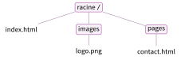
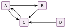

# Exercices

<p class="sous-titre">Le Web</p>

!!! consignes "Mode d’emploi"

    - Niveau : ★ échauffement, ★★ classique (niveau bac), ★★★ défi ; les *coups de pouce* et les *corrigés* se déplient sous chaque exercice.

    - <span class="tag">sur papier</span> *à faire sur papier* ; <span class="run" title="À programmer et tester sur machine">▶</span> *à réaliser sur un éditeur en ligne* (`jsfiddle.net` ou `codepen.io`).

    - Le **guide HTML & CSS** est autorisé pour tous les exercices.

    - Usage de l’IA, indiqué sur chaque exercice : <span class="ia ia-rouge" title="Sans IA : le but est l'automatisme lui-même"></span> aucune ; <span class="ia ia-orange" title="IA en appui : déboguer, reformuler, vérifier ; la réponse finale est la vôtre"></span> en appui (déboguer, reformuler, vérifier ; la réponse finale est écrite et comprise par vous) ; <span class="ia ia-vert" title="IA intégrée : l'exercice s'appuie sur une réponse d'IA"></span> l’exercice s’appuie sur une réponse d’IA. Voir la charte d’usage de l’IA.

### Le Web et Internet

### <span class="stars" title="Niveau 1 sur 3">★</span> <span class="exo-num">Exercice 1</span> — Vrai ou faux <span class="ia ia-rouge" title="Sans IA : le but est l'automatisme lui-même"></span> { #ex-04-1 }

<span class="tag">sur papier</span>  Répondre et corriger les phrases fausses.

1.  Le Web et Internet, c’est la même chose.

2.  Un e-mail est transporté par le Web.

3.  Le Web repose sur trois technologies : HTTP, les URL et le HTML.

4.  Le Web a été inventé par Tim Berners-Lee, au CERN.

??? corrige "Corrigé"

    1.  **Faux.** Internet est le *réseau* ; le Web est un *service* (les pages) qui circule dessus.

    2.  **Faux.** L’e-mail utilise le protocole SMTP, pas le Web.

    3.  **Vrai.** HTTP, URL et HTML.

    4.  **Vrai.** Tim Berners-Lee, au CERN, en 1989–1991.

### <span class="stars" title="Niveau 1 sur 3">★</span> <span class="exo-num">Exercice 2</span> — Web ou Internet ? <span class="ia ia-rouge" title="Sans IA : le but est l'automatisme lui-même"></span> { #ex-04-2 }

<span class="tag">sur papier</span>  Ranger dans deux colonnes ce qui relève du **Web** et ce qui relève d’**Internet** (mais pas du Web) : une page consultée dans un navigateur ; un e-mail ; un lien hypertexte ; un transfert de fichier par FTP ; le protocole HTTP.

??? corrige "Corrigé"

    - **Web** : une page consultée dans un navigateur ; un lien hypertexte ; le protocole HTTP.

    - **Internet (hors Web)** : un e-mail (SMTP) ; un transfert de fichier par FTP.

### L’URL et les chemins

### <span class="stars" title="Niveau 1 sur 3">★</span> <span class="exo-num">Exercice 3</span> — Décomposer une URL <span class="ia ia-rouge" title="Sans IA : le but est l'automatisme lui-même"></span> { #ex-04-3 }

<span class="tag">sur papier</span>  On considère l’URL : `https://www.lycee.mc/cours/snt/web.html`.

1.  Quel est le **protocole** ? Que garantit-il de plus que `http` ?

2.  Quel est le **nom du serveur** (domaine) ?

3.  Quel est le **chemin** du fichier demandé ?

??? corrige "Corrigé"

    1.  Protocole : `https`. Il **chiffre** les données échangées (connexion sécurisée, cadenas).

    2.  Nom du serveur (domaine) : `www.lycee.mc`.

    3.  Chemin du fichier : `/cours/snt/web.html`.

### <span class="stars" title="Niveau 2 sur 3">★★</span> <span class="exo-num">Exercice 4</span> — Chemins absolu et relatif <span class="ia ia-rouge" title="Sans IA : le but est l'automatisme lui-même"></span> { #ex-04-4 }

<span class="tag">sur papier</span>  On dispose de l’arborescence suivante (la racine est `/`) :

/ — dossier2 — fichier1.css  
dossier3 — fichier3.jpg  
fichier5.svg  
dossier4 — fichier6.html

1.  Donner le **chemin absolu** du fichier `fichier3.jpg`.

2.  Le fichier `fichier1.css` (dans `dossier2`) veut utiliser `fichier3.jpg`. Donner le **chemin relatif** correspondant.

3.  Depuis `dossier4`, donner le chemin relatif vers `fichier5.svg`.

??? pouce "Coup de pouce"

    Chemin absolu : on part de la racine `/` et on descend dossier par dossier. Chemin relatif : on part du dossier où se trouve le fichier qui fait le lien, sans `/` au début ; `..` fait remonter d’un niveau.

??? corrige "Corrigé"

    1.  Chemin absolu : `/dossier2/dossier3/fichier3.jpg`.

    2.  Chemin relatif depuis `dossier2` : `dossier3/fichier3.jpg` (pas de `/` au début).

    3.  Depuis `dossier4` : `../dossier2/dossier3/fichier5.svg` (on remonte à la racine avec `..`, puis on redescend).

### <span class="stars" title="Niveau 3 sur 3">★★★</span> <span class="exo-num">Exercice 5</span> — Le site déménage <span class="ia ia-rouge" title="Sans IA : le but est l'automatisme lui-même"></span> { #ex-04-5 }

<span class="tag">sur papier</span>  Le site d’un club est rangé ainsi : à la racine, le fichier `index.html` et deux dossiers, `images` (qui contient `logo.png`) et `pages` (qui contient `contact.html`).

1.  Dessiner l’arborescence de ce site.

2.  Dans `index.html`, le logo s’affiche avec ``. On copie cette ligne telle quelle dans `contact.html` : le logo ne s’affiche plus. Pourquoi ? Corriger le chemin.

3.  Écrire, dans `contact.html`, un lien qui ramène à `index.html`.

4.  On renomme le dossier `images` en `img`. Quels fichiers faut-il modifier, et comment ?

??? pouce "Coup de pouce"

    Un chemin relatif se lit à partir du dossier où se trouve la page qui l’utilise. Où se trouve `contact.html` ? Faut-il d’abord remonter ?

??? pouce "Coup de pouce 2 (début de solution)"

    Depuis le dossier `pages`, `..` ramène à la racine du site, où se trouvent `index.html` et le dossier `images`.

??? corrige "Corrigé"

    1.  Arborescence :

        { .tikz loading=lazy }

    2.  Un chemin relatif part du dossier de la page qui l’utilise. Depuis `pages`, `images/logo.png` désigne `pages/images/logo.png`, qui n’existe pas. Il faut d’abord **remonter** à la racine : ``.

    3.  `<a href="../index.html">Retour à l’accueil</a>`.

    4.  Il faut modifier **les deux pages** : dans `index.html`, `images/logo.png` devient `img/logo.png` ; dans `contact.html`, `../images/logo.png` devient `../img/logo.png`. *(Tout chemin qui passe par ce dossier doit être corrigé.)*

### Lire du HTML

### <span class="stars" title="Niveau 1 sur 3">★</span> <span class="exo-num">Exercice 6</span> — Que voit-on ? <span class="ia ia-rouge" title="Sans IA : le but est l'automatisme lui-même"></span> { #ex-04-6 }

<span class="tag">sur papier</span>  Décrire ce que le navigateur affiche pour ce code :

```html
<h1>Recette</h1>
<p>Il faut <strong>trois</strong> oeufs.</p>
<ul>
  <li>farine</li>
  <li>sucre</li>
</ul>
```

??? corrige "Corrigé"

    Un grand titre « Recette », puis le paragraphe « Il faut **trois** oeufs. » (le mot **trois** en gras), puis une liste à puces :

    - farine

    - sucre

### <span class="stars" title="Niveau 2 sur 3">★★</span> <span class="exo-num">Exercice 7</span> — Corriger les erreurs <span class="ia ia-rouge" title="Sans IA : le but est l'automatisme lui-même"></span> { #ex-04-7 }

<span class="tag">sur papier</span>  Ce code contient **deux** erreurs d’imbrication ou de fermeture. Les trouver et les corriger.

```html
<p>Bonjour <strong>tout le monde</p></strong>
<h2>Chapitre 1
```

??? pouce "Coup de pouce"

    Relisez les deux règles d’or des balises : toute balise ouverte est-elle refermée ? Laquelle a été ouverte en dernier ?

??? corrige "Corrigé"

    La balise `<strong>` est refermée trop tard (mauvaise imbrication), et le `<h2>` n’est pas fermé. Code corrigé :

    ```html
    <p>Bonjour <strong>tout le monde</strong></p>
    <h2>Chapitre 1</h2>
    ```

### <span class="stars" title="Niveau 2 sur 3">★★</span> <span class="exo-num">Exercice 8</span> — Du rendu au code <span class="ia ia-rouge" title="Sans IA : le but est l'automatisme lui-même"></span> { #ex-04-8 }

<span class="tag">sur papier</span>  Écrire le code HTML (contenu du `<body>` seulement) qui produit l’affichage suivant : un grand titre « Mon club de foot » ; un paragraphe « Entraînement le mercredi. » où le mot *mercredi* est mis en valeur (en gras) ; une liste à puces de deux éléments, « gardiens » et « joueurs » ; enfin un lien « Le site du club » vers `https://www.monclub.mc`.

??? pouce "Coup de pouce"

    Une balise par élément : `<h1>` pour le titre, `<p>` et `<strong>` pour le paragraphe, `<ul>` et `<li>` pour la liste, `<a href="...">` pour le lien.

??? corrige "Corrigé"

    Une solution :

    ```html
    <h1>Mon club de foot</h1>
    <p>Entrainement le <strong>mercredi</strong>.</p>
    <ul>
      <li>gardiens</li>
      <li>joueurs</li>
    </ul>
    <a href="https://www.monclub.mc">Le site du club</a>
    ```

### Écrire du HTML et du CSS

### <span class="stars" title="Niveau 2 sur 3">★★</span> <span class="exo-num">Exercice 9</span> — Ma page de présentation <span class="ia ia-orange" title="IA en appui : déboguer, reformuler, vérifier ; la réponse finale est la vôtre"></span> { #ex-04-9 }

<span class="run" title="À programmer et tester sur machine">▶</span>  Écrire une page HTML **complète** (squelette compris) qui contient : un titre `<h1>` avec votre prénom, un paragraphe de présentation, une **liste** de trois loisirs, et un **lien** vers un site de votre choix.

??? pouce "Coup de pouce"

    Partez du squelette du cours : `<head>` pour ce qui est invisible (titre de l’onglet), `<body>` pour tout ce qui s’affiche.

??? pouce "Coup de pouce 2 (début de solution)"

    `<!DOCTYPE html>`  
    `<html>`  
    `<head>`  
    `<meta charset="utf-8" />`  
    `<title>Ma page</title>`  
    `</head>`  
    `<body>` …

??? corrige "Corrigé"

    Une solution possible :

    ```html
    <!DOCTYPE html>
    <html>
      <head>
        <meta charset="utf-8" />
        <title>Ma page</title>
      </head>
      <body>
        <h1>Alex</h1>
        <p>Bonjour, je suis eleve de seconde au lycee.</p>
        <ul>
          <li>football</li>
          <li>guitare</li>
          <li>jeux video</li>
        </ul>
        <a href="https://www.gouv.mc">Un site que j'aime</a>
      </body>
    </html>
    ```

### <span class="stars" title="Niveau 2 sur 3">★★</span> <span class="exo-num">Exercice 10</span> — Un peu de style <span class="ia ia-orange" title="IA en appui : déboguer, reformuler, vérifier ; la réponse finale est la vôtre"></span> { #ex-04-10 }

<span class="run" title="À programmer et tester sur machine">▶</span>  Reprendre la page précédente et ajouter du CSS pour : centrer le titre et lui donner un fond coloré ; mettre les paragraphes dans la police `Verdana` ; colorer en gris, *via* un `id`, la seule ligne de signature.

??? pouce "Coup de pouce"

    Une règle CSS : un sélecteur, puis des propriétés entre accolades (`text-align`, `background-color`, `font-family`, `color`). Pour la signature : donnez-lui un `id` dans le HTML, puis ciblez-le en CSS avec `#`.

??? corrige "Corrigé"

    On ajoute (par exemple un `id="signature"` sur le dernier paragraphe) :

    ```css
    h1 {
      text-align: center;
      background-color: teal;
      color: white;
    }
    p {
      font-family: Verdana;
    }
    #signature {
      color: gray;
    }
    ```

### <span class="stars" title="Niveau 2 sur 3">★★</span> <span class="exo-num">Exercice 11</span> — Le bon sélecteur <span class="ia ia-rouge" title="Sans IA : le but est l'automatisme lui-même"></span> { #ex-04-11 }

<span class="tag">sur papier</span>  On considère le code suivant :

```html
<h1 id="haut">Horaires</h1>
<p class="info">Ouvert du lundi au vendredi.</p>
<p>Ferme le dimanche.</p>
<p class="info" id="fin">Contact : 93 00 00 00</p>
```

```css
p { font-family: Verdana; }
.info { color: green; }
#fin { text-align: right; }
```

1.  Quels éléments sont écrits en Verdana ? Lesquels sont en vert ? Lequel est aligné à droite ?

2.  Écrire une règle CSS qui met **uniquement** le titre en bleu, de deux façons différentes.

??? pouce "Coup de pouce"

    Pour chaque règle, lisez le sélecteur : `p` vise une balise, `.info` une classe (le point), `#fin` un identifiant (le dièse). Cherchez ensuite les éléments concernés dans le HTML.

??? corrige "Corrigé"

    1.  **Verdana** : les **trois paragraphes** `<p>` (pas le titre `<h1>`). **En vert** : les deux éléments de classe `info`, c’est-à-dire « Ouvert du lundi au vendredi. » et « Contact : 93 00 00 00 ». **Aligné à droite** : seulement l’élément d’identifiant `fin`, « Contact : 93 00 00 00 » (qui est donc à la fois en Verdana, en vert et à droite).

    2.  Par la balise (il n’y a qu’un `<h1>`) ou par son identifiant :

        ```css
        h1 { color: blue; }
        #haut { color: blue; }
        ```

### <span class="stars" title="Niveau 2 sur 3">★★</span> <span class="exo-num">Exercice 12</span> — Prévoir le rendu <span class="ia ia-orange" title="IA en appui : déboguer, reformuler, vérifier ; la réponse finale est la vôtre"></span> { #ex-04-12 }

<span class="tag">sur papier</span>  Sans machine, décrire précisément le rendu (couleurs, alignement, style) de :

```html
<h1 class="titre">Actualites</h1>
<p class="titre">Bienvenue</p>
```

```css
.titre {
  text-align: center;
  color: darkblue;
}
```

??? pouce "Coup de pouce"

    Quels éléments du code HTML portent la classe `titre` ? La règle `.titre` s’applique à chacun d’eux.

??? corrige "Corrigé"

    La classe `.titre` cible *à la fois* le `<h1>` et le `<p>` (ils ont tous deux `class="titre"`). Les deux seront donc **centrés** et écrits en **bleu foncé**. Le `<h1>` reste un grand titre (gras), le `<p>` un paragraphe de taille normale.

### La requête HTTP, client et serveur

### <span class="stars" title="Niveau 2 sur 3">★★</span> <span class="exo-num">Exercice 13</span> — Décomposer une requête <span class="ia ia-rouge" title="Sans IA : le but est l'automatisme lui-même"></span> { #ex-04-13 }

<span class="tag">sur papier</span>  On tape dans le navigateur l’adresse : `https://www.meteo.mc/prevoir?ville=Nice&jour=mardi`.

1.  Quelle **ressource** est demandée au serveur (avant le `?`) ?

2.  Combien de **paramètres** sont passés au serveur ? Donner le **nom** et la **valeur** de chacun.

3.  Que signifie la méthode `GET` d’une requête HTTP ?

??? pouce "Coup de pouce"

    Tout ce qui suit le `?` est formé de paramètres `nom=valeur`, séparés par `&`.

??? corrige "Corrigé"

    1.  Ressource demandée : `/prevoir`.

    2.  **Deux** paramètres : `ville` vaut `Nice` ; `jour` vaut `mardi`.

    3.  `GET` signifie « *donne-moi* cette ressource ».

### <span class="stars" title="Niveau 1 sur 3">★</span> <span class="exo-num">Exercice 14</span> — Réussite ou échec ? <span class="ia ia-rouge" title="Sans IA : le but est l'automatisme lui-même"></span> { #ex-04-14 }

<span class="tag">sur papier</span>  Associer chaque **code de réponse HTTP** à sa signification :

|         |         |         |         |
|:--------|:--------|:--------|:--------|
| **200** | **403** | **404** | **500** |

*Significations :* page non trouvée $\bullet$ tout va bien $\bullet$ erreur du serveur $\bullet$ accès interdit.

??? corrige "Corrigé"

    **200** $=$ tout va bien ; **403** $=$ accès interdit ; **404** $=$ page non trouvée ; **500** $=$ erreur du serveur.

### <span class="stars" title="Niveau 2 sur 3">★★</span> <span class="exo-num">Exercice 15</span> — Client ou serveur ? <span class="ia ia-orange" title="IA en appui : déboguer, reformuler, vérifier ; la réponse finale est la vôtre"></span> { #ex-04-15 }

<span class="tag">sur papier</span> 

1.  Un langage s’exécute *dans le navigateur* pour animer la page : lequel, **JavaScript** ou **PHP** ?

2.  Comment fait-on, dans un navigateur, pour **voir le code source** d’une page reçue ?

3.  « Le serveur construit une page différente selon les paramètres reçus. » Comment appelle-t-on une telle page ?

??? pouce "Coup de pouce"

    Relisez l’encadré « Deux endroits où ça calcule » du cours : que fait le serveur, que fait le navigateur ?

??? corrige "Corrigé"

    1.  **JavaScript** s’exécute dans le navigateur (côté client) ; PHP, lui, tourne côté serveur.

    2.  Par un **clic droit $\to$ « Afficher le code source »** (ou les outils de développement).

    3.  Une page **dynamique** (construite sur mesure par le serveur).

### <span class="stars" title="Niveau 2 sur 3">★★</span> <span class="exo-num">Exercice 16</span> — Suivre une requête <span class="ia ia-rouge" title="Sans IA : le but est l'automatisme lui-même"></span> { #ex-04-16 }

<span class="tag">sur papier</span>  Vous tapez `https://www.lycee.mc/cours.html` dans la barre d’adresse. Remettre les étapes suivantes dans l’ordre :

1.  Le navigateur affiche la page.

2.  Le serveur trouve le fichier `cours.html` et renvoie une réponse avec le code `200`.

3.  Le navigateur demande au DNS l’adresse IP du serveur `www.lycee.mc`.

4.  Le navigateur envoie au serveur la requête `GET /cours.html`.

Puis : quel code le serveur aurait-il renvoyé si le fichier `cours.html` n’existait pas ?

??? pouce "Coup de pouce"

    Avant de pouvoir écrire à un serveur, il faut connaître son adresse. Ensuite, c’est toujours le client qui parle le premier.

??? corrige "Corrigé"

    Ordre : **C** (le DNS donne l’adresse IP du serveur), **D** (le navigateur envoie la requête `GET /cours.html`), **B** (le serveur répond, code `200`), **A** (le navigateur affiche la page). Si le fichier n’existait pas, le serveur aurait renvoyé le code **404** (page non trouvée).

### <span class="stars" title="Niveau 3 sur 3">★★★</span> <span class="exo-num">Exercice 17</span> — Le formulaire de recherche <span class="ia ia-rouge" title="Sans IA : le but est l'automatisme lui-même"></span> { #ex-04-17 }

<span class="tag">sur papier</span>  Sur le site d’une médiathèque, on cherche « Harry Potter » au format « livre ». Après validation du formulaire, la barre d’adresse affiche (le `+` remplace l’espace) :

`https://www.mediatheque.mc/chercher?titre=Harry+Potter&format=livre`

1.  Quelle ressource est demandée ? Quels paramètres sont passés, avec quelles valeurs ?

2.  Écrire l’adresse obtenue si l’on cherche « Astérix » au format « BD ».

3.  La page de résultats est-elle une page toute prête ou une page dynamique ? Justifier.

4.  Pourquoi un site ne doit-il jamais transmettre un mot de passe de cette façon ?

??? pouce "Coup de pouce"

    Repérez le `?` et le `&` pour découper l’adresse. Pour la question 4 : où s’affichent les paramètres, et où restent-ils enregistrés ensuite ?

??? pouce "Coup de pouce 2 (début de solution)"

    Seules les valeurs changent : `titre=...` et `format=...`. Le serveur peut-il avoir préparé à l’avance une page pour chaque titre possible ?

??? corrige "Corrigé"

    1.  Ressource demandée : `/chercher`. **Deux** paramètres : `titre` vaut `Harry Potter` (écrit `Harry+Potter`) ; `format` vaut `livre`.

    2.  `https://www.mediatheque.mc/chercher?titre=Asterix&format=BD` (on garde l’accent si le site l’accepte : `Astérix`).

    3.  Une page **dynamique** : le serveur ne peut pas avoir préparé à l’avance une page pour chaque titre possible ; il **construit** la liste des résultats d’après les paramètres reçus.

    4.  Les paramètres apparaissent **en clair dans la barre d’adresse** (quelqu’un peut les lire par-dessus l’épaule) et restent enregistrés dans l’**historique** du navigateur et dans les marque-pages. Un mot de passe ne doit jamais être visible ainsi.

### Droit d’auteur et sécurité

### <span class="stars" title="Niveau 2 sur 3">★★</span> <span class="exo-num">Exercice 18</span> — Ai-je le droit ? <span class="ia ia-orange" title="IA en appui : déboguer, reformuler, vérifier ; la réponse finale est la vôtre"></span> { #ex-04-18 }

<span class="tag">sur papier</span> 

1.  Vous trouvez une belle photo sur le Web et voulez la publier sur le site du lycée. Est-ce automatiquement autorisé ? Pourquoi ?

2.  Qu’est-ce qu’une **licence** ? Que permet une licence **Creative Commons** ?

3.  « Un fichier se copie gratuitement, donc il n’a aucune valeur. » Discuter cette phrase en une ou deux phrases.

??? pouce "Coup de pouce"

    Relisez la section « À qui appartient une page ? » : qui décide de l’usage d’une œuvre, et comment l’auteur peut-il autoriser certains usages à l’avance ?

??? corrige "Corrigé"

    1.  **Non** : toute création est protégée par le **droit d’auteur**. La réutiliser exige l’autorisation de l’auteur (ou une licence adaptée).

    2.  Une **licence** fixe le **droit d’usage** d’une œuvre. Une licence **Creative Commons** autorise d’avance certains usages (copier, parfois modifier/diffuser), souvent à condition de **citer l’auteur**.

    3.  Faux : un fichier se copie pour presque rien, mais il garde une **valeur** (travail fourni, usage, valeur commerciale). *Copiable* $\neq$ *sans valeur*.

### <span class="stars" title="Niveau 1 sur 3">★</span> <span class="exo-num">Exercice 19</span> — Régler et sécuriser son navigateur <span class="ia ia-orange" title="IA en appui : déboguer, reformuler, vérifier ; la réponse finale est la vôtre"></span> { #ex-04-19 }

<span class="tag">sur papier</span> 

1.  Citer trois réglages de sécurité/confidentialité que l’on peut modifier dans un navigateur.

2.  Qu’est-ce que l’**hameçonnage** (*phishing*) ?

3.  Avant de cliquer sur un lien reçu par message, quel **geste simple** permet de vérifier vers quelle adresse il mène réellement ?

??? corrige "Corrigé"

    1.  Par exemple : refuser les cookies (tiers), effacer l’historique / navigation privée, gérer les autorisations (caméra, micro, position), bloquer les traceurs.

    2.  L’**hameçonnage** : une fausse page imitant un vrai site pour voler vos identifiants.

    3.  **Survoler** le lien (sans cliquer) pour lire la *vraie* URL de destination et vérifier le nom de domaine.

### Trouver une page

### <span class="stars" title="Niveau 1 sur 3">★</span> <span class="exo-num">Exercice 20</span> — Le moteur de recherche <span class="ia ia-orange" title="IA en appui : déboguer, reformuler, vérifier ; la réponse finale est la vôtre"></span> { #ex-04-20 }

<span class="tag">sur papier</span> 

1.  Qu’est-ce que l’**index** d’un moteur de recherche ? Quand vous tapez une requête, le moteur cherche-t-il « dans le Web » ou « dans son index » ?

2.  Citer un critère qui aide un moteur à **classer** les pages (par exemple le PageRank).

3.  Comment reconnaît-on, en haut d’une page de résultats, ce qui est une **publicité** ?

??? corrige "Corrigé"

    1.  L’**index** est l’immense répertoire des pages déjà explorées par les robots. Le moteur cherche **dans son index** (déjà prêt), pas « dans le Web » en direct.

    2.  Le **PageRank** : une page est jugée importante si beaucoup d’autres pages importantes pointent vers elle. (On accepte aussi : présence des mots-clés, langue, localisation.)

    3.  Les publicités sont signalées par une mention du type « **Annonce** » (ou *Sponsorisé*) et apparaissent souvent tout en haut.

### <span class="stars" title="Niveau 3 sur 3">★★★</span> <span class="exo-num">Exercice 21</span> — Le graphe des liens <span class="ia ia-rouge" title="Sans IA : le but est l'automatisme lui-même"></span> { #ex-04-21 }

<span class="tag">sur papier</span>  Quatre pages A, B, C et D se font des liens (une flèche de A vers B signifie : « la page A contient un lien vers la page B ») :

{ .tikz loading=lazy }

1.  Pour chaque page, compter le nombre de liens qui pointent **vers** elle.

2.  D’après l’idée du PageRank, quelle page sera jugée la plus importante ?

3.  A et B reçoivent chacune un seul lien. Laquelle des deux devrait être mieux classée ? Justifier.

4.  Un site crée des centaines de fausses pages qui pointent toutes vers lui. Que cherche-t-il à faire ? Pourquoi les moteurs de recherche luttent-ils contre cela ?

??? pouce "Coup de pouce"

    Relisez la règle du cours : une page est importante si *beaucoup* d’autres pages *importantes* pointent vers elle. Il y a donc deux choses à regarder : le nombre de liens reçus, et l’importance de la page qui envoie le lien.

??? pouce "Coup de pouce 2 (début de solution)"

    Liens reçus : A en reçoit un (de C), B un (de A). Qui, de C ou de A, est la page la plus importante du graphe ?

??? corrige "Corrigé"

    1.  Liens reçus : A en reçoit **1** (de C) ; B en reçoit **1** (de A) ; C en reçoit **3** (de A, B et D) ; D n’en reçoit **aucun**.

    2.  **C**, qui reçoit le plus de liens.

    3.  **A** : son unique lien vient de C, la page la plus importante du graphe, alors que celui de B vient de A, moins importante. Selon l’idée du PageRank, un lien « compte » plus quand il vient d’une page importante.

    4.  Il cherche à **tricher** pour remonter artificiellement dans le classement (et attirer plus de visiteurs, donc plus d’argent). Les moteurs luttent contre cela pour que les premiers résultats restent **pertinents** pour l’utilisateur : ils repèrent les fausses pages et pénalisent les sites qui les utilisent.

### Critiquer une réponse d’IA

### <span class="stars" title="Niveau 2 sur 3">★★</span> <span class="exo-num">Exercice 22</span> — Le cadenas rend-il anonyme ? <span class="ia ia-vert" title="IA intégrée : l'exercice s'appuie sur une réponse d'IA"></span> { #ex-04-22 }

<span class="tag">sur papier</span>  Un élève a demandé à un assistant d’IA : « Quand je vois le cadenas HTTPS, est-ce que je suis anonyme sur le site ? » Voici la réponse obtenue :

> Le cadenas signifie que le site utilise HTTPS, la version sécurisée de HTTP : les données échangées entre votre navigateur et le serveur sont chiffrées. Personne ne peut donc lire au passage votre mot de passe ou votre numéro de carte, ce qui est indispensable avant de les saisir. Et comme la connexion est chiffrée, le site ne peut pas vous suivre : avec HTTPS, les cookies sont désactivés et votre navigation est totalement anonyme. Le cadenas ne garantit pas, en revanche, que le site est honnête : une page d’hameçonnage peut très bien être en HTTPS.

1.  La réponse est-elle correcte ? Relire la section « Sécurité et confidentialité » du cours et comparer phrase par phrase.

2.  Localiser et corriger l’erreur.

    ??? pouce "Coup de pouce"

        Relisez l’encadré du cours sur les cookies et les traces de navigation : que dit-il de l’anonymat ?

3.  Quelle vérification simple, faite *avant* de faire confiance à cette réponse, aurait suffi à détecter l’erreur ?

??? corrige "Corrigé"

    1.  Non. Le début est juste (HTTPS chiffre les échanges, indispensable avant de saisir un mot de passe) et la fin aussi (un site d’hameçonnage peut être en HTTPS). Mais le cours dit exactement le contraire du milieu : « Naviguer n’est jamais tout à fait anonyme » et « chaque visite laisse des traces : historique, adresse IP, cookies ».

    2.  L’erreur : « avec HTTPS, les cookies sont désactivés et votre navigation est totalement anonyme ». HTTPS protège le **contenu** des échanges contre une lecture en chemin, rien de plus : le site (et ses cookies) sait très bien qui vous êtes et ce que vous y faites, et votre adresse IP reste visible. Correction : « le cadenas ne rend pas anonyme ; pour limiter le suivi, il faut régler les cookies ou utiliser la navigation privée ».

    3.  Ouvrir un site en HTTPS où l’on est resté connecté (le portail du lycée, une boutique) : il vous reconnaît malgré le cadenas, donc il n’y a pas d’anonymat. Ou, plus simplement, relire l’encadré « Cookies et traces » du cours avant de croire l’assistant.
