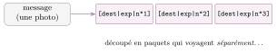
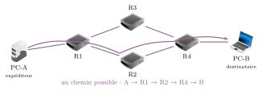
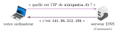
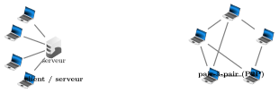

# Cours

Internet

|  |  |
|:---|:---|
| **Programme** | Repères historiques ; protocole **TCP/IP** (paquets, routage) ; adresses symboliques et serveurs **DNS** ; réseaux **pair-à-pair** ; indépendance d’internet vis-à-vis du réseau physique ; ordres de grandeur du trafic. |
| **Idée** | Internet, c’est le **réseau** : des millions de machines qui s’échangent des **paquets** de données, de proche en proche, sans chef d’orchestre central. Une idée simple, robuste… et devenue vitale. |
| **Objectifs** | Situer la naissance d’internet ; distinguer les rôles d’**IP** et de **TCP** ; comprendre le **routage** des paquets et ses limites ; passer d’une adresse symbolique à une adresse **IP** (DNS) ; connaître les grands types de réseaux physiques et l’ordre de grandeur du trafic. |

!!! remarque "Remarque"

    **Internet n’est pas le Web !** On l’a vu au chapitre précédent : **internet** est le *réseau* (les câbles, la fibre, les ondes, les machines) ; le **Web** n’est que *l’un des services* qui circulent dessus, à côté des e-mails, des appels vidéo, des jeux en ligne… Ce chapitre ouvre la boîte : *comment* l’information voyage-t-elle d’un bout à l’autre du monde ?

## Une belle histoire : d’ARPANET à internet

### Le premier message : « LO…»

Nous sommes le **29 octobre 1969**. Dans un laboratoire de l’université de Californie (UCLA), un étudiant, **Charley Kline**, tente d’envoyer le tout premier message d’un ordinateur à un autre, situé à **560 km** de là, à Stanford. Le mot à transmettre pour se connecter était simple : `LOGIN`. Il tape `L`… `O`… et au moment du `G`, la machine distante **plante** ! Le tout premier message de l’histoire d’internet fut donc simplement **« `LO` »** — comme dans l’expression anglaise « *lo and behold* » (« et voilà »).

Une heure plus tard, après réparation, `LOGIN` passait en entier. Le réseau **ARPANET** était né : l’ancêtre direct d’internet.

\*(image manquante : 06_hist_imp_log)\*  
Le cahier de bord du 29 octobre 1969 : « LO »

\*(image manquante : 06_hist_arpanet_1969)\*  
ARPANET en 1969 : quatre ordinateurs reliés

\*(image manquante : 06_hist_vint_cerf)\*  
Vinton Cerf, co-inventeur de TCP/IP

### Les grandes étapes

!!! regle "Règle 1 — Repères historiques"

    - **années 1950–60** — premiers réseaux d’ordinateurs, mais *propriétaires* (liés à un constructeur ou à l’opérateur téléphonique).

    - **1969** — premier message sur **ARPANET** (le fameux « `LO` »), aux États-Unis ; en **1971**, la France lance son propre réseau, **Cyclades**.

    - **1974** — **Vinton Cerf** et **Robert Kahn** inventent le protocole **TCP/IP**, la « langue commune » qui reliera *tous* les réseaux.

    - **1983** — tous les réseaux basculent sur TCP/IP : c’est la **naissance d’internet**. La même année apparaît le **DNS** (les adresses en toutes lettres).

    - **1990–91** — Tim Berners-Lee invente le **Web**, *par-dessus* internet.

    - **aujourd’hui** — des **milliards** de machines et d’objets connectés.

    Sources des repères : UCLA (laboratoire de L. Kleinrock) pour le premier message ; Inria pour Cyclades ; V. Cerf et R. Kahn, *IEEE Transactions on Communications*, 1974, pour TCP/IP.

!!! remarque "Remarque"

    Détail crucial : personne ne « possède » internet. Il n’a **pas de centre**, pas de chef. C’est justement ce qui le rend si **robuste** : si une partie tombe en panne, l’information trouve un autre chemin. Cette idée, née en pleine Guerre froide, était même un but militaire : un réseau qui *survit* à la destruction d’une partie de ses nœuds.

▶ Exercices d'application : exercices **[1](exercices.md#ex-06-1) et [2](exercices.md#ex-06-2)** (un peu d’histoire : d’ARPANET à internet)

## Voyager en petits morceaux : les paquets

Quand vous envoyez une photo, elle ne part pas d’un seul bloc. Internet la **découpe** en petits morceaux de taille fixe : les **paquets**.

!!! definition "Définition 1"

    Un **paquet** est un petit bloc de données de taille fixe. Il contient une partie du message, plus une « étiquette » : l’**adresse de l’expéditeur**, l’**adresse du destinataire**, et un **numéro** (pour remettre les morceaux dans l’ordre à l’arrivée).

{ .tikz loading=lazy }

!!! regle "Règle 2 — Une force du système"

    Le format des paquets est **uniforme** : peu importe qu’ils transportent du texte, une image, du son ou une vidéo. Chaque paquet peut même emprunter un **chemin différent** ! Ils seront **réassemblés dans l’ordre** à l’arrivée grâce à leur numéro.

▶ Exercices d'application : exercices **[3](exercices.md#ex-06-3) à [5](exercices.md#ex-06-5)** (les paquets)

## Deux protocoles complémentaires : IP et TCP

Pour que tout cela fonctionne, les machines parlent la même « langue » : le protocole **TCP/IP**. En réalité, ce sont **deux** protocoles qui se partagent le travail.

| **Protocole** | **Son rôle** |
|:---|:---|
| **IP** *(Internet Protocol)* | **adresser** et **acheminer** chaque paquet : donner une adresse à chaque machine et faire avancer les paquets de routeur en routeur. |
| **TCP** *(Transmission Control Protocol)* | **fiabiliser** la communication : vérifier que *tous* les paquets arrivent, **redemander** ceux qui manquent, et les **remettre dans l’ordre**. |

!!! regle "Règle 3 — Fiable, mais pas « à l’heure »"

    TCP garantit que tout paquet **finira** par arriver (sauf panne matérielle). En revanche, ni IP ni TCP ne garantissent *quand* : il n’y a **aucune garantie de temps**. C’est pourquoi une vidéo en direct peut « saccader » : on préfère perdre une image que de bloquer tout le film.

▶ Exercices d'application : exercices **[6](exercices.md#ex-06-6) et [7](exercices.md#ex-06-7)** (IP et TCP)

## L’algorithme-roi : le routage

Comment un paquet trouve-t-il son chemin ? Grâce à des machines spécialisées, les **routeurs**.

!!! definition "Définition 2"

    Un **routeur** est un ordinateur qui **aiguille** les paquets. Il ne connaît pas tout le réseau : il tient seulement une **carte locale** de ses voisins, et décide, pour chaque paquet, **la prochaine étape**. De proche en proche, le paquet progresse jusqu’à destination.

{ .tikz loading=lazy }

!!! regle "Règle 4 — Les limites du routage"

    Un paquet peut se **perdre** : panne d’un routeur, ou **destruction volontaire**. En effet, chaque paquet possède un compteur, le **nombre maximal de routeurs** qu’il peut traverser (le *TTL*). À chaque étape, le compteur diminue ; s’il atteint **0**, le paquet est **détruit** pour ne pas tourner en rond éternellement et encombrer le réseau. C’est alors **TCP** qui s’en aperçoit et **redemande** le paquet manquant.

!!! activite "Activité — Le routage débranché"

    En classe, chaque élève joue un **routeur** et ne connaît que ses **voisins directs**. Un « paquet » (un papier avec un destinataire) doit traverser la salle de main en main. On observe : il n’existe **aucune carte globale**, et pourtant le paquet arrive. On « détruit » un routeur (un élève s’assoit) : le paquet trouve un **autre chemin**.

▶ Exercices d'application : exercices **[8](exercices.md#ex-06-8) à [10](exercices.md#ex-06-10)** (le routage ; le compteur TTL)

## Les adresses : IP et DNS

### L’adresse IP

!!! definition "Définition 3"

    Chaque machine connectée possède une **adresse IP** : son « numéro » sur le réseau. En version **IPv4**, c’est une suite de **quatre nombres** de **0 à 255**, séparés par des points.

{ .tikz loading=lazy }

Il y a environ **4 milliards** d’adresses IPv4 possibles… ce qui ne suffit plus ! On déploie donc **IPv6**, avec des adresses bien plus longues (assez pour des milliards de milliards d’objets connectés).

### Le DNS : l’annuaire d’internet

 Personne ne retient `172.217.22.14`. On tape `google.fr`. Le passage de l’un à l’autre est assuré par le **DNS**.

!!! definition "Définition 4"

    Une **adresse symbolique** (comme `wikipedia.fr`) est l’adresse « en toutes lettres », facile à retenir. Le **DNS** (*Domain Name System*) est l’annuaire géant d’internet qui **traduit** une adresse symbolique en **adresse IP** numérique.

{ .tikz loading=lazy }

Le DNS n’est pas une seule machine, mais un **immense ensemble d’ordinateurs** répartis dans le monde et sans cesse mis à jour.

!!! activite "Activité — Retrouver une adresse IP"

    Dans un terminal, taper `ping wikipedia.fr` (ou `nslookup wikipedia.fr`) : on voit apparaître l’**adresse IP** correspondant au nom (le 28/09/2026, on obtenait par exemple `141.94.212.184`). Ce résultat peut **varier dans le temps et selon le lieu** : noter l’adresse effectivement obtenue. Refaire avec le site du lycée. Deux noms différents peuvent-ils mener à la même IP ?

▶ Exercices d'application : exercices **[11](exercices.md#ex-06-11) à [15](exercices.md#ex-06-15)** (adresses IP et DNS)

## Internet est indépendant du réseau physique

Point fort de génie : TCP/IP est **logiciel**. Il ne vit pas dans les câbles, mais **dans chaque machine**. Du coup, internet peut circuler sur **n’importe quel** support physique.

| **Réseau physique** | **Filaire ?** | **Débit** | **Usage** |
|:---|:--:|:--:|:---|
| Fibre optique | filaire | très élevé | épine dorsale d’internet, box récentes |
| Ethernet (câble RJ45) | filaire | élevé | réseau local (salle info) |
| ADSL (ligne téléphone) | filaire | faible/moyen | ancien accès internet, en voie d’obsolescence |
| Wi-Fi | sans fil | moyen/élevé | à la maison, au lycée, portée courte |
| 4G / 5G | sans fil | élevé | téléphone mobile, grande portée |
| Bluetooth | sans fil | faible | entre appareils proches (écouteurs…) |

Grâce à cette indépendance, votre téléphone passe **sans coupure** de la 4G au Wi-Fi, ou d’antenne en antenne quand vous voyagez.

## Les réseaux pair-à-pair (P2P)

D’habitude, un **serveur** central distribue à des **clients** (le modèle du Web). Mais il existe une autre organisation :

!!! definition "Définition 5"

    Dans un réseau **pair-à-pair** (*peer-to-peer*, P2P), il n’y a plus de serveur central : **chaque machine est à la fois émetteur et récepteur**, et partage directement avec les autres.

{ .tikz loading=lazy }

!!! regle "Règle 5 — Intérêts… et dérives"

    **Intérêt** : très **robuste** (pas de point unique de panne) et efficace pour **partager de gros fichiers** (chacun aide à distribuer) ; utilisé pour la visioconférence, certaines mises à jour, la blockchain… **Dérive** : le P2P sert aussi au **téléchargement illégal** d’œuvres protégées (musique, films) : un **usage illicite**, puni par la loi.

▶ Exercices d'application : exercices **[16](exercices.md#ex-06-16) à [19](exercices.md#ex-06-19)** (réseaux physiques ; pair-à-pair ; ordres de grandeur)

## Ordres de grandeur : le trafic explose

Internet a fait disparaître le télégramme, le télex, une partie du courrier postal, et bientôt le téléphone fixe (remplacé par la **voix sur IP**). Le volume de données échangées est **vertigineux**.

| **Année** | **Trafic mondial (ordre de grandeur, par an)** |
|:--:|:--:|
| 2010 | $\sim 0{,}2$ Zo (Cisco, 2011) |
| 2016 | $\sim 1$ Zo (Cisco, 2017) |
| 2021 | $\sim 3{,}3$ Zo ($3{,}3 \times 10^{21}$ octets ; prévision Cisco, 2017) |
| 2024 | $\sim 7$ Zo (estimation UIT, 2024) |

Ces valeurs viennent d’organismes différents, qui ne mesurent pas exactement la même chose : on compare des **ordres de grandeur**. Pour 2024, l’UIT estime environ 6 Zo sur les réseaux fixes et 1,3 Zo sur les réseaux mobiles.

Rappel des unités : 1 **ko** $=10^3$ o, 1 **Mo** $=10^6$, 1 **Go** $=10^9$, 1 **To** $=10^{12}$, 1 **Po** $=10^{15}$, 1 **Eo** $=10^{18}$, 1 **Zo** (zetta-octet) $=10^{21}$ octets.

!!! regle "Règle 6 — Deux enjeux de société"

    **Le déni de service (attaque DDoS)** : saturer un site de messages pour le rendre indisponible.  
    **La neutralité du Net** : le principe, présent dès l’origine, selon lequel les routeurs transmettent **tous** les paquets de la même façon, *sans* favoriser un contenu ou un service. Elle est régulièrement remise en cause par des intérêts commerciaux.

!!! remarque "Remarque — Liens avec d’autres chapitres"

    Internet est le socle de presque tous les thèmes de SNT. Le **Web** n’est qu’un de ses services : une requête HTTP part en paquets TCP/IP, après une question au **DNS**. Les **objets connectés** reçoivent eux aussi une adresse IP, d’où le besoin d’**IPv6**. Un réseau de routeurs se représente par un **graphe** (routeurs = sommets, liaisons = arêtes), comme le réseau routier du chapitre *Localisation* ou les amitiés d’un **réseau social**. En spécialité NSI de Première, on étudie de plus près les protocoles qui fiabilisent la transmission, comme le **protocole du bit alterné**.

## Bilan — la carte mémoire

| **Notion** | **À retenir** |
|:---|:---|
| Internet $\neq$ Web | internet $=$ le réseau ; le Web $=$ un service qui roule dessus. |
| Histoire | ARPANET 1969 (« LO »), Cyclades 1971, TCP/IP 1974, internet né en 1983. |
| Paquet | petit bloc : données + adresse expéditeur + destinataire + numéro. |
| IP | **adresse** et **achemine** les paquets (adresse IPv4 : 4 nombres 0–255). |
| TCP | **fiabilise** : redemande les paquets perdus, les remet dans l’ordre. |
| Pas de garantie de temps | fiable mais pas « à l’heure » $\to$ le streaming peut saccader. |
| Routeur / routage | aiguille chaque paquet *une étape* à la fois, sans carte globale. |
| TTL | nombre max de routeurs ; à 0, le paquet est détruit (TCP le redemande). |
| DNS | annuaire : adresse symbolique (`wikipedia.fr`) $\to$ adresse IP. |
| Réseau physique | indépendant : fibre, Ethernet, Wi-Fi, 4G/5G, ADSL, Bluetooth. |
| Pair-à-pair (P2P) | pas de serveur central ; robuste ; aussi usages illicites. |
| Trafic | ordres de grandeur : en zetta-octets/an ($10^{21}$) ; neutralité du Net. |

!!! encadre "Débat argumenté"

    Une **fiche débat** accompagne ce thème : « Les fournisseurs d’accès doivent-ils traiter tous les paquets de la même façon ? » (documents, rôles, tableau d’arguments et trace écrite, environ 50 min).

## Savoir-faire à maîtriser

*À la fin du chapitre, je sais…*

!!! autopos "Savoir-faire : je me positionne"

    - raconter en quelques mots l’histoire d’Internet (d’**ARPANET** à Internet) ;

    - expliquer la **commutation par paquets** ;

    - distinguer les rôles des protocoles **IP** et **TCP** ;

    - expliquer le principe du **routage** (un paquet passe de routeur en routeur) ;

    - distinguer une **adresse IP** d’un **nom de domaine** et expliquer le rôle du **DNS** ;

    - expliquer qu’Internet est **indépendant** du support physique ;

    - décrire un réseau **pair-à-pair** (P2P) et un de ses usages.

## Sources

- UCLA, Samueli School of Engineering, pages sur le premier message d’ARPANET (29 octobre 1969, laboratoire de Leonard Kleinrock).

- Inria, pages historiques consacrées au réseau Cyclades (projet lancé en 1971). `inria.fr`

- V. Cerf et R. Kahn, « A Protocol for Packet Network Intercommunication », *IEEE Transactions on Communications*, mai 1974.

- Cisco, *Visual Networking Index (VNI) – Forecast and Methodology*, éditions 2011 (trafic 2010) et 2017 (trafic 2016, prévision 2021).

- UIT (Union internationale des télécommunications), *Measuring digital development – Facts and Figures 2024*, novembre 2024 : trafic fixe $\approx 6$ Zo, mobile $\approx 1{,}3$ Zo (estimations). `itu.int`

*Crédits : icônes issues du logiciel libre Filius (licence GNU GPL v2 ou v3), `www.lernsoftware-filius.de`.*
