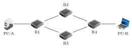
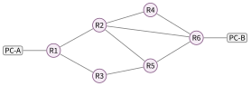

# Exercices

Internet

!!! consignes "Mode d’emploi"

    - Niveau : ★ échauffement, ★★ classique (niveau bac), ★★★ défi ; les *coups de pouce* et les *corrigés* se déplient sous chaque exercice.

    - sur papier *à faire sur papier* ; ▶ *à faire sur machine* (terminal, navigateur).

    - Un **TP sur le simulateur Filius** accompagne cette feuille (fiche séparée).

    - Usage de l’IA, indiqué sur chaque exercice :  aucune ;  en appui (déboguer, reformuler, vérifier ; la réponse finale est écrite et comprise par vous) ;  l’exercice s’appuie sur une réponse d’IA. Voir la charte d’usage de l’IA.

### Un peu d’histoire

### ★ Exercice 1 — Remettre dans l’ordre  { #ex-06-1 }

sur papier  Ranger ces événements du plus ancien au plus récent, avec leur date : *invention du Web* $\bullet$ *premier message sur ARPANET* $\bullet$ *naissance d’internet (bascule TCP/IP)* $\bullet$ *invention du protocole TCP/IP*.

??? corrige "Corrigé"

    \; premier message ARPANET (**1969**) $\to$ protocole TCP/IP (**1974**) $\to$ naissance d’internet, bascule TCP/IP (**1983**) $\to$ invention du Web (**1990–91**).

### ★ Exercice 2 — « LO…»  { #ex-06-2 }

sur papier  En 1969, quel mot voulait-on transmettre pour le premier message d’ARPANET ? Que s’est-il passé, et quelles ont donc été les deux premières lettres réellement reçues ?

??? corrige "Corrigé"

    On voulait transmettre `LOGIN`. La machine distante a **planté** après la 2e lettre ; les deux premières lettres reçues furent donc **« LO »**.

### Les paquets

### ★ Exercice 3 — Pourquoi découper ?  { #ex-06-3 }

sur papier 

1.  Qu’appelle-t-on un **paquet** ? Citer les trois informations de son « étiquette ».

2.  À quoi sert le **numéro** porté par chaque paquet ?

??? corrige "Corrigé"

    1.  Un **paquet** est un petit bloc de taille fixe contenant une partie du message ; son étiquette porte l’**adresse de l’expéditeur**, l’**adresse du destinataire** et un **numéro**.

    2.  Le numéro permet de **remettre les paquets dans l’ordre** à l’arrivée.

### ★★ Exercice 4 — Arrivés dans le désordre  { #ex-06-4 }

sur papier  Un message de 4 paquets arrive dans l’ordre suivant : n°3, n°1, n°4, n°2.

1.  Est-ce un problème ? Comment la machine réceptrice reconstitue-t-elle le message ?

2.  Quel protocole (IP ou TCP) est responsable de cette remise en ordre ?

??? pouce "Coup de pouce"

    Relisez la définition d’un paquet : que contient son étiquette, en plus des deux adresses ?

??? corrige "Corrigé"

    1.  Ce n’est pas un problème : grâce aux **numéros**, la machine réordonne les paquets (1, 2, 3, 4) avant de reconstituer le message.

    2.  C’est **TCP** qui remet dans l’ordre.

### ★★★ Exercice 5 — Découper une photo  { #ex-06-5 }

sur papier  On envoie une photo de $3$ Mo ($3 \times 10^{6}$ octets). On suppose que chaque paquet transporte $1500$ octets de la photo, et que son étiquette ajoute $40$ octets.

1.  En combien de paquets la photo est-elle découpée ?

2.  Combien d’octets d’étiquettes faut-il envoyer en plus de la photo ? Est-ce beaucoup par rapport à la photo ?

3.  En route, $1\,\%$ des paquets se perdent. Combien de paquets faut-il renvoyer ? Quel protocole s’en charge ?

??? pouce "Coup de pouce"

    Nombre de paquets $=$ taille de la photo divisée par la taille d’un morceau. Chaque paquet porte sa propre étiquette.

??? pouce "Coup de pouce 2 (début de solution)"

    $3 \times 10^{6} \div 1500 = 3\,000\,000 \div 1500$ : simplifiez en divisant d’abord par $100$ en haut et en bas. Pour la question 2, multipliez le nombre de paquets par $40$.

??? corrige "Corrigé"

    1.  $3\,000\,000 \div 1500 = \mathbf{2000}$ paquets.

    2.  $2000 \times 40 = \mathbf{80\,000}$ octets d’étiquettes, soit $80\,000 \div 3\,000\,000 \approx 2{,}7\,\%$ de la photo : c’est **peu**, le prix à payer pour que chaque paquet puisse voyager seul.

    3.  $1\,\%$ de $2000$ : $\mathbf{20}$ paquets à renvoyer. C’est **TCP** qui constate qu’ils manquent et les redemande.

### IP et TCP

### ★★ Exercice 6 — Qui fait quoi ?  { #ex-06-6 }

sur papier  Associer chaque tâche au bon protocole (**IP** ou **TCP**) :

1.  donner une adresse à chaque machine ;

2.  redemander un paquet perdu ;

3.  acheminer un paquet de routeur en routeur ;

4.  remettre les paquets dans l’ordre.

??? pouce "Coup de pouce"

    Relisez le tableau « IP et TCP » du cours : l’un des protocoles s’occupe de chaque paquet pris séparément, l’autre du message dans son ensemble.

??? corrige "Corrigé"

    a\) **IP** \; ; b) **TCP** \; ; c) **IP** \; ; d) **TCP**.

### ★★ Exercice 7 — Fiable mais pas à l’heure  { #ex-06-7 }

sur papier  « Internet garantit que mes paquets arriveront, mais pas *quand*. » Expliquer cette phrase, puis dire pourquoi cela peut gêner une **visioconférence** en direct.

??? pouce "Coup de pouce"

    TCP redemande les paquets perdus : cela prend du temps. Dans une visioconférence, une image qui arrive avec une seconde de retard sert-elle encore ?

??? corrige "Corrigé"

    TCP **garantit** que tout paquet finira par arriver (il redemande les manquants), **mais** sans délai garanti. En visioconférence, un paquet en retard arrive « trop tard » (le direct a continué) : d’où saccades et coupures.

### Le routage

### ★★ Exercice 8 — Suivre un paquet  { #ex-06-8 }

sur papier  On considère le réseau de routeurs suivant (PC-A veut joindre PC-B) :

{ .tikz loading=lazy }

1.  Donner **deux** chemins possibles de PC-A vers PC-B.

2.  Le routeur R1 connaît-il tout le réseau ? Que décide-t-il exactement pour un paquet ?

3.  Le câble entre R2 et R4 tombe en panne. Le paquet peut-il quand même arriver ? Comment ?

??? pouce "Coup de pouce"

    Un routeur ne connaît que ses voisins directs. Pour la panne, cherchez sur le dessin un chemin qui n’emprunte pas le câble R2–R4.

??? corrige "Corrigé"

    1.  Deux chemins : A – R1 – R2 – R4 – B \; et \; A – R1 – R3 – R4 – B.

    2.  Non : R1 ne connaît que ses **voisins**. Il décide seulement de la **prochaine étape** (vers R2 ou R3).

    3.  Oui : le paquet passe par l’**autre chemin** (R1 – R3 – R4). C’est la **robustesse** du routage.

### ★★ Exercice 9 — Le compteur TTL  { #ex-06-9 }

sur papier  Chaque paquet a un compteur « nombre maximal de routeurs » (TTL), qui diminue de 1 à chaque routeur.

1.  À quoi sert ce compteur ? Que devient un paquet dont le compteur atteint 0 ?

2.  Un paquet part avec un TTL de 3 et doit traverser 5 routeurs. Arrive-t-il ? Que fait alors TCP ?

??? pouce "Coup de pouce"

    Faites diminuer le compteur routeur après routeur : $3$, $2$, $1$… Que se passe-t-il quand il atteint $0$, et combien de routeurs reste-t-il alors à traverser ?

??? corrige "Corrigé"

    1.  Il évite qu’un paquet **tourne en rond** indéfiniment et encombre le réseau. À 0, le paquet est **détruit**.

    2.  Non : après 3 routeurs le compteur atteint 0 et le paquet est détruit avant d’arriver. **TCP** constate l’absence et **redemande** le paquet.

### ★★★ Exercice 10 — Le chemin le plus court  { #ex-06-10 }

sur papier  Dans le réseau ci-dessous, PC-A envoie des paquets à PC-B. Chaque routeur traversé **ralentit** un peu le paquet.

{ .tikz loading=lazy }

1.  Quel chemin traverse le **moins** de routeurs ? Combien en traverse-t-il ?

2.  Le câble R2–R6 tombe en panne. Quel est maintenant le plus petit nombre de routeurs à traverser ? Donner **tous** les chemins qui réalisent ce minimum.

3.  Pourquoi cet exemple montre-t-il qu’internet est **robuste** ?

??? pouce "Coup de pouce"

    Tous les chemins commencent par R1 et finissent par R6. Cherchez d’abord s’il existe un chemin avec un seul routeur entre R1 et R6, puis avec deux.

??? pouce "Coup de pouce 2 (début de solution)"

    Après la panne, les voisins de R6 sont R4 et R5. Pour chacun, cherchez comment l’atteindre depuis R1 en passant par un seul autre routeur.

??? corrige "Corrigé"

    1.  PC-A – R1 – R2 – R6 – PC-B : il traverse **3** routeurs (aucun chemin n’en traverse moins : il faut au moins un routeur entre R1 et R6, qui ne sont pas reliés).

    2.  Après la panne, il faut traverser au moins **4** routeurs (R1 et R6 n’ont plus aucun voisin commun). Trois chemins réalisent ce minimum : R1 – R2 – R4 – R6 ; \; R1 – R2 – R5 – R6 ; \; R1 – R3 – R5 – R6.

    3.  Même quand un câble tombe en panne, il existe encore plusieurs chemins : les routeurs envoient les paquets par une autre route, un peu plus longue, et la communication continue. C’est le principe d’internet : **pas de point de passage unique**.

### Adresses IP et DNS

### ★ Exercice 11 — Est-ce une adresse IPv4 valide ?  { #ex-06-11 }

sur papier  Pour chacune, dire si c’est une adresse IPv4 **valide** et justifier : `192.168.0.1` $\bullet$ `10.0.300.5` $\bullet$ `172.16.4` $\bullet$ `8.8.8.8`.

??? corrige "Corrigé"

    - `192.168.0.1` : **valide** (4 nombres entre 0 et 255).

    - `10.0.300.5` : **invalide** (300 $> 255$).

    - `172.16.4` : **invalide** (seulement 3 nombres).

    - `8.8.8.8` : **valide**.

### ★★ Exercice 12 — Combien d’adresses IPv4 ?  { #ex-06-12 }

sur papier  Une adresse IPv4 est formée de $4$ nombres, chacun compris entre $0$ et $255$.

1.  Combien de valeurs différentes chaque nombre peut-il prendre ? En déduire le nombre total d’adresses IPv4 possibles (donner le calcul, puis un ordre de grandeur).

2.  Il y a environ $8$ milliards d’humains, et beaucoup possèdent plusieurs appareils connectés (téléphone, ordinateur, montre, télévision…). Ces adresses suffisent-elles ? Quelle solution le cours présente-t-il ?

??? pouce "Coup de pouce"

    De $0$ à $255$, il y a $256$ valeurs (n’oubliez pas le $0$). Chaque nombre se choisit indépendamment des trois autres : les possibilités se multiplient.

??? corrige "Corrigé"

    1.  Chaque nombre prend **256** valeurs (de $0$ à $255$). Nombre d’adresses : $256 \times 256 \times 256 \times 256 = 256^{4} = \mathbf{4\,294\,967\,296}$, soit environ **4 milliards**.

    2.  **Non** : il y a moins d’adresses que d’humains ($8$ milliards), alors que chacun peut avoir plusieurs appareils connectés (sans compter les objets connectés et les serveurs). Solution : **IPv6**, aux adresses bien plus longues (des milliards de milliards d’adresses).

### ★ Exercice 13 — Le rôle du DNS  { #ex-06-13 }

sur papier 

1.  Que fait le **DNS** ? Dans quel sens traduit-il : de `wikipedia.fr` vers `141.94.212.184` (adresse relevée le 28/09/2026 ; elle peut varier dans le temps et selon le lieu), ou l’inverse ?

2.  Pourquoi utilise-t-on des adresses symboliques plutôt que de taper directement l’adresse IP ?

??? corrige "Corrigé"

    1.  Le DNS **traduit** une adresse **symbolique** en adresse **IP** : de `wikipedia.fr` **vers** son adresse IP, par exemple `141.94.212.184` (le 28/09/2026) ; toute adresse obtenue est acceptée.

    2.  Parce qu’un nom en toutes lettres est **facile à retenir**, contrairement à une suite de chiffres.

### ★★ Exercice 14 — Sur machine  { #ex-06-14 }

▶  Dans un terminal, taper `ping lycee.mc` (ou un autre site). Relever l’**adresse IP** affichée. Recommencer avec un deuxième site. *(But : voir le DNS à l’œuvre.)*

??? pouce "Coup de pouce"

    Sous Windows, le terminal s’appelle « Invite de commandes » ; on tape la commande puis Entrée. L’adresse IP apparaît sur la première ligne, souvent entre crochets ou entre parenthèses.

??? corrige "Corrigé"

    *Réponse selon le poste.* On observe qu’un **nom** de site est bien associé à une **adresse IP** numérique (c’est le DNS qui a fait la traduction).

### ★★ Exercice 15 — Quand le DNS ne répond plus  { #ex-06-15 }

sur papier  Un matin, le serveur DNS de votre box tombe en panne ; tout le reste fonctionne.

1.  Vous tapez `wikipedia.fr` dans le navigateur. Que se passe-t-il ? Pourquoi ?

2.  Votre voisin, qui connaît l’adresse IP du site, la tape directement dans la barre d’adresse. La page peut-elle s’afficher ? Justifier.

3.  En déduire pourquoi on dit que le DNS est l’« annuaire » d’internet.

??? pouce "Coup de pouce"

    Le navigateur a besoin d’une adresse IP pour envoyer sa requête. Qui lui fournit cette adresse quand on tape un nom ? Et si on la lui donne directement ?

??? corrige "Corrigé"

    1.  La page **ne s’affiche pas** (message d’erreur) : le navigateur ne peut pas obtenir l’adresse IP du serveur, donc il ne sait pas à qui envoyer sa requête.

    2.  **Oui** : avec l’adresse IP, le navigateur n’a plus besoin du DNS ; la requête part directement vers le serveur (le reste du réseau fonctionne).

    3.  Comme un annuaire, le DNS fait correspondre un **nom** facile à retenir à un **numéro** (l’adresse IP) ; sans lui, il faudrait connaître les numéros par cœur.

### Réseaux physiques, P2P et trafic

### ★ Exercice 16 — Filaire ou sans fil ?  { #ex-06-16 }

sur papier  Classer en deux colonnes (**filaire** / **sans fil**) : Wi-Fi, fibre optique, 4G, Ethernet, Bluetooth, ADSL. Lequel offre le **plus gros débit** ?

??? corrige "Corrigé"

    - **Filaire** : fibre optique, Ethernet, ADSL.

    - **Sans fil** : Wi-Fi, 4G, Bluetooth.

    - Plus gros débit : la **fibre optique**.

### ★ Exercice 17 — Client/serveur ou pair-à-pair ?  { #ex-06-17 }

sur papier 

1.  Quelle est la différence entre un modèle **client/serveur** et un modèle **pair-à-pair** ?

2.  Citer un **intérêt** du pair-à-pair, et un **usage illicite** qu’on peut en faire.

??? corrige "Corrigé"

    1.  Client/serveur : un **serveur central** distribue à des clients. Pair-à-pair : **pas de serveur central**, chaque machine est à la fois émetteur et récepteur.

    2.  Intérêt : robustesse / partage efficace de gros fichiers. Usage illicite : **téléchargement illégal** d’œuvres protégées.

### ★★ Exercice 18 — Ordres de grandeur  { #ex-06-18 }

sur papier  On rappelle : 1 Go $=10^9$ o, 1 To $=10^{12}$ o, 1 Po $=10^{15}$ o, 1 Zo $=10^{21}$ o.

1.  Combien de **Go** y a-t-il dans 1 **To** ? dans 1 **Po** ?

2.  En 2024, le trafic mondial annuel sur Internet est estimé à environ $7$ Zo (UIT, 2024). Écrire ce nombre en octets (puissance de 10), et dire à quel préfixe (Zo) cela correspond.

??? pouce "Coup de pouce"

    Comparez les puissances de $10$ : combien de fois $10^{9}$ « tient-il » dans $10^{12}$ ? Dans $10^{15}$ ?

??? corrige "Corrigé"

    1.  1 To $=10^{12}$ o $=10^{3}$ Go $=\textbf{1000}$ Go. 1 Po $=10^{15}$ o $=10^{6}$ Go $=\textbf{1\,000\,000}$ Go.

    2.  $7$ Zo $=7 \times 10^{21}$ octets ; le préfixe **Zo** (zetta) vaut $10^{21}$.

### ★★★ Exercice 19 — Le temps d’un téléchargement  { #ex-06-19 }

sur papier  Les débits se mesurent en **bits par seconde** ; $1$ octet $= 8$ bits et $1$ Mbit/s $= 10^{6}$ bits par seconde. On télécharge un film de $4$ Go ($4 \times 10^{9}$ octets).

1.  Combien de **bits** faut-il recevoir ?

2.  Combien de temps dure le téléchargement avec la fibre à $100$ Mbit/s ? Avec une vieille ligne ADSL à $8$ Mbit/s ? Donner les résultats en secondes, puis en minutes.

3.  Pourquoi le temps réel est-il souvent un peu plus long ? (Penser aux paquets.)

??? pouce "Coup de pouce"

    Convertissez d’abord les octets en bits. Temps (en secondes) $=$ nombre de bits à recevoir divisé par le nombre de bits reçus chaque seconde.

??? pouce "Coup de pouce 2 (début de solution)"

    $4 \times 10^{9} \times 8 = 32 \times 10^{9}$ bits. Avec la fibre : $32 \times 10^{9} \div (100 \times 10^{6})$ ; simplifiez les puissances de $10$.

??? corrige "Corrigé"

    1.  $4 \times 10^{9} \times 8 = \mathbf{32 \times 10^{9}}$ bits ($32$ milliards de bits).

    2.  Fibre : $32 \times 10^{9} \div (100 \times 10^{6}) = \mathbf{320}$ **s**, soit environ **5 min 20 s**. ADSL : $32 \times 10^{9} \div (8 \times 10^{6}) = \mathbf{4000}$ **s**, soit environ **1 h 07 min** (plus de douze fois plus long).

    3.  En plus du film, il faut transmettre les **étiquettes** des paquets, renvoyer les paquets **perdus**, et le débit réel est souvent inférieur au débit annoncé (réseau partagé avec d’autres utilisateurs).

### Critiquer une réponse d’IA

### ★★ Exercice 20 — Un paquet perdu, selon un assistant  { #ex-06-20 }

sur papier  Un élève a demandé à un assistant d’IA : « Que se passe-t-il quand un paquet se perd sur internet ? » Voici la réponse obtenue :

> Sur internet, un message est découpé en paquets qui voyagent séparément, de routeur en routeur, et peuvent emprunter des chemins différents. Chaque paquet porte un compteur (le TTL) qui diminue à chaque routeur traversé ; s’il tombe à zéro, le paquet est détruit, ce qui évite qu’il tourne en rond pour toujours. Un paquet peut donc être perdu. C’est alors le protocole IP qui s’en aperçoit et redemande le paquet manquant à l’expéditeur, puis remet les paquets dans le bon ordre. Le message finit toujours par arriver complet, mais sans garantie de délai.

1.  La réponse est-elle correcte ? Relire le tableau « IP et TCP » du cours et vérifier, pour chaque tâche citée, quel protocole en est chargé.

2.  Localiser et corriger l’erreur.

    ??? pouce "Coup de pouce"

        Pour chaque action citée par l’assistant, cherchez dans le tableau « IP et TCP » du cours quel protocole en est chargé.

3.  Quelle vérification simple, faite *avant* de faire confiance à cette réponse, aurait suffi à détecter l’erreur ?

*Crédits : icônes issues du logiciel libre Filius (licence GNU GPL v2 ou v3), `www.lernsoftware-filius.de`.*

??? corrige "Corrigé"

    1.  Presque : paquets, routeurs, TTL et « aucune garantie de temps » sont conformes au cours. Mais le cours attribue à **TCP** le rôle de « vérifier que *tous* les paquets arrivent, **redemander** ceux qui manquent, et les **remettre dans l’ordre** », et à IP celui d’**adresser** et d’**acheminer** les paquets.

    2.  L’erreur : « c’est le protocole IP qui s’en aperçoit et redemande le paquet ». IP ne fait qu’acheminer ; c’est **TCP** qui s’aperçoit de la perte, redemande le paquet et remet les paquets dans l’ordre. Correction : remplacer « IP » par « TCP » dans cette phrase.

    3.  Reprendre les quatre tâches de l’exercice 6 (« Qui fait quoi ? ») et vérifier que chacune est attribuée au bon protocole : « redemander un paquet perdu » est une tâche de TCP.
