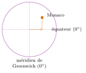
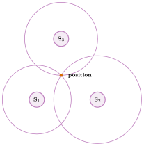
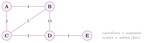

# Cours

<p class="sous-titre">Localisation, cartographie et mobilité</p>

<span id="chap-07" class="ancre"></span>

|  |  |
|:---|:---|
| **Programme** | Principe de la **géolocalisation** (GPS, satellites, trilatération) ; **coordonnées** (latitude, longitude) ; décoder une **trame NMEA** ; **cartes numériques** et calcul d’**itinéraire** ; enjeux de **confidentialité** des traces de localisation. |
| **Idée** | Votre téléphone sait, à quelques mètres près, *où* vous êtes. Derrière cette magie : des **satellites**, un peu de **géométrie** et beaucoup de **calcul**. Comprendre le GPS, c’est aussi reprendre la main sur ses **traces**. |
| **Objectifs** | Se repérer par **latitude/longitude** ; expliquer le principe du GPS (temps de trajet du signal, **trilatération**) ; **décoder** une trame NMEA ; utiliser une carte numérique (itinéraire, distance) ; mesurer les enjeux de **vie privée**. |

!!! remarque "Remarque"

    **Un peu d’histoire.** Le **GPS** (*Global Positioning System*) est conçu par l’armée américaine dans les années 1970 et devient pleinement opérationnel en **1995**. Jusqu’en **2000**, le signal civil était volontairement **dégradé** (« disponibilité sélective ») : la précision était de l’ordre de 100 m ! Le président Bill Clinton met fin à cette dégradation en mai 2000, et la précision grand public passe d’un coup à quelques mètres (GPS.gov). L’Europe a depuis déployé son propre système **civil**, **Galileo** (premiers services ouverts en décembre 2016 ; Commission européenne, 2016).

    Sources : GPS.gov (gouvernement des États-Unis), pages « Selective Availability » (fin de la dégradation le 1<sup>er</sup> mai 2000) et présentation du système (pleine capacité opérationnelle en 1995), `gps.gov` ; Commission européenne, communiqué « Galileo goes live! », décembre 2016, `ec.europa.eu`.

## Se repérer sur la Terre : latitude et longitude

Pour désigner un point sur le globe sans ambiguïté, on utilise deux nombres, comme sur un quadrillage.

!!! definition "Définition 1"

    La <span id="lex-latitude07" class="ancre"></span>**latitude** indique la position **Nord–Sud** : c’est un angle de $-90^\circ$ (pôle Sud) à $+90^\circ$ (pôle Nord), l’**équateur** valant $0^\circ$.  
    La **longitude** indique la position **Est–Ouest** : un angle de $-180^\circ$ à $+180^\circ$, le **méridien de Greenwich** (Londres) valant $0^\circ$.

\*(image manquante : 07_hist_greenwich)\*  
La ligne du méridien de Greenwich : longitude 0°

{ .tikz loading=lazy }

!!! exemple "Exemple"

    La Principauté de **Monaco** se situe à la latitude $\mathbf{43{,}7384^\circ}$ **Nord** et à la longitude $\mathbf{7{,}4246^\circ}$ **Est**. On note aussi ce couple $(43{,}7384\,;\ 7{,}4246)$.

!!! remarque "Remarque — Degrés décimaux ou degrés-minutes"

    Un même point s’écrit de deux façons : en **degrés décimaux** ($43{,}7384^\circ$) ou en **degrés et minutes** ($43^\circ\,44{,}30'$), sachant qu’**un degré vaut 60 minutes**. Pour convertir des minutes en degrés, on **divise par 60** : $43^\circ\,44{,}30' = 43 + \dfrac{44{,}30}{60} \approx 43{,}7384^\circ$. Le GPS, on le verra, « parle » en degrés-minutes.

<span id="cours-07-1" class="ancre"></span>

<span class="afaire">▶ Exercices d'application :</span> exercices **[1](exercices.md#ex-07-1) à [4](exercices.md#ex-07-4)** (latitude, longitude, degrés décimaux)

## Le GPS : comment ça marche ?

<span id="lex-gps07" class="ancre"></span>

Autour de la Terre gravitent une trentaine de **satellites** GPS (31 en service en 2023 ; GPS.gov). Chacun connaît sa position et diffuse en permanence un message radio contenant… l’**heure exacte** de l’envoi (il embarque une horloge atomique).

\*(image manquante : 07_hist_navstar)\*  
Un satellite GPS en orbite (vue d’artiste)

!!! regle "Règle 1 — Du temps à la distance"

    Le signal voyage à la **vitesse de la lumière** ($c \approx 300\,000$ km/s). Le récepteur (votre téléphone) compare l’heure d’**envoi** (dans le message) à l’heure de **réception** : la différence est le **temps de trajet**. Il en déduit sa **distance** au satellite : $$\text{distance} = c \times \text{temps de trajet}.$$

!!! exemple "Exemple"

    Si le signal d’un satellite a mis $0{,}07$ seconde à arriver, le récepteur en est à $300\,000 \times 0{,}07 = 21\,000$ km.

### La trilatération : se placer grâce aux distances

Connaître sa distance à *un* satellite ne suffit pas : on peut être n’importe où sur une sphère autour de lui. Mais en **croisant plusieurs distances**, la position se resserre. <span id="lex-trilateration07" class="ancre"></span>C’est la **trilatération**.

!!! regle "Règle 2 — Le principe de la trilatération"

    - **1 satellite** : on est quelque part sur une **sphère** (à distance fixée) ;

    - **2 satellites** : à l’intersection de deux sphères, un **cercle** ;

    - **3 satellites** : l’intersection se réduit à **deux points** (dont un aberrant, loin de la Terre : on l’élimine).

    En pratique, on capte un **4<sup>e</sup> satellite** pour corriger la petite erreur de l’horloge du récepteur.

{ .tikz loading=lazy }  
Trois « cercles de distance » se croisent en **un seul** point : votre position.

!!! remarque "Remarque"

    En deux dimensions (sur une carte), **trois** cercles suffisent à fixer un point : c’est le schéma ci-dessus. Sur la Terre (en 3D), on raisonne avec des **sphères**, d’où le besoin d’un satellite de plus.

!!! activite "Activité — Trilatération à la règle et au compas"

    Sur une carte, un randonneur sait qu’il est à $3$ km d’un refuge A, $4$ km d’un lac B et $2$ km d’un sommet C. Placer A, B, C, tracer au compas les trois cercles correspondants (à l’échelle) et marquer sa **position** : le point commun aux trois cercles.

Source : GPS.gov, page « Space Segment » (31 satellites en service, 2023), `gps.gov`.

<span id="cours-07-5" class="ancre"></span>

<span class="afaire">▶ Exercices d'application :</span> exercices **[5](exercices.md#ex-07-5) à [8](exercices.md#ex-07-8)** (le GPS et la trilatération)

## La trame NMEA : ce que « dit » le GPS

<span id="lex-nmea07" class="ancre"></span>

Une fois la position calculée, le récepteur GPS la transmet sous forme de courtes phrases de texte : les **trames NMEA** (norme *NMEA 0183*). La plus courante commence par `$GPGGA`.

!!! etudedoc "Décoder une trame $GPGGA"

    ```text
    $GPGGA,101530,4344.304,N,00725.476,E,1,07,1.0,15.0,M,,,,*20
    ```

    On lit les champs, séparés par des virgules :

    | **Champ**     | **Signification**                        |
    |:--------------|:-----------------------------------------|
    | `$GPGGA`      | type de trame (position + heure)         |
    | `101530`      | **heure** UTC : 10 h 15 min 30 s         |
    | `4344.304,N`  | **latitude** $43^\circ\,44{,}304'$ Nord  |
    | `00725.476,E` | **longitude** $007^\circ\,25{,}476'$ Est |
    | `1`           | qualité du positionnement (1 = fixé)     |
    | `07`          | **nombre de satellites** utilisés        |
    | `15.0,M`      | altitude : 15,0 mètres                   |
    | `*20`         | somme de contrôle (vérifie l’intégrité)  |

!!! regle "Règle 3 — Lire la latitude et la longitude"

    Le GPS donne la latitude au format `ddmm.mmmm` (degrés puis minutes) et la longitude au format `dddmm.mmmm`. Pour obtenir des **degrés décimaux**, on sépare les degrés des minutes, puis on **divise les minutes par 60**.

!!! exemple "Exemple"

    Dans la trame ci-dessus, la latitude `4344.304` se lit $43^\circ$ et $44{,}304'$, soit $$43 + \frac{44{,}304}{60} \approx 43{,}7384^\circ \text{ N},$$ et la longitude `00725.476` donne $7 + \dfrac{25{,}476}{60} \approx 7{,}4246^\circ$ E. Cette trame indique donc… **Monaco** !

<span id="cours-07-9" class="ancre"></span>

<span class="afaire">▶ Exercices d'application :</span> exercice **[9](exercices.md#ex-07-9)** (décoder une trame NMEA)

## Les cartes numériques et le calcul d’itinéraire

Une position seule ne sert à rien sans une **carte**. Les cartes numériques (Géoportail, OpenStreetMap, applications GPS) affichent votre point et calculent des trajets.

!!! definition "Définition 2"

    Une <span id="lex-carte07" class="ancre"></span>**carte numérique** superpose des **couches** d’information (routes, relief, bâtiments, commerces…) sur lesquelles on peut zoomer, mesurer une distance, et surtout **calculer un itinéraire**. **OpenStreetMap** est une carte **libre** (*open data*), construite et corrigée par des millions de contributeurs (plus de 2 millions ont déjà modifié la carte ; OpenStreetMap, 2025).

!!! regle "Règle 4 — Un itinéraire, c’est un plus court chemin dans un graphe"

    Pour calculer un trajet, l’application modélise le réseau routier par un **graphe** : chaque **carrefour** est un **sommet**, chaque **route** une **arête** *pondérée* par sa longueur (ou son temps de parcours). Trouver « le plus court chemin » revient à additionner les poids et à retenir le trajet de **somme minimale**.

{ .tikz loading=lazy }  
De A à E : le trajet A–C–D–E mesure $2+3+4 = 9$ km, plus court que A–B–D–E ($4+10+4 = 18$).

!!! activite "Activité — Sur une carte en ligne"

    Ouvrir une carte numérique (Géoportail ou `openstreetmap.org`). **1.** Chercher son lycée et **lire ses coordonnées** (clic droit » « Où suis-je ? » / « Afficher l’adresse »). **2.** Calculer un **itinéraire** du lycée à la gare et relever la **distance** et la **durée**. **3.** Mesurer « à vol d’oiseau » la même distance : est-elle plus courte ? Pourquoi ?

Source : OpenStreetMap, page « Stats » du wiki, 2<sup>e</sup> trimestre 2025 (10 millions d’inscrits, 2,25 millions de contributeurs), `wiki.openstreetmap.org`.

<span id="cours-07-10" class="ancre"></span>

<span class="afaire">▶ Exercices d'application :</span> exercices **[10](exercices.md#ex-07-10) à [12](exercices.md#ex-07-12)** (cartes numériques et itinéraires)

## GPS, GNSS et localisation « assistée »

Le mot « GPS » est passé dans le langage courant, mais c’est en réalité **un** système parmi d’autres.

!!! regle "Règle 5 — Plusieurs systèmes, un nom générique : GNSS"

    On regroupe tous les systèmes de positionnement par satellites sous le sigle **GNSS**. Les principaux : **GPS** (États-Unis), **GLONASS** (Russie), **Galileo** (Europe), **BeiDou** (Chine). Un smartphone récent en utilise **plusieurs à la fois** pour se localiser mieux et plus vite.

!!! remarque "Remarque — Comment le téléphone se localise… même sans voir le ciel"

    Le GPS fonctionne mal **en intérieur** ou entre de hauts immeubles (le signal des satellites est bloqué). Le téléphone se repère alors, en complément, grâce aux **antennes-relais** de l’opérateur et aux **réseaux Wi-Fi** environnants, dont les positions sont répertoriées. C’est plus rapide et fonctionne à l’intérieur, mais c’est moins précis.

<span id="cours-07-13" class="ancre"></span>

<span class="afaire">▶ Exercices d'application :</span> exercice **[13](exercices.md#ex-07-13)** (pas seulement le GPS : GNSS)

## Localisation et vie privée

Savoir où l’on est, c’est pratique. Mais chaque position est une **donnée personnelle** (chapitre *Données en tables*), et l’accumulation de positions dessine… toute votre vie.

!!! regle "Règle 6 — Les traces de localisation"

    Beaucoup d’applications **enregistrent votre position** en continu. Recoupées, ces **traces** révèlent votre domicile, votre lycée, vos trajets, vos habitudes. Une simple **photo** prise au smartphone contient souvent, dans ses **métadonnées** (EXIF), les **coordonnées GPS** du lieu de la prise de vue.

!!! regle "Règle 7 — Reprendre la main"

    Dans les *réglages* du téléphone, on peut : **couper la localisation** quand elle est inutile, choisir **quelles applications** y ont droit (« toujours » / « seulement pendant l’usage » / « jamais »), et **effacer l’historique** des positions. Avant de publier une photo, on peut aussi **retirer ses métadonnées**.

!!! remarque "Remarque — Ce que dit la loi : le RGPD"

    Les données de localisation sont des **données personnelles** : dans l’Union européenne, elles sont protégées par le **RGPD** (règlement européen 2016/679). Une application doit dire quelles données elle collecte et pourquoi, et chacun dispose de **droits** : accès, rectification, effacement, opposition… Si vous résidez en France (ou dans l’UE), vos droits relèvent du RGPD et de la loi Informatique et libertés (autorité : la **CNIL**).

!!! remarque "Remarque — Et à Monaco ?"

    Monaco n’est pas membre de l’Union européenne : le RGPD n’y est pas directement applicable (un site monégasque qui s’adresse à des personnes situées dans l’UE doit toutefois le respecter). La Principauté a sa propre loi, la **loi n° 1.565 du 3 décembre 2024** relative à la protection des données personnelles, conçue pour s’aligner sur les standards européens. Elle garantit les mêmes grands droits (accès, rectification, effacement, limitation, opposition, portabilité), sous le contrôle de l’**APDP** (Autorité de protection des données personnelles, `apdp.mc`), qui a succédé à la CCIN. Comme en France, en dessous de **15 ans**, l’inscription à un service en ligne demande l’autorisation des parents.

!!! activite "Activité — Enquête sur mes traces"

    **1.** Sur un téléphone, ouvrir les réglages de **localisation** et lister trois applications qui y ont accès. **2.** Expliquer, en deux phrases, en quoi l’historique de localisation peut poser un problème de **vie privée**. **3.** Proposer deux gestes concrets pour la protéger.

<span id="cours-07-14" class="ancre"></span>

<span class="afaire">▶ Exercices d'application :</span> exercice **[14](exercices.md#ex-07-14)** (mes traces : localisation et vie privée)

## Localisation et environnement

Consulter une carte ou calculer un itinéraire semble « immatériel ». Pourtant, cela mobilise un **téléphone** (qu’il a fallu fabriquer), des **réseaux** et des **centres de données** : les fonds de carte, les itinéraires calculés en ligne et l’état du trafic sont des données servies par des serveurs. Seul le calcul de la position lui-même se fait dans le téléphone, à partir des signaux reçus des satellites.

!!! regle "Règle 8 — Le coût d’une localisation permanente"

    Laisser la localisation activée en permanence a un coût, même si on ne le voit pas :

    - **la batterie** : le récepteur GPS, et les liaisons radio (données mobiles, Wi-Fi) qui l’assistent, consomment de l’énergie ; une application qui suit votre position **en arrière-plan** vide plus vite la batterie. Or une batterie usée trop tôt est une raison fréquente de **remplacer** son téléphone ;

    - **les données** : chaque position enregistrée et envoyée à un serveur grossit vos **traces**, stockées dans des centres de données (et, on l’a vu, elles en disent long sur votre vie) ;

    - **le réseau** : fonds de carte et trafic en temps réel sont téléchargés à chaque usage, sauf si l’on a enregistré la carte **hors-ligne**.

    L’essentiel de l’empreinte d’un téléphone vient pourtant de sa **fabrication** : le calcul complet, chiffres sourcés à l’appui, est fait dans le thème *Informatique embarquée et objets connectés* (section « L’impact environnemental des objets connectés »).

!!! activite "Activité — Localisation et sobriété"

    **1.** Lorsque l’on calcule un itinéraire avec une application en ligne, quelles parties du numérique (terminaux, réseaux, centres de données) sont sollicitées ? **2.** Pourquoi une application qui vous localise « toujours », même fermée, pose-t-elle à la fois un problème de **batterie** et de **vie privée** ? **3.** Proposer deux gestes de **sobriété** liés à la localisation (par exemple : télécharger une carte hors-ligne une fois, en Wi-Fi, avant un voyage ; n’autoriser la localisation que « pendant l’utilisation » de l’application).

<span id="cours-07-16" class="ancre"></span>

<span class="afaire">▶ Exercices d'application :</span> exercice **[16](exercices.md#ex-07-16)** (localisation et environnement)

!!! remarque "Remarque — Liens avec d’autres chapitres"

    La localisation croise plusieurs thèmes de SNT. Le récepteur GPS est un **capteur** : montres et objets connectés l’utilisent pour suivre vos déplacements (chapitre *Informatique embarquée et objets connectés*). La position est une **donnée personnelle**, qui se glisse jusque dans les **métadonnées EXIF** des photos (chapitres *Données en tables* et *Photographie numérique*) ; quant à la trame NMEA, ses valeurs séparées par des virgules rappellent une ligne de fichier **CSV**. Le calcul d’itinéraire cherche un plus court chemin dans un **graphe**, la structure même d’un **réseau social**, et les fonds de carte arrivent par **Internet**, depuis des serveurs. En spécialité NSI de Terminale, on apprend à parcourir des graphes et à y chercher des chemins.

## Bilan — la carte mémoire

| **Notion** | **À retenir** |
|:---|:---|
| Latitude / longitude | Nord–Sud ($-90$ à $90^\circ$) / Est–Ouest ($-180$ à $180^\circ$) ; Greenwich $=0$. |
| Degrés-minutes | $1^\circ = 60'$ ; minutes $\to$ degrés : diviser par 60. |
| Principe du GPS | le récepteur mesure le **temps de trajet** du signal $\to$ distance $= c \times t$. |
| Trilatération | croiser 3 distances (cercles) $\to$ 1 point ; 4<sup>e</sup> satellite pour l’horloge. |
| Trame NMEA | phrase texte (`$GPGGA`) : heure, latitude, longitude, nb de satellites. |
| Carte numérique | couches d’infos ; OpenStreetMap = carte libre (open data). |
| Itinéraire | plus court chemin dans un **graphe** (carrefours + routes pondérées). |
| GNSS | GPS, GLONASS, Galileo, BeiDou ; Wi-Fi/antennes en complément. |
| Vie privée | position = **donnée personnelle** ; traces, EXIF ; RGPD (UE), loi n° 1.565 (Monaco). |
| Environnement | localisation permanente : batterie, traces, réseau ; cartes hors-ligne. |

!!! encadre "Débat argumenté"

    Une **fiche débat** accompagne ce thème : « Faut-il laisser la géolocalisation de son téléphone activée en permanence ? » (documents, rôles, tableau d’arguments et trace écrite, environ 50 min).

## Savoir-faire à maîtriser

*À la fin du chapitre, je sais…*

!!! autopos "Savoir-faire : je me positionne"

    - me repérer sur la Terre avec la **latitude** et la **longitude** ;

    - expliquer le principe du **GPS** (satellites, temps de trajet du signal, trilatération) ;

    - lire une **trame NMEA** et y retrouver l’heure et les coordonnées ;

    - utiliser une **carte numérique** et comprendre le calcul d’un **itinéraire** ;

    - distinguer **GPS**, **GNSS** et localisation **assistée** ;

    - citer les risques du **traçage** de la position pour la vie privée ;

    - situer l’essentiel de l’**empreinte environnementale** d’un smartphone et proposer des gestes de sobriété.
