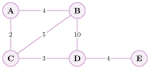
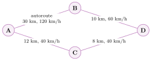

# Exercices

<p class="sous-titre">Localisation, cartographie et mobilité</p>

!!! consignes "Mode d’emploi"

    - Niveau : ★ échauffement, ★★ classique (niveau bac), ★★★ défi ; les *coups de pouce* et les *corrigés* se déplient sous chaque exercice.

    - <span class="tag">sur papier</span> *à faire sur papier* ; <span class="tag">sur machine</span> *à faire sur machine* (carte en ligne).

    - Rappels : $1^\circ = 60'$ ; distance $= c \times$ temps, avec $c \approx 300\,000$ km/s.

    - Usage de l’IA, indiqué sur chaque exercice : <span class="ia ia-rouge" title="Sans IA : le but est l'automatisme lui-même"></span> aucune ; <span class="ia ia-orange" title="IA en appui : déboguer, reformuler, vérifier ; la réponse finale est la vôtre"></span> en appui (déboguer, reformuler, vérifier ; la réponse finale est écrite et comprise par vous) ; <span class="ia ia-vert" title="IA intégrée : l'exercice s'appuie sur une réponse d'IA"></span> l’exercice s’appuie sur une réponse d’IA. Voir la charte d’usage de l’IA.

### Latitude et longitude

### <span class="stars" title="Niveau 1 sur 3">★</span> <span class="exo-num">Exercice 1</span> — Nord ou Sud, Est ou Ouest ? <span class="ia ia-rouge" title="Sans IA : le but est l'automatisme lui-même"></span> { #ex-07-1 }

<span class="tag">sur papier</span> 

1.  Que vaut la latitude d’un point situé sur l’**équateur** ? la longitude d’un point sur le **méridien de Greenwich** ?

2.  Entre quelles valeurs varie une latitude ? une longitude ?

3.  Monaco est à $(43{,}7384\,;\ 7{,}4246)$. Dire, pour chaque nombre, s’il s’agit de la latitude ou de la longitude, et préciser Nord/Sud et Est/Ouest.

??? corrige "Corrigé"

    1.  Sur l’équateur, la latitude vaut $0^\circ$ ; sur le méridien de Greenwich, la longitude vaut $0^\circ$.

    2.  Latitude : de $-90^\circ$ (pôle Sud) à $+90^\circ$ (pôle Nord). Longitude : de $-180^\circ$ à $+180^\circ$.

    3.  $43{,}7384$ est la **latitude** (Nord) ; $7{,}4246$ est la **longitude** (Est).

### <span class="stars" title="Niveau 1 sur 3">★</span> <span class="exo-num">Exercice 2</span> — Trois villes sur le globe <span class="ia ia-rouge" title="Sans IA : le but est l'automatisme lui-même"></span> { #ex-07-2 }

<span class="tag">sur papier</span>  Voici les coordonnées (latitude ; longitude), en degrés décimaux, de trois villes : Monaco $(43{,}74\,;\ 7{,}42)$, Rio de Janeiro $(-22{,}91\,;\ -43{,}17)$ et Tokyo $(35{,}68\,;\ 139{,}69)$.

1.  Quelle ville est dans l’hémisphère **Sud** ?

2.  Quelle ville est à l’**ouest** du méridien de Greenwich ?

3.  Ranger les trois villes de la plus au nord à la plus au sud.

??? corrige "Corrigé"

    1.  **Rio de Janeiro** : sa latitude est **négative** ($-22{,}91$), donc au sud de l’équateur.

    2.  **Rio de Janeiro** : sa longitude est négative ($-43{,}17$), donc à l’ouest de Greenwich.

    3.  Du nord au sud (latitude décroissante) : **Monaco** ($43{,}74$), **Tokyo** ($35{,}68$), **Rio de Janeiro** ($-22{,}91$).

### <span class="stars" title="Niveau 2 sur 3">★★</span> <span class="exo-num">Exercice 3</span> — Degrés, minutes et degrés décimaux <span class="ia ia-rouge" title="Sans IA : le but est l'automatisme lui-même"></span> { #ex-07-3 }

<span class="tag">sur papier</span>  On rappelle que $1^\circ = 60'$.

1.  Convertir en degrés décimaux : $45^\circ\,30'$ ; $12^\circ\,15'$ ; $43^\circ\,44{,}304'$.

2.  Convertir en degrés et minutes : $6{,}25^\circ$ ; $7{,}5^\circ$.

??? pouce "Coup de pouce"

    Les minutes sont des soixantièmes de degré : pour convertir des minutes en degrés, divisez par $60$. Dans l’autre sens, multipliez la partie décimale par $60$.

??? corrige "Corrigé"

    1.  $45^\circ 30' = 45 + \tfrac{30}{60} = 45{,}5^\circ$ ; $12^\circ 15' = 12 + \tfrac{15}{60} = 12{,}25^\circ$ ; $43^\circ 44{,}304' = 43 + \tfrac{44{,}304}{60} \approx 43{,}7384^\circ$.

    2.  $6{,}25^\circ = 6^\circ + 0{,}25\times 60' = 6^\circ 15'$ ; $7{,}5^\circ = 7^\circ 30'$.

### <span class="stars" title="Niveau 3 sur 3">★★★</span> <span class="exo-num">Exercice 4</span> — Des degrés aux kilomètres <span class="ia ia-rouge" title="Sans IA : le but est l'automatisme lui-même"></span> { #ex-07-4 }

<span class="tag">sur papier</span>  On admet qu’un écart de $1^\circ$ de latitude correspond, sur le terrain, à environ $111$ km (en se déplaçant vers le nord ou vers le sud).

1.  Un randonneur part de Monaco $(43{,}74\,;\ 7{,}42)$ et marche plein nord jusqu’au point $(44{,}24\,;\ 7{,}42)$. Quelle distance a-t-il parcourue, à vol d’oiseau ?

2.  À combien de kilomètres correspond une minute ($1'$) de latitude ?

3.  Une application affiche la latitude avec quatre décimales ($0{,}0001^\circ$ près). À quelle distance sur le terrain cela correspond-il ? Est-ce assez précis pour retrouver une maison ?

??? pouce "Coup de pouce"

    Commencez par calculer l’écart de latitude entre les deux points, puis utilisez la proportionnalité : $1^\circ$ correspond à $111$ km.

??? pouce "Coup de pouce 2 (début de solution)"

    Question 1 : l’écart vaut $44{,}24 - 43{,}74 = 0{,}5^\circ$. Question 2 : une minute, c’est $1/60$ de degré. Question 3 : $0{,}0001^\circ$, c’est un dix-millième de degré.

??? corrige "Corrigé"

    1.  Écart de latitude : $44{,}24 - 43{,}74 = 0{,}5^\circ$, soit $0{,}5 \times 111 \approx \mathbf{55{,}5}$ **km** (la longitude ne change pas : il marche plein nord).

    2.  $1' = \tfrac{1}{60}$ de degré : $111 \div 60 \approx \mathbf{1{,}85}$ **km** (c’est le « mille nautique » des marins).

    3.  $0{,}0001 \times 111 = 0{,}0111$ km $\approx \mathbf{11}$ **m**. C’est assez précis pour repérer une maison ou une entrée d’immeuble (et c’est l’ordre de grandeur de la précision réelle d’un GPS de téléphone, quelques mètres).

### Le GPS et la trilatération

### <span class="stars" title="Niveau 1 sur 3">★</span> <span class="exo-num">Exercice 5</span> — Du temps à la distance <span class="ia ia-rouge" title="Sans IA : le but est l'automatisme lui-même"></span> { #ex-07-5 }

<span class="tag">sur papier</span>  Un signal met $0{,}06$ seconde pour parvenir d’un satellite au récepteur.

1.  À quelle **distance** (en km) le récepteur se trouve-t-il de ce satellite ?

2.  Que devrait mesurer le récepteur pour calculer ce temps de trajet ?

??? corrige "Corrigé"

    1.  $d = c \times t = 300\,000 \times 0{,}06 = \mathbf{18\,000}$ km.

    2.  Il doit mesurer le **temps de trajet** : comparer l’heure d’*envoi* (contenue dans le message) à l’heure de *réception* — d’où le besoin d’une horloge précise.

### <span class="stars" title="Niveau 2 sur 3">★★</span> <span class="exo-num">Exercice 6</span> — La précision des horloges <span class="ia ia-rouge" title="Sans IA : le but est l'automatisme lui-même"></span> { #ex-07-6 }

<span class="tag">sur papier</span>  Le signal d’un satellite voyage à $300\,000$ km/s.

1.  Quelle distance parcourt-il en un millième de seconde ($0{,}001$ s) ? En un millionième de seconde ($0{,}000\,001$ s) ?

2.  L’horloge d’un récepteur avance d’un millième de seconde. Quelle erreur sur la distance au satellite cela provoque-t-il ?

3.  En déduire pourquoi les satellites embarquent des horloges **atomiques**, et pourquoi le récepteur capte un quatrième satellite.

??? pouce "Coup de pouce"

    Distance $=$ vitesse $\times$ temps, comme dans l’exercice précédent. Une erreur sur le temps de trajet devient une erreur sur la distance, multipliée par $300\,000$.

??? corrige "Corrigé"

    1.  En $0{,}001$ s : $300\,000 \times 0{,}001 = \mathbf{300}$ **km**. En $0{,}000\,001$ s : $300\,000 \times 0{,}000\,001 = 0{,}3$ km, soit **300 m**.

    2.  Une avance d’un millième de seconde fausse le temps de trajet d’autant : l’erreur sur la distance est de **300 km** — la position serait complètement fausse.

    3.  Une toute petite erreur de temps donne une énorme erreur de distance : il faut des horloges **extrêmement précises** (atomiques) dans les satellites. L’horloge d’un téléphone, elle, n’est pas assez précise : le **quatrième satellite** sert à calculer et corriger son erreur.

### <span class="stars" title="Niveau 2 sur 3">★★</span> <span class="exo-num">Exercice 7</span> — Combien de satellites ? <span class="ia ia-rouge" title="Sans IA : le but est l'automatisme lui-même"></span> { #ex-07-7 }

<span class="tag">sur papier</span> 

1.  Avec la distance à **un seul** satellite, que peut-on dire de la position (en 3D) ?

2.  Pourquoi **trois** distances permettent-elles (sur une carte, en 2D) de fixer un point ?

3.  En pratique, pourquoi capte-t-on un **quatrième** satellite ?

??? pouce "Coup de pouce"

    Connaître sa distance à un satellite place le récepteur sur une sphère centrée sur ce satellite. Que donne l’intersection de deux sphères ? de trois ?

??? corrige "Corrigé"

    1.  Avec un seul satellite, on sait seulement qu’on est sur une **sphère** (à distance fixée) autour de lui.

    2.  Deux cercles se coupent en deux points ; le **troisième** lève l’ambiguïté et laisse **un** point.

    3.  Le 4<sup>e</sup> satellite sert à **corriger l’erreur de l’horloge** du récepteur.

### <span class="stars" title="Niveau 2 sur 3">★★</span> <span class="exo-num">Exercice 8</span> — Trilatération sur quadrillage <span class="ia ia-orange" title="IA en appui : déboguer, reformuler, vérifier ; la réponse finale est la vôtre"></span> { #ex-07-8 }

<span class="tag">sur papier</span>  Sur un quadrillage, on place trois balises : A$(0\,;0)$, B$(6\,;0)$, C$(0\,;6)$ (unités en km). Un promeneur est à $5$ km de A, $\sqrt{13}\approx 3{,}6$ km de B et $5$ km de C.

1.  Tracer les trois cercles (compas, à l’échelle) centrés en A, B, C.

2.  Lire les coordonnées du point commun aux trois cercles : c’est la position du promeneur.

??? pouce "Coup de pouce"

    Le rayon de chaque cercle est la distance à la balise. Choisissez une échelle simple (par exemple $1$ cm pour $1$ km), puis vérifiez le point trouvé avec les trois distances.

??? corrige "Corrigé"

    Le point commun aux trois cercles est $\mathbf{(4\,;\,3)}$. *Vérification :* distance à A$(0;0)$ $=\sqrt{4^2+3^2}=5$ ; à C$(0;6)$ $=\sqrt{4^2+3^2}=5$ ; à B$(6;0)$ $=\sqrt{(-2)^2+3^2}=\sqrt{13}\approx 3{,}6$. ✓

### Décoder une trame NMEA

### <span class="stars" title="Niveau 3 sur 3">★★★</span> <span class="exo-num">Exercice 9</span> — Que dit le GPS ? <span class="ia ia-orange" title="IA en appui : déboguer, reformuler, vérifier ; la réponse finale est la vôtre"></span> { #ex-07-9 }

<span class="tag">sur papier</span>  On capte la trame suivante :

```text
$GPGGA,142012,4342.054,N,00716.098,E,1,06,1.2,10.0,M,,,,*20
```

1.  Donner l’**heure** (UTC) de la mesure.

2.  Donner la **latitude** et la **longitude** en degrés-minutes, puis les convertir en **degrés décimaux** (arrondir à $0{,}0001$).

3.  Combien de **satellites** ont été utilisés ?

4.  *Recherche :* à quelle ville de la Côte d’Azur ces coordonnées correspondent-elles ?

??? pouce "Coup de pouce"

    Les informations sont séparées par des virgules, toujours dans le même ordre : heure, latitude, N/S, longitude, E/O, …, nombre de satellites. Relisez le tableau de la trame dans le cours.

??? pouce "Coup de pouce 2 (début de solution)"

    Dans `4342.054`, les deux premiers chiffres sont les degrés et le reste les minutes : $43^\circ\,42{,}054'$, soit $43 + 42{,}054 / 60$. Pour la longitude `00716.098`, les degrés occupent les trois premiers chiffres.

??? corrige "Corrigé"

    1.  `142012` $\to$ **14 h 20 min 12 s** (UTC).

    2.  Latitude `4342.054,N` $= 43^\circ 42{,}054'$ N $= 43 + \tfrac{42{,}054}{60} \approx \mathbf{43{,}7009^\circ}$ N. Longitude `00716.098,E` $= 7^\circ 16{,}098'$ E $= 7 + \tfrac{16{,}098}{60} \approx \mathbf{7{,}2683^\circ}$ E.

    3.  `06` : **6** satellites utilisés.

    4.  Ces coordonnées correspondent à **Nice**.

### Cartes numériques et itinéraires

### <span class="stars" title="Niveau 2 sur 3">★★</span> <span class="exo-num">Exercice 10</span> — Le plus court chemin <span class="ia ia-orange" title="IA en appui : déboguer, reformuler, vérifier ; la réponse finale est la vôtre"></span> { #ex-07-10 }

<span class="tag">sur papier</span>  On modélise un réseau routier par le graphe suivant (distances en km) :

{ .tikz loading=lazy }

1.  Donner deux itinéraires possibles de A à E et leur longueur totale.

2.  Quel est le **plus court** chemin de A à E ? Quelle est sa longueur ?

3.  En quoi ce graphe ressemble-t-il à ce que calcule une application GPS ?

??? pouce "Coup de pouce"

    Listez tous les chemins de A à E qui ne repassent jamais par un même sommet, puis additionnez les distances de chacun.

??? corrige "Corrigé"

    1.  Par exemple A–B–D–E $= 4+10+4 = 18$ km ; A–C–D–E $= 2+3+4 = 9$ km.

    2.  Le plus court chemin est **A–C–D–E**, de longueur **9 km** (les autres : A–B–C–D–E $=16$, A–C–B–D–E $=21$).

    3.  Une application GPS modélise de même le réseau routier par un **graphe** (carrefours = sommets, routes pondérées) et cherche le trajet de **somme minimale**.

### <span class="stars" title="Niveau 3 sur 3">★★★</span> <span class="exo-num">Exercice 11</span> — Le chemin le plus rapide <span class="ia ia-rouge" title="Sans IA : le but est l'automatisme lui-même"></span> { #ex-07-11 }

<span class="tag">sur papier</span>  Pour aller de A à D, deux itinéraires sont possibles (distance et vitesse moyenne sur chaque tronçon) :

{ .tikz loading=lazy }

1.  Quel est l’itinéraire le plus **court** ?

2.  Calculer la **durée** de chaque itinéraire, en minutes. Lequel est le plus **rapide** ?

3.  Un bouchon fait tomber la vitesse moyenne sur l’autoroute à $40$ km/h. Quel itinéraire une application de navigation conseille-t-elle alors ? Justifier.

??? pouce "Coup de pouce"

    Durée (en heures) $=$ distance divisée par vitesse ; multipliez ensuite par $60$ pour obtenir des minutes. Calculez la durée de chaque tronçon, puis additionnez.

??? pouce "Coup de pouce 2 (début de solution)"

    Tronçon A–B : $30 \div 120 = 0{,}25$ h, soit $0{,}25 \times 60 = 15$ min. Faites de même pour les trois autres tronçons.

??? corrige "Corrigé"

    1.  A–B–D $= 30 + 10 = 40$ km ; A–C–D $= 12 + 8 = 20$ km : le plus **court** est **A–C–D**.

    2.  A–B–D : $30 \div 120 = 0{,}25$ h $= 15$ min, puis $10 \div 60 \approx 0{,}167$ h $= 10$ min, soit **25 min**. A–C–D : $12 \div 40 = 0{,}3$ h $= 18$ min, puis $8 \div 40 = 0{,}2$ h $= 12$ min, soit **30 min**. Le plus **rapide** est **A–B–D**, bien qu’il soit deux fois plus long.

    3.  Avec le bouchon : A–B dure $30 \div 40 = 0{,}75$ h $= 45$ min, donc A–B–D dure $55$ min. L’application conseille alors **A–C–D** ($30$ min). Elle cherche le chemin de **durée** minimale, recalculée avec le trafic en temps réel : le meilleur chemin dépend du « poids » choisi pour les arêtes (distance ou durée).

### <span class="stars" title="Niveau 2 sur 3">★★</span> <span class="exo-num">Exercice 12</span> — Sur une vraie carte <span class="ia ia-orange" title="IA en appui : déboguer, reformuler, vérifier ; la réponse finale est la vôtre"></span> { #ex-07-12 }

<span class="tag">sur machine</span>  Ouvrir une carte en ligne (Géoportail ou `openstreetmap.org`).

1.  Retrouver le lycée et **lire ses coordonnées** (latitude, longitude).

2.  Calculer l’**itinéraire** du lycée à la gare la plus proche : relever la **distance** et la **durée** proposées.

3.  Comparer avec la distance « à vol d’oiseau ». Pourquoi le trajet routier est-il plus long ?

??? pouce "Coup de pouce"

    Sur OpenStreetMap, un clic droit sur la carte permet d’afficher l’adresse et les coordonnées d’un point ; le bouton d’itinéraire (les flèches) calcule le trajet.

??? corrige "Corrigé"

    Réponse ouverte. Le trajet routier est plus long que « à vol d’oiseau » car il suit les **routes** (virages, sens interdits, obstacles), et non la ligne droite.

### GNSS et vie privée

### <span class="stars" title="Niveau 1 sur 3">★</span> <span class="exo-num">Exercice 13</span> — Pas seulement le GPS <span class="ia ia-rouge" title="Sans IA : le but est l'automatisme lui-même"></span> { #ex-07-13 }

<span class="tag">sur papier</span> 

1.  Citer, en plus du GPS américain, **deux** autres systèmes de positionnement par satellites.

2.  Pourquoi le GPS fonctionne-t-il mal à l’intérieur d’un bâtiment ? Comment le téléphone se localise-t-il alors ?

??? corrige "Corrigé"

    1.  **GLONASS** (Russie), **Galileo** (Europe), **BeiDou** (Chine).

    2.  En intérieur, les signaux des satellites sont **bloqués** par les murs. Le téléphone se localise alors grâce aux **antennes-relais** et aux réseaux **Wi-Fi** environnants (plus rapide, moins précis).

### <span class="stars" title="Niveau 1 sur 3">★</span> <span class="exo-num">Exercice 14</span> — Mes traces <span class="ia ia-orange" title="IA en appui : déboguer, reformuler, vérifier ; la réponse finale est la vôtre"></span> { #ex-07-14 }

<span class="tag">sur papier</span> 

1.  Pourquoi une position est-elle une **donnée personnelle** ?

2.  Une photo peut « révéler » où elle a été prise : de quoi parle-t-on ?

3.  Proposer deux réglages simples pour protéger sa localisation.

??? corrige "Corrigé"

    1.  Une position permet d’identifier et de **suivre** une personne (domicile, lycée, trajets) : c’est donc une donnée personnelle.

    2.  Des **métadonnées EXIF** : une photo prise au smartphone contient souvent les coordonnées GPS du lieu.

    3.  Couper la localisation quand elle est inutile ; limiter les applications qui y ont accès ; effacer l’historique ; retirer l’EXIF avant de publier une photo.

### Critiquer une réponse d’IA

### <span class="stars" title="Niveau 2 sur 3">★★</span> <span class="exo-num">Exercice 15</span> — Le GPS expliqué par un assistant <span class="ia ia-vert" title="IA intégrée : l'exercice s'appuie sur une réponse d'IA"></span> { #ex-07-15 }

<span class="tag">sur papier</span>  Un élève a demandé à un assistant d’IA : « Comment mon téléphone connaît-il ma position grâce au GPS ? » Voici la réponse obtenue :

> Une trentaine de satellites GPS tournent autour de la Terre ; chacun embarque une horloge atomique et connaît sa position. Votre téléphone envoie un signal radio vers les satellites ; chaque satellite mesure le temps mis par ce signal pour lui parvenir, calcule la distance (vitesse de la lumière $\times$ temps de trajet, par exemple $300\,000 \times 0{,}05 = 15\,000$ km) et renvoie cette distance au téléphone. Avec trois distances, le téléphone se place par trilatération ; un quatrième satellite sert à corriger l’erreur de son horloge. En intérieur, le signal est bloqué et le téléphone se rabat sur le Wi-Fi et les antennes-relais.

1.  La réponse est-elle correcte ? Vérifier le calcul, puis relire l’encadré « Du temps à la distance » du cours : qui envoie le signal, qui le reçoit ?

2.  Localiser et corriger l’erreur.

    ??? pouce "Coup de pouce"

        Relisez dans le cours ce que contient le message d’un satellite et ce que fait le récepteur, puis comparez avec le récit de l’assistant, phrase par phrase.

3.  Quelle vérification simple, faite *avant* de faire confiance à cette réponse, aurait suffi à détecter l’erreur ?

??? corrige "Corrigé"

    1.  Le calcul est juste ($300\,000 \times 0{,}05 = 15\,000$ km), ainsi que la trilatération, le quatrième satellite et le repli sur le Wi-Fi. Mais le cours dit : chaque satellite « **diffuse** en permanence un message radio contenant l’heure exacte de l’envoi » et « le **récepteur** (votre téléphone) compare l’heure d’envoi à l’heure de réception ».

    2.  L’erreur : le sens de la communication est inversé. Le téléphone n’**envoie** rien aux satellites : il ne fait que **recevoir** leurs messages, calcule lui-même sa distance à chacun, puis sa position. Correction : « chaque satellite diffuse l’heure d’envoi ; le téléphone la compare à l’heure de réception et en déduit la distance ».

    3.  Un argument de bon sens suffisait : le GPS fonctionne sans réseau ni carte SIM (en mode avion, en pleine montagne), donc le téléphone ne peut qu’*écouter*. Ou relire, avant de croire l’assistant, la phrase du cours qui décrit ce que fait le récepteur.

### Localisation et environnement

### <span class="stars" title="Niveau 2 sur 3">★★</span> <span class="exo-num">Exercice 16</span> — Le coût caché d’un itinéraire <span class="ia ia-orange" title="IA en appui : déboguer, reformuler, vérifier ; la réponse finale est la vôtre"></span> { #ex-07-16 }

<span class="tag">sur papier</span>  On s’appuie sur l’encadré « Le coût d’une localisation permanente » du cours. Une application de course à pied enregistre la position de Nora **toutes les secondes** pendant ses sorties et envoie le parcours à ses serveurs. On suppose qu’un point (heure, latitude, longitude) occupe environ $30$ octets.

1.  Nora court $1$ heure, trois fois par semaine. Combien de points sont enregistrés pendant une sortie ? Quel volume de données cela représente-t-il pour une sortie, puis pour une année ($52$ semaines) ? Donner le résultat en mégaoctets ($1$ Mo $= 10^6$ octets).

2.  Ce volume est modeste. Pourquoi ces traces posent-elles pourtant une question de **vie privée** ? Où sont-elles stockées ?

3.  Une application de navigation affiche le trafic en temps réel. Pourquoi cela sollicite-t-il des **centres de données** et des **réseaux**, alors que le calcul de la position GPS, lui, se fait dans le téléphone ?

4.  Proposer deux gestes de **sobriété** liés à l’usage des cartes et de la localisation (pensez aussi à la batterie), et justifier leur effet.

??? pouce "Coup de pouce"

    Question 1 : une heure compte $3\,600$ secondes ; multipliez ensuite par la taille d’un point, puis par le nombre de sorties dans l’année. Question 3 : la position est calculée dans le téléphone, mais d’où viennent les informations sur le trafic ?

??? corrige "Corrigé"

    1.  Une sortie d’une heure : $3\,600$ secondes, donc $\mathbf{3\,600}$ **points**, soit $3\,600 \times 30 = 108\,000$ octets $\approx \mathbf{0{,}1}$ **Mo**. Sur une année : $3 \times 52 = 156$ sorties, soit $156 \times 108\,000 = 16\,848\,000$ octets $\approx \mathbf{17}$ **Mo**.

    2.  Ces traces sont des **données personnelles** : recoupées, elles révèlent le domicile (point de départ), les horaires et les habitudes de Nora. Elles sont stockées sur les **serveurs** de l’application (dans des centres de données), souvent sans limite de durée, et peuvent être partagées, revendues ou piratées.

    3.  Le trafic en temps réel (et les fonds de carte, les itinéraires calculés en ligne) sont des **données servies par des serveurs** : elles sont stockées et calculées dans des **centres de données** puis acheminées par les **réseaux**. Le GPS, lui, ne fait que *recevoir* des signaux et le téléphone calcule seul sa position.

    4.  Par exemple : télécharger une **carte hors-ligne** une fois (en Wi-Fi) avant un trajet, ce qui évite de recharger les données à chaque usage ; n’autoriser la localisation que **« pendant l’utilisation »** de l’application et la couper quand elle est inutile, ce qui ménage la **batterie** (une batterie usée trop tôt pousse à changer de téléphone, alors que l’essentiel de son empreinte vient de la **fabrication**, thème *Objets connectés*) et limite les traces envoyées aux serveurs.
