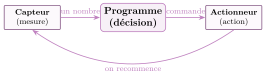

# Cours

<p class="sous-titre">Informatique embarquée et objets connectés</p>

<span id="chap-08" class="ancre"></span>

|  |  |
|:---|:---|
| **Programme** | Systèmes informatiques **embarqués** ; **capteurs** et **actionneurs** ; **interface homme-machine** (IHM) ; **objets connectés** et réseaux d’objets (IoT) ; algorithme de **commande** d’un système physique ; enjeux de **sécurité** et de **vie privée**. |
| **Idée** | Des ordinateurs minuscules se cachent dans nos objets et pilotent le monde physique : ils *mesurent* (capteurs), *décident* (un programme), *agissent* (actionneurs). Reliés au réseau, ils deviennent **connectés** — pratiques, mais pas sans risques. |
| **Objectifs** | Reconnaître un système embarqué ; distinguer **capteur** et **actionneur** ; lire et écrire une **boucle de commande** simple ; décrire une **IHM** ; comprendre l’**Internet des objets** ; mesurer les enjeux de sécurité, de vie privée et d’environnement. |

!!! remarque "Remarque"

    **Un peu d’histoire.** L’un des tout premiers ordinateurs *embarqués* est l’**Apollo Guidance Computer** qui, en **1969**, a guidé les astronautes jusqu’à la Lune avec une puissance… ridicule face à un smartphone d’aujourd’hui. Le **premier objet connecté** de l’histoire serait un **grille-pain** branché à Internet, présenté pour s’amuser en **1990**. L’expression « **Internet des objets** » (*Internet of Things*) est lancée en **1999** par **Kevin Ashton** (Ashton, *RFID Journal*, 2009). On comptait fin 2024 **près de 20 milliards** d’objets connectés dans le monde (sans compter smartphones et ordinateurs) — plus de deux fois le nombre d’humains (IoT Analytics, 2024 ; ONU, 2022).

    \*(image manquante : 08_hist_agc)\*  
    L’ordinateur de guidage d’Apollo

    \*(image manquante : 08_hist_kevin_ashton)\*  
    Kevin Ashton (2015)

    Sources : K. Ashton, « That “Internet of Things” Thing », *RFID Journal*, 2009 ; IoT Analytics, *State of IoT – Summer 2024*, septembre 2024 (18,8 milliards d’objets connectés estimés fin 2024), `iot-analytics.com` ; ONU (Département des affaires économiques et sociales), *World Population Prospects 2022* (8 milliards d’humains en novembre 2022), `un.org`.

## L’informatique invisible : les systèmes embarqués

L’ordinateur n’est plus seulement la machine posée sur un bureau. Il a **rétréci** et s’est glissé *dans les objets*.

!!! definition "Définition 1"

    Un <span id="lex-embarque08" class="ancre"></span>**système embarqué** est un ordinateur **intégré dans un objet**, dédié à **une tâche précise**. Il est le plus souvent minuscule, sobre en énergie, et invisible pour l’utilisateur. Le petit processeur qu’il contient s’appelle un <span id="lex-microcontroleur08" class="ancre"></span>**microcontrôleur**.

!!! exemple "Exemple"

    On en trouve partout : lave-linge, four à micro-ondes, ascenseur, distributeur de billets, montre connectée, régulateur de vitesse d’une voiture, box internet, feu tricolore, drone, carte bancaire… Une voiture récente en contient à elle seule **plusieurs dizaines**.

!!! remarque "Remarque — Différence avec un ordinateur ordinaire"

    Un système embarqué ne fait **qu’une** chose (réguler une température, afficher l’heure…), n’a en général **pas d’écran ni de clavier** classiques, et doit souvent réagir **en temps réel** : un airbag ne peut pas « ramer ».

<span id="cours-08-1" class="ancre"></span>

<span class="afaire">▶ Exercices d'application :</span> exercices **[1](exercices.md#ex-08-1) et [2](exercices.md#ex-08-2)** (systèmes embarqués)

## Sentir et agir : capteurs et actionneurs

Pour interagir avec le monde physique, un système embarqué a besoin de deux sortes d’organes.

\*(image manquante : 08_hist_microbit)\*  
Une carte micro:bit : capteurs, boutons et LED

!!! definition "Définition 2"

    <span id="lex-capteur08" class="ancre"></span>Un **capteur** *mesure* une grandeur physique (température, lumière, mouvement, pression…) et la transforme en un **nombre** exploitable par la machine. C’est une **entrée**.  
    Un <span id="lex-actionneur08" class="ancre"></span>**actionneur** *agit* sur le monde physique (chauffer, éclairer, tourner, ouvrir, émettre un son…). C’est une **sortie**.

| **Capteurs (entrées)**             | **Actionneurs (sorties)** |
|:-----------------------------------|:--------------------------|
| thermomètre (température)          | radiateur, ventilateur    |
| photorésistance (luminosité)       | lampe, LED                |
| détecteur de mouvement             | moteur (volet, portail)   |
| microphone (son)                   | haut-parleur              |
| capteur d’image (chapitre *Photo*) | écran                     |

!!! activite "Activité — Capteurs ou actionneurs ?"

    Pour un **smartphone**, classer en deux colonnes : l’écran tactile, le haut-parleur, l’appareil photo, le vibreur, le micro, la lampe torche, le capteur de luminosité.

<span id="cours-08-3" class="ancre"></span>

<span class="afaire">▶ Exercices d'application :</span> exercices **[3](exercices.md#ex-08-3) et [4](exercices.md#ex-08-4)** (capteurs et actionneurs)

## La boucle de commande : mesurer, décider, agir

<span id="lex-boucledecommande08" class="ancre"></span>

Le cœur d’un objet embarqué est un **programme** qui répète sans fin le même cycle.

!!! regle "Règle 1 — Le cycle acquisition $to$ décision $to$ action"

    { .tikz loading=lazy }

    Le système **acquiert** une mesure, **décide** (avec des conditions), **commande** un actionneur, puis **recommence**.

!!! exemple "Exemple — Le thermostat d’une maison connectée"

    On veut maintenir une pièce à $19\,^\circ$C. On dispose d’un capteur `lire_temperature()` et d’un radiateur, que l’on commande avec `allumer_chauffage()` et `eteindre_chauffage()`.

    ```python
    while True:                       # boucle sans fin
        t = lire_temperature()        # ENTREE : le capteur -> un nombre
        if t < 19:
            allumer_chauffage()       # SORTIE : on commande un actionneur
        else:
            eteindre_chauffage()
        attendre(60)                  # on re-teste chaque minute
    ```

    On reconnaît le cycle : **lire** la température, **décider** (`if`), **agir** sur le radiateur, **recommencer**.

!!! remarque "Remarque — C’est un algorithme comme un autre"

    La « décision » n’est qu’une suite de **conditions** et de **boucles** — exactement ce que vous savez déjà écrire (chapitre *Les bases de Python*). Un volet qui se ferme quand la nuit tombe, un arrosage qui se déclenche quand la terre est sèche : même boucle, autres capteurs et actionneurs.

!!! activite "Activité — Compléter une boucle de commande"

    Un **éclairage automatique** allume une LED quand la luminosité `lum` devient faible (en dessous de 30). Recopier et compléter :

    ```python
    while True:
        lum = lire_luminosite()
        if ... :                      # (a) condition
            allumer_led()             # (b)
        else:
            eteindre_led()
        attendre(1)
    ```

<span id="cours-08-5" class="ancre"></span>

<span class="afaire">▶ Exercices d'application :</span> exercices **[5](exercices.md#ex-08-5) à [10](exercices.md#ex-08-10)** (la boucle de commande : arrosage automatique, alarme, thermostat)

## L’interface homme-machine (IHM)

Comment un humain *dialogue*-t-il avec un objet ? Par son **interface**.

!!! definition "Définition 3"

    <span id="lex-ihm08" class="ancre"></span>L’**interface homme-machine** (IHM) est l’ensemble des moyens par lesquels l’utilisateur **commande** la machine et **reçoit** des informations d’elle :

    - **entrées** (l’humain vers la machine) : bouton, écran tactile, molette, voix, geste…

    - **sorties** (la machine vers l’humain) : écran, LED, son, vibration…

!!! regle "Règle 2 — Une bonne IHM"

    Une IHM réussie est **simple**, **compréhensible** et donne un **retour** : quand on appuie sur un bouton, un voyant, un bip ou un affichage confirme que l’action a été prise en compte. Une mauvaise IHM laisse l’utilisateur dans le doute (« a-t-il compris ? »).

!!! exemple "Exemple"

    Sur un **lave-linge** : la molette et les boutons sont l’**entrée**, l’écran et le bip de fin sont la **sortie**. Sur un **assistant vocal**, l’entrée est la **voix** et la sortie est… la voix aussi.

<span id="cours-08-11" class="ancre"></span>

<span class="afaire">▶ Exercices d'application :</span> exercices **[11](exercices.md#ex-08-11) à [13](exercices.md#ex-08-13)** (l’interface homme-machine)

## Les objets connectés et l’Internet des objets

Un système embarqué qui, en plus, se **relie au réseau** devient un **objet connecté**.

!!! definition "Définition 4"

    Un <span id="lex-objetconnecte08" class="ancre"></span>**objet connecté** est un objet équipé de capteurs et/ou d’actionneurs qui **échange des données** par un réseau (Wi-Fi, Bluetooth, 4G/5G…). L’ensemble de ces objets forme l’**Internet des objets** (*IoT*, *Internet of Things*).

!!! exemple "Exemple"

    Montre qui envoie votre rythme cardiaque au téléphone ; thermostat réglable à distance ; enceinte connectée ; caméra de surveillance ; capteurs de pollution d’une ville « intelligente » ; balance qui mémorise votre poids dans le nuage.

!!! remarque "Remarque — Le nuage n’est jamais loin"

    Beaucoup d’objets connectés envoient leurs mesures vers des **serveurs** (le *cloud*, chapitre *Données en tables*), où elles sont stockées et analysées. Ces montagnes de données alimentent des services (statistiques, recommandations) mais posent aussi la question : *qui* les détient ?

<span id="cours-08-14" class="ancre"></span>

<span class="afaire">▶ Exercices d'application :</span> exercice **[14](exercices.md#ex-08-14)** (objets connectés)

## Sécurité et vie privée

Un objet connecté est un petit ordinateur *relié à Internet* : il peut donc, comme tout ordinateur, être **attaqué**.

!!! etudedoc "Quand des caméras attaquent Internet (Mirai, 2016)"

    En **2016**, un logiciel malveillant nommé **Mirai** a pris le contrôle de **centaines de milliers** d’objets connectés (jusqu’à environ 600 000 à son pic ; Antonakakis et al., 2017) (caméras, magnétoscopes numériques…) dont les propriétaires n’avaient jamais changé le **mot de passe par défaut** (souvent `admin`/`admin`). Transformés en armée de « robots », ces objets ont **saturé** de grands sites (déni de service, chapitre *Internet*) et rendu inaccessibles, pendant des heures, Twitter, Netflix, Spotify… *La leçon : un objet mal sécurisé met en danger bien plus que son propriétaire.*

    Source : M. Antonakakis et al., « Understanding the Mirai Botnet », *USENIX Security Symposium*, 2017.

!!! regle "Règle 3 — Deux enjeux à retenir"

    - **Sécurité** : un objet connecté est une **porte d’entrée** sur le réseau (et sur votre maison). *Réflexes :* changer le mot de passe par défaut, faire les mises à jour.

    - **Vie privée** : un objet connecté est un **capteur** qui observe (caméra), écoute (micro) ou vous suit (montre, GPS). Ses données sont des **données personnelles** (chapitre *Données en tables*), protégées dans l’Union européenne par le **RGPD**.

!!! regle "Règle 4 — Et à Monaco ?"

    Monaco **n’est pas membre de l’Union européenne** : le RGPD (règlement européen 2016/679) n’y est pas directement applicable. La Principauté a sa propre loi, la **loi n° 1.565 du 3 décembre 2024** relative à la protection des données personnelles, qui vise à s’aligner sur les standards européens (RGPD, Convention 108+ du Conseil de l’Europe). Elle est contrôlée par l’**APDP** (Autorité de protection des données personnelles, `apdp.mc`), qui a succédé à la CCIN. Un site monégasque qui s’adresse à des personnes situées dans l’UE doit aussi respecter le RGPD.

    **Vos droits.** Si vous résidez en France (ou dans l’UE), vos droits relèvent du **RGPD** et de la loi Informatique et libertés (autorité : **CNIL**). À Monaco, ce sont les mêmes grands droits, garantis par la loi n° 1.565 (autorité : **APDP**) : droit d’**accès**, de **rectification**, d’**effacement**, de **limitation**, d’**opposition**, à la **portabilité**, et droit de ne pas faire l’objet d’une décision **entièrement automatisée**. Dans les deux pays, en dessous de **15 ans**, l’inscription à un service en ligne demande l’autorisation des parents.

!!! activite "Activité — Enquête sur un objet connecté"

    Choisir un objet connecté du quotidien (maison, lycée, sport…). **1.** Quels **capteurs** et **actionneurs** possède-t-il ? **2.** Quelles **données** envoie-t-il, et à qui ? **3.** Citer un risque de **sécurité** et un risque de **vie privée**, puis un geste pour s’en protéger.

<span id="cours-08-15" class="ancre"></span>

<span class="afaire">▶ Exercices d'application :</span> exercices **[15](exercices.md#ex-08-15) et [16](exercices.md#ex-08-16)** (sécurité : mots de passe par défaut ; vie privée)

## L’impact environnemental des objets connectés

Un objet connecté consomme un peu d’électricité… mais c’est surtout sa **fabrication** qui pèse. Les chiffres ci-dessous sont des **ordres de grandeur**, tirés d’études publiques. C’est ici que l’on fait le calcul complet pour un smartphone ; les thèmes *Localisation* et *Réseaux sociaux* y renvoient.

!!! etudedoc "Le poids du numérique en France"

    - **Fabriquer avant d’utiliser.** La **fabrication** représente environ **80 %** des émissions de gaz à effet de serre de nos équipements numériques : avant même sa première utilisation, un appareil a déjà produit l’essentiel de son empreinte. *Source : ADEME–Arcep, étude publiée en 2022 (données 2020).*

    - **Un parc énorme.** En 2020, la France comptait environ **800 millions d’équipements numériques** (dont 70 millions de smartphones), et les usages numériques produisaient près de **300 kg de déchets par an et par personne**. *Source : ADEME–Arcep, 2022 (données 2020).*

    - **Une tendance à la hausse.** Si rien ne change, les émissions du numérique augmenteraient d’environ **45 %** d’ici 2030 et seraient **multipliées par 3** d’ici 2050 (par rapport à 2020), notamment à cause de la **multiplication des objets connectés**. *Source : ADEME–Arcep, 2022 (scénario tendanciel).*

    - **Aujourd’hui.** Le numérique représente **4,4 %** de l’empreinte carbone de la France (29,5 millions de tonnes de CO$_2$e) et **11 %** de sa consommation d’électricité. Répartition : **terminaux** (téléphones, ordinateurs, écrans, objets connectés…) **50 %**, **centres de données** **46 %**, **réseaux** 4 %. Ces chiffres ne tiennent pas encore compte de l’essor de l’IA générative. *Source : ADEME–Arcep, mise à jour publiée en janvier 2025 (données 2022).*

    - **Le cas du smartphone.** Un smartphone émet environ **80 kg de CO$_2$e** sur toute sa vie, dont **99 %** (environ 79 kg) lors de sa **fabrication** ; l’usage et la fin de vie ne pèsent qu’environ 1 % en France, où l’électricité est peu carbonée. Ce bilan suppose une durée d’utilisation de **2,5 ans**, soit environ **32 kg de CO$_2$e par année** d’utilisation. *Source : ADEME, outil Impact CO2 (`impactco2.fr`), fiche « smartphone » (données ADEME–Arcep 2025), consultée en 2026.*

    Sources : ADEME–Arcep, *Évaluation de l’impact environnemental du numérique en France et analyse prospective*, 2022 (données 2020 : part de la fabrication, parc d’équipements, déchets, scénario 2030–2050), `arcep.fr` ; ADEME–Arcep, *Évaluation de l’impact environnemental du numérique en France*, mise à jour de janvier 2025 (données 2022 : 4,4 %, 29,5 Mt CO$_2$e, 11 % de l’électricité, répartition 50/46/4 %), `ademe.fr` ; ADEME, outil *Impact CO2*, fiche « smartphone », consultée en 2026 (80 kg CO$_2$e, 99 % à la fabrication, 2,5 ans d’utilisation), `impactco2.fr`.

!!! activite "Activité — Un objet connecté, pour quoi faire ?"

    À partir du document ci-dessus :

    1.  À l’aide du cas du smartphone, expliquer pourquoi, pour limiter l’impact d’un objet connecté, il vaut mieux le **garder longtemps** plutôt que de chercher seulement à l’éteindre.

    2.  Choisir un objet connecté (ampoule, prise, montre, enceinte…). Est-il vraiment **utile** ? Quel objet non connecté pourrait rendre le même service ?

    3.  Citer trois raisons qui obligent à remplacer un objet connecté trop tôt (penser aux **mises à jour** qui s’arrêtent, à la **réparabilité**, à la batterie…).

    4.  Un objet connecté reste souvent en **veille**, relié au réseau jour et nuit. Proposer deux gestes de **sobriété** pour les objets et le smartphone (durée d’utilisation, qualité vidéo, lecture automatique, extinction…).

<span id="cours-08-18" class="ancre"></span>

<span class="afaire">▶ Exercices d'application :</span> exercice **[18](exercices.md#ex-08-18)** (l’empreinte d’un smartphone)

!!! remarque "Remarque — Liens avec d’autres chapitres"

    Un objet connecté réunit plusieurs thèmes de SNT : sa boucle de commande s’écrit avec les `while` et `if` du chapitre *Les bases de Python*, et ses données voyagent en **paquets** sur **Internet**, grâce à une **adresse IP**. Le capteur d’image d’un appareil photo et le récepteur **GPS** sont aussi des **capteurs**, et les mesures envoyées dans le **nuage** sont souvent des **données personnelles** (chapitre *Données en tables*). En spécialité NSI de Première, on programme soi-même capteurs, actionneurs et **IHM**.

## Bilan — la carte mémoire

| **Notion** | **À retenir** |
|:---|:---|
| Système embarqué | ordinateur (microcontrôleur) intégré à un objet, pour **une** tâche. |
| Capteur | mesure une grandeur physique $\to$ un **nombre** (entrée). |
| Actionneur | **agit** sur le monde physique (sortie). |
| Boucle de commande | **acquisition** (capteur) $\to$ **décision** (programme) $\to$ **action** (actionneur) $\to$ recommencer. |
| IHM | moyens de **commander** la machine et d’en **recevoir** un retour. |
| Objet connecté | système embarqué relié au **réseau** ; ensemble $=$ **IoT**. |
| Nuage | les objets envoient souvent leurs données vers des serveurs distants. |
| Sécurité | objet $=$ porte d’entrée ; changer le mot de passe, mettre à jour. |
| Vie privée | objet $=$ capteur ; données personnelles ; RGPD (UE), loi n° 1.565 (Monaco). |
| Environnement | smartphone $\approx 80$ kg CO$_2$e, dont 99 % à la **fabrication** : garder, réparer, se passer du superflu. |

!!! encadre "Débat argumenté"

    Une **fiche débat** accompagne ce thème : « Faut-il équiper sa maison de caméras et d’enceintes connectées ? » (documents, rôles, tableau d’arguments et trace écrite, environ 50 min).

## Savoir-faire à maîtriser

*À la fin du chapitre, je sais…*

!!! autopos "Savoir-faire : je me positionne"

    - reconnaître un **système embarqué** dans un objet du quotidien ;

    - distinguer un **capteur** d’un **actionneur** et donner des exemples de chacun ;

    - dérouler une **boucle de commande** « mesurer $\rightarrow$ décider $\rightarrow$ agir » (ex. thermostat) ;

    - décrire le rôle d’une **interface homme-machine** (IHM) ;

    - expliquer ce qu’est un **objet connecté** et l’**Internet des objets** ;

    - citer les risques de **sécurité** et de **vie privée** des objets connectés, et les textes qui protègent les données (RGPD, loi monégasque n° 1.565) ;

    - expliquer pourquoi la **fabrication** pèse le plus dans l’impact environnemental d’un objet connecté.
