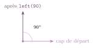
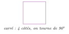
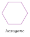
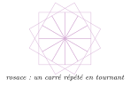

# Cours

<p class="sous-titre">Complément : dessiner avec la tortue</p>

<span id="chap-T" class="ancre"></span>

|  |  |
|:---|:---|
| **Programme** | Notions transversales de programmation : **séquence** d’instructions, **boucle bornée** (`for`), définition et appel de **fonctions** avec **paramètres** ; ici mises en œuvre en dessinant avec le module `turtle`. |
| **Idée** | Une « tortue » se déplace sur l’écran en traçant un trait derrière elle. En lui donnant des ordres simples (avance, tourne), on dessine des figures. `turtle` rend **visibles** les boucles et les fonctions : on *voit* la répétition à l’écran. |
| **Objectifs** | Piloter la tortue (avancer, tourner, lever et baisser le stylo) ; **répéter** un motif avec une boucle `for` ; calculer l’angle d’un **polygone régulier** ($360/n$) ; définir et appeler une **fonction** avec paramètres ; **colorier** une forme ; composer une **rosace**. |
| **Prérequis** | La boucle `for` et les fonctions (revoyez le cours « Les bases de Python » si besoin). |

!!! remarque "Remarque"

    **Un peu d’histoire.** La « tortue » vient du langage **Logo**, créé en 1967 par **Seymour Papert** et Wally Feurzeig. À l’origine, c’était un vrai petit robot en forme de tortue qui traçait au sol ! L’idée de Papert : on apprend le mieux en **fabriquant** des choses. Python a hérité de cette tortue.

    \*(image manquante : T_hist_tortue_logo)\*  
    Une tortue robot Logo qui trace au sol

    \*(image manquante : T_hist_papert)\*  
    Seymour Papert présente Logo (1987)

## Prendre la tortue en main

Tout programme commence par **importer** le module, et se termine par `turtle.done()` (qui garde la fenêtre du dessin ouverte).

```python
import turtle

turtle.forward(100)   # avance de 100 pas (pixels)
turtle.left(90)       # tourne de 90 degres vers la gauche
turtle.forward(100)

turtle.done()         # garde la fenetre ouverte
```

Écrire `turtle` devant chaque ordre est un peu long. On peut donner un **surnom** au module (ici `t`), ce qui allège tout le code :

```python
import turtle as t

t.forward(100)
t.left(90)
t.forward(100)
t.done()
```

### Les ordres essentiels

| **Ordre** | **Effet** |
|:---|:---|
| `forward(d)` | avance de `d` pas |
| `backward(d)` | recule de `d` pas |
| `left(a)` | tourne de `a` degrés vers la gauche |
| `right(a)` | tourne de `a` degrés vers la droite |
| `penup()` / `pendown()` | lever / baisser le stylo (se déplacer sans tracer) |
| `color("red")` | choisir la couleur du trait |
| `pensize(n)` | choisir l’épaisseur du trait |
| `circle(r)` | tracer un cercle de rayon `r` |

!!! remarque "Remarque"

    La tortue a une **position** et une **direction** (son « cap »). `left` et `right` ne font que changer le cap : le trait n’apparaît qu’avec `forward` (ou `backward`). Les angles sont en degrés.

{ .tikz loading=lazy }

<span id="cours-T-1" class="ancre"></span>

<span class="afaire">▶ Exercices d'application :</span> exercices **[1](exercices.md#ex-T-1) à [3](exercices.md#ex-T-3)** (premiers tracés)

## Répéter : la boucle `for`

Dessiner un carré « à la main », c’est écrire quatre fois la même chose :

```python
import turtle as t
t.forward(100)
t.left(90)
t.forward(100)
t.left(90)
t.forward(100)
t.left(90)
t.forward(100)
t.left(90)
t.done()
```

… mais **répéter**, c’est justement le rôle d’une boucle `for` ! Le même carré, en bien plus court :

```python
import turtle as t
for cote in range(4):
    t.forward(100)
    t.left(90)
t.done()
```

{ .tikz loading=lazy }

!!! regle "Règle 1 — Le secret des polygones réguliers"

    <span id="lex-polygoneT" class="ancre"></span>Pour fermer un polygone régulier à `n` côtés, la tortue doit avoir tourné en tout de $360^\circ$. À chaque sommet, elle tourne donc de $\dfrac{360}{n}$ degrés.

Un hexagone (6 côtés, on tourne de $360/6 = 60^\circ$) devient immédiat :

```python
import turtle as t
for cote in range(6):     # hexagone
    t.forward(80)
    t.left(60)
t.done()
```

{ .tikz loading=lazy }

<span id="cours-T-4" class="ancre"></span>

<span class="afaire">▶ Exercices d'application :</span> exercices **[4](exercices.md#ex-T-4) à [6](exercices.md#ex-T-6)** (les polygones réguliers)

## Réutiliser : les fonctions

Quand on veut redessiner une même forme plusieurs fois, on en fait une **fonction** avec un **paramètre** pour la régler (ici, la taille du côté).

```python
import turtle as t

def carre(cote):
    for i in range(4):
        t.forward(cote)
        t.left(90)

carre(50)
carre(100)     # on reutilise, avec une autre taille
t.done()
```

Encore mieux : une seule fonction pour **n’importe quel** polygone régulier, en appliquant la règle des $360/n$ degrés.

```python
def polygone(n, cote):
    for i in range(n):
        t.forward(cote)
        t.left(360 / n)

polygone(3, 100)   # triangle
polygone(8, 60)    # octogone
```

<span id="cours-T-7" class="ancre"></span>

<span class="afaire">▶ Exercices d'application :</span> exercice **[7](exercices.md#ex-T-7)** (une fonction pour le carré)

## Colorier une forme

Pour remplir une figure de couleur, on encadre son tracé par `begin_fill()` et `end_fill()`.

```python
import turtle as t
t.color("orange")
t.begin_fill()
for i in range(3):
    t.forward(120)
    t.left(120)
t.end_fill()
t.done()
```

<span id="cours-T-8" class="ancre"></span>

<span class="afaire">▶ Exercices d'application :</span> exercice **[8](exercices.md#ex-T-8)** (trois carrés colorés)

## Le plus joli : les rosaces

<span id="lex-rosaceT" class="ancre"></span> Une **rosace** s’obtient en répétant une même figure tout en **tournant** un peu à chaque fois. Ici, 12 carrés, pivotés de $360/12 = 30^\circ$ :

```python
import turtle as t

def carre(cote):
    for i in range(4):
        t.forward(cote)
        t.left(90)

for k in range(12):     # 12 carres...
    carre(100)
    t.left(30)          # ...pivotes de 30 degres
t.done()
```

{ .tikz loading=lazy }

<span id="cours-T-9" class="ancre"></span>

<span class="afaire">▶ Exercices d'application :</span> exercices **[9](exercices.md#ex-T-9) et [10](exercices.md#ex-T-10)** (les rosaces), défis **[11](exercices.md#ex-T-11) à [13](exercices.md#ex-T-13)**, exercice **[14](exercices.md#ex-T-14)** (critiquer une réponse d’IA)

!!! remarque "Remarque"

    On tient là toute la puissance du chapitre : une **fonction** (le motif), une **boucle** (la répétition) et un petit **tour** à chaque étape suffisent à produire des figures très riches. À vous de jouer sur la feuille d’exercices !

!!! remarque "Remarque — Liens avec d’autres chapitres"

    Ce complément réinvestit directement le chapitre *Les bases de Python* : la **boucle** `for` y répète un motif, et une **fonction** avec **paramètres** le rend réutilisable. À l’origine, la tortue de Logo était un vrai **robot** piloté par programme, dont les moteurs sont des **actionneurs**, comme ceux du chapitre *Informatique embarquée et objets connectés*. Enfin, la fenêtre où elle dessine est un quadrillage de **pixels** : au chapitre *Photographie numérique*, on colorie directement ces pixels, en codant chaque couleur en **RVB**.

## Bilan — la carte mémoire

| **Notion** | **À retenir** |
|:---|:---|
| Démarrer | `import turtle as t` au début, `t.done()` à la fin. |
| Avancer / reculer | `forward(d)` / `backward(d)` : le trait n’apparaît qu’en avançant. |
| Tourner | `left(a)` / `right(a)` : change seulement le **cap** (angles en degrés). |
| Répéter un motif | une boucle `for` : `for i in range(n):` puis le motif **indenté**. |
| Polygone régulier | `n` côtés $\to$ tourner de `360 / n` à chaque sommet. |
| Réutiliser un dessin | une **fonction** avec paramètre(s) : `def carre(cote):` … |
| Remplir de couleur | `color("red")`, puis `begin_fill()` … `end_fill()`. |
| Se déplacer sans tracer | `penup()` … `pendown()`. |
| Rosace | un motif répété en tournant un peu à chaque fois (tours $\times$ angle $= 360$). |

## Savoir-faire à maîtriser

*À la fin de ce complément, je sais…*

!!! autopos "Savoir-faire : je me positionne"

    - déplacer et orienter la tortue (avancer, tourner, lever et baisser le crayon) ;

    - **prédire** le dessin d’un court programme `turtle` ;

    - utiliser une boucle `for` pour **répéter** un motif ;

    - calculer l’angle dont tourne la tortue pour un **polygone régulier** ($360/n$) ;

    - définir et appeler une **fonction** avec des paramètres pour réutiliser une figure ;

    - **colorier** une forme fermée ;

    - construire une figure répétitive (**rosace**) en combinant boucle et fonction.
