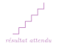
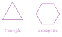
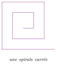
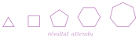

# Exercices

<p class="sous-titre">Complément : dessiner avec la tortue</p>

!!! consignes "Mode d’emploi"

    - Niveau : ★ échauffement, ★★ classique (niveau bac), ★★★ défi ; les *coups de pouce* et les *corrigés* se déplient sous chaque exercice.

    - <span class="run" title="À programmer et tester sur machine">▶</span> *À programmer et exécuter* sur machine. Commencez toujours par `import turtle as t` et terminez par `t.done()`.

    - **Réflexes** : une figure qui se répète $\rightarrow$ une boucle `for` ; un motif à réutiliser $\rightarrow$ une **fonction** ; un polygone à `n` côtés $\rightarrow$ on tourne de `360 / n`.

    - Usage de l’IA, indiqué sur chaque exercice : <span class="ia ia-rouge" title="Sans IA : le but est l'automatisme lui-même"></span> aucune ; <span class="ia ia-orange" title="IA en appui : déboguer, reformuler, vérifier ; la réponse finale est la vôtre"></span> en appui (déboguer, reformuler, vérifier ; la réponse finale est écrite et comprise par vous) ; <span class="ia ia-vert" title="IA intégrée : l'exercice s'appuie sur une réponse d'IA"></span> l’exercice s’appuie sur une réponse d’IA. Voir la charte d’usage de l’IA.

### Premiers tracés

### <span class="stars" title="Niveau 1 sur 3">★</span> <span class="exo-num">Exercice 1</span> — Le carré <span class="ia ia-rouge" title="Sans IA : le but est l'automatisme lui-même"></span> { #ex-T-1 }

<span class="run" title="À programmer et tester sur machine">▶</span> Dessiner un carré de côté `100` à l’aide d’une boucle `for` (4 côtés, on tourne de `90` à chaque fois).

{ .tikz loading=lazy }

??? corrige "Corrigé"

    !!! remarque "Remarque"

        Plusieurs écritures sont possibles ; on en donne une simple. Chaque programme suppose `import turtle as t` au début et `t.done()` à la fin. Rappel de la règle d’or : un polygone régulier à `n` côtés se ferme en tournant de `360 / n` à chaque sommet.

    ```python
    import turtle as t
    for i in range(4):
        t.forward(100)
        t.left(90)
    t.done()
    ```

### <span class="stars" title="Niveau 1 sur 3">★</span> <span class="exo-num">Exercice 2</span> — Le rectangle <span class="ia ia-rouge" title="Sans IA : le but est l'automatisme lui-même"></span> { #ex-T-2 }

<span class="run" title="À programmer et tester sur machine">▶</span> Dessiner un rectangle de `200` de large sur `100` de haut. *(Les quatre côtés ne sont pas tous égaux, mais on tourne toujours de `90`.)*

??? corrige "Corrigé"

    Deux longueurs et deux largeurs : on répète **deux fois** le couple « long côté / court côté ».

    ```python
    import turtle as t
    for i in range(2):
        t.forward(200)   # longueur
        t.left(90)
        t.forward(100)   # largeur
        t.left(90)
    t.done()
    ```

### <span class="stars" title="Niveau 1 sur 3">★</span> <span class="exo-num">Exercice 3</span> — L’escalier <span class="ia ia-rouge" title="Sans IA : le but est l'automatisme lui-même"></span> { #ex-T-3 }

<span class="run" title="À programmer et tester sur machine">▶</span> Dessiner un escalier de **5 marches** : une marche, c’est « avancer, tourner, avancer, tourner ». Utiliser une boucle qui répète 5 fois ce motif.

{ .tikz loading=lazy }

??? corrige "Corrigé"

    Chaque marche = un pas horizontal, un pas vertical. Après être monté, on se **remet** à l’horizontale avec `right(90)`.

    ```python
    import turtle as t
    for i in range(5):
        t.forward(40)   # horizontal
        t.left(90)
        t.forward(40)   # vertical
        t.right(90)     # on repart a l'horizontale
    t.done()
    ```

### Les polygones réguliers

### <span class="stars" title="Niveau 2 sur 3">★★</span> <span class="exo-num">Exercice 4</span> — Triangle et hexagone <span class="ia ia-rouge" title="Sans IA : le but est l'automatisme lui-même"></span> { #ex-T-4 }

<span class="run" title="À programmer et tester sur machine">▶</span> Dessiner un **triangle équilatéral** (3 côtés), puis un **hexagone** (6 côtés). Dans chaque cas, de combien de degrés faut-il tourner à chaque sommet ?

??? pouce "Coup de pouce"

    Pour revenir à son point de départ dans la même direction, la tortue doit avoir tourné de $360$ degrés en tout, répartis également entre les sommets.

{ .tikz loading=lazy }

??? corrige "Corrigé"

    Triangle : $360 / 3 = \mathbf{120}$ degrés. Hexagone : $360 / 6 = \mathbf{60}$ degrés.

    ```python
    import turtle as t
    for i in range(3):      # triangle equilateral
        t.forward(120)
        t.left(120)
    for i in range(6):      # hexagone
        t.forward(80)
        t.left(60)
    t.done()
    ```

### <span class="stars" title="Niveau 2 sur 3">★★</span> <span class="exo-num">Exercice 5</span> — L’étoile à cinq branches <span class="ia ia-orange" title="IA en appui : déboguer, reformuler, vérifier ; la réponse finale est la vôtre"></span> { #ex-T-5 }

<span class="run" title="À programmer et tester sur machine">▶</span> Dessiner une étoile à 5 branches.

??? pouce "Coup de pouce"

    Comme pour un polygone, on répète 5 fois « avancer, tourner ». Mais en traçant l’étoile, la tortue fait *deux* tours complets sur elle-même avant de revenir à son départ : $2 \times 360$ degrés en tout.

??? pouce "Coup de pouce 2 (début de solution)"

    On répète 5 fois : avancer, puis tourner de `144` degrés.

{ .tikz loading=lazy }

??? corrige "Corrigé"

    En tournant de `144` degrés à chaque pointe, on « saute » un sommet sur deux, ce qui trace l’étoile.

    ```python
    import turtle as t
    for i in range(5):
        t.forward(200)
        t.left(144)
    t.done()
    ```

### <span class="stars" title="Niveau 2 sur 3">★★</span> <span class="exo-num">Exercice 6</span> — Un polygone au choix <span class="ia ia-orange" title="IA en appui : déboguer, reformuler, vérifier ; la réponse finale est la vôtre"></span> { #ex-T-6 }

<span class="run" title="À programmer et tester sur machine">▶</span> Écrire une fonction `polygone(n, cote)` qui dessine un polygone régulier à `n` côtés de longueur `cote`. L’utiliser pour dessiner un triangle, un carré, puis un octogone.

??? pouce "Coup de pouce"

    Partez du carré (4 côtés, on tourne de `90`) : remplacez le nombre de côtés par `n` et l’angle par le calcul qui convient pour `n` côtés.

??? corrige "Corrigé"

    On remplace l’angle par `360 / n` : la même fonction dessine tous les polygones réguliers.

    ```python
    import turtle as t
    def polygone(n, cote):
        for i in range(n):
            t.forward(cote)
            t.left(360 / n)

    polygone(3, 100)   # triangle
    polygone(4, 100)   # carre
    polygone(8, 60)    # octogone
    t.done()
    ```

### Réutiliser et colorier

### <span class="stars" title="Niveau 2 sur 3">★★</span> <span class="exo-num">Exercice 7</span> — La fonction carré <span class="ia ia-orange" title="IA en appui : déboguer, reformuler, vérifier ; la réponse finale est la vôtre"></span> { #ex-T-7 }

<span class="run" title="À programmer et tester sur machine">▶</span> Écrire une fonction `carre(cote)` qui dessine un carré, puis l’appeler trois fois pour dessiner trois carrés de tailles différentes (par exemple $50$, $100$, $150$).

??? pouce "Coup de pouce"

    Placez la boucle du carré sous `def carre(cote):` (en la décalant vers la droite) et remplacez la longueur `100` par `cote`.

??? corrige "Corrigé"

    On définit `carre` une fois, puis on l’appelle avec des tailles différentes.

    ```python
    import turtle as t
    def carre(cote):
        for i in range(4):
            t.forward(cote)
            t.left(90)

    carre(50)
    carre(100)
    carre(150)
    t.done()
    ```

### <span class="stars" title="Niveau 2 sur 3">★★</span> <span class="exo-num">Exercice 8</span> — Trois carrés colorés <span class="ia ia-orange" title="IA en appui : déboguer, reformuler, vérifier ; la réponse finale est la vôtre"></span> { #ex-T-8 }

<span class="run" title="À programmer et tester sur machine">▶</span> Dessiner **trois carrés** côte à côte, remplis de trois couleurs différentes (par exemple rouge, vert, bleu).

??? pouce "Coup de pouce"

    Pour passer d’un carré au suivant **sans tracer de trait**, utilisez `t.penup()` puis `t.pendown()` ; pour remplir, encadrez le tracé par `t.begin_fill()` … `t.end_fill()`.

??? corrige "Corrigé"

    On fabrique un « carré plein » (couleur $+$ `begin_fill`/`end_fill`), et on déplace la tortue *sans tracer* entre deux carrés grâce à `penup`/`goto`/`pendown`.

    ```python
    import turtle as t
    def carre_plein(cote, couleur):
        t.color(couleur)
        t.begin_fill()
        for i in range(4):
            t.forward(cote)
            t.left(90)
        t.end_fill()

    x = -150
    for couleur in ["red", "green", "blue"]:
        t.penup()
        t.goto(x, 0)
        t.pendown()
        carre_plein(80, couleur)
        x = x + 100
    t.done()
    ```

### Répéter en tournant : les rosaces

### <span class="stars" title="Niveau 2 sur 3">★★</span> <span class="exo-num">Exercice 9</span> — Rosace de carrés <span class="ia ia-orange" title="IA en appui : déboguer, reformuler, vérifier ; la réponse finale est la vôtre"></span> { #ex-T-9 }

<span class="run" title="À programmer et tester sur machine">▶</span> En réutilisant la fonction `carre(cote)`, dessiner une rosace formée de **12 carrés**, chacun pivoté de `30` degrés par rapport au précédent. *(Pourquoi 30 ? Parce que $12 \times 30 = 360$.)*

??? pouce "Coup de pouce"

    Dans une boucle de 12 tours : on dessine un carré, puis on fait pivoter la tortue avant le carré suivant. Pensez à recopier la définition de `carre` au début du programme.

{ .tikz loading=lazy }

??? corrige "Corrigé"

    On réutilise `carre`, répété 12 fois en pivotant de `30` degrés ($12 \times 30 = 360$).

    ```python
    import turtle as t
    def carre(cote):
        for i in range(4):
            t.forward(cote)
            t.left(90)

    for k in range(12):
        carre(100)
        t.left(30)
    t.done()
    ```

### <span class="stars" title="Niveau 2 sur 3">★★</span> <span class="exo-num">Exercice 10</span> — Rosace de cercles <span class="ia ia-orange" title="IA en appui : déboguer, reformuler, vérifier ; la réponse finale est la vôtre"></span> { #ex-T-10 }

<span class="run" title="À programmer et tester sur machine">▶</span> La tortue sait tracer un cercle avec `t.circle(rayon)`. Dessiner une jolie « fleur » en répétant **18 cercles** de rayon `80`, en tournant un peu entre chacun. De combien faut-il tourner à chaque fois ?

??? pouce "Coup de pouce"

    Les 18 cercles doivent se répartir régulièrement sur un tour complet de $360$ degrés.

{ .tikz loading=lazy }

??? corrige "Corrigé"

    18 cercles répartis sur un tour complet : on tourne de $360 / 18 = \mathbf{20}$ degrés entre chaque.

    ```python
    import turtle as t
    for k in range(18):
        t.circle(80)
        t.left(20)
    t.done()
    ```

### Défis

### <span class="stars" title="Niveau 3 sur 3">★★★</span> <span class="exo-num">Exercice 11</span> — La maison <span class="ia ia-orange" title="IA en appui : déboguer, reformuler, vérifier ; la réponse finale est la vôtre"></span> { #ex-T-11 }

<span class="run" title="À programmer et tester sur machine">▶</span> Dessiner une maison : un **carré** pour la façade, surmonté d’un **triangle** pour le toit. *(Il faudra bien placer la tortue et choisir les bons angles pour le toit.)*

??? pouce "Coup de pouce"

    Dessinez la façade, puis amenez la tortue au coin haut-gauche. Le toit est un triangle équilatéral : réutilisez les angles trouvés à l’exercice « Triangle et hexagone ».

??? pouce "Coup de pouce 2 (début de solution)"

    `for i in range(4):`  
    `t.forward(100)`  
    `t.left(90)`  
    `t.left(90)`  
    `t.forward(100)`  
    (la tortue est au coin haut-gauche ; il reste à l’orienter vers le sommet du toit.)

{ .tikz loading=lazy }

??? corrige "Corrigé"

    On trace d’abord la façade (un carré). La tortue revient en bas à gauche ; on monte au coin haut-gauche, puis on pose un toit triangulaire (triangle équilatéral, angles de `120` degrés).

    ```python
    import turtle as t
    # La facade (carre de cote 100)
    for i in range(4):
        t.forward(100)
        t.left(90)
    # On monte au coin haut-gauche pour poser le toit
    t.left(90)
    t.forward(100)
    t.right(30)          # on vise le sommet du toit
    # Le toit (triangle equilateral)
    for i in range(3):
        t.forward(100)
        t.right(120)
    t.done()
    ```

### <span class="stars" title="Niveau 3 sur 3">★★★</span> <span class="exo-num">Exercice 12</span> — La spirale carrée <span class="ia ia-orange" title="IA en appui : déboguer, reformuler, vérifier ; la réponse finale est la vôtre"></span> { #ex-T-12 }

<span class="run" title="À programmer et tester sur machine">▶</span> Dessiner une spirale : on tourne toujours de `90` degrés, mais la longueur du côté **augmente** à chaque tour (par exemple `10, 20, 30, …`). Faites une vingtaine de segments.

??? pouce "Coup de pouce"

    Une boucle `for i in range(20)` ; la longueur du côté change à chaque tour, elle peut valoir par exemple `(i + 1) * 10`.

??? pouce "Coup de pouce 2 (début de solution)"

    `cote = 10`  
    `for i in range(20):`  
    `t.forward(cote)`  
    (il reste à tourner, puis à faire grandir `cote`.)

{ .tikz loading=lazy }

??? corrige "Corrigé"

    On garde l’angle à `90` degrés, mais on **augmente** la longueur du côté à chaque tour.

    ```python
    import turtle as t
    cote = 10
    for i in range(20):
        t.forward(cote)
        t.left(90)
        cote = cote + 10    # le cote grandit
    t.done()
    ```

### <span class="stars" title="Niveau 3 sur 3">★★★</span> <span class="exo-num">Exercice 13</span> — Du triangle à l’heptagone <span class="ia ia-orange" title="IA en appui : déboguer, reformuler, vérifier ; la réponse finale est la vôtre"></span> { #ex-T-13 }

<span class="run" title="À programmer et tester sur machine">▶</span> Dessiner, **côte à côte** sur une même ligne, un triangle, un carré, un pentagone, un hexagone et un heptagone (7 côtés), tous de côté `50`, en n’écrivant qu’**une seule** boucle pour enchaîner les cinq figures.

??? pouce "Coup de pouce"

    Réutilisez la fonction `polygone(n, cote)` de l’exercice « Un polygone au choix » dans une boucle où `n` prend les valeurs $3$ à $7$. Entre deux figures, déplacez la tortue sans tracer.

??? pouce "Coup de pouce 2 (début de solution)"

    `for n in range(3, 8):`  
    `polygone(n, 50)`  
    `t.penup()`  
    (il reste à avancer assez loin, puis à reposer le crayon.)

{ .tikz loading=lazy }

??? corrige "Corrigé"

    On réutilise la fonction `polygone(n, cote)` ; une seule boucle fait varier le nombre de côtés `n` de $3$ à $7$ (`range(3, 8)` s’arrête *avant* $8$). Après chaque figure, la tortue est revenue à son point de départ, dans la même direction (elle a tourné de $360$ degrés en tout) : on lève le crayon, on avance vers la droite, et on le repose.

    ```python
    import turtle as t

    def polygone(n, cote):
        for i in range(n):
            t.forward(cote)
            t.left(360 / n)

    for n in range(3, 8):
        polygone(n, 50)
        t.penup()          # on se deplace sans tracer
        t.forward(130)     # assez loin pour ne pas chevaucher
        t.pendown()
    t.done()
    ```

### Critiquer une réponse d’IA

### <span class="stars" title="Niveau 2 sur 3">★★</span> <span class="exo-num">Exercice 14</span> — Le pentagone de l’assistant <span class="ia ia-vert" title="IA intégrée : l'exercice s'appuie sur une réponse d'IA"></span> { #ex-T-14 }

<span class="run" title="À programmer et tester sur machine">▶</span> Un élève a demandé à un assistant d’IA : « Dessine un pentagone régulier de côté `100` avec `turtle`. » Voici la réponse obtenue :

```python
import turtle as t
# Un pentagone a 5 cotes et ses angles valent 108 degres
for i in range(5):
    t.forward(100)
    t.left(108)
t.done()
```

1.  La réponse est-elle correcte ? Avant d’exécuter, calculer de combien de degrés la tortue a tourné **en tout** à la fin de la boucle. Puis exécuter le programme : la figure est-elle fermée ?

2.  Localiser l’erreur et corriger le programme.

    ??? pouce "Coup de pouce"

        Pour que la figure se ferme, la somme de toutes les rotations doit valoir $360$ degrés. Combien vaut $5 \times 108$ ?

3.  Quelle vérification simple, faite *avant* de faire confiance à cette réponse, aurait suffi à détecter l’erreur ?

??? corrige "Corrigé"

    **1.** Non. La tortue tourne de $5 \times 108 = 540$ degrés en tout, et non $360$ : la figure ne se referme pas (la tortue termine loin de son point de départ, le cap retourné de $180$ degrés).  
    **2.** L’assistant a confondu l’**angle intérieur** du pentagone ($108$ degrés) avec l’angle dont la tortue doit **tourner** à chaque sommet. Règle du cours : pour fermer un polygone régulier à `n` côtés, elle tourne de `360 / n`, soit ici $360 / 5 = 72$ degrés. Il suffit de remplacer `t.left(108)` par `t.left(72)`.

    ```python
    import turtle as t
    for i in range(5):
        t.forward(100)
        t.left(72)      # 360 / 5
    t.done()
    ```

    **3.** Vérifier que la **somme des rotations** vaut $360$ degrés ($5 \times 108$ n’y est pas), ou simplement exécuter le programme et regarder si la figure se ferme.
