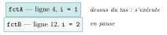

# Activités préparatoires

<p class="sous-titre">Récursivité</p>

## <span class="etiquette">Activité 1</span> Des appels qui s’empilent

*des post-it, des poupées russes et un miroir sans fin*

<p class="infos-activite">Durée : 25 min · Sans ordinateur, par deux</p>

!!! consignes "Consignes"

    - Matériel : une dizaine de post-it (ou de petits papiers). Les réponses s’écrivent sur le cahier.

    - Règle du jeu : l’un lit le programme ligne à ligne et annonce les affichages ; l’autre gère la **pile de post-it**. À chaque **appel** de fonction, on écrit sur un post-it le nom de la fonction et la ligne où il faudra reprendre, et on le pose **sur le dessus** du tas. Quand une fonction se termine, on **retire le post-it du dessus** et on reprend là où il l’indique.

### <span class="exo-num">Exercice 1</span> — Une fonction en appelle une autre <span class="ia ia-rouge" title="Sans IA : le but est l'automatisme lui-même"></span> { #ex-01-recursivite-act-1-1 }

```python
def fctA():
    print("Debut fctA")
    for i in range(3):
        print(f"fctA {i}")
    print("Fin fctA")

def fctB():
    print("Debut fctB")
    for i in range(3):
        if i == 2:
            fctA()
            print("Retour dans fctB")
        print(f"fctB {i}")
    print("Fin fctB")

fctB()
```

1.  Avec les post-it, prévoir l’affichage complet de ce programme (écrire une ligne par affichage).

2.  Dessiner la pile de post-it au moment où s’affiche `fctA 1` (le dessus du tas en haut).

3.  Pendant que `fctA` s’exécute, que fait `fctB` ? Quand `fctA` se termine, comment sait-on où reprendre ?

4.  Les deux fonctions ont une variable `i`. Faut-il noter sur le post-it de `fctB` la valeur de *son* `i` ? Les deux `i` sont-ils la même variable ?

??? corrige "Corrigé"

    1.  Affichage (vérifié à la machine) :

        ```text
        Debut fctB
        fctB 0
        fctB 1
        Debut fctA
        fctA 0
        fctA 1
        fctA 2
        Fin fctA
        Retour dans fctB
        fctB 2
        Fin fctB
        ```

    2.  Deux post-it : `fctA` (reprendre ligne 4, `i = 1`) au-dessus, `fctB` (reprendre ligne 12, `i = 2`) en dessous :

        { .tikz loading=lazy }

    3.  `fctB` est **en pause** : elle attend, sans rien faire, que `fctA` se termine. Le post-it de `fctB` indique la ligne où reprendre (ligne 12 : « Retour dans fctB ») : l’exécution reprend **exactement** là où elle s’était arrêtée.

    4.  Oui : pour reprendre correctement, `fctB` doit retrouver *son* `i` (ici $2$), puis afficher `fctB 2` et sortir de sa boucle. Les deux `i` sont des variables **distinctes** : chaque appel possède **ses propres variables locales**, que la boucle de `fctA` ne touche pas. C’est pourquoi on note les variables de chaque fonction sur son propre post-it.

### <span class="exo-num">Exercice 2</span> — Les poupées russes <span class="ia ia-rouge" title="Sans IA : le but est l'automatisme lui-même"></span> { #ex-01-recursivite-act-1-2 }

Une matriochka contient une poupée plus petite, qui en contient une plus petite… jusqu’à la plus petite, qui ne s’ouvre pas. On numérote les poupées de `1` (la plus petite) à `3` (la plus grande). La fonction ci-dessous décrit comment on les ouvre toutes puis on les referme ; elle **s’appelle elle-même**.

```python
def ouvrir(n):
    print("J'ouvre la poupee", n)
    if n > 1:
        ouvrir(n - 1)
    print("Je referme la poupee", n)

ouvrir(3)
```

1.  Avec les post-it (un post-it par appel : `ouvrir(3)`, `ouvrir(2)`…), prévoir l’affichage complet.

2.  Combien de post-it y a-t-il, au plus, en même temps sur le tas ? À quel moment ?

3.  La ligne 2 s’exécute-t-elle quand on « descend » vers les petites poupées ou quand on « remonte » ? Et la ligne 5 ?

4.  Prévoir l’affichage de `ouvrir(1)`, puis dire combien de lignes affiche `ouvrir(10)`.

??? corrige "Corrigé"

    1.  Affichage (vérifié à la machine) :

        ```text
        J'ouvre la poupee 3
        J'ouvre la poupee 2
        J'ouvre la poupee 1
        Je referme la poupee 1
        Je referme la poupee 2
        Je referme la poupee 3
        ```

    2.  Trois post-it au plus (`ouvrir(3)`, `ouvrir(2)`, `ouvrir(1)`), au moment où l’on ouvre la poupée 1 : c’est le fond de la descente.

    3.  La ligne 2 (« J’ouvre ») s’exécute **à la descente**, dans l’ordre des appels ($3, 2, 1$). La ligne 5 (« Je referme ») s’exécute **à la remontée**, quand on retire les post-it, donc dans l’ordre inverse ($1, 2, 3$).

    4.  `ouvrir(1)` affiche « J’ouvre la poupee 1 » puis « Je referme la poupee 1 » (pas d’appel, car $1 > 1$ est faux). `ouvrir(10)` affiche $20$ lignes : $10$ ouvertures puis $10$ fermetures.

### <span class="exo-num">Exercice 3</span> — Le miroir sans fin <span class="ia ia-rouge" title="Sans IA : le but est l'automatisme lui-même"></span> { #ex-01-recursivite-act-1-3 }

On retire le test `if n > 1` : la fonction devient la suivante.

```python
def boucle():
    print("un tres mauvais exemple")
    boucle()

boucle()
```

1.  Jouer quelques étapes avec les post-it. Que devient le tas ? Le jeu peut-il s’arrêter ?

2.  Un ordinateur a une mémoire limitée (Python n’accepte qu’environ $1\,000$ post-it). Que va-t-il se passer selon vous ?

3.  Dans `ouvrir`, quelle ligne empêchait ce problème ? Pourquoi la suite d’appels finissait-elle par s’arrêter ?

??? corrige "Corrigé"

    1.  Le tas grandit d’un post-it à chaque étape et on n’en retire jamais : le jeu ne s’arrête pas.

    2.  L’ordinateur finit par manquer de place : Python s’arrête sur une erreur

        ```text
        RecursionError: maximum recursion depth exceeded
        ```

    3.  Le test `if n > 1` : quand `n` vaut `1`, on n’appelle plus `ouvrir`. Comme `n` diminue de $1$ à chaque appel, on finit forcément par atteindre $1$.

### <span class="exo-num">Exercice 4</span> — Mettre des mots <span class="ia ia-rouge" title="Sans IA : le but est l'automatisme lui-même"></span> { #ex-01-recursivite-act-1-4 }

1.  Proposer sur le cahier un nom (un mot ou deux) pour chacune des notions rencontrées :

    - le tas de post-it, géré par l’ordinateur ;

    - poser un post-it sur le tas / retirer celui du dessus ;

    - une fonction qui s’appelle elle-même ;

    - le cas où la fonction ne s’appelle plus (la plus petite poupée).

2.  Recopier et compléter les phrases suivantes avec vos mots.

    - Quand une fonction en appelle une autre, la première…

    - Les instructions écrites *après* l’appel s’exécutent…

    - Pour qu’une fonction qui s’appelle elle-même s’arrête, il faut…

??? corrige "Corrigé"

    1.  Propositions possibles, puis mots du cours :

        | **Notion** | **Propositions fréquentes** | **Mot du cours** |
        |:---|:---|:---|
        | le tas de post-it | tas, file, liste d’attente | **pile d’exécution** (ou pile d’appels) |
        | poser / retirer le post-it du dessus | ajouter, enlever | **empiler** / **dépiler** |
        | fonction qui s’appelle elle-même | fonction miroir, boucle | **fonction récursive** |
        | cas où l’on ne s’appelle plus | la fin, le dernier | **condition d’arrêt** (**cas de base**) |

        On retire toujours le *dernier* posé : c’est une pile, et non une file (lien avec le chapitre « structures linéaires »).

    2.  Quand une fonction en appelle une autre, la première est **mise en pause** et reprend là où elle s’était arrêtée. Les instructions écrites après l’appel s’exécutent **au retour**, dans l’ordre inverse des appels. Pour qu’une fonction qui s’appelle elle-même s’arrête, il faut un **cas où elle ne s’appelle plus**, et que chaque appel s’en **rapproche**.
