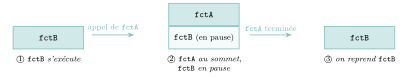
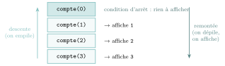
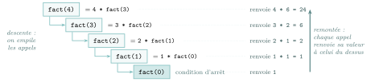
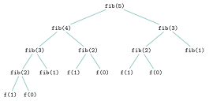
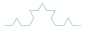
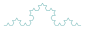

# Cours

<p class="sous-titre">Récursivité</p>

<span id="chap-01" class="ancre"></span>

|  |  |
|:---|:---|
| **Programme (BO)** | *« Écrire un programme récursif. Analyser le fonctionnement d’un programme récursif. Des exemples relevant de domaines variés sont à privilégier. »* La récursivité irrigue toute la fin de l’année : arbres, « diviser pour régner », retour sur trace. |
| **Prérequis** | fonctions et paramètres, listes, chaînes de caractères, notion de coût. |
| **Objectifs** | *savoir écrire* une fonction récursive (méthode) et *savoir l’analyser* (trace, pile, terminaison, coût). |

## Une fonction peut en appeler une autre

Une fonction peut en appeler une *autre*. Dans le programme ci-dessous, l’appel `fctB()` affiche `Debut fctB`, puis `fctA` (tout l’affichage de `fctA`), puis `Fin fctB` :

```python
def fctA():
    print("fctA")

def fctB():
    print("Debut fctB")
    fctA()
    print("Fin fctB")
```

La chose essentielle à observer : l’exécution de `fctB` est **interrompue** pendant celle de `fctA`, puis **reprend exactement où elle s’était arrêtée**. Pour gérer cela, le système utilise une **pile d’exécution**.

!!! definition "Définition 1 — Pile d’exécution"

    La *pile d’exécution* enregistre les fonctions en cours d’exécution. Les appels « s’empilent » les uns sur les autres. La fonction située **au sommet** est celle qui s’exécute ; toutes celles « en dessous » sont **en pause**. Quand une fonction se termine, elle est **dépilée**, et l’exécution reprend dans celle qui est désormais au sommet.

{ .tikz loading=lazy }

La pile ne retient pas seulement « quelle fonction » : elle conserve aussi **où reprendre** (la prochaine instruction) et la **valeur des variables locales**. Ainsi, si `fctA` et `fctB` utilisent chacune une variable `i`, ces deux variables portent le même nom mais sont **indépendantes** : chaque appel possède ses propres variables.

!!! remarque "Remarque"

    Rien n’interdit qu’une fonction s’appelle... **elle-même**. C’est tout l’objet de ce chapitre.

## Une fonction qui s’appelle elle-même

!!! definition "Définition 2 — Fonction récursive"

    Une fonction est dite **récursive** lorsqu’elle s’appelle elle-même dans son propre corps.

Une fonction qui s’appelle elle-même *sans condition* ne s’arrête jamais : chaque appel empile un nouvel appel, **sans jamais rien dépiler**, et la pile grandit jusqu’à ce que Python s’arrête sur une erreur :

```text
RecursionError: maximum recursion depth exceeded
```

Pour éviter cela, il faut une **condition d’arrêt**.

!!! regle "Règle 1 — La règle d’or"

    Toute fonction récursive **doit** contenir une **condition d’arrêt** (aussi appelée **cas de base**) : un cas simple, traité *sans* appel récursif, qui met fin à l’enchaînement des appels. Sans elle, la récursion ne s’arrête jamais.

!!! definition "Définition 3 — Condition d’arrêt et cas récursif"

    - la **condition d’arrêt** (ou **cas de base**) : le ou les cas où l’on sait répondre *directement* (`if n == 0 : return ...`) ;

    - le **cas récursif** : les autres cas, où la fonction s’appelle elle-même sur un problème **plus petit**, qui se rapproche de la condition d’arrêt.

!!! exemple "Exemple — Prévoyez l’affichage, puis vérifiez à la machine"

    ```python
    def compte(n):
        if n > 0:          # cas recursif
            compte(n - 1)
            print(n)
        # condition d'arret : n == 0, on ne fait rien

    compte(3)
    ```

    ??? corrige "Correction"

        Suivons les appels, puis les « dépilements » :

        - `compte(3)` : $3>0$ $\rightarrow$ appelle `compte(2)` (le `print` attendra !)

        - `compte(2)` : $2>0$ $\rightarrow$ appelle `compte(1)`

        - `compte(1)` : $1>0$ $\rightarrow$ appelle `compte(0)`

        - `compte(0)` : condition d’arrêt, **on dépile** $\rightarrow$ retour dans `compte(1)` : affiche `1`

        - on dépile $\rightarrow$ `compte(2)` : affiche `2`

        - on dépile $\rightarrow$ `compte(3)` : affiche `3`

        L’affichage est donc `1 2 3`. C’est contre-intuitif : le `print(n)` est *écrit après* l’appel récursif, il ne s’exécute donc qu’**au retour**, dans l’ordre inverse des appels.

{ .tikz loading=lazy }

!!! regle "Règle 2 — Avant ou après l’appel ?"

    Le code placé **avant** l’appel récursif s’exécute « à la descente » (dans l’ordre des appels) ; le code placé **après** s’exécute « à la remontée » (dans l’ordre inverse). Déplacer une ligne d’un côté à l’autre change complètement le résultat.

<span id="cours-01-1" class="ancre"></span>

<span class="afaire">▶ Exercices d'application :</span> exercices **[1](exercices.md#ex-01-1) à [4](exercices.md#ex-01-4)** (comprendre et analyser une récursion)

## Écrire une fonction récursive : une méthode

La récursivité prolonge une idée mathématique bien connue : le **raisonnement par récurrence**, où l’on définit un terme à partir du ou des précédents.

!!! regle "Règle 3 — Les trois questions"

    Pour écrire une fonction récursive, on se pose toujours :

    1.  **Quelle est la condition d’arrêt ?** (le cas de base : le cas le plus simple, réponse immédiate)

    2.  **Comment se rapprocher de la condition d’arrêt ?** (l’appel récursif porte sur un problème *strictement plus petit*)

    3.  **Comment combiner** le résultat de l’appel récursif pour obtenir la réponse ?

### Exemple fil rouge : la factorielle

En mathématiques, $n! = n \times (n-1) \times \dots \times 2 \times 1$, avec par convention $0! = 1$. On remarque que $n! = n \times (n-1)!$. Cette définition *est déjà récursive* :

- condition d’arrêt : $0! = 1$ ;

- cas récursif : $n! = n \times (n-1)!$.

```python
def fact(n):
    if n == 0:          # 1. condition d'arret
        return 1
    else:               # 3. on combine (x n) ...
        return n * fact(n - 1)   # 2. ... le probleme plus petit
```

La fonction **recopie mot pour mot** la définition mathématique : c’est la grande force de la récursivité.

{ .tikz loading=lazy }

### Des exemples de domaines variés

Le programme demande explicitement des exemples *variés*. En voici quatre, tous bâtis sur les trois mêmes questions.

!!! exemple "Exemple — Somme des entiers de $1$ à $n$"

    ```python
    def somme(n):
        if n == 0:
            return 0
        else:
            return n + somme(n - 1)
    ```

    Condition d’arrêt : `somme(0) = 0`. Cas récursif : `somme(n) = n + somme(n-1)`.

!!! exemple "Exemple — Somme des éléments d’une liste — récursion « sur les données »"

    Ici, « plus petit » signifie **une liste plus courte**.

    ```python
    def somme_liste(tab):
        if tab == []:
            return 0
        else:
            return tab[0] + somme_liste(tab[1:])
    ```

!!! exemple "Exemple — Puissance $x^n$"

    ```python
    def puissance(x, n):
        if n == 0:
            return 1
        else:
            return x * puissance(x, n - 1)
    ```

!!! exemple "Exemple — La légende de l’échiquier"

    Sur la $1^{\text{re}}$ case, on pose $1$ grain de riz ; sur chaque case suivante, on *double*. Combien de grains sur la case $n$ ?

    ```python
    def grains(case):
        if case == 1:
            return 1
        else:
            return 2 * grains(case - 1)
    ```

    Un problème « de la vie courante » qui donne pourtant une croissance vertigineuse : `grains(64)` dépasse $9 \times 10^{18}$.

!!! exemple "Exemple — La suite de Fibonacci"

    La suite de **Fibonacci** est définie par $u_0 = 0$, $u_1 = 1$ et $u_n = u_{n-1} + u_{n-2}$. Écrire une fonction récursive `fib(n)` qui renvoie $u_n$.

    ??? corrige "Correction"

        Il y a ici **deux** conditions d’arrêt ($n=0$ et $n=1$) et **deux** appels récursifs :

        ```python
        def fib(n):
            if n == 0:          # 1re condition d'arret
                return 0
            elif n == 1:        # 2e condition d'arret
                return 1
            else:
                return fib(n - 1) + fib(n - 2)
        ```

        On obtient `0, 1, 1, 2, 3, 5, 8, 13, 21, 34, 55` pour `n` allant de 0 à 10.

<span id="cours-01-5" class="ancre"></span>

<span class="afaire">▶ Exercices d'application :</span> exercices **[5](exercices.md#ex-01-5) à [23](exercices.md#ex-01-23)** (écrire des fonctions récursives : nombres, chaînes, listes, dénombrement)

## Analyser une fonction récursive

Savoir écrire ne suffit pas : le programme demande de **savoir analyser**. Trois questions reviennent : *est-ce que ça s’arrête ?*, *est-ce que c’est juste ?*, *combien ça coûte ?*

### La terminaison

!!! definition "Définition 4 — Variant"

    Un **variant** est une quantité entière **positive** qui **décroît strictement** à chaque appel récursif. S’il en existe un, la suite d’appels ne peut pas être infinie : elle atteint forcément la condition d’arrêt.

!!! propriete "Propriété 1 — Terminaison de somme"

    Pour tout entier $n \geqslant 0$, l’appel `somme(n)` (défini plus haut) se termine.

!!! demonstration "Démonstration"

    Prenons pour **variant** l’entier $n$ passé en paramètre, et montrons qu’il remplit les trois conditions.

    - **Il est positif.** On appelle `somme` au départ avec $n \geqslant 0$ ; comme on ne fait un appel récursif que dans le cas $n \neq 0$ (donc $n \geqslant 1$), l’appel suivant se fait avec $n-1 \geqslant 0$. Le paramètre reste donc toujours $\geqslant 0$.

    - **Il décroît strictement.** Le seul appel récursif est `somme(n-1)` : à chaque étape, le paramètre diminue exactement de $1$, donc $n-1 < n$.

    - **Il atteint la condition d’arrêt.** Une suite d’entiers positifs qui décroît strictement ne peut pas être infinie. Partant de $n$, après exactement $n$ appels on obtient le paramètre $0$ : c’est la **condition d’arrêt**, qui renvoie $0$ *sans* appel récursif et arrête la descente.

    La suite des appels est donc finie : l’appel `somme(n)` se termine.

!!! remarque "Remarque"

    On retrouve exactement le raisonnement attendu au bac : *« décrire ce qui garantit la terminaison de la fonction récursive »* (sujet Métropole 2025, jour 2 : la longueur du tableau traité diminue à chaque appel). Attention aussi à la condition d’arrêt mal choisie : `fact` écrite avec `if n == 1` au lieu de `if n == 0` *boucle* sur `fact(-1)`, `fact(-2)`… si on l’appelle sur `fact(0)`. La condition d’arrêt doit être **réellement atteinte** par le variant.

### Le coût : l’exemple frappant de Fibonacci

La fonction `fib` écrite plus haut est correcte, mais **terriblement lente**. La raison : chaque appel déclenche **deux** appels, et les mêmes calculs sont refaits un très grand nombre de fois. Dessinons l’**arbre des appels** de `fib(5)` :

{ .tikz loading=lazy }

On voit que `fib(2)` est recalculé **trois** fois, `fib(3)` deux fois… Le nombre d’appels est multiplié par environ $1{,}6$ quand $n$ augmente de $1$ (il fait plus que **doubler** quand $n$ augmente de $2$) : le coût est **exponentiel**.

!!! remarque "Remarque"

    Concrètement : `fib(40)` demande plus de $330$ millions d’appels ($331\,160\,281$ exactement) et met plusieurs *dizaines de secondes*, là où une version itérative (avec une boucle) répond en quelques *microsecondes*. Retenez cet ordre de grandeur : une fonction récursive peut être élégante **et** inutilisable.

Une manière efficace de calculer $u_n$ malgré tout sera étudiée dans le chapitre de **programmation dynamique**.

## Récursif ou itératif ?

Toute fonction récursive peut se réécrire de façon **itérative** (avec des boucles), et réciproquement. Le choix se fait selon la **lisibilité** et le **coût**.

!!! exemple "Exemple — Un grand classique du bac : le palindrome"

    Écrire une fonction qui teste si une chaîne est un palindrome (mot lu pareil dans les deux sens, comme « radar »), d’abord en récursif, puis en itératif.

    ??? corrige "Correction"

        **Version récursive** (on « épluche » la chaîne par les deux bouts) :

        ```python
        def tester_palindrome(chaine):
            if len(chaine) < 2:              # condition d'arret : 0 ou 1 caractere
                return True
            elif chaine[0] != chaine[-1]:    # bords differents : pas un palindrome
                return False
            else:
                return tester_palindrome(chaine[1:-1])   # on enleve les deux bords
        ```

        **Version itérative** (deux indices qui se rapprochent) :

        ```python
        def est_palindrome(chaine):
            i = 0
            j = len(chaine) - 1
            while i < j:
                if chaine[i] != chaine[j]:
                    return False
                i = i + 1
                j = j - 1
            return True
        ```

        Les deux renvoient `True` pour `"radar"` et `False` pour `"rader"`.

|  | **Récursif** | **Itératif** |
|:---|:---|:---|
| Lisibilité | colle à la définition « les deux bords + le reste » | suit un balayage classique |
| Mémoire | empile un appel par caractère | un seul cadre, deux indices |
| Terminaison | la chaîne raccourcit (variant) | `j - i` décroît |

!!! remarque "Remarque"

    Le bac aime aussi les **limites** : `tester_palindrome(53235)` *échoue*, car `len` ne s’applique pas à un entier. Une fonction n’est correcte que pour le **type de données** qu’elle attend.

!!! regle "Règle 4 — Comment choisir ?"

    - la version **récursive** gagne quand le problème est *lui-même récursif* (arbres, fractales, diviser pour régner) : le code est alors bien plus court et clair ;

    - la version **itérative** gagne quand la récursion coûterait cher en appels répétés (Fibonacci naïf) ou en profondeur de pile.

<span id="cours-01-24" class="ancre"></span>

<span class="afaire">▶ Exercices d'application :</span> exercice **[24](exercices.md#ex-01-24)** (récursif ou itératif ?)

## La récursivité dans les dessins (Turtle)

La récursivité produit naturellement les **fractales** : des figures qui se répètent à toutes les échelles.

!!! exemple "Exemple — Testez, puis expliquez le rôle des paramètres longueur et n"

    ```python
    import turtle as t

    def koch(longueur, n):
        if n == 0:                 # condition d'arret : un simple segment
            t.forward(longueur)
        else:                      # cas recursif : 4 flocons plus petits
            koch(longueur / 3, n - 1)
            t.left(60)
            koch(longueur / 3, n - 1)
            t.right(120)
            koch(longueur / 3, n - 1)
            t.left(60)
            koch(longueur / 3, n - 1)
    ```

    ??? corrige "Correction"

        `longueur` est la longueur du segment à tracer ; à chaque niveau, on la divise par 3 pour tracer quatre segments trois fois plus petits. `n` est le **niveau de détail** : pour `n = 0`, on trace un simple segment ; sinon, on remplace le segment par quatre courbes de niveau `n - 1`.

        { .tikz .tikz-inline loading=lazy }{ .tikz .tikz-inline loading=lazy }{ .tikz .tikz-inline loading=lazy }{ .tikz .tikz-inline loading=lazy }

        La courbe de Koch pour `n = 0, 1, 2, 3` : chaque segment est remplacé par quatre segments trois fois plus petits.

        Le paramètre `n` est ici le **variant** : il décroît d’un cran à chaque niveau et garantit l’arrêt lorsqu’il atteint la condition d’arrêt `n == 0`.

<span id="cours-01-25" class="ancre"></span>

<span class="afaire">▶ Exercices d'application :</span> exercices **[25](exercices.md#ex-01-25) à [28](exercices.md#ex-01-28)** (dessins récursifs en Turtle)

## Ouverture : la récursivité, partout au programme

Ce chapitre est une **clé** pour toute la fin de l’année. On la retrouve dès qu’une structure ou une méthode est « faite de copies plus petites d’elle-même ».

- **Structures récursives : les arbres.** Un arbre est un nœud reliant des *sous-arbres*. Presque tout algorithme sur les arbres est récursif (*ex.* bac Polynésie 2023, jour 2 : `maximum(abr)` qui descend dans le sous-arbre droit).

- **Diviser pour régner : le tri fusion.** On coupe la liste en deux, on trie *récursivement* chaque moitié, puis on fusionne (*ex.* bac Liban 2023, jour 2). Coût $n\log_2 n$ au lieu de $n^2$. *(Tout un chapitre y est consacré : **Diviser pour régner**.)*

- **Retour sur trace (*backtracking*) : le Sudoku.** On essaie, on poursuit récursivement, on **revient en arrière** au premier échec (voir le projet Sudoku en fin de chapitre).

!!! remarque "Remarque — Un peu d’histoire"

    En **1883**, le mathématicien français **Édouard Lucas** publie, sous le pseudonyme de « N. Claus de Siam » (anagramme de « Lucas d’Amiens »), le casse-tête des **tours de Hanoï** : déplacer une pile de disques d’un piquet à un autre, un disque à la fois, sans jamais poser un disque sur un plus petit. La solution est récursive par nature : pour déplacer $n$ disques, on déplace les $n-1$ du dessus sur le piquet intermédiaire, puis le grand disque, puis à nouveau les $n-1$ disques par-dessus — soit $2^n-1$ déplacements. La récursivité n’entre dans les langages de programmation qu’en **1958–1960**, avec **Lisp**, créé par **John McCarthy** (qui a aussi forgé l’expression « intelligence artificielle ») : en Lisp, presque tout s’écrit par des fonctions récursives. Algol 60 l’adopte aussitôt, puis presque tous les langages, dont Python.

    \*(image manquante : 01_hist_hanoi_lucas)\*  
    Les tours de Hanoï (É. Lucas, 1883)

    \*(image manquante : 01_hist_mccarthy)\*  
    John McCarthy en 2006

!!! remarque "Remarque — Au bac, on vous demandera surtout de…"

    - **justifier** qu’une fonction est récursive, et pourquoi elle **se termine** (variant) ;

    - **dérouler** une trace d’exécution / compter les appels ;

    - **compléter** l’appel récursif dans une fonction donnée ;

    - comparer une version **récursive** et une version **itérative**.

!!! remarque "Remarque — Liens avec d’autres chapitres"

    La récursivité est la clé de presque toute la suite du programme : les **arbres** (structure récursive), la méthode **diviser pour régner**, le parcours des **graphes** en profondeur, et la **programmation dynamique** (qui mémorise les appels récursifs). Chaque appel en attente est empilé dans la **pile d’appels** : c’est exactement la structure **pile** que vous étudierez au chapitre « structures linéaires ». Savoir si *n’importe quel* programme atteint sa condition d’arrêt est en revanche impossible : c’est le **problème de l’arrêt**, qui sera étudié au chapitre « calculabilité ».

## Bilan — la carte mémoire

| **Notion** | **À retenir** |
|:---|:---|
| Fonction récursive | elle s’appelle elle-même |
| Condition d’arrêt (cas de base) | réponse immédiate, **obligatoire**, sinon pas d’arrêt |
| Cas récursif | appel sur un problème **strictement plus petit** |
| Pile d’exécution | empile un cadre par appel ; « au sommet » = en cours |
| Terminaison | assurée par un **variant** (entier $\geqslant 0$ qui décroît) |
| Coût | attention aux **appels répétés** (Fibonacci : exponentiel) |
| Récursif vs itératif | récursif = lisible sur les structures récursives |

## Erreurs fréquentes

- **Oublier la condition d’arrêt.** La fonction s’appelle indéfiniment (`RecursionError : maximum recursion depth`). *Le réflexe :* écrire le **cas de base en premier**.

- **Une condition d’arrêt jamais atteinte.** L’appel récursif ne *rapproche* pas du cas de base (mauvais sens, argument qui ne décroît pas) : même effet qu’un oubli. *Le réflexe :* vérifier qu’un **variant** décroît strictement.

- **Oublier le `return` devant l’appel récursif.** Le résultat est calculé mais jamais renvoyé, la fonction renvoie `None`. *Le réflexe :* `return n * factorielle(n-1)`, et non `factorielle(n-1)` seul.

- **Ne pas combiner le résultat de l’appel.** On oublie l’opération qui relie le sous-problème au problème (le `n *`, le `+ 1`, la concaténation…).

- **Croire que « chaque appel repart de zéro ».** Les appels s’**empilent** ; chaque cadre possède ses **propres** variables locales. Dérouler la pile lève le doute.

- **La récursivité naïve qui recalcule.** `fibonacci(n)` relance deux fois les mêmes calculs $\Rightarrow$ coût **exponentiel**. *Le réflexe :* repérer les **appels répétés** (on apprendra à les éviter au chapitre *Programmation dynamique*).

## Savoir-faire à maîtriser

*À la fin du chapitre, je sais…*

- identifier le **cas de base** et le **cas récursif** d’une fonction donnée $\to$ ex. [1](exercices.md#ex-01-1), [3](exercices.md#ex-01-3) ;

- écrire une fonction récursive sur les **entiers** (factorielle, somme, puissance, PGCD) $\to$ ex. [6](exercices.md#ex-01-6), [7](exercices.md#ex-01-7), [10](exercices.md#ex-01-10) ;

- écrire une fonction récursive sur une **chaîne** ou un **tableau** (compter, inverser, somme / maximum, recherche) $\to$ ex. [14](exercices.md#ex-01-14), [15](exercices.md#ex-01-15), [17](exercices.md#ex-01-17) ;

- **dérouler** la trace des appels (pile d’exécution) et donner le résultat $\to$ ex. [1](exercices.md#ex-01-1), [2](exercices.md#ex-01-2) ;

- **compter** le nombre d’appels effectués par une fonction récursive $\to$ ex. [4](exercices.md#ex-01-4), [33](exercices.md#ex-01-33) ;

- **justifier la terminaison** en exhibant un **variant** $\to$ ex. [2](exercices.md#ex-01-2), [33](exercices.md#ex-01-33) ;

- passer d’une version **récursive** à une version **itérative** (et inversement) $\to$ ex. [24](exercices.md#ex-01-24), [29](exercices.md#ex-01-29) ;

- reconnaître le **coût** d’une récursion et le piège des **appels répétés** $\to$ ex. [4](exercices.md#ex-01-4), [30](exercices.md#ex-01-30).

## Vers le Grand Oral

Quelques pistes de questions que ce chapitre permet de préparer (à étayer d’un exemple concret et, si possible, d’un schéma ou d’une petite démonstration) :

- **Une fonction qui s’appelle elle-même : comment peut-elle s’arrêter ?** *(cas de base, variant, pile d’appels ; plus largement, la terminaison d’un algorithme.)*

- **Récursif ou itératif : faut-il choisir ?** *(lisibilité contre coût mémoire de la pile ; le cas de Fibonacci, des appels répétés à la mémoïsation.)*

- **Où se cache la récursivité en dehors des mathématiques ?** *(fractales, arborescence de fichiers, tri fusion, retour sur trace du Sudoku, structure arborescente d’une page Web.)*

- **Quels sont les avantages et les limites du récursif en informatique ?** *(le catastrophique : Fibonacci naïf, exponentiel pour rien ; le nécessaire : les tours de Hanoï, coûteuses mais sans solution plus simple ; le génial : le tri fusion, $n\log_2 n$ au lieu de $n^2$.)*
