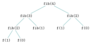
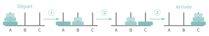
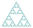
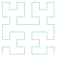
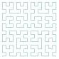
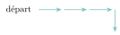
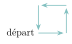
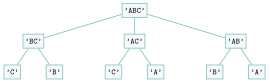

# Exercices

<p class="sous-titre">Récursivité</p>

!!! consignes "Mode d’emploi"

    - Niveau : ★ échauffement, ★★ classique (niveau bac), ★★★ défi ; les *coups de pouce* et les *corrigés* se déplient sous chaque exercice.

    - <span class="run" title="À programmer et tester sur machine">▶</span> *À programmer et tester* en Python (console ou éditeur en ligne).

    - **Réflexe** pour chaque fonction : **(1)** quelle est la **condition d’arrêt** (cas de base) ? **(2)** comment se **rapprocher** de la condition d’arrêt ? **(3)** comment **combiner** le résultat de l’appel récursif ?

    - Usage de l’IA, indiqué sur chaque exercice : <span class="ia ia-rouge" title="Sans IA : le but est l'automatisme lui-même"></span> aucune ; <span class="ia ia-orange" title="IA en appui : déboguer, reformuler, vérifier ; la réponse finale est la vôtre"></span> en appui (déboguer, reformuler, vérifier ; la réponse finale est écrite et comprise par vous) ; <span class="ia ia-vert" title="IA intégrée : l'exercice s'appuie sur une réponse d'IA"></span> l’exercice s’appuie sur une réponse d’IA. Voir la [charte d’usage de l’IA](../charte.md).

!!! remarque "Remarque"

    Le **retour sur trace** (*backtracking*) et le **Sudoku** sont traités dans le **projet Sudoku** proposé en fin de chapitre : ils ne sont pas repris ici.

### Comprendre et analyser

*Ici on ne programme pas (ou peu) : on **lit**, on **déroule** et on **justifie**. C’est la moitié « analyser » du programme.*

### <span class="stars" title="Niveau 1 sur 3">★</span> <span class="exo-num">Exercice 1</span> — Avant ou après l’appel ? <span class="ia ia-rouge" title="Sans IA : le but est l'automatisme lui-même"></span> { #ex-01-1 }

Sans machine, donner ce qu’affichent `a(3)` puis `b(3)`. Expliquer la différence.

```python
def a(n):
    if n > 0:
        print(n)
        a(n - 1)

def b(n):
    if n > 0:
        b(n - 1)
        print(n)
```

??? corrige "Corrigé"

    !!! remarque "Remarque"

        Plusieurs écritures sont souvent possibles : on donne **une** version simple.

    `a(3)` affiche `3 2 1` ; `b(3)` affiche `1 2 3`.

    Dans `a`, le `print` est *avant* l’appel récursif : il s’exécute « à la descente », dans l’ordre des appels ($3, 2, 1$). Dans `b`, le `print` est *après* : il s’exécute « à la remontée », donc dans l’ordre inverse ($1, 2, 3$).

### <span class="stars" title="Niveau 2 sur 3">★★</span> <span class="exo-num">Exercice 2</span> — Dérouler une trace <span class="ia ia-rouge" title="Sans IA : le but est l'automatisme lui-même"></span> { #ex-01-2 }

On donne la fonction ci-dessous.

```python
def mystere(n):
    if n > 1:
        mystere(n // 2)
    print(n)
```

1.  Donner, dans l’ordre, ce qu’affiche l’appel `mystere(20)`.

    ??? pouce "Coup de pouce"

        Le `print` est-il placé avant ou après l’appel récursif ? Écrire d’abord la suite des valeurs de `n` à la descente, puis se demander dans quel ordre les affichages se font.

2.  Que calcule, en une phrase, la fonction `mystere` ?

3.  Proposer un **variant** et justifier que la fonction **se termine** toujours.

??? corrige "Corrigé"

    Le `print(n)` étant *après* l’appel, il s’exécute à la remontée. L’appel `mystere(20)` affiche :

    ```text
    1 2 5 10 20
    ```

    *(descente : $20 \to 10 \to 5 \to 2 \to 1$ ; puis on affiche en remontant.)*

    1.  voir ci-dessus.

    2.  elle affiche la suite des divisions entières par $2$, de $n$ jusqu’à $1$, dans l’ordre **croissant**.

    3.  **variant :** l’entier `n`. Il est positif, et à chaque appel on passe à `n // 2`, strictement plus petit tant que `n > 1`. Il atteint donc $1$ (condition d’arrêt) : la fonction **se termine**.

### <span class="stars" title="Niveau 2 sur 3">★★</span> <span class="exo-num">Exercice 3</span> — Cherchez l’erreur <span class="ia ia-orange" title="IA en appui : déboguer, reformuler, vérifier ; la réponse finale est la vôtre"></span> { #ex-01-3 }

Chacun de ces deux programmes est **fautif**. Expliquer précisément *pourquoi*, puis **corriger**.

??? pouce "Coup de pouce"

    \(A\) : où se trouve la condition d’arrêt ? (B) : que se passe-t-il lors de l’appel `fact(0)` ?

```python
# (A) somme des entiers de 0 a n
def somme(n):
    return n + somme(n - 1)

# (B) factorielle
def fact(n):
    if n == 1:
        return 1
    else:
        return n * fact(n - 1)
```

??? corrige "Corrigé"

    **(A)** il **manque la condition d’arrêt** : `somme` s’appelle indéfiniment ($n$ devient négatif sans jamais arrêter) $\Rightarrow$ `RecursionError`. Correction :

    ```python
    def somme(n):
        if n == 0:
            return 0
        return n + somme(n - 1)
    ```

    **(B)** la condition d’arrêt `n == 1` n’est **jamais atteinte** si on appelle `fact(0)` : on enchaîne `fact(-1)`, `fact(-2)`… $\Rightarrow$ `RecursionError`. Correction : mettre `if n == 0` (ou `if n <= 1`).

### <span class="stars" title="Niveau 2 sur 3">★★</span> <span class="exo-num">Exercice 4</span> — Compter les appels <span class="ia ia-rouge" title="Sans IA : le but est l'automatisme lui-même"></span> { #ex-01-4 }

On rappelle la version récursive naïve de Fibonacci ($u_0=0$, $u_1=1$, $u_n=u_{n-1}+u_{n-2}$).

```python
def fib(n):
    if n < 2:
        return n
    return fib(n - 1) + fib(n - 2)
```

1.  Dessiner l’**arbre des appels** de `fib(4)`.

2.  Combien d’appels à `fib` l’appel `fib(4)` déclenche-t-il en tout ?

    ??? pouce "Coup de pouce"

        Chaque nœud de l’arbre dessiné à la question 1 est un appel : les compter tous, sans oublier l’appel initial. Repérer aussi les appels identiques répétés.

3.  Expliquer, en une phrase, pourquoi ce coût devient vite **inutilisable** quand $n$ grandit.

4.  Nommer la méthode algorithmique qui permettrait de l’éviter.

??? corrige "Corrigé"

    Arbre des appels de `fib(4)` :

    { .tikz loading=lazy }

    En notant $C(n)$ le nombre d’appels, $C(0)=C(1)=1$ et $C(n)=1+C(n-1)+C(n-2)$, d’où $C(2)=3$, $C(3)=5$, $C(4)=\mathbf{9}$.

    - **3.**  le nombre d’appels double environ à chaque incrément de $n$ : le coût est **exponentiel**, vite ingérable.

    - **4.**  la **programmation dynamique** (mémoïsation) : on mémorise les valeurs déjà calculées.

### Écrire des fonctions récursives — les nombres

### <span class="stars" title="Niveau 1 sur 3">★</span> <span class="exo-num">Exercice 5</span> — Le marchand de sable <span class="ia ia-rouge" title="Sans IA : le but est l'automatisme lui-même"></span> { #ex-01-5 }

<span class="run" title="À programmer et tester sur machine">▶</span>  Écrire une fonction récursive `moutons(n)` qui affiche `"Encore un mouton"` $n$ fois, puis `"Je dors !"`. Tester avec `n = 5`.

??? corrige "Corrigé"

    ```python
    def moutons(n):
        if n == 0:
            print("Je dors !")
        else:
            print("Encore un mouton")
            moutons(n - 1)
    ```

### <span class="stars" title="Niveau 1 sur 3">★</span> <span class="exo-num">Exercice 6</span> — Somme des entiers <span class="ia ia-rouge" title="Sans IA : le but est l'automatisme lui-même"></span> { #ex-01-6 }

<span class="run" title="À programmer et tester sur machine">▶</span>  Écrire une fonction récursive `somme(n)` qui renvoie $0+1+2+\dots+n$. Exemple : `somme(4)` renvoie `10`.

??? corrige "Corrigé"

    ```python
    def somme(n):
        if n == 0:
            return 0
        return n + somme(n - 1)
    ```

### <span class="stars" title="Niveau 1 sur 3">★</span> <span class="exo-num">Exercice 7</span> — Puissance <span class="ia ia-rouge" title="Sans IA : le but est l'automatisme lui-même"></span> { #ex-01-7 }

<span class="run" title="À programmer et tester sur machine">▶</span>  Écrire une fonction récursive `puissance(x, n)` qui renvoie $x^n$ (avec $x^0 = 1$), **sans** utiliser l’opérateur `**`. Exemple : `puissance(2, 10)` renvoie `1024`.

??? corrige "Corrigé"

    ```python
    def puissance(x, n):
        if n == 0:
            return 1
        return x * puissance(x, n - 1)
    ```

### <span class="stars" title="Niveau 2 sur 3">★★</span> <span class="exo-num">Exercice 8</span> — Compter les chiffres <span class="ia ia-orange" title="IA en appui : déboguer, reformuler, vérifier ; la réponse finale est la vôtre"></span> { #ex-01-8 }

<span class="run" title="À programmer et tester sur machine">▶</span>  Écrire une fonction récursive `nombre_de_chiffres(n)` qui renvoie le nombre de chiffres d’un entier `n` strictement positif. Exemple : `nombre_de_chiffres(34126)` renvoie `5`.

??? pouce "Coup de pouce"

    Que vaut `n // 10` ? Pour quels entiers la réponse est-elle immédiate (condition d’arrêt) ?

??? corrige "Corrigé"

    Condition d’arrêt : un nombre à un seul chiffre (`n < 10`).

    ```python
    def nombre_de_chiffres(n):
        if n < 10:
            return 1
        return 1 + nombre_de_chiffres(n // 10)
    ```

### <span class="stars" title="Niveau 2 sur 3">★★</span> <span class="exo-num">Exercice 9</span> — Compter les bits à 1 <span class="ia ia-orange" title="IA en appui : déboguer, reformuler, vérifier ; la réponse finale est la vôtre"></span> { #ex-01-9 }

<span class="run" title="À programmer et tester sur machine">▶</span>  En s’inspirant de l’exercice précédent, écrire `nombre_de_bits(n)` qui renvoie le nombre de `1` dans l’écriture binaire d’un entier `n` positif ou nul. Exemple : `nombre_de_bits(255)` renvoie `8`.

??? pouce "Coup de pouce"

    `n % 2` donne le dernier bit de `n` et `n // 2` le supprime. Que renvoyer pour `n == 0` ?

??? corrige "Corrigé"

    Même idée, mais en base $2$ : `n % 2` est le dernier bit, `n // 2` enlève ce bit.

    ```python
    def nombre_de_bits(n):
        if n == 0:
            return 0
        return (n % 2) + nombre_de_bits(n // 2)
    ```

### <span class="stars" title="Niveau 1 sur 3">★</span> <span class="exo-num">Exercice 10</span> — PGCD (algorithme d’Euclide) <span class="ia ia-orange" title="IA en appui : déboguer, reformuler, vérifier ; la réponse finale est la vôtre"></span> { #ex-01-10 }

On rappelle que $\text{pgcd}(a, b) = \text{pgcd}(b,\ a \,\%\, b)$ et que $\text{pgcd}(a, 0) = a$.

<span class="run" title="À programmer et tester sur machine">▶</span>  Écrire une fonction récursive `pgcd(a, b)` qui renvoie le PGCD de deux entiers positifs. Exemple : `pgcd(24, 18)` renvoie `6`.

??? corrige "Corrigé"

    ```python
    def pgcd(a, b):
        if b == 0:
            return a
        return pgcd(b, a % b)
    ```

    *Variant : `b`, qui décroît strictement (`a % b < b`) jusqu’à $0$.*

### <span class="stars" title="Niveau 1 sur 3">★</span> <span class="exo-num">Exercice 11</span> — Une suite récurrente double <span class="ia ia-orange" title="IA en appui : déboguer, reformuler, vérifier ; la réponse finale est la vôtre"></span> { #ex-01-11 }

Soit la suite $\left(u_n\right)$ définie par $$u_n = \left\lbrace \begin{array}{ll} a & \text{si } n = 0\\ b & \text{si } n = 1\\ 3\,u_{n-1} + 2\,u_{n-2} + 5 & \text{pour tout } n \geqslant 2 \end{array}\right.$$

<span class="run" title="À programmer et tester sur machine">▶</span>  Écrire une fonction récursive `serie(n, a, b)` qui renvoie le terme $u_n$, pour des premiers termes `a` et `b` donnés en paramètres.

??? corrige "Corrigé"

    Deux conditions d’arrêt ($n=0$ et $n=1$), deux appels récursifs.

    ```python
    def serie(n, a, b):
        if n == 0:
            return a
        if n == 1:
            return b
        return 3 * serie(n - 1, a, b) + 2 * serie(n - 2, a, b) + 5
    ```

### <span class="stars" title="Niveau 2 sur 3">★★</span> <span class="exo-num">Exercice 12</span> — Suite de Syracuse <span class="ia ia-orange" title="IA en appui : déboguer, reformuler, vérifier ; la réponse finale est la vôtre"></span> { #ex-01-12 }

À partir d’un entier $u_0 > 1$, on pose $u_{n+1} = u_n / 2$ si $u_n$ est pair, et $u_{n+1} = 3\,u_n + 1$ sinon.

<span class="run" title="À programmer et tester sur machine">▶</span>  Écrire une fonction récursive `syracuse(u)` qui affiche les valeurs successives de la suite, de $u_0$ jusqu’à la première valeur égale à $1$ (incluse). Exemple : `syracuse(6)` affiche `6 3 10 5 16 8 4 2 1` (une valeur par ligne).

??? pouce "Coup de pouce"

    Quelle est la condition d’arrêt ? Le test de parité s’écrit `u % 2 == 0` ; utiliser `//` pour que les termes restent entiers. L’appel récursif porte sur le terme suivant.

*La conjecture de Syracuse affirme qu’on atteint toujours $1$ : elle défie encore les mathématiciens.*

??? corrige "Corrigé"

    ```python
    def syracuse(u):
        print(u)
        if u > 1:
            if u % 2 == 0:
                syracuse(u // 2)
            else:
                syracuse(3 * u + 1)
    ```

### <span class="stars" title="Niveau 3 sur 3">★★★</span> <span class="exo-num">Exercice 13</span> — Exponentiation rapide <span class="ia ia-orange" title="IA en appui : déboguer, reformuler, vérifier ; la réponse finale est la vôtre"></span> { #ex-01-13 }

On peut calculer $x^n$ bien plus vite en remarquant que $x^n = \left(x^{n/2}\right)^2$ si $n$ est pair, et $x^n = x \times x^{n-1}$ si $n$ est impair.

<span class="run" title="À programmer et tester sur machine">▶</span>  Écrire une fonction récursive `puissance_rapide(x, n)` suivant cette idée. C’est un exemple de méthode **« diviser pour régner »** : le nombre de multiplications passe de $n$ à environ $\log_2 n$.

??? pouce "Coup de pouce"

    Condition d’arrêt : $x^0 = 1$. Dans le cas pair, ne faire qu’**un seul** appel récursif sur `n // 2` et ranger son résultat dans une variable avant de l’élever au carré (deux appels identiques feraient perdre tout le gain).

??? pouce "Coup de pouce 2 (début de solution)"

    `def puissance_rapide(x, n):`  
    `if n == 0:`  
    `return 1`  
    `if n % 2 == 0:`  
    `p = puissance_rapide(x, n // 2)`

??? corrige "Corrigé"

    Si `n` est pair, un seul appel sur `n // 2` suffit (on élève au carré).

    ```python
    def puissance_rapide(x, n):
        if n == 0:
            return 1
        if n % 2 == 0:
            p = puissance_rapide(x, n // 2)
            return p * p
        return x * puissance_rapide(x, n - 1)
    ```

### Chaînes de caractères et listes

### <span class="stars" title="Niveau 1 sur 3">★</span> <span class="exo-num">Exercice 14</span> — Compter une lettre <span class="ia ia-rouge" title="Sans IA : le but est l'automatisme lui-même"></span> { #ex-01-14 }

<span class="run" title="À programmer et tester sur machine">▶</span>  Écrire une fonction récursive `compter(s, c)` qui renvoie le nombre d’occurrences du caractère `c` dans la chaîne `s`. Exemple : `compter("anticonstitutionnellement", "t")` renvoie `5`.

??? corrige "Corrigé"

    On regarde le premier caractère (il compte pour $1$ ou pour $0$), puis on compte dans le reste `s[1:]`.

    ```python
    def compter(s, c):
        if s == "":                  # condition d'arret : chaine vide
            return 0
        if s[0] == c:
            return 1 + compter(s[1:], c)
        return compter(s[1:], c)
    ```

    *Autre méthode* (itérative) : on parcourt la chaîne et on incrémente un compteur.

    ```python
    def compter(s, c):
        nb = 0
        for lettre in s:
            if lettre == c:
                nb += 1
        return nb
    ```

### <span class="stars" title="Niveau 1 sur 3">★</span> <span class="exo-num">Exercice 15</span> — Inverser une chaîne <span class="ia ia-orange" title="IA en appui : déboguer, reformuler, vérifier ; la réponse finale est la vôtre"></span> { #ex-01-15 }

<span class="run" title="À programmer et tester sur machine">▶</span>  Écrire une fonction récursive `inverser(s)` qui renvoie la chaîne `s` lue à l’envers. Exemple : `inverser("récursif")` renvoie `"fisrucér"`.

??? corrige "Corrigé"

    On met le premier caractère *à la fin* de l’inverse du reste.

    ```python
    def inverser(s):
        if s == "":
            return ""
        return inverser(s[1:]) + s[0]
    ```

    *Autre méthode* (itérative) : on parcourt la chaîne et on place chaque caractère *devant* ceux déjà lus.

    ```python
    def inverser(s):
        resultat = ""
        for lettre in s:
            resultat = lettre + resultat
        return resultat
    ```

### <span class="stars" title="Niveau 2 sur 3">★★</span> <span class="exo-num">Exercice 16</span> — Palindrome (contexte ADN) <span class="ia ia-orange" title="IA en appui : déboguer, reformuler, vérifier ; la réponse finale est la vôtre"></span> { #ex-01-16 }

Un brin d’ADN est un *palindrome* s’il se lit pareil dans les deux sens.

<span class="run" title="À programmer et tester sur machine">▶</span>  Écrire une fonction récursive `palindrome(s)` qui renvoie `True` si la chaîne `s` est un palindrome. Exemples : `palindrome("GATTACATTAG")`... à vous de tester ; `palindrome("kayak")` renvoie `True`.

??? pouce "Coup de pouce"

    Quels caractères doivent être égaux dans un palindrome ? Sur quelle chaîne plus courte peut-on alors reposer la question ? Quelles chaînes sont des palindromes sans rien vérifier (condition d’arrêt) ?

??? corrige "Corrigé"

    On compare les deux bords, puis on récurse sur le milieu (c’est la fonction du cours).

    ```python
    def palindrome(s):
        if len(s) < 2:
            return True
        if s[0] != s[-1]:
            return False
        return palindrome(s[1:-1])
    ```

    *Remarque : `palindrome("GATTACATTAG")` renvoie bien `True` (la chaîne se lit pareil dans les deux sens).*

### <span class="stars" title="Niveau 2 sur 3">★★</span> <span class="exo-num">Exercice 17</span> — Somme et maximum d’une liste <span class="ia ia-orange" title="IA en appui : déboguer, reformuler, vérifier ; la réponse finale est la vôtre"></span> { #ex-01-17 }

<span class="run" title="À programmer et tester sur machine">▶</span>  Écrire deux fonctions récursives sur une liste `tab` **non vide** :

1.  `somme_liste(tab)` qui renvoie la somme des éléments ;

2.  `maximum(tab)` qui renvoie le plus grand élément.

    ??? pouce "Coup de pouce"

        La liste étant non vide, la condition d’arrêt est une liste d’**un seul** élément. Pour le maximum : comparer `tab[0]` au maximum du reste `tab[1:]`.

??? corrige "Corrigé"

    Condition d’arrêt : la liste à **un seul** élément.

    ```python
    def somme_liste(tab):
        if len(tab) == 1:
            return tab[0]
        return tab[0] + somme_liste(tab[1:])

    def maximum(tab):
        if len(tab) == 1:
            return tab[0]
        m = maximum(tab[1:])         # maximum du reste
        if tab[0] > m:
            return tab[0]
        return m
    ```

### <span class="stars" title="Niveau 2 sur 3">★★</span> <span class="exo-num">Exercice 18</span> — Recherche dans un tableau <span class="ia ia-orange" title="IA en appui : déboguer, reformuler, vérifier ; la réponse finale est la vôtre"></span> { #ex-01-18 }

<span class="run" title="À programmer et tester sur machine">▶</span>  Écrire une fonction récursive `appartient(v, t, i)` qui renvoie `True` si la valeur `v` apparaît dans le tableau `t` à partir de l’indice `i` (inclus), et `False` sinon. On suppose $0 \leqslant \texttt{i} \leqslant \texttt{len(t)}$.

??? pouce "Coup de pouce"

    Il y a deux façons de s’arrêter : lesquelles ? Quel paramètre change d’un appel à l’autre pour se rapprocher de la fin du tableau ?

??? corrige "Corrigé"

    ```python
    def appartient(v, t, i):
        if i == len(t):
            return False
        if t[i] == v:
            return True
        return appartient(v, t, i + 1)
    ```

### <span class="stars" title="Niveau 3 sur 3">★★★</span> <span class="exo-num">Exercice 19</span> — Recherche dichotomique récursive <span class="ia ia-orange" title="IA en appui : déboguer, reformuler, vérifier ; la réponse finale est la vôtre"></span> { #ex-01-19 }

On dispose d’un tableau `t` **trié** par ordre croissant.

<span class="run" title="À programmer et tester sur machine">▶</span>  Écrire une fonction récursive `dicho(t, v, gauche, droite)` qui renvoie un indice où `v` apparaît dans `t[gauche..droite]`, ou `-1` si `v` n’y est pas. À chaque appel, on compare `v` à l’élément **du milieu** et on ne garde qu’une moitié : encore un « diviser pour régner » (coût $\log_2 n$).

??? pouce "Coup de pouce"

    Quand la zone `t[gauche..droite]` est-elle vide (condition d’arrêt) ? Reprendre la dichotomie de Première : la boucle `while` est remplacée par un appel récursif sur la moitié conservée.

??? pouce "Coup de pouce 2 (début de solution)"

    `def dicho(t, v, gauche, droite):`  
    `if gauche > droite:`  
    `return -1`  
    `milieu = (gauche + droite) // 2`

??? corrige "Corrigé"

    On compare au milieu, et on ne garde qu’une moitié.

    ```python
    def dicho(t, v, gauche, droite):
        if gauche > droite:
            return -1                # intervalle vide : absent
        milieu = (gauche + droite) // 2
        if t[milieu] == v:
            return milieu
        if t[milieu] < v:
            return dicho(t, v, milieu + 1, droite)
        return dicho(t, v, gauche, milieu - 1)
    ```

### Dénombrement et combinatoire

### <span class="stars" title="Niveau 2 sur 3">★★</span> <span class="exo-num">Exercice 20</span> — Mots de A et B <span class="ia ia-orange" title="IA en appui : déboguer, reformuler, vérifier ; la réponse finale est la vôtre"></span> { #ex-01-20 }

<span class="run" title="À programmer et tester sur machine">▶</span>  Écrire une fonction récursive `frises(n)` qui renvoie la liste de toutes les chaînes de longueur `n` composées des lettres `A` et `B`. Exemple : `frises(2)` renvoie `[’AA’, ’AB’, ’BA’, ’BB’]`.

??? pouce "Coup de pouce"

    Combien existe-t-il de mots de longueur `0`, et lequel ? Un mot de longueur `n` s’obtient à partir d’un mot de longueur `n - 1` : comment ?

??? corrige "Corrigé"

    Pour chaque mot de longueur `n-1`, on ajoute un `A` puis un `B` à la fin.

    ```python
    def frises(n):
        if n == 0:
            return [""]
        resultat = []
        for mot in frises(n - 1):
            resultat.append(mot + "A")
            resultat.append(mot + "B")
        return resultat
    ```

    *Test : `frises(2)` renvoie `[’AA’, ’AB’, ’BA’, ’BB’]`.*

### <span class="stars" title="Niveau 2 sur 3">★★</span> <span class="exo-num">Exercice 21</span> — Décompositions en 1 et 2 <span class="ia ia-orange" title="IA en appui : déboguer, reformuler, vérifier ; la réponse finale est la vôtre"></span> { #ex-01-21 }

<span class="run" title="À programmer et tester sur machine">▶</span>  Écrire une fonction récursive `decoupe(n)` qui affiche toutes les façons d’écrire `n` comme une somme ordonnée de `1` et de `2`. Exemple : `decoupe(3)` affiche `1 + 1 + 1`, `1 + 2`, `2 + 1`.

??? pouce "Coup de pouce"

    Une décomposition de `n` commence soit par `1`, soit par `2` : que reste-t-il alors à décomposer ? Ajouter un second paramètre qui mémorise le début déjà écrit, et l’afficher quand il ne reste plus rien.

*Combien de décompositions pour `decoupe(n)` ? Quelle suite reconnaissez-vous ?*

??? corrige "Corrigé"

    On construit la décomposition au fur et à mesure dans `debut` : elle continue soit par `1` (il reste `n - 1`), soit par `2` (il reste `n - 2`, si `n >= 2`).

    ```python
    def decoupe(n, debut=""):
        if n == 0:                   # plus rien a decomposer
            print(debut)
        else:
            if debut != "":
                debut = debut + " + "
            decoupe(n - 1, debut + "1")
            if n >= 2:
                decoupe(n - 2, debut + "2")
    ```

    *Le nombre de décompositions de `n` est $u_{n+1}$, où $(u_n)$ est la suite de **Fibonacci** ($u_0=0$, $u_1=1$) : on trouve $1, 2, 3, 5, 8\dots$ pour $n = 1, 2, 3, 4, 5$.*

### <span class="stars" title="Niveau 2 sur 3">★★</span> <span class="exo-num">Exercice 22</span> — Triangle de Pascal <span class="ia ia-orange" title="IA en appui : déboguer, reformuler, vérifier ; la réponse finale est la vôtre"></span> { #ex-01-22 }

Le triangle de Pascal donne les coefficients binomiaux, définis récursivement par $$\binom{n}{p} = \left\lbrace \begin{array}{ll} 1 & \text{si } p = 0 \text{ ou } n = p,\\  \binom{n-1}{p-1} + \binom{n-1}{p} & \text{sinon.} \end{array}\right.$$

<span class="run" title="À programmer et tester sur machine">▶</span>  Écrire une fonction récursive `pascal(n, p)` qui renvoie $\binom{n}{p}$. *(Défi : afficher les premières lignes du triangle avec une boucle.)*

??? pouce "Coup de pouce"

    La définition donne directement la condition d’arrêt et l’appel récursif : la traduire ligne à ligne. Pour le défi : deux boucles imbriquées, `p` allant de `0` à `n`.

??? corrige "Corrigé"

    ```python
    def pascal(n, p):
        if p == 0 or n == p:
            return 1
        return pascal(n - 1, p - 1) + pascal(n - 1, p)
    ```

### <span class="stars" title="Niveau 3 sur 3">★★★</span> <span class="exo-num">Exercice 23</span> — Les tours de Hanoï <span class="ia ia-orange" title="IA en appui : déboguer, reformuler, vérifier ; la réponse finale est la vôtre"></span> { #ex-01-23 }

On veut déplacer une pile de `n` disques d’un piquet `depart` vers un piquet `arrivee`, en s’aidant d’un piquet `inter`, sans jamais poser un grand disque sur un plus petit. L’idée récursive :

- déplacer les `n-1` disques du haut de `depart` vers `inter` ;

- déplacer le grand disque de `depart` vers `arrivee` ;

- déplacer les `n-1` disques de `inter` vers `arrivee`.

{ .tikz loading=lazy }

{ .tikz .tikz-inline loading=lazy } déplacer les $n-1$ disques du haut (**appel récursif**) A $\rightarrow$ B { .tikz .tikz-inline loading=lazy } déplacer le grand disque A $\rightarrow$ C { .tikz .tikz-inline loading=lazy } déplacer les $n-1$ disques (**appel récursif**) B $\rightarrow$ C

<span class="run" title="À programmer et tester sur machine">▶</span>  Écrire une fonction récursive `hanoi(n, depart, inter, arrivee)` qui **affiche** la suite des déplacements (par ex. `"A -> C"`). Combien de déplacements sont nécessaires pour `n` disques ? *(On montrera que c’est $2^n - 1$.)*

??? pouce "Coup de pouce"

    Les trois étapes de l’énoncé forment le corps de la fonction : deux appels récursifs sur `n - 1` disques et un affichage. Le piquet qui sert d’intermédiaire change selon l’étape. Condition d’arrêt : `n == 0`, il n’y a rien à faire. Pour compter : $d(n) = 2\,d(n-1) + 1$.

??? pouce "Coup de pouce 2 (début de solution)"

    `def hanoi(n, depart, inter, arrivee):`  
    `if n > 0:`  
    `hanoi(n - 1, depart, arrivee, inter)`

??? corrige "Corrigé"

    Déplacer `n` disques = déplacer `n-1` disques de côté, bouger le grand, puis ramener les `n-1`.

    ```python
    def hanoi(n, depart, inter, arrivee):
        if n > 0:
            hanoi(n - 1, depart, arrivee, inter)
            print(depart, "->", arrivee)
            hanoi(n - 1, inter, depart, arrivee)
    ```

    *Nombre de déplacements : $H(n) = 2\,H(n-1) + 1$ avec $H(0)=0$, soit $H(n) = 2^n - 1$.*

### Récursif ou itératif ?

### <span class="stars" title="Niveau 2 sur 3">★★</span> <span class="exo-num">Exercice 24</span> — Traduire dans les deux sens <span class="ia ia-orange" title="IA en appui : déboguer, reformuler, vérifier ; la réponse finale est la vôtre"></span> { #ex-01-24 }

1.  Réécrire de façon **itérative** (avec une boucle) : `factorielle`, `somme` (entiers de 0 à `n`) et `puissance`.

    ??? pouce "Coup de pouce"

        Un accumulateur initialisé avec la valeur de la condition d’arrêt (`1` pour un produit, `0` pour une somme), mis à jour à chaque tour d’une boucle `for`. Pour la question 2 : à partir du résultat sur quel tableau plus court peut-on obtenir celui de `t` ?

2.  Réécrire de façon **récursive** la fonction itérative suivante, puis dire ce qu’elle calcule :

    ```python
    def f(t):
        r = 0
        for x in t:
            r = r + x
        return r
    ```

3.  Pour le **palindrome**, écrire la version **itérative** `est_palindrome(s)` (deux indices qui se rapprochent). Comparer sa lisibilité à la version récursive.

??? corrige "Corrigé"

    **1. Versions itératives.**

    ```python
    def factorielle(n):
        p = 1
        for k in range(2, n + 1):
            p = p * k
        return p

    def somme(n):
        s = 0
        for k in range(n + 1):
            s = s + k
        return s

    def puissance(x, n):
        p = 1
        for _ in range(n):
            p = p * x
        return p
    ```

    **2. Version récursive de `f`** (qui calcule la **somme des éléments** d’une liste) :

    ```python
    def f(t):
        if t == []:
            return 0
        return t[0] + f(t[1:])
    ```

    **3. Palindrome itératif** (deux indices qui se rapprochent) :

    ```python
    def est_palindrome(s):
        i = 0
        j = len(s) - 1
        while i < j:
            if s[i] != s[j]:
                return False
            i = i + 1
            j = j - 1
        return True
    ```

    La version récursive colle mieux à la définition ; l’itérative évite d’empiler un appel par caractère.

### Dessins récursifs (module Turtle)

### <span class="stars" title="Niveau 2 sur 3">★★</span> <span class="exo-num">Exercice 25</span> — Carrés imbriqués <span class="ia ia-orange" title="IA en appui : déboguer, reformuler, vérifier ; la réponse finale est la vôtre"></span> { #ex-01-25 }

<span class="run" title="À programmer et tester sur machine">▶</span>  Écrire une fonction récursive `carres(cote)` qui trace un carré de côté `cote`, puis un carré plus petit à l’intérieur (par ex. de côté `cote * 0.7`), et ainsi de suite, en s’arrêtant lorsque `cote` devient inférieur à `10`.

??? pouce "Coup de pouce"

    Tracer un carré (boucle de 4 côtés), se décaler un peu vers l’intérieur en levant le crayon, puis un seul appel récursif avec un côté plus petit.

??? corrige "Corrigé"

    Un carré, un petit décalage vers l’intérieur, puis on recommence en plus petit.

    ```python
    import turtle as t

    def carres(cote):
        if cote < 10:                 # condition d'arret
            return
        for _ in range(4):
            t.forward(cote)
            t.left(90)
        d = cote * 0.15               # se decaler vers l'interieur
        t.penup()
        t.forward(d)
        t.left(90)
        t.forward(d)
        t.right(90)
        t.pendown()
        carres(cote * 0.7)
    ```

### <span class="stars" title="Niveau 2 sur 3">★★</span> <span class="exo-num">Exercice 26</span> — Le flocon de Koch <span class="ia ia-orange" title="IA en appui : déboguer, reformuler, vérifier ; la réponse finale est la vôtre"></span> { #ex-01-26 }

<span class="run" title="À programmer et tester sur machine">▶</span>  Reprendre la fonction `koch(longueur, n)` du cours et écrire `flocon(taille, n)` qui trace le flocon complet (trois courbes de Koch formant un triangle).

??? pouce "Coup de pouce"

    Pas de nouvelle récursion ici : trois fois « tracer une courbe de Koch, puis tourner ». De quel angle tourner pour fermer un triangle équilatéral ?

{ .tikz .tikz-inline loading=lazy } { .tikz .tikz-inline loading=lazy } { .tikz .tikz-inline loading=lazy } { .tikz .tikz-inline loading=lazy }  
Le flocon de Koch, aux étapes $n = 0, 1, 2$ puis $4$.

??? corrige "Corrigé"

    On réutilise `koch` du cours et on assemble trois côtés.

    ```python
    def flocon(taille, n):
        for _ in range(3):
            koch(taille, n)
            t.right(120)
    ```

### <span class="stars" title="Niveau 3 sur 3">★★★</span> <span class="exo-num">Exercice 27</span> — Le triangle de Sierpiński <span class="ia ia-orange" title="IA en appui : déboguer, reformuler, vérifier ; la réponse finale est la vôtre"></span> { #ex-01-27 }

Partant d’un triangle plein, on relie les milieux des côtés (ce qui délimite 4 petits triangles), on retire celui du centre, et on **recommence** sur chacun des trois triangles restants.

{ .tikz .tikz-inline loading=lazy }{ .tikz .tikz-inline loading=lazy }{ .tikz .tikz-inline loading=lazy } { .tikz .tikz-inline loading=lazy }{ .tikz .tikz-inline loading=lazy }  
Le triangle de Sierpiński, aux ordres $n = 0, 1, 2, 3, 4$.

<span class="run" title="À programmer et tester sur machine">▶</span>  Écrire une fonction récursive `sierpinski(a, b, c, n)` qui dessine le triangle de Sierpiński de sommets `a`, `b`, `c` (des couples de coordonnées) à l’ordre `n` (condition d’arrêt : `n == 0`, on trace le triangle plein). *(À chaque niveau, l’aire est multipliée par $3/4$.)*

??? pouce "Coup de pouce"

    Écrire d’abord deux fonctions utilitaires : le milieu de deux points (moyenne des coordonnées) et le tracé d’un triangle avec `goto`. Sinon, trois appels récursifs à l’ordre `n - 1`, un par triangle de coin.

??? pouce "Coup de pouce 2 (début de solution)"

    `def milieu(p, q):`  
    `return ((p[0] + q[0]) / 2, (p[1] + q[1]) / 2)`  
    `def sierpinski(a, b, c, n):`  
    `if n == 0:`  
    `tracer_triangle(a, b, c)`

??? corrige "Corrigé"

    Condition d’arrêt `n == 0` : on trace le triangle plein. Sinon, on recommence sur les trois « coins » (les triangles formés avec les milieux des côtés).

    ```python
    def milieu(p, q):
        return ((p[0] + q[0]) / 2, (p[1] + q[1]) / 2)

    def tracer_triangle(a, b, c):
        t.penup()
        t.goto(a)
        t.pendown()
        t.goto(b)
        t.goto(c)
        t.goto(a)

    def sierpinski(a, b, c, n):
        if n == 0:
            tracer_triangle(a, b, c)
        else:
            sierpinski(a, milieu(a, b), milieu(a, c), n - 1)
            sierpinski(milieu(a, b), b, milieu(b, c), n - 1)
            sierpinski(milieu(a, c), milieu(b, c), c, n - 1)
    ```

### <span class="stars" title="Niveau 3 sur 3">★★★</span> <span class="exo-num">Exercice 28</span> — La courbe de Hilbert <span class="ia ia-orange" title="IA en appui : déboguer, reformuler, vérifier ; la réponse finale est la vôtre"></span> { #ex-01-28 }

La courbe de Hilbert est une courbe qui « remplit » un carré : à chaque niveau, elle est faite de **quatre** copies plus petites d’elle-même, reliées et pivotées.

{ .tikz .tikz-inline loading=lazy }{ .tikz .tikz-inline loading=lazy }{ .tikz .tikz-inline loading=lazy }{ .tikz .tikz-inline loading=lazy }  
La courbe de Hilbert, aux ordres $n = 1, 2, 3$ puis $4$.

<span class="run" title="À programmer et tester sur machine">▶</span>  Chercher (documentation Turtle) puis écrire une fonction récursive traçant la courbe de Hilbert d’ordre `n`. *Défi de fin de chapitre.*

??? pouce "Coup de pouce"

    Ajouter un paramètre `angle` valant `90` ou `-90` : une copie « pivotée dans l’autre sens » s’obtient par un appel avec `-angle`. La courbe d’ordre `n` enchaîne quatre courbes d’ordre `n - 1` séparées par trois `forward` et des rotations (voir la règle `L -> +RF-LFL-FR+`).

??? pouce "Coup de pouce 2 (début de solution)"

    `def hilbert(n, angle, longueur):`  
    `if n == 0:`  
    `return`  
    `t.left(angle)`  
    `hilbert(n - 1, -angle, longueur)`

??? corrige "Corrigé"

    Version classique (`angle` vaut $90$ ou $-90$ selon le sens) :

    ```python
    def hilbert(n, angle, longueur):
        if n == 0:
            return
        t.left(angle)
        hilbert(n - 1, -angle, longueur)
        t.forward(longueur)
        t.right(angle)
        hilbert(n - 1, angle, longueur)
        t.forward(longueur)
        hilbert(n - 1, angle, longueur)
        t.right(angle)
        t.forward(longueur)
        hilbert(n - 1, -angle, longueur)
        t.left(angle)

    # appel : hilbert(4, 90, 10)
    ```

### Vers le bac

*On ne retire des sujets que les questions qui relèvent d’un autre chapitre (programmation objet, réseaux…).*

### <span class="stars" title="Niveau 2 sur 3">★★</span> <span class="exo-num">Exercice 29</span> — Analyser et écrire des fonctions récursives (d’après Sujet zéro 2023, sujet B) <span class="ia ia-orange" title="IA en appui : déboguer, reformuler, vérifier ; la réponse finale est la vôtre"></span> { #ex-01-29 }

*Thème : l’analyse et l’écriture de programmes récursifs.*

1.  1.  Expliquer en quelques mots ce qu’est une fonction récursive.

    2.  On considère la fonction suivante :

        ```python
        def compte_rebours(n):
            """ n est un entier positif ou nul """
            if n >= 0:
                print(n)
                compte_rebours(n - 1)
        ```

        L’appel `compte_rebours(3)` affiche successivement `3`, `2`, `1`, `0`. Expliquer pourquoi le programme **s’arrête** après l’affichage de `0`.

        ??? pouce "Coup de pouce"

            Quel est le paramètre de l’appel qui suit l’affichage de `0` ? Le test `n >= 0` est-il alors vrai ?

2.  Par convention, la factorielle de $0$ vaut $1$, et pour $n \geqslant 1$, $n! = n \times (n-1) \times \dots \times 1$. **Recopier et compléter** le programme ci-dessous pour que `fact` renvoie la factorielle de `n`. Exemple : `fact(4)` renvoie `24`.

    ```python
    def fact(n):
        if n == 0:
            return ...       # a completer
        else:
            return ...       # a completer
    ```

3.  La fonction `somme_entiers_rec` calcule la somme des entiers de $0$ à `n`.

    ```python
    def somme_entiers_rec(n):
        if n == 0:
            return 0
        else:
            print(n)   # pour verification
            return n + somme_entiers_rec(n - 1)
    ```

    1.  Écrire ce qui sera affiché dans la console lors de l’exécution de `res = somme_entiers_rec(3)`.

    2.  Quelle valeur sera affectée à la variable `res` ?

4.  Écrire une fonction **non récursive** (itérative) `somme_entiers(n)` qui renvoie le même résultat que `somme_entiers_rec`. Exemple : `somme_entiers(4)` renvoie `10`.

??? corrige "Corrigé"

    1.  1.  Une fonction **récursive** est une fonction qui **s’appelle elle-même** dans son propre corps ; elle doit posséder une **condition d’arrêt** qui garantit qu’elle se termine.

        2.  Chaque appel se fait avec `n - 1`. Après l’affichage de `0`, l’appel suivant est `compte_rebours(-1)` : la condition `n >= 0` est alors **fausse**, donc aucun nouvel appel n’est lancé, et la fonction s’arrête.

    2.

        ```python
        def fact(n):
            if n == 0:
                return 1
            else:
                return n * fact(n - 1)
        ```

    3.  1.  Le `print(n)` est exécuté *avant* l’appel récursif, pour `n = 3, 2, 1` (pas pour `0`). La console affiche :

            ```text
            3
            2
            1
            ```

        2.  `res` reçoit $0+1+2+3 = \mathbf{6}$.

    4.

        ```python
        def somme_entiers(n):
            s = 0
            for k in range(n + 1):
                s = s + k
            return s
        ```

### <span class="stars" title="Niveau 2 sur 3">★★</span> <span class="exo-num">Exercice 30</span> — Les scores au rugby (d’après Polynésie 2024, jour 1) <span class="ia ia-orange" title="IA en appui : déboguer, reformuler, vérifier ; la réponse finale est la vôtre"></span> { #ex-01-30 }

*Thème : la récursivité.* Au rugby, une équipe marque (pour simplifier) soit **3** points (pénalité), soit **5** (essai non transformé), soit **7** (essai transformé).

1.  Écrire une fonction `possible_avec_penalites_seules(score)` qui renvoie `True` si le score peut être obtenu uniquement avec des pénalités (des « coups » à $3$). Exemples : `...(15)` renvoie `True`, `...(10)` renvoie `False`.

2.  On note $f(n)$ le nombre de façons d’obtenir le score $n$. On admet que pour $n > 6$ : $$f(n) = f(n-3) + f(n-5) + f(n-7).$$ On donne $f(8) = 2$, $f(9) = 1$, $f(10) = 3$. **Déterminer les cas de base**, c’est-à-dire la valeur de $f(n)$ pour chaque entier `n` de $0$ à $6$.

    ??? pouce "Coup de pouce"

        On convient que $f(0) = 1$ (une seule façon : ne rien marquer) et $f(n) = 0$ si $n < 0$. Pour $1 \leqslant n \leqslant 6$, chercher à la main les combinaisons de 3, 5 et 7.

3.  Écrire la fonction récursive `nb_solutions(score)` qui renvoie le nombre de façons d’obtenir `score`.

4.  Lors de l’appel de `nb_solutions(score)`, le nombre d’appels récursifs augmente très vite quand `score` grandit. **Nommer** une méthode algorithmique qui optimise le nombre d’appels.

5.  **Recopier et compléter** la fonction récursive `solutions_possibles(score)` qui renvoie la liste de toutes les façons d’obtenir `score`. Exemple : `solutions_possibles(8)` renvoie `[[0, 5, 8], [0, 3, 8]]`.

    ```python
    def solutions_possibles(score):
        if score < 0:
            resultat = []
        elif score == 0:
            resultat = ...                 # a completer
        else:
            resultat = []
            for coup in [..., 5, ...]:     # a completer
                liste = solutions_possibles(score - coup)
                for solution in liste:
                    solution.append(...)   # a completer
                    resultat.append(...)   # a completer
        return resultat
    ```

    *Remarque : dans le sujet officiel, la dernière ligne `resultat.append(...)` est placée au niveau de la boucle `for coup` ; c’est une coquille (le code ne peut alors pas fonctionner). Elle est ici correctement indentée dans la boucle `for solution`.*

??? corrige "Corrigé"

    1.  On retire des pénalités (des $3$) tant qu’on peut.

        ```python
        def possible_avec_penalites_seules(score):
            if score == 0:
                return True
            if score < 0:
                return False
            return possible_avec_penalites_seules(score - 3)
        ```

    2.  Cas de base (et $f(n)=0$ pour $n<0$) : $$f(0)=1,\quad f(1)=0,\quad f(2)=0,\quad f(3)=1,\quad f(4)=0,\quad f(5)=1,\quad f(6)=1.$$

    3.  Avec ces cas de base, la relation $f(n)=f(n-3)+f(n-5)+f(n-7)$ est en fait valable pour tout $n \geqslant 1$ :

        ```python
        def nb_solutions(score):
            if score < 0:
                return 0
            if score == 0:
                return 1
            return nb_solutions(score - 3) + nb_solutions(score - 5) + nb_solutions(score - 7)
        ```

    4.  La **programmation dynamique** (mémoïsation) : on garde en mémoire les valeurs déjà calculées pour ne pas les recalculer.

    5.

        ```python
        def solutions_possibles(score):
            if score < 0:
                resultat = []
            elif score == 0:
                resultat = [[0]]
            else:
                resultat = []
                for coup in [3, 5, 7]:
                    liste = solutions_possibles(score - coup)
                    for solution in liste:
                        solution.append(score)
                        resultat.append(solution)
            return resultat
        ```

        *Test : `solutions_possibles(8)` renvoie `[[0, 5, 8], [0, 3, 8]]`.*

        *Pourquoi l’indentation du sujet officiel (`resultat.append(...)` au niveau de la boucle `for coup`) ne peut pas fonctionner : la ligne ne s’exécute qu’une fois par coup, alors que `liste` peut contenir plusieurs solutions. `resultat.append(solution)` y lève une erreur si `liste` est vide (`solution` n’existe pas) ; `resultat.append(liste)` imbrique les listes d’un niveau de trop. Sans indenter, il faudrait écrire `resultat = resultat + liste`.*

### <span class="stars" title="Niveau 2 sur 3">★★</span> <span class="exo-num">Exercice 31</span> — Itinéraires dans une grille (d’après Centres étrangers 2024, groupe 1, jour 2) <span class="ia ia-orange" title="IA en appui : déboguer, reformuler, vérifier ; la réponse finale est la vôtre"></span> { #ex-01-31 }

*Thème : la programmation Python et la récursivité. La partie A du sujet (programmation objet) n’est pas reprise.*

On se déplace dans une grille rectangulaire, du coin en haut à gauche jusqu’au coin en bas à droite. Les seuls déplacements autorisés sont des déplacements élémentaires d’une case vers le **bas** ou d’une case vers la **droite**. Un itinéraire est noté par une suite de lettres : `D` pour un déplacement d’une case vers la droite, `B` pour un déplacement d’une case vers le bas. Le nombre de caractères `D` est la **longueur** de l’itinéraire, le nombre de caractères `B` sa **largeur**. Ainsi l’itinéraire `’DDBDBBDDDDB’` a pour longueur 7 et pour largeur 4 ; sa représentation graphique est la suivante, où `S` est la case de départ (de coordonnées $(0\,;0)$), `*` les cases visitées et `E` la case d’arrivée :

```text
 S * *
     * *
       *
       * * * * *
               E
```

**Génération aléatoire d’itinéraires.** On utilise la fonction `choice` du module `random` : `random.choice(sequence)` renvoie un élément choisi au hasard dans une liste non vide (et lève `IndexError` si elle est vide). On rappelle que l’opérateur `*` répète une chaîne : `"Hello world ! " * 3` vaut `’Hello world ! Hello world ! Hello world ! ’`. L’algorithme proposé est le suivant :

- on initialise une variable `itineraire` à la chaîne vide, et les variables `i` et `j` à `0` ;

- tant que l’on n’est ni sur la dernière ligne ni sur la dernière colonne du tableau : on tire au sort entre un déplacement à droite ou en bas ; on concatène ce déplacement à `itineraire` ; si le déplacement est vers la droite, `j` augmente de 1, s’il est vers le bas, `i` augmente de 1 ;

- on termine le chemin par les déplacements permettant d’atteindre la case en bas à droite.

1.  <span class="run" title="À programmer et tester sur machine">▶</span> Écrire les lignes manquantes du code ci-dessous (le nombre de lignes effacées n’est pas indicatif).

    ??? pouce "Coup de pouce"

        Tirer une lettre avec `choice` dans une liste de deux lettres, l’ajouter à `itineraire`, puis mettre à jour `i` ou `j` selon la lettre tirée.

    ```python
    from random import choice

    def itineraire_aleatoire(m, n):
        itineraire = ''
        i, j = 0, 0
        while i != m and j != n:
            ...    # il y a plusieurs lignes
        if i == m:
            itineraire = itineraire + 'D' * (n - j)
        if j == n:
            itineraire = itineraire + 'B' * (m - i)
        return itineraire
    ```

**Calcul du nombre de chemins possibles.** Soit $m$ et $n$ deux entiers naturels non nuls. On considère une grille de $m \times n$ cases ($m$ lignes et $n$ colonnes), et on note $N(m, n)$ le nombre de chemins distincts respectant les contraintes de l’exercice. *Attention : dans cette partie, $m$ et $n$ comptent des **cases**, alors que dans `itineraire_aleatoire(m, n)` ils comptaient des **déplacements** (`m` lettres `B` et `n` lettres `D`, donc une grille de $(m+1)$ lignes et $(n+1)$ colonnes). Dans une grille de $m \times n$ cases, un chemin compte $m-1$ lettres `B` et $n-1$ lettres `D`.*

1.  Pour une grille de dimension $1 \times n$, justifier, éventuellement à l’aide d’un exemple, qu’il y a un seul chemin, c’est-à-dire que, pour tout entier naturel non nul $n$, $N(1, n) = 1$. *De même, on admet que $N(m, 1) = 1$.*

2.  Justifier que $N(m, n) = N(m - 1, n) + N(m, n - 1)$.

3.  <span class="run" title="À programmer et tester sur machine">▶</span> En utilisant les questions précédentes, écrire une fonction récursive `nombre_chemins(m, n)` qui renvoie le nombre de chemins possibles dans une grille rectangulaire de dimension $m \times n$.

??? corrige "Corrigé"

    1.  `i` compte les déplacements vers le bas, `j` ceux vers la droite :

        ```python
        from random import choice

        def itineraire_aleatoire(m, n):
            itineraire = ''
            i, j = 0, 0
            while i != m and j != n:
                deplacement = choice(['D', 'B'])
                itineraire = itineraire + deplacement
                if deplacement == 'D':
                    j = j + 1
                else:
                    i = i + 1
            if i == m:
                itineraire = itineraire + 'D' * (n - j)
            if j == n:
                itineraire = itineraire + 'B' * (m - i)
            return itineraire
        ```

        On vérifie sur de nombreux tirages que le résultat contient toujours exactement `m` lettres `B` et `n` lettres `D`. La grille parcourue a donc $m+1$ lignes et $n+1$ colonnes (indices de $0$ à $m$ et de $0$ à $n$) : ce n’est pas la même convention que dans la suite, où $m \times n$ désigne le nombre de **cases**.

    2.  Dans une grille d’une seule ligne, on ne peut jamais descendre : le seul chemin consiste à aller toujours à droite (`’DDD’` pour $n = 4$ colonnes). Donc $N(1, n) = 1$.

    3.  Le premier déplacement est soit vers la droite, soit vers le bas, et ces deux familles de chemins sont disjointes. Après un pas vers le bas, il reste à traverser une grille de $(m-1) \times n$ cases : $N(m-1, n)$ chemins ; après un pas vers la droite, une grille de $m \times (n-1)$ cases : $N(m, n-1)$ chemins. D’où $N(m, n) = N(m-1, n) + N(m, n-1)$.

    4.  Les cas de base (conditions d’arrêt) sont $m = 1$ ou $n = 1$ :

        ```python
        def nombre_chemins(m, n):
            if m == 1 or n == 1:
                return 1
            return nombre_chemins(m - 1, n) + nombre_chemins(m, n - 1)
        ```

        Par exemple `nombre_chemins(3, 3)` renvoie `6`. *(Cette fonction recalcule de nombreuses fois les mêmes valeurs : on l’améliorera dans le chapitre sur la programmation dynamique.)*

### <span class="stars" title="Niveau 2 sur 3">★★</span> <span class="exo-num">Exercice 32</span> — Les instructions d’un robot (d’après Asie 2026, jour 2) <span class="ia ia-orange" title="IA en appui : déboguer, reformuler, vérifier ; la réponse finale est la vôtre"></span> { #ex-01-32 }

*Thème : la programmation Python et la récursivité. Seule la partie A du sujet est reprise (les parties B et C portent sur les réseaux).*

Des robots peuvent avancer et tourner de 90 degrés à droite ou à gauche. Chaque robot reçoit ses instructions sous la forme d’une chaîne de caractères contenant des lettres et éventuellement des entiers et des parenthèses. S’il lit `’A’`, le robot avance d’un « pas » (distance fixée dans ses réglages) ; il tourne à droite s’il lit `’D’` et à gauche s’il lit `’G’`. Un entier placé dans la chaîne répète l’action ou la suite d’actions écrite entre parenthèses qui le suit : `’12A’` équivaut à `’AAAAAAAAAAAA’` et `’3(AD)’` à `’ADADAD’`. La figure ci-dessous représente le parcours du robot lorsqu’il reçoit la chaîne `’3ADA’`, c’est-à-dire la séquence `’AAADA’`.

{ .tikz loading=lazy }

1.  Représenter le parcours effectué par le robot s’il reçoit la chaîne `’4(AG)’`.

Les premières fonctions exécutées vérifient que la chaîne transmise au robot ne comporte pas d’erreur, en particulier que : tous ses caractères sont dans `’0123456789ADG()’` ; il n’y a pas d’entier en fin de chaîne, ni d’entier juste avant une parenthèse fermante ; le parenthésage est correct (chaque parenthèse ouverte est refermée, dans le bon ordre). Dans toute cette partie, l’opérateur `in` teste la présence d’un élément dans une chaîne ; on peut le combiner avec `not` : `’a’ in ’bateau’` vaut `True`, `’y’ not in ’bateau’` vaut `True`.

1.  Recopier et compléter la ligne 4 de la fonction `caracteres_valides`, qui renvoie un booléen indiquant si tous les caractères de la chaîne sont valides.

    ```python
    def caracteres_valides(chaine):
        valides = '0123456789ADG()'
        intrus = [c for c in chaine if c not in valides]
        ...  # Vrai si la liste est vide, faux sinon
    ```

2.  Recopier et compléter les lignes 4, 8 et 9 de la fonction `entiers_valides`, qui renvoie un booléen indiquant si tous les entiers sont bien placés dans la chaîne.

    ```python
    def entiers_valides(chaine):
        chiffres = '0123456789'
        if chaine[len(chaine)-1] in chiffres:
            ...
        for indice in range(1, len(chaine)):
            if chaine[indice] == ')':
                if chaine[indice - 1] in chiffres:
                    ...
        ...
    ```

Pour vérifier le parenthésage, on initialise une variable `parenthese` à `0`, puis on parcourt les caractères de `chaine` : si le caractère lu est `’(’`, on augmente `parenthese` de 1 ; si c’est `’)’`, on la diminue de 1 ; si `parenthese` devient strictement négative, la fonction renvoie `False`. Si le parcours s’achève, la fonction renvoie `True` si `parenthese` vaut `0`, et `False` sinon.

1.  <span class="run" title="À programmer et tester sur machine">▶</span> Écrire la fonction `parenthesage_correct(chaine)` qui applique cet algorithme.

La fonction `lire_nombre` prend en paramètres une chaîne `chaine` et un indice `indice` ; elle renvoie la valeur du nombre dont l’écriture commence à `indice`, ainsi que l’indice de son dernier chiffre. Par exemple, `lire_nombre(’AD179AGA’, 2)` renvoie `(179, 4)`.

```python
def lire_nombre(chaine, indice):
    chiffres = "0123456789"
    nombre = ''
    while chaine[indice] in chiffres:
        nombre = nombre + chaine[indice]
        indice = indice + 1
    return (int(nombre), indice-1)
```

1.  Lors de l’appel `lire_nombre(’AD179AGA’, 2)`, la boucle `while` réalise trois itérations. Donner les valeurs des variables `nombre` et `indice` à la fin de chacune d’elles.

La fonction `lire_bloc` prend en paramètres une chaîne et l’indice d’une parenthèse ouvrante. Elle renvoie le contenu du bloc délimité par cette parenthèse et la parenthèse fermante associée, ainsi que l’indice de cette parenthèse fermante. Par exemple, `lire_bloc(’2(AD)A’, 1)` renvoie `(’AD’, 4)`, `lire_bloc(’2(AD)3(2AGA)’, 6)` renvoie `(’2AGA’, 11)` et `lire_bloc(’2(3(AD)G)2A’, 1)` renvoie `(’3(AD)G’, 8)`.

1.  Recopier et compléter les lignes 7, 8 et 9 de la fonction `lire_bloc`.

    ```python
    def lire_bloc(chaine, indice):
        indice = indice + 1
        caractere = chaine[indice]
        bloc = ""
        compteur = 1
        while compteur > 0:
            bloc = ...
            indice = ...
            caractere = ...
            if caractere == '(':
                compteur = compteur + 1
            if caractere == ')':
                compteur = compteur - 1
        return (bloc, indice)
    ```

On suppose déjà écrite la fonction `execute_mouvement`, qui prend en paramètre un caractère (`’A’`, `’D’` ou `’G’`) et exécute l’action correspondante du robot. La fonction **récursive** `lire_parcours` déplace le robot suivant la chaîne de caractères donnée en paramètre.

```python
def lire_parcours(chaine):
    chiffres = "0123456789"
    indice = 0
    nombre = 1
    while indice < len(chaine):
        car_lu = chaine[indice]
        if car_lu in 'AGD':        # commande simple
            for k in range(nombre):
                execute_mouvement(car_lu)
            nombre = 1
        elif car_lu in chiffres:   # repetition
            t = ...
            nombre = t[0]
            indice = t[1]
        elif car_lu == '(':        # debut d'un bloc
            t = ...
            bloc = t[0]
            indice = t[1]
            for k in range(nombre):
                ...
            nombre = 1
        indice = indice + 1
```

1.  Recopier et compléter les lignes 12, 16 et 20 de la fonction `lire_parcours`.

    ??? pouce "Coup de pouce"

        Quelles fonctions déjà écrites renvoient un couple (valeur, indice) ? Le bloc lu doit être exécuté `nombre` fois : par quelle fonction ? C’est là qu’est la récursivité.

??? corrige "Corrigé"

    1.  `’4(AG)’` équivaut à `’AGAGAGAG’` : le robot avance d’un pas puis tourne à gauche, quatre fois. Il parcourt un **carré** de côté un pas, dans le sens inverse des aiguilles d’une montre, et revient à son point de départ (orienté comme au début).

        { .tikz loading=lazy }

    2.  Ligne 4 : `return len(intrus) == 0` (ou `return intrus == []`).

    3.  Ligne 4 : `return False` (entier en fin de chaîne) ; ligne 8 : `return False` (entier juste avant une parenthèse fermante) ; ligne 9 : `return True`. *Le test de la ligne 6 porte sur la parenthèse **fermante** : un entier juste avant une parenthèse ouvrante, comme dans `’3(AD)’`, est au contraire la répétition normale d’un bloc.*

    4.

        ```python
        def parenthesage_correct(chaine):
            parenthese = 0
            for c in chaine:
                if c == '(':
                    parenthese = parenthese + 1
                elif c == ')':
                    parenthese = parenthese - 1
                if parenthese < 0:
                    return False
            return parenthese == 0
        ```

    5.  | Fin de l’itération | `nombre` | `indice` |
        |:------------------:|:--------:|:--------:|
        |         1          |  `’1’`   |    3     |
        |         2          |  `’17’`  |    4     |
        |         3          | `’179’`  |    5     |

        La boucle s’arrête car `chaine[5]` vaut `’A’` ; la fonction renvoie `(179, 4)`.

    6.  Ligne 7 : `bloc = bloc + caractere` ; ligne 8 : `indice = indice + 1` ; ligne 9 : `caractere = chaine[indice]`.

    7.  Ligne 12 : `t = lire_nombre(chaine, indice)` ; ligne 16 : `t = lire_bloc(chaine, indice)` ; ligne 20 : `lire_parcours(bloc)` — c’est l’**appel récursif** : le bloc est lui-même une chaîne d’instructions, éventuellement avec des blocs imbriqués. La récursivité s’arrête sur un bloc qui ne contient plus de parenthèse (condition d’arrêt : aucun nouveau bloc à lire). Par exemple, `lire_parcours(’2(3(AD)G)2A’)` exécute `ADADADG ADADADG AA`.

### <span class="stars" title="Niveau 3 sur 3">★★★</span> <span class="exo-num">Exercice 33</span> — Le cadenas de l’escape game (sujet maison, façon bac) <span class="ia ia-orange" title="IA en appui : déboguer, reformuler, vérifier ; la réponse finale est la vôtre"></span> { #ex-01-33 }

*Thème : la récursivité. Cet exercice n’est pas un sujet officiel : il a été écrit au format du bac pour s’entraîner.*

Dans un escape game, les joueurs ont trouvé les lettres du mot qui ouvre un cadenas, mais pas leur ordre. Ils veulent donc obtenir toutes les **anagrammes** de ces lettres : tous les mots obtenus en les écrivant dans un ordre quelconque (même dépourvus de sens). Par exemple, `’LCEF’` est une anagramme de `’CLEF’`. Dans tout l’exercice, les mots sont écrits en majuscules.

1.  Écrire toutes les anagrammes de `’ABC’`, en commençant par celles dont la première lettre est `A`, puis `B`, puis `C`. Combien y en a-t-il ?

2.  On note $P(n)$ le nombre d’anagrammes d’un mot de $n$ lettres **toutes différentes**. On a $P(1) = 1$. Expliquer pourquoi $P(n) = n\times P(n-1)$ pour $n \geqslant 2$ (penser au choix de la première lettre), puis écrire une fonction récursive `nb_anagrammes(n)` qui renvoie $P(n)$.

3.  Le cadenas comporte $8$ lettres toutes différentes, et un essai prend $2$ secondes. Sachant que `nb_anagrammes(8)` renvoie `40320`, combien de temps faut-il, au pire, pour tester toutes les anagrammes ? Que penser de cette méthode si le mot était plus long ?

Pour construire les anagrammes, on utilise la fonction `sans_lettre(mot, i)`, qui renvoie le mot privé de sa lettre d’indice `i`. Par exemple, `sans_lettre(’CLEF’, 1)` renvoie `’CEF’`.

1.  <span class="run" title="À programmer et tester sur machine">▶</span> Écrire la fonction `sans_lettre` (non récursive) en utilisant des tranches de chaîne (`mot[a:b]`).

L’idée récursive est la suivante : pour chaque lettre du mot, on la place en tête, puis on la fait suivre de chacune des anagrammes des lettres restantes.

```python
def anagrammes(mot):
    if len(mot) <= 1:                     # condition d'arret
        return ...
    resultat = []
    for i in range(len(mot)):
        for fin in ...:
            resultat.append(...)
    return resultat
```

1.  <span class="run" title="À programmer et tester sur machine">▶</span> Recopier et compléter les lignes 3, 6 et 7 de la fonction `anagrammes`, qui renvoie la liste de toutes les anagrammes de `mot`. Par exemple, `anagrammes(’AB’)` renvoie `[’AB’, ’BA’]`.

    ??? pouce "Coup de pouce"

        La fonction renvoie une **liste** : que doit-elle contenir pour un mot d’au plus une lettre ? La lettre `mot[i]` se place en tête ; les fins possibles sont les anagrammes de quel mot plus court ?

    ??? pouce "Coup de pouce 2 (début de solution)"

        Ligne 3 : `return [mot]`. Ligne 6 : `for fin in anagrammes(sans_lettre(mot, i)):`

2.  Dessiner l’arbre des appels de `anagrammes(’ABC’)`, en indiquant pour chaque appel son paramètre. Combien d’appels (appel initial compris) sont effectués ? En déduire, sans dessiner l’arbre, le nombre d’appels pour `anagrammes(’ABCD’)`.

3.  Justifier que l’appel `anagrammes(mot)` se termine, quel que soit le mot.

4.  On appelle `anagrammes(’ALLO’)`. Combien de mots la liste renvoyée contient-elle ? Combien de mots **différents** ? Expliquer la différence.

Pour vérifier si une proposition est une anagramme du bon mot, il est inutile de fabriquer toutes les anagrammes.

1.  <span class="run" title="À programmer et tester sur machine">▶</span> Écrire une fonction **récursive** `retirer(mot, lettre)` qui renvoie le mot privé de la **première** apparition de `lettre` (et le mot inchangé si `lettre` n’y figure pas). Par exemple, `retirer(’ALLO’, ’L’)` renvoie `’ALO’`.

2.  <span class="run" title="À programmer et tester sur machine">▶</span> Recopier et compléter la fonction récursive `est_anagramme`, qui renvoie `True` si `mot1` est une anagramme de `mot2`, `False` sinon. Dérouler ensuite l’appel `est_anagramme(’ALLO’, ’LOLA’)`.

    ```python
    def est_anagramme(mot1, mot2):
        if mot1 == '':                        # condition d'arret
            return ...
        if mot1[0] not in mot2:
            return ...
        return est_anagramme(..., ...)
    ```

??? corrige "Corrigé"

    1.  `ABC`, `ACB`, `BAC`, `BCA`, `CAB`, `CBA` : **6 anagrammes**.

    2.  Pour écrire une anagramme d’un mot de $n$ lettres différentes, on choisit d’abord la première lettre : $n$ choix. Il reste alors à écrire une anagramme des $n - 1$ lettres restantes, toutes différentes : $P(n-1)$ façons, quel que soit le premier choix. D’où $P(n) = n\times P(n-1)$. (On reconnaît la factorielle : $P(n) = n!$.)

        ```python
        def nb_anagrammes(n):
            if n <= 1:                    # condition d'arret
                return 1
            return n * nb_anagrammes(n - 1)
        ```

        `nb_anagrammes(3)` renvoie `6`, `nb_anagrammes(4)` renvoie `24`.

    3.  $40\,320\times 2 = 80\,640$ secondes, soit $80\,640 / 3\,600 = 22{,}4$ heures : près d’une journée entière. Le nombre d’anagrammes est multiplié par $n$ à chaque lettre ajoutée (par $9$ pour $9$ lettres, puis par $10$…) : la méthode devient très vite inutilisable.

    4.

        ```python
        def sans_lettre(mot, i):
            return mot[:i] + mot[i + 1:]
        ```

    5.  Ligne 3 : `return [mot]` (un mot d’au plus une lettre n’a qu’une anagramme : lui-même) ; ligne 6 : `for fin in anagrammes(sans_lettre(mot, i)):` ; ligne 7 : `resultat.append(mot[i] + fin)`.

        ```python
        def anagrammes(mot):
            if len(mot) <= 1:                     # condition d'arret
                return [mot]
            resultat = []
            for i in range(len(mot)):
                for fin in anagrammes(sans_lettre(mot, i)):
                    resultat.append(mot[i] + fin)
            return resultat
        ```

        `anagrammes(’ABC’)` renvoie `[’ABC’, ’ACB’, ’BAC’, ’BCA’, ’CAB’, ’CBA’]` (même ordre qu’à la question 1).

    6.  L’appel `anagrammes(’ABC’)` lance un appel par lettre placée en tête, sur les lettres restantes : `anagrammes(’BC’)`, puis `anagrammes(’AC’)`, puis `anagrammes(’AB’)`. Chacun lance à son tour deux appels sur un mot d’une lettre (condition d’arrêt) :

        { .tikz loading=lazy }

        Il y a $1 + 3 + 6 = \mathbf{10}$ appels. Pour `’ABCD’`, l’appel initial lance $4$ appels sur des mots de $3$ lettres, et chacun d’eux en provoque $10$ (arbre ci-dessus) : $1 + 4\times 10 = \mathbf{41}$ appels (nombres vérifiés en comptant les appels à l’exécution).

    7.  Le **variant** est la longueur du mot. Chaque appel récursif porte sur `sans_lettre(mot, i)`, qui a une lettre de moins : cet entier positif décroît strictement à chaque appel, donc finit par valoir $1$ (ou $0$ pour le mot vide) : c’est la condition d’arrêt `len(mot) <= 1`, qui renvoie sans appel récursif. De plus, chaque appel ne lance qu’un nombre fini d’appels (un par lettre) : l’exécution se termine.

    8.  La fonction ne distingue pas les deux `L` : elle les traite comme deux lettres différentes. La liste contient $4\times 3\times 2\times 1 = \mathbf{24}$ mots, mais chaque mot y figure deux fois (une fois pour chaque façon de placer les deux `L`, qui donnent le même mot) : il n’y a que $24 / 2 = \mathbf{12}$ mots différents (vérifié par exécution). La formule $P(n) = n!$ ne vaut que pour des lettres toutes différentes.

    9.

        ```python
        def retirer(mot, lettre):
            if mot == '':                     # condition d'arret : mot vide
                return ''
            if mot[0] == lettre:              # premiere apparition trouvee
                return mot[1:]
            return mot[0] + retirer(mot[1:], lettre)
        ```

        `retirer(’ALLO’, ’L’)` renvoie `’ALO’` et `retirer(’ALLO’, ’Z’)` renvoie `’ALLO’`.

    10. Si `mot1` est vide, `mot2` doit l’être aussi. Sinon, la première lettre de `mot1` doit figurer dans `mot2` ; on la retire des deux mots et on recommence :

        ```python
        def est_anagramme(mot1, mot2):
            if mot1 == '':                        # condition d'arret
                return mot2 == ''
            if mot1[0] not in mot2:
                return False
            return est_anagramme(mot1[1:], retirer(mot2, mot1[0]))
        ```

        Déroulement de `est_anagramme(’ALLO’, ’LOLA’)` :

        - `’A’` est dans `’LOLA’` ; `retirer(’LOLA’, ’A’)` vaut `’LOL’` $\rightarrow$ appel `est_anagramme(’LLO’, ’LOL’)` ;

        - `’L’` est dans `’LOL’` ; on retire le premier `L` $\rightarrow$ appel `est_anagramme(’LO’, ’OL’)` ;

        - `’L’` est dans `’OL’` $\rightarrow$ appel `est_anagramme(’O’, ’O’)` ;

        - `’O’` est dans `’O’` $\rightarrow$ appel `est_anagramme(’’, ’’)` : condition d’arrêt, renvoie `True`.

        La valeur `True` remonte jusqu’à l’appel initial. À l’inverse, `est_anagramme(’ALLO’, ’ALO’)` renvoie `False` (après avoir retiré `A` et `L`, il ne reste plus de `L` dans `’O’`). La fonction donne le même résultat que la comparaison des lettres triées sur des milliers de couples de mots tirés au hasard.

### Critiquer une réponse d’IA

### <span class="stars" title="Niveau 2 sur 3">★★</span> <span class="exo-num">Exercice 34</span> — Un test de tri écrit par un assistant d’IA <span class="ia ia-vert" title="IA intégrée : l'exercice s'appuie sur une réponse d'IA"></span> { #ex-01-34 }

Un élève demande à un assistant d’IA : « Écris une fonction récursive Python `est_triee(tab)` qui renvoie `True` si la liste `tab` est triée dans l’ordre croissant, `False` sinon. » Voici la réponse obtenue :

```python
def est_triee(tab):
    if len(tab) <= 1:                 # condition d'arret : 0 ou 1 element
        return True
    if tab[0] > tab[1]:               # un desordre entre les deux premiers
        return False
    return est_triee(tab[2:])         # les deux premiers sont en ordre
```

*« La condition d’arrêt est claire (une liste d’au plus un élément est triée), l’appel récursif porte sur une liste strictement plus courte, donc la fonction termine ; et l’on vérifie chaque paire d’éléments consécutifs. »*

1.  La réponse est-elle correcte ? <span class="run" title="À programmer et tester sur machine">▶</span> Dérouler à la main `est_triee([1, 5, 2, 8])` (écrire la liste reçue par chaque appel), puis `est_triee([1, 2, 5, 8])`.

2.  Localiser et corriger l’erreur.

    ??? pouce "Coup de pouce"

        Lister, pour chaque appel, les couples d’éléments voisins qui ont été comparés. Tous les couples `(tab[i], tab[i + 1])` le sont-ils ?

3.  Quelle vérification simple, faite avant de faire confiance à la réponse, aurait suffi à détecter l’erreur ?

??? corrige "Corrigé"

    **1.** `est_triee([1, 5, 2, 8])` : `1 > 5` est faux, appel sur `[2, 8]` ; `2 > 8` est faux, appel sur `[]` $\to$ `True`. Sortie réelle : `True`, alors que la liste **n’est pas triée** ($5 > 2$). Pour `[1, 2, 5, 8]` : `True` (correct). La réponse est donc **fausse**.

    **2.** L’erreur : l’appel récursif `tab[2:]` saute deux éléments à la fois, si bien que la paire `(tab[1], tab[2])` n’est **jamais comparée**. Il faut avancer d’un seul élément :

    ```python
        return est_triee(tab[1:])         # on garde tab[1] pour la comparaison suivante
    ```

    Avec cette ligne, `est_triee([1, 5, 2, 8])` renvoie `False` et `est_triee([1, 2, 5, 8])` renvoie `True`.

    **3.** Tester sur une liste **non triée** dont le désordre n’est pas entre les deux premiers éléments (comme `[1, 5, 2, 8]`) : une fonction booléenne se teste sur des cas `True` *et* sur des cas `False`. Vérifier aussi que *chaque* paire consécutive est bien examinée par la récurrence.

### S’entraîner à l’oral

### <span class="stars" title="Niveau 2 sur 3">★★</span> <span class="exo-num">Exercice 35</span> — Expliquer en deux minutes <span class="ia ia-rouge" title="Sans IA : le but est l'automatisme lui-même"></span> { #ex-01-35 }

Au Grand Oral comme devant l’examinateur de l’épreuve pratique, il faut savoir **expliquer** une notion clairement, sans notes. Choisir l’un des sujets suivants (ou le tirer au sort) :

1.  Expliquer à un camarade de Première pourquoi une fonction récursive bien écrite **termine**.

2.  Expliquer ce qu’est la **pile d’exécution** et pourquoi Python peut afficher l’erreur `RecursionError`.

3.  Expliquer, sur un exemple, pourquoi le résultat d’une fonction récursive se construit « à la remontée ».

**Préparation (5 min, seul).** Noter au brouillon **trois idées** et **un exemple**, rien de plus, puis retourner la feuille. **Exposé (2 min, chronométré).** Debout, face à un camarade, **sans lire de notes** : tout passe par la parole. **Retour (2 min).** Le camarade pose une question de relance (on peut alors s’aider d’un schéma), remplit la grille ci-dessous et donne un conseil ; puis on échange les rôles. Cette grille reprend les critères d’évaluation du Grand Oral.

??? pouce "Coup de pouce"

    Structurer chaque explication en trois temps : une **définition** en une phrase, un **exemple** petit et concret déroulé à voix haute, puis le **piège** (l’erreur que l’auditeur risque de faire). Finir par une phrase qui répond à la question posée. Pour le sujet 1 : quelle quantité entière change à chaque appel, et dans quel sens ? Que se passe-t-il quand elle atteint la condition d’arrêt ?

<table>
<thead>
<tr>
<th style="text-align: left;"><strong>Grille entre camarades</strong></th>
<th style="text-align: center;"><strong>Oui</strong></th>
<th style="text-align: center;"><strong>En partie</strong></th>
<th style="text-align: center;"><strong>Pas encore</strong></th>
</tr>
</thead>
<tbody>
<tr>
<td style="text-align: left;"><strong>Clair</strong> — audible, posé ; chaque mot technique est expliqué</td>
<td style="text-align: center;"><span class="math inline">▫</span></td>
<td style="text-align: center;"><span class="math inline">▫</span></td>
<td style="text-align: center;"><span class="math inline">▫</span></td>
</tr>
<tr>
<td style="text-align: left;"><strong>Juste</strong> — c’est exact, et l’exemple montre vraiment l’idée</td>
<td style="text-align: center;"><span class="math inline">▫</span></td>
<td style="text-align: center;"><span class="math inline">▫</span></td>
<td style="text-align: center;"><span class="math inline">▫</span></td>
</tr>
<tr>
<td style="text-align: left;"><strong>Construit</strong> — un fil conducteur, tenu en deux minutes, sans lire</td>
<td style="text-align: center;"><span class="math inline">▫</span></td>
<td style="text-align: center;"><span class="math inline">▫</span></td>
<td style="text-align: center;"><span class="math inline">▫</span></td>
</tr>
<tr>
<td colspan="4" style="text-align: left;"><strong>Un conseil</strong> pour la prochaine fois :</td>
</tr>
</tbody>
</table>

??? corrige "Corrigé"

    Pas de texte à apprendre par cœur : voici les **éléments attendus** pour chaque sujet. L’ordre, les mots et l’exemple peuvent être différents ; l’explication est réussie si ces idées y sont, justes et reliées entre elles.

    **Sujet 1.**

    - Une fonction récursive s’appelle elle-même sur un problème **plus petit** ; elle contient une **condition d’arrêt** (cas de base) qui renvoie un résultat **sans** appel récursif.

    - Le **variant** : un entier positif (`n`, la longueur d’une liste…) qui **décroît strictement** à chaque appel ; il finit donc par atteindre la condition d’arrêt.

    - Exemple : `somme(n)` renvoie `n + somme(n - 1)`, avec arrêt pour `n == 0` : `somme(3)` $\to$ `somme(2)` $\to$ `somme(1)` $\to$ `somme(0)`, qui s’arrête.

    - Piège : oublier la condition d’arrêt, ou un appel qui ne s’en rapproche pas (`somme(n + 1)`, ou `somme(-1)` avec le seul test `n == 0`).

    **Sujet 2.**

    - Chaque appel en cours est mémorisé dans la **pile d’exécution** (paramètres, variables locales, endroit où reprendre) : le dernier appel lancé est le premier terminé.

    - Exemple : `fact(3)` empile `fact(3)`, `fact(2)`, `fact(1)`, puis les appels se terminent dans l’ordre inverse.

    - Python limite la profondeur de la pile (environ $1\,000$ appels par défaut) : au-delà, il s’arrête avec `RecursionError`.

    - Deux causes : une récursion **infinie** (condition d’arrêt jamais atteinte) ou une entrée trop grande (une version itérative s’impose alors).

    **Sujet 3.**

    - L’appelant ne peut finir son calcul qu’après avoir reçu la valeur renvoyée par l’appel récursif.

    - Exemple : `fact(3) = 3 * fact(2)` ; descente $3, 2, 1$ jusqu’à la condition d’arrêt, puis remontée : $1 \to 2 \to 6$.

    - Ce qui est écrit **avant** l’appel s’exécute à la descente, ce qui est **après** à la remontée (`print` avant l’appel : `3 2 1` ; après : `1 2 3`).

    - Piège : croire que la valeur de la condition d’arrêt est directement le résultat final.
