# TP et projets

<p class="sous-titre">Récursivité</p>

## <span class="etiquette">Projet</span> Sudoku : résoudre par retour sur trace

backtracking

!!! fichiers "Fichiers à télécharger"

    [:material-folder-open: dossier en ligne](https://github.com/MathThibaud/nsi-fichiers-eleves/tree/main/terminale/01-projet-sudoku){ .md-button } [:material-zip-box: archive .zip](https://github.com/MathThibaud/nsi-fichiers-eleves/raw/main/zips/terminale-01-projet-sudoku.zip){ .md-button }

**Prérequis :** fonctions, listes de listes, la fonction `placement_valide` (vue en Première, à réécrire ici). **Fichiers :** `grilles_test.py`, `demo_backtracking_4x4.py` (à lancer), `terminale_squelette.py` et `generateur_squelette.py` (à compléter).

**Ce que vous allez apprendre :** écrire et *analyser* un programme récursif ; découvrir une méthode algorithmique fondamentale, le *retour sur trace* (*backtracking*) — essayer / revenir en arrière ; faire le lien avec l’*arbre des possibilités* et le *coût*.

## Le problème

En Première, on a écrit `placement_valide(grille, i, j, v)` : « *a-t-on le droit d’écrire `v` dans cette case ?* ». On sait donc **vérifier**. Aujourd’hui on veut **résoudre** : partir d’une grille à trous et la remplir entièrement.

Le piège : dans un Sudoku difficile, on ne peut pas toujours déduire une case avec certitude. À un moment il faut **parier** sur un chiffre… et être capable de **défaire** le pari s’il mène à une impasse.

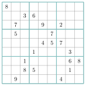{ .tikz .tikz-inline loading=lazy }

*La grille `DIFFICILE` (fichier `grilles_test.py`) : seulement 21 indices. Impossible à finir « à l’œil » sans essayer puis revenir en arrière — c’est exactement ce que fait le backtracking.*

## Comprendre le retour sur trace — sans ordinateur

!!! definition "Définition 5 — L’image du labyrinthe"

    Vous explorez un labyrinthe avec un fil d’Ariane. À chaque carrefour, vous choisissez un couloir. Si vous arrivez dans un cul-de-sac, vous **remontez le fil** jusqu’au dernier carrefour et vous essayez un **autre** couloir. Vous finissez toujours par sortir s’il existe une sortie, parce que vous n’abandonnez jamais un carrefour sans avoir essayé **tous** ses couloirs.

Le Sudoku, c’est pareil :

- un **carrefour** = une case vide ;

- les **couloirs** = les chiffres 1 à 9 qu’on peut y écrire ;

- un **cul-de-sac** = une case suivante où **aucun** chiffre n’est possible ;

- **remonter le fil** = effacer le dernier chiffre écrit et essayer le suivant.

### <span class="exo-num">Exercice 1</span> — Sur papier. { #ex-01-recursivite-tp-1-1 }

Sur cette mini-grille $4\times 4$ (chiffres de 1 à 4, blocs $2\times 2$), remplir la première case vide en essayant 1, puis 2… et noter à voix haute « j’essaie », « impasse, je reviens ». Une seule solution existe. **Combien de fois** avez-vous dû revenir en arrière ?

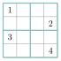{ .tikz .tikz-inline loading=lazy }

## Voir le backtracking tourner

Lancer le fichier `demo_backtracking_4x4.py` (rien à écrire). Il résout la grille ci-dessus en affichant chaque essai :

```text
-> j'ecris 2 en (0,1)
    -> j'ecris 3 en (0,2)
    X  j'efface 3 en (0,2)   (retour n1)
    -> j'ecris 4 en (0,2)
        ...
```

Le **décalage vers la droite** mesure la profondeur : plus on est décalé, plus on a rempli de cases.

### <span class="exo-num">Exercice 2</span> — Observer la démo. { #ex-01-recursivite-tp-1-2 }

Réponses sur le cahier.

1.  Combien de **retours en arrière** le programme affiche-t-il au total ?

2.  Est-ce le même nombre que celui trouvé à la main ?

3.  La ligne `=> grille complete !` : à quel moment apparaît-elle, et que se passe-t-il juste après ?

## Le retour en arrière, pas à pas

Suivons **à la main** les premières cases vides de la mini-grille $4\times 4$ (on parcourt de gauche à droite, de haut en bas). La case qu’on vient de remplir est en **vert**, l’impasse en **rouge**, le retour en arrière en **orange**.

|  |  |  |  |  |  |  |  |  |
|:--:|:--:|:--:|:--:|:--:|:--:|:--:|:--:|:--:|
| 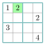{ .tikz .tikz-inline loading=lazy } | $\to$ | 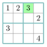{ .tikz .tikz-inline loading=lazy } | $\to$ | { .tikz .tikz-inline loading=lazy } | $\to$ | 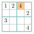{ .tikz .tikz-inline loading=lazy } | $\to$ | 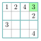{ .tikz .tikz-inline loading=lazy } |
|  1. on pose 2 |  |  2. on pose 3 |  |  3. (0,3) impasse |  |  4. efface 3, met 4 |  |  5. on pose 3 |

Le détail des chiffres essayés à chaque étape ($✓$ = accepté par `placement_valide`, $\times$ = refusé) :

| Étape | Case | Chiffres essayés | Ce qui se passe |
|:--:|:--:|:---|:---|
| 1 | (0,1) | 1 $\times$,  2 $✓$ | on écrit **2** |
| 2 | (0,2) | 1 $\times$,  2 $\times$,  3 $✓$ | on écrit **3** |
| 3 | (0,3) | 1 $\times$,  2 $\times$,  3 $\times$,  4 $\times$ | **impasse** : aucun chiffre ne passe |
| 4 | *retour* (0,2) | on efface le 3, puis 4 $✓$ | on écrit **4** à la place du 3 |
| 5 | (0,3) | 1 $\times$,  2 $\times$,  3 $✓$ | on écrit **3** ; la suite s’enchaîne |

À l’étape 3, même le `4` est refusé : il y a déjà un `4` **dans la colonne** (case du bas). Plus aucun chiffre n’est possible en (0,3) : c’est une impasse, on **revient** à la case précédente (0,2), on efface le `3` qu’on y avait mis, et on essaie le chiffre *suivant* : `4`.

!!! encadre "Le point-clé du backtracking"

    Un chiffre accepté par `placement_valide` n’est qu’un **pari local** : il respecte les règles *pour l’instant*, mais rien ne garantit qu’il soit le bon. À l’étape 2 le `3` était pourtant valide — et il a fallu l’annuler à l’étape 4. Le backtracking, c’est exactement cette capacité à **revenir défaire un pari** qui s’est révélé mauvais plus loin.

Il y a donc **deux façons d’échouer** : *tout de suite* (aucun chiffre ne passe dès la case courante, comme en (0,3)) ou *plus tard* (un chiffre passe, mais mène à une impasse quelques cases après). Le même mécanisme règle les deux.

## L’arbre des possibilités

On peut dessiner tous les essais sous forme d’**arbre** : la racine est la grille de départ, chaque **branche** est un chiffre essayé dans la prochaine case vide, une **feuille** est soit une impasse, soit la solution.

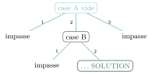{ .tikz loading=lazy }

- le backtracking = un **parcours de cet arbre**, en descendant tant qu’on peut, en remontant dès qu’on est bloqué ;

- ce type de parcours s’appelle un parcours **en profondeur d’abord** : vous le retrouverez dans les chapitres sur les arbres et les graphes.

Dessiner sur le cahier le petit arbre de la démo $4\times 4$ (une ou deux branches suffisent) pour bien voir où sont les impasses.

## Remettre en place la vérification

Le solveur a besoin d’une seule brique : `placement_valide(grille, i, j, v)`, qui dit si l’on a le droit d’écrire `v` dans la case `(i, j)`. Vous l’avez rencontrée en Première ; ici, vous la **réécrivez vous-même** dans `terminale_squelette.py` (parties 1 et 2), avec les fonctions de lecture qui la préparent.

### <span class="exo-num">Exercice 3</span> — Lire dans la grille. { #ex-01-recursivite-tp-1-3 }

1.  `valeurs_ligne(grille, i)` : les 9 valeurs de la ligne `i`.

2.  `valeurs_colonne(grille, j)` : les 9 valeurs de la colonne `j`, **par compréhension** (on collecte `grille[i][j]` pour `i` de 0 à 8).

3.  `valeurs_bloc(grille, i, j)` : les 9 valeurs du bloc $3\times 3$ qui **contient** la case `(i, j)`. Son coin haut-gauche est `((i // 3) * 3, (j // 3) * 3)`.

4.  *Sur le cahier.* Que vaut `(i // 3) * 3` pour `i` allant de 0 à 8 ? Pourquoi est-ce bien la première ligne du bloc ?

### <span class="exo-num">Exercice 4</span> — Peut-on poser un chiffre ? { #ex-01-recursivite-tp-1-4 }

1.  Écrire `placement_valide(grille, i, j, v)` : elle renvoie `False` dès que `v` figure déjà dans la ligne `i`, la colonne `j` ou le bloc de la case, et `True` sinon. *Vous pouvez utiliser vos trois fonctions de lecture et l’opérateur `in`.*

2.  Écrire `grille_complete(grille)` : `True` s’il ne reste aucune case égale à `0`.

3.  Écrire `grille_valide(grille)` pour une grille **remplie**. *Astuce :* pour tester la case `(i, j)` de valeur `v`, la retirer (`grille[i][j] = 0`), appeler `placement_valide`, puis la remettre.

4.  *Sur le cahier.* Dans l’astuce de la question 3, que se passerait-il si l’on ne retirait pas la valeur avant d’appeler `placement_valide` ?

**Tester le code** : lancer `terminale_squelette.py` ; les tests des parties 1 et 2 (en bas du fichier) doivent passer, par exemple :

```python
assert valeurs_colonne(FACILE, 0) == [5, 6, 0, 8, 4, 7, 0, 0, 0]
assert placement_valide(FACILE, 0, 2, 4) == True
assert placement_valide(FACILE, 0, 2, 5) == False   # 5 deja sur la ligne
assert placement_valide(FACILE, 0, 2, 8) == False   # 8 deja dans le bloc
assert grille_valide(DOUBLON_LIGNE) == False
```

## Écrire le solveur

Dans `terminale_squelette.py` (partie 3), avec votre `placement_valide` de la section précédente, vous écrivez maintenant deux fonctions.

### <span class="exo-num">Exercice 5</span> — `trouver_case_vide(grille)`. { #ex-01-recursivite-tp-1-5 }

Renvoie le couple `(i, j)` de la **première** case vide (parcours ligne par ligne), ou `None` s’il n’y en a plus. *Test attendu :* `trouver_case_vide(FACILE)` doit donner `(0, 2)`.

**À compléter** (dans `terminale_squelette.py`) :

```python
def trouver_case_vide(grille):
    for i in range(9):
        for j in range(9):
            # A COMPLETER : si (i, j) est vide, renvoyer le couple (i, j)
            ...
    return None
```

### <span class="exo-num">Exercice 6</span> — `resoudre(grille)` — le cœur du sujet. { #ex-01-recursivite-tp-1-6 }

Elle **modifie la grille sur place** et renvoie `True` si elle a trouvé une solution, `False` sinon. Voici l’algorithme, mot pour mot :

```text
resoudre(grille) :
    chercher une case vide
    s'il n'y en a plus :
        la grille est finie          ->  renvoyer True

    pour chaque valeur v de 1 a 9 :
        si placement_valide(grille, i, j, v) :
            ecrire v dans la case (i, j)
            si resoudre(grille) reussit :      # appel RECURSIF sur le reste
                renvoyer True
            sinon :
                effacer la case (remettre 0)   # LE retour en arriere

    aucune valeur n'a marche         ->  renvoyer False
```

**À compléter** (le squelette est prêt, il vous reste les 3 lignes clés) :

```python
def resoudre(grille):
    case = trouver_case_vide(grille)
    if case is None:
        return True                 # cas de base : plus de case vide
    i, j = case
    for v in range(1, 10):
        if placement_valide(grille, i, j, v):
            grille[i][j] = v
            # A COMPLETER : appel recursif resoudre(grille) ;
            #   si ca reussit -> return True
            #   sinon effacer la case : grille[i][j] = 0  (retour en arriere)
            ...
    return False
```

!!! encadre "Les trois lignes du raisonnement récursif"

    - **le cas de base** (« plus de case vide $\rightarrow$ `True` ») : c’est ce qui garantit que la récursion **s’arrête** ;

    - **l’appel récursif** `resoudre(grille)` : on délègue « le reste de la grille » à la même fonction ;

    - **`grille[i][j] = 0`** : sans cette ligne, pas de retour en arrière — le programme resterait coincé sur un mauvais pari.

**Où est écrit « reviens en arrière » ? Nulle part !** Le retour en arrière n’est pas une instruction : il **émerge** de trois éléments qui se combinent.

- **la boucle** `pour chaque valeur v` : dès qu’un pari échoue, on efface la case (`grille[i][j] = 0`) et la boucle passe *toute seule* au chiffre suivant — on essaie une autre piste *au même endroit* ;

- **le `renvoyer False` final** : si *aucun* chiffre ne marche à cette case, la fonction rend `False` à l’appel qui l’avait lancée — celui de la case **précédente**. Cet appel reprend alors *sa* boucle au chiffre suivant : on remonte d’un cran ;

- **la pile des appels** : chaque appel de `resoudre` en attente se souvient de sa case et du chiffre qu’il testait. C’est elle, le véritable « fil d’Ariane » : elle permet de remonter exactement au bon carrefour.

Autrement dit : la boucle explore les pistes d’une même case, le `return False` fait remonter d’une case, et la pile retient le chemin. Ensemble, ils *sont* le retour en arrière.

### <span class="exo-num">Exercice 7</span> — Tester votre solveur avec des `assert` (`resoudre` modifie la grille, on en fait une copie). { #ex-01-recursivite-tp-1-7 }

```python
def copie(grille):                      # copier une matrice : double comprehension
    return [[v for v in ligne] for ligne in grille]

g = copie(MINI)
assert resoudre(g) == True and g == SOLUTION_MINI   # 4x4
assert resoudre(copie(FACILE)) == True
assert resoudre(copie(DIFFICILE)) == True        # 21 indices : impossible "a l'oeil"
assert resoudre(copie(IMPOSSIBLE)) == False      # pas de solution -- et ca s'arrete !
```

!!! remarque "Remarque"

    Le cas `IMPOSSIBLE` est important : il **n’a pas de solution** mais ne contient aucun doublon au départ. Un solveur correct doit renvoyer `False` **sans tourner à l’infini**. C’est la preuve que votre retour en arrière est complet.

## Analyser

### <span class="exo-num">Exercice 8</span> — Terminaison, correction, coût. { #ex-01-recursivite-tp-1-8 }

Réponses sur le cahier.

1.  **Terminaison.** Pourquoi `resoudre` finit-elle toujours par s’arrêter ? *(Indice : à chaque appel récursif, il y a une case vide de moins.)*

2.  **Correction.** Si `resoudre` renvoie `True`, la grille obtenue est-elle forcément valide ? Pourquoi ?

3.  **Coût.** Sur `DIFFICILE`, y a-t-il eu beaucoup plus d’essais que sur `FACILE` ? *(Ajouter un compteur d’essais, comme dans la démo $4\times 4$.)*

4.  Le mot **récursivité** : où l’a-t-on utilisée exactement, et qu’est-ce qui joue le rôle de « fil d’Ariane » ?

## Créer des grilles (génération)

Résoudre, c’est bien ; mais d’où viennent les grilles des journaux ? Dans cette partie, vous écrivez un programme qui **fabrique** des Sudoku jouables, avec **une seule solution**, au niveau choisi. Et l’outil sera… encore le retour sur trace.

**Fichier :** `generateur_squelette.py`. Il **réutilise vos fonctions** de `terminale_squelette.py` : votre solveur doit donc être terminé. Lancer le fichier après chaque étape : les tests avancent étape par étape.

On procède en quatre étapes : **(1)** fabriquer une grille **complète** ; **(2)** savoir **compter** les solutions d’une grille ; **(3)** **creuser** des trous tant que la solution reste unique ; **(4)** assembler.

|           |       |                      |       |             |       |                 |
|:---------:|:-----:|:--------------------:|:-----:|:-----------:|:-----:|:---------------:|
| 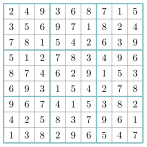{ .tikz .tikz-inline loading=lazy }  | $\to$ |       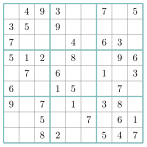{ .tikz .tikz-inline loading=lazy }       | $\to$ |  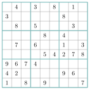{ .tikz .tikz-inline loading=lazy }   | $\to$ |    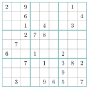{ .tikz .tikz-inline loading=lazy }     |
|  complète |       |  facile (40 indices) |       |  moyen (32) |       |  difficile (26) |

### <span class="exo-num">Exercice 9</span> — Pourquoi pas simplement « au hasard » ? { #ex-01-recursivite-tp-1-9 }

Idée naïve pour remplir une grille vide : on avance case par case, ligne par ligne, et dans chaque case on tire au hasard un chiffre **autorisé** (`placement_valide`), sans jamais revenir en arrière. Ci-contre, les deux premières lignes ont été remplies ainsi.

1.  Quels chiffres peut-on écrire dans la case colorée `(1, 6)` ? Justifier avec les trois règles.

2.  Ces deux lignes contiennent-elles un doublon ? Que devient pourtant la méthode naïve ?

3.  Quelle méthode, vue dans ce projet, sait sortir d’une telle impasse ?

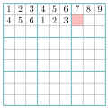{ .tikz .tikz-inline loading=lazy }

### Étape 1 — Une grille complète, différente à chaque fois

### <span class="exo-num">Exercice 10</span> — Du solveur au générateur. { #ex-01-recursivite-tp-1-10 }

1.  Dans la console, résoudre une grille **vide** avec votre solveur :

    ```python
    >>> g = grille_vide()          # 81 zeros
    >>> resoudre(g)
    >>> afficher(g)
    ```

    Recommencer plusieurs fois. Que constatez-vous ? Quelle est la première ligne obtenue, et pourquoi est-ce *forcément* celle-là ? Expliquer en parlant de l’**ordre** dans lequel `resoudre` essaie les chiffres.

2.  Pour obtenir une grille différente à chaque exécution, il suffit de changer *l’ordre des essais* : `random.shuffle(valeurs)` mélange la liste `valeurs` **sur place**. Compléter `resoudre_aleatoire` : le début est écrit, il vous reste le retour sur trace, en parcourant `valeurs` au lieu de `range(1, 10)`.

    ```python
    def resoudre_aleatoire(grille):
        case = trouver_case_vide(grille)
        if case is None:
            return True
        i, j = case
        valeurs = list(range(1, 10))
        random.shuffle(valeurs)          # on melange l'ordre des essais
        # A COMPLETER
    ```

3.  `resoudre_aleatoire(grille_vide())` peut-elle renvoyer `False` ? Justifier.

### Étape 2 — Compter les solutions

Un « vrai » Sudoku n’a **qu’une seule** solution : sinon le joueur devrait deviner. Pour le vérifier, il faut savoir **compter** les solutions. Or `resoudre` s’arrête à la *première* : dès qu’un appel renvoie `True`, tout remonte. La fonction `compter_solutions`, elle, explore **tout** l’arbre des essais et **additionne** ce que renvoie chaque branche.

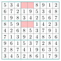{ .tikz .tikz-inline loading=lazy }

`DEUX_SOLUTIONS`

La grille `DEUX_SOLUTIONS` (fournie dans le fichier) est `COMPLETE_OK` dont on a vidé les quatre cases colorées `(0,3)`, `(0,4)`, `(3,3)`, `(3,4)`.

### <span class="exo-num">Exercice 11</span> — Compter au lieu de trouver. { #ex-01-recursivite-tp-1-11 }

1.  *Sur le cahier.* Combien de solutions doit trouver `compter_solutions` sur `COMPLETE_OK` ? sur `IMPOSSIBLE` ? sur `FACILE` ? Pour `DEUX_SOLUTIONS`, écrire les **deux** façons de remplir les cases colorées.

2.  *Sur le cahier.* Quel est le **cas de base** ? Que renvoie-t-on quand il n’y a plus de case vide ?

3.  *Sur le cahier.* Dans `resoudre`, la ligne `grille[i][j] = 0` n’est exécutée qu’en cas d’*échec*. Dans `compter_solutions`, on efface la case **toujours**, même quand la branche a donné des solutions. Donner deux raisons.

4.  Écrire une première version **sans limite** (ignorer pour l’instant le paramètre `limite`), en suivant l’algorithme :

    ```text
    compter_solutions(grille) :
        chercher une case vide (i, j)
        s'il n'y en a plus :  renvoyer ...
        total <- 0
        pour chaque valeur v de 1 a 9 :
            si placement_valide(grille, i, j, v) :
                ecrire v en (i, j)
                total <- total + ...          # appel RECURSIF
                effacer la case (i, j)        # TOUJOURS
        renvoyer total
    ```

    Vérifier vos réponses de la question 1 dans la console. La lancer ensuite sur `grille_vide()` : que se passe-t-il ? (`Ctrl+C` pour arrêter.) *Il existe 6 670 903 752 021 072 936 960 grilles complètes…*

5.  Pour tester l’unicité, on n’a pas besoin du nombre exact : dès que `total` atteint `limite`, on arrête et on renvoie `total`. Modifier votre fonction en conséquence.

    1.  Pourquoi `limite = 2` suffit-il pour savoir si la solution est unique ?

    2.  L’appel récursif doit recevoir `limite - total`, et non `limite`. Pourquoi ? *(Imaginer `total` valant déjà 1 et un appel récursif qui trouve 2 solutions.)*

    Lancer le fichier : tous les tests de l’étape 2 doivent passer (y compris « la grille est rendue intacte »).

### Étape 3 — Creuser des trous

On part d’une grille complète et on vide des cases une par une, dans un ordre aléatoire. Après chaque retrait, on **garde le trou seulement si la solution reste unique** ; sinon on **rebouche**. On s’arrête quand il ne reste plus que `indices` cases remplies. Le **niveau** se règle par ce nombre d’indices : plus il en reste, plus c’est facile.

```text
creuser(grille_pleine, indices) :
    grille <- une COPIE de grille_pleine
    cases  <- la liste des 81 couples (i, j), melangee
    remplies <- 81
    k <- 0
    tant que k < 81 et remplies > indices :
        (i, j) <- cases[k]
        retenir la valeur de la case (i, j), puis la vider
        si la grille a une solution unique :
            remplies <- remplies - 1      # on garde le trou
        sinon :
            remettre la valeur retenue    # on rebouche
        k <- k + 1
    renvoyer grille
```

### <span class="exo-num">Exercice 12</span> — Creuser en gardant l’unicité. { #ex-01-recursivite-tp-1-12 }

1.  *Sur le cahier.* Pourquoi travailler sur une **copie** de `grille_pleine` ? *(Penser à ce dont on aura besoin à l’étape 4.)*

2.  *Sur le cahier.* Une grille a deux solutions ; on vide une case de plus. Combien de solutions a-t-elle *au moins* ? Justifier. En déduire pourquoi on teste l’unicité **après chaque retrait** (et on rebouche aussitôt), plutôt qu’une seule fois à la fin.

3.  Écrire `creuser` (une ligne de code par ligne d’algorithme, ou presque). *Rappel :* `random.shuffle(cases)` mélange la liste ; la boucle `while` porte **les deux** conditions de poursuite (pas besoin de `break`).

4.  *Sur le cahier.* Le programme garantit-il de laisser *exactement* `indices` cases remplies ? *(Envisager le cas où, à un moment, chacune des cases restantes est indispensable à l’unicité.)*

5.  **Coût.** Au plus combien de fois `creuser` appelle-t-elle `compter_solutions` ?

### Étape 4 — Assembler

### <span class="exo-num">Exercice 13</span> — La fonction `generer(niveau)`. { #ex-01-recursivite-tp-1-13 }

1.  Écrire `generer(niveau)`, qui renvoie le couple `(enonce, solution)`. Le dictionnaire `NIVEAUX` (fourni) donne le nombre d’indices à garder pour `"facile"`, `"moyen"` et `"difficile"`. Trois lignes suffisent, plus le `return`.

2.  Lancer le fichier : il affiche une grille de chaque niveau. En recopier une et la résoudre à la main, ou la faire résoudre par votre voisin !

3.  Le niveau « difficile » peut être **beaucoup** plus long à générer (de moins d’une seconde à une minute, selon le tirage). Expliquer pourquoi.

!!! encadre "Le point-clé de la génération"

    Ce qui fait qu’une grille est un « vrai » Sudoku, ce n’est pas le nombre de trous : c’est que sa solution soit **unique**. C’est `compter_solutions` — donc encore le retour sur trace, mais en explorant *tout* l’arbre — qui le garantit à chaque retrait. Même méthode, trois usages : **trouver** une solution, en **fabriquer** une au hasard, les **compter**.

!!! remarque "Remarque"

    **« Niveau » : un mot piégeux.** Compter les cases vides est un *proxy* commode, mais la vraie difficulté dépend des *techniques de logique* nécessaires pour résoudre sans deviner — la mesurer précisément est un problème ouvert. Bel exemple d’un mot courant (« difficile ») dur à définir formellement.

## Pour aller encore plus loin (au choix)

- **Trous symétriques** (comme dans les journaux) : retirer toujours `(i, j)` *et* `(8-i, 8-j)` en même temps.

- **Case la plus contrainte.** Au lieu de la *première* case vide, prendre la case vide qui a le **moins** de coups possibles. Le nombre d’essais s’effondre : c’est une idée **gloutonne** greffée sur le backtracking.

## Bilan

- Le **retour sur trace** (*backtracking*) : essayer une piste, la poursuivre récursivement, **revenir en arrière** dès qu’elle échoue. C’est un **parcours en profondeur** de l’**arbre des essais** (un parcours que vous retrouverez avec les arbres et les graphes).

- Une fonction **récursive** a besoin d’un **cas de base** (ici : plus de case vide) pour être sûre de s’arrêter.

- La ligne qui **annule** le dernier choix (`grille[i][j] = 0`) est ce qui distingue le backtracking d’une simple boucle : c’est elle qui rend l’exploration **complète**.

- La même méthode résout des tas d’autres problèmes : labyrinthes, coloriage de cartes, placement de $n$ reines sur un échiquier…
