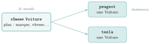

# Cours

<p class="sous-titre">Programmation orientée objet et paradigmes</p>

<span id="chap-02" class="ancre"></span>

|  |  |
|:---|:---|
| **Programme (BO)** | *« Vocabulaire de la programmation objet : classes, attributs, méthodes, objets. Écrire la définition d’une classe. Accéder aux attributs et méthodes d’une classe. »* (*on n’aborde pas ici l’héritage ni le polymorphisme*.) *« Paradigmes de programmation. Distinguer sur des exemples les paradigmes impératif, fonctionnel et objet. Choisir le paradigme de programmation selon le champ d’application d’un programme. »* |
| **Prérequis** | fonctions et paramètres, variables, listes, dictionnaires, chaînes de caractères. |
| **Objectifs** | *savoir écrire* une classe (attributs, méthodes, constructeur) et *savoir l’utiliser* (créer des instances, appeler des méthodes) ; *distinguer* les paradigmes impératif, objet et fonctionnel. |

## Programmer autrement : la notion de paradigme

Depuis la classe de Première, vous programmez d’une seule manière : vous écrivez une **suite d’instructions** qui manipulent des variables, l’une après l’autre. C’est ce qu’on appelle un *style* de programmation, ou plus savamment un **paradigme**.

!!! definition "Définition 1 — Paradigme de programmation"

    Un **paradigme de programmation** est une manière de concevoir et d’organiser un programme. Un même langage (Python, par exemple) peut en autoriser **plusieurs**, et un même programme peut les **mélanger**.

Le style que vous pratiquez depuis la Première porte un nom : le paradigme **impératif**. Un programme impératif est une liste d’**ordres** donnés à la machine, qui font évoluer pas à pas l’**état** de la mémoire. Ce petit programme, qui compte les notes au-dessus de la moyenne, en réunit tous les ingrédients :

```python
notes = [12, 8, 15, 9, 17]
compteur = 0                 # une variable dont la valeur va changer
for n in notes:              # on repete un bloc d'instructions...
    if n >= 10:              # ...en choisissant selon une condition
        compteur = compteur + 1
print(compteur)              # les ordres sont executes du haut vers le bas
```

On y retrouve des **affectations** qui modifient des variables, des **boucles**, des **tests**, et un ordre d’exécution qui compte : déplacer le `print` au début changerait le résultat.

Ce n’est pas le seul, et le programme de Terminale demande d’en découvrir deux autres : le paradigme **fonctionnel** et le paradigme **objet**. Nous commencerons par le **fonctionnel**, le plus léger — il ne demande que des fonctions, que vous connaissez déjà —, avant de consacrer le cœur du chapitre au paradigme **objet**, la grande nouveauté de l’année.

## Un premier autre regard : le paradigme fonctionnel

Commençons par un paradigme qui, sur la forme, ne demande rien de neuf — il n’utilise que des **fonctions** — mais propose un regard neuf : le paradigme **fonctionnel** cherche à **bannir les effets de bord**.

!!! definition "Définition 2 — Effet de bord"

    Une fonction produit un **effet de bord** lorsqu’elle modifie quelque chose *en dehors* d’elle-même : une variable globale, une liste reçue en paramètre, un affichage, un fichier… bref, autre chose que sa seule valeur de retour.

Les effets de bord rendent les programmes difficiles à prévoir et à relire : à un instant donné, on ne sait plus quelle fonction a modifié quoi. Le paradigme fonctionnel les évite au maximum en s’appuyant sur des **fonctions pures**.

!!! definition "Définition 3 — Fonction pure"

    Une fonction est **pure** si :

    - sa valeur de retour dépend **uniquement** de ses paramètres (jamais d’une variable extérieure) ;

    - elle ne produit **aucun effet de bord**.

    Appelée deux fois avec les mêmes arguments, elle renvoie toujours le même résultat.

!!! exemple "Exemple — Analysez ces deux fonctions. Laquelle est pure ?"

    ```python
    seuil = 5
    def depasse_A(x):
        return x > seuil

    def depasse_B(x, seuil):
        return x > seuil
    ```

    ??? corrige "Correction"

        `depasse_A` n’est pas pure : elle dépend de `seuil`, une variable **extérieure**, et son résultat change si l’on modifie `seuil` ailleurs. `depasse_B` est pure : elle ne dépend que de ses paramètres.

!!! exemple "Exemple — Éviter l’effet de bord sur une liste"

    La méthode `append` **modifie** la liste reçue : c’est un effet de bord. La version fonctionnelle **crée une nouvelle liste** sans toucher à l’ancienne.

    ```python
    def ajout_impur(element, tab):
        tab.append(element)         # effet de bord : tab est modifie

    def ajout_pur(element, tab):
        return tab + [element]      # cree une nouvelle liste, tab intact
    ```

!!! remarque "Remarque"

    Certains langages sont conçus pour *favoriser* ce style (Haskell, Lisp, OCaml, Scheme ; Haskell va jusqu’à l’imposer), mais on peut programmer « fonctionnel » dans un langage généraliste comme Python. Le paradigme fonctionnel s’appuie aussi beaucoup sur des données **immuables** (tuples plutôt que listes) et sur des fonctions qui en prennent d’autres en paramètre (*ex.* `map`, `filter`).

!!! remarque "Remarque — Vous en faites déjà : la création de liste par compréhension"

    La **création de liste par compréhension**, vue en Première, relève de la **programmation fonctionnelle** : c’est une **expression** qui construit une **nouvelle** liste, sans modifier la liste parcourue ni aucune variable extérieure (pas d’effet de bord) — exactement comme `map` (appliquer une fonction à chaque élément) et `filter` (ne garder que certains éléments).

!!! exemple "Exemple — Compréhension ou map/filter : deux écritures du même calcul"

    Avec `nombres = [1, 2, 3, 4, 5, 6]`, que valent les quatre expressions ci-dessous ? La liste `nombres` est-elle modifiée ?

    ```python
    def carre(x):
        return x * x

    def est_pair(x):
        return x % 2 == 0

    [carre(x) for x in nombres]          # comprehension
    list(map(carre, nombres))            # map : appliquer
    [x for x in nombres if est_pair(x)]  # comprehension avec filtre
    list(filter(est_pair, nombres))      # filter : garder
    ```

    ??? corrige "Correction"

        Les deux premières valent `[1, 4, 9, 16, 25, 36]`, les deux dernières `[2, 4, 6]`. Chaque écriture crée une **nouvelle** liste : `nombres` reste `[1, 2, 3, 4, 5, 6]`.

!!! remarque "Remarque — Les fonctions anonymes : lambda"

    Quand la fonction ne sert qu’une fois, on peut l’écrire directement, sans lui donner de nom, avec le mot-clé `lambda` (hérité du $\lambda$-calcul d’Alonzo Church) : `lambda x: x * x` est la fonction qui à `x` associe `x * x`.

    ```python
    list(map(lambda x: x * x, nombres))           # [1, 4, 9, 16, 25, 36]
    list(filter(lambda x: x % 2 == 0, nombres))   # [2, 4, 6]
    ```

    Une `lambda` ne contient qu’une **expression** (pas d’instruction, pas de `return`) : pour une fonction plus longue, on revient à `def`.

<span id="cours-02-1" class="ancre"></span>

<span class="afaire">▶ Exercices d'application :</span> exercices **[1](exercices.md#ex-02-1) à [3](exercices.md#ex-02-3)** (fonctions pures ; défi : des fonctions qui manipulent des fonctions)

## Objets, classes et instances

!!! remarque "Remarque"

    Bonne nouvelle : vous utilisez déjà des objets *sans le savoir* ! Quand vous écrivez `"radar".upper()` ou `ma_liste.append(3)`, le `.quelquechose()` est un appel de **méthode** sur un **objet**. Il est temps de comprendre — et d’écrire — ce qui se cache derrière.

### L’idée : réunir des données et des comportements

Prenons un objet de la vie courante très complexe — disons le **moteur d’une voiture**. Le conducteur n’a pas besoin d’en connaître le fonctionnement interne : il dispose d’une clé, d’une pédale, d’un compteur. Toute la complexité est **enfermée dans une caisse**, et on l’utilise par quelques commandes simples.

Programmer « objet », c’est reprendre cette idée : on regroupe dans une même entité les **données** qui décrivent une chose et les **actions** qu’on peut lui appliquer, puis on l’utilise sans se soucier de l’intérieur.

!!! definition "Définition 4 — Objet"

    Un **objet** est une entité informatique qui réunit :

    - des **attributs** : des données qui décrivent son *état* (un peu comme des variables attachées à l’objet) ;

    - des **méthodes** : des fonctions attachées à l’objet, qui décrivent son *comportement*.

### La classe : le plan de fabrication

On ne décrit pas chaque objet un par un : on écrit un **plan** commun à tous les objets du même genre. Ce plan s’appelle une **classe**.

!!! definition "Définition 5 — Classe et instance"

    Une **classe** est le modèle (le « plan ») qui décrit les attributs et les méthodes communs à toute une famille d’objets. Un objet construit à partir d’une classe est appelé une **instance** de cette classe.

{ .tikz loading=lazy }

!!! remarque "Remarque"

    Vous connaissez déjà des classes ! En Python, `str`, `int`, `list` sont des classes. La chaîne `"radar"` est une *instance* de `str`, la liste `[1, 2]` une *instance* de `list`. L’instruction `type("radar")` renvoie d’ailleurs `<class ’str’>`.

### Écrire une classe (presque) vide

En Python, une classe se déclare avec le mot-clé `class`, suivi d’un nom (par convention avec une **majuscule**). On crée ensuite une instance en écrivant `NomDeLaClasse()`.

!!! exemple "Exemple — Saisissez, analysez et testez ce code"

    ```python
    class Personnage:
        pass          # "ne rien faire" : la classe est pour l'instant vide

    gollum = Personnage()   # gollum est une instance de Personnage
    bilbo = Personnage()    # bilbo en est une autre
    ```

    ??? corrige "Correction"

        Le programme n’affiche rien. L’instruction `pass` signifie « ne rien faire » : une classe ne peut pas être totalement vide. Nous avons créé **deux** instances distinctes de `Personnage` (`print(gollum)` affiche `<__main__.Personnage object at 0x…>`).

Ces instances sont pour l’instant inutiles : donnons-leur un état.

<span id="cours-02-4" class="ancre"></span>

<span class="afaire">▶ Exercices d'application :</span> exercices **[4](exercices.md#ex-02-4) à [6](exercices.md#ex-02-6)** (lire une classe)

## Les attributs : l’état d’un objet

Un **attribut** est une donnée attachée à une instance. On y accède avec la notation **pointée** : `gollum.vie` désigne l’attribut `vie` de l’instance `gollum`. Mais où et comment créer proprement cet attribut ?

### Le constructeur `__init__` et le mot `self`

Les attributs d’une instance sont mis en place par une méthode spéciale, le **constructeur**, nommée `__init__` (deux tirets bas de chaque côté). Elle est appelée **automatiquement** au moment de la création de l’instance.

!!! regle "Règle 1 — Le mot self"

    Dans une classe, `self` désigne **l’instance en train d’être manipulée**. C’est **toujours** le premier paramètre d’une méthode. Écrire `self.vie = 20` crée l’attribut `vie` *de cette instance*. Quand vous écrivez ensuite `gollum.vie`, Python a remplacé `self` par `gollum`.

!!! exemple "Exemple — Saisissez, analysez et testez ce code"

    ```python
    class Personnage:
        def __init__(self):
            self.vie = 20

    gollum = Personnage()
    bilbo = Personnage()
    print(gollum.vie)
    ```

    ??? corrige "Correction"

        Le programme affiche `20` : le constructeur, appelé automatiquement à la création, fait naître tout `Personnage` avec 20 points de vie. Chaque instance possède **ses propres** attributs : `gollum.vie` et `bilbo.vie` sont indépendants.

### Des instances qui diffèrent : les paramètres du constructeur

Ici, tous les personnages naissent avec 20 points de vie. Pour que chaque instance soit différente, on passe des **paramètres** au constructeur, exactement comme à une fonction.

!!! exemple "Exemple — Saisissez, analysez et testez ce code"

    ```python
    class Personnage:
        def __init__(self, nom, nb_vies):
            self.nom = nom          # attribut : le nom
            self.vie = nb_vies      # attribut : les points de vie

    gollum = Personnage("Gollum", 20)
    bilbo = Personnage("Bilbo", 15)
    print(bilbo.nom, bilbo.vie)
    ```

    ??? corrige "Correction"

        Le programme affiche `Bilbo 15`. Au moment de `Personnage("Bilbo", 15)`, la valeur `"Bilbo"` est reçue par le paramètre `nom` et `15` par `nb_vies`. Attention : `nom` et `nb_vies` sont de simples *paramètres* (ils ne commencent pas par `self`) ; ce sont les lignes `self.nom = …` qui créent les *attributs*.

<span id="cours-02-7" class="ancre"></span>

<span class="afaire">▶ Exercices d'application :</span> exercices **[7](exercices.md#ex-02-7) et [8](exercices.md#ex-02-8)** (créer une instance, compléter un constructeur)

## Les méthodes : le comportement d’un objet

!!! definition "Définition 6 — Méthode"

    Une **méthode** est une fonction définie **à l’intérieur** d’une classe. Elle agit sur l’instance grâce à `self`. On l’appelle avec la notation pointée : `bilbo.perd_vie(4)` (`self` n’apparaît pas dans les parenthèses : seuls les autres paramètres, ici `degats`, reçoivent une valeur).

Distinguons deux rôles très courants : une méthode qui **renvoie** une information sur l’état, et une méthode qui **modifie** l’état.

!!! exemple "Exemple — Saisissez, analysez et testez ce code"

    ```python
    class Personnage:
        def __init__(self, nom, nb_vies):
            self.nom = nom
            self.vie = nb_vies

        def est_vivant(self):           # renvoie une information
            return self.vie > 0

        def perd_vie(self, degats):     # modifie l'etat
            self.vie = self.vie - degats

    bilbo = Personnage("Bilbo", 15)
    bilbo.perd_vie(4)
    print(bilbo.vie, bilbo.est_vivant())
    ```

    ??? corrige "Correction"

        Le programme affiche `11 True`. `perd_vie(4)` **modifie** l’état : `bilbo.vie` passe de 15 à 11. `est_vivant()` ne modifie rien, elle **renvoie** une information : `11 > 0`, donc `True`.

!!! remarque "Remarque — Fonction ou méthode ?"

    Une **fonction** s’appelle seule : `len(bilbo_liste)`. Une **méthode** s’appelle « sur » un objet, après un point : `"abc".upper()`. L’objet placé à gauche du point est passé, en coulisses, comme `self`.

### Un second exemple : des objets qui interagissent

Une méthode peut recevoir en paramètre **un autre objet**. Illustrons-le avec une classe `Point` du plan.

!!! exemple "Exemple — La classe Point"

    ```python
    class Point:
        def __init__(self, x, y):
            self.x = x
            self.y = y

        def distance(self, autre):      # autre est un autre Point
            dx = self.x - autre.x
            dy = self.y - autre.y
            return (dx ** 2 + dy ** 2) ** 0.5

    a = Point(0, 0)
    b = Point(3, 4)
    print(a.distance(b))                # affiche 5.0
    ```

    Ici `a.distance(b)` : `self` vaut `a`, le paramètre `autre` vaut `b`.

<span id="cours-02-9" class="ancre"></span>

<span class="afaire">▶ Exercices d'application :</span> exercices **[9](exercices.md#ex-02-9) à [11](exercices.md#ex-02-11)** (écrire des méthodes ; classes `Rectangle` et `Chronometre`)

## L’encapsulation : protéger l’état

Techniquement, rien n’empêche d’écrire directement `bilbo.vie = -999` depuis l’extérieur. Mais c’est une **mauvaise pratique** : on court-circuite la classe et on peut mettre l’objet dans un état absurde.

!!! definition "Définition 7 — Encapsulation"

    L’**encapsulation** consiste à *cacher* l’état interne d’un objet et à ne le laisser manipuler qu’à travers ses méthodes. L’utilisateur de la classe se sert des méthodes (les « boutons ») sans toucher directement aux attributs.

!!! remarque "Remarque"

    C’est l’esprit du paradigme fonctionnel (vu en début de chapitre) transposé aux objets : là, on protégeait le programme des **effets de bord** ; ici, on protège l’**état d’un objet** des modifications sauvages. Deux façons de garder la maîtrise de ses données.

Reprenons l’exemple le plus classique : un **compte bancaire**. On ne veut surtout pas qu’un programme extérieur écrive `compte.solde = 1000000` : tout dépôt doit passer par une méthode qui contrôle l’opération.

```python
class CompteBancaire:
    def __init__(self, titulaire, solde_initial):
        self.titulaire = titulaire
        self._solde = solde_initial     # _solde : "ne pas toucher de l'exterieur"

    def solde(self):                    # accesseur : lire l'etat
        return self._solde

    def deposer(self, montant):
        if montant > 0:
            self._solde = self._solde + montant

    def retirer(self, montant):
        if 0 < montant <= self._solde:  # on refuse de passer en negatif
            self._solde = self._solde - montant
            return True
        return False

compte = CompteBancaire("Alice", 100)
compte.deposer(50)
compte.retirer(30)
print(compte.solde())                   # affiche 120
```

!!! regle "Règle 2 — La convention du tiret bas"

    En Python, on **préfixe d’un tiret bas** (`_solde`) un attribut qui n’est pas censé être utilisé de l’extérieur. C’est une **convention** entre programmeurs : Python ne l’interdit pas techniquement, mais tout le monde comprend « ceci est interne, manipule-le par les méthodes ». Une méthode qui *lit* un attribut s’appelle un **accesseur** (ici `solde`) ; une méthode qui le *modifie*, un **mutateur**.

!!! remarque "Remarque"

    On retrouve cette pratique dans les sujets de bac : la classe fournit des méthodes `get_…` (accesseurs) et `set_…` (mutateurs), et l’énoncé demande explicitement de « ne pas accéder directement aux attributs » depuis une autre classe (*ex.* Asie 2024 : la méthode `couvre` d’une antenne doit passer par `get_pos_maison()`).

<span id="cours-02-14" class="ancre"></span>

<span class="afaire">▶ Exercices d'application :</span> exercice **[14](exercices.md#ex-02-14)** (encapsulation)

## Pour aller plus loin : les méthodes spéciales

Créons un point et tapons simplement son nom dans la console pour « le voir » :

```text
>>> p = Point(3, 4)
>>> p
<__main__.Point object at 0x7f3a...>
```

Illisible ! Par défaut, un objet ne sait pas se décrire. On corrige cela en définissant la méthode spéciale `__repr__`, qui indique **comment représenter** l’objet.

!!! exemple "Exemple — Un affichage lisible avec __repr__"

    ```python
    class Point:
        def __init__(self, x, y):
            self.x = x
            self.y = y

        def __repr__(self):
            return f"Point({self.x}, {self.y})"
    ```

    Désormais, taper le nom de l’objet suffit — et `print` en profite aussi :

    ```text
    >>> p = Point(3, 4)
    >>> p                       # dans la console : appelle __repr__
    Point(3, 4)
    >>> print(p)                # print s'en sert, faute de __str__
    Point(3, 4)
    ```

!!! regle "Règle 3 — __repr__ ou __str__ ?"

    Deux méthodes gouvernent l’affichage d’un objet :

    - `__repr__` est appelée quand on **tape le nom** de l’objet dans la console (et par la fonction `repr()`). C’est la représentation « officielle », sans ambiguïté : par convention, on renvoie idéalement une expression qui *recréerait* l’objet, comme `Point(3, 4)`.

    - `__str__` est appelée par `print()` et `str()`. C’est la représentation « lisible », destinée à l’utilisateur final.

    **Règle d’or :** si `__str__` n’existe pas, `print()` se rabat sur `__repr__`. Définir le seul `__repr__` suffit donc à obtenir un affichage propre *partout* — dans la console *comme* avec `print`. L’inverse est faux : `__str__` seule ne change rien quand on tape le nom dans la console. Pour simplement « voir » un objet, `__repr__` est donc le réflexe le plus direct.

!!! remarque "Remarque"

    `__init__`, `__repr__` et `__str__` font partie des méthodes dites *spéciales* (entourées de doubles tirets bas). Il en existe d’autres, hors programme, qui permettent par exemple d’utiliser `+` ou `==` sur vos propres objets. De même, l’**héritage** (créer une classe à partir d’une autre) et le **polymorphisme** sont *explicitement hors du programme* de Terminale : nous nous arrêtons ici.

<span id="cours-02-12" class="ancre"></span>

<span class="afaire">▶ Exercices d'application :</span> exercices **[12](exercices.md#ex-02-12)** (défi : la classe `Fraction`) et **[13](exercices.md#ex-02-13)** (défi : un réseau d’amis, des objets qui interagissent)

## Choisir — et mélanger — les paradigmes

Aucun paradigme n’est « meilleur » dans l’absolu : un bon programmeur choisit selon la situation, et peut même les combiner dans un seul programme.

| **Paradigme** | **Idée centrale** | **Adapté à…** |
|:---|:---|:---|
| Impératif | une suite d’instructions qui modifient l’état | algorithmes, calculs pas à pas |
| Objet | regrouper données + comportements | modéliser des entités (jeux, simulations) |
| Fonctionnel | des fonctions pures, sans effet de bord | transformations de données, code sûr |

!!! exemple "Exemple — Un même programme peut mêler les trois. Repérez-les dans ce combat"

    ```python
    import random

    class Personnage:
        def __init__(self, nom, vie):
            self.nom = nom
            self.vie = vie
        def perd_vie(self):
            self.vie = self.vie - random.randint(1, 2)

    def combat(a, b):
        while a.vie > 0 and b.vie > 0:
            a.perd_vie()
            b.perd_vie()
        if a.vie > 0:
            return a.nom
        elif b.vie > 0:
            return b.nom
        return "egalite"
    ```

    ??? corrige "Correction"

        On modélise les combattants avec des **objets** (la classe `Personnage`), on déroule le combat avec une boucle et des conditions **impératives** (la fonction `combat`), et l’on pourrait analyser les résultats avec des fonctions **pures**. Attention : `combat` n’est *pas* pure, car elle modifie `a.vie` et `b.vie` (effet de bord) et son résultat dépend du hasard.

### Un même problème, plusieurs langages

Un paradigme est une **façon de penser** un programme, et chaque langage en **encourage** un (sans forcément l’imposer). Un même calcul s’écrit donc très différemment selon le langage choisi. Prenons la **factorielle** $n! = 1\times 2\times\dots\times n$.

**Python**, ici en style **impératif** (une boucle qui met à jour un accumulateur) :

```python
def fact(n):
    r = 1
    for k in range(2, n + 1):
        r = r * k
    return r
```

**OCaml**, en style **fonctionnel** (une définition récursive, sans variable modifiée) :

```ocaml
let rec fact n =
  if n = 0 then 1 else n * fact (n - 1)
```

**Prolog** *(hors programme, pour la culture)*, en style **logique** : on ne décrit pas *comment* calculer, mais *ce qui est vrai*, et le langage cherche la réponse.

```prolog
fact(0, 1).
fact(N, F) :- N > 0, M is N - 1, fact(M, G), F is N * G.
```

On interroge alors : `?- fact(4, X).` et Prolog trouve `X = 24`.

!!! remarque "Remarque — Au-delà des paradigmes : deux autres façons dont les langages diffèrent"

    En plus du paradigme qu’ils encouragent, les langages se distinguent notamment par :

    - la **façon d’être exécutés** : un langage **compilé** (C, OCaml) est entièrement traduit une fois pour toutes en un exécutable rapide ; un langage **interprété** (Python) est d’abord traduit en un code intermédiaire, qu’un programme appelé **interpréteur** exécute ensuite instruction par instruction, ce qui est plus souple mais plus lent ;

    - le **typage** : **statique** (C, OCaml : le type de chaque variable est vérifié *avant* l’exécution) ou **dynamique** (Python : le type est déterminé *pendant* l’exécution).

    Aucun de ces choix n’est « meilleur » : ce sont des compromis entre rapidité, sûreté et souplesse. *(Cette diversité est étudiée en détail dès la Première.)*

!!! remarque "Remarque — Un peu d’histoire"

    Les idées du paradigme objet naissent en **1967** avec le langage **Simula**, conçu en Norvège par **Ole-Johan Dahl** et **Kristen Nygaard** pour *simuler* des systèmes réels (files d’attente, navires) : d’où les objets. Le terme « orienté objet » est popularisé dans les années 1970 par **Alan Kay** avec **Smalltalk**. Dahl, Nygaard et Kay ont chacun reçu le prix Turing. Le paradigme fonctionnel, lui, plonge ses racines dans le **$\lambda$-calcul** d’**Alonzo Church** (1936), un modèle de calcul purement mathématique, concrétisé dès 1958 par le langage **Lisp** de John McCarthy.

<span id="cours-02-15" class="ancre"></span>

<span class="afaire">▶ Exercices d'application :</span> exercice **[15](exercices.md#ex-02-15)** (choisir le bon paradigme)

## Ouverture : la POO, partout au programme

La programmation objet n’est pas une curiosité isolée : elle sert à **implémenter les structures de données** de toute la fin de l’année.

- **Structures linéaires.** Une *pile*, une *file*, une *liste chaînée* s’écrivent naturellement comme des classes offrant des méthodes (`empiler`, `depiler`…), l’implémentation restant cachée.

- **Arbres et graphes.** Le BO le dit explicitement : « l’exemple des arbres permet d’illustrer la programmation par classe » (une classe `Noeud` avec un sous-arbre gauche et droit).

- **Au bac**, on vous demandera surtout de **lire** une classe donnée, d’en **lister les attributs** et leur type, de **compléter** ou **écrire** une méthode, de **créer des instances**, et de **respecter l’encapsulation**.

!!! remarque "Remarque — Liens avec d’autres chapitres"

    Les classes servent à écrire les **structures de données** : `Pile`, `File` et la `Cellule` d’une liste chaînée (chapitre « structures linéaires »), le `Noeud` d’un **arbre**, le `Graphe`. La définition de `fact` en OCaml rappelle que le style **fonctionnel** s’appuie sur la **récursivité**. Enfin, une table de **base de données** ressemble à une collection d’objets (chaque colonne est un **attribut**) ; SQL, lui, est **déclaratif** : comme en Prolog, on décrit le résultat voulu plutôt que la façon de l’obtenir.

## Bilan — la carte mémoire

| **Notion** | **À retenir** |
|:---|:---|
| Classe | le plan (le « moule ») d’une famille d’objets |
| Instance / objet | un exemplaire construit à partir de la classe |
| Attribut | une donnée attachée à l’instance (`self.x`) : son **état** |
| Méthode | une fonction dans la classe, agissant via `self` : son **comportement** |
| `__init__` | le constructeur, appelé à la création ; met en place les attributs |
| `self` | l’instance courante ; **toujours** le 1<sup>er</sup> paramètre d’une méthode |
| Encapsulation | cacher l’état, n’y toucher que par des méthodes (`_attribut`) |
| Paradigmes | impératif / objet / fonctionnel : styles au choix, combinables |
| Fonction pure | résultat dépendant des seuls paramètres, sans effet de bord |

## Erreurs fréquentes

- **Confondre la classe et l’instance.** La classe est le *moule* ; l’instance est l’objet fabriqué avec `Classe(…)`. *Le réflexe :* une classe, plusieurs instances.

- **Oublier `self`.** `self` est le **premier paramètre** de chaque méthode, et tout attribut se lit `self.attribut`. L’oublier $\Rightarrow$ `NameError` / `TypeError`.

- **Ne pas initialiser un attribut dans `__init__`.** Y accéder ensuite lève `AttributeError`. *Le réflexe :* tous les attributs sont créés dans le constructeur.

- **Court-circuiter l’encapsulation.** Modifier directement `c._solde` au lieu de passer par une méthode : on risque de **rompre un invariant**. *Le réflexe :* accesseur / mutateur.

- **Oublier le `return` d’une méthode** qui doit renvoyer une valeur (elle renvoie `None`), ou confondre `__repr__` (représentation, dans la console) et `__str__` (affichage).

- **Croire qu’une méthode modifie une variable extérieure.** Une méthode agit sur `self` ; ce qui est **mutable** (liste) peut changer, un nombre passé en paramètre, non.

## Savoir-faire à maîtriser

*À la fin du chapitre, je sais…*

- distinguer **classe** et **instance**, **attribut** et **méthode** $\to$ ex. [4](exercices.md#ex-02-4), [7](exercices.md#ex-02-7) ;

- écrire une classe avec `__init__`, des attributs et des méthodes $\to$ ex. [8](exercices.md#ex-02-8), [10](exercices.md#ex-02-10), [11](exercices.md#ex-02-11) ;

- créer une instance et appeler ses méthodes $\to$ ex. [7](exercices.md#ex-02-7), [9](exercices.md#ex-02-9) ;

- utiliser `self` correctement $\to$ ex. [6](exercices.md#ex-02-6), [8](exercices.md#ex-02-8) ;

- respecter l’**encapsulation** (attribut `_x`, accesseur / mutateur) $\to$ ex. [14](exercices.md#ex-02-14) ;

- écrire `__repr__` (et `__str__`) $\to$ ex. [12](exercices.md#ex-02-12) ;

- lire et **compléter** une classe donnée (type bac) $\to$ ex. [16](exercices.md#ex-02-16), [18](exercices.md#ex-02-18) ;

- reconnaître les **paradigmes** (impératif, objet, fonctionnel) et ce qu’est une **fonction pure** $\to$ ex. [1](exercices.md#ex-02-1), [2](exercices.md#ex-02-2), [15](exercices.md#ex-02-15).

## Vers le Grand Oral

Quelques pistes de questions que ce chapitre permet de préparer (à étayer d’un exemple concret) :

- **Qu’apporte la programmation objet par rapport à de simples fonctions ?** *(regrouper données et comportements, structurer un gros programme, réutiliser.)*

- **Encapsulation : pourquoi cacher les données ?** *(protéger un invariant, pouvoir changer l’intérieur sans casser le reste ; lien avec la fonction pure.)*

- **Impératif, objet, fonctionnel : faut-il choisir un paradigme ?** *(des styles combinables ; effet de bord contre fonction pure.)*
