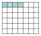
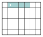
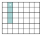
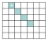

# Exercices

<p class="sous-titre">Programmation orientée objet et paradigmes</p>

!!! consignes "Mode d’emploi"

    - Niveau : ★ échauffement, ★★ classique (niveau bac), ★★★ défi ; les *coups de pouce* et les *corrigés* se déplient sous chaque exercice.

    - <span class="run" title="À programmer et tester sur machine">▶</span> *À programmer et tester* en Python (console ou éditeur en ligne).

    - **Réflexe** pour toute classe : **(1)** quels sont les **attributs** (l’état) ? **(2)** quelles sont les **méthodes** (le comportement) ? **(3)** le premier paramètre d’une méthode est **toujours** `self`.

    - Usage de l’IA, indiqué sur chaque exercice : <span class="ia ia-rouge" title="Sans IA : le but est l'automatisme lui-même"></span> aucune ; <span class="ia ia-orange" title="IA en appui : déboguer, reformuler, vérifier ; la réponse finale est la vôtre"></span> en appui (déboguer, reformuler, vérifier ; la réponse finale est écrite et comprise par vous) ; <span class="ia ia-vert" title="IA intégrée : l'exercice s'appuie sur une réponse d'IA"></span> l’exercice s’appuie sur une réponse d’IA. Voir la [charte d’usage de l’IA](../charte.md).

### Le paradigme fonctionnel

*On commence par le paradigme le plus léger : il n’utilise que des fonctions. Une fonction est **pure** si son résultat ne dépend que de ses paramètres et qu’elle ne modifie rien d’extérieur (**aucun effet de bord**).*

### <span class="stars" title="Niveau 1 sur 3">★</span> <span class="exo-num">Exercice 1</span> — Pure ou pas pure ? <span class="ia ia-rouge" title="Sans IA : le but est l'automatisme lui-même"></span> { #ex-02-1 }

Pour chacune de ces fonctions, dire si elle est **pure**, et justifier.

```python
compteur = 0
def f1(x):
    return 2 * x + 1

def f2(x):
    global compteur
    compteur = compteur + 1
    return x

def f3(liste):
    liste.append(0)
    return liste

def f4(a, b):
    return a * b
```

??? corrige "Corrigé"

    !!! remarque "Remarque"

        Plusieurs écritures sont souvent possibles : on donne **une** version simple.

    - `f1` : **pure** — son résultat ne dépend que de `x`, aucun effet de bord.

    - `f2` : **non pure** — elle modifie la variable globale `compteur` (effet de bord).

    - `f3` : **non pure** — elle modifie la liste reçue avec `append` (effet de bord).

    - `f4` : **pure** — résultat fonction des seuls paramètres, aucun effet de bord.

### <span class="stars" title="Niveau 2 sur 3">★★</span> <span class="exo-num">Exercice 2</span> — Rendre une fonction pure <span class="ia ia-orange" title="IA en appui : déboguer, reformuler, vérifier ; la réponse finale est la vôtre"></span> { #ex-02-2 }

On donne une fonction avec effet de bord :

```python
def double_tout(tab):
    for i in range(len(tab)):
        tab[i] = tab[i] * 2      # modifie tab : effet de bord
```

<span class="run" title="À programmer et tester sur machine">▶</span> Réécrire une fonction `double_tout_pur(tab)` qui **renvoie une nouvelle liste** des éléments doublés, sans modifier `tab`. Vérifier sur un exemple que la liste d’origine est bien intacte.

??? pouce "Coup de pouce"

    Partir d’une liste vide, la remplir dans une boucle, puis la renvoyer : aucune affectation de la forme `tab[i] = ...` ne doit apparaître.

```text
>>> t = [1, 2, 3]
>>> double_tout_pur(t)
[2, 4, 6]
>>> t
[1, 2, 3]
```

??? corrige "Corrigé"

    On **construit une nouvelle liste** au lieu de modifier l’ancienne : on parcourt `tab` et on garde le double de chaque élément.

    ```python
    def double_tout_pur(tab):
        return [x * 2 for x in tab]
    ```

    *Autre méthode* (sans compréhension, comme le suggère le coup de pouce) : on part d’une liste vide que l’on remplit dans une boucle.

    ```python
    def double_tout_pur(tab):
        resultat = []
        for x in tab:
            resultat.append(x * 2)
        return resultat
    ```

    La liste d’origine `t` reste bien `[1, 2, 3]`.

### <span class="stars" title="Niveau 3 sur 3">★★★</span> <span class="exo-num">Exercice 3</span> — Défi — des fonctions qui manipulent des fonctions <span class="ia ia-orange" title="IA en appui : déboguer, reformuler, vérifier ; la réponse finale est la vôtre"></span> { #ex-02-3 }

En paradigme fonctionnel, une fonction est une **valeur** comme une autre : on peut la passer en paramètre à une autre fonction, ou la renvoyer. On donne :

```python
def est_pair(n):
    return n % 2 == 0

def double(x):
    return 2 * x

def plus_un(x):
    return x + 1
```

1.  <span class="run" title="À programmer et tester sur machine">▶</span> Écrire une fonction **pure** `appliquer(f, tab)` qui renvoie la **nouvelle** liste des `f(x)` pour `x` dans `tab`. Exemple : `appliquer(abs, [-2, 3, -5])` renvoie `[2, 3, 5]`, et la liste passée en paramètre est inchangée.

2.  <span class="run" title="À programmer et tester sur machine">▶</span> Écrire une fonction pure `garder(test, tab)` qui renvoie la liste des éléments `x` de `tab` pour lesquels `test(x)` vaut `True`. Exemple : `garder(est_pair, [1, 2, 3, 4])` renvoie `[2, 4]`.

3.  <span class="run" title="À programmer et tester sur machine">▶</span> Écrire une fonction `composer(f, g)` qui **renvoie une fonction** `h` telle que `h(x)` vaut `f(g(x))`. Exemple : `composer(double, plus_un)(3)` renvoie `8`. Que renvoie `composer(plus_un, double)(3)` ?

    ??? pouce "Coup de pouce"

        Pour les questions 1 et 2 : construire une nouvelle liste, sans jamais modifier `tab` ; `f` s’appelle comme n’importe quelle fonction, `f(x)`. Pour la question 3 : on peut définir une fonction **à l’intérieur** d’une autre fonction, puis la renvoyer (sans parenthèses : on renvoie la fonction, pas son résultat).

    ??? pouce "Coup de pouce 2 (début de solution)"

        `def composer(f, g):`  
        `def h(x):`  
        `return ...`  
        `return h`

4.  Sans définir de fonction, quelle construction vue en Première donne directement le résultat de `appliquer(abs, [-2, 3, -5])` ? et celui de `garder(est_pair, [1, 2, 3, 4])` ?

??? corrige "Corrigé"

    Les paramètres `f` et `test` sont des **fonctions** : on les appelle comme les autres. On construit toujours une **nouvelle** liste, donc `tab` n’est jamais modifié : les fonctions sont pures. Une création de liste par compréhension convient parfaitement : on transforme chaque élément (`appliquer`), ou on ne garde que ceux qui passent le test (`garder`).

    ```python
    def appliquer(f, tab):
        return [f(x) for x in tab]

    def garder(test, tab):
        return [x for x in tab if test(x)]

    def composer(f, g):
        def h(x):              # fonction definie a l'interieur
            return f(g(x))
        return h               # on renvoie la fonction elle-meme
    ```

    `composer(double, plus_un)(3)` vaut `double(plus_un(3))` $= 2\times 4 = 8$, alors que `composer(plus_un, double)(3)` vaut `plus_un(double(3))` $= 6 + 1 = 7$ : l’ordre de composition compte.

    **4.** La **compréhension** : `[abs(x) for x in [-2, 3, -5]]` vaut `[2, 3, 5]` et `[x for x in [1, 2, 3, 4] if est_pair(x)]` vaut `[2, 4]`. C’est d’ailleurs exactement le corps des fonctions `appliquer` et `garder`.

### Lire et comprendre une classe

*Ici on ne programme pas (ou peu) : on **lit**, on **repère** attributs et méthodes, on **prévoit** l’affichage.*

### <span class="stars" title="Niveau 1 sur 3">★</span> <span class="exo-num">Exercice 4</span> — Lister attributs et méthodes <span class="ia ia-rouge" title="Sans IA : le but est l'automatisme lui-même"></span> { #ex-02-4 }

On donne la classe suivante.

```python
class Livre:
    def __init__(self, titre, auteur, pages):
        self.titre = titre
        self.auteur = auteur
        self.pages = pages
        self.emprunte = False

    def get_titre(self):
        return self.titre

    def emprunter(self):
        self.emprunte = True
```

1.  Lister les **attributs** de la classe `Livre` en précisant leur **type**.

2.  Lister les **méthodes** de la classe. Laquelle *renvoie* une information ? Laquelle *modifie* l’état ?

3.  Quel est le rôle du mot `self` ?

??? corrige "Corrigé"

    1.  Attributs : `titre` (`str`), `auteur` (`str`), `pages` (`int`), `emprunte` (`bool`).

    2.  Méthodes : `get_titre` *renvoie* une information (l’attribut `titre`) ; `emprunter` *modifie* l’état (passe `emprunte` à `True`). *(Le constructeur `__init__` est aussi une méthode.)*

    3.  `self` désigne l’**instance en cours** : c’est par lui qu’une méthode accède aux attributs *de cet objet précis*.

### <span class="stars" title="Niveau 1 sur 3">★</span> <span class="exo-num">Exercice 5</span> — Prévoir l’affichage <span class="ia ia-rouge" title="Sans IA : le but est l'automatisme lui-même"></span> { #ex-02-5 }

En reprenant la classe `Livre` ci-dessus, donner *sans machine* ce qu’affiche ce programme, puis vérifier.

```python
b = Livre("1984", "Orwell", 328)
print(b.get_titre())
print(b.emprunte)
b.emprunter()
print(b.emprunte)
```

??? corrige "Corrigé"

    L’affichage est :

    ```text
    1984
    False
    True
    ```

    À la création, `emprunte` vaut `False` ; après l’appel `b.emprunter()`, il vaut `True`.

### <span class="stars" title="Niveau 2 sur 3">★★</span> <span class="exo-num">Exercice 6</span> — Retrouver l’erreur <span class="ia ia-orange" title="IA en appui : déboguer, reformuler, vérifier ; la réponse finale est la vôtre"></span> { #ex-02-6 }

Chacun de ces trois extraits contient **une** erreur classique de débutant en POO. La repérer et la corriger.

??? pouce "Coup de pouce"

    Relire le « réflexe » du mode d’emploi. Quel est toujours le premier paramètre d’une méthode ? Comment crée-t-on un attribut dans le constructeur ? Comment accède-t-on à l’attribut d’un objet depuis l’extérieur de la classe ?

```python
# (a)
class Chien:
    def __init__(nom):
        self.nom = nom

# (b)
class Chat:
    def __init__(self, nom):
        nom = nom

# (c)  (la classe Chien de (a) etant corrigee)
medor = Chien("Medor")
print(nom)
```

??? corrige "Corrigé"

    1.  Il manque `self` en premier paramètre : `def __init__(self, nom):`.

    2.  La ligne `nom = nom` ne crée aucun attribut (elle réaffecte le paramètre à lui-même) : il faut `self.nom = nom`.

    3.  `nom` n’existe pas en dehors de la classe ; l’attribut se lit `medor.nom` (notation pointée).

### Créer et manipuler des instances

### <span class="stars" title="Niveau 1 sur 3">★</span> <span class="exo-num">Exercice 7</span> — Créer des instances <span class="ia ia-rouge" title="Sans IA : le but est l'automatisme lui-même"></span> { #ex-02-7 }

On donne la classe des points du plan.

```python
class Point:
    def __init__(self, x, y):
        self.x = x
        self.y = y
```

<span class="run" title="À programmer et tester sur machine">▶</span> **1.** Écrire le code qui crée deux instances : `origine` au point $(0, 0)$ et `p` au point $(3, 5)$. **2.** Afficher l’abscisse de `p` (attendu : `3`).

??? corrige "Corrigé"

    ```python
    origine = Point(0, 0)
    p = Point(3, 5)
    print(p.x)      # affiche 3
    ```

### <span class="stars" title="Niveau 1 sur 3">★</span> <span class="exo-num">Exercice 8</span> — Compléter un constructeur <span class="ia ia-rouge" title="Sans IA : le but est l'automatisme lui-même"></span> { #ex-02-8 }

<span class="run" title="À programmer et tester sur machine">▶</span> Recopier et compléter le constructeur de la classe `Eleve` pour qu’elle possède trois attributs : `nom`, `classe` et une liste `notes` **vide** au départ.

```python
class Eleve:
    def __init__(self, nom, classe):
        self.nom = ...
        self.classe = ...
        self.notes = ...      # liste vide au depart

e = Eleve("Zoe", "TG1")
print(e.nom, e.classe, e.notes)   # attendu : Zoe TG1 []
```

??? corrige "Corrigé"

    ```python
    class Eleve:
        def __init__(self, nom, classe):
            self.nom = nom
            self.classe = classe
            self.notes = []
    ```

### <span class="stars" title="Niveau 2 sur 3">★★</span> <span class="exo-num">Exercice 9</span> — Ajouter des méthodes <span class="ia ia-orange" title="IA en appui : déboguer, reformuler, vérifier ; la réponse finale est la vôtre"></span> { #ex-02-9 }

<span class="run" title="À programmer et tester sur machine">▶</span> En repartant de la classe `Eleve` précédente, ajouter deux méthodes :

- `ajouter_note(self, note)` qui ajoute une note à la liste `notes` ;

- `moyenne(self)` qui renvoie la moyenne des notes (on suppose la liste non vide).

  ??? pouce "Coup de pouce"

      La liste à modifier est l’attribut `self.notes` (méthode `append`). Pour la moyenne : somme des notes divisée par leur nombre (`sum` et `len`, ou une boucle).

Exemple d’utilisation :

```text
>>> e = Eleve("Zoe", "TG1")
>>> e.ajouter_note(12)
>>> e.ajouter_note(16)
>>> e.moyenne()
14.0
```

??? corrige "Corrigé"

    ```python
    class Eleve:
        def __init__(self, nom, classe):
            self.nom = nom
            self.classe = classe
            self.notes = []

        def ajouter_note(self, note):
            self.notes.append(note)

        def moyenne(self):
            return sum(self.notes) / len(self.notes)
    ```

### Écrire une classe complète

### <span class="stars" title="Niveau 2 sur 3">★★</span> <span class="exo-num">Exercice 10</span> — La classe Rectangle <span class="ia ia-orange" title="IA en appui : déboguer, reformuler, vérifier ; la réponse finale est la vôtre"></span> { #ex-02-10 }

<span class="run" title="À programmer et tester sur machine">▶</span> Écrire entièrement une classe `Rectangle` avec :

- un constructeur prenant la `largeur` et la `hauteur` ;

- une méthode `aire(self)` et une méthode `perimetre(self)` ;

- une méthode `est_carre(self)` qui renvoie un booléen.

  ??? pouce "Coup de pouce"

      Chaque méthode ne fait qu’un calcul sur `self.largeur` et `self.hauteur`. `est_carre` peut renvoyer directement le résultat d’une comparaison, sans `if`.

Exemple :

```text
>>> r = Rectangle(4, 3)
>>> r.aire()
12
>>> r.perimetre()
14
>>> r.est_carre()
False
```

??? corrige "Corrigé"

    ```python
    class Rectangle:
        def __init__(self, largeur, hauteur):
            self.largeur = largeur
            self.hauteur = hauteur

        def aire(self):
            return self.largeur * self.hauteur

        def perimetre(self):
            return 2 * (self.largeur + self.hauteur)

        def est_carre(self):
            return self.largeur == self.hauteur
    ```

### <span class="stars" title="Niveau 2 sur 3">★★</span> <span class="exo-num">Exercice 11</span> — La classe Chronometre <span class="ia ia-orange" title="IA en appui : déboguer, reformuler, vérifier ; la réponse finale est la vôtre"></span> { #ex-02-11 }

<span class="run" title="À programmer et tester sur machine">▶</span> Écrire une classe `Chronometre` qui modélise un compteur de secondes.

- Le constructeur initialise un attribut `secondes` à `0`.

- `tic(self)` ajoute une seconde.

- `reset(self)` remet le compteur à `0`.

- `affichage(self)` renvoie une chaîne au format `"mm:ss"` (minutes et secondes sur deux chiffres).

Exemple : après $75$ appels à `tic`, `affichage()` renvoie `"01:15"`.

??? pouce "Coup de pouce"

    Le nombre de minutes et le nombre de secondes restantes s’obtiennent par division entière (`//`) et reste (`%`) de `self.secondes` par `60`. `f"{m:02d}"` affiche un entier sur deux chiffres.

??? corrige "Corrigé"

    Le format `"mm:ss"` s’obtient avec la division entière (`//` pour les minutes) et le reste (`%` pour les secondes).

    ```python
    class Chronometre:
        def __init__(self):
            self.secondes = 0

        def tic(self):
            self.secondes = self.secondes + 1

        def reset(self):
            self.secondes = 0

        def affichage(self):
            m = self.secondes // 60
            s = self.secondes % 60
            return f"{m:02d}:{s:02d}"
    ```

### <span class="stars" title="Niveau 3 sur 3">★★★</span> <span class="exo-num">Exercice 12</span> — Défi — la classe Fraction <span class="ia ia-orange" title="IA en appui : déboguer, reformuler, vérifier ; la réponse finale est la vôtre"></span> { #ex-02-12 }

<span class="run" title="À programmer et tester sur machine">▶</span> Écrire une classe `Fraction` représentant un nombre rationnel par un `numerateur` et un `denominateur`.

- La fraction sera **automatiquement simplifiée** à la création (diviser numérateur et dénominateur par leur PGCD).

- Une méthode `__repr__(self)` pour que la fraction s’affiche sous la forme `3/4` rien qu’en tapant son nom dans la console.

- Une méthode `fois(self, autre)` renvoie une **nouvelle** `Fraction` produit des deux (sans modifier ni `self` ni `autre` : dans l’esprit fonctionnel).

  ??? pouce "Coup de pouce"

      Écrire d’abord, à part, une fonction `pgcd(a, b)` (algorithme d’Euclide), puis simplifier dès le constructeur. `fois` construit et renvoie un **nouvel** objet `Fraction(...)`.

  ??? pouce "Coup de pouce 2 (début de solution)"

      `class Fraction:`  
      `def __init__(self, num, den):`  
      `d = pgcd(num, den)`  
      `self.numerateur = num // d`

Exemple :

```text
>>> f = Fraction(6, 8)
>>> f
3/4
>>> print(f.fois(Fraction(2, 3)))
1/2
```

??? corrige "Corrigé"

    On simplifie **dans le constructeur** en divisant par le PGCD. On définit `__repr__` (et non `__str__`) : ainsi la fraction s’affiche proprement en tapant simplement son nom dans la console — et `print` en bénéficie aussi par ricochet. La méthode `fois` construit et **renvoie** une nouvelle `Fraction` (elle ne modifie rien : c’est l’esprit fonctionnel).

    ```python
    def pgcd(a, b):
        while b != 0:
            a, b = b, a % b
        return a

    class Fraction:
        def __init__(self, num, den):
            d = pgcd(num, den)
            self.numerateur = num // d
            self.denominateur = den // d

        def __repr__(self):
            return f"{self.numerateur}/{self.denominateur}"

        def fois(self, autre):
            return Fraction(self.numerateur * autre.numerateur,
                            self.denominateur * autre.denominateur)
    ```

### <span class="stars" title="Niveau 3 sur 3">★★★</span> <span class="exo-num">Exercice 13</span> — Défi — un réseau d’amis <span class="ia ia-orange" title="IA en appui : déboguer, reformuler, vérifier ; la réponse finale est la vôtre"></span> { #ex-02-13 }

On modélise un petit réseau social : chaque personne est un objet de la classe `Personne`, qui possède un attribut `nom` et un attribut `amis`, liste d’**objets** `Personne` (vide à la création).

- <span class="run" title="À programmer et tester sur machine">▶</span> Écrire le constructeur, puis la méthode `ajouter_ami(self, autre)` : l’amitié est **réciproque** (chacun est ajouté aux amis de l’autre), sans jamais créer de doublon, et une personne ne peut pas être son propre ami.

- <span class="run" title="À programmer et tester sur machine">▶</span> Écrire la méthode `noms_amis(self)`, qui renvoie la liste des noms des amis, et la méthode `amis_communs(self, autre)`, qui renvoie la liste des noms des amis communs à `self` et `autre`.

- <span class="run" title="À programmer et tester sur machine">▶</span> Écrire la méthode `amis_d_amis(self)`, qui renvoie la liste, sans doublon, des noms des amis de ses amis qui ne sont ni `self` ni déjà ses amis (les « suggestions d’amis »).

- Pourquoi la liste `amis` contient-elle des objets `Personne` plutôt que de simples noms ?

  ??? pouce "Coup de pouce"

      Dans `ajouter_ami`, tout faire en une fois : un test pour écarter les cas interdits (`autre is self`, `autre in self.amis`), puis deux `append`, un dans chaque liste. Pour `amis_d_amis` : deux boucles imbriquées (mes amis, puis les amis de chacun d’eux) et trois conditions avant d’ajouter un nom.

  ??? pouce "Coup de pouce 2 (début de solution)"

      `def ajouter_ami(self, autre):`  
      `if autre is self or autre in self.amis:`  
      `return`  
      `self.amis.append(autre)`

Exemple :

```text
>>> a, b = Personne("Ada"), Personne("Bob")
>>> c, d = Personne("Chloé"), Personne("Dan")
>>> a.ajouter_ami(b); a.ajouter_ami(c); b.ajouter_ami(c); c.ajouter_ami(d)
>>> a.ajouter_ami(b)            # deja amis : rien ne change
>>> a.noms_amis(), c.noms_amis()
(['Bob', 'Chloé'], ['Ada', 'Bob', 'Dan'])
>>> a.amis_communs(b), a.amis_d_amis()
(['Chloé'], ['Dan'])
```

??? corrige "Corrigé"

    L’attribut `amis` contient des **objets** : un objet en connaît d’autres, et ils **interagissent** (une méthode de `a` modifie aussi l’état de `autre`).

    ```python
    class Personne:
        def __init__(self, nom):
            self.nom = nom
            self.amis = []          # liste d'objets Personne

        def ajouter_ami(self, autre):
            if autre is self or autre in self.amis:
                return              # cas interdits : rien a faire
            self.amis.append(autre)
            autre.amis.append(self) # amitie reciproque

        def noms_amis(self):
            return [p.nom for p in self.amis]

        def amis_communs(self, autre):
            return [p.nom for p in self.amis if p in autre.amis]

        def amis_d_amis(self):
            resultat = []
            for ami in self.amis:
                for p in ami.amis:
                    if p is not self and p not in self.amis:
                        if p.nom not in resultat:     # pas de doublon
                            resultat.append(p.nom)
            return resultat
    ```

    Sur l’exemple : `a.amis_d_amis()` renvoie `[’Dan’]` (ami de Chloé) ; Bob, déjà ami d’Ada, n’est pas proposé.

    **Pourquoi des objets ?** En stockant les objets eux-mêmes, on accède directement à *toutes* leurs informations, y compris à *leurs* amis (indispensable pour `amis_d_amis`) ; deux personnes peuvent aussi porter le même nom sans être confondues. Avec de simples noms, il faudrait une structure supplémentaire pour retrouver l’objet correspondant.

### Encapsulation

### <span class="stars" title="Niveau 2 sur 3">★★</span> <span class="exo-num">Exercice 14</span> — Corriger une mauvaise pratique <span class="ia ia-orange" title="IA en appui : déboguer, reformuler, vérifier ; la réponse finale est la vôtre"></span> { #ex-02-14 }

Un élève manipule un compte directement par son attribut :

```python
class Compte:
    def __init__(self, solde):
        self.solde = solde

c = Compte(100)
c.solde = c.solde - 500     # le solde devient negatif !
print(c.solde)
```

<span class="run" title="À programmer et tester sur machine">▶</span> **1.** Expliquer pourquoi manipuler `c.solde` directement est une mauvaise pratique. **2.** Réécrire la classe `Compte` en **encapsulant** le solde (attribut `_solde`) et en fournissant une méthode `retirer(self, montant)` qui **refuse** un retrait rendant le solde négatif (elle renvoie `True` si le retrait a eu lieu, `False` sinon) et une méthode `solde(self)` qui renvoie le solde.

??? pouce "Coup de pouce"

    Que peut encore garantir la classe si n’importe qui écrit dans ses attributs ? Pour `retirer` : comparer le montant à `self._solde` **avant** de modifier quoi que ce soit.

??? corrige "Corrigé"

    **1.** En écrivant directement `c.solde = c.solde - 500`, on *court-circuite* la classe : aucun contrôle n’est fait, et le solde peut devenir absurde (négatif). L’objet n’a plus la garantie de rester dans un état correct.

    **2.**

    ```python
    class Compte:
        def __init__(self, solde):
            self._solde = solde

        def solde(self):
            return self._solde

        def retirer(self, montant):
            if 0 < montant <= self._solde:
                self._solde = self._solde - montant
                return True
            return False
    ```

    Désormais `c.retirer(500)` sur un solde de $100$ renvoie `False` et laisse le solde inchangé.

### Choisir un paradigme

### <span class="stars" title="Niveau 1 sur 3">★</span> <span class="exo-num">Exercice 15</span> — Le bon style au bon endroit <span class="ia ia-rouge" title="Sans IA : le but est l'automatisme lui-même"></span> { #ex-02-15 }

Pour chacune des situations suivantes, indiquer le paradigme *a priori* le plus naturel (impératif, objet, ou fonctionnel), et justifier en une phrase.

1.  modéliser les personnages, monstres et objets d’un jeu vidéo ;

2.  appliquer une même transformation à tous les éléments d’une liste, sans risque d’effet de bord ;

3.  dérouler un algorithme de tri étape par étape.

??? corrige "Corrigé"

    1.  **objet** : chaque entité (personnage, monstre, objet) a un état et des comportements propres ;

    2.  **fonctionnel** : une transformation sans effet de bord évite de corrompre la liste d’origine ;

    3.  **impératif** : un tri se décrit naturellement comme une suite d’étapes qui modifient un tableau.

### Vers le bac

### <span class="stars" title="Niveau 2 sur 3">★★</span> <span class="exo-num">Exercice 16</span> — Le domaine skiable (d’après Métropole 2024, jour 2) <span class="ia ia-orange" title="IA en appui : déboguer, reformuler, vérifier ; la réponse finale est la vôtre"></span> { #ex-02-16 }

*On ne traite ici que la partie « programmation objet » du sujet.* Une station de ski modélise ses pistes par une classe `Piste` et son domaine par une classe `Domaine`. Le code est donné en **annexe** ci-dessous ; il se termine par la création du domaine `lievre_blanc` et de ses pistes.

1.  Lister les attributs de la classe `Piste` en précisant leur type.

2.  Une piste est de couleur `’noire’` si son dénivelé est $\geqslant 100$ m ; `’rouge’` s’il est $< 100$ et $\geqslant 70$ ; `’bleue’` s’il est $< 70$ et $\geqslant 40$ ; `’verte’` s’il est $< 40$. Écrire la méthode `set_couleur(self)` de la classe `Piste` qui affecte à l’attribut `couleur` la bonne chaîne.

    ??? pouce "Coup de pouce"

        Une cascade `if` / `elif` / `else` sur `self.denivele`, en partant du seuil le plus élevé : chaque test n’a alors besoin que d’une seule comparaison.

3.  On exécute `lievre_blanc.get_pistes()`. Parmi les propositions, indiquer le **type** de l’élément renvoyé : *(A)* une chaîne ; *(B)* un objet `Piste` ; *(C)* une liste de chaînes ; *(D)* une liste d’objets `Piste`.

4.  Écrire un programme qui **ferme** toutes les pistes vertes, c’est-à-dire affecte `False` à leur attribut `ouverte`.

5.  Écrire une fonction `pistes_de_couleur(lst, couleur)` qui prend une liste `lst` de pistes et une chaîne `couleur`, et renvoie la liste des **noms** des pistes de cette couleur.

**Annexe — code des classes**

```python
class Piste:
    def __init__(self, nom, denivele, longueur):
        self.nom = nom
        self.denivele = denivele    # en metres
        self.longueur = longueur    # en kilometres
        self.couleur = ''
        self.ouverte = True

    def get_nom(self):
        return self.nom

    def set_couleur(self):
        ...   # A COMPLETER (question 2)

    def get_couleur(self):
        return self.couleur

class Domaine:
    def __init__(self, a):
        self.nom = a
        self.pistes = []

    def ajouter_piste(self, nom, denivele, longueur):
        self.pistes.append(Piste(nom, denivele, longueur))

    def get_pistes(self):
        return self.pistes

lievre_blanc = Domaine('Le Lievre blanc')
lievre_blanc.ajouter_piste('Petit Bonheur', 120, 1.5)
lievre_blanc.ajouter_piste('Foret', 105, 2.3)
lievre_blanc.ajouter_piste('Duvallon', 140, 1.2)
lievre_blanc.ajouter_piste('Les Gentianes', 85, 2.0)
lievre_blanc.ajouter_piste('Le Chamois', 55, 1.8)
lievre_blanc.ajouter_piste('Les Marmottes', 25, 0.9)
lievre_blanc.ajouter_piste('Le Jardin', 15, 0.4)
for piste in lievre_blanc.get_pistes():
    piste.set_couleur()     # une fois la question 2 traitee
```

??? corrige "Corrigé"

    1.  Attributs de `Piste` : `nom` (`str`), `denivele` (`int`), `longueur` (`float`), `couleur` (`str`), `ouverte` (`bool`).

    2.

        ```python
        def set_couleur(self):
            if self.denivele >= 100:
                self.couleur = 'noire'
            elif self.denivele >= 70:
                self.couleur = 'rouge'
            elif self.denivele >= 40:
                self.couleur = 'bleue'
            else:
                self.couleur = 'verte'
        ```

    3.  Proposition **(D)** : une liste d’objets de type `Piste`.

    4.

        ```python
        for piste in lievre_blanc.get_pistes():
            if piste.get_couleur() == 'verte':
                piste.ouverte = False
        ```

        *(`set_couleur` a été appelée sur chaque piste à la fin de l’annexe : ici, `Les Marmottes` et `Le Jardin` sont fermées.)*

    5.  On parcourt les pistes et on garde le nom de celles qui ont la bonne couleur :

        ```python
        def pistes_de_couleur(lst, couleur):
            return [piste.get_nom() for piste in lst if piste.get_couleur() == couleur]
        ```

        *Autre méthode* (boucle et `append`) :

        ```python
        def pistes_de_couleur(lst, couleur):
            noms = []
            for piste in lst:
                if piste.get_couleur() == couleur:
                    noms.append(piste.get_nom())
            return noms
        ```

        Par exemple `pistes_de_couleur(lievre_blanc.get_pistes(), ’noire’)` renvoie `[’Petit Bonheur’, ’Foret’, ’Duvallon’]`.

### <span class="stars" title="Niveau 2 sur 3">★★</span> <span class="exo-num">Exercice 17</span> — Valeurs nutritionnelles (d’après La Réunion 2023, jour 1) <span class="ia ia-orange" title="IA en appui : déboguer, reformuler, vérifier ; la réponse finale est la vôtre"></span> { #ex-02-17 }

Pour chaque aliment, on stocke ses caractéristiques nutritionnelles (pour 100 g) dans un objet de la classe `Aliment` : énergie (kcal), protéines, glucides et lipides (en grammes).

```python
class Aliment:
    def __init__(self, e, p, g, l):
        self.energie = e
        self.proteines = p
        self.glucides = g
        self.lipides = l
```

1.  Le lait entier a pour valeurs : énergie `65.1`, protéines `3.32`, glucides `4.85`, lipides `3.63`. Écrire l’instruction qui crée l’instance `lait`.

2.  Donner l’instruction qui permet d’obtenir la valeur `65.1` (l’énergie de `lait`).

3.  Une erreur s’est glissée : la masse de protéines du lait est en réalité `3.4`. Donner l’instruction qui **modifie** cet attribut de `lait`.

4.  On veut ajouter une méthode `energie_reelle` qui renvoie l’énergie d’une masse donnée (en grammes). Par exemple, `lait.energie_reelle(245)` renvoie environ `159.495` (soit $245 \times 65{,}1 \div 100$). Recopier et compléter :

    ```python
    def energie_reelle(..., masse):
        return ...
    ```

5.  On regroupe les aliments dans un **dictionnaire** `aliments` dont les clés sont les noms : `aliments = {’lait’: lait, ’pain’: pain, …}`. Donner l’instruction qui obtient la valeur énergétique réelle de `220` g de pain.

6.  <span class="run" title="À programmer et tester sur machine">▶</span> Écrire une fonction `plus_calorique(aliments)` qui renvoie le **nom** de l’aliment le plus énergétique (pour 100 g) du dictionnaire `aliments`.

    ??? pouce "Coup de pouce"

        C’est une recherche de maximum (Première) : parcourir les clés du dictionnaire en mémorisant le nom du « champion » et comparer les attributs `energie` des objets associés.

??? corrige "Corrigé"

    1.  `lait = Aliment(65.1, 3.32, 4.85, 3.63)`.

    2.  `lait.energie` (renvoie `65.1`).

    3.  `lait.proteines = 3.4`.

    4.

        ```python
        def energie_reelle(self, masse):
            return self.energie * masse / 100
        ```

        *(`lait.energie_reelle(245)` renvoie `159.49499999999998`, soit $159{,}495$ à l’erreur d’arrondi des flottants près.)*

    5.  `aliments[’pain’].energie_reelle(220)`.

    6.

        ```python
        def plus_calorique(aliments):
            nom_max = None
            for nom in aliments:
                if nom_max is None or aliments[nom].energie > aliments[nom_max].energie:
                    nom_max = nom
            return nom_max
        ```

### <span class="stars" title="Niveau 2 sur 3">★★</span> <span class="exo-num">Exercice 18</span> — La classe Date (d’après Asie 2025, jour 2) <span class="ia ia-orange" title="IA en appui : déboguer, reformuler, vérifier ; la réponse finale est la vôtre"></span> { #ex-02-18 }

On manipule des dates grâce à la classe `Date` ci-dessous.

```python
class Date:
    def __init__(self, jour, mois, annee):
        self.jour = ...
        self.mois = ...
        self.annee = ...
        self.nb_jours_par_mois = [31, 28, 31, 30, 31, 30,
                                  31, 31, 30, 31, 30, 31]

    def get_annee(self):
        return ...

    def est_bissextile(self):
        ...   # a ecrire (question 4)
```

1.  Recopier et compléter les trois premières lignes du constructeur (affectation des attributs `jour`, `mois` et `annee`).

2.  Écrire l’instruction qui crée l’instance `d` représentant le **19 juin 2024**.

3.  Compléter la méthode `get_annee` (elle renvoie l’attribut `annee`).

4.  Une année est bissextile si elle est divisible par 4 **mais pas** par 100, **ou** si elle est divisible par 400. Écrire la méthode `est_bissextile(self)` qui renvoie `True` ou `False`. *(Rappel : `a % n == 0` teste la divisibilité de `a` par `n`.)*

5.  <span class="run" title="À programmer et tester sur machine">▶</span> Écrire la méthode `nb_jours_passes(self)` qui renvoie le nombre de jours écoulés depuis le **1<sup>er</sup> janvier** de l’année (jour de la date compris). On ajoutera les jours des mois précédents (via `nb_jours_par_mois`), sans oublier le **29 février** si l’année est bissextile.

    ??? pouce "Coup de pouce"

        Additionner `nb_jours_par_mois[i]` pour les mois **précédant** `self.mois` (le mois de janvier a l’indice `0`), ajouter `self.jour`, puis `1` si l’année est bissextile **et** que la date est après février.

6.  <span class="run" title="À programmer et tester sur machine">▶</span> En déduire la méthode `nb_jours_restants(self)` qui renvoie le nombre de jours restant jusqu’à la fin de l’année. *(Une année compte 365 jours, ou 366 si elle est bissextile.)*

??? corrige "Corrigé"

    1.  `self.jour = jour` ; `self.mois = mois` ; `self.annee = annee`.

    2.  `d = Date(19, 6, 2024)`.

    3.  `return self.annee`.

    4.

        ```python
        def est_bissextile(self):
            a = self.annee
            return (a % 4 == 0 and a % 100 != 0) or (a % 400 == 0)
        ```

        *Ainsi 2024 et 2000 sont bissextiles, mais 1900 ne l’est pas.*

    5.

        ```python
        def nb_jours_passes(self):
            total = self.jour
            for m in range(self.mois - 1):          # mois complets precedents
                total = total + self.nb_jours_par_mois[m]
            if self.mois > 2 and self.est_bissextile():
                total = total + 1                   # 29 fevrier
            return total
        ```

    6.

        ```python
        def nb_jours_restants(self):
            if self.est_bissextile():
                return 366 - self.nb_jours_passes()
            return 365 - self.nb_jours_passes()
        ```

### <span class="stars" title="Niveau 2 sur 3">★★</span> <span class="exo-num">Exercice 19</span> — Colorier une carte (d’après Métropole 2023, jour 1) <span class="ia ia-orange" title="IA en appui : déboguer, reformuler, vérifier ; la réponse finale est la vôtre"></span> { #ex-02-19 }

On modélise une région d’un pays par la classe `Region` ci-dessous.

```python
class Region:
    def __init__(self, nom_region):
        self.nom = nom_region
        self.tab_voisines = []
        self.tab_couleurs_disponibles = ['rouge', 'vert',
            'bleu', 'jaune', 'orange', 'marron']
        self.couleur_attribuee = None
```

1.  Pour chacun des noms `nom`, `tab_voisines` et `couleur_attribuee`, préciser s’il s’agit d’un **objet**, d’un **attribut**, d’une **méthode** ou d’une **classe**. Donner aussi le **type** du paramètre `nom_region`.

2.  Écrire l’instruction qui crée une instance `ge` correspondant à la région « Grand Est ».

3.  Écrire les trois méthodes suivantes de la classe `Region` :

    - `renvoie_premiere_couleur_disponible(self)` : renvoie la première couleur de `tab_couleurs_disponibles` (supposé non vide) ;

    - `renvoie_nb_voisines(self)` : renvoie le nombre de régions voisines ;

    - `est_coloriee(self)` : renvoie `True` si une couleur a été attribuée à la région, `False` sinon.

      ??? pouce "Coup de pouce"

          Chaque méthode tient en une ligne. Que vaut `couleur_attribuee` tant qu’aucune couleur n’a été choisie ?

??? corrige "Corrigé"

    1.  `nom`, `tab_voisines` et `couleur_attribuee` sont des **attributs** ; le paramètre `nom_region` est de type `str` (chaîne de caractères).

    2.  `ge = Region("Grand Est")`.

    3.

        ```python
        def renvoie_premiere_couleur_disponible(self):
            return self.tab_couleurs_disponibles[0]

        def renvoie_nb_voisines(self):
            return len(self.tab_voisines)

        def est_coloriee(self):
            return self.couleur_attribuee is not None
        ```

### <span class="stars" title="Niveau 2 sur 3">★★</span> <span class="exo-num">Exercice 20</span> — Des colis à expédier (d’après Amérique du Nord 2025, jour 1) <span class="ia ia-orange" title="IA en appui : déboguer, reformuler, vérifier ; la réponse finale est la vôtre"></span> { #ex-02-20 }

*Sujet repris en entier : programmation objet, puis tri, récursivité (revoir le chapitre Récursivité) et algorithme glouton.*

Une entreprise gère les colis qu’elle expédie à l’aide d’une application. Chaque colis a un identifiant unique, un poids, une adresse de livraison et un état : `’préparé’`, `’transit’` ou `’livré’`. On dispose pour cela de la classe `Colis` suivante : à la création d’un colis, l’état vaut `’préparé’` et les autres valeurs sont passées en paramètres.

```python
class Colis:
    def __init__(self, id, poids, adresse):
        self.id = id              # identifiant unique (str)
        self.poids = poids        # poids en kilogrammes (float)
        self.adresse = adresse    # adresse de destination (str)
        self.etat = 'préparé'     # 'préparé', 'transit' ou 'livré'
```

On crée par exemple deux colis ; on accède au poids d’un colis `c` par `c.poids`, à son état par `c.etat`.

```python
colisA = Colis('AC12', 5.0, '20 rue de la paix 57000 Metz')
colisB = Colis('AF34', 10.25, '32 rue du centre 57000 Metz')
```

1.  Écrire la méthode `passer_transit` de la classe `Colis` qui permet de mettre l’état du colis à la valeur `’transit’`.

On dispose de la fonction `ajouter_colis` ; après les trois instructions de droite, la liste `liste_colis` contient les deux colis créés.

```python
def ajouter_colis(liste, colis):
    # ajoute le colis a la fin de la liste
    liste.append(colis)
```

```python
liste_colis = []
ajouter_colis(liste_colis, colisA)
ajouter_colis(liste_colis, colisB)
```

1.  Dans cette question uniquement, on considère que le transporteur refuse les colis de plus de 25 kg. Recopier et modifier la fonction `ajouter_colis` pour qu’elle ajoute le colis à la liste si son poids est inférieur ou égal à 25 kg, et qu’elle affiche le message « Dépassement du poids maximal autorisé » sinon.

2.  Écrire une fonction `nb_colis` qui prend en paramètre une liste d’objets de la classe `Colis` et renvoie le nombre de colis de cette liste.

3.  Recopier et compléter les lignes 2 et 4 de la fonction `poids_total`, qui renvoie le poids total des colis de la liste.

    ```python
    def poids_total(liste):
        total = ...
        for c in liste:
            total = ...
        return total
    ```

4.  Écrire une fonction `liste_colis_etat` qui prend en paramètres une liste d’objets de la classe `Colis` et une chaîne `statut` (parmi `’préparé’`, `’transit’` ou `’livré’`), et renvoie une nouvelle liste contenant les colis de cette liste dont l’état est `statut`.

L’entreprise tente d’optimiser, à l’aide d’un algorithme **glouton**, le chargement des colis dans un camion de capacité donnée (en kilogrammes), sans tenir compte du volume : on charge les colis par ordre **décroissant** de poids, sans dépasser la capacité du camion. Il faut donc trier la liste des colis par poids décroissants, ce que fait la fonction `tri_decroissant`.

```python
def tri_decroissant(liste):
    n = len(liste)
    for i in range(n - 1):
        min_pos = i
        for j in range(i + 1, n):
            if liste[j].poids > liste[min_pos].poids:
                min_pos = j
        # Echanger les elements
        temp = liste[i]
        liste[i] = liste[min_pos]
        liste[min_pos] = temp
    return liste
```

1.  Donner le nom du tri utilisé dans `tri_decroissant`, ainsi que son coût dans le pire des cas.

2.  Citer un autre algorithme de tri qui aurait pu être utilisé, ainsi que son coût dans le pire des cas.

La fonction récursive `chargement_glouton` a pour paramètres `liste` (une liste de colis triés par poids décroissants), `rang` (un indice compris entre `0` inclus et `len(liste)` inclus) et `capacite` (une charge en kilogrammes). Elle renvoie la liste des colis à charger selon l’algorithme glouton, en supposant que la charge restante dans le camion est `capacite` et en ne considérant que les colis de `liste` d’indice supérieur ou égal à `rang`.

```python
def chargement_glouton(liste, rang, capacite):
    if rang == len(liste):
        return ...
    elif liste[rang].poids <= ...:
        return ... + chargement_glouton(liste, ..., ...)
    else:
        return chargement_glouton(liste, ..., ...)
```

1.  Recopier et compléter la fonction `chargement_glouton`.

    ??? pouce "Coup de pouce"

        Que renvoyer quand il n’y a plus de colis à examiner (une liste !) ? Si le colis de rang `rang` est chargé, que deviennent le rang et la capacité restante pour l’appel suivant ? Et s’il ne l’est pas ?

2.  Expliquer brièvement pourquoi un appel à `chargement_glouton` peut provoquer l’erreur suivante :

    ```text
    RecursionError: maximum recursion depth exceeded while
    calling a Python object.
    ```

3.  <span class="run" title="À programmer et tester sur machine">▶</span> Écrire une fonction **itérative** (sans récursivité) `chargement_glouton2(liste, capacite)`, où `liste` est une liste de colis triés par poids décroissants et `capacite` la capacité du camion en kilogrammes, qui renvoie la liste des colis à charger selon le même algorithme glouton. On pourra créer une liste `colis_a_charger`, puis parcourir tous les colis triés en ajoutant à cette liste chaque colis qui rentre encore dans le camion (le poids total ne doit pas excéder la capacité du camion).

    ??? pouce "Coup de pouce 2 (début de solution)"

        `def chargement_glouton2(liste, capacite):`  
        `colis_a_charger = []`  
        `charge = 0`  
        `for c in liste:`

??? corrige "Corrigé"

    1.  Méthode à placer dans la classe `Colis` :

        ```python
            def passer_transit(self):
                self.etat = 'transit'
        ```

    2.

        ```python
        def ajouter_colis(liste, colis):
            if colis.poids <= 25:
                liste.append(colis)
            else:
                print("Dépassement du poids maximal autorisé")
        ```

    3.

        ```python
        def nb_colis(liste):
            return len(liste)
        ```

    4.  Ligne 2 : `total = 0` ; ligne 4 : `total = total + c.poids`. Avec `liste_colis`, on obtient `15.25`.

    5.  On ne garde que les colis dont l’état est `statut` (une nouvelle liste est créée) :

        ```python
        def liste_colis_etat(liste, statut):
            return [c for c in liste if c.etat == statut]
        ```

    6.  C’est un **tri par sélection** (on sélectionne le plus lourd des colis restants et on le place en position `i`), de coût **quadratique** ($n^2$) dans le pire des cas.

    7.  Par exemple le **tri fusion**, de coût $n \log_2 n$ dans le pire des cas.

    8.

        ```python
        def chargement_glouton(liste, rang, capacite):
            if rang == len(liste):
                return []
            elif liste[rang].poids <= capacite:
                return [liste[rang]] + chargement_glouton(liste, rang + 1,
                                                          capacite - liste[rang].poids)
            else:
                return chargement_glouton(liste, rang + 1, capacite)
        ```

    9.  Chaque appel récursif augmente `rang` de 1 : pour une liste de $n$ colis, il y a $n + 1$ appels imbriqués. Python limite la profondeur de la pile d’appels (environ 1000 par défaut) : avec une liste de plusieurs milliers de colis, la limite est dépassée et Python lève `RecursionError`.

    10.

        ```python
        def chargement_glouton2(liste, capacite):
            colis_a_charger = []
            charge = 0
            for c in liste:
                if charge + c.poids <= capacite:
                    colis_a_charger.append(c)
                    charge = charge + c.poids
            return colis_a_charger
        ```

        Sur des listes tirées au hasard, elle renvoie toujours le même résultat que `chargement_glouton(liste, 0, capacite)`.

### <span class="stars" title="Niveau 2 sur 3">★★</span> <span class="exo-num">Exercice 21</span> — Puissance 4 : la grille de jeu (d’après Amérique du Nord 2026, jour 1, partie A) <span class="ia ia-orange" title="IA en appui : déboguer, reformuler, vérifier ; la réponse finale est la vôtre"></span> { #ex-02-21 }

Le jeu puissance 4 se joue à deux joueurs dans une grille de 6 lignes et 7 colonnes. Une couleur de pion, blanc ou noir, est attribuée à chaque joueur ; ils jouent à tour de rôle. À son tour, un joueur choisit une colonne dans laquelle il introduit un pion de sa couleur : la grille étant verticale, le pion tombe et bute soit sur le bas de la grille, soit sur un pion déjà placé. Le but est d’aligner au moins quatre pions de sa couleur dans n’importe quelle direction (horizontalement, verticalement, en diagonale). Le premier à y parvenir a gagné.

{ .tikz loading=lazy }

Figure 1. Une partie gagnée par le joueur blanc (numéros des lignes à gauche, des colonnes en bas).

Dans cet exercice, on programme la grille de jeu et le calcul de son **score**. La suite du sujet (l’algorithme **min-max**, qui explore un **arbre** de coups) sera traitée au chapitre *Arbres*.

Les deux joueurs sont notés 1 et 2. L’unique attribut d’une instance de la classe `Grille` est un tableau `grille` de 6 lignes et 7 colonnes (liste de listes) contenant des entiers : `0` pour une case vide, `1` (resp. `2`) pour un pion du joueur 1 (resp. 2). Les lignes et les colonnes sont numérotées comme sur la figure 1 (ligne 0 en haut).

1.  Écrire la méthode `__init__(self)` de la classe `Grille` qui définit l’attribut `grille` comme un tableau rempli de `0`.

2.  La méthode `joue(self, colonne, joueur)` tente de placer un pion du joueur `joueur` dans la colonne `colonne`. Si la colonne ne contient pas déjà six pions, le pion est placé au bon endroit et la méthode renvoie `True` ; sinon, elle renvoie simplement `False`. La recherche d’une case libre se fait **de bas en haut**. Recopier et compléter les lignes 4, 6, 7 et 9.

    ```python
    def joue(self, colonne, joueur):
        ligne = 5    # on part de la rangee la plus basse
        while ligne != -1 and self.grille[ligne][colonne] != 0:
            ligne = ...
        if ligne != -1:
            self.grille[ligne][colonne] = ...
            return ...
        else:
            return ...
    ```

Voici le tableau représentant la grille de jeu à la fin du troisième coup d’une partie :

```text
[[0, 0, 0, 0, 0, 0, 0],
 [0, 0, 0, 0, 0, 0, 0],
 [0, 0, 0, 0, 0, 0, 0],
 [0, 0, 0, 0, 0, 0, 0],
 [0, 0, 0, 1, 0, 0, 0],
 [0, 0, 1, 2, 0, 0, 0]]
```

1.  Écrire le code Python qui crée cette grille de jeu en utilisant **uniquement** les méthodes de la classe `Grille`. Elle sera stockée dans une variable `jeu1`.

On suppose écrite une fonction `valeur_case(ligne, colonne)` qui renvoie le nombre d’alignements de quatre cases contenant la case `(ligne, colonne)`. Par exemple, `valeur_case(0, 1)` renvoie `4` : les quatre alignements de quatre cases contenant la case `(0, 1)` sont représentés sur la figure 2.

{ .tikz loading=lazy } { .tikz loading=lazy } { .tikz loading=lazy } { .tikz loading=lazy }

Figure 2. Les alignements contenant la case `(0, 1)` (marquée d’un point blanc).

Le **score** d’une grille s’obtient en **additionnant** les valeurs de toutes les cases occupées par un pion du joueur 2 et en **soustrayant** les valeurs de toutes les cases occupées par un pion du joueur 1 (la valeur d’une case étant donnée par `valeur_case`).

1.  Donner le score de la grille `jeu1` de la question 3, en expliquant le calcul.

2.  Écrire la méthode `score(self)` qui renvoie le score de la grille représentée par l’objet.

    ??? pouce "Coup de pouce"

        Deux boucles imbriquées sur les 6 lignes et les 7 colonnes de `self.grille` ; que faire de la valeur renvoyée par `valeur_case` selon que la case contient `0`, `1` ou `2` ?

??? corrige "Corrigé"

    1.

        ```python
        def __init__(self):
            self.grille = [[0 for j in range(7)] for i in range(6)]
        ```

        *Attention : `[[0]*7]*6` créerait six références vers la **même** ligne.*

    2.  Ligne 4 : `ligne = ligne - 1` (on remonte d’une rangée) ; ligne 6 : `self.grille[ligne][colonne] = joueur` ; ligne 7 : `return True` ; ligne 9 : `return False` (colonne pleine).

    3.  Le joueur 1 commence : il joue en colonne 2, le joueur 2 en colonne 3, puis le joueur 1 à nouveau en colonne 3 (son pion se pose sur celui du joueur 2).

        ```python
        jeu1 = Grille()
        jeu1.joue(2, 1)
        jeu1.joue(3, 2)
        jeu1.joue(3, 1)
        ```

    4.  Case `(5, 3)` (joueur 2) : 7 alignements (4 horizontaux, 1 vertical, 1 dans chaque diagonale). Case `(4, 3)` (joueur 1) : 10 alignements (4 horizontaux, 2 verticaux, 2 dans chaque diagonale). Case `(5, 2)` (joueur 1) : 5 alignements (3 horizontaux, 1 vertical, 1 diagonal). Score : $7 - (10 + 5) = -8$.

    5.

        ```python
        def score(self):
            s = 0
            for ligne in range(6):
                for colonne in range(7):
                    if self.grille[ligne][colonne] == 2:
                        s = s + valeur_case(ligne, colonne)
                    elif self.grille[ligne][colonne] == 1:
                        s = s - valeur_case(ligne, colonne)
            return s
        ```

### Critiquer une réponse d’IA

### <span class="stars" title="Niveau 2 sur 3">★★</span> <span class="exo-num">Exercice 22</span> — Une classe écrite par un assistant d’IA <span class="ia ia-vert" title="IA intégrée : l'exercice s'appuie sur une réponse d'IA"></span> { #ex-02-22 }

Un élève demande à un assistant d’IA : « Écris une classe Python `Panier` avec le nom du client et la liste de ses articles (vide au départ), une méthode `ajouter` et une méthode `nb_articles`. » Voici la réponse obtenue :

```python
class Panier:
    def __init__(self, client, articles=[]):
        self.client = client
        self.articles = articles      # liste vide par defaut

    def ajouter(self, article):
        self.articles.append(article)

    def nb_articles(self):
        return len(self.articles)
```

*« Le paramètre `articles=[]` donne une liste vide à chaque nouveau panier, sauf si l’on en fournit une ; `ajouter` l’enrichit et `nb_articles` renvoie sa longueur. »*

1.  La réponse est-elle correcte ? <span class="run" title="À programmer et tester sur machine">▶</span> Prévoir l’affichage du scénario suivant, puis l’exécuter :

    ```python
    p1 = Panier("Alice")
    p2 = Panier("Bob")
    p1.ajouter("stylo")
    print(p1.nb_articles(), p2.nb_articles())
    ```

2.  Localiser et corriger l’erreur.

    ??? pouce "Coup de pouce"

        La valeur par défaut `[]` est évaluée quand Python lit la ligne `def`. Combien de listes sont donc créées : une par panier, ou une seule pour tous ?

3.  Quelle vérification simple, faite avant de faire confiance à la réponse, aurait suffi à détecter l’erreur ?

??? corrige "Corrigé"

    **1.** **Non.** On attend `1 0` (Bob n’a rien ajouté) ; l’exécution affiche `1 1`, et `p2.articles` vaut `[’stylo’]` : le stylo d’Alice est *aussi* dans le panier de Bob.

    **2.** L’erreur : la valeur par défaut `articles=[]` est créée **une seule fois**, à la définition de la classe, et **partagée** par toutes les instances qui ne fournissent pas de liste (une liste est un objet **mutable** : `append` modifie cette liste commune). Correction : créer la liste *dans* le constructeur, pour chaque instance :

    ```python
    class Panier:
        def __init__(self, client):
            self.client = client
            self.articles = []            # une liste NEUVE par panier
    ```

    (le reste de la classe est inchangé). Le scénario affiche alors `1 0`.

    **3.** Créer **deux instances**, modifier l’une, vérifier que l’autre n’a pas bougé : un test avec un seul objet ne peut pas révéler un état partagé. Réflexe : jamais de liste (ni de dictionnaire) comme valeur par défaut d’un paramètre.

### S’entraîner à l’oral

### <span class="stars" title="Niveau 2 sur 3">★★</span> <span class="exo-num">Exercice 23</span> — Expliquer en deux minutes <span class="ia ia-rouge" title="Sans IA : le but est l'automatisme lui-même"></span> { #ex-02-23 }

Au Grand Oral comme devant l’examinateur de l’épreuve pratique, il faut savoir **expliquer** une notion clairement, sans notes. Choisir l’un des sujets suivants (ou le tirer au sort) :

1.  Expliquer à un camarade de Première la différence entre une **classe** et une **instance**.

2.  Expliquer à quoi sert l’**encapsulation** : pourquoi passer par des méthodes plutôt que modifier directement les attributs ?

3.  Expliquer le rôle de la méthode `__init__` et du paramètre `self`.

**Préparation (5 min, seul).** Noter au brouillon **trois idées** et **un exemple**, rien de plus, puis retourner la feuille. **Exposé (2 min, chronométré).** Debout, face à un camarade, **sans lire de notes** : tout passe par la parole. **Retour (2 min).** Le camarade pose une question de relance (on peut alors s’aider d’un schéma), remplit la grille ci-dessous et donne un conseil ; puis on échange les rôles. Cette grille reprend les critères d’évaluation du Grand Oral.

??? pouce "Coup de pouce"

    Structurer chaque explication en trois temps : une **définition** en une phrase, un **exemple** petit et concret déroulé à voix haute, puis le **piège** (l’erreur que l’auditeur risque de faire). Finir par une phrase qui répond à la question posée. Choisir un objet de la vie courante (un chien, un compte bancaire, une voiture) et s’y tenir du début à la fin : ses attributs, ses méthodes, deux objets différents.

<table>
<thead>
<tr>
<th style="text-align: left;"><strong>Grille entre camarades</strong></th>
<th style="text-align: center;"><strong>Oui</strong></th>
<th style="text-align: center;"><strong>En partie</strong></th>
<th style="text-align: center;"><strong>Pas encore</strong></th>
</tr>
</thead>
<tbody>
<tr>
<td style="text-align: left;"><strong>Clair</strong> — audible, posé ; chaque mot technique est expliqué</td>
<td style="text-align: center;"><span class="math inline">▫</span></td>
<td style="text-align: center;"><span class="math inline">▫</span></td>
<td style="text-align: center;"><span class="math inline">▫</span></td>
</tr>
<tr>
<td style="text-align: left;"><strong>Juste</strong> — c’est exact, et l’exemple montre vraiment l’idée</td>
<td style="text-align: center;"><span class="math inline">▫</span></td>
<td style="text-align: center;"><span class="math inline">▫</span></td>
<td style="text-align: center;"><span class="math inline">▫</span></td>
</tr>
<tr>
<td style="text-align: left;"><strong>Construit</strong> — un fil conducteur, tenu en deux minutes, sans lire</td>
<td style="text-align: center;"><span class="math inline">▫</span></td>
<td style="text-align: center;"><span class="math inline">▫</span></td>
<td style="text-align: center;"><span class="math inline">▫</span></td>
</tr>
<tr>
<td colspan="4" style="text-align: left;"><strong>Un conseil</strong> pour la prochaine fois :</td>
</tr>
</tbody>
</table>

??? corrige "Corrigé"

    Pas de texte à apprendre par cœur : voici les **éléments attendus** pour chaque sujet. L’ordre, les mots et l’exemple peuvent être différents ; l’explication est réussie si ces idées y sont, justes et reliées entre elles.

    **Sujet 1.**

    - Une **classe** est un modèle (un plan, un moule) qui décrit les attributs et les méthodes communs ; une **instance** est un objet concret fabriqué à partir de ce modèle, avec ses propres valeurs d’attributs.

    - Exemple : la classe `Chien` ; `rex = Chien(’Rex’, 4)` et `medor = Chien(’Médor’, 2)` sont deux instances de la même classe.

    - Modifier `rex.age` ne change pas `medor.age` : chaque instance a son propre **état**.

    - Piège : confondre attribut (une donnée) et méthode (une action), ou dire que la classe « contient » les objets.

    **Sujet 2.**

    - **Encapsulation** : l’état d’un objet (ses attributs) n’est modifié qu’à travers les méthodes de son **interface** ; l’utilisateur n’a pas à connaître l’implémentation.

    - Exemple : un compte bancaire dont la méthode `retirer(montant)` vérifie que le solde suffit ; écrire directement `compte._solde = -500` contourne la règle.

    - Intérêt : on peut changer l’implémentation interne sans casser le code qui utilise la classe, et les règles de cohérence sont vérifiées à un seul endroit.

    - En Python, le tiret bas (`_solde`) est une **convention** : rien n’est techniquement interdit, mais on s’engage à passer par les accesseurs et mutateurs.

    **Sujet 3.**

    - `__init__` est le **constructeur** : il est appelé automatiquement à la création de l’objet (`Chien(’Rex’, 4)`) et initialise ses attributs.

    - `self` désigne l’instance sur laquelle la méthode agit : `rex.aboyer()` revient à `Chien.aboyer(rex)`.

    - Exemple : dans `self.nom = nom`, `self.nom` est l’attribut de l’objet, `nom` le paramètre reçu.

    - Piège : oublier `self` dans la liste des paramètres, ou écrire `nom = nom` (une variable locale, perdue à la fin de la méthode).
