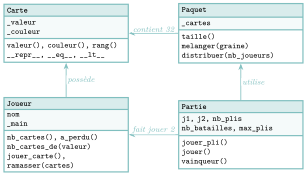

# TP et projets

<p class="sous-titre">Programmation orientée objet et paradigmes</p>

## <span class="etiquette">Projet</span> La Bataille, en objets

*quatre classes qui jouent ensemble*

<p class="infos-activite">Durée : 3 h environ (deux séances) · Sur machine, seul ou par deux</p>

!!! fichiers "Fichiers à télécharger"

    [:material-folder-open: dossier en ligne](https://github.com/MathThibaud/nsi-fichiers-eleves/tree/main/terminale/02-projet-poo){ .md-button } [:material-zip-box: archive .zip](https://github.com/MathThibaud/nsi-fichiers-eleves/raw/main/zips/terminale-02-projet-poo.zip){ .md-button }

!!! encadre "But du projet"

    Programmer **de bout en bout** le jeu de cartes de la Bataille, puis le faire jouer **mille fois** pour répondre à de vraies questions : combien de temps dure une partie ? Avoir des As aide-t-il à gagner ? Une partie peut-elle ne jamais finir ? Le programme repose sur **quatre classes** qui interagissent, avec des attributs **encapsulés**, des **méthodes spéciales** et des **tests** ; les statistiques s’écrivent dans le style **fonctionnel**. <span class="run" title="À programmer et tester sur machine">▶</span>  signale ce qui est à programmer et tester.

!!! consignes "Consignes"

    - L’extension est facultative.

    - Le fichier `projet_poo_depart.py` est **à télécharger** (lien ci-dessus) : squelette des classes et, en fin de fichier, des **tests**. Relancer le fichier après chaque partie : chaque ligne `[A FAIRE]` doit devenir `[OK]`. On ne modifie pas les tests.

    - Tous les attributs dont le nom commence par `_` sont **privés** : en dehors de leur classe, on n’y accède **que** par des méthodes.

    - Usage de l’IA, indiqué sur chaque exercice : <span class="ia ia-rouge" title="Sans IA : le but est l'automatisme lui-même"></span> aucune ; <span class="ia ia-orange" title="IA en appui : déboguer, reformuler, vérifier ; la réponse finale est la vôtre"></span> en appui (déboguer, reformuler, vérifier ; la réponse finale est écrite et comprise par vous) ; <span class="ia ia-vert" title="IA intégrée : l'exercice s'appuie sur une réponse d'IA"></span> l’exercice s’appuie sur une réponse d’IA. Voir la [charte d’usage de l’IA](../charte.md).

!!! encadre "Les règles (version 32 cartes)"

    On utilise un jeu de 32 cartes : huit valeurs (`7`, `8`, `9`, `10`, `Valet`, `Dame`, `Roi`, `As`, de la plus faible à la plus forte) dans quatre couleurs (`pique`, `coeur`, `carreau`, `trefle`). La couleur ne compte pas pour comparer deux cartes.

    - Le paquet est mélangé puis distribué entièrement, une carte à chacun à tour de rôle : 16 cartes par joueur, en tas, faces cachées.

    - À chaque **pli**, chaque joueur retourne la carte du dessus de son tas et la pose sur le **tapis**. La plus forte l’emporte : son propriétaire ramasse **tout le tapis** et le place **sous** son tas.

    - En cas d’égalité, c’est la **bataille** : chacun pose une carte **face cachée**, puis on rejoue (une carte face visible chacun), et ainsi de suite jusqu’à départager. Le gagnant ramasse tout le tapis.

    - Un joueur qui n’a plus de cartes a perdu, y compris au milieu d’une bataille (l’autre ramasse alors le tapis).

## L’architecture du programme

Avant d’écrire la moindre ligne, on fixe les classes, ce qu’elles savent (attributs) et ce qu’elles savent faire (méthodes).

{ .tikz loading=lazy }

### <span class="stars" title="Niveau 1 sur 3">★</span> <span class="exo-num">Exercice 1</span> — Lire l’architecture <span class="ia ia-orange" title="IA en appui : déboguer, reformuler, vérifier ; la réponse finale est la vôtre"></span> { #ex-02-programmation-orientee-objet-et-paradigm-tp-1-1 }

1.  Quelle classe crée des objets d’une autre classe dans son constructeur ? Lesquels ?

2.  Pourquoi `nom` n’est-il pas privé, alors que `_main` l’est ? Donner une action interdite par les règles que l’encapsulation de `_main` rend plus difficile.

3.  Ada a pour tas `Dame de coeur, 9 de pique, Roi de trefle, 7 de coeur` (carte du dessus en premier) et Alan `8 de trefle, 9 de coeur, As de pique, 10 de carreau`. Jouer la partie **à la main** : écrire les deux tas après chaque pli. Qui gagne, et en combien de plis ?

## La classe `Carte`

### <span class="stars" title="Niveau 1 sur 3">★</span> <span class="exo-num">Exercice 2</span> — Une carte qui se présente <span class="ia ia-orange" title="IA en appui : déboguer, reformuler, vérifier ; la réponse finale est la vôtre"></span> { #ex-02-programmation-orientee-objet-et-paradigm-tp-1-2 }

<span class="run" title="À programmer et tester sur machine">▶</span> Compléter le constructeur (il lève `ValueError("carte inconnue")` si la valeur n’est pas dans `VALEURS` ou la couleur pas dans `COULEURS`), les accesseurs `valeur()` et `couleur()`, la méthode `rang()` (position de la valeur dans `VALEURS` : $0$ pour un `7`, $7$ pour un `As`), et `__repr__` :

```text
>>> c = Carte("Roi", "coeur")
>>> c
Roi de coeur
>>> c.rang()
6
```

Pourquoi vaut-il mieux vérifier la valeur **dès le constructeur**, plutôt qu’au moment de comparer deux cartes ?

### <span class="stars" title="Niveau 2 sur 3">★★</span> <span class="exo-num">Exercice 3</span> — Comparer et trier des cartes <span class="horsprog">au-delà du programme</span> <span class="ia ia-orange" title="IA en appui : déboguer, reformuler, vérifier ; la réponse finale est la vôtre"></span> { #ex-02-programmation-orientee-objet-et-paradigm-tp-1-3 }

Le cours a signalé qu’il existe d’autres méthodes spéciales, qui permettent d’utiliser `==` ou `<` sur nos propres objets. Écrire `a == b` déclenche l’appel `a.__eq__(b)` ; écrire `a < b` déclenche `a.__lt__(b)` (*lt* pour *less than*).

1.  <span class="run" title="À programmer et tester sur machine">▶</span> Avant d’écrire ces méthodes, taper les deux instructions suivantes. Que se passe-t-il ? Que compare `==` par défaut ?

    ```text
    >>> Carte("Roi", "coeur") == Carte("Roi", "coeur")
    >>> sorted([Carte("Roi", "coeur"), Carte("7", "pique")])
    ```

2.  <span class="run" title="À programmer et tester sur machine">▶</span> Écrire `__eq__(self, autre)` et `__lt__(self, autre)`, qui comparent les **rangs** (la couleur ne compte pas). Vérifier :

    ```text
    >>> main = [Carte("Roi", "coeur"), Carte("7", "pique"),
    ...         Carte("As", "pique"), Carte("9", "coeur")]
    >>> sorted(main)
    [7 de pique, 9 de coeur, Roi de coeur, As de pique]
    ```

3.  Avec ces définitions, `Carte("Roi", "coeur") == Carte("Roi", "trefle")` vaut `True`. Est-ce un problème pour la Bataille ? Pourrait-ce en être un dans un autre jeu ?

## Les classes `Paquet` et `Joueur`

### <span class="stars" title="Niveau 2 sur 3">★★</span> <span class="exo-num">Exercice 4</span> — Le paquet <span class="ia ia-orange" title="IA en appui : déboguer, reformuler, vérifier ; la réponse finale est la vôtre"></span> { #ex-02-programmation-orientee-objet-et-paradigm-tp-1-4 }

1.  <span class="run" title="À programmer et tester sur machine">▶</span> Le constructeur fabrique les 32 cartes dans l’attribut privé `_cartes`, avec deux boucles `for` imbriquées (une sur les couleurs, une sur les valeurs). *Pour les plus à l’aise :* l’écrire en **une ligne**, avec une liste en compréhension à deux boucles `for`.

2.  <span class="run" title="À programmer et tester sur machine">▶</span> Écrire `taille()`, puis la méthode `melanger(graine=None)`. Si une graine est donnée, elle appelle d’abord `random.seed(graine)` ; dans tous les cas, elle mélange ensuite les cartes avec la fonction `random.shuffle`. À quoi sert la graine pour des tests ?

3.  <span class="run" title="À programmer et tester sur machine">▶</span> Écrire `distribuer(nb_joueurs)` : la carte d’indice `i` va au joueur `i % nb_joueurs` ; le paquet est vide ensuite, et la méthode renvoie la liste des mains.

### <span class="stars" title="Niveau 2 sur 3">★★</span> <span class="exo-num">Exercice 5</span> — Le joueur <span class="ia ia-orange" title="IA en appui : déboguer, reformuler, vérifier ; la réponse finale est la vôtre"></span> { #ex-02-programmation-orientee-objet-et-paradigm-tp-1-5 }

La main est une liste de cartes dont la carte **du dessus** est au **début**.

1.  <span class="run" title="À programmer et tester sur machine">▶</span> Écrire le constructeur, `nb_cartes()`, `a_perdu()`, `jouer_carte()` (retire et renvoie la carte du dessus) et `ramasser(cartes)` (place les cartes reçues, dans l’ordre, sous le tas).

2.  Le test de la partie 3 ajoute une carte à la liste `cartes` **après** avoir créé le joueur, et vérifie que la main d’Ada n’a pas changé. Que faut-il donc écrire dans le constructeur : `self._main = cartes`, ou bien `self._main = list(cartes)` ? Expliquer.

3.  <span class="run" title="À programmer et tester sur machine">▶</span> Écrire `nb_cartes_de(valeur)` en **une ligne**, avec `filter` et une fonction `lambda`. Pourquoi cette méthode est-elle nécessaire pour compter les As d’un joueur depuis l’extérieur de la classe ?

    ??? pouce "Coup de pouce"

        `filter(f, t)` garde les éléments `x` de `t` pour lesquels `f(x)` est vrai ; on compte le résultat avec `len(list(...))`. La fonction `f` reçoit une carte `c` et compare `c.valeur()` à la valeur cherchée.

## La classe `Partie` : faire jouer les objets ensemble

### <span class="stars" title="Niveau 3 sur 3">★★★</span> <span class="exo-num">Exercice 6</span> — Un pli, avec ses batailles <span class="ia ia-orange" title="IA en appui : déboguer, reformuler, vérifier ; la réponse finale est la vôtre"></span> { #ex-02-programmation-orientee-objet-et-paradigm-tp-1-6 }

Le constructeur de `Partie` est fourni : il crée un paquet, le mélange, le distribue et crée les deux joueurs `j1` et `j2`.

<span class="run" title="À programmer et tester sur machine">▶</span> Écrire `jouer_pli()` qui joue un pli complet et **renvoie le joueur** qui ramasse le tapis. Une liste locale `tapis` accumule les cartes posées ; une boucle répète :

1.  si l’un des joueurs n’a plus de cartes, l’autre ramasse le tapis : c’est fini ;

2.  chaque joueur pose une carte ; si l’une est strictement plus forte, son propriétaire ramasse le tapis : c’est fini ;

3.  sinon (égalité), on compte une bataille de plus (`nb_batailles`) et, si les deux joueurs ont encore des cartes, chacun en pose une face cachée sur le tapis ; on recommence.

??? pouce "Coup de pouce"

    Une variable `gagnant`, qui vaut `None` tant que le pli n’est pas joué, et une boucle `while gagnant is None` ; après la boucle, `gagnant` ramasse le tapis et la méthode le renvoie. Les comparaisons s’écrivent `c2 < c1` et `c1 < c2` grâce à `__lt__`. Les cartes posées s’ajoutent au tapis dans l’ordre : carte de `j1`, puis carte de `j2`.

### <span class="stars" title="Niveau 2 sur 3">★★</span> <span class="exo-num">Exercice 7</span> — Une partie entière, et un invariant <span class="ia ia-orange" title="IA en appui : déboguer, reformuler, vérifier ; la réponse finale est la vôtre"></span> { #ex-02-programmation-orientee-objet-et-paradigm-tp-1-7 }

1.  <span class="run" title="À programmer et tester sur machine">▶</span> Écrire `jouer()` : on joue des plis (en comptant `nb_plis`) tant qu’aucun joueur n’a perdu **et** que `max_plis` n’est pas atteint ; on renvoie `self.vainqueur()` (méthode fournie).

2.  <span class="run" title="À programmer et tester sur machine">▶</span> Rejouer avec le programme la partie de l’exercice 1 (créer une `Partie`, puis remplacer `j1` et `j2` par deux `Joueur` construits à la main) et comparer avec votre trace.

3.  Le test de la partie 4 vérifie qu’en fin de partie les deux joueurs ont **32 cartes au total**. Pourquoi cette propriété (un **invariant**) doit-elle être vraie à la fin de chaque pli ? Quelle erreur de programmation ferait-elle échouer ?

4.  <span class="run" title="À programmer et tester sur machine">▶</span> Avec la graine `2026`, qui gagne, en combien de plis ?

## Mille parties : des statistiques en style fonctionnel

On veut maintenant **observer** le jeu. Dans cette partie, on n’écrit **aucune boucle** `for` ou `while` : seulement `map`, `filter`, `sorted`, `min`, `max` et des `lambda`.

### <span class="stars" title="Niveau 2 sur 3">★★</span> <span class="exo-num">Exercice 8</span> — Résumer une partie <span class="ia ia-orange" title="IA en appui : déboguer, reformuler, vérifier ; la réponse finale est la vôtre"></span> { #ex-02-programmation-orientee-objet-et-paradigm-tp-1-8 }

<span class="run" title="À programmer et tester sur machine">▶</span> Écrire `resume(graine, tapis_melange=False)` qui joue la partie « Ada contre Alan » de graine donnée et renvoie un dictionnaire :

```text
>>> resume(2026)
{'graine': 2026, 'vainqueur': 'Alan', 'plis': 106, 'batailles': 8, 'as_ada': 1}
```

où `as_ada` est le nombre d’As d’Ada **avant** de jouer (méthode `nb_cartes_de`). `resume` est-elle une fonction **pure** ? Que deviendrait la réponse si l’on supprimait le paramètre `graine` ?

### <span class="stars" title="Niveau 2 sur 3">★★</span> <span class="exo-num">Exercice 9</span> — Interroger les mille parties <span class="ia ia-orange" title="IA en appui : déboguer, reformuler, vérifier ; la réponse finale est la vôtre"></span> { #ex-02-programmation-orientee-objet-et-paradigm-tp-1-9 }

On calcule `res = list(map(resume, range(1000)))`.

1.  <span class="run" title="À programmer et tester sur machine">▶</span> Avec `filter`, construire la liste `finies` des parties qui ont un vainqueur. Combien y en a-t-il ? Combien Ada en gagne-t-elle ?

2.  <span class="run" title="À programmer et tester sur machine">▶</span> Avec `map`, calculer la **durée moyenne** (en plis) d’une partie finie.

3.  <span class="run" title="À programmer et tester sur machine">▶</span> Avec `sorted(..., key=lambda r: ...)`, afficher les graines des **trois** parties finies les plus longues ; avec `min(..., key=...)`, la plus courte.

4.  <span class="run" title="À programmer et tester sur machine">▶</span> Recopier et compléter le tableau suivant : pour chaque nombre d’As d’Ada au départ, le nombre de parties finies et le pourcentage gagné par Ada. Conclure.

    | **As d’Ada au départ**  |  0  |  1  |  2  |  3  |  4  |
    |:------------------------|:---:|:---:|:---:|:---:|:---:|
    | **Parties finies**      |     |     |     |     |     |
    | **Victoires d’Ada (%)** |     |     |     |     |     |

## Extension : des parties qui ne finissent jamais ?

### <span class="stars" title="Niveau 3 sur 3">★★★</span> <span class="exo-num">Exercice 10</span> — Casser les cycles <span class="ia ia-orange" title="IA en appui : déboguer, reformuler, vérifier ; la réponse finale est la vôtre"></span> { #ex-02-programmation-orientee-objet-et-paradigm-tp-1-10 }

1.  Plus d’un tiers des parties atteignent `max_plis = 2000` sans vainqueur. En augmentant `max_plis` à $20\,000$ pour quelques-unes, vérifier qu’elles ne finissent toujours pas. Proposer une explication : le programme est **déterministe** ; que se passe-t-il s’il retrouve exactement la même situation (mêmes tas) qu’à un pli précédent ?

2.  <span class="run" title="À programmer et tester sur machine">▶</span> Dans une vraie partie, les cartes ramassées ne sont pas reposées dans un ordre fixe. Ajouter à `Partie` une méthode privée `_donner(gagnant, tapis)` qui mélange le tapis si l’attribut `tapis_melange` vaut `True`, puis le fait ramasser ; l’utiliser à chaque ramassage dans `jouer_pli`.

3.  <span class="run" title="À programmer et tester sur machine">▶</span> Refaire les statistiques avec `tapis_melange=True` : nombre de parties finies, durée moyenne, partie la plus longue, victoires d’Ada. Les tests des parties 1 à 5 passent-ils toujours ? Pourquoi est-ce important ?

4.  *(Libre.)* Autres pistes : une partie à trois joueurs ; un affichage pli par pli ; une variante où le gagnant d’une bataille choisit l’ordre du ramassage.

## Bilan à rédiger

### <span class="exo-num">Exercice 11</span> — Ce que j’ai construit <span class="ia ia-orange" title="IA en appui : déboguer, reformuler, vérifier ; la réponse finale est la vôtre"></span> { #ex-02-programmation-orientee-objet-et-paradigm-tp-1-11 }

Rédiger, en une dizaine de lignes, un bilan qui répond aux questions suivantes.

1.  Pour chacune des quatre classes, en une phrase : ce qu’elle représente et la méthode qui vous paraît la plus importante.

2.  Citer un endroit du projet où l’**encapsulation** a imposé d’écrire une méthode plutôt que d’accéder directement à un attribut. Qu’y a-t-on gagné ?

3.  Le projet mêle trois paradigmes. Citer pour chacun (impératif, objet, fonctionnel) un passage de votre code qui l’illustre, et dire pourquoi il convenait à cet endroit.
