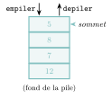
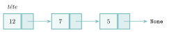
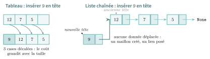

# Cours

<p class="sous-titre">Structures linéaires : piles, files, listes chaînées</p>

<span id="chap-03" class="ancre"></span>

|  |  |
|:---|:---|
| **Programme (BO)** | *« Structures de données : listes, piles, files. Interfaces et implémentations. Distinguer des structures par le jeu des méthodes qui les caractérisent. Écrire et utiliser des programmes manipulant ces structures, indépendamment de leur implémentation. »* |
| **Prérequis** | fonctions, boucles, listes et dictionnaires Python ; notion de classe et de méthode (chapitre *Programmation objet*). |
| **Objectifs** | *distinguer* l’interface d’une structure de son implémentation ; *connaître* le jeu de méthodes qui caractérise une pile et une file ; *utiliser* ces structures pour résoudre un problème (parenthésage, parcours…) ; *comprendre* le rôle des listes chaînées comme brique d’implémentation. |

## Interface et implémentation : le point de vue de l’année

Jusqu’ici, quand vous aviez besoin de ranger plusieurs données, vous preniez une `list` Python sans vous demander *comment* elle est fabriquée à l’intérieur de la machine. C’est exactement l’idée que le programme de Terminale veut rendre explicite.

!!! definition "Définition 1 — Type abstrait de données"

    Un **type abstrait** de données décrit une structure par les **opérations** qu’on peut lui appliquer (son *quoi*), **sans dire comment** elles sont réalisées (son *comment*). La liste des opérations, avec leur nom et leur effet, s’appelle l’**interface** de la structure.

!!! definition "Définition 2 — Implémentation"

    Une **implémentation** est une réalisation concrète de la structure dans un langage donné (avec un tableau, une liste chaînée…) qui **respecte l’interface**. Une même interface admet en général **plusieurs** implémentations.

!!! exemple "Exemple — Un distributeur automatique de boissons"

    L’**interface**, ce sont les boutons : « choisir une canette », « insérer une pièce », « rendre la monnaie ». L’**implémentation**, c’est toute la mécanique cachée derrière la façade. Deux distributeurs de marques différentes offrent *la même interface* (les mêmes boutons) avec *deux mécaniques* totalement différentes. L’utilisateur, lui, n’a pas besoin de savoir laquelle.

!!! regle "Règle 1 — Ce qu’on vous demandera cette année"

    Le plus souvent, vous **utiliserez** une structure à travers son interface, en **admettant** simplement qu’une implémentation existe. Savoir *quelle* méthode appeler, et dans quel ordre, compte davantage que savoir la reprogrammer. On écrira tout de même *une* implémentation possible, pour lever le mystère.

!!! remarque "Remarque"

    C’est le prolongement direct du chapitre *Programmation objet* : une structure de données s’écrit naturellement comme une **classe**, dont les **méthodes** forment l’interface et dont les **attributs** (cachés par *encapsulation*) constituent l’implémentation.

Les trois structures de ce chapitre sont dites **linéaires** : leurs éléments sont rangés les uns à la suite des autres, comme sur une file d’attente. Ce qui les distingue, ce n’est pas leur contenu, c’est **leur jeu de méthodes** — en particulier *par où* on entre et *par où* on sort.

<span id="cours-03-1" class="ancre"></span>

<span class="afaire">▶ Exercices d'application :</span> exercices **[1](exercices.md#ex-03-1) et [2](exercices.md#ex-03-2)** (interface : LIFO ou FIFO)

## La pile (LIFO)

!!! definition "Définition 3 — Pile"

    Une **pile** (*stack*) est une structure linéaire dans laquelle on ne peut ajouter ou retirer un élément que d’un seul côté, appelé le **sommet**. Le dernier élément entré est donc le premier à sortir : on parle de politique **LIFO** (*Last In, First Out*).

L’image classique est une **pile d’assiettes** : on ne peut poser ou prendre qu’*en haut* de la pile ; l’assiette du fond est la dernière accessible.

{ .tikz loading=lazy }

### L’interface d’une pile

| **Méthode**  | **Effet**                                           |
|:-------------|:----------------------------------------------------|
| `est_vide()` | renvoie `True` si la pile ne contient aucun élément |
| `empiler(x)` | pose `x` au sommet de la pile                       |
| `depiler()`  | retire le sommet et le renvoie                      |
| `sommet()`   | renvoie le sommet *sans* le retirer                 |
| `taille()`   | renvoie le nombre d’éléments                        |

!!! regle "Règle 2"

    On n’accède **jamais** directement à un élément « du milieu » d’une pile : la seule porte d’entrée et de sortie est le sommet. Vouloir atteindre le fond oblige à tout dépiler.

!!! exemple "Exemple — Une suite d’opérations"

    On part d’une pile vide `p`. La colonne de droite montre la pile après chaque instruction. Pour gagner de la place, la pile y est **écrite en ligne**, le **sommet à droite** (dessinée verticalement, ce serait le sommet en haut).

    | **Instruction** | **Renvoie** | **Pile écrite en ligne (sommet à droite)** |
    |:----------------|:------------|:-------------------------------------------|
    | `p.empiler(5)`  | —           | $5$                                        |
    | `p.empiler(8)`  | —           | $5\ ;\ 8$                                  |
    | `p.empiler(3)`  | —           | $5\ ;\ 8\ ;\ 3$                            |
    | `p.sommet()`    | `3`         | $5\ ;\ 8\ ;\ 3$                            |
    | `p.depiler()`   | `3`         | $5\ ;\ 8$                                  |
    | `p.depiler()`   | `8`         | $5$                                        |
    | `p.est_vide()`  | `False`     | $5$                                        |

### À quoi sert une pile en informatique ?

La pile n’est pas un jouet : le principe LIFO se retrouve partout dès qu’il faut **se souvenir de la dernière chose à traiter**.

- **La pile d’appels.** Quand une fonction en appelle une autre, la machine *empile* l’endroit où revenir ; au `return`, elle *dépile*. C’est exactement ce qui fait fonctionner la **récursivité** (voir le chapitre correspondant) : chaque appel récursif est empilé, puis les résultats se dépilent en sens inverse.

- **La fonction « Annuler » (`Ctrl+Z`).** Chaque action est empilée ; annuler, c’est dépiler la dernière.

- **Le bouton « Précédent » d’un navigateur.** Les pages visitées sont empilées ; « précédent » dépile la dernière.

- **L’évaluation d’expressions** par un compilateur ou une calculatrice, et la vérification du parenthésage, que nous détaillons maintenant.

### Exemple phare : vérifier un parenthésage

*Problème.* Une expression comme `([]{})` est bien parenthésée : chaque symbole ouvrant est refermé par le bon symbole fermant, dans le bon ordre. Au contraire `([)]` et `(()` sont incorrectes. Comment le vérifier automatiquement ?

*Idée.* À chaque symbole **ouvrant**, on l’**empile** : c’est une promesse « il faudra me refermer ». À chaque symbole **fermant**, on **dépile** : le sommet doit être l’ouvrant *correspondant*. Une pile convient parfaitement, car c’est **toujours la dernière ouverture** qui doit être refermée en premier — du LIFO pur.

L’algorithme ci-dessous n’utilise **que l’interface** de la pile : on **admet** qu’une classe `Pile` est disponible, sans savoir comment elle est faite.

```python
def parenthesage_correct(expr):
    p = Pile()                       # on admet qu'une implementation existe
    correspond = {')': '(', ']': '[', '}': '{'}
    for c in expr:
        if c in "([{":               # une ouvrante : on la met en attente
            p.empiler(c)
        elif c in ")]}":             # une fermante : elle doit solder une ouvrante
            if p.est_vide():         # rien a refermer -> incorrect
                return False
            if p.depiler() != correspond[c]:   # mauvais appariement
                return False
    return p.est_vide()              # correct seulement si tout a ete referme
```

!!! exemple "Exemple — Dérouler l’algorithme sur ([]{}), puis sur ([)]"

    ??? corrige "Correction"

        On suit la pile symbole après symbole.

        <table>
        <thead>
        <tr>
        <th style="text-align: center;"><strong>Symbole</strong></th>
        <th style="text-align: left;"><strong>Action</strong></th>
        <th style="text-align: left;"><strong>Pile écrite en ligne (sommet à droite)</strong></th>
        </tr>
        </thead>
        <tbody>
        <tr>
        <td style="text-align: center;"><code>(</code></td>
        <td style="text-align: left;">empiler</td>
        <td style="text-align: left;"><code>(</code></td>
        </tr>
        <tr>
        <td style="text-align: center;"><code>[</code></td>
        <td style="text-align: left;">empiler</td>
        <td style="text-align: left;"><code>(</code> <code>[</code></td>
        </tr>
        <tr>
        <td style="text-align: center;"><code>]</code></td>
        <td style="text-align: left;">dépiler <code>[</code>, correspond</td>
        <td style="text-align: left;"><code>(</code></td>
        </tr>
        <tr>
        <td style="text-align: center;"><code>{</code></td>
        <td style="text-align: left;">empiler</td>
        <td style="text-align: left;"><code>(</code> <code>{</code></td>
        </tr>
        <tr>
        <td style="text-align: center;"><code>}</code></td>
        <td style="text-align: left;">dépiler <code>{</code>, correspond</td>
        <td style="text-align: left;"><code>(</code></td>
        </tr>
        <tr>
        <td style="text-align: center;"><code>)</code></td>
        <td style="text-align: left;">dépiler <code>(</code>, correspond</td>
        <td style="text-align: left;">(vide)</td>
        </tr>
        <tr>
        <td colspan="2" style="text-align: left;">fin : la pile est vide</td>
        <td style="text-align: left;"><strong>correct</strong></td>
        </tr>
        </tbody>
        </table>

        Sur `([)]`, au symbole `)` on dépile `[` : cela ne correspond pas à `(`, donc **incorrect**. C’est précisément le cas qu’un simple **comptage** ne détecterait pas : `([)]` contient autant de `(` que de `)`, et autant de `[` que de `]` ; seule la pile vérifie l’**ordre** des fermetures.

!!! remarque "Remarque"

    Ce même principe (empiler les ouvertures, dépiler aux fermetures) est utilisé par votre éditeur de code pour surligner les parenthèses appariées, et par tout **compilateur** pour vérifier la syntaxe des accolades et parenthèses.

<span id="cours-03-3" class="ancre"></span>

<span class="afaire">▶ Exercices d'application :</span> exercices **[3](exercices.md#ex-03-3), [6](exercices.md#ex-03-6) à [10](exercices.md#ex-03-10)** (tracer une pile ; parenthésage ; renverser)

## La file (FIFO)

!!! definition "Définition 4 — File"

    Une **file** (*queue*) est une structure linéaire dans laquelle on **ajoute d’un côté** (la queue) et on **retire de l’autre** (la tête). Le premier élément entré est donc le premier à sortir : politique **FIFO** (*First In, First Out*).

L’image est la **file d’attente** devant un guichet : on rejoint la file par la **queue** (ici à gauche) et l’on est servi à la **tête** (ici à droite), « premier arrivé, premier servi ».

{ .tikz loading=lazy }

### L’interface d’une file

| **Méthode**  | **Effet**                                           |
|:-------------|:----------------------------------------------------|
| `est_vide()` | renvoie `True` si la file ne contient aucun élément |
| `enfiler(x)` | ajoute `x` à la queue (en fin de file)              |
| `defiler()`  | retire l’élément de tête et le renvoie              |
| `tete()`     | renvoie l’élément de tête *sans* le retirer         |
| `taille()`   | renvoie le nombre d’éléments                        |

!!! remarque "Remarque — Pile ou file : la seule différence qui compte"

    Piles et files offrent presque les mêmes opérations (ajouter, retirer, tester si vide). Ce qui les **distingue**, c’est *où* le retrait a lieu : au **même** bout que l’ajout pour la pile (LIFO), à l’**autre** bout pour la file (FIFO). C’est un exemple parfait de ce que dit le BO : « distinguer des structures par le jeu des méthodes qui les caractérisent ».

!!! exemple "Exemple — Une suite d’opérations"

    On part d’une file vide `f`.

    | **Instruction** | **Renvoie** | **File (tête à droite)** |
    |:----------------|:------------|:-------------------------|
    | `f.enfiler(22)` | —           | $22$                     |
    | `f.enfiler(19)` | —           | $19\ ;\ 22$              |
    | `f.enfiler(7)`  | —           | $7\ ;\ 19\ ;\ 22$        |
    | `f.tete()`      | `22`        | $7\ ;\ 19\ ;\ 22$        |
    | `f.defiler()`   | `22`        | $7\ ;\ 19$               |
    | `f.defiler()`   | `19`        | $7$                      |

    Comparez avec la pile de la partie précédente : sur les *mêmes* ajouts, la pile aurait ressorti `7` d’abord, la file ressort `22` d’abord.

### À quoi sert une file en informatique ?

Le principe FIFO s’impose dès qu’il faut **traiter les demandes dans l’ordre d’arrivée**, sans favoritisme.

- **Les files d’impression.** Les documents envoyés à une imprimante partagée sont imprimés dans l’ordre où ils sont arrivés.

- **L’ordonnancement des processus** par le système d’exploitation : les tâches en attente du processeur sont gérées dans des files (vous le verrez au chapitre *Processus*).

- **Les tampons (*buffers*).** Les octets reçus du réseau, les caractères tapés au clavier, les images d’une vidéo en *streaming* sont mis en file en attendant d’être consommés dans l’ordre.

- **Le parcours en largeur** d’un arbre ou d’un graphe (*BFS*) utilise une file pour visiter les sommets niveau par niveau (vous l’étudierez aux chapitres *Arbres* et *Graphes*). Symétriquement, le parcours en profondeur utilise, lui, une *pile*.

<span id="cours-03-4" class="ancre"></span>

<span class="afaire">▶ Exercices d'application :</span> exercices **[4](exercices.md#ex-03-4), [5](exercices.md#ex-03-5) et [11](exercices.md#ex-03-11)** (tracer une file ; comparer ; une file avec deux piles)

## Une implémentation possible (à admettre le plus souvent)

Jusqu’ici nous avons *utilisé* piles et files sans les construire. Levons le voile : grâce au chapitre *Programmation objet*, une pile s’écrit en quelques lignes comme une **classe** qui cache une `list` Python.

```python
class Pile:
    def __init__(self):
        self._contenu = []               # attribut cache (encapsulation)

    def est_vide(self):
        return self._contenu == []

    def empiler(self, x):
        self._contenu.append(x)          # ajout en fin de liste = sommet

    def depiler(self):
        return self._contenu.pop()       # retire et renvoie le dernier

    def sommet(self):
        return self._contenu[-1]

    def taille(self):
        return len(self._contenu)
```

De la même façon, une **file** se construit en cachant une `list` : on ajoute à la queue avec `append`, et on retire la tête, c’est-à-dire le *premier* élément, avec `pop(0)`.

```python
class File:
    def __init__(self):
        self._contenu = []               # la tete est au debut de la liste

    def est_vide(self):
        return self._contenu == []

    def enfiler(self, x):
        self._contenu.append(x)          # ajout en fin de liste = queue

    def defiler(self):
        return self._contenu.pop(0)      # retire et renvoie le premier = tete

    def tete(self):
        return self._contenu[0]

    def taille(self):
        return len(self._contenu)
```

!!! remarque "Remarque — Attention au coût de pop(0)"

    Cette file « fonctionne », mais elle est **sournoisement lente**. Retirer le *dernier* élément d’une `list` avec `pop()` est immédiat ; retirer le *premier* avec `pop(0)`, en revanche, oblige Python à **décaler d’une case vers la gauche tous les éléments qui restent**. Sur une file de $n$ éléments, **chaque `defiler` coûte donc $n$ opérations**, contre une seule pour `depiler` sur une pile. Autrement dit, cette implémentation est parfaite pour une pile mais médiocre pour une file. Une *vraie* file efficace s’appuie sur une autre implémentation — une liste chaînée, deux piles, ou le type `collections.deque` de Python. Belle illustration du chapitre : une **même interface** peut cacher des implémentations aux **coûts très différents**.

!!! regle "Règle 3 — L’essentiel à retenir"

    Ces implémentations ne sont **qu’un choix parmi d’autres**. Ce qui compte, et ce que le bac vérifie, c’est de savoir **utiliser** l’interface (`empiler`, `depiler`, `enfiler`, `defiler`, `est_vide`…). Dans la grande majorité des exercices, on écrit simplement `p = Pile()` ou `f = File()` en **admettant** que la classe existe.

!!! remarque "Remarque — Un « faux ami » : la list de Python"

    La `list` de Python *n’est pas* le type abstrait « liste » de ce chapitre : c’est un **tableau dynamique**. Elle permet certes de *simuler* une pile (`append`/`pop`) ou une file, mais elle offre bien plus d’opérations (accès à n’importe quel indice). Restreindre son usage aux seules méthodes de l’interface, c’est justement respecter la structure choisie.

## Les listes chaînées : l’autre grande implémentation

Comment ranger des éléments *à l’intérieur* de la machine ? Il existe deux grandes familles.

!!! definition "Définition 5 — Tableau"

    Un **tableau** range ses éléments dans des cases mémoire **contiguës** (les unes à côté des autres). On accède directement à la case d’indice $i$, mais sa **taille est fixée** : insérer un élément au milieu oblige à tout décaler.

!!! definition "Définition 6 — Liste chaînée"

    Une **liste chaînée** range ses éléments dans des **maillons** dispersés en mémoire. Chaque maillon contient une **valeur** et un **lien** (l’adresse) vers le maillon **suivant**. Un lien spécial (`None`) marque la fin. On accède à la structure par son **premier** maillon, appelé la **tête**.

{ .tikz loading=lazy }

### Pourquoi cette structure ? Le compromis

|  | **Tableau** | **Liste chaînée** |
|:---|:---|:---|
| Accès à l’élément d’indice $i$ | direct, rapide | lent : suivre les liens un à un |
| Taille | fixée à l’avance | grandit à volonté |
| Insérer / supprimer en tête | coûteux (tout décaler) | rapide (rebrancher un lien) |

Insérer un maillon ne demande que de **rebrancher deux liens**, sans déplacer aucune donnée — ce qui rend la liste chaînée idéale pour implémenter une pile ou une file où l’on ajoute et retire sans cesse à une extrémité.

{ .tikz loading=lazy }

!!! remarque "Remarque — À nouveau le faux ami list"

    Le « tableau » de ce comparatif n’est pas non plus la `list` de Python. Celle-ci est un **tableau dynamique** (un tableau qui sait s’agrandir), et surtout elle **n’est pas** une liste chaînée, *malgré son nom* : une `list` Python ne contient aucun « lien vers le suivant », ses éléments restent rangés de façon **contiguë** en mémoire. C’est d’ailleurs pour cela que `pop(0)` y est coûteux (il faut tout décaler), alors que retirer la tête d’une *vraie* liste chaînée est immédiat.

### À quoi servent les listes chaînées en informatique ?

- **Implémenter les piles, les files et les listes** : c’est leur premier usage. Empiler, c’est ajouter un maillon en tête ; dépiler, c’est avancer la tête d’un cran.

- **En langage C**, il n’existe pas de « liste » toute prête comme en Python. Le programmeur construit lui-même une liste chaînée : une `struct` qui contient une valeur et un **pointeur** vers la `struct` suivante, chaque maillon étant réservé en mémoire par `malloc`. C’est un exercice fondateur de tout cours de C.

- **La gestion de la mémoire** par le système : les blocs de mémoire libres sont souvent chaînés entre eux dans une *liste de blocs libres*.

!!! remarque "Remarque"

    En Python, on peut représenter un maillon par un petit objet (chapitre *Programmation objet*) : une classe `Cellule` avec deux attributs, `valeur` (l’élément) et `suivante` (la cellule d’après, ou `None` à la fin). On construit alors une liste en emboîtant les cellules : `Cellule(1, Cellule(2, Cellule(3, None)))`. Nous n’en aurons pas besoin pour la plupart des exercices : là encore, il suffit le plus souvent d’**admettre** l’existence d’une implémentation.

<span id="cours-03-12" class="ancre"></span>

<span class="afaire">▶ Exercices d'application :</span> exercices **[12](exercices.md#ex-03-12) à [15](exercices.md#ex-03-15)** (listes chaînées)

## Ouverture : des structures qu’on retrouvera partout

Piles et files ne sont pas des curiosités isolées : ce sont les **outils de base** de la fin de l’année.

- les **arbres** et les **graphes** se parcourent avec une **file** (en largeur) ou une **pile** (en profondeur) ;

- la **récursivité** repose, en coulisses, sur une pile d’appels ;

- au **bac**, on vous donne l’**interface** d’une pile ou d’une file et l’on demande de **tracer** une suite d’opérations, de **choisir** la bonne structure pour un problème, ou d’**écrire un court algorithme** qui n’utilise que ces méthodes — rarement de reprogrammer la structure elle-même.

!!! remarque "Remarque — Un peu d’histoire"

    L’idée de **pile** apparaît dès **1946** chez **Alan Turing**, qui décrit, pour gérer le retour des sous-programmes, deux opérations qu’il nomme joliment « *bury* » (enterrer) et « *unbury* » (déterrer). Elle est redécouverte et formalisée en Allemagne vers **1955–1957** par **Klaus Samelson** et **Friedrich L. Bauer**, sous le nom de *Kellerprinzip* (« principe du cellier »), et même brevetée. Les **listes chaînées**, elles, sont inventées vers **1955–1956** par **Allen Newell**, **Cliff Shaw** et **Herbert Simon** pour leur langage *IPL* de traitement de l’information, une idée reprise dès **1958** par **John McCarthy** dans le langage **Lisp** (les fameuses « cellules » `cons`). Trois de ces chercheurs — Bauer, Newell, Simon — ont marqué durablement l’informatique ; Simon a même reçu le prix Nobel d’économie *et* le prix Turing.

    \*(image manquante : 03_hist_bauer)\*  
    Friedrich L. Bauer, co-inventeur de la pile

!!! remarque "Remarque — Liens avec d’autres chapitres"

    Ces structures resservent partout : on **parcourt** un **arbre** ou un **graphe** avec une **pile** (parcours en profondeur) ou une **file** (parcours en largeur). La pile est aussi la structure cachée derrière la **récursivité** (la « pile d’appels »). En **réseaux**, une file modélise les paquets en attente dans un routeur. Le système d’exploitation range les **processus** prêts dans une file (ordonnancement), et piles, files et cellules s’écrivent comme des **classes** (programmation objet).

## Bilan — la carte mémoire

| **Notion** | **À retenir** |
|:---|:---|
| Type abstrait / interface | la structure définie par son **jeu de méthodes**, pas par sa réalisation |
| Implémentation | réalisation concrète respectant l’interface (plusieurs possibles) |
| Pile (LIFO) | ajout et retrait au **même** bout (le sommet) ; `empiler` / `depiler` |
| File (FIFO) | ajout à la queue, retrait à la tête ; `enfiler` / `defiler` |
| Usage type pile | pile d’appels, `Ctrl+Z`, « précédent », parenthésage |
| Usage type file | impression, ordonnancement, tampons, parcours en largeur |
| Tableau | cases contiguës, accès direct, taille fixe |
| Liste chaînée | maillons `valeur + lien`, taille libre, insertion rapide |
| Réflexe d’exercice | **admettre** l’implémentation, **utiliser** l’interface |

## Erreurs fréquentes

- **Confondre pile (LIFO) et file (FIFO).** La pile ressort le **dernier** entré, la file le **premier**. *Le réflexe :* pile $=$ Ctrl+Z ; file $=$ file d’attente.

- **Dépiler / défiler une structure vide.** Toujours tester `est_vide` avant `depiler` / `defiler`.

- **Croire que la `list` Python est une liste chaînée.** C’est un **tableau dynamique** (accès direct par indice) ; une liste chaînée suit des **liens** de maillon en maillon.

- **Défiler avec `pop(0)`.** Décaler tout le tableau coûte **O(n)** : mauvaise file. *Le réflexe :* liste chaînée, deux piles ou `collections.deque`.

- **Perdre la suite d’une liste chaînée.** En insérant / supprimant, mettre à jour le lien `suivante` **dans le bon ordre**, sinon on perd des maillons.

- **Ouvrir l’implémentation quand l’énoncé donne l’interface.** On **admet** l’implémentation et on **utilise** seulement les opérations fournies.

## Savoir-faire à maîtriser

*À la fin du chapitre, je sais…*

- distinguer **pile (LIFO)** et **file (FIFO)** et en donner des usages concrets $\to$ ex. [1](exercices.md#ex-03-1), [5](exercices.md#ex-03-5) ;

- utiliser l’**interface** d’une pile (`empiler / depiler / est_vide / sommet`) et d’une file (`enfiler / defiler / est_vide / tete`) $\to$ ex. [2](exercices.md#ex-03-2), [16](exercices.md#ex-03-16) ;

- **dérouler** l’état d’une pile ou d’une file après une suite d’opérations $\to$ ex. [3](exercices.md#ex-03-3), [4](exercices.md#ex-03-4), [5](exercices.md#ex-03-5) ;

- appliquer une pile à un problème (**parenthésage**, évaluation, *annuler*) $\to$ ex. [6](exercices.md#ex-03-6), [7](exercices.md#ex-03-7), [10](exercices.md#ex-03-10) ;

- parcourir une **liste chaînée** (longueur, occurrences, $n$-ième élément) $\to$ ex. [12](exercices.md#ex-03-12), [13](exercices.md#ex-03-13), [14](exercices.md#ex-03-14) ;

- raisonner sur le **coût** des opérations (dont `pop(0)` en O(n)) $\to$ ex. [17](exercices.md#ex-03-17), [20](exercices.md#ex-03-20) ;

- distinguer **interface** et **implémentation** $\to$ ex. [11](exercices.md#ex-03-11), [21](exercices.md#ex-03-21).

## Vers le Grand Oral

Quelques pistes de questions que ce chapitre permet de préparer (à étayer d’un exemple concret) :

- **Pile ou file : comment le choix d’une structure change un algorithme ?** *(parcours en profondeur avec une pile, en largeur avec une file.)*

- **Pourquoi séparer l’interface de l’implémentation ?** *(abstraction : changer l’intérieur sans casser le code qui l’utilise.)*

- **La liste de Python est-elle une liste chaînée ?** *(tableau dynamique, coût de `pop(0)`, ce qu’est une vraie file.)*
